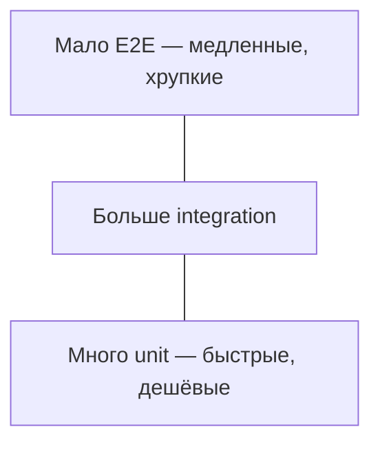

# Тестирование для разработчика

<div class="article-tags">
  <span class="tag tag-required">ОБЯЗАТЕЛЬНО</span>
  <span class="tag tag-beginner">ДЛЯ НОВИЧКОВ</span>
</div>

<span class="complexity-badge">Разработчику</span>
<span class="complexity-badge">Тестировщику</span>

---

## Отладка и тестирование

**Отладка** ([4.14 / Отладка](./111.md)) находит и устраняет **конкретный** дефект в текущем запуске программы. **Тестирование** фиксирует ожидание: при таких входных данных программа **всегда** ведёт себя определённым образом — и ловит **регрессии**, когда вы или коллега меняете код позже.

**Регрессия** — возврат старой ошибки после нового изменения.

Без автоматических тестов каждый фикс проверяют вручную. С тестами одна команда (`pytest`, `npm test`, `dotnet test`) перед commit или в **CI** (Continuous Integration — автоматические проверки на сервере) подтверждает, что ничего не сломалось.

Полный маршрут QA, нагрузка, безопасность — [7.05 Тестирование](/encyclopedia/7-project/7-05-testirovanie/intro). Ниже — минимум, который полезен каждому разработчику.

---

## Виды проверок

| Вид | Кто | Что проверяет | Где углубиться |
|-----|-----|---------------|----------------|
| **Unit** (модульный) | Разработчик | Одна функция или класс изолированно | [7.05](/encyclopedia/7-project/7-05-testirovanie/111) |
| **Integration** (интеграционный) | Разработчик / QA | Несколько модулей, БД, HTTP | [7.05](/encyclopedia/7-project/7-05-testirovanie/112) |
| **E2E** (сквозной) | QA / автоматизация | Сценарий "как пользователь" | [7.05](/encyclopedia/7-project/7-05-testirovanie/119) |
| **Ручное** | QA, разработчик | Новый UI, исследование | [7.05 intro](/encyclopedia/7-project/7-05-testirovanie/intro) |
| **Нагрузочное** | DevOps / QA | Поведение под нагрузкой (RPS — запросов в секунду) | [7.05 / 1014](/encyclopedia/7-project/7-05-testirovanie/1014) |

Разработчик в первую очередь пишет **unit**- и часть **integration**-тестов; **E2E** часто ведёт отдельная роль или CI.

---

## Unit-тест — структура

Классическая схема **Arrange – Act – Assert** (подготовка — действие — проверка):

```
ПСЕВДОКОД
// Arrange — подготовка
a ← 2
b ← 3

// Act — действие
result ← sum(a, b)

// Assert — проверка
если result ≠ 5
    ошибка "ожидали 5"
```

Хороший unit-тест:

- **быстрый** — миллисекунды, без сети и БД, если возможно;
- **детерминированный** — один и тот же результат при каждом запуске;
- **одна причина падения** — одна логическая проверка или связанный блок.

Зависимости подменяют **заглушками** (**mock** — имитация объекта; **stub** — заготовленный ответ) — [Dependency Injection](/encyclopedia/4-code-dev/4-09-zavisimosti/12).

---

## Red – Green – Refactor

Цикл **экстремального программирования** (TDD — Test-Driven Development, разработка через тесты):

1. **Red** — написать тест, который падает (функции ещё нет или поведение неверное).
2. **Green** — минимальный код, чтобы тест прошёл.
3. **Refactor** — улучшить структуру **без** смены поведения; тесты страхуют — [Рефакторинг](/encyclopedia/4-code-dev/4-02-chto-takoe-kod-i-kak-on-rabotaet/612).

Тест **до** кода дисциплинирует API: вы проектируете, как вызывать функцию, а не подстраиваете интерфейс под случайную реализацию.

---

## Инструменты по стеку

| Стек | Фреймворк | Запуск |
|------|-----------|--------|
| Python | pytest, unittest | `pytest` |
| JavaScript / TS | Jest, Vitest | `npm test` |
| Java | JUnit | Maven/Gradle test |
| C# | xUnit, NUnit | `dotnet test` |
| Go | testing + testify | `go test ./...` |

Примеры ASP.NET — [Тесты ASP.NET Core](/encyclopedia/5-languages/5-05-csharp/4516), WPF-практикум — [шаг 5](/encyclopedia/4-code-dev/4-11-desktopnye-prilozheniya/wpf-praktikum/5).

---

## Что тестировать в первую очередь

1. **Бизнес-правила** — скидка, валидация, расчёт суммы.
2. **Граничные случаи** — пустой ввод, ноль, максимум, `null`.
3. **Регрессии** — баг, который уже чинили: тест не даст ошибке вернуться.
4. **Публичный API** модуля — контракт для остального кода.

**Покрытие кода** (coverage) — процент строк, которые выполнили тесты. Цель — покрыть **риск** и **сложность**, а не гнаться за 100% ради цифры.

---

## Тесты и Git / CI

Перед merge в `main` **CI** запускает тесты автоматически — [GitHub Actions — рецепты](/lab/Примеры/1134). Локально полезна привычка:

```bash
# перед push — примеры; команды зависят от проекта
pytest
npm test
dotnet test
```

Падающий тест в CI блокирует merge — это штатная защита качества, а не препятствие.

---

## Пирамида тестирования

**Пирамида тестирования** — модель распределения усилий:



- **Unit** — основание: быстро, много, изолируют логику.
- **Integration** — середина: БД, HTTP, несколько модулей.
- **E2E** — вершина: полный сценарий в браузере; дорого поддерживать.

Новичку достаточно **3–10 unit-тестов** на pet-проект — [114 pet-проект](/encyclopedia/4-code-dev/4-14-razrabotka-i-otladka/114). E2E подключайте, когда есть стабильный UI — [7.05 / 119](/encyclopedia/7-project/7-05-testirovanie/119).

---

## Пример unit-теста на Python (pytest)

Функция:

```python
def discount(price: float, percent: int) -> float:
    if percent < 0 or percent > 100:
        raise ValueError("percent must be 0..100")
    return price * (100 - percent) / 100
```

Тест `test_discount.py`:

```python
import pytest
from pricing import discount

def test_no_discount():
    assert discount(100, 0) == 100

def test_half_price():
    assert discount(200, 50) == 100

def test_invalid_percent():
    with pytest.raises(ValueError):
        discount(100, -1)
```

Запуск:

```bash
pip install pytest
pytest -v
```

**assert** — проверка "ожидали X, получили Y". **pytest.raises** — ожидаем исключение.

---

## Пример unit-теста на JavaScript (Jest)

```javascript
// sum.js
function sum(a, b) {
  return a + b;
}
module.exports = { sum };

// sum.test.js
const { sum } = require('./sum');

test('adds 2 + 3', () => {
  expect(sum(2, 3)).toBe(5);
});

test('adds negative', () => {
  expect(sum(-1, 1)).toBe(0);
});
```

```bash
npm init -y
npm install --save-dev jest
# в package.json: "scripts": { "test": "jest" }
npm test
```

---

## Фикстуры (fixtures)

**Фикстура** — подготовка данных или окружения **перед** тестом, общая для нескольких тестов.

```python
import pytest

@pytest.fixture
def sample_user():
    return {"id": 1, "name": "Anna", "role": "user"}

def test_user_name(sample_user):
    assert sample_user["name"] == "Anna"
```

Фикстура создаёт **свежий** объект для каждого теста — тесты не портят друг другу данные.

---

## Параметризация — один тест, много входов

```python
@pytest.mark.parametrize("price,percent,expected", [
    (100, 0, 100),
    (100, 10, 90),
    (50, 50, 25),
])
def test_discount_cases(price, percent, expected):
    assert discount(price, percent) == expected
```

Три сценария — три строки в отчёте pytest без копипасты.

---

## Mock и stub — подробнее

| Термин | Роль |
|--------|------|
| **Stub** | Отдаёт заранее заданный ответ ("БД вернула user_1") |
| **Mock** | Записывает, как вызывали ("метод save вызван 1 раз") |
| **Fake** | Упрощённая реализация (in-memory БД вместо PostgreSQL) |

Зачем: unit-тест **не должен** ходить в реальную почту или prod-БД. Подменяете зависимость — [Dependency Injection](/encyclopedia/4-code-dev/4-09-zavisimosti/12).

```python
from unittest.mock import Mock

def test_send_welcome(mocker):
    mailer = Mock()
    register_user(mailer, "a@test.com")
    mailer.send.assert_called_once()
```

---

## Integration-тест — пример

Проверка HTTP API с тестовой БД:

```python
def test_create_task(client, db):
    response = client.post("/api/tasks", json={"title": "Test"})
    assert response.status_code == 201
    assert db.query(Task).count() == 1
```

`client` — тестовый HTTP-клиент фреймворка (FastAPI TestClient, Django test client). БД — отдельная test- база или SQLite in-memory.

---

## Именование тестов

Хорошее имя **описывает сценарий**:

- `test_discount_returns_zero_when_price_is_zero`
- `test_login_fails_with_wrong_password`

Плохое:

- `test1`, `test_discount`, `works`.

При падении в CI имя — первое, что читает разработчик.

---

## Flaky test — "плавающий" тест

**Flaky test** — иногда зелёный, иногда красный **без** изменения кода. Причины:

- зависимость от времени (`sleep`, deadline);
- порядок тестов (общая глобальная переменная);
- сеть или внешний API;
- race condition в многопоточном коде.

Лечение: убрать `sleep`, фиксировать seed random, мокать сеть, изолировать тесты — [Как искать баг](./1119.md).

---

## Покрытие кода (coverage)

```bash
pytest --cov=myapp --cov-report=term-missing
```

Показывает строки, которые **не выполнились** в тестах. Полезно найти "дыры", но **100% coverage ≠ нет багов** — можно вызвать строку, не проверив результат.

---

## CI — минимальный pipeline

```yaml
# фрагмент .github/workflows/test.yml
jobs:
  test:
    runs-on: ubuntu-latest
    steps:
      - uses: actions/checkout@v4
      - uses: actions/setup-python@v5
        with:
          python-version: "3.12"
      - run: pip install -r requirements.txt
      - run: pytest
```

Полные рецепты — [Lab / 1134](/lab/Примеры/1134), [8.04 DevOps](/encyclopedia/8-infra-security/8-04-devops-ci-cd/intro).

---

## Чек-лист перед merge

- [ ] Локально `pytest` / `npm test` зелёные
- [ ] Новое поведение покрыто тестом
- [ ] Нет `@pytest.mark.skip` без причины
- [ ] CI на PR зелёный
- [ ] Ревьюер видел тесты в diff — [117 PR](/encyclopedia/4-code-dev/4-13-osnovy-raboty-s-git/117)

---

## Когда тест писать не обязательно (но осторожно)

- одноразовый скрипт миграции;
- прототип на выброс;
- чистый UI-layout без логики.

В prod-коде с бизнес-правилами тесты **ожидаются** командой.

---

## Отладка и тест — сравнение

| | Отладка | Тест |
|--|---------|------|
| Когда | Баг уже проявился | До или после фикса |
| Результат | Понимание + патч | Автоматическая проверка |
| Повторяемость | Ручная | Скрипт в CI |
| Инструмент | Breakpoint, лог | pytest, Jest, … |

Идеальный цикл: воспроизвели баг → **написали падающий тест** → починили → тест зелёный → commit. Поиск бага — [Как искать баг](./1119.md).

---

## Связь с другими темами

- **Рефакторинг** без тестов рискован — [612](/encyclopedia/4-code-dev/4-02-chto-takoe-kod-i-kak-on-rabotaet/612).
- **Легаси** — characterization tests — [7.11](/encyclopedia/7-project/7-11-legasi-kod/3).
- **Pet-проект** — "3–5 тестов" в чек-листе — [114](/encyclopedia/4-code-dev/4-14-razrabotka-i-otladka/114).
- **Конструирование ПО** (SDLC) — [7.12](/encyclopedia/7-project/7-12-konstruirovanie-po/intro).
- **Код-ревью** — ревьюер смотрит, есть ли тесты — [117](/encyclopedia/4-code-dev/4-13-osnovy-raboty-s-git/117).

---

## Что дальше

Углубление — весь раздел [7.05 Тестирование](/encyclopedia/7-project/7-05-testirovanie/intro): виды QA, API-тесты, автоматизация, нагрузка, тестирование ИБ.

---
