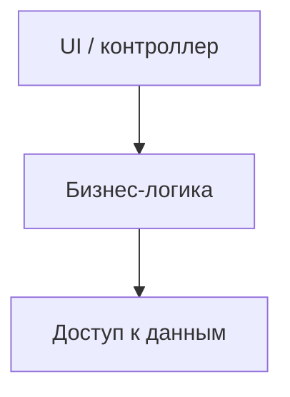

# Как читать чужой код

<div class="article-tags">
  <span class="tag tag-required">ОБЯЗАТЕЛЬНО</span>
  <span class="tag tag-beginner">ДЛЯ НОВИЧКОВ</span>
</div>

<span class="complexity-badge">Разработчику</span>
<span class="complexity-badge">Архитектору</span>

---

## Главное правило

**Не читайте всё подряд.** Репозиторий на десятки тысяч строк нельзя освоить за один вечер. Читайте **целенаправленно**: от симптома или задачи к точке входа, затем — только связанные модули.

Чужой код — норма первой работы и open source. Навык чтения так же важен, как написание.

---

## Алгоритм входа в проект

| Шаг | Действие |
|-----|----------|
| 1 | **README**, `docs/`, схема в wiki — назначение проекта и как собрать |
| 2 | **Точка входа** — `main`, `Program.cs`, `index.js`, `manage.py` |
| 3 | **Сценарий** — один пользовательский путь (логин, создание заказа) |
| 4 | **Слои** — UI → сервис → репозиторий → БД |
| 5 | **Зависимости** — кто кого вызывает (IDE: Find References, graph) |
| 6 | **Тесты** — показывают ожидаемое поведение |
| 7 | **Git history** — `git log -p -- path/to/file` — история изменений |

Структура папок — [Организация структуры кодовой базы](./116.md). Legacy-системы — [7.11 Легаси-код](/encyclopedia/7-project/7-11-legasi-kod/intro).

---

## Точка входа

**Точка входа** (entry point) — место, где ОС или **runtime** (среда выполнения) **начинает** выполнение:

- консоль: `static void Main`, `if __name__ == "__main__"`;
- веб: `Program.cs` + `Startup`, `app.js` + router, `wsgi.py`;
- job: `cron` → скрипт из README.

От entry point проследите **первый HTTP-маршрут** или **первую команду CLI**, которая относится к вашей задаче. Маршруты и HTTP — [Веб-разработка](/encyclopedia/4-code-dev/4-17-veb-razrabotka/1).

---

## Слои и логические блоки

Разбейте код на **блоки ответственности**:



| Слой | Вопрос при чтении |
|------|-------------------|
| UI | Откуда приходят данные формы? |
| Логика | Какие правила и исключения? |
| Данные | SQL, ORM, внешний API? |

Сначала разберите **правило** в сервисе, потом углубляйтесь в ORM. [MAPPER и культура кода](/encyclopedia/7-project/7-10-kultura-koda/5) помогают сопоставить код с предметной областью.

---

## Граф зависимостей

**Граф зависимостей** (dependency graph) — кто импортирует или **инжектит** (передаёт через конструктор) кого. IDE строит **Call Hierarchy**, **Find All References**, diagram imports.

Практика:

1. Откройте класс или функцию из задачи.
2. Посмотрите **вверх** — кто вызывает (контроллер? тест?).
3. Посмотрите **вниз** — что вызывает сам (БД? почта?).

"Божественный объект" на 3000 строк — признак, что граф разросся; ищите **швы** для понимания — [Безопасные изменения в легаси](/encyclopedia/7-project/7-11-legasi-kod/3).

---

## Методики чтения

### Top-down (сверху вниз)

Сначала архитектура (README, диаграмма), потом детали. Подходит для **нового** проекта.

### Bottom-up (снизу вверх)

От одного бага или unit-теста вглубь. Подходит для **точечной** задачи — [Как искать баг](./1119.md).

### По тестам

Тесты — исполняемая спецификация. [Characterization tests](/encyclopedia/7-project/7-11-legasi-kod/3) фиксируют поведение legacy до рефакторинга — [Тестирование для разработчика](./1117.md).

### Псевдокод на русском

Перепишите метод блоками:

```
Шаг 1 — загрузить пользователя по id
Шаг 2 — если не найден — ошибка 404
Шаг 3 — применить скидку
Шаг 4 — сохранить заказ
```

Так же учат в [4.01–4.03](/encyclopedia/4-code-dev/code-dev) — привычка снимает страх синтаксиса.

---

## Пошаговый разбор входа в репозиторий

Допустим, задача: "исправить баг при сохранении профиля". План чтения:

| Шаг | Действие | Инструмент |
|-----|----------|------------|
| 1 | Найти текст кнопки или URL `/profile` | поиск по проекту (Ctrl+Shift+F) |
| 2 | Открыть обработчик сохранения | Go to Definition |
| 3 | Проследить вызов в сервис | Call Hierarchy |
| 4 | Найти запрос к БД или API | Find References |
| 5 | Прочитать тест `test_save_profile` | список тестов в IDE |
| 6 | `git log -p -- path/to/profile_service.py` | терминал |

Не открывайте `utils/` "на будущее" — только цепочка от симптома.

---

## Структура типичного веб-проекта

```
project/
├── README.md
├── package.json / pyproject.toml / *.csproj
├── src/
│   ├── controllers/   # HTTP — точки входа запросов
│   ├── services/      # бизнес-правила
│   ├── repositories/  # доступ к БД
│   └── models/        # сущности данных
├── tests/
└── docs/
```

Имена папок различаются (`handlers`, `api`, `domain`), **слои** — одинаковые. Подробнее — [116 организация](/encyclopedia/4-code-dev/4-14-razrabotka-i-otladka/116).

---

## Файлы конфигурации — что искать

| Файл | Содержит |
|------|----------|
| `README.md` | сборка, запуск, архитектура |
| `.env.example` | какие переменные нужны (без секретов) |
| `package.json` | скрипты `npm start`, `npm test`, зависимости |
| `docker-compose.yaml` | какие сервисы поднимаются локально |
| `appsettings.json` / `config.py` | порты, строки подключения |
| `.editorconfig` | отступы, кодировка |

[Контейнеры](/encyclopedia/4-code-dev/4-04-proekt-i-freymvorki/104), [`.env`](/encyclopedia/4-code-dev/4-14-razrabotka-i-otladka/1112).

---

## IDE — инструменты чтения (VS Code)

- **Go to Definition** (F12) — перейти к объявлению функции.
- **Peek Definition** (Alt+F12) — посмотреть без ухода с места.
- **Find All References** (Shift+F12) — кто вызывает.
- **Call Hierarchy** — дерево вызовов вверх/вниз.
- **Outline** — структура файла (классы, методы).
- **Breadcrumbs** — путь по символам вверху редактора.
- **GitLens** (расширение) — blame, история строки.

[DevTools](/encyclopedia/4-code-dev/4-14-razrabotka-i-otladka/1116) — для фронтенда в браузере.

---

## git blame и git log

**git blame** — кто и когда изменил каждую строку:

```bash
git blame src/services/order.py
```

**git log** — история коммитов по файлу:

```bash
git log --oneline -- src/services/order.py
git log -p -3 -- src/services/order.py   # последние 3 с diff
```

Сообщение коммита часто объясняет **почему** код выглядит странно — [1141 типовые Git](/encyclopedia/4-code-dev/4-13-osnovy-raboty-s-git/1141).

---

## Чтение HTTP-маршрутов

Пример (псевдо-Express / FastAPI):

```
POST /api/users/:id/profile  →  ProfileController.update
GET  /api/users/:id          →  UserController.show
```

Найдите регистрацию маршрутов (`app.get`, `@app.post`, `MapController`) — оттуда цепочка в контроллер → сервис. [HTTP и REST](/encyclopedia/4-code-dev/4-17-veb-razrabotka/1).

---

## Паттерны, которые часто встречаются

### MVC (Model – View – Controller)

- **Model** — данные и правила;
- **View** — UI (HTML, React);
- **Controller** — принимает запрос, вызывает model, отдаёт view.

### Repository

Слой **Repository** скрывает SQL/ORM от сервиса:

```
UserService → UserRepository → PostgreSQL
```

Сервис не пишет `SELECT` напрямую — проще тестировать с fake repository.

### Dependency Injection

Зависимости передают **извне** (конструктор, параметр), а не создают внутри `new Database()`. Упрощает подмену в тестах — [4.09 / 12](/encyclopedia/4-code-dev/4-09-zavisimosti/12).

---

## Таймбоксинг — сколько читать

| Задача | Разумный лимит |
|--------|----------------|
| Мелкий баг | 1–2 часа чтения + repro |
| Новая фича в знакомом модуле | полдня |
| Вход в новый проект | 1–3 дня на README + один сценарий |

Если за 2 часа не нашли entry point — спросите коллегу "с какого файла начать?", не стесняйтесь.

---

## Вопросы команде (шаблон)

- Где точка входа для сценария X?
- Есть ли диаграмма архитектуры?
- Какой тест ближе всего к задаче?
- Есть ли feature flag или legacy-ветка?
- Кого тегнуть в PR по этому модулю?

---

## Чек-лист онбординга в код

- [ ] Проект собирается локально по README
- [ ] Тесты запускаются (`pytest`, `npm test`)
- [ ] Прочитан один end-to-end сценарий от UI/CLI до БД
- [ ] Понятны слои (UI / service / data)
- [ ] Настроена IDE (Go to Definition работает)
- [ ] Известно, как оформить PR — [117](/encyclopedia/4-code-dev/4-13-osnovy-raboty-s-git/117)

---

## Legacy и сложный код

| Симптом | Что делать |
|---------|------------|
| Нет тестов | Написать **characterization test** перед правкой — [7.11 / 3](/encyclopedia/7-project/7-11-legasi-kod/3) |
| Непонятные имена | Переименовать локально + IDE refactor, маленькими PR |
| Комментарий "не трогать" | Выяснить историю в `git blame`, спросить команду |
| Копипаста | Искать **отличия** копий — там часто баг |

[Что такое легаси](/encyclopedia/7-project/7-11-legasi-kod/1), [Понимание системы](/encyclopedia/7-project/7-11-legasi-kod/2), [Стратегии модернизации](/encyclopedia/7-project/7-11-legasi-kod/4).

---

## Стили и соглашения

Один проект — один **стиль** (отступы, имена, слои). Найдите:

- `CONTRIBUTING.md`, `.editorconfig`, линтер-конфиг;
- [Стили кода](/encyclopedia/4-code-dev/4-02-chto-takoe-kod-i-kak-on-rabotaet/6);
- как в проекте именуют ветки и PR — [Git / 114](/encyclopedia/4-code-dev/4-13-osnovy-raboty-s-git/114).

В первом PR придерживайтесь **стиля репозитория**, а не личных предпочтений.

---

## Чтение при code review

Ревью — чтение **diff** (разницы изменений), а не всего файла. Те же вопросы: логика, границы, тесты, безопасность — [Код-ревью и PR](/encyclopedia/4-code-dev/4-13-osnovy-raboty-s-git/117).

---

## Чего избегать

- Читать файл за файлом по алфавиту.
- Менять код до понимания причин текущей реализации.
- Стыдиться вопросов автору или в issue.
- Полагаться только на ИИ-summary без проверки по исходникам.

---

## Связанные материалы

- [Отладка](./111.md) — когда чтение не хватает, нужен runtime.
- [Как искать баг](./1119.md) — воспроизведение сужает область чтения.
- [Типовые задачи разработчика](./101.md) — куда смотреть по типу задачи.

---
