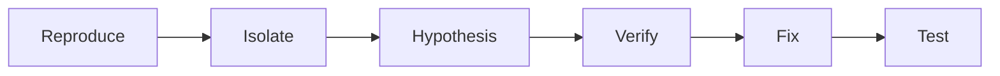
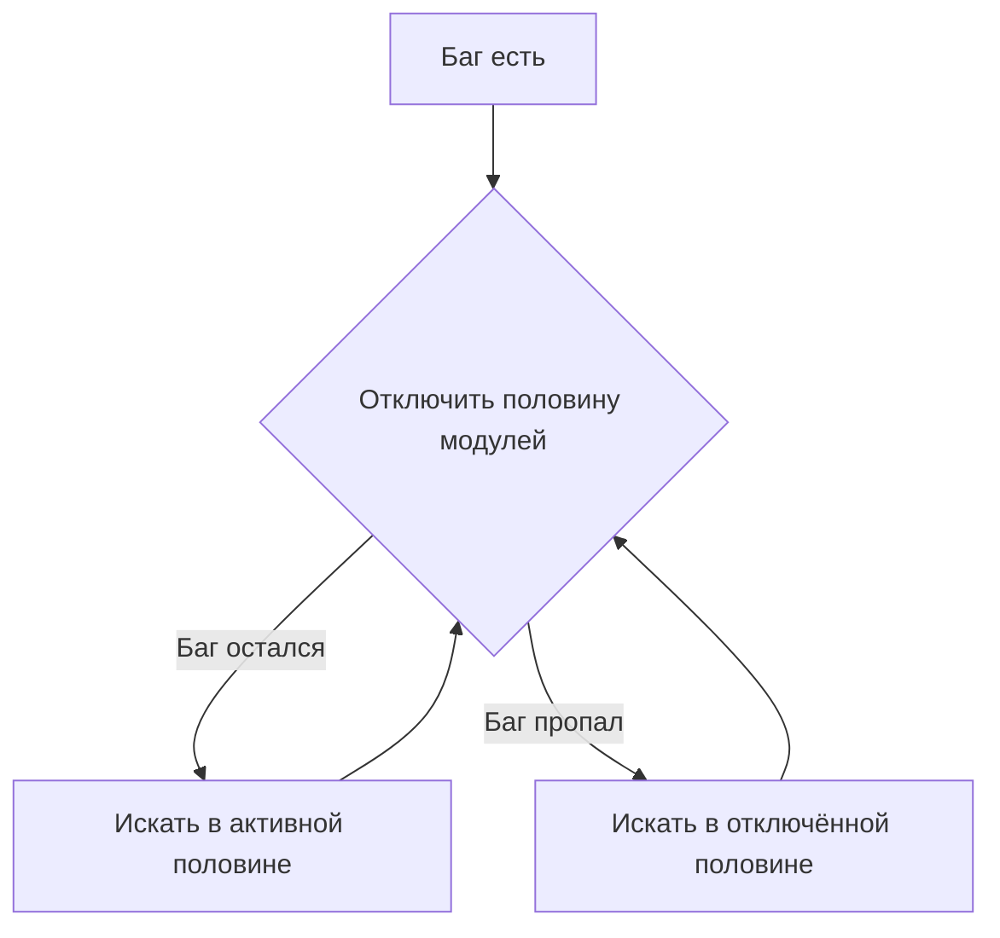

# Как искать баг

<div class="article-tags">
  <span class="tag tag-required">ОБЯЗАТЕЛЬНО</span>
  <span class="tag tag-beginner">ДЛЯ НОВИЧКОВ</span>
</div>

<span class="complexity-badge">Разработчику</span>

---

## Цикл поиска бага



| Шаг | Суть |
|-----|------|
| **Reproduce** | Стабильно воспроизвести |
| **Isolate** | Сузить место и условия |
| **Hypothesis** | Одна проверяемая догадка |
| **Verify** | Отладчик, лог, эксперимент |
| **Fix** | Минимальное исправление |
| **Test** | Регрессионный тест + ручная проверка |

Подробно про отладчик — [Отладка](./111.md). После фикса — [Тестирование для разработчика](./1117.md).

---

## Шаблон баг-репорта

Заполните **до** копания в код:

```markdown
## Шаги
1. Открыть /tasks
2. Нажать "Добавить"
3. Ввести пустой заголовок
4. Нажать "Сохранить"

## Ожидание
Сообщение "заголовок обязателен"

## Факт
Белый экран, в Console TypeError

## Окружение
- OS: Windows 11
- Browser: Chrome 122
- Версия: commit abc123, dev

## Логи / скрин
[вставить stack trace]
```

Хороший отчёт экономит часам команде — [7.05 QA](/encyclopedia/7-project/7-05-testirovanie/intro).

---

## 1. Воспроизведение — разбор по типам багов

### UI не обновился

- Hard refresh (Ctrl+Shift+R);
- DevTools → Network — ушёл запрос? статус? — [1116](./1116.md);
- ответ JSON — те ли поля?

### 500 на сервере

- stack trace в логах сервера;
- воспроизвести через **curl** с тем же body — [1133](/encyclopedia/2-system-network/2-05-terminal/1133);
- последний деплой / merge в `main`.

### "Иногда работает"

- время суток, timezone;
- конкурентные запросы (race);
- кэш CDN или браузера;
- `git bisect` — [1141](/encyclopedia/4-code-dev/4-13-osnovy-raboty-s-git/1141).

### Регресс после релиза

- diff релиза;
- feature flag включился?
- миграция БД применилась?

---

## 2. Изоляция — бинарный поиск подробно



Пример: закомментируйте вызов `sendEmail()` — баг ушёл? Проблема в почте или mock. Отключите валидацию — баг ушёл? Смотрите validator.

**Минимальный repro** — smallest input, smallest code:

```python
# вместо 1000 строк — 10
def test_empty_title():
    assert validate_title("") == False  # падает
```

---

## 3. Гипотеза — журнал экспериментов

Ведите блокнот (или комментарий в issue):

| # | Гипотеза | Эксперимент | Результат |
|---|----------|-------------|-----------|
| 1 | null userId | breakpoint на line 42 | userId = null ✓ |
| 2 | CORS | curl без браузера | 200 OK — отпадает |
| 3 | неверный Content-Type | проверить header | application/text ✗ |

Одна строка — один эксперимент. Не смешивайте три правки в одном commit.

---

## 4. Проверка — уровни логирования

| Уровень | Когда |
|---------|--------|
| **DEBUG** | значения переменных, dev |
| **INFO** | "запрос обработан", prod |
| **WARN** | подозрительно, но работает |
| **ERROR** | исключение, stack trace |

```python
import logging
log = logging.getLogger(__name__)
log.debug("user_id=%s", user_id)
```

Prod — без `print`; структурированные логи — [1111 логирование](./1111.md).

### Breakpoint — что смотреть

- значения аргументов функции;
- условие `if` — true или false;
- стек вызовов (кто вызвал);

[Отладка ./111.md](./111.md).

---

## 5. Fix — антипаттерны

| Плохо | Лучше |
|-------|-------|
| `try/except: pass` | обработать причину |
| `if user_id == 5` хардкод | исправить источник id |
| копипаста fix в 5 файлов | одна функция + тест |
| `@ts-ignore` / `# noqa` | понять тип или валидацию |

[1115 типичные ошибки](./1115.md).

---

## 6. Test — регрессионный тест

```python
def test_empty_title_rejected():  # GitHub issue #42
    response = client.post("/tasks", json={"title": ""})
    assert response.status_code == 400
    assert "title" in response.json()["error"]
```

Имя теста ссылается на issue — через год понятно, **какой** баг не должен вернуться — [1117](./1117.md).

---

## Heisenbug и race condition

**Heisenbug** — пропадает, когда смотрите (breakpoint, лог). **Race condition** — два потока/запроса меняют данные одновременно.

Признаки:

- баг только под нагрузкой;
- "не воспроизводится локально";
- разный порядок логов.

Инструменты: stress-тест, `-race` в Go, лог с correlation id — [112 производительность](./112.md).

---

## Prod и local — чем отличаются

| Фактор | Local | Prod |
|--------|-------|------|
| Данные | мало, тестовые | миллионы записей |
| Конфиг | `.env` dev | секреты в vault |
| HTTPS | часто HTTP | TLS, другие cookie |
| Кэш | выключен | Redis, CDN |

Баг "только на prod" — проверьте данные (null, дубликаты), конфиг, права — [1112 .env](/encyclopedia/4-code-dev/4-14-razrabotka-i-otladka/1112).

---

## Минимальный repro для issue в библиотеке

1. Новый пустой проект.
2. Одна зависимость — проблемная версия.
3. 10–20 строк кода, воспроизводящие баг.
4. Версии OS, runtime, библиотеки в описании.

Без repro upstream часто закрывает issue.

---

## 1. Воспроизведение (Reproduce)

Без воспроизведения вы не знаете, **исправили** ли проблему.

Зафиксируйте:

- **шаги** (1, 2, 3…);
- **окружение** (ОС, браузер, версия, dev/prod);
- **входные данные** (файл, JSON, пользователь);
- **ожидание** — что должно произойти;
- **факт** — что произошло на самом деле;
- **stack trace** (трассировка стека — цепочка вызовов до ошибки), скрин, лог (время, correlation id).

Если баг "плавает" — ищите общее (нагрузка, час, конкретный аккаунт). `git bisect` находит коммит-виновник — [типовые ситуации Git](/encyclopedia/4-code-dev/4-13-osnovy-raboty-s-git/1141#найти-коммит-который-всё-сломал-bisect).

---

## 2. Изоляция (Isolate)

Сужайте область:

| Вопрос | Действие |
|--------|----------|
| Фронт или бэк? | DevTools Network — ушёл запрос? какой статус? — [1116](./1116.md) |
| Один модуль? | Отключите половину кода / закомментируйте ветку (временно) |
| Данные? | Минимальный пример: один пользователь, одна запись |
| Недавнее изменение? | `git log`, diff последнего деплоя |

**Бинарный поиск**: отключите половину системы — баг остался? повторите на половине половины. Чтение кода по цепочке — [Как читать чужой код](./1118.md).

---

## 3. Гипотеза (Hypothesis)

Одна формулировка за раз:

- "Падает, потому что `userId` null после десериализации JSON".
- "404, потому что роут не зарегистрирован в dev-сервере".
- "CORS, потому что API не отдаёт заголовок для origin фронта" — [CORS](/encyclopedia/2-system-network/2-03-set-i-internet/411).

Не меняйте пять вещей сразу — не поймёте, что помогло.

---

## 4. Проверка (Verify)

| Инструмент | Когда |
|------------|--------|
| **Breakpoint** (точка останова) | Значения переменных в момент сбоя — [Отладка](./111.md) |
| **Лог** | Prod, где breakpoint нельзя — [Логирование](./1111.md) |
| **Console / Network** | Веб — [DevTools](./1116.md) |
| **curl** | API без UI — [1133](/encyclopedia/2-system-network/2-05-terminal/1133) |
| **print** | Быстрый черновик; для сложного случая замените на лог или отладчик |

Подтвердили гипотезу — фикс. Опровергли — **новая** гипотеза, не копайте дальше в ложном направлении.

---

## 5. Исправление (Fix)

- **Минимальный** diff: fix отдельно, рефакторинг — другим commit/PR.
- Устраните **причину**, а не только симптом (если данные неверны, одного `try/catch` мало).
- Проверьте **соседние** места с той же ошибкой (копипаста).

Типовые ловушки — [1115](./1115.md) (N+1, SQLi, CORS, секреты в коде).

---

## 6. Тест и регрессия (Test)

1. Тест, который **падал** до фикса и **зелёный** после — [1117](./1117.md).
2. Ручной сценарий из шага Reproduce — снова OK.
3. Если баг из prod — мониторинг/алерт не должен повториться.

---

## Частые ловушки мышления

| Ловушка | Что делать вместо |
|---------|-------------------|
| "Сразу перепишу" | Сначала понять причину |
| Print везде | Точечный лог или breakpoint |
| "Виню кэш браузера" | Hard refresh, потом Network |
| Копировать fix из Stack Overflow | Проверить версию стека и контекст |
| ИИ "исправил" | Запустить тесты и repro руками |

---

## Когда эскалировать

- Нет доступа к prod-логам — DevOps / on-call.
- Баг в сторонней библиотеке — минимальный repro, issue upstream.
- Данные повреждены — DBA + бэкап, не "починить SQL на глаз".

---

## Связанные материалы

- [Как читать чужой код](./1118.md)
- [Анализ производительности](./112.md) — если баг = "медленно", а не "неверно"
- [Типовые задачи разработчика](./101.md) — раздел "Баги и отладка"

---
