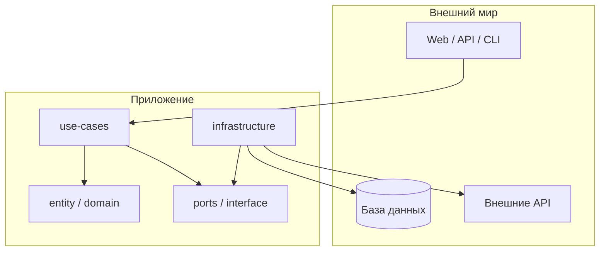

import CleanArchitectureLayersPlay from '@site/src/components/CleanArchitectureLayersPlay.jsx';
import ArchiStylerPlay from '@site/src/components/ArchiStylerPlay.jsx';

# Организация структуры кодовой базы

<div class="article-tags">
  <span class="tag tag-required">ОБЯЗАТЕЛЬНО</span>
  <span class="tag tag-beginner">ДЛЯ НОВИЧКОВ</span>
</div>

<span class="complexity-badge">Разработчику</span>
<span class="complexity-badge">Архитектору</span>
<span class="complexity-badge">Инженеру</span>

<div class="callout callout--info">
  <div class="callout-title">Связанные материалы</div>

  <div class="callout-body">
  Процесс разработки и сдачи кода — [Процесс разработки ПО](./1). Оформление репозитория — [README — полное руководство](./117). Архитектура solution на .NET — [Clean Architecture на ASP.NET Core](/encyclopedia/7-project/7-06-proektirovanie-i-arhitektura/design/2143). Паттерны и слои в проектировании — [раздел 7.06 «Проектирование и архитектура»](/encyclopedia/7-project/7-06-proektirovanie-i-arhitektura/intro).
</div>
  </div>


---

## Структура кодовой базы в "чистой архитектуре"

### Структура кодовой базы - навигация и границы модулей

Отличный пример структуры папок — это проявление **слоистой архитектуры** с элементами **hexagonal (ports & adapters)** и **domain-driven Проектирование**. 

Сначала без снобизма, на пальцах - суть в том, чтобы не сваливать весь код в одну кучу, а разложить по папкам так, чтобы бизнес-логика не зависела от базы данных, API или фреймворков.

На пальцах разложим роли (в коде им часто соответствуют папки):

| Роль | Смысл | Пример |
|------|--------|--------|
| **Сущность** | То, что «есть» в предметной области, с правилами | `Order`, `User` — заказ нельзя оплатить дважды |
| **Действие (use-case)** | Что система делает по запросу | «Оформить заказ», «Зарегистрировать пользователя» |
| **Обещание (port)** | «Мне нужен способ сохранить», без SQL внутри | `IOrderRepository.Save` — интерфейс, без PostgreSQL |
| **Инфраструктура** | Как именно выполняется обещание | EF Core, `HttpClient`, запись в файл |
| **Сервисы** | Общая техника без бизнес-смысла | хэш пароля, генерация GUID |
| **DTO** | Контейнер для JSON/API, без инвариантов | `OrderDto` для ответа REST |
| **События / handlers** | Реакция на факт | после `OrderPlaced` — письмо на склад |
| **Декораторы** | Лог, кэш, транзакция вокруг use-case | не внутри каждой строки бизнес-кода |
| **Свои ошибки** | «Заказ уже оплачен», а не голый `Exception` | явная обработка на API |
| **`shared` / `utils`** | Всё прочее — по минимуму | иначе превращается в свалку без границ |

Определяем (кратко, как вы формулировали изначально):

- сущность - то, что у нас есть (заказ, товар, пользователь);
- что мы можем сделать (оплатить заказ, зарегистрировать юзера);
- обещания - "мне нужен способ сохранить это в БД", без реализации;
- реальную инфраструктуру - БД, API, файлы на диске;
- всякие общие сервисы и задачи (хэширование, генерация токенов);
- простые контейнеры для передачи данных наружу (пример - JSON);
- обработчики и события - что делать, когда что-то случилось;
- декораторы - обёртки для логов, кеша, проверок (чтобы не засорять бизнес-код);
- свои типы ошибок;
- и всё остальное - свалка-мусорка (держите `utils` под контролем, см. таблицу выше).

Это всё нужно для того, чтобы через месяц или на другом проекте мы могли заменить PostgreSQL на MongoDB, не переписывая бизнес-логику. Просто поменяем папку infrastructure. Тесты тоже станут вменяемыми.

НО! Если наш проект - три CRUD-таблицы и админка, эта структура только разозлит. Используйте для реально сложных бизнес-правил.

Ниже — назначение типичных директорий:

<CleanArchitectureLayersPlay />

<ArchiStylerPlay defaultPattern="layered" namespace="App.Core" title="Папки → классы на диаграмме" subtitle="Сопоставьте слои чистой архитектуры с карточками классов и связями" />

| Директория | Назначение | Комментарий |
|-----------|------------|-------------|
| `entity`, `value-objects` | Ядро предметной области. Идентичность и инварианты бизнес-логики. | Должны быть свободны от зависимостей (чистые классы). |
| `use-Кейсы` | Оркестрация операций над сущностями. Реализуют бизнес-транзакции. | Зависят от `entity`, но не от инфраструктуры. |
| `interface` / `ports` | Абстракции (интерфейсы) для внешних зависимостей (БД, API, FS). | Определяют *что*, но не *как*. |
| `infrastructure` | Реализации интерфейсов из `interface`. | Содержат `SqlConnection`, `HttpClient`, `File.WriteAllText` и т.п. |
| `services` | Общая логика, не привязанная напрямую к use-case (например, хэширование, валидация). | Может быть переиспользована. |
| `dtos` | Data Transfer Objects — для сериализации и межслойного обмена. | Должны быть простыми контейнерами данных. |
| `handlers`, `events`, `event-dispatcher` | Реализация событийной модели (in-process). | Часто — mediator или observer pattern. |
| `decorators` | Cross-cutting concerns (логгирование, кэширование, валидация) через декораторы. | Соответствует принципу Open/Closed. |
| `filters`, `interceptors` | Обработка запросов/ответов на уровне фреймворка (например, в ASP.NET Core). | Не должны содержать бизнес-логику. |
| `errors` | Семантические типы ошибок (не `Exception` напрямую). | Позволяют явно обрабатывать failure modes. |
| `shared`, `utils`, `constants`, `types` | Вспомогательные элементы. | Следует минимизировать — избыток `utils` признак низкой связанности модели. |

> Такая структура упрощает модульное тестирование, заменяемость компонентов и поддержку. Однако она оправдана при достаточной сложности предметной области; для простых CRUD-приложений — избыточна.

---

### Зачем разделять папки, а не только «слои в голове»

Структура каталогов — это **контракт для команды**. Когда новый разработчик открывает репозиторий, он за минуты понимает:

- где искать бизнес-правила (ядро, без SQL и HTTP);
- где лежат контракты к внешнему миру (`ports` / `interface`);
- где «грязные» детали (БД, почта, файлы, сторонние API).

Если всё свалено в `Controllers/` и `Services/`, через полгода появляется «божественный сервис» на три тысячи строк, который знает и заказы, и Entity Framework, и отправку писем. Папки не магия — они **ограничивают направление зависимостей**: код из `entity` не должен импортировать `infrastructure`.



Стрелки зависимостей идут **внутрь**, к домену. Инфраструктура реализует порты, а не наоборот.

---

### Пример дерева каталогов (учебный backend)

Ниже — упрощённый каркас сервиса заказов на .NET или любом ООП-стеке. Имена папок могут отличаться (`Application`, `Domain`, `Infrastructure`), смысл тот же:

```
src/
├── OrderService.Domain/           # entity, value-objects, errors
│   ├── Entities/
│   │   └── Order.cs
│   ├── ValueObjects/
│   │   └── Money.cs
│   └── Errors/
│       └── OrderErrors.cs
├── OrderService.Application/        # use-cases, ports (интерфейсы)
│   ├── UseCases/
│   │   └── PlaceOrder/
│   │       ├── PlaceOrderCommand.cs
│   │       └── PlaceOrderHandler.cs
│   └── Ports/
│       └── IOrderRepository.cs
├── OrderService.Infrastructure/   # реализации портов
│   ├── Persistence/
│   │   └── EfOrderRepository.cs
│   └── Email/
│       └── SmtpNotifier.cs
└── OrderService.Api/              # HTTP, DTO, filters
    ├── Controllers/
    ├── Dtos/
    └── Program.cs
```

**Правило импорта:** `Api` → `Application` → `Domain`; `Infrastructure` → `Application` + `Domain`. `Domain` ни от кого не зависит.

---

### Сопоставление папки → ответственность на примере «Оформить заказ»

| Шаг | Где в коде | Что происходит |
|-----|------------|----------------|
| HTTP POST `/orders` | `Api` | Принимает JSON, маппит в DTO |
| Валидация входа | `Api` или `Application` | Проверка формата, не бизнес-инварианты |
| Сценарий «оформить» | `UseCases/PlaceOrder` | Оркестрация: загрузить клиента, создать `Order`, сохранить |
| Инвариант «сумма > 0» | `entity/Order` | Метод `Place()` бросает доменную ошибку |
| Сохранение | `Ports/IOrderRepository` | Контракт «сохранить заказ» |
| Запись в PostgreSQL | `Infrastructure/EfOrderRepository` | EF, SQL, миграции — только здесь |

Тест use-case без БД: подставляете **фейковый** `IOrderRepository` в памяти. Тест домена — вообще без фреймворка, только классы `Order` и `Money`.

---

### Простой CRUD и «чистая» структура — когда что уместно

| Ситуация | Разумный минимум | Полная слоистая + hexagonal |
|----------|------------------|-----------------------------|
| Админка на 3 таблицы, один разработчик | `Controllers` + `Models` + `Data` | Избыточно |
| Внутренний скрипт, живёт 2 месяца | Один файл или пара модулей | Избыточно |
| Финтех, сложные статусы заказа, аудит, смена БД | Хотя бы `Domain` + `Infrastructure` | Оправдано |
| Несколько команд, долгая поддержка (5+ лет) | Слои + явные границы модулей | Оправдано |

Признаки, что пора **усложнять** структуру:

- в контроллере появляется SQL или прямой вызов `HttpClient`;
- один и тот же `if` про скидки копируется в трёх сервисах;
- юнит-тесты требуют поднятия всей БД;
- смена PostgreSQL на другую СУБД превращается в переписывание половины проекта.

---

### DTO, entity и «модели для API» — не путать

| Тип | Роль | Где лежит |
|-----|------|-----------|
| **Entity** | Бизнес-объект с инвариантами | `entity` / `Domain` |
| **DTO** | Контракт наружу (JSON, CSV) | `dtos`, рядом с API |
| **Persistence model** | Как строка лежит в таблице | часто `Infrastructure`, иногда отдельный `Persistence/Models` |

Одна сущность «Заказ» в жизни проекта может иметь **три представления**: `Order` (домен), `OrderDto` (ответ API), `OrderRow` (таблица). Смешивать их в один класс «для удобства» — типичный источник багов при изменении API или схемы БД.

---

### События, декораторы и cross-cutting

- **`handlers` / `events`** — реакция на факт «заказ оформлен»: отправить письмо, обновить склад. Домен публикует событие; подписчики живут в `Application` или `Infrastructure`, но не внутри `Order.Place()` как десять вызовов подряд.
- **`decorators`** — обёртка вокруг use-case: логирование, метрики, транзакция. Бизнес-код остаётся коротким.
- **`filters` / `interceptors`** — уровень HTTP (ASP.NET, Spring): аутентификация, correlation id. **Без** расчёта скидок и проверки остатков на складе.

Подробнее про медиатор и pipeline в .NET — [MediatR в Clean Architecture](/encyclopedia/5-languages/5-05-csharp/4518).

---

### Пошаговое введение слоёв в существующий проект

Если репозиторий уже «плоский», не переписывайте всё за неделю:

1. Выделите **один** use-case (например, создание заказа).
2. Вынесите правила в класс `Order` без зависимостей от EF.
3. Введите интерфейс репозитория и перенесите SQL/EF в `Infrastructure`.
4. Оставьте контроллер тонким: DTO → команда → handler → DTO ответа.
5. Повторите для следующего сценария; общие `utils` подчищайте по мере дублирования.

Так структура растёт **вместе с задачей**, а не как «архитектурный Big Bang».

---

### Чек-лист самопроверки структуры

- [ ] Папка с доменом не ссылается на NuGet пакеты БД, веб-сервера, UI.
- [ ] Use-case не содержит строк SQL и URL внешних API.
- [ ] Для каждого порта есть ровно одна «боевая» реализация в `infrastructure` (плюс фейки в тестах).
- [ ] DTO не утекли в домен (домен не знает про `[JsonPropertyName]`).
- [ ] `shared/utils` не разросся до второго приложения — иначе выделите модуль осознанно.

Пет-проект с полным циклом (API + БД + деплой) помогает отработать слои на практике — см. [Пет-проекты](./114) и [План развития разработчика](./115).

---
