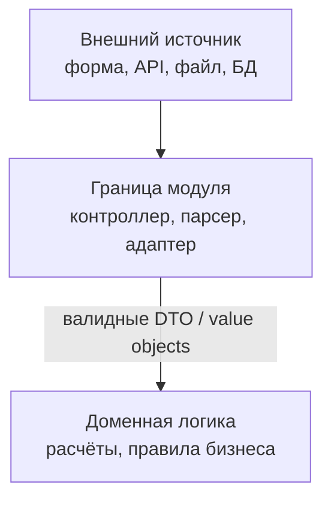

import ExternalCodeEmbed from '@site/src/components/ExternalCodeEmbed';


# Проверка и валидация

<div class="article-tags">
  <span class="tag tag-required">ОБЯЗАТЕЛЬНО</span>
  <span class="tag tag-beginner">ДЛЯ НОВИЧКОВ</span>
</div>

<span class="complexity-badge">Разработчику</span>
<span class="complexity-badge">Аналитику</span>
<span class="complexity-badge">Тестировщику</span>
<span class="complexity-badge">Архитектору</span>
<span class="complexity-badge">Инженеру</span>

---

## Проверка и валидация

> Как устроены параметры и аргументы функций — [Функции — параметры и аргументы](/encyclopedia/4-code-dev/4-02-chto-takoe-kod-i-kak-on-rabotaet/4#parametry-i-argumenty).

Программа постоянно **получает данные** и **обрабатывает** их. Часть данных программист задаёт сам — литералами в коде, константами, настройками сборки. Другая часть приходит **извне**, и её качество заранее не гарантировано. Проверки и валидация — способ явно описать, какие значения допустимы, и остановить или перенаправить обработку, если правила нарушены.

---

### Входные данные — параметры и аргументы

Любая функция или метод работает с **входными данными**. В объявлении функции они называются **параметрами**; при вызове в скобки передаются **аргументы** — конкретные значения на этот запуск. Подробнее — в главе [Функции](/encyclopedia/4-code-dev/4-02-chto-takoe-kod-i-kak-on-rabotaet/4).

Учебные примеры часто выглядят так:

```python
def discount(price, percent):
    return price * (100 - percent) / 100

discount(1000, 10)  # аргументы — литералы 1000 и 10
```

Здесь оба аргумента — **литералы**: числа, записанные прямо в коде. Разработчик полностью контролирует, что передаётся.

В реальных системах аргументами чаще становятся **неконтролируемые** значения:

- строка из поля формы или query-параметра URL;
- JSON-тело HTTP-запроса от другого сервиса;
- строка, прочитанная из файла или очереди сообщений;
- запись из базы данных, созданная когда-то другим модулем или сторонней системой;
- результат вызова внешнего API;
- значение, сгенерированное другой программой или скриптом.

Внешние источники **не дают гарантии**, что данные полные, свежие и согласованные с вашей логикой. Файл мог повредиться при копировании. Пользователь мог оставить поле пустым. API мог вернуть `null` вместо объекта. В базе могла остаться строка там, где код уже ожидает число. Иногда приходит **неопределённое** значение (`undefined` в JavaScript) или явное **отсутствие** (`null`, `None`).

<div class="callout callout--info">
  <div class="callout-title">Граница доверия</div>
  Как только данные пересекают границу процесса — сеть, диск, UI, чужая библиотека — их нужно **проверять** там, где вы впервые берёте на себя ответственность за обработку. Внутри уже проверенного слоя повторять те же проверки на каждой строке обычно избыточно.
</div>

---

### Когда "плохие" данные роняют программу

Самый частый сценарий — обращение к полю или методу у **отсутствующего** значения.

#### Java — компилируемый язык с NullPointerException

```java
public class ProfileService {
    public static String displayName(User user) {
        return user.getName().trim();  // NPE, если user или getName() вернул null
    }
}

// Вызов с данными "из базы", где пользователь не найден:
ProfileService.displayName(null);
```

Компилятор Java **не запретит** передать `null` в параметр ссылочного типа, если аннотации и nullable-типы не настроены. На этапе выполнения JVM выбросит **NullPointerException** — программа прервёт текущий поток, если исключение не перехватят.

#### JavaScript — интерпретируемый язык с TypeError

```javascript
function displayName(user) {
  return user.name.trim();  // TypeError, если user — null или undefined
}

// Ответ API без поля user:
displayName(undefined);
```

JavaScript не падает на этапе "компиляции" в браузере: ошибка проявится **во время вызова**, когда движок попытается прочитать свойство `name` у `undefined`. Сообщение будет вроде `Cannot read properties of undefined (reading 'name')`.

<div class="callout callout--warning">
  <div class="callout-title">Один смысл — разные ошибки</div>
  Java — `NullPointerException`, JavaScript — `TypeError`, Python — `AttributeError: 'NoneType' object has no attribute …`. Механизм разный, причина одна — код **предположил**, что значение есть, а его не было.
</div>

Подробнее про `null`, `undefined`, `None` и приёмы защиты — в статье [Обработка значения null](/encyclopedia/4-code-dev/4-02-chto-takoe-kod-i-kak-on-rabotaet/44).

---

### Проверка и валидация — что это

**Проверка** (*check*) — установить истинность условия — "значение есть?", "это число?", "строка не пустая?". Результат — да или нет; дальше код решает, продолжать работу, вернуть ошибку или подставить значение по умолчанию.

**Валидация** (*validation*) — сопоставить данные с **набором правил** предметной области — формат email, диапазон возраста, допустимые символы в логине, согласованность полей ("дата окончания позже даты начала"). Итог — данные **валидны** или **невалидны**.

| Термин | Смысл |
|--------|--------|
| **Валидность** | Данные удовлетворяют всем правилам для данной операции |
| **Невалидность** | Хотя бы одно правило нарушено; иногда в документации встречают синоним "инвалидность данных" в том же техническом смысле |
| **Валидные данные** | Можно безопасно передавать в бизнес-логику |
| **Невалидные данные** | Нужно отклонить, исправить запрос или запросить повторный ввод |

На практике слова "проверка" и "валидация" часто пересекаются: проверка на `null` — минимальное правило валидации; полная валидация формы включает десятки отдельных проверок.

Типичный порядок при приёме аргументов:

1. **Присутствие** — значение не `null` / не `undefined` / не пустая ссылка.
2. **Тип** — это число, строка, список, а не "что-то неожиданное".
3. **Ограничения** — диапазон, длина, формат, перечисление допустимых кодов.
4. **Согласованность** — связь нескольких полей друг с другом.

Ниже — та же логика в виде **шпаргалки**: что именно проверять и **с чем** сравнивать фактическое значение.

#### На что проверять и с чем сравнивать

| Вид проверки | С чем сравниваем | Зачем | Пример |
|--------------|------------------|-------|--------|
| **Существование ссылки** | значение не `null`, не `undefined`, не `None` | можно безопасно обращаться к полям и методам | `if (user != null)`, `if (user && user.id)` |
| **Наличие содержимого** | не пустая строка, не пустой список, не "только пробелы" | отличить "поле не заполнили" от "поле заполнили пробелами" | `email.trim() !== ""`, `items.length > 0` |
| **Соответствие типу** | ожидаемый тип данных | отсечь `"25"` там, где нужен number, или объект вместо строки | `typeof age === "number"`, `isinstance(age, int)` |
| **Конкретное значение** | литерал, код из белого списка, enum | только разрешённые состояния | `status === "active"`, `role in ("user", "admin")` |
| **Диапазон** | минимум и максимум, границы интервала | числа и даты в допустимых пределах | `age >= 0 && age <= 150`, `price > 0` |
| **Длина или размер** | лимит символов, элементов, байт | UX, лимиты БД, защита от слишком больших payload | `password.length >= 8`, `len(title) <= 200` |
| **Формат / шаблон** | regexp, маска, структура (email, UUID, дата ISO) | строка "похожа" на нужный формат | `@` в email, [RegEx](/encyclopedia/4-code-dev/4-02-chto-takoe-kod-i-kak-on-rabotaet/615) |
| **Согласованность полей** | другое поле того же запроса или модели | правила между несколькими значениями | `endDate > startDate`, `confirm === password` |
| **Существование сущности** | запись в БД, файл на диске, ключ в кэше | id передан, но объект мог быть удалён | `user = repo.findById(id); if (user is None) …` |
| **Уникальность** | отсутствие дубликата в хранилище | регистрация email, slug, номер документа | `not repo.existsByEmail(email)` |
| **Контекст и права** | текущий пользователь, роль, владелец ресурса | операция разрешена именно этому субъекту | `order.userId === currentUser.id` |
| **Состояние процесса** | допустимый переход статуса | нельзя "отменить" уже доставленный заказ | `order.status === "pending"` перед оплатой |

<div class="callout callout--tip">
  <div class="callout-title">Truthiness — не подмена проверок</div>
  Конструкция `if (user && user.name)` отсекает `null` и `undefined`, но **не заменяет** проверку типа и диапазона. Значения `0`, `""` и `false` в JavaScript ложны в условии — их нельзя отбрасывать, если они могут быть корректными данными (возраст `0`, флаг `false`, пустой комментарий как осознанный ввод).
</div>

Порядок строк в таблице близок к реальному коду на границе модуля — сначала "есть ли объект", затем тип и содержимое, потом бизнес-правила, в конце — существование связанных записей и права.

---

### Пример — регистрация пользователя на четырёх языках

Один сценарий: функция принимает email и возраст. Email обязателен, возраст — целое число от 0 до 150.

#### Python


<ExternalCodeEmbed example="python/code-414-118-001" title="Python" minHeight={336} />


`is None` отделяет отсутствие значения от пустой строки `""`. `isinstance` проверяет тип во время выполнения — Python допускает передать любой объект.

#### JavaScript


<ExternalCodeEmbed example="javascript/code-414-118-002" title="JavaScript" minHeight={426} />


Сравнение `email == null` отлавливает и `null`, и `undefined` — типичный приём на границе API.

#### C#

```csharp
public static User RegisterUser(string email, int age)
{
    if (email is null)
        throw new ArgumentNullException(nameof(email));
    if (string.IsNullOrWhiteSpace(email))
        throw new ArgumentException("email не может быть пустым", nameof(email));
    if (age < 0 || age > 150)
        throw new ArgumentOutOfRangeException(nameof(age), "age вне допустимого диапазона");

    return new User(email.Trim(), age);
}
```

Тип `int` в C# уже отсекает нечисловые аргументы на этапе компиляции; nullable `int?` потребовал бы отдельной проверки `.HasValue`. Для строк `ArgumentNullException` и `ArgumentException` — стандартные типы ошибок контракта метода.

#### Java

```java
public static User registerUser(String email, int age) {
    if (email == null) {
        throw new IllegalArgumentException("email обязателен");
    }
    if (email.isBlank()) {
        throw new IllegalArgumentException("email не может быть пустым");
    }
    if (age < 0 || age > 150) {
        throw new IllegalArgumentException("age вне допустимого диапазона");
    }
    return new User(email.trim(), age);
}
```

Примитивный `int` в Java **не бывает** `null`; если возраст опционален, используют `Integer` и проверяют его отдельно.

---

### Уровни защиты в одном проекте



| Уровень | Что проверяют | Пример |
|---------|----------------|--------|
| **UI / клиент** | Базовый UX — не отправлять пустую форму | HTML `required`, маска телефона |
| **Граница сервера** | Полный набор правил, безопасность | REST-контроллер, десериализация JSON |
| **Домен** | Инварианты модели | "Счёт не может быть отрицательным" |
| **Инфраструктура** | Целостность хранения | UNIQUE в БД, NOT NULL |

Клиентские проверки **удобны**, но **не заменяют** серверные: запрос можно отправить в обход браузера.

<div class="callout callout--tip">
  <div class="callout-title">Guard clause — ранний выход</div>
  Сначала отсечь невалидные случаи и выйти из функции (`return`, `throw`), затем писать "счастливый путь" без глубокой вложенности `if`. Тот же приём описан для null в [Обработка значения null](/encyclopedia/4-code-dev/4-02-chto-takoe-kod-i-kak-on-rabotaet/44).
</div>

---

### Что делать с невалидными данными

Выбор зависит от слоя и контракта:

- **Исключение** (`throw`, `raise`) — ошибка программиста или нарушение контракта внутреннего API.
- **Код ошибки / Result** — ожидаемый отказ для внешнего вызова ("логин занят", "неверный формат").
- **Сообщение пользователю** — список полей с пояснением, без внутренних деталей стека.
- **Значение по умолчанию** — только если бизнес явно разрешает подстановку; иначе это скрывает проблему.

Сильная типизация и **маленькие типы** ([value objects](/encyclopedia/4-code-dev/4-02-chto-takoe-kod-i-kak-on-rabotaet/616)) переносят часть проверок в конструктор типа `Email` или `Age`: один раз валидировали — дальше по коду передаётся уже гарантированно корректное значение.

---

### Текстовые форматы и регулярные выражения

Проверка "похож ли email на email" часто сочетает простые правила (не пусто, есть `@`) с [регулярными выражениями](/encyclopedia/4-code-dev/4-02-chto-takoe-kod-i-kak-on-rabotaet/615). RegEx удобен для **формата**, но не заменяет проверку смысла (существует ли такой пользователь в базе).

---

### Связь с тестированием

Каждое правило валидации — отдельный **тестовый сценарий** — `null`, пустая строка, отрицательное число, слишком длинное значение, неверный тип. Тестировщик и разработчик составляют одну и ту же матрицу "вход → ожидаемый результат". Обзор процесса на уровне проекта — в разделе [Тестирование](/encyclopedia/7-project/7-05-testirovanie/intro).

---

### Краткий чек-лист

| Вопрос | Действие |
|--------|----------|
| Откуда пришло значение? | Определить, контролируемый это источник или внешний |
| Может ли быть `null` / пусто? | Явная проверка до `.` / `->` / индексации |
| Известен ли тип? | `typeof`, `isinstance`, сигнатура метода, схема JSON |
| Какие правила домена? | Диапазоны, длины, белые списки кодов |
| Где сообщать об ошибке? | Пользователь, лог, метрика — разные тексты и уровни |
| Повторяются ли одни проверки? | Вынести в функцию, тип или слой валидации |

---
