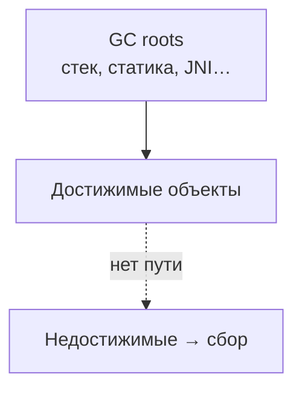

# Java, Python и Go — три модели GC

<div class="article-tags">
  <span class="tag tag-required">ОБЯЗАТЕЛЬНО</span>
  <span class="tag tag-beginner">ДЛЯ НОВИЧКОВ</span>
</div>

<span class="complexity-badge">Разработчику</span>
<span class="complexity-badge">Архитектору</span>

---

## Зачем сравнивать

**Сборка мусора (Garbage Collection, GC)** — автоматическое освобождение памяти, занятой объектами, которые программа больше не использует. Сборщик ищет **недостижимые** объекты (нет цепочки ссылок от **корней** — стеков потоков, глобальных переменных, регистров) и возвращает их память в пул.

Во всех трёх языках цель одна, а реализация разная. Понимание модели конкретного runtime помогает объяснить паузы, утечки и выбор настроек под нагрузку.

<div class="callout callout--tip">
  <div class="callout-title">Где углубиться</div>

  <div class="callout-body">
  Общая теория, утечки через «живые» ссылки, C# и детальная настройка JVM — в [автоматическом управлении памятью](./1.md). Ниже — сжатое сравнение **Java, Python и Go** в духе учебной шпаргалки GC 101.
  </div>
</div>

---

## Сводная таблица

| | **Java (JVM)** | **Python (CPython)** | **Go (runtime)** |
|---|----------------|----------------------|------------------|
| **Основная идея** | Трассировка достижимости из корней | Подсчёт ссылок + циклический GC | Конкурентный mark-and-sweep |
| **Поколения кучи** | Young (Eden, Survivor) + Old; Metaspace вне heap | У `gc` — три поколения только для **циклов**; основной путь — refcount | Поколений нет — единая куча |
| **Типичные паузы** | От миллисекунд (G1) до субмиллисекунд (ZGC) | STW при проходе `gc`; refcount без паузы | Часто < 100 мкс, цель — низкая латентность |
| **Настройка** | `-XX:+UseG1GC`, `-XX:+UseZGC`, `-Xmx` | `gc.set_threshold`, `gc.collect()` | `GOGC`, `GODEBUG=gctrace=1` |
| **Практика в разделе** | [JVM](/encyclopedia/5-languages/5-03-java/23) | [CPython и память](/encyclopedia/5-languages/5-02-python/27) | [Основы Go](/encyclopedia/5-languages/5-10-go/13) |

---

## Достижимость — общая схема

Во всех трёх средах «мусор» — объект, до которого **нельзя дойти по ссылкам от корней**.



Если вы держите ссылку в кэше, обработчике события или статическом списке — объект **жив** для GC, даже когда он логически не нужен. Это главный источник «утечек» при работающем сборщике — см. [утечки при работающем GC](./1#утечки-при-работающем-gc).

---

## Java — поколения и выбор алгоритма

### Память JVM

| Область | Назначение |
|---------|------------|
| **Heap — Young Gen** | Eden + два Survivor (S0/S1); новые объекты и Minor GC |
| **Heap — Old Gen** | Долгоживущие объекты после нескольких сборок |
| **Non-Heap — Metaspace** | Метаданные классов (с Java 8 вместо PermGen) |

Гипотеза поколений: большинство объектов умирают молодыми; полный обход всей кучи нужен реже.

### Эволюция сборщиков

| Сборщик | Идея | Когда смотреть |
|---------|------|----------------|
| **Serial** | Один поток, STW | Малые heap, встраиваемые системы |
| **Parallel** | Несколько потоков, упор на throughput | Пакетная обработка, допустимы редкие длинные паузы |
| **CMS** | Частично конкурентный mark-sweep | Устарел (удалён с JDK 14) |
| **G1** | Куча регионами; сначала регионы с «мусором» | По умолчанию с JDK 9, `-XX:MaxGCPauseMillis` |
| **ZGC** | Низкие паузы, colored pointers, load barriers | Интерактивные сервисы, большие heap |

### G1 и регионы

G1 делит heap на **регионы** фиксированного размера (обычно 1–32 МБ). Роль региона меняется:

| Метка | Роль |
|-------|------|
| **E** (Eden) | Создание новых объектов |
| **S** (Survivor) | Объекты, пережившие young-сборку |
| **O** (Old) | Старое поколение |

Сборщик выбирает регионы с высокой долей мусора — отсюда имя *Garbage-First*.

Пример запуска с G1 и логом:

```bash
java -XX:+UseG1GC -Xmx4g -Xlog:gc*:file=gc.log -jar app.jar
```

Подробнее — [JVM и сборщик мусора](/encyclopedia/5-languages/5-03-java/23#сборщик-мусора), [настройка в статье 1](./1#реализация-и-настройка-в-java) и [шпаргалка JVM Options](/encyclopedia/5-languages/5-03-java/3#24-jvm--параметры-запуска-и-настройка).

---

## Python — подсчёт ссылок и циклы

### Два уровня

1. **Reference counting** — у каждого `PyObject` есть `ob_refcnt`. Счётчик 0 → объект освобождается сразу, без отдельной «волны» GC.
2. **Модуль `gc`** — mark-and-sweep для **циклических** ссылок (два контейнера ссылаются друг на друга, но недостижимы снаружи).

```python
import sys

a = []
b = [a]
a.append(b)  # refcount > 0 у обоих, снаружи недостижимы
del a, b
import gc
gc.collect()  # разрывает цикл
```

### Mark-and-sweep в `gc`

- Обход от корней (глобальные, стеки).
- **Помеченные** объекты — живые.
- **Непомеченные** — удаляются.

Три **поколения** (0, 1, 2) ускоряют проверку циклов: молодые контейнеры сканируют чаще. Это дополнение к refcount, а не замена поколенческой JVM-кучи.

### Пулы памяти (pymalloc)

Малые объекты (< 512 байт) часто берутся из **pymalloc**: арены делятся на блоки в состояниях *untouched*, *free*, *allocated*. Крупные объекты идут в системный `malloc`. Пулы снижают фрагментацию и ускоряют аллокации, но долгоживущий процесс всё равно может раздувать RSS — см. [архитектуру выполнения Python](/encyclopedia/5-languages/5-02-python/27).

---

## Go — конкурентный mark-and-sweep без поколений

Рантайм Go встроен в бинарник. Сборщик **конкурентный**: большая часть mark-and-sweep идёт параллельно с горутинами; короткие STW — на root scan и согласование фаз.

### Трёхцветная разметка

| Цвет | Смысл |
|------|--------|
| **Белый** | Ещё не просмотрен или недостижим |
| **Серый** | Просмотрен, дети ещё не обработаны |
| **Чёрный** | Просмотрен вместе с исходящими ссылками |

Корни (стек горутин, глобалы, регистры) «серые»; обход переводит объекты в чёрные; оставшиеся белые — мусор.

### Гибридный write barrier

Пока **mutator** (ваш код) меняет указатели, **collector** не должен потерять живой объект. Go использует **insert** и **delete** барьеры при записи в указатели — runtime вставляет проверки при компиляции.

Поколений в Go нет: проще модель, предсказуемая настройка через **`GOGC`** (процент роста heap до следующего цикла, по умолчанию 100).

```bash
GOGC=50 ./myapp          # чаще GC, меньше heap
GODEBUG=gctrace=1 ./myapp # лог циклов в stderr
```

Практика снижения аллокаций — `sync.Pool`, вынос `make` из циклов — в [основах Go](/encyclopedia/5-languages/5-10-go/13#работа-с-памятью).

---

## Как выбрать фокус обучения

| Цель | С чего начать |
|------|----------------|
| Сервер на JVM, тюнинг пауз | Java в этой статье → [1.md, Java](./1#реализация-и-настройка-в-java) → [23.md](/encyclopedia/5-languages/5-03-java/23) |
| Долгий Python-процесс, циклы ссылок | Python выше → [27.md](/encyclopedia/5-languages/5-02-python/27) |
| Микросервис на Go, GC pressure | Go выше → [13.md](/encyclopedia/5-languages/5-10-go/13) |
| C#, Unity, .NET | [1.md, .NET](./1#реализация-и-настройка-в-net-c) |

---

## Краткий итог

- **Java** — богатый выбор GC, поколенческая heap, регионы G1, низколатентные ZGC/Shenandoah.
- **Python** — в первую очередь refcount; `gc` ловит циклы и использует поколения для этих проходов; pymalloc ускоряет мелкие объекты.
- **Go** — один конкурентный mark-and-sweep, трёхцветная схема, write barrier, настройка `GOGC`, без generational heap.

Во всех случаях GC освобождает только **недостижимое**; семантику «нужен / не нужен» задаёт архитектура ссылок в коде.
