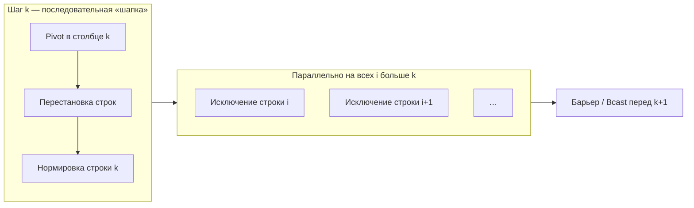

import ExternalCodeEmbed from '@site/src/components/ExternalCodeEmbed';


# Параллельное решение СЛАУ — метод Гаусса

<div class="article-tags">
  <span class="tag tag-required">ОБЯЗАТЕЛЬНО</span>
</div>

<span class="complexity-badge">Разработчику</span>
<span class="complexity-badge">Инженеру</span>

---

Параллельный метод Гаусса используется для ускорения решения систем линейных алгебраических уравнений (СЛАУ) на многопроцессорных системах. Основная цель параллелизации — распределить вычислительно затратные операции по обнулению элементов матрицы между несколькими потоками или процессорами. Эффективность алгоритма критически зависит от того, как строки матрицы распределены между процессорами.

Представьте, что у вас есть система из `n` уравнений с `n` неизвестными. Например:
```
2x + 3y = 8
4x - y = 2
```

В компьютере это хранится не как уравнения, а как Матрица коэффициентов (таблица чисел слева) и Вектор правых частей (числа справа, после знака `=`). Цель метода Гаусса — превратить эту матрицу в треугольную (чтобы внизу слева были одни нули), а потом найти неизвестные `x`, `y`, `z`. Когда матрица огромная (100 000 x 100 000), один компьютер считает это сутками. Нам нужно задействовать много ядер или много компьютеров одновременно. Но метод Гаусса — коварный.

В нем есть **последовательные** этапы (их нельзя ускорить), и есть **параллельные** (тут мы можем накинуть много ядер).

Для достижения максимального ускорения рекомендуется использовать циклическое распределение строк для балансировки процессоров и готовые оптимизированные библиотеки, такие как Intel MKL (для CPU) или cuSOLVER (для GPU).

[Умножение матриц](./9.md) иллюстрирует **регулярный** параллелизм по данным. **Решение системы линейных уравнений** *Ax = b* методом Гаусса — другой эталон: на каждом этапе меняется **структура зависимостей**, появляется **ведущий столбец** и массовые обмены. Ниже — инженерный разбор с псевдокодом и связью с MPI/OpenMP.

---

## Постановка

Дана матрица коэффициентов **A** размера *n×n* и вектор правых частей **b**. Нужен вектор **x**, такой что *Ax = b*.

Матрица коэффициентов — это таблица из чисел, составленная только из коэффициентов при неизвестных переменных в системе линейных алгебраических уравнений (СЛАУ). Она полностью описывает левую часть математической системы.

Вектор правых частей (или вектор свободных членов) — это вертикальный столбец чисел, который находится в правой части системы уравнений (после знака равенства). В этих числах нет переменных. Вместе с матрицей коэффициентов и вектором неизвестных они составляют полный набор элементов любой системы линейных уравнений (СЛАУ).

Такая структура идеальна для программирования и параллельных вычислений. Компьютеру не нужно передавать буквы `(x, y, z)` и знаки плюс или минус.

**Метод Гаусса** (прямой ход) последовательно обнуляет элементы **под главной диагональю** в столбцах *k = 0 … n−1*:

1. Выбрать **опорную строку** *p* в столбце *k* (частичный выбор по модулю для устойчивости).
2. Поменять строки *k* и *p* в *A* и *b*.
3. Нормировать опорную строку (делитель *A[k,k]*).
4. Для всех строк *i > k* вычесть кратное опорной строки, чтобы *A[i,k] = 0*.

Обратный ход находит *x* из верхнетреугольной системы. Параллелизм в **прямом ходе** — главная тема ниже.

Представьте квадратную матрицу как таблицу. Главная диагональ — это линия из чисел, которая идет из левого верхнего угла в правый нижний угол. 

Цель метода Гаусса — превратить матрицу в треугольную форму. Это значит, что все числа, которые находятся ниже нашей диагонали, математическими операциями нужно превратить в нули.

Прямой ход (о котором идет речь) - это движение «сверху вниз» и «слева направо». Мы берем первое уравнение, с его помощью вычитанием убираем иксы из нижних уравнений. Потом берем второе — убираем игреки из тех, что еще ниже. В результате этой «чистки» мы как раз и получаем нули под диагональю.

А обратный ход - это движение в обратную сторону — «снизу вверх». Когда нули уже получены, мы находим последнюю переменную (z), подставляем её наверх, находим (y), подставляем еще выше и находим (x).

Прямой ход метода Гаусса шаг за шагом (столбец за столбцом) превращает все числа в левом нижнем углу матрицы в нули, чтобы сделать матрицу треугольной.

---

## Где параллелизм, а где нет

1. Последовательная пробка (Узкое горлышко). Важно! Этот этап последовательный. Все процессоры ждут, пока один главный процессор найдет это число и разошлет данные. Чем больше процессоров, тем больше время на эту рассылку. На каждом шаге k (мы обрабатываем столбец за столбцом) компьютер должен:
- Найти главный элемент (Pivot) — самое большое число в текущем столбце. Это нужно, чтобы алгоритм не упал из-за деления на ноль и чтобы ответ был точным.
- Переставить строки местами.
- Разослать эту "главную строку" всем остальным процессорам.
2. Параллельная фаза (Скорость). Когда все получили "главную строку", начинается самое интересное. Теперь каждый процессор берет свои строки матрицы (которые лежат ниже текущей) и одновременно вычитает из них эту главную строку, чтобы создать нули. Важно! Здесь они работают независимо и параллельно. Один процессор считает строки с 1 по 1000, второй — с 1001 по 2000 и т.д. Им не нужно общаться между собой на этом этапе.

Если просто отдать Процессору 1 первую половину строк, а Процессору 2 — вторую, то Процессор 1 быстро закончит работу и будет простаивать (ведь верхние строки мы обрабатываем первыми).

Давайте четко разделим весь процесс решения СЛАУ методом Гаусса на две зоны: где компьютер может делать вычисления на нескольких процессорах одновременно (параллелизм), а где он вынужден ждать и делать всё строго по очереди (последовательный код).

В методе Гаусса есть глобальный порядок, который нельзя нарушить. Мы не можем начать обнулять третий столбец, пока не закончили со вторым.
- Главный цикл алгоритма всегда идет по очереди. Сначала обрабатывается первый шаг, затем второй, затем третий.
- На каждом шаге *k* нужно найти строку с максимальным числом в текущем столбце. Это делает один конкретный процессор (или один главный поток). Остальные в этот момент ждут.
- Процессор, который держит ведущую строку, должен отправить её всем остальным. Пока данные летят по сети или копируются в памяти, вычисления стоят.
- Когда мы ищем сами неизвестные (x, y, z), мы находим их строго по одному. Нашли `z`, подставили наверх — нашли `y`, подставили еще выше — нашли `x`. Здесь параллелизма почти нет, но этот этап выполняется очень быстро.

Если у нас матрица из 10 000 строк и 4 процессора, то после выбора ведущей строки мы можем отдать первому процессору строки с 1 по 2500, второму — с 2501 по 5000 и так далее. Процессор №1 считает изменения в своих строках, а Процессор №2 — в своих. Они не мешают друг другу, им не нужно общаться между собой на этом этапе. 

Представьте, что метод Гаусса — это постройка дома. Когда план утвержден и опалубка готова, бригада из 50 строителей одновременно заливает бетон в разные углы этого этажа (параллельное обновление строк). Чем больше строителей (процессоров), тем быстрее зальют этаж. Тогда и есть параллелизм.

| Этап шага *k* | Параллелизм | Почему |
|---------------|-------------|--------|
| Поиск pivot в столбце *k* | Редукция `max` по *p* | Нужен **один** глобальный индекс *p* |
| Перестановка строк | Мало работы | Часто последовательно или broadcast индекса |
| Нормализация строки *k* | Одна строка | Узкий участок |
| Исключение для строк *i > k* | **Да** | Строки независимы при фиксированном *k* |

Pivot (в переводе с английского — «ось», «шарнир» или «точка опоры») в методе Гаусса называют ведущим элементом (или главным элементом). Это число, которое стоит на главной диагонали в текущем столбце, и с помощью которого мы обнуляем все числа, находящиеся под ним.

На шаге *k* параллельно обрабатывают строки *i = k+1 … n−1* — классический **параллелизм по данным** с **барьером** после каждого *k*.

В [графе алгоритма](./5.md) шаг *k* образует "веер" зависимостей: все операции этапа *k+1* ждут завершения этапа *k* — **критический путь** длины *O(n)* этапов, внутри этапа — до *O(n)* параллельной работы.

В формуле метода Гаусса мы всегда делим на Pivot. Если на главной диагонали оказался ноль, компьютер выдаст ошибку Division by zero и программа упадет. 

Если Pivot — очень маленькое число (например, 0.00001), то при делении на него получатся огромные множители. Компьютер начнет округлять огромные числа, и к концу расчета финальный ответ будет полностью неверным.

Чтобы алгоритм не ломался, перед каждым шагом обнуления выполняют процедуру Pivoting (выбор ведущего элемента):
- Частичный выбор (Partial Pivoting): Компьютер смотрит на текущий столбец вниз, находит там самое большое по модулю (абсолютной величине) число и меняет текущую строку местами со строкой, где лежит этот гигант. Это число становится новым, надежным Pivot.
- Полный выбор (Full Pivoting): Компьютер ищет максимум вообще по всей оставшейся матрице (и по строкам, и по столбцам). Это максимально точно, но очень медленно.

В параллельном методе Гаусса этап работы с Pivot — это последовательное узкое место:
- Один процессор должен найти этот самый большой Pivot в столбце.
- Этот же процессор должен отправить (сделать Broadcast) всю строку, содержащую Pivot, остальным процессорам.
- Только после того, как все процессоры получат строку с Pivot, они смогут запустить свои параллельные потоки для обновления матрицы.

---

### Схема одного шага *k*



Заполнение матрицы по шагам (× — ненулевые, 0 — уже обнулённый столбец):

```
k = 0 (столбец 0)          k = 1 (столбец 1)          k = 2
× × × ×                    × × × ×                    × × × ×
× × × ×        →           0 × × ×        →           0 × × ×
× × × ×                    0 × × ×                    0 0 × ×
× × × ×                    0 × × ×                    0 0 0 ×
```

На каждом *k* "веер" стрелок идёт от строки *k* вниз — это и есть параллельная фаза внутри шага. Между столбцами — **глобальная синхронизация**: без неё процесс не знает финальную опорную строку.

---

## Псевдокод — прямой ход

```text
АЛГОРИТМ ГАУСС_ПРЯМОЙ(n, A, b)
  для k от 0 до n − 1
    p := индекс_строки_с_макс_|A[* ,k]| от k до n − 1
    поменять_строки(A, b, k, p)
    делитель := A[k,k]
    для j от k до n − 1
      A[k,j] := A[k,j] / делитель
    конец для
    b[k] := b[k] / делитель

    параллельно для i от k + 1 до n − 1
      множитель := A[i,k]
      для j от k до n − 1
        A[i,j] := A[i,j] − множитель * A[k,j]
      конец для
      b[i] := b[i] − множитель * b[k]
    конец параллельно
  конец для
КОНЕЦ
```

**Обратный ход** (последовательный по сути, но короткий):

```text
АЛГОРИТМ ГАУСС_ОБРАТНЫЙ(n, A, x, b)
  для i от n − 1 downto 0
    x[i] := b[i]
    для j от i + 1 до n − 1
      x[i] := x[i] − A[i,j] * x[j]
    конец для
    x[i] := x[i] / A[i,i]
  конец для
КОНЕЦ
```

---

## Распределённая память (MPI)

Если у нас кластер из компьютеров, они не видят память друг друга. Им нужно пересылать строки по сети.

В системах с распределенной памятью (кластерах) каждый процессор (узел) имеет свою собственную изолированную оперативную память. Они не могут напрямую читать или записывать данные в память друг друга. Чтобы решить СЛАУ методом Гаусса на такой архитектуре, используется технология MPI (Message Passing Interface). Процессоры общаются и обмениваются строками матрицы с помощью явной пересылки сообщений по сети.

Хранить всю матрицу на каждом процессоре бессмысленно — не хватит памяти, да и параллелизма не получится. Поэтому матрицу разрезают на части. Для метода Гаусса лучше всего подходит ленточное циклическое распределение строк:
- Процессор 0 получает строки: 0, 3, 6, 9...
- Процессор 1 получает строки: 1, 4, 7, 10...
- Процессор 2 получает строки: 2, 5, 8, 11...

Почему именно так? На каждом шаге `k` прямого хода верхние строки матрицы постепенно исключаются из расчетов. Если бы мы отдали Процессору 0 первую треть матрицы, он бы быстро выполнил свою работу и до конца алгоритма просто простаивал. При циклическом распределении нагрузка до самого конца распределяется равномерно между всеми узлами.

Типичная схема — **разбиение по строкам**: процесс *r* хранит строки *i* с *i_нач ≤ i ≤ i_кон*.

На шаге *k*:

1. Процесс-владелец строки *k* (или root) находит pivot и **рассылает** индекс *p* (`MPI_Bcast`).
2. При необходимости — **обмен строками** между процессами (или локальная перестановка, если строка уже локальна).
3. **Broadcast** нормированной опорной строки *k* всем (`MPI_Bcast` по строке *A[k,*] и *b[k]*).
4. Каждый процесс **локально** исключает pivot из своих строк *i > k*.

```text
АЛГОРИТМ ГАУСС_MPI_ПО_СТРОКАМ(n, A_лок, b_лок, p, rank)
  для k от 0 до n − 1
    если rank владеет_строкой(k)
      p := локальный_поиск_pivot(столбец k)
    MPI_Bcast(p, root = владелец(k))
    обмен_строками_если_нужно(k, p)
    если rank владеет_строкой(k)
      нормировать_строку(k)
    MPI_Bcast(строка A[k,*] и b[k], root = владелец(k))
    для i в локальных_строках, i > k
      исключить_pivot(i, k)
    конец для
  конец для
КОНЕЦ
```

Вот что происходит внутри сети на каждом шаге алгоритма прямого хода:
- Поиск владельца `Pivot`: Все процессоры знают, какую строку `k` нужно обработать. Но эта строка физически лежит в памяти только у одного процессора (назовем его `Root`).
- Локальный `Pivoting` (выбор главного элемента): Процессор `Root` ищет в своей строке `k` ведущий элемент. (Если применяется частичный выбор `pivot`, то все процессоры сначала ищут максимум в текущем столбце среди своих строк, затем через функцию `MPI_Allreduce` находят абсолютный максимум и определяют, у кого лежит лучшая строка).
- Рассылка ведущей строки (`MPI_Bcast`): Процессор-владелец строки `k` отправляет её копию всем остальным процессорам в сети. Для этого используется коллективная операция рассылки.
- Параллельное вычисление: Получив строку `k`, каждый процессор запускает цикл по своим собственным строкам (тем, у которых индекс `i > k` и которые закреплены за данным процессором). Они независимо друг от друга обновляют элементы в своей локальной памяти. Никакого общения между ними на этом этапе нет.

**Узкое место** — *n* синхронизаций и *n* broadcast опорных строк. При большом *p* и умеренном *n* коммуникации доминируют ([законы производительности](./7.md)).

Разбор **`MPI_Bcast` на одном шаге** — в [практике MPI, пример про Гаусса](./11.md#gauss-mpi-bcast-step).

Вот концептуальный фрагмент кода прямого хода, показывающий сетевое взаимодействие:
```cpp
// my_rank — ID текущего процессора, num_procs — общее число процессоров
for (int k = 0; k < n; ++k) {
    // 1. Определяем, какой процессор хранит глобальную строку k
    int root_process = k % num_procs; 

    // Выделяем буфер под ведущую строку (длина n + 1 для вектора правых частей b)
    std::vector<double> pivot_row(n + 1);

    if (my_rank == root_process) {
        // Если строка моя, копируем её в буфер для отправки
        int local_index = k / num_procs;
        for(int j = 0; j < n; ++j) pivot_row[j] = local_matrix[local_index][j];
        pivot_row[n] = local_b[local_index];
    }

    // 2. Рассылаем строку k от процессора Root всем остальным
    MPI_Bcast(pivot_row.data(), n + 1, MPI_DOUBLE, root_process, MPI_COMM_WORLD);

    // 3. Каждый процессор обновляет свои локальные строки, которые ниже k
    int start_local_row = (k / num_procs) + (my_rank <= k % num_procs ? 1 : 0);
    
    for (int i = start_local_row; i < my_local_rows; ++i) {
        int global_i = i * num_procs + my_rank;
        if (global_i > k) {
            double factor = local_matrix[i][k] / pivot_row[k];
            for (int j = k; j < n; ++j) {
                local_matrix[i][j] -= factor * pivot_row[j];
            }
            local_b[i] -= factor * pivot_row[n];
        }
    }
}

```

Основная сложность распределенных систем — сетевые задержки (Latency).

Функция `MPI_Bcast` заставляет процессоры обмениваться данными по сетевым кабелям (`InfiniBand` или `Ethernet`). На каждом шаге k объем пересылаемых данных уменьшается (так как мы шлем строку от элемента `k` до конца), но сам факт вызова сетевой функции создает задержку.

Если матрица маленькая (например, 500х500), то время, затраченное на отправку сообщений по сети, будет намного больше, чем время, за которое один процессор мог бы решить эту СЛАУ в одиночку. Поэтому параллельный Гаусс на MPI запускают только на огромных матрицах (десятки и сотни тысяч уравнений).

---

## OpenMP на одном узле

В отличие от MPI, где память разделена, OpenMP используется на одном узле (одном компьютере или сервере), где все процессоры и ядра имеют общий доступ к единой оперативной памяти (Shared Memory). 

Здесь не нужно копировать строки матрицы или пересылать их по сети через `MPI_Bcast`. Все потоки видят матрицу целиком, что кардинально упрощает код и работает в разы быстрее, так как нет сетевых задержек.

Параллелизм в OpenMP реализуется на этапе обновления строк прямого хода. Главный поток (Master thread) идет по столбцам по очереди, а пул рабочих потоков (из которых состоят ядра вашего процессора) разделяет между собой строки, находящиеся ниже ведущей, и выполняет вычитание одновременно.

Внутренний цикл по *i* на шаге *k* — кандидат для `#pragma omp parallel for`, но **размер работы** падает с каждым *k* (остаётся *n−k−1* строк). На последних шагах overhead OpenMP съедает выигрыш — типичный приём: **динамический schedule** только пока `n − k > порог`, иначе последовательно.


<ExternalCodeEmbed example="cpp/code-416-12-001" title="OpenMP на одном узле" minHeight={300} />


`schedule(dynamic, 8)` помогает при разреженных строках; на плотной матрице часто достаточно `static`.

Почему OpenMP на одном узле — это круто, но имеет предел?
- Плюс (Скорость доступа): Время на синхронизацию потоков в общей памяти ничтожно мало по сравнению с пересылкой данных по сети в MPI. На одном узле метод Гаусса показывает отличное ускорение даже на средних матрицах (от 500x500).
- Минус (Проблема шины памяти / Memory Bandwidth): Метод Гаусса производит мало вычислений на один байт данных (низкое отношение Flops/Byte). Потоки процессора вычисляют всё настолько быстро, что упираются в скорость работы самой оперативной памяти (RAM). Сколько бы ядер вы ни добавили, если шина памяти материнской платы перегружена, скорость расти перестанет.

---

## Сравнение с matmul

Matmul (сокращение от Matrix Multiplication) — это операция матричного умножения. Метод Гаусса называют алгоритмом с низкой плотностью вычислений (Memory-bound). Компьютер тратит больше времени на чтение и запись чисел в память, чем на саму математику.

`matmul` (умножение матрицы на матрицу) — это полная противоположность. Это алгоритм с высокой плотностью вычислений (Compute-bound):
- На CPU ядра практически не простаивают в ожидании памяти.
- На GPU (видеокартах) под `matmul` созданы специальные аппаратные блоки (например, тензорные ядра в картах NVIDIA), которые выполняют умножение матриц мгновенно.

Поскольку обычный метод Гаусса сильно упирается в скорость памяти (как мы выяснили в OpenMP), ученые придумали блочный метод Гаусса. Именно он используется в суперкомпьютерных библиотеках (LAPACK / ScaLAPACK). Вместо того чтобы обновлять матрицу построчно (что медленно работает с памятью), программа берет блоки, загружает их в быстрый кэш процессора и параллельно перемножает их. Это увеличивает скорость работы алгоритма Гаусса в разы.

| | Matmul *C=AB* | Гаусс |
|---|---------------|--------|
| Зависимости | Статичны по *(i,j)* | Меняются каждый шаг *k* |
| Синхронизация | Редкая (фазы Cannon) | **Каждый** шаг *k* |
| Масштабирование на больших *p* | Хорошее при 2D блоках | Ограничено *O(n)* этапами |
| Практика HPC | BLAS, ScaLAPACK | LU с pivot в библиотеках |

В профессиональном параллельном коде (C++/Fortran) никто не пишет циклы для умножения матриц вручную. Используют функцию DGEMM (Double Precision General Matrix Multiply) из библиотек вроде Intel MKL или OpenBLAS. Она выжимает 100% мощности из всех ядер процессора.

Для больших разреженных систем на кластере чаще используют **итерационные** методы (CG, GMRES) с матвеком на каждой итерации — см. [matvec](./9.md) и [инженерию](./8.md).

---

## Чек-лист перед реализацией

1. Проверить устойчивость — **partial pivoting** обязателен для общих матриц.
2. Оценить, не выгоднее ли готовая **LAPACK** / **ScaLAPACK** / **PETSc**.
3. Профилировать: доля времени в `MPI_Bcast` vs локальное исключение.
4. Сравнить *x* с последовательным эталоном на малых *n*.

---

## Что дальше

| Тема | Статья |
|------|--------|
| Граф и критический путь | [Граф алгоритма и матрица следования](./5.md), [Временной анализ параллельных алгоритмов](./6.md) |
| Законы и коммуникации | [Законы производительности параллельных систем](./7.md) |
| MPI на практике | [Практика — OpenMP, MPI и профилирование](./11.md) |
| Умножение матриц | [Параллельное умножение матриц](./9.md) |

---
