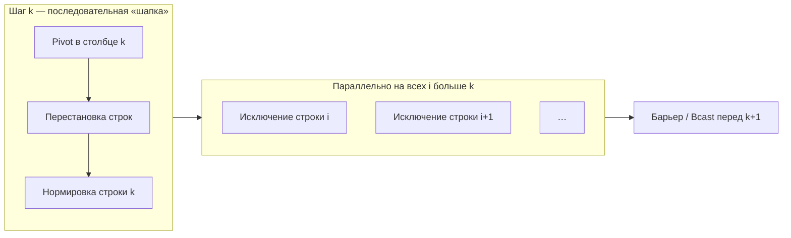

# Параллельное решение СЛАУ — метод Гаусса

<div class="article-tags">
  <span class="tag tag-required">ОБЯЗАТЕЛЬНО</span>
</div>

<span class="complexity-badge">Разработчику</span>
<span class="complexity-badge">Инженеру</span>

---

## Зачем эта статья

[Умножение матриц](./9.md) иллюстрирует **регулярный** параллелизм по данным. **Решение системы линейных уравнений** *Ax = b* методом Гаусса — другой эталон: на каждом этапе меняется **структура зависимостей**, появляется **ведущий столбец** и массовые обмены. Ниже — инженерный разбор с псевдокодом и связью с MPI/OpenMP.

---

## Постановка

Дана матрица коэффициентов **A** размера *n×n* и вектор правых частей **b**. Нужен вектор **x**, такой что *Ax = b*.

**Метод Гаусса** (прямой ход) последовательно обнуляет элементы **под главной диагональю** в столбцах *k = 0 … n−1*:

1. Выбрать **опорную строку** *p* в столбце *k* (частичный выбор по модулю для устойчивости).
2. Поменять строки *k* и *p* в *A* и *b*.
3. Нормировать опорную строку (делитель *A[k,k]*).
4. Для всех строк *i > k* вычесть кратное опорной строки, чтобы *A[i,k] = 0*.

Обратный ход находит *x* из верхнетреугольной системы. Параллелизм в **прямом ходе** — главная тема ниже.

---

## Где параллелизм, а где нет

| Этап шага *k* | Параллелизм | Почему |
|---------------|-------------|--------|
| Поиск pivot в столбце *k* | Редукция `max` по *p* | Нужен **один** глобальный индекс *p* |
| Перестановка строк | Мало работы | Часто последовательно или broadcast индекса |
| Нормализация строки *k* | Одна строка | Узкий участок |
| Исключение для строк *i > k* | **Да** | Строки независимы при фиксированном *k* |

На шаге *k* параллельно обрабатывают строки *i = k+1 … n−1* — классический **параллелизм по данным** с **барьером** после каждого *k*.

В [графе алгоритма](./5.md) шаг *k* образует «веер» зависимостей: все операции этапа *k+1* ждут завершения этапа *k* — **критический путь** длины *O(n)* этапов, внутри этапа — до *O(n)* параллельной работы.

---

### Схема одного шага *k*



Заполнение матрицы по шагам (× — ненулевые, 0 — уже обнулённый столбец):

```
k = 0 (столбец 0)          k = 1 (столбец 1)          k = 2
× × × ×                    × × × ×                    × × × ×
× × × ×        →           0 × × ×        →           0 × × ×
× × × ×                    0 × × ×                    0 0 × ×
× × × ×                    0 × × ×                    0 0 0 ×
```

На каждом *k* «веер» стрелок идёт от строки *k* вниз — это и есть параллельная фаза внутри шага. Между столбцами — **глобальная синхронизация**: без неё процесс не знает финальную опорную строку.

---

## Псевдокод — прямой ход

```text
АЛГОРИТМ ГАУСС_ПРЯМОЙ(n, A, b)
  для k от 0 до n − 1
    p := индекс_строки_с_макс_|A[* ,k]| от k до n − 1
    поменять_строки(A, b, k, p)
    делитель := A[k,k]
    для j от k до n − 1
      A[k,j] := A[k,j] / делитель
    конец для
    b[k] := b[k] / делитель

    параллельно для i от k + 1 до n − 1
      множитель := A[i,k]
      для j от k до n − 1
        A[i,j] := A[i,j] − множитель * A[k,j]
      конец для
      b[i] := b[i] − множитель * b[k]
    конец параллельно
  конец для
КОНЕЦ
```

**Обратный ход** (последовательный по сути, но короткий):

```text
АЛГОРИТМ ГАУСС_ОБРАТНЫЙ(n, A, x, b)
  для i от n − 1 downto 0
    x[i] := b[i]
    для j от i + 1 до n − 1
      x[i] := x[i] − A[i,j] * x[j]
    конец для
    x[i] := x[i] / A[i,i]
  конец для
КОНЕЦ
```

---

## Распределённая память (MPI)

Типичная схема — **разбиение по строкам**: процесс *r* хранит строки *i* с *i_нач ≤ i ≤ i_кон*.

На шаге *k*:

1. Процесс-владелец строки *k* (или root) находит pivot и **рассылает** индекс *p* (`MPI_Bcast`).
2. При необходимости — **обмен строками** между процессами (или локальная перестановка, если строка уже локальна).
3. **Broadcast** нормированной опорной строки *k* всем (`MPI_Bcast` по строке *A[k,*] и *b[k]*).
4. Каждый процесс **локально** исключает pivot из своих строк *i > k*.

```text
АЛГОРИТМ ГАУСС_MPI_ПО_СТРОКАМ(n, A_лок, b_лок, p, rank)
  для k от 0 до n − 1
    если rank владеет_строкой(k)
      p := локальный_поиск_pivot(столбец k)
    MPI_Bcast(p, root = владелец(k))
    обмен_строками_если_нужно(k, p)
    если rank владеет_строкой(k)
      нормировать_строку(k)
    MPI_Bcast(строка A[k,*] и b[k], root = владелец(k))
    для i в локальных_строках, i > k
      исключить_pivot(i, k)
    конец для
  конец для
КОНЕЦ
```

**Узкое место** — *n* синхронизаций и *n* broadcast опорных строк. При большом *p* и умеренном *n* коммуникации доминируют ([законы производительности](./7.md)).

Разбор **`MPI_Bcast` на одном шаге** — в [практике MPI, пример про Гаусса](./11.md#gauss-mpi-bcast-step).

---

## OpenMP на одном узле

Внутренний цикл по *i* на шаге *k* — кандидат для `#pragma omp parallel for`, но **размер работы** падает с каждым *k* (остаётся *n−k−1* строк). На последних шагах overhead OpenMP съедает выигрыш — типичный приём: **динамический schedule** только пока `n − k > порог`, иначе последовательно.

```cpp
const int threshold = 64;
for (int k = 0; k < n; ++k) {
    normalize_pivot_row(k);  // одна строка — последовательно
    int rows_left = n - k - 1;
    if (rows_left >= threshold) {
#pragma omp parallel for schedule(dynamic, 8)
        for (int i = k + 1; i < n; ++i)
            eliminate_row(i, k);
    } else {
        for (int i = k + 1; i < n; ++i)
            eliminate_row(i, k);
    }
}
```

`schedule(dynamic, 8)` помогает при разреженных строках; на плотной матрице часто достаточно `static`.

---

## Сравнение с matmul

| | Matmul *C=AB* | Гаусс |
|---|---------------|--------|
| Зависимости | Статичны по *(i,j)* | Меняются каждый шаг *k* |
| Синхронизация | Редкая (фазы Cannon) | **Каждый** шаг *k* |
| Масштабирование на больших *p* | Хорошее при 2D блоках | Ограничено *O(n)* этапами |
| Практика HPC | BLAS, ScaLAPACK | LU с pivot в библиотеках |

Для больших разреженных систем на кластере чаще используют **итерационные** методы (CG, GMRES) с матвеком на каждой итерации — см. [matvec](./9.md) и [инженерию](./8.md).

---

## Чек-лист перед реализацией

1. Проверить устойчивость — **partial pivoting** обязателен для общих матриц.
2. Оценить, не выгоднее ли готовая **LAPACK** / **ScaLAPACK** / **PETSc**.
3. Профилировать: доля времени в `MPI_Bcast` vs локальное исключение.
4. Сравнить *x* с последовательным эталоном на малых *n*.

---

## Что дальше

| Тема | Статья |
|------|--------|
| Граф и критический путь | [5](./5.md), [6](./6.md) |
| Законы и коммуникации | [7](./7.md) |
| MPI на практике | [11](./11.md) |
| Умножение матриц | [9](./9.md) |

---
