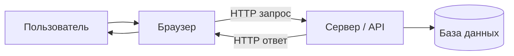

# Что такое веб-разработка

  ОБЯЗАТЕЛЬНО
  ДЛЯ НОВИЧКОВ

Разработчику
Аналитику

---

## Определение

**Веб-разработка** — создание программ, которые работают через **интернет** или **локальную сеть**: сайты в браузере, серверные API, связь с базой данных, авторизация пользователей.

Обычно в проекте участвуют несколько технологий сразу:

- разметка страницы ([HTML](/encyclopedia/3-data-markup/3-09-html/intro));
- оформление ([CSS](/encyclopedia/3-data-markup/3-10-css/intro));
- логика в браузере ([JavaScript](/encyclopedia/5-languages/5-01-javascript/intro));
- программа на сервере (Python, Node.js, Java, C#, Go, PHP — [языки](/encyclopedia/5-languages/intro));
- хранение данных ([SQL](/encyclopedia/3-data-markup/3-07-sql/intro), [NoSQL](/encyclopedia/3-data-markup/3-06-nosql/intro));
- обмен по протоколу [HTTP](/encyclopedia/2-system-network/2-09-osnovy-integratsionnogo-vzaimodeystviya/118).

Роли в команде часто делят на **фронтенд** (интерфейс у пользователя) и **бэкенд** (сервер, API, база) — [1.23 Фронтенд и бэкенд](/encyclopedia/1-basics/1-23-frontend-i-bekend/intro). Как адрес в строке браузера превращается в страницу — [от URL до пикселей](/encyclopedia/2-system-network/2-04-kak-rabotayut-sayty-i-veb-sayty/1.md#url-enter-to-page).

---

## Клиент и сервер

**Клиент** — программа на стороне пользователя. Чаще всего это **браузер**. Клиентом может быть и мобильное приложение, которое ходит на сервер по HTTP.

**Сервер** — программа на удалённой машине (в дата-центре или на `localhost` при разработке). Сервер принимает запрос, выполняет код, читает или пишет в базу и отправляет ответ.

| Роль | Где работает | Примеры |
|------|--------------|---------|
| Клиент | Компьютер или телефон пользователя | Браузер, мобильное приложение |
| Сервер | Дата-центр, облако, `localhost` | nginx + Node.js, IIS + ASP.NET |

**Запрос** — сообщение клиента («отдай `/tasks`», «сохрани задачу»). **Ответ** — HTML, JSON, файл или ошибка.

При локальной разработке сервер слушает **localhost** (`127.0.0.1`), браузер открывает `http://localhost:3000`. Запуск dev-сервера — [советы новичку](/encyclopedia/1-basics/1-035-bazovaya-informatika/208). DNS, HTTPS, nginx — [2.04 Сайты](/encyclopedia/2-system-network/2-04-kak-rabotayut-sayty-i-veb-sayty/intro).

---

## Статический сайт и веб-приложение

**Статический сайт** — на сервере лежат готовые HTML, CSS, JavaScript; сервер **отдаёт** их как есть. Визитки, документация, лендинги. Публикация — [GitHub Pages](/lab/Кейсы/3).

**Веб-приложение** — сервер **строит** ответ программно или отдаёт **API** (JSON), браузер рисует интерфейс (React, Vue и др.). Архитектуры SPA и SSR — [2.04](/encyclopedia/2-system-network/2-04-kak-rabotayut-sayty-i-veb-sayty/111.md), выбор пути — [глава 6](./6.md).

---

## HTTP — обзор

**HTTP** — правила обмена сообщениями между клиентом и сервером поверх **TCP**. Защищённый вариант — **HTTPS** (TLS) — [HTTPS и сертификаты](/encyclopedia/2-system-network/2-03-set-i-internet/611).

Запрос включает **метод** (`GET`, `POST`, `PUT`, `PATCH`, `DELETE`), **путь**, **заголовки** и опционально **тело**. Ответ — **статус-код**, заголовки, тело.

| Код | Смысл |
|-----|--------|
| 200 | Успех |
| 201 | Ресурс создан |
| 400 | Ошибка в запросе |
| 401 / 403 | Нет авторизации / нет прав |
| 404 | Не найдено |
| 500 | Ошибка сервера |

Полная шпаргалка — [статус-коды](/encyclopedia/2-system-network/2-03-set-i-internet/611#status-codes-cheatsheet). Интерактивы, curl-примеры, middleware, деплой — [глава 4 — HTTP и API в проекте](./4.md#http-и-api-в-проекте). Углубление по протоколу — [2.09](/encyclopedia/2-system-network/2-09-osnovy-integratsionnogo-vzaimodeystviya/intro).

---

## JSON, CRUD и REST

**JSON** — текстовый формат обмена данными. **Сериализация** — объект в памяти → строка; **десериализация** — обратно. Теория — [JSON](/encyclopedia/3-data-markup/3-04-konfiguratsii-i-dannye/3).

**CRUD** — create, read, update, delete. В REST сопоставляется с HTTP-методами:

| CRUD | HTTP (типично) |
|------|----------------|
| Create | `POST /tasks` |
| Read | `GET /tasks`, `GET /tasks/5` |
| Update | `PUT` / `PATCH /tasks/5` |
| Delete | `DELETE /tasks/5` |

**REST** — ресурсы с URI, операции HTTP-методами, по возможности stateless сервер, корректные статус-коды. **API** — набор endpoints для программ. Подробнее — [REST, GraphQL](/encyclopedia/2-system-network/2-09-osnovy-integratsionnogo-vzaimodeystviya/130), [проектирование API](/encyclopedia/8-infra-security/8-05-mikroservisy-i-integratsiya/122).

---

## CORS и конфигурация

**CORS** — ограничение **браузера** при запросе с одного origin на другой. `curl` CORS не применяет. Настройка — [CORS](/encyclopedia/2-system-network/2-03-set-i-internet/411), разбор в [главе 4](./4.md#http-и-api-в-проекте).

**`.env`** и переменные окружения хранят секреты локально; файл не коммитят в Git — [`.gitignore`](/encyclopedia/4-code-dev/4-13-osnovy-raboty-s-git/116), [безопасность .env](/encyclopedia/4-code-dev/4-14-razrabotka-i-otladka/1112).

---

## Куда смотреть дальше

| Тема | Глава |
|------|-------|
| HTML, CSS, JavaScript, `fetch` | [5](./5.md) |
| Этапы проекта, хостинг | [6](./6.md) |
| Дизайн, wireframe, a11y | [7](./7.md) |
| Стек, API в проекте, деплой | [4](./4.md) |
| Справочник фреймворков | [8](./8.md) |
| Термины раздела | [2 — итоги](./2.md#терминология-раздела) |
| Самопроверка | [3 — чек-лист](./3.md) |

**Маршрут:** [три слоя](./5.md) → [дизайн](./7.md) → [этапы](./6.md) → [HTTP в проекте](./4.md) → первый API и DevTools — [114 pet-проект](/encyclopedia/4-code-dev/4-14-razrabotka-i-otladka/114).
