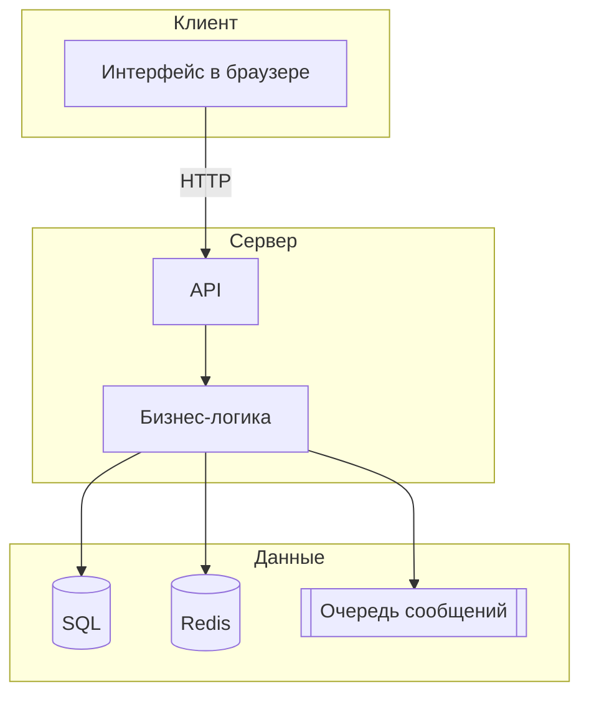
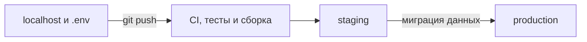

# Как делают веб-приложения

<div class="article-tags">
  <span class="tag tag-required">ОБЯЗАТЕЛЬНО</span>
  <span class="tag tag-beginner">ДЛЯ НОВИЧКОВ</span>
</div>

<span class="complexity-badge">Разработчику</span>
<span class="complexity-badge">Архитектору</span>

---

## О чём материал

В [главе 1](./1.md) разобран обмен по HTTP — запросы, JSON, REST, CORS. Здесь собрана **карта сборки** веб-приложения целиком: интерфейс в браузере, программа на сервере, база данных, перенос с `localhost` на боевой сервер и инструменты, которые подключают при росте нагрузки.

Материал опирается на разделы [языков программирования](/encyclopedia/5-languages/intro) и [инфраструктуры](/section/infra-security). Один универсальный стек для всех проектов не существует — ниже варианты и критерии выбора.



**API** (Application Programming Interface) — набор адресов и правил, по которым клиент получает и отправляет данные. В вебе чаще всего это HTTP и JSON — подробнее в [главе 1](./1.md) и [REST, GraphQL и gRPC](/encyclopedia/2-system-network/2-09-osnovy-integratsionnogo-vzaimodeystviya/130).

---

## Словарь перед выбором стека

| Термин | Коротко |
|--------|---------|
| **Фронтенд** | Всё, что работает в браузере пользователя — разметка, стили, логика интерфейса |
| **Бэкенд** | Программа на сервере — API, проверка прав, работа с базой |
| **Стек** | Набор технологий в проекте (язык, фреймворк, СУБД, хостинг) |
| **Монолит** | Одно приложение и обычно одна кодовая база; все функции в одном деплое |
| **MVP** (Minimum Viable Product) | Минимальная рабочая версия продукта для проверки идеи |
| **Деплой** (deployment) | Выкладка собранной версии приложения на сервер, доступный пользователям |
| **СУБД** | Система управления базами данных — PostgreSQL, MySQL и др. |
| **ORM** | Библиотека, которая связывает таблицы БД с объектами в коде — [4.10 ORM](/encyclopedia/4-code-dev/4-10-orm-i-rabota-s-dannymi/intro) |

Роли в команде — [1.23 Фронтенд и бэкенд](/encyclopedia/1-basics/1-23-frontend-i-bekend/intro). Путь от URL до страницы на экране — [2.04 Сайты](/encyclopedia/2-system-network/2-04-kak-rabotayut-sayty-i-veb-sayty/intro).

---

## Планирование архитектуры

Перед установкой React или Django имеет смысл зафиксировать требования. Четыре стартовых вопроса:

**Кто пользователь и какие действия выполняет**

- определяет список экранов и форм;
- нужны ли роли (гость, администратор, модератор);
- нужна ли [авторизация](/encyclopedia/2-system-network/2-08-osnovy-informatsionnoy-bezopasnosti/111) и регистрация.

**Нужна ли видимость в поисковиках и быстрый первый экран**

- для публичного каталога и статей важен **SEO** (Search Engine Optimization, продвижение в поиске);
- для закрытого личного кабинета SEO обычно вторичен;
- выбор между SPA и серверным рендером описан ниже и в [архитектуре веб-приложений](/encyclopedia/2-system-network/2-04-kak-rabotayut-sayty-i-veb-sayty/111.md).

**Какие данные хранятся и в каком объёме**

- настройки интерфейса — в браузере;
- учебный прототип — файл JSON или SQLite;
- заказы, пользователи, платежи — [SQL](/encyclopedia/3-data-markup/3-07-sql/intro).

**Будут ли пики нагрузки и фоновые задачи**

- рассылка писем, генерация отчётов, обработка загрузок — кандидаты на [очередь сообщений](/encyclopedia/2-system-network/2-09-osnovy-integratsionnogo-vzaimodeystviya/121);
- частые повторные чтения — [кэш](/encyclopedia/3-data-markup/3-08-upravlenie-rsubd/1.md#keshirovanie-vne-subd);
- рост числа одновременных пользователей — [масштабирование](/encyclopedia/8-infra-security/8-05-mikroservisy-i-integratsiya/1).

У новичка и у небольшого MVP обычно **монолит** — один репозиторий в Git, один процесс API, одна база. [Микросервисы](/encyclopedia/8-infra-security/8-05-mikroservisy-i-integratsiya/112) имеет смысл подключать после появления конкретного узкого места в монолите.

---

## Интерфейс в браузере

### Статический сайт

На сервере лежат готовые файлы HTML, CSS, JavaScript. Сервер **отдаёт файлы как есть**, без программной сборки страницы под каждый запрос. Подходит для визиток, документации, лендингов — [статический сайт в главе 1](./1.md), публикация через [GitHub Pages](/lab/Кейсы/3).

### Многостраничное приложение (MPA)

**MPA** (Multi-Page Application) — классическая схема. При каждом переходе браузер запрашивает **новую HTML-страницу** с сервера. JavaScript добавляет интерактивность поверх разметки.

- валидация полей формы;
- выпадающее меню;
- запрос к API через `fetch` без перезагрузки отдельного блока.

**Плюсы MPA**

- простой вход, понятная отладка в браузере;
- поисковики индексируют готовый HTML без дополнительной настройки;
- можно обойтись без сборщика модулей.

**Минусы MPA**

- полная перезагрузка страницы при переходах;
- сложнее строить интерфейс уровня десктопного приложения;
- общие элементы (шапка, меню) дублируются между страницами или выносятся в шаблоны на сервере.

База — [HTML](/encyclopedia/3-data-markup/3-09-html/intro), [CSS](/encyclopedia/3-data-markup/3-10-css/intro), [JavaScript](/encyclopedia/5-languages/5-01-javascript/intro).

### Одностраничное приложение (SPA)

**SPA** (Single Page Application) — в браузер приходит **одна** HTML-оболочка (часто пустой `<div id="root">`). Дальше интерфейс рисует JavaScript: маршруты меняются без полной перезагрузки, данные подгружаются с API.

**Плюсы SPA**

- быстрые переходы внутри приложения после первой загрузки;
- удобные формы, таблицы, дашборды;
- чёткое разделение ролей — сервер отдаёт данные, клиент рисует интерфейс.

**Минусы SPA**

- первая загрузка тяжелее из-за JavaScript-бандла;
- для SEO и быстрого первого экрана часто нужен **SSR** (Server-Side Rendering, рендер HTML на сервере) или **SSG** (Static Site Generation, сборка страниц при деплое).

Подробнее — [SPA и SSR](/encyclopedia/2-system-network/2-04-kak-rabotayut-sayty-i-veb-sayty/111.md), [особенности современных веб-приложений](/encyclopedia/2-system-network/2-04-kak-rabotayut-sayty-i-veb-sayty/114.md), [как выбрать фронтенд-фреймворк](/encyclopedia/5-languages/5-01-javascript/3-ecosystem/2-frontend-frameworks/270.md).

### Сборщик модулей (Vite, Webpack)

Современный фронтенд пишут **модулями** — файлами со `import` и `export`. Браузер понимает их не во всех сценариях. **Сборщик** (bundler) объединяет JavaScript, CSS и картинки в пакеты для разработки и для production.

- **Vite** — dev-сервер с быстрой перезагрузкой; часто используют с React и Vue;
- **Webpack** — зрелый сборщик в долгоживущих проектах;
- **Rollup** — компактные бандлы для библиотек.

Теория — [сборка и публикация](/encyclopedia/4-code-dev/4-04-proekt-i-freymvorki/102). Команды `npm`, `vite`, `eslint` — [справочник CLI JS-экосистемы](/encyclopedia/5-languages/5-01-javascript/3-ecosystem/4-cli-tools/1.md). Структура проекта — [4.04 Проект и фреймворки](/encyclopedia/4-code-dev/4-04-proekt-i-freymvorki/intro).

---

## Фронтенд-фреймворки

Ниже — популярные надстройки над JavaScript. Часто проект переводят на [TypeScript](/encyclopedia/5-languages/5-10-typescript/intro) для строгой типизации.

### React

**React** — библиотека для построения интерфейса из **компонентов** (переиспользуемых блоков UI). Огромная экосистема, много вакансий.

- [о разделе React](/encyclopedia/5-languages/5-01-javascript/3-ecosystem/2-frontend-frameworks/1-react/intro);
- [первая программа](/encyclopedia/5-languages/5-01-javascript/3-ecosystem/2-frontend-frameworks/1-react/272.md);
- [компоненты, JSX и поток данных](/encyclopedia/5-languages/5-01-javascript/3-ecosystem/2-frontend-frameworks/1-react/275.md);
- [Router и работа с API](/encyclopedia/5-languages/5-01-javascript/3-ecosystem/2-frontend-frameworks/1-react/277.md).

### Vue

**Vue** — прогрессивный фреймворк с мягким входом и **Composition API** для организации логики.

- [о разделе Vue](/encyclopedia/5-languages/5-01-javascript/3-ecosystem/2-frontend-frameworks/2-vue/intro);
- [первая программа](/encyclopedia/5-languages/5-01-javascript/3-ecosystem/2-frontend-frameworks/2-vue/282.md);
- [Router, Pinia и Vite](/encyclopedia/5-languages/5-01-javascript/3-ecosystem/2-frontend-frameworks/2-vue/284.md).

### Angular

**Angular** — полноценный фреймворк от Google.

- модули и внедрение зависимостей (DI);
- TypeScript по умолчанию;
- RxJS для потоков событий.

- [о разделе Angular](/encyclopedia/5-languages/5-01-javascript/3-ecosystem/2-frontend-frameworks/3-angular/intro);
- [первая программа](/encyclopedia/5-languages/5-01-javascript/3-ecosystem/2-frontend-frameworks/3-angular/292.md);
- [DI, RxJS и формы](/encyclopedia/5-languages/5-01-javascript/3-ecosystem/2-frontend-frameworks/3-angular/293.md).

Обзор всех фронтенд-стеков — [Frontend Frameworks](/encyclopedia/5-languages/5-01-javascript/3-ecosystem/2-frontend-frameworks/intro). Один язык на клиенте и сервере — [fullstack на JavaScript](/encyclopedia/5-languages/5-01-javascript/3-ecosystem/1-runtime-node/264.md). **Next.js** добавляет SSR и маршрутизацию поверх React — [meta-frameworks / Next.js](/encyclopedia/5-languages/5-01-javascript/3-ecosystem/3-meta-frameworks/273.md).

Практика без установки — [Lab / React, компоненты](/lab/Примеры/1146), [fetch и axios](/lab/Примеры/1145).

---

## Серверная часть и API

**Бэкенд** принимает HTTP-запросы, проверяет [авторизацию](/encyclopedia/2-system-network/2-08-osnovy-informatsionnoy-bezopasnosti/111), читает и пишет в базу, возвращает JSON или готовый HTML. Язык часто выбирают по команде, вакансиям или готовым библиотекам.

### Node.js и Express

**Node.js** — среда выполнения JavaScript **на сервере** (не в браузере). **Express** — популярный фреймворк для REST API и middleware-цепочек.

- [Node.js — о разделе](/encyclopedia/5-languages/5-01-javascript/3-ecosystem/1-runtime-node/intro);
- [первая программа](/encyclopedia/5-languages/5-01-javascript/3-ecosystem/1-runtime-node/262.md);
- [Express — middleware и маршруты](/encyclopedia/5-languages/5-01-javascript/3-ecosystem/1-runtime-node/263.md).

### Python, Django и Flask

**Django** — фреймворк с ORM, админ-панелью, шаблонами и маршрутизацией в одном проекте. Удобен для сайтов с формами и внутренних систем.

- [Python — о разделе](/encyclopedia/5-languages/5-02-python/intro);
- [Django](/encyclopedia/5-languages/5-02-python/30);
- [работа с БД в Python](/encyclopedia/5-languages/5-02-python/314.md).

**Flask** — минималистичный каркас для небольшого API или микросервиса — [Flask](/encyclopedia/5-languages/5-02-python/341).

### Java, Spring и Spring Boot

**Spring Framework** — стандарт enterprise-бэкенда на JVM (внедрение зависимостей, MVC, доступ к данным, безопасность). **Spring Boot** упрощает старт — встроенный Tomcat и автоконфигурация.

- [Java — о разделе](/encyclopedia/5-languages/5-03-java/intro);
- [Spring Framework](/encyclopedia/5-languages/5-03-java/27);
- [Spring Boot](/encyclopedia/5-languages/5-03-java/254);
- [первая программа на Spring](/encyclopedia/5-languages/5-03-java/271);
- [Hibernate и JPA](/encyclopedia/5-languages/5-03-java/293).

### C# и ASP.NET Core

**ASP.NET Core** — кроссплатформенный стек Microsoft для веб-API, MVC и middleware на .NET.

- [C# — о разделе](/encyclopedia/5-languages/5-05-csharp/intro);
- [платформа .NET](/encyclopedia/5-languages/5-04-platforma-dotnet/intro);
- [ASP.NET Core](/encyclopedia/5-languages/5-05-csharp/451).

### Другие языки

- [PHP](/encyclopedia/5-languages/5-07-php/intro) — классический shared-хостинг, Laravel и Symfony;
- [Go](/encyclopedia/5-languages/5-10-go/intro) — компилируемый язык, высокая производительность API;
- [Ruby on Rails](/encyclopedia/5-languages/5-11-ruby/intro) — быстрый старт CRUD-приложений.

Полный каталог — [том 5, языки](/encyclopedia/5-languages/intro).

### Два способа отдать страницу пользователю

**Серверные шаблоны**

- Django templates, Razor в ASP.NET, JSP в Java EE;
- сервер собирает HTML и отправляет готовую страницу;
- удобно для MPA и SEO "из коробки".

**API и отдельный фронтенд**

- сервер отвечает JSON;
- HTML и маршруты строит SPA в браузере;
- типичная схема для React/Vue/Angular.

Связь с базой — через [ORM](/encyclopedia/4-code-dev/4-10-orm-i-rabota-s-dannymi/intro) или прямые [SQL-запросы](/encyclopedia/3-data-markup/3-07-sql/887). Слои доступа к данным — [4.10, глава 1](/encyclopedia/4-code-dev/4-10-orm-i-rabota-s-dannymi/1.md).

---

## Хранение данных

### В браузере — localStorage и sessionStorage

**Web Storage** — встроенное хранилище в браузере.

- **localStorage** — данные живут, пока пользователь не очистит сайт вручную;
- **sessionStorage** — данные исчезают при закрытии вкладки.

Подходят для настроек интерфейса

- тёмная тема;
- выбранный язык;
- флаг "обучение пройдено";
- черновик формы до отправки на сервер.

Ограничения

- данные привязаны к одному браузеру на одном устройстве;
- другой пользователь или другой компьютер их не увидят;
- при очистке кэша браузера данные пропадут.

**Пароли, токены доступа и персональные данные** в `localStorage` опасны. При [XSS](/encyclopedia/2-system-network/2-08-osnovy-informatsionnoy-bezopasnosti/intro) вредоносный скрипт может их прочитать. Для сессий чаще используют cookie с флагом **HttpOnly** — [аутентификация и сессии](/encyclopedia/2-system-network/2-08-osnovy-informatsionnoy-bezopasnosti/111), таблица хранилищ в [1.23](/encyclopedia/1-basics/1-23-frontend-i-bekend/1.md).

### JSON-файл на сервере

Файл `data.json` с массивом записей удобен для демо, конфигурации и первого учебного CRUD.

Ограничения

- при одновременной записи двух запросов возможна **гонка** (один перезапишет другой);
- нет **транзакций** (атомарного "всё или ничего");
- поиск и фильтрация по большому файлу медленные.

Формат JSON — [3.04](/encyclopedia/3-data-markup/3-04-konfiguratsii-i-dannye/3). Конфиги приложений — [конфигурации и данные](/encyclopedia/3-data-markup/3-04-konfiguratsii-i-dannye/intro), [JSON Schema и OpenAPI](/encyclopedia/3-data-markup/3-04-konfiguratsii-i-dannye/220).

### SQLite

**SQLite** — вся база в одном файле на диске. Не требует отдельного сервера СУБД. Хорош для локальной разработки и небольших приложений.

- [SQLite на практике](/encyclopedia/3-data-markup/3-07-sql/887);
- один активный писатель за раз — при высокой конкуренции записи узкое место.

### Реляционная СУБД (основное хранилище)

Для заказов, пользователей, платежей и любых данных, которые **нельзя потерять**, берут **SQL-базу**

- [PostgreSQL](/encyclopedia/3-data-markup/3-07-sql/888);
- [MySQL](/encyclopedia/3-data-markup/3-07-sql/889);
- [Microsoft SQL Server](/encyclopedia/3-data-markup/3-07-sql/890).

СУБД даёт

- **транзакции** — либо все изменения применились, либо откат;
- **индексы** — ускорение поиска по полям;
- **резервные копии** и [репликацию](/encyclopedia/3-data-markup/3-08-upravlenie-rsubd/1.md#replikatsiya);
- **миграции схемы** — версионирование структуры таблиц при обновлении приложения.

Обзор SQL — [3.07](/encyclopedia/3-data-markup/3-07-sql/intro). Администрирование — [3.08](/encyclopedia/3-data-markup/3-08-upravlenie-rsubd/intro). Практикум — [PostgreSQL](/encyclopedia/8-infra-security/8-11-praktikum-postgresql/intro). Основы моделирования — [3.05 Основы БД](/encyclopedia/3-data-markup/3-05-osnovy-baz-dannyh/intro).

### Redis и NoSQL для ускорения

**Redis** — хранилище в оперативной памяти. Используют как

- кэш часто читаемых данных (профиль, справочник);
- хранилище сессий;
- счётчик **rate limit** (ограничение числа запросов с одного IP).

**MongoDB**, **Elasticsearch** и другие [NoSQL](/encyclopedia/3-data-markup/3-06-nosql/intro) применяют, когда реляционная модель неудобна — документы, полнотекстовый поиск, гибкая схема.

Основные данные остаются в SQL. Redis хранит копии для быстрого доступа; при очистке кэша приложение снова читает из основной базы — [кэш вне СУБД](/encyclopedia/3-data-markup/3-08-upravlenie-rsubd/1.md#keshirovanie-vne-subd), [Redis Stack](/encyclopedia/3-data-markup/3-06-nosql/5), [ограничения ORM](/encyclopedia/4-code-dev/4-10-orm-i-rabota-s-dannymi/117.md).

### Очереди сообщений

Иногда пользователю нужен быстрый ответ "заявка принята", а тяжёлую работу выполняют позже в фоне.

**RabbitMQ**

- классический **брокер сообщений**;
- задачи в очереди — отправка email, ресайз картинки, выгрузка отчёта;
- [теория в 2.09](/encyclopedia/2-system-network/2-09-osnovy-integratsionnogo-vzaimodeystviya/122);
- [углубление в 8.05](/encyclopedia/8-infra-security/8-05-mikroservisy-i-integratsiya/118);
- [справочник RabbitMQ](/encyclopedia/8-infra-security/8-05-mikroservisy-i-integratsiya/1204).

**Apache Kafka**

- **поток событий** — лог действий, интеграция между сервисами, аналитика;
- [теория в 2.09](/encyclopedia/2-system-network/2-09-osnovy-integratsionnogo-vzaimodeystviya/123);
- [углубление в 8.05](/encyclopedia/8-infra-security/8-05-mikroservisy-i-integratsiya/119);
- [справочник Kafka](/encyclopedia/8-infra-security/8-05-mikroservisy-i-integratsiya/1205).

Пошаговая сборка Producer → Topic → Consumer → PostgreSQL — [практикум Kafka и Java](/encyclopedia/8-infra-security/8-05-mikroservisy-i-integratsiya/1191). Асинхронная коммуникация в MSA — [8.05 / асинхронная](/encyclopedia/8-infra-security/8-05-mikroservisy-i-integratsiya/114).

---

## От localhost до боевого сервера

Разработка почти всегда идёт на **localhost** (`127.0.0.1`) — приложение слушает порт на вашем компьютере, например `http://localhost:3000`. [Запуск и перезапуск приложений](/encyclopedia/1-basics/1-12-sovety-dlya-novichka/13) — как поднять dev-сервер.

Код переносят через **Git**. На сервере обновляют **настройки окружения** (адреса, ключи, строка подключения к БД). Исходники с бизнес-логикой остаются теми же.

### Что меняется при переносе

**Адрес API**

- локально — `http://localhost:3000`;
- на сервере — `https://api.example.com`.

**База данных**

- локально — Docker с PostgreSQL или SQLite — [Docker для API и БД](/encyclopedia/4-code-dev/4-04-proekt-i-freymvorki/104);
- на сервере — managed PostgreSQL в облаке или своя установка СУБД.

**Секреты**

- локально — файл `.env` в [`.gitignore`](/encyclopedia/4-code-dev/4-13-osnovy-raboty-s-git/116);
- на сервере — переменные среды, [HashiCorp Vault](/encyclopedia/8-infra-security/8-14-praktikum-vault/intro);
- [безопасность `.env`](/encyclopedia/4-code-dev/4-14-razrabotka-i-otladka/1112).

**CORS**

- локально часто помогает proxy dev-сервера Vite;
- на сервере API явно разрешает нужные origin — [CORS](/encyclopedia/2-system-network/2-03-set-i-internet/411).

**Статика фронтенда**

- локально — Vite dev server;
- на сервере — nginx, CDN или объектное хранилище — [как работают сайты](/encyclopedia/2-system-network/2-04-kak-rabotayut-sayty-i-veb-sayty/intro), [HTTPS](/encyclopedia/2-system-network/2-03-set-i-internet/611).

Жёстко прописанный `localhost` в коде — частая ошибка новичка. Адреса выносят в переменные окружения — см. [главу 1, `.env`](./1.md).

### Перенос данных между средами

1. **Схема таблиц** — миграции (Alembic для Python, Flyway для Java, EF Migrations для .NET) или SQL-дамп структуры.
2. **Содержимое** — `pg_dump` и `pg_restore`, экспорт CSV, одноразовый скрипт.
3. **Проверка** — smoke-тест API на **staging** (предбоевой стенд) до переключения DNS на production.



Деплой и пайплайн — [8.04 DevOps](/encyclopedia/8-infra-security/8-04-devops-ci-cd/intro), [основы инфраструктуры](/encyclopedia/8-infra-security/8-00-osnovy-infrastruktury/intro), [GitHub Actions](/lab/Примеры/1134). Чек-лист перед первым деплоем — [глава 1](./1.md).

---

## Масштабирование и отказоустойчивость

Когда одновременных пользователей много, один процесс на одной машине перестаёт успевать. Типичная цепочка усложнения:

1. **Вертикальное масштабирование** — увеличить CPU и RAM на той же виртуальной машине.
2. **Горизонтальное масштабирование** — запустить несколько копий API за **балансировщиком нагрузки** (распределяет запросы по здоровым узлам).
3. **Репликация БД** — запись на **primary**, чтение с **read-replica** (копии для SELECT).
4. **Контейнеры** — одинаковый **образ** Docker на каждом узле; **оркестратор** (Kubernetes) поднимает нужное число реплик.
5. **Очереди** — сглаживают пики записи и выносят тяжёлую работу из HTTP-запроса.

Материалы по темам

- [масштабирование микросервисных систем](/encyclopedia/8-infra-security/8-05-mikroservisy-i-integratsiya/1);
- [балансировка нагрузки](/encyclopedia/8-infra-security/8-05-mikroservisy-i-integratsiya/111);
- [архитектура MSA](/encyclopedia/8-infra-security/8-05-mikroservisy-i-integratsiya/112);
- [Docker](/encyclopedia/8-infra-security/8-06-konteynerizatsiya-i-orkestratsiya/111), [готовые стеки Compose](/lab/Примеры/11111);
- [Kubernetes](/encyclopedia/8-infra-security/8-06-konteynerizatsiya-i-orkestratsiya/211);
- [семь стратегий масштабирования БД](/encyclopedia/3-data-markup/3-08-upravlenie-rsubd/1.md#sem-strategij-masshtabirovaniya);
- [практикум disaster recovery](/encyclopedia/8-infra-security/8-15-praktikum-dr/intro);
- [наблюдаемость Prometheus и Grafana](/encyclopedia/2-system-network/2-06-sistemnoe-administrirovanie/prometheus-grafana-praktikum/intro).

Для учебного pet-проекта хватает одного VPS или одного контейнера. Знание nginx, Redis и второй реплики API пригодится на собеседованиях и при чтении архитектурных схем в команде — [паттерны MSA](/encyclopedia/7-project/7-06-proektirovanie-i-arhitektura/design/118).

---

## Три типовые схемы

### Учебный монолит

```
Браузер → Django или Express → PostgreSQL
```

- один репозиторий;
- один процесс деплоя;
- подходит для первого CRUD — [мини-проект в главе 1](./1.md), [Lab / curl](/lab/Примеры/1133).

### SPA и REST API

```
Браузер (React и Vite) → nginx → API (Node, Java или C#) → PostgreSQL
                                           ↓
                                        Redis
```

- фронтенд и бэкенд могут вести разные разработчики;
- контракт API описывают в OpenAPI — [JSON Schema и OpenAPI](/encyclopedia/3-data-markup/3-04-konfiguratsii-i-dannye/220);
- [проектирование API](/encyclopedia/8-infra-security/8-05-mikroservisy-i-integratsiya/122).

### Продакшен при росте нагрузки

```
Клиент → балансировщик → несколько API в контейнерах
                              ↓
              PostgreSQL (primary и replica)
                              ↓
                   Redis, RabbitMQ или Kafka
```

Практика двух связанных сервисов — [REST и WebSocket](/encyclopedia/8-infra-security/8-08-praktikum-rest-i-websocket/intro). Интеграции в целом — [2.09](/encyclopedia/2-system-network/2-09-osnovy-integratsionnogo-vzaimodeystviya/intro).

---

## Популярные стеки — MERN, LAMP и аналоги

В документации и на вакансиях набор технологий часто сжимают до **аббревиатуры** — четырёх букв вроде MERN или LAMP. Это **типичная связка**, а не единственный правильный путь. Ниже — что означают буквы и когда такой набор встречается.

### MERN — JavaScript на клиенте и сервере

**MERN** — четыре технологии; код на фронте и бэке пишут на **JavaScript** (или [TypeScript](/encyclopedia/5-languages/5-10-typescript/intro)).

| Буква | Технология | Роль |
|-------|------------|------|
| **M** | [MongoDB](/encyclopedia/3-data-markup/3-06-nosql/intro) | Документная база; записи похожи на JSON и объекты JS |
| **E** | Express | Минималистичный фреймворк HTTP API на Node.js — [263](/encyclopedia/5-languages/5-01-javascript/3-ecosystem/1-runtime-node/263.md) |
| **R** | [React](/encyclopedia/5-languages/5-01-javascript/3-ecosystem/2-frontend-frameworks/1-react/intro) | Интерфейс в браузере ([SPA](/encyclopedia/2-system-network/2-04-kak-rabotayut-sayty-i-veb-sayty/111.md)) |
| **N** | [Node.js](/encyclopedia/5-languages/5-01-javascript/3-ecosystem/1-runtime-node/intro) | Выполнение JavaScript на сервере |

Плюсы для обучения:

- один язык от кнопки до базы;
- большое сообщество и учебные материалы;
- асинхронная модель Node.js хорошо подходит для множества одновременных HTTP-запросов — [асинхронность](/encyclopedia/4-code-dev/4-05-asinhronnost/intro).

**Mongoose** — библиотека для работы с MongoDB из Node (аналог ORM для документов). Для строгих транзакций и сложных отчётов часто выбирают [PostgreSQL](/encyclopedia/3-data-markup/3-07-sql/888) вместо MongoDB.

Варианты с той же идеей:

- **MEAN** — Angular вместо React;
- **MEVN** — Vue вместо React.

### LAMP — классика shared-хостинга

**LAMP** — связка, на которой десятилетиями работали блоги и корпоративные сайты на дешёвом хостинге.

| Буква | Технология | Роль |
|-------|------------|------|
| **L** | Linux | Операционная система сервера |
| **A** | Apache | Веб-сервер; отдаёт PHP и статические файлы |
| **M** | MySQL | [Реляционная](/encyclopedia/3-data-markup/3-07-sql/intro) база данных |
| **P** | [PHP](/encyclopedia/5-languages/5-07-php/intro) | Серверная логика и шаблоны страниц |

Типичный запрос:

1. Apache принимает HTTP-запрос.
2. PHP-скрипт читает или пишет MySQL.
3. Сервер собирает HTML и отправляет браузеру.

Во [фреймворках](/encyclopedia/5-languages/5-07-php/intro) Laravel и Symfony код часто организуют по **MVC** (Model–View–Controller) — модель данных, представление (HTML), контроллер логики — [ООП](/encyclopedia/4-code-dev/4-08-oop/intro).

LAMP уместен, когда нужен недорогой хостинг с PHP и MySQL без настройки своего сервера. Если фронт делают на Vue или React, PHP-часть часто превращают в отдельное JSON API — идея та же, разделение сильнее.

**LEMP** — то же, но вместо Apache стоит nginx.

### Django, Rails, Spring

Стек не всегда называют четырьмя буквами. Похожая логика "всё в одном фреймворке":

- **Django** (Python) — ORM, админка, шаблоны, маршруты — [30](/encyclopedia/5-languages/5-02-python/30);
- **Ruby on Rails** — быстрый старт CRUD-приложений — [Ruby](/encyclopedia/5-languages/5-11-ruby/intro);
- **Spring Boot** (Java) — enterprise API, JPA/Hibernate — [254](/encyclopedia/5-languages/5-03-java/254).

Выбор часто определяют команда, вакансии и экосистема, а не мода. Обзор языков — [том 5](/encyclopedia/5-languages/intro).

### Серверные шаблоны и SPA

Два способа отдать HTML пользователю:

**Сервер собирает страницу** — шаблоны EJS, Pug, Django templates, Blade в Laravel. Данные подставляются в HTML на сервере. Удобно для [MPA](/encyclopedia/2-system-network/2-04-kak-rabotayut-sayty-i-veb-sayty/intro) и [SEO](/encyclopedia/2-system-network/2-04-kak-rabotayut-sayty-i-veb-sayty/118.md) без отдельного SSR. Разметка и бэкенд теснее связаны в одном репозитории.

**Отдельное SPA** — сервер отдаёт JSON, HTML строит React или Vue в браузере. Так устроен MERN. Больше JavaScript на клиенте, зато чёткое разделение фронта и API.

Гибрид — API на Node или Python плюс **SSR** в [Next.js](/encyclopedia/5-languages/5-01-javascript/3-ecosystem/3-meta-frameworks/273.md): HTML для первого экрана генерирует сервер, дальше работает React.

---

## CMS и конструкторы

**CMS** (Content Management System, система управления контентом) — готовая платформа с админкой, темами и плагинами. Не нужно писать весь сайт с нуля.

| Подход | Примеры | Когда подходит |
|--------|---------|----------------|
| WordPress | блог, визитка, WooCommerce | Заказчик сам правит тексты |
| Headless CMS | Strapi, Directus | Контент в CMS, фронт на React |
| Конструктор | Tilda, Readymag | Быстрый лендинг без программирования |
| Своё приложение | Django, MERN | Уникальная логика, свой API |

WordPress хранит страницы в MySQL и отдаёт HTML через PHP-тему. Разработчик настраивает тему и плагины; глубокая доработка снова требует PHP, CSS и JavaScript.

Типичный путь для бизнеса — быстрый старт на CMS, затем переписывание узких мест своим кодом. Выбор пути — [глава 6](./6.md).

---

## Чек-лист выбора стека

- [ ] Зафиксирована схема — монолит с шаблонами или отдельный SPA и API.
- [ ] Источник правды для бизнес-данных — таблицы в SQL.
- [ ] Секреты и URL API лежат в окружении, в Git их нет.
- [ ] Решено, нужны ли уже сейчас Redis и очередь, или достаточно одной БД.
- [ ] Есть план переноса — миграции, staging, HTTPS.
- [ ] Понятно, куда смотреть при росте — балансировка, контейнеры, реплики.

Вопросы по HTTP и API — [чек-лист раздела](./3.md). Краткое резюме — [итоги](./2.md).

---

## Куда читать дальше

**Протокол и отладка**

- [глава 1, HTTP и REST](./1.md);
- [DevTools](/encyclopedia/4-code-dev/4-14-razrabotka-i-otladka/1116);
- [типовые ошибки бэкенда](/encyclopedia/4-code-dev/4-14-razrabotka-i-otladka/1115).

**Языки и фреймворки**

- [том 5](/encyclopedia/5-languages/intro);
- [сборка проекта](/encyclopedia/4-code-dev/4-04-proekt-i-freymvorki/intro);
- [Git и первый PR](/encyclopedia/4-code-dev/4-13-osnovy-raboty-s-git/117).

**Данные**

- [SQL](/encyclopedia/3-data-markup/3-07-sql/intro);
- [ORM](/encyclopedia/4-code-dev/4-10-orm-i-rabota-s-dannymi/intro);
- [NoSQL](/encyclopedia/3-data-markup/3-06-nosql/intro).

**Инфраструктура**

- [микросервисы и интеграция](/encyclopedia/8-infra-security/8-05-mikroservisy-i-integratsiya/intro);
- [контейнеры и Kubernetes](/encyclopedia/8-infra-security/8-06-konteynerizatsiya-i-orkestratsiya/intro);
- [DevOps и CI/CD](/encyclopedia/8-infra-security/8-04-devops-ci-cd/intro);
- [проектирование архитектуры](/encyclopedia/7-project/7-06-proektirovanie-i-arhitektura/design/intro).

---
