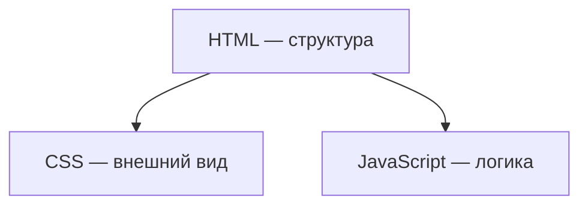

import ExternalPlayEmbed from '@site/src/components/ExternalPlayEmbed';

# HTML, CSS и JavaScript — три слоя веб-страницы

<div class="article-tags">
  <span class="tag tag-required">ОБЯЗАТЕЛЬНО</span>
  <span class="tag tag-beginner">ДЛЯ НОВИЧКОВ</span>
</div>

<span class="complexity-badge">Разработчику</span>

---

Каждая страница в [браузере](/encyclopedia/1-basics/1-11-soft-ryadovogo-polzovatelya/3) собирается из трёх слоёв. Их удобно хранить в отдельных файлах и не смешивать задачи.

| Слой | Технология | Вопрос |
|------|------------|--------|
| Структура и смысл | [HTML](/encyclopedia/3-data-markup/3-09-html/intro) | Что на странице — заголовок, абзац, форма, ссылка |
| Оформление | [CSS](/encyclopedia/3-data-markup/3-10-css/intro) | Как это выглядит — цвет, шрифт, отступы, сетка |
| Поведение | [JavaScript](/encyclopedia/5-languages/5-01-javascript/intro) | Что происходит при действии — клик, отправка формы, запрос к серверу |

Аналогия с тортом: HTML — корж, CSS — крем и украшение, JavaScript — механизм, который реагирует на нажатие кнопки.

**Разделение ответственности** — когда структура в HTML, вид в CSS, логика в JS. Так проще править дизайн, чинить баги и подключать новые страницы. Один и тот же CSS можно применить к разным HTML-шаблонам.



Подробнее про путь от файла до экрана

<ExternalPlayEmbed example="system-network/web-page-layers-play" title="Три слоя страницы" minHeight={560} />
 — [Как работают сайты](/encyclopedia/2-system-network/2-04-kak-rabotayut-sayty-i-veb-sayty/intro).

---

## HTML — каркас страницы

**HTML** (HyperText Markup Language, язык разметки гипертекста) описывает **содержимое и иерархию** страницы. Это язык разметки, а не полноценное программирование: вы говорите браузеру, где заголовок, где абзац, где ссылка.

**Тег** — команда в угловых скобках, например `<p>`, `<a>`, `<button>`. Большинство тегов парные: открывающий и закрывающий, между ними — текст или вложенные элементы.

Минимальный документ:

```html
<!DOCTYPE html>
<html lang="ru">
  <head>
    <meta charset="utf-8" />
    <title>Мой первый сайт</title>
    <link rel="stylesheet" href="styles.css" />
  </head>
  <body>
    <h1>Добро пожаловать</h1>
    <p>Это абзац с <a href="/about">ссылкой</a>.</p>
    <script src="app.js"></script>
  </body>
</html>
```

Части документа:

- `<!DOCTYPE html>` — подсказка браузеру, что это современный HTML5;
- `<head>` — служебная информация (кодировка, заголовок вкладки, подключение CSS);
- `<body>` — всё, что видит пользователь;
- `<link rel="stylesheet">` — подключение файла CSS;
- `<script src="...">` — подключение файла JavaScript (обычно в конце `body`, чтобы HTML успел загрузиться).

Дальше по HTML — [раздел 3.09](/encyclopedia/3-data-markup/3-09-html/intro), [первая страница](/encyclopedia/3-data-markup/3-09-html/1.md). Готовые блоки — [Lab / HTML+CSS](/lab/Примеры/110), [страницы целиком / 1153](/lab/Примеры/1153).

### Семантическая разметка

**Семантика** — выбор тега по **смыслу** элемента, а не по тому, как он выглядит на экране. Внешний вид всё равно задаёт CSS.

| Плохой вариант | Лучший вариант | Почему |
|----------------|----------------|--------|
| `<div class="heading">` | `<h1>` … `<h6>` | [Скринридер](/encyclopedia/1-basics/1-11-soft-ryadovogo-polzovatelya/3) и поисковики понимают иерархию заголовков |
| `<div onclick="...">` | `<button>` | Кнопка доступна с клавиатуры, у неё есть фокус |
| `<b>` вместо заголовка | `<strong>` или `<h2>` | `<b>` только визуально выделяет; заголовок несёт структуру |

Полезные семантические теги: `<header>`, `<nav>`, `<main>`, `<article>`, `<footer>`, `<section>`.

### HTML и текстовый редактор

Word и похожие программы сохраняют **готовый вид** — шрифт, отступы, цвет прямо в файле. HTML сохраняет **роли блоков**. Жирный текст в Word и тег `<strong>` решают разные задачи: в HTML вы описываете смысл ("важный фрагмент"), а жирность задаёт CSS при необходимости.

Копировать из Word в HTML напрямую нельзя — в разметку попадёт лишний мусор. Пишите в редакторе кода или вставляйте **чистый текст**.

---

## CSS — оформление страницы

**CSS** (Cascading Style Sheets, каскадные таблицы стилей) связывает **селектор** (какие элементы красить) с **правилами** (цвет, размер, расположение).

```css
h1 {
  color: #1a365d;
  font-family: system-ui, sans-serif;
  margin-bottom: 1rem;
}

.card {
  padding: 1.5rem;
  border-radius: 8px;
  box-shadow: 0 2px 8px rgba(0, 0, 0, 0.08);
}
```

<ExternalPlayEmbed example="basics/html-colors-play" title="HTML-цвета: тренажёр" minHeight={560} />

**Селектор** `h1` применяет стили ко всем заголовкам первого уровня. Класс `.card` — к элементам с `class="card"`.

Обзор — [CSS intro](/encyclopedia/3-data-markup/3-10-css/intro), [основы](/encyclopedia/3-data-markup/3-10-css/1.md).

### Каскад и специфичность

На один элемент часто действуют несколько правил CSS. Браузер выбирает итог по **каскаду**:

- важность (`!important` — использовать редко);
- **специфичность** селектора (id сильнее класса, класс сильнее тега);
- порядок в файле (ниже — перекрывает выше).

Стили в отдельном `.css`-файле проще переиспользовать и менять тему, чем атрибут `style="..."` на каждом теге.

### Блочная модель

Каждый элемент на странице — прямоугольник из четырёх зон:

- **content** — текст и картинка внутри;
- **padding** — внутренний отступ от текста до границы;
- **border** — рамка;
- **margin** — внешний отступ до соседних элементов.

```
┌──────── margin ────────┐
│ ┌──── border ────────┐ │
│ │ ┌── padding ─────┐ │ │
│ │ │   content    │ │ │
│ │ └──────────────┘ │ │
│ └──────────────────┘ │
└──────────────────────┘
```

Свойство `box-sizing: border-box` включает padding и border в заданную `width`. Без него блок с `width: 100%` и padding часто **вылезает** за край родителя.

Сетка страницы — [Flexbox и CSS Grid](/encyclopedia/3-data-markup/3-10-css/2.md). Адаптив под телефон — [медиазапросы](/encyclopedia/3-data-markup/3-10-css/7.md). Готовые эффекты — [Lab / анимации](/lab/Примеры/1116).

---

## JavaScript — логика в браузере

**JavaScript** (JS) — язык программирования, который выполняется **в браузере** (и на сервере в [Node.js](/encyclopedia/5-languages/5-01-javascript/3-ecosystem/1-runtime-node/intro), но здесь речь о фронте).

Браузер строит из HTML дерево **DOM** (Document Object Model, объектная модель документа). JavaScript читает и меняет узлы этого дерева — текст, классы, атрибуты — и реагирует на события (клик, ввод, отправка формы).

```javascript
const button = document.querySelector("#greet");
button.addEventListener("click", () => {
  const name = document.querySelector("#name").value;
  document.querySelector("#output").textContent = `Привет, ${name}!`;
});
```

Здесь:

- `document.querySelector` находит элемент по CSS-селектору;
- `addEventListener("click", ...)` подписывается на клик;
- `textContent` меняет текст внутри узла.

Типичные задачи JS на странице:

- показать или скрыть блок меню;
- проверить email в форме до отправки на сервер;
- запросить данные с API через `fetch` — [глава 1](./1.md), [Lab / fetch](/lab/Примеры/1145);
- обновить список задач без перезагрузки всей страницы (основа [SPA](/encyclopedia/2-system-network/2-04-kak-rabotayut-sayty-i-veb-sayty/111.md)).

Статическую разметку (заголовки, формы, ссылки) лучше описывать в HTML. JavaScript дополняет её интерактивом. Если весь интерфейс рисуется только скриптом, страдают [доступность](./7.md) и индексация в поиске — [SEO](/encyclopedia/2-system-network/2-04-kak-rabotayut-sayty-i-veb-sayty/118.md).

Введение в язык — [JavaScript intro](/encyclopedia/5-languages/5-01-javascript/intro).

---

## Как слои работают вместе

1. Сервер или диск отдаёт файл **HTML**.
2. Браузер разбирает разметку, строит **DOM**, запрашивает **CSS** и **JS** по ссылкам из `<head>` и `<body>`.
3. CSS накладывается на узлы DOM — появляется визуальный макет.
4. JavaScript выполняется, подписывается на события, при необходимости меняет DOM.
5. При `fetch("/api/...")` скрипт получает [JSON](./1.md) и подставляет данные в уже существующие блоки страницы.

Отладка по слоям в [DevTools](/encyclopedia/4-code-dev/4-14-razrabotka-i-otladka/1116):

- **Elements** — дерево DOM и разметка;
- **Styles** — какие правила CSS применились и откуда;
- **Console** — ошибки и вывод JavaScript;
- **Network** — загрузка файлов и запросы к API.

---

## Минимальный проект из трёх файлов

```
my-site/
  index.html    — структура
  styles.css    — оформление
  app.js        — поведение
```

В `index.html` подключите CSS в `<head>`, скрипт — перед закрывающим `</body>`. Для локального просмотра с API поднимите простой HTTP-сервер (расширение Live Server в VS Code, `npx serve`) — [запуск приложений](/encyclopedia/1-basics/1-12-sovety-dlya-novichka/13).

---

## Частые ошибки новичка

| Ошибка | Что происходит | Куда смотреть |
|--------|----------------|---------------|
| Вёрстка целиком на `<table>` | Таблицы предназначены для табличных **данных**, не для сетки страницы | [Flexbox и Grid](/encyclopedia/3-data-markup/3-10-css/2.md) |
| `style="..."` на каждом теге | Стили нельзя переиспользовать и менять централизованно | Классы в `.css` |
| `document.write` для UI | Ломает порядок загрузки и индексацию | DOM API, `textContent`, `innerHTML` осторожно |
| Вставка из Word | Лишние теги и стили в HTML | Чистый текст, редактор кода |
| Один файл `app.js` на тысячи строк | Сложно искать баги | Модули `import`/`export`, сборщик — [4.04](/encyclopedia/4-code-dev/4-04-proekt-i-freymvorki/intro) |

---

## Когда подключают фреймворк

На больших проектах HTML превращают в **компоненты** (React JSX, Vue SFC), CSS — в модули или utility-классы ([Tailwind](/encyclopedia/3-data-markup/3-10-css/120.md)), JavaScript группируют по экранам. Схема «три слоя» остаётся — меняется только организация файлов.

Карта стека, React, Node, базы — [Как делают веб-приложения](./4.md).

---

## Вызов API из браузера

```javascript
async function loadTasks() {
  const res = await fetch("/api/tasks");
  if (!res.ok) throw new Error(`HTTP ${res.status}`);
  return res.json();
}

async function createTask(title) {
  const res = await fetch("/api/tasks", {
    method: "POST",
    headers: { "Content-Type": "application/json" },
    body: JSON.stringify({ title, done: false }),
  });
  return res.json();
}
```

Обработка `401` — редирект на login; `400` — показать ошибки валидации — [118](/encyclopedia/4-code-dev/4-14-razrabotka-i-otladka/118). Полный разбор curl, CORS, middleware — [глава 4](./4.md#http-и-api-в-проекте). Примеры — [fetch / 1145](/lab/Примеры/1145).

---

## Следующий шаг

После трёх файлов (`index.html`, `styles.css`, `app.js`) — [HTTP и API](./4.md), [этапы проекта](./6.md) или [основы дизайна](./7.md). Отладка запросов — [DevTools](/encyclopedia/4-code-dev/4-14-razrabotka-i-otladka/1116).

---
