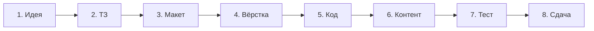

# От идеи до работающего сайта

  ДЛЯ НОВИЧКОВ

Разработчику
Аналитику

---

Сайт редко появляется сразу в интернете. Обычно проходят цепочку шагов: цель → согласованный макет → вёрстка → программирование → наполнение → проверка → публикация. В [главе 5](./5.md) — три технологических слоя страницы; в [главе 1](./1.md) — [HTTP](/encyclopedia/2-system-network/2-09-osnovy-integratsionnogo-vzaimodeystviya/118) и API. Здесь — **жизненный цикл проекта** целиком.

---

## Восемь этапов

| № | Этап | Действия | Результат |
|---|------|----------|-----------|
| 1 | **Идея** | Кто пользователь, какие задачи решает сайт | краткое описание целей |
| 2 | **ТЗ** (техническое задание) | Список страниц, ролей, сроков, интеграций | документ для согласования |
| 3 | **Макет** | Wireframe, дизайн в Figma или на бумаге | утверждённый внешний вид — [глава 7](./7.md) |
| 4 | **Вёрстка** | HTML и CSS по макету | страницы открываются в браузере — [глава 5](./5.md) |
| 5 | **Программирование** | Сервер, база, формы, API | работающая логика — [глава 4](./4.md) |
| 6 | **Контент** | Тексты, фото, товары | наполненный сайт |
| 7 | **Тестирование** | Кнопки, браузеры, телефон | список исправлений — [1117](/encyclopedia/4-code-dev/4-14-razrabotka-i-otladka/1117) |
| 8 | **Сдача** | Доступы, обучение заказчика | сайт на боевом [домене](/encyclopedia/2-system-network/2-04-kak-rabotayut-sayty-i-veb-sayty/intro) |

После каждого этапа показывайте результат заказчику или себе в pet-проекте. Так проще поймать несоответствие ожиданиям до финального деплоя.

---

## Три уровня сложности

Перед кодом выберите, **сколько технологий** нужно. Не каждому проекту требуются React и PostgreSQL.

### Статический сайт

Подходит для визитки, портфолио, документации, лендинга без личного кабинета.

- на сервере лежат готовые файлы HTML, CSS, JavaScript;
- веб-сервер **отдаёт файлы как есть**, без программы, которая собирает страницу на лету;
- публикация бесплатно — [GitHub Pages](/lab/Кейсы/3), Netlify, Cloudflare Pages;
- обновление — загрузить новые файлы или `git push` в CI.

Подробнее — [статический сайт в главе 1](./1.md).

### CMS — система управления контентом

Подходит для блога, корпоративного сайта, каталога, когда заказчик сам правит тексты без программиста.

**CMS** (Content Management System) — готовая платформа с админкой, темами оформления и плагинами.

- **WordPress** — самый распространённый вариант; многие хостинги ставят его в один клик;
- страницы и записи хранятся в базе (часто MySQL);
- HTML собирается на сервере из PHP-шаблонов темы;
- нужны регулярные обновления безопасности тем и плагинов.

Для обучения HTML и CSS CMS не обязательна. Для малого бизнеса с частым изменением контента — частый практический выбор. Сравнение с полной разработкой — [глава 4](./4.md).

### Своё веб-приложение

Подходит при личном кабинете, заказах, оплате, API для мобильного приложения, нестандартной логике.

- фронтенд ([SPA](/encyclopedia/2-system-network/2-04-kak-rabotayut-sayty-i-veb-sayty/111.md) или серверные шаблоны) + бэкенд + [SQL](/encyclopedia/3-data-markup/3-07-sql/intro) или [NoSQL](/encyclopedia/3-data-markup/3-06-nosql/intro);
- полный контроль над кодом и данными;
- больше времени на разработку и поддержку.

Карта стека — [глава 4](./4.md), протокол — [глава 1](./1.md).

| Критерий | Статика | CMS | Своё приложение |
|----------|---------|-----|-----------------|
| Срок до первой версии | дни | дни – недели | недели – месяцы |
| Личный кабинет | нет | через плагины | да |
| Хостинг | дёшево или бесплатно | shared-хостинг | VPS, облако, PaaS |
| Постоянный разработчик | обычно не нужен | иногда | да |

---

## Инструменты на старте

### Редактор кода

Пишите разметку в программе с подсветкой синтаксиса, а не в Word.

- [Visual Studio Code](https://code.visualstudio.com) — распространённый выбор;
- расширения Live Server (превью в браузере), Prettier (форматирование), ESLint (проверка JS);
- терминал и Git — [раздел 4.13](/encyclopedia/4-code-dev/4-13-osnovy-raboty-s-git/intro), [первый PR](/encyclopedia/4-code-dev/4-13-osnovy-raboty-s-git/117).

### Браузеры

У разных браузеров слегка отличается отрисовка CSS. Проверяйте сайт минимум в Chrome и Firefox; на Mac — ещё Safari.

В [DevTools](/encyclopedia/4-code-dev/4-14-razrabotka-i-otladka/1116) смотрите вкладки **Console** (ошибки JS) и режим узкого экрана (вид на телефоне). Про движки браузеров — [2.04 / движки](/encyclopedia/2-system-network/2-04-kak-rabotayut-sayty-i-veb-sayty/127.md).

### Локальный просмотр

Двойной клик по `index.html` открывает адрес `file://`. Для простой вёрстки этого хватает.

Для `fetch` к API нужен **локальный HTTP-сервер** — Live Server, `npx serve`, [Vite](/encyclopedia/5-languages/5-01-javascript/3-ecosystem/2-frontend-frameworks/270.md). Иначе браузер блокирует часть запросов из соображений безопасности.

---

## Вёрстка по макету

**Вёрстка** — перенос утверждённого дизайна в HTML и CSS так, чтобы в браузере страница совпадала с макетом. В разговоре дизайнеры говорят "нарезать макет" — имеется в виду эта работа.

Порядок работы:

1. Разметить **структуру** — `<header>`, `<nav>`, `<main>`, `<footer>`.
2. Подключить шрифты и базовые стили (сброс отступов, цвет фона).
3. Построить сетку — [Flexbox и Grid](/encyclopedia/3-data-markup/3-10-css/2.md).
4. Добавить состояния — наведение (`:hover`), фокус с клавиатуры, [адаптив](/encyclopedia/3-data-markup/3-10-css/7.md).
5. Подключить JavaScript для интерактива — меню, слайдер, отправка формы через `fetch`.

Материалы — [глава 5](./5.md), [HTML](/encyclopedia/3-data-markup/3-09-html/intro), [CSS](/encyclopedia/3-data-markup/3-10-css/intro), [дизайн](./7.md).

---

## Программирование после вёрстки

Статические HTML-страницы не сохраняют заказы и не проверяют пароль на сервере. Когда нужны учёт пользователей, оплата, поиск по базе, подключают **бэкенд**.

| Компонент | Назначение | Примеры |
|-----------|------------|---------|
| Серверный язык | Принимает HTTP-запрос, выполняет логику | [PHP](/encyclopedia/5-languages/5-07-php/intro), [Python](/encyclopedia/5-languages/5-02-python/intro), [Node.js](/encyclopedia/5-languages/5-01-javascript/3-ecosystem/1-runtime-node/intro), C# |
| База данных | Хранит пользователей, заказы, статьи | [PostgreSQL](/encyclopedia/3-data-markup/3-07-sql/888), [MySQL](/encyclopedia/3-data-markup/3-07-sql/889) |
| **MVC** | Разделение данных, интерфейса и логики | Model — данные, View — HTML, Controller — обработка запроса — [ООП](/encyclopedia/4-code-dev/4-08-oop/intro) |
| JavaScript в браузере | Действия без перезагрузки, вызов API | `fetch`, [глава 1](./1.md) |

Типовые **стеки** (наборы технологий) — [MERN и LAMP в главе 4](./4.md).

---

## Публикация в интернете

### Домен и хостинг

**Домен** — человекочитаемое имя сайта (`example.com`). **DNS** переводит его в IP-адрес сервера — [2.04 Сайты](/encyclopedia/2-system-network/2-04-kak-rabotayut-sayty-i-veb-sayty/intro).

**Хостинг** — компьютер в дата-центре, где лежат файлы или крутится ваше приложение.

| Тип хостинга | Что размещают |
|--------------|---------------|
| Статический (GitHub Pages, Netlify) | HTML, CSS, JS без своего сервера |
| Shared (общий) | PHP, WordPress, почта на домене |
| VPS / облако | Своё API, Docker, полный контроль — [8.00 инфраструктура](/encyclopedia/8-infra-security/8-00-osnovy-infrastruktury/intro) |
| PaaS (Render, Fly.io) | Деплой из Git, ОС настраивает платформа |

### Как файлы попадают на сервер

- **Git push + CI/CD** — коммит запускает сборку и выкладку — [8.04 DevOps](/encyclopedia/8-infra-security/8-04-devops-ci-cd/intro), [GitHub Actions](/lab/Примеры/1134);
- **FTP / SFTP** — загрузка папки по протоколу передачи файлов; ещё встречается на дешёвых тарифах;
- **Панель хостинга** — файловый менеджер или установщик WordPress.

На боевом сайте (**production**) включите **HTTPS** — [шифрование TLS](/encyclopedia/2-system-network/2-03-set-i-internet/611). Пароли и ключи API храните в переменных окружения, не в Git — [1112](/encyclopedia/4-code-dev/4-14-razrabotka-i-otladka/1112), [`.gitignore`](/encyclopedia/4-code-dev/4-13-osnovy-raboty-s-git/116).

**Staging** — копия сайта для проверки перед переключением боевого домена.

---

## Тестирование перед запуском

Минимальный чек-лист:

- [ ] Все ссылки и кнопки ведут туда, куда задумано.
- [ ] Формы отправляются; ошибки видны пользователю.
- [ ] Страница читаема на ширине ~375px (телефон).
- [ ] В Console DevTools нет красных ошибок.
- [ ] У картинок есть `alt`; текст читаем по контрасту — [глава 7](./7.md).
- [ ] На staging проверен сценарий регистрации и оплаты (если есть).

Нагрузочные тесты для учебного проекта необязательны; для магазина — [тестирование](/encyclopedia/4-code-dev/4-14-razrabotka-i-otladka/1117).

---

## После запуска

Сайт живёт дальше:

- обновление статей и каталога;
- обучение заказчика работе с админкой;
- исправление багов, обновление CMS и зависимостей;
- резервные копии базы и патчи безопасности — [2.08 ИБ](/encyclopedia/2-system-network/2-08-osnovy-informatsionnoy-bezopasnosti/intro);
- продвижение и [SEO](/encyclopedia/2-system-network/2-04-kak-rabotayut-sayty-i-veb-sayty/118.md).

Код держите в Git — при неудачном обновлении можно откатиться к прошлому коммиту.

---

## Pet-проект на две недели

| Дни | Этап | Задача |
|-----|------|--------|
| 1–2 | Идея и ТЗ | Три страницы и одна форма своими словами |
| 3–4 | Макет | Wireframe на бумаге или в Figma |
| 5–7 | Вёрстка | HTML + CSS, мобильная ширина |
| 8–10 | Код | Простой API или серверная форма |
| 11 | Контент | Реальные тексты и несколько картинок |
| 12–13 | Тест | Два браузера, DevTools, телефон |
| 14 | Публикация | [GitHub Pages](/lab/Кейсы/3) или VPS |

Дальше — [чек-лист](./3.md), [итоги](./2.md).

---
