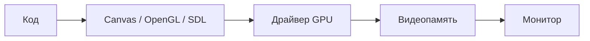

import ExternalPlayEmbed from '@site/src/components/ExternalPlayEmbed';

# От чисел к картинке

  ОБЯЗАТЕЛЬНО
  ДЛЯ НОВИЧКОВ

Разработчику
Всем

Теория пикселя и GPU — в [разделе 1.16 Графика](/encyclopedia/1-basics/1-16-grafika/intro). Здесь — как те же идеи выглядят **в исходном коде**.

---

## Две части одного файла

В графическом проекте в одном файле обычно смешаны две задачи.

**Модель** — числа в [оперативной памяти](/encyclopedia/1-basics/1-08-kak-rabotaet-kompyuter/2): координаты шара, цвет, очки, флаг «пуля активна».

**Отрисовка** — команды среде выполнения: «нарисуй круг в точке (x, y)», «залей красным».

Пока эти части не разделены в голове, код кажется сплошной математикой. После запуска на экране появляется картинка — отсюда ощущение «магии». Разметка файла и примеры записей модели — в [главе 2](./2.md).

---

## Конвейер от кода до монитора

**Графический конвейер** — цепочка преобразований от вашего скрипта до света на экране.

1. Код на [JavaScript](/encyclopedia/5-languages/5-01-javascript/intro) или [Python](/encyclopedia/5-languages/5-02-python/intro) хранит модель и вызывает API.
2. **Графический API** ([Canvas](/encyclopedia/5-languages/5-01-javascript/47), [OpenGL](./11.md), [SDL](./8.md)) формирует команды.
3. **Драйвер** видеокарты переводит команды в работу **GPU**.
4. Результат попадает в **VRAM** — таблицу цветов пикселей.
5. **Монитор** считывает кадр по [HDMI или DisplayPort](./14.md) с частотой 60–144 **FPS**.

Между API и GPU часто стоят прослойки ([Skia, ANGLE](./10.md)), этапы шейдерного конвейера ([глава 11](./11.md)), буферизация и V-Sync ([глава 13](./13.md)). Обзор пикселя — [графические данные](/encyclopedia/1-basics/1-16-grafika/1).

---

## Три линии в одном файле

| Линия | Смысл | Пример |
|-------|--------|--------|
| **Данные** | снимок состояния сейчас | `{ x: 150, y: 200, radius: 30 }` |
| **Время** | изменение каждый кадр | `ball.x += ball.vx * dt` |
| **Железо** | команда холсту или GPU | `ctx.arc(x, y, r, 0, Math.PI * 2)` |

Данные создают один раз или при спавне объекта. Затем цикл **60 раз в секунду** обновляет числа и перерисовывает кадр — см. [игровой цикл](./3.md).

---

## Шесть шагов графического приложения

1. **Холст** — плоскость с шириной и высиной (`<canvas>`, `pygame.display.set_mode`, камера Unity)
2. **Контекст** — объект для рисования (`getContext('2d')`, `pygame.draw`)
3. **Модель** — объекты с координатами, цветом, флагами
4. **update()** — физика, ввод, таймеры; меняются только числа
5. **render()** — чтение модели и вызовы рисования
6. **Цикл** — `requestAnimationFrame` или `while`; каждый проход = один кадр

Движение — серия статичных кадров. Разделение model / update / render — [глава 2](./2.md).

---

## Живой пример

В демо можно переключать слои: справа — **модель** в JSON, слева — холст.

<ExternalPlayEmbed example="code-dev/graphics-model-render-play" title="Модель, update и render" minHeight={480} />

Полные листинги Canvas и Pygame — в [главе 2](./2.md) и [каталоге кода](https://code.spirzen.ru/) (`code-418-1-001`, `code-418-1-002`).

---

## Куда смотреть дальше

| Тема | Глава |
|------|-------|
| MVC, координаты, DOM vs Canvas, чтение чужого кода | [2](./2.md) |
| Игровой цикл, FSM, `dt` | [3](./3.md) |
| Массивы сцены, culling | [4](./4.md) |
| Векторы, матрицы, ось Y | [5](./5.md) |
| Холст, окно, ввод, HiDPI | [6](./6.md) |
| Canvas 2D, WebGL, `requestAnimationFrame` | [7](./7.md) |
| Pygame, SDL, Tkinter | [8](./8.md) |
| Unity, WPF, MAUI | [9](./9.md) |
| Skia, ANGLE, растризация 2D | [10](./10.md) |
| OpenGL, шейдеры, GPU-конвейер | [11](./11.md) |
| VRAM, текстуры, профилирование | [12](./12.md) |
| Double buffer, V-Sync, бюджет кадра | [13](./13.md) |
| Битмап, HDMI, цвет, монитор | [14](./14.md) |
| Термины раздела | [998](./998.md#терминология-раздела) |

Платформы используют один принцип — разные библиотеки. Обзор стеков — [главы 6–9](./6.md).

---

## Кратко

- Графика в коде — **числа**, **команды отрисовки**, **цикл во времени**
- В одном файле переплетены данные, логика и команды железу
- Модель и render лучше держать раздельно в голове и в функциях
- От `fillRect` до монитора — API, прослойки, драйвер, GPU, буфер, кабель
