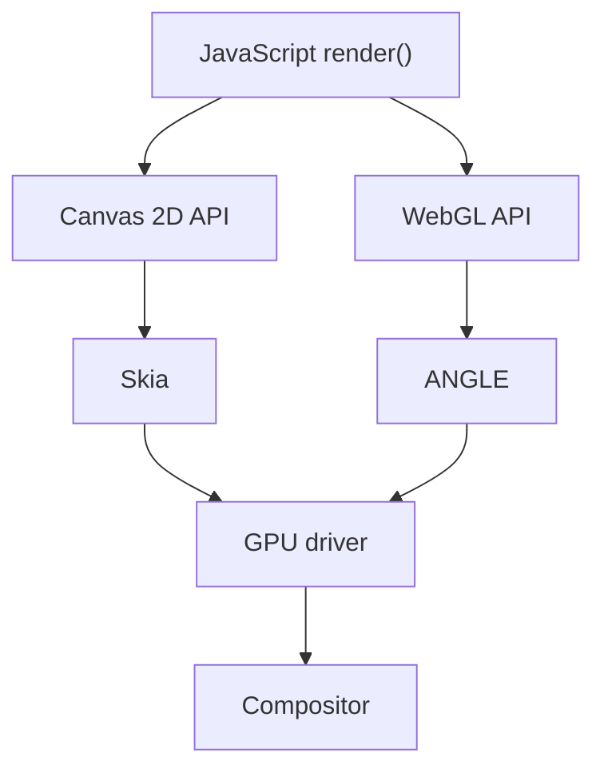

# Skia и ANGLE — прослойки рендеринга

<div class="article-tags">
  <span class="tag tag-notrequired">НЕ ОБЯЗАТЕЛЬНО</span>
</div>

<span class="complexity-badge">Разработчику</span>
<span class="complexity-badge">Архитектору</span>

Вызов `ctx.fillRect` в браузере **не попадает напрямую** в видеокарту. Между JavaScript и драйвером — **движки растеризации** и **трансляторы API**. Они объясняют различия Chrome и Safari, Flutter на Windows и разное поведение WebGL на одном ПК.

---

## Зачем это разработчику

| Вопрос | Ответ |
|--------|-------|
| Почему Canvas и Flutter похожи? | оба используют Skia-подобный 2D pipeline |
| Почему WebGL на Windows и Linux отличается? | ANGLE переводит в Direct3D или native GL |
| Откуда артефакты сглаживания? | разные фильтры и gamma в движке |

---

## Skia

Open-source **2D-движок Google**. Официальный сайт — [skia.org](https://skia.org/).

| Продукт | Роль Skia |
|---------|-----------|
| **Chrome** | Canvas 2D, часть UI |
| **Android** | UI framework |
| **Flutter** | единый рендер Win/Mac/Linux/mobile |
| Firefox | частично |

### Что делает Skia

1. Принимает примитивы — path, text, image, gradient
2. Строит **display list** (список команд растеризации)
3. Выполняет на **CPU** или **GPU** (GL, Vulkan, Metal)

Вызов `ctx.arc` в браузере: JS binding → Skia path → растр в текстуре canvas.

**SkiaSharp** — .NET-обёртка; используется в MAUI на части платформ.

### Canvas 2D и WebGL

Canvas 2D — **высокоуровневые** примитивы. WebGL — вы сами загружаете треугольники. Skia для 2D скрывает разбиение кривых на треугольники.

---

## ANGLE

**Almost Native Graphics Layer Engine** — переводит **OpenGL ES** в нативный API ОС. Документация — [chromium.googlesource.com/angle](https://chromium.googlesource.com/angle/angle.git/+/HEAD/doc/README.md).

| ОС | Куда переводит ANGLE |
|----|----------------------|
| Windows | Direct3D 11/12 |
| macOS / iOS | Metal |
| Android / Linux | Vulkan / GLES |

### Зачем это Chromium

- один стек WebGL для всех ОС
- на Windows меньше зависимости от vendor OpenGL
- единое тестирование в Chromium

### Практика

```
WebGL JS → ANGLE → D3D (Windows) → драйвер NVIDIA/AMD
WebGL JS → ANGLE → Metal (macOS)
Canvas 2D → Skia → (GL/Vulkan/CPU) → драйвер
```

- тестируйте на целевых браузерах и GPU
- баг "только Chrome Windows" — смотреть ANGLE + D3D
- **precision** в fragment shader может чуть отличаться между backend

---

## Другие прослойки

| Имя | Роль |
|-----|------|
| **Mesa** | open-source GL на Linux |
| **EGL / WGL / GLX** | привязка GL-контекста к окну |
| **SwiftShader** | программный Vulkan на CPU (fallback) |
| **SDL** | окно и события, [глава 8](./8.md) |

---

## Браузерный кадр — схема



---

## Связи

- [Canvas 2D](./7.md)
- [OpenGL и Vulkan](./11.md)
- [Flutter / Dart](/encyclopedia/5-languages/5-22-dart/311)
- [Растровая графика — 9.08](/encyclopedia/9-spinoff/9-08-kompyuternaya-grafika/11)
