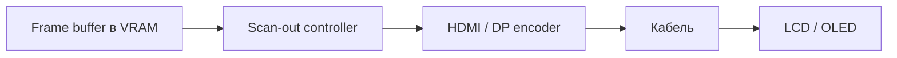

import ExternalPlayEmbed from '@site/src/components/ExternalPlayEmbed';

# От битмапы до монитора

  НЕ ОБЯЗАТЕЛЬНО

Всем
Разработчику

В конце любого графического конвейера — **прямоугольная таблица цветов** в видеопамяти. Монитор читает её сотни раз в секунду и превращает в свет.

---

## Битмап — финальная форма

**Frame buffer** — 2D массив пикселей **RGBA** (Red, Green, Blue, Alpha).

Пример **1920×1080**, 8 бит на канал:

- 2 073 600 пикселей × 4 байта ≈ **8 МБ** на color buffer
- @ 60 FPS только color ≈ **480 МБ/с** (без depth, теней, post-process)

В шейдерах цвет часто **0.0–1.0 float**; на выходе — 8 или 10 бит на канал для панели.

---

## Вектор становится растром

**SVG**, шрифты, UI-кривые — инструкции "как нарисовать". Панель LCD/OLED показывает только **сетку пикселей**.

Перед scan-out:

- Skia / CPU tessellation (2D)
- GPU rasterization (3D, WebGL)

См. [Вектор и растр](/encyclopedia/1-basics/1-16-grafika/2).

---

## Путь от VRAM к панели

**Scan-out** — построчное чтение буфера с частотой **refresh rate** (60, 120, 144 Гц…).

---

## HDMI и DisplayPort

Передаётся поток пикселей, аудио и служебные данные (HDCP, HDR metadata).

| | HDMI | DisplayPort |
|---|------|-------------|
| Типичное применение | TV, консоли | ПК, high refresh |
| Пропускная способность | растёт с версией (2.1) | часто выше на ПК |
| Сжатие | DSC на высоких режимах | DSC |

Недостаточная полоса → снижение разрешения/Гц или сжатие **DSC** (Display Stream Compression).

### Пример расчёта

4K (3840×2160) @ 60 Гц, 8-bit RGB ≈ 12 Gbit/s сырого видео — нужен HDMI 2.0+ или DP 1.2+.

---

## Цветовые пространства

| | sRGB | HDR (PQ / HLG) |
|---|------|----------------|
| Типичный монитор | да | premium / TV |
| Битность | 8 bit/channel | 10–12 bit |
| В коде | canvas, текстуры | tone mapping в играх |

**Gamma** — нелинейная яркость; sRGB учитывает восприятие глаза.

Несовпадение ICC-профилей даёт бледные цвета в браузере и насыщенные в Photoshop.

<ExternalPlayEmbed example="basics/color-space-picker-play" title="Цветовые пространства" minHeight={400} />

**Цветовой менеджмент** — ICC-профили в дизайне; игры часто используют "яркий" look без калибровки.

---

## Тайминги монитора

Кадр = **active video** + **blanking** (пауза между строками/кадрами).

В blanking GPU успевает подготовить следующий кадр — связь с [V-Sync](./13.md).

| Параметр | Смысл |
|----------|-------|
| Refresh rate | 60 / 120 / 144 / 240 Гц |
| Response time | скорость пикселя панели (ghosting) |
| Frame time | время **рендера** игры (мс) |

Это **разные** величины: игра может рендерить 144 FPS, но панель 60 Гц — увидите 60.

---

## HiDPI и физические пиксели

**CSS pixel** на Retina ≠ один физический subpixel. `devicePixelRatio = 2` → буфер canvas в 2× больше ([глава 6](./6.md)).

---

## Итог раздела 4.18

1. Код хранит **модель** — числа
2. **Render** + API → команды GPU
3. **VRAM** — битмап кадра
4. **Swap + V-Sync** — целый кадр на монитор
5. **Кабель** — поток пикселей на панель

---

## Связи

- [Введение](./1.md)
- [Буферизация](./13.md)
- [Графические данные](/encyclopedia/1-basics/1-16-grafika/1)
- [Аудио и видео](/encyclopedia/1-basics/1-17-audio-i-video/intro)
