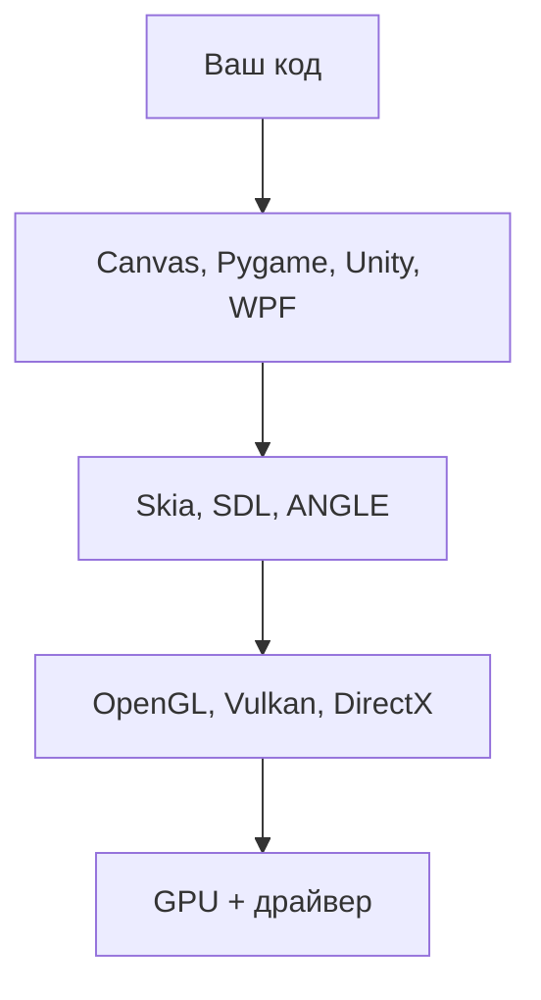

import ExternalCodeEmbed from '@site/src/components/ExternalCodeEmbed';

# High-Level API — абстракция, контекст, окно и ввод

<div class="article-tags">
  <span class="tag tag-required">ОБЯЗАТЕЛЬНО</span>
  <span class="tag tag-beginner">ДЛЯ НОВИЧКОВ</span>
</div>

<span class="complexity-badge">Разработчику</span>

**High-Level API** (высокоуровневый графический API) — набор команд "нарисуй прямоугольник", "открой окно", "прочитай клавишу". Вы вызываете `fillRect`, `pygame.draw.circle` или `Graphics.DrawMesh`, драйвер GPU остаётся за кадром.

---

## Слои абстракции



| Уровень | Контроль | Скорость входа |
|---------|----------|----------------|
| High | низкий | часы |
| Mid API | средний | недели |
| Vulkan, D3D12 | максимальный | месяцы |

---

## Контекст рендеринга

**Контекст** — объект, через который идут все команды рисования. Без активного контекста draw-вызовы игнорируются.

| Платформа | Как получить |
|-----------|--------------|
| Canvas 2D | `canvas.getContext('2d')` |
| WebGL | `canvas.getContext('webgl2')` |
| Pygame | `screen = pygame.display.set_mode((w, h))` |
| SDL2 | `SDL_CreateRenderer` или GL context |
| GLFW + OpenGL | `glfwMakeContextCurrent(window)` |
| Unity | камера + `SpriteRenderer` / UI Canvas |

### Стек состояний Canvas 2D

`ctx.save()` запоминает цвет, толщину линии, трансформацию. `ctx.restore()` откатывает. Без пары save/restore поворот одного спрайта сдвинет все следующие объекты.

Частые свойства:

- `fillStyle`, `strokeStyle`
- `lineWidth`, `globalAlpha`
- `font`, `textAlign`

---

## Окно и HiDPI

**HiDPI** (экраны с высокой плотностью пикселей, Retina) — логический размер в CSS и размер буфера canvas различаются.

```javascript
const dpr = window.devicePixelRatio || 1;
canvas.width = logicalW * dpr;
canvas.height = logicalH * dpr;
ctx.scale(dpr, dpr);
```

Без масштабирования картинка размыта. При `resize` пересчитывайте буфер и projection в 3D.

События завершения:

- веб — `beforeunload`
- SDL — `SDL_QUIT`
- Windows — `WM_CLOSE`

Потеря фокуса вкладки — пауза звука и иногда симуляции.

<ExternalCodeEmbed example="html/code-418-6-001" title="HiDPI canvas, keys и координаты мыши" minHeight={420} />

---

## Ввод отдельно от render

**Handler события** только пишет в модель. Реакция — в `update`.

```javascript
const keys = {};
window.addEventListener('keydown', (e) => { keys[e.code] = true; });
window.addEventListener('keyup', (e) => { keys[e.code] = false; });

function update(dt) {
  if (keys.ArrowLeft) player.vx = -200;
}
```

| Событие | Web | Pygame |
|---------|-----|--------|
| Клавиша | `keydown` / `keyup` | `KEYDOWN` / `KEYUP` |
| Мышь | `mousedown`, `mousemove` | `MOUSEMOTION` |
| Touch | `touchstart` (+ `preventDefault`) | — |
| Выход | закрытие вкладки | `pygame.QUIT` |

**Координаты мыши**:

1. `getBoundingClientRect()`
2. масштаб в логические единицы canvas
3. offset камеры → мировые координаты

---

## Retained mode и Immediate mode

| | Immediate | Retained |
|---|-----------|----------|
| Кто хранит сцену | вы каждый кадр | платформа |
| Примеры | Canvas, Pygame draw | DOM, WPF, Unity |
| Перерисовка | clear и всё заново | только изменённые узлы |

В Canvas вы восстанавливаете картинку из модели 60 раз в секунду. В WPF платформа перерисовывает изменившиеся `Visual`.

---

## Выбор стека

| Задача | Инструмент |
|--------|------------|
| График, дашборд | Chart.js, D3, Matplotlib |
| 2D игра в браузере | Canvas, Phaser |
| 2D игра desktop | Pygame, MonoGame |
| 3D веб | Three.js, Babylon.js |
| Коммерческая 3D игра | Unity, Unreal, Godot |
| Нативный UI | WPF, MAUI, Qt |
| Максимум производительности | Vulkan, D3D12 |

---

## Частые ошибки

| Ошибка | Следствие |
|--------|-----------|
| Рисование в `keydown` | дубли кадров, лаг |
| Забытый `devicePixelRatio` | мыло на Retina |
| Нет `save`/`restore` вокруг rotate | сдвиг всей сцены |
| Глобальный `ctx.scale` без сброса | неверные hit-test координаты |

---

## Связи

- [Введение](./1.md)
- [Веб](./7.md)
- [Python и SDL](./8.md)
- [C#](./9.md)
- [Skia и ANGLE](./10.md)
