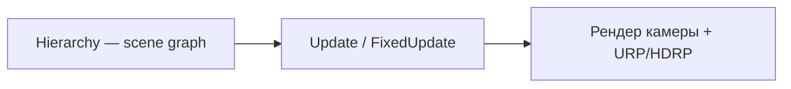

# C# — Unity, WPF и MAUI

<div class="article-tags">
  <span class="tag tag-notrequired">НЕ ОБЯЗАТЕЛЬНО</span>
  <span class="tag tag-beginner">ДЛЯ НОВИЧКОВ</span>
</div>

<span class="complexity-badge">Разработчику</span>

В экосистеме [C#](/encyclopedia/5-languages/5-03-csharp/intro) графика делится на **игровой движок** (сцена, компоненты, 3D) и **UI-фреймворки** (дерево элементов, вёрстка). Оба выходят на GPU, код читается по-разному.

---

## Два направления

| Направление | Стек | Модель в коде |
|-------------|------|----------------|
| Игры и 3D | Unity, MonoGame, Stride | `GameObject`, `Update`, сцена |
| Desktop и mobile UI | WPF, MAUI, WinForms | XAML, `Button`, layout |

---

## Unity — как читать проект



| Элемент | Роль |
|---------|------|
| `GameObject` | узел сцены |
| `Transform` | позиция, поворот, масштаб |
| `MonoBehaviour` | ваш скрипт с `Update()` |
| `SpriteRenderer` / `MeshRenderer` | что рисовать |
| `Camera` | viewpoint и culling |

- **Update()** — логика кадра (аналог `update`)
- **FixedUpdate()** — физика с фиксированным шагом (50 Гц по умолчанию)
- **LateUpdate()** — камера следует за игроком после движения

Рендер движок делает сам: batching, frustum culling, освещение. `drawArrays` вручную — только в custom shader или URP pass.

При открытии проекта ищите `MonoBehaviour` в `Assets/`, отличайте **Editor** scripts (`Editor/`) от runtime.

См. [Разработка игр](/encyclopedia/9-spinoff/9-04-razrabotka-igr/intro).

---

## WPF — retained UI на DirectX

- **XAML** — декларативное дерево (`Grid`, `Button`, `Path`)
- **Measure → Arrange → Render** — layout pass, затем отрисовка
- с версии 4+ рендер через **DirectX**
- **Data binding** — модель MVVM, UI обновляется при изменении свойств

Кастомная 2D: `OnRender(DrawingContext dc)` или `CompositionTarget.Rendering`.

Практикум: [WPF в 4.11](/encyclopedia/4-code-dev/4-11-desktopnye-prilozheniya/wpf-praktikum/intro).

---

## .NET MAUI

Кроссплатформенный UI (Windows, macOS, iOS, Android). На многих платформах рисует **Skia** ([глава 10](./10.md)).

- `GraphicsView` + `IDrawable` — программируемая 2D как Canvas
- XAML + MVVM по аналогии с WPF

Для игр — Unity или Godot.

---

## WinForms (контекст)

`OnPaint` + **GDI/GDI+** — отрисовка в стиле immediate mode. Подходит для маленьких утилит, слабее HiDPI и сложная графика.

---

## MonoGame и Stride

Фреймворки с явным циклом, без редактора Unity:

```csharp
protected override void Update(GameTime gameTime) { /* модель */ }
protected override void Draw(GameTime gameTime) { /* render */ }
```

Тот же каркас, что в Pygame — [глава 3](./3.md).

---

## Где что искать

| Вопрос | Unity | WPF |
|--------|-------|-----|
| Где модель? | поля компонентов, ScriptableObject | ViewModel, ресурсы |
| Где update? | `Update`, `FixedUpdate` | события, таймеры, `INotifyPropertyChanged` |
| Где render? | движок + Renderer | layout + `DrawingContext` |
| Scene graph? | Hierarchy | Visual tree |

---

## Связи

- [Scene graph](./4.md)
- [DirectX](./11.md)
- [Skia](./10.md)
- [Десктопные приложения](/encyclopedia/4-code-dev/4-11-desktopnye-prilozheniya/intro)
