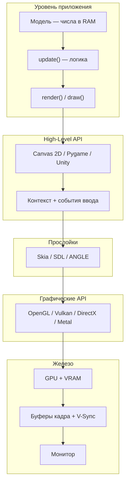

import DocCardList from '@theme/DocCardList';

# О разделе

**Разработка графики** — это программирование движущейся картинки: массивы чисел в памяти, цикл обновления, команды отрисовки и путь до монитора.

Раздел помогает прочитать чужой `.js` или `.py` с игрой или визуализацией и понять, где в файле данные, где логика, а где команды холсту.

### Смежные разделы энциклопедии

- [1.16 Графика](/encyclopedia/1-basics/1-16-grafika/intro) — пиксель, растр, вектор, стек GPU, FPS
- **4.18 (этот раздел)** — как то же устроено **в коде**
- [9.08 Компьютерная графика](/encyclopedia/9-spinoff/9-08-kompyuternaya-grafika/intro) — углублённая теория и 3D
- [Canvas 2D](/encyclopedia/5-languages/5-01-javascript/47), [Pygame](/encyclopedia/5-languages/5-02-python/312) — синтаксис на конкретном языке

---

## Для кого

| Роль | Что получите |
|------|--------------|
| Начинающий разработчик | карта понятий до Canvas, Pygame или Unity |
| Читатель чужого кода | где модель, физика, отрисовка в одном файле |
| Веб-разработчик | Canvas 2D, DOM, WebGL, `requestAnimationFrame` |
| Игровой разработчик | цикл update и render, FSM, сцена, culling |
| Инженер по производительности | VRAM, frame time, узкие места CPU и GPU |

База — [что такое код](/encyclopedia/4-code-dev/4-02-chto-takoe-kod-i-kak-on-rabotaet/intro). Желательно пройти [графические данные](/encyclopedia/1-basics/1-16-grafika/1).

---

## Рекомендуемый порядок

| Шаг | Статья | Содержание | Время |
|-----|--------|------------|-------|
| 1 | [От чисел к картинке](./1.md) | три слоя, конвейер, демо | 20–30 мин |
| 2 | [Архитектура — модель, update, render](./2.md) | MVC, координаты, чтение чужого файла | 30 мин |
| 3 | [Паттерны — цикл и FSM](./3.md) | игровой цикл, состояния меню | 25 мин |
| 4 | [Структуры данных сцены](./4.md) | массивы, дерево, culling | 25 мин |
| 5 | [Математика 2D/3D](./5.md) | векторы, матрицы, sin и cos | 45–60 мин |
| 6 | [High-Level API](./6.md) | холст, окно, ввод | 30 мин |
| 7 | [Веб — Canvas и WebGL](./7.md) | браузер, Skia, ANGLE | 40 мин |
| 8 | [Python — Pygame и SDL](./8.md) | окно, surface, flip | 30 мин |
| 9 | [C# — Unity и UI](./9.md) | движок и десктопный интерфейс | 25 мин |
| 10 | [Skia и ANGLE](./10.md) | прослойки рендеринга | 20 мин |
| 11 | [Графические API](./11.md) | OpenGL, DirectX, шейдеры | 45 мин |
| 12 | [VRAM и GPU](./12.md) | текстуры, профилирование | 40 мин |
| 13 | [Буферизация](./13.md) | double buffer, V-Sync | 25 мин |
| 14 | [Битмап и монитор](./14.md) | HDMI, цвет, тайминги | 20 мин |
| 15 | [Итоги и FAQ](./998.md) | резюме | 15 мин |
| 16 | [Чек-лист](./999.md) | самопроверка | 20 мин |

**Короткий маршрут** — главы 1–3 и 6, затем платформа по задаче (7 для веба, 8 для Python, 9 для C#).

**Полный маршрут** — по порядку 1→14; главы 11–12 — при переходе к WebGL и железу.

---

## Карта слоёв

---

## Практика

- [Демо — модель, update, render](https://play.spirzen.ru/p/code-dev/graphics-model-render-play) — [глава 1](./1.md)
- [Canvas — полный цикл](https://code.spirzen.ru/e/html/code-418-1-001)
- [Pygame — тот же каркас](https://code.spirzen.ru/e/python/code-418-1-002)
- [Массив и culling](https://code.spirzen.ru/e/javascript/code-418-4-001)
- [Векторы и коллизии](https://code.spirzen.ru/e/javascript/code-418-5-001)
- [HiDPI и ввод](https://code.spirzen.ru/e/html/code-418-6-001)
- [Canvas 2D](/encyclopedia/5-languages/5-01-javascript/47)
- [p5.js — примеры](/lab/Примеры/1114)
- [Игры на Python](/encyclopedia/5-languages/5-02-python/312)
- [Конвейер GPU](./11.md) — интерактив в главе 11
- [Бюджет кадра и FPS](./13.md) — интерактив в главе 13
- [Практикум игр](/encyclopedia/9-spinoff/9-04-razrabotka-igr/praktikum-razrabotki-igr/intro)

<DocCardList />
