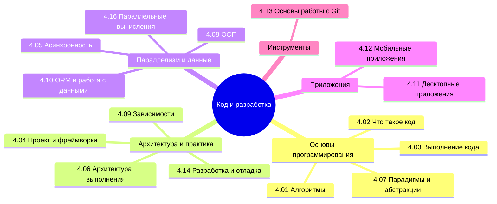

  ОБЯЗАТЕЛЬНО
  ДЛЯ НОВИЧКОВ
  В РАЗРАБОТКЕ

import DocCardList from '@theme/DocCardList';

## О разделе

<DocCardList />

Готовьтесь к обучению магии программирования. Что такое программа - уже ясно. Но что такое код, как он работает, как его пишут? И только ли в коде вся сложность?

---
