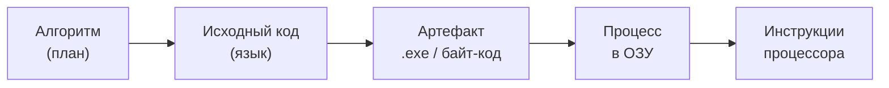
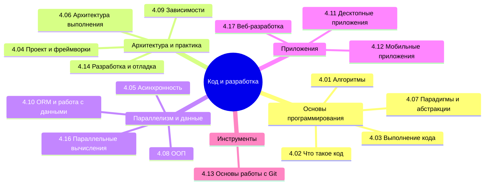

  ОБЯЗАТЕЛЬНО
  ДЛЯ НОВИЧКОВ
  В РАЗРАБОТКЕ

import DocCardList from '@theme/DocCardList';

# Код и разработка

---

## О разделе

Совсем с нуля, без опыта за ПК — сначала [Основы компьютерной грамотности](/encyclopedia/1-basics/1-035-bazovaya-informatika/101), затем [программа](/encyclopedia/1-basics/1-19-programma/intro) и этот том.

Раздел **"Код и разработка"** — мост между [программой как инструкциями для ПК](/encyclopedia/1-basics/1-19-programma/intro) и профессиональной инженерией — языками, фреймворками, архитектурой. Здесь разбирают, **как записывают** логику (синтаксис, операторы, стиль), **как она доходит до процессора** (компиляция, байт-код, JIT, память, потоки) и **как удерживают проект живым** (модули, зависимости, отладка, Git).

ИИ в этом контуре — ускоритель черновика и объяснений; антипаттерны "код по наитию" и однотипный мусорный вывод — в [вайб-кодинге](/encyclopedia/6-ai/6-07-vayb-koding-i-neurokontent/1) и [нейрослопе](/encyclopedia/6-ai/6-07-vayb-koding-i-neurokontent/2). Рабочий цикл с LLM — [Генерация кода](/encyclopedia/6-ai/6-04-modeli-i-instrumenty/117); готовые промпты с разбором — [Prompt engineering — библиотека](/lab/Примеры/1150).

Если в [базовой информатике](/encyclopedia/1-basics/1-035-bazovaya-informatika/4) вы уже прошли алгоритмы и блок-схемы, этот том переводит те же идеи на язык разработчика — с большей глубиной и практикой.

Сборка, Run в IDE, dev-сервер в терминале, Docker — единая шпаргалка для новичка: [Запуск и перезапуск приложений](/encyclopedia/1-basics/1-12-sovety-dlya-novichka/13).

Где исполняется собранный код (bare metal, ВМ, контейнер, облачный worker) — [четыре модели развёртывания](/encyclopedia/1-basics/1-13-soft-prodvinutogo-polzovatelya/8#chetiryre-modeli-razvertyvaniya); среда JVM/CLR — в [4.03 Выполнение кода](/encyclopedia/4-code-dev/4-03-vypolnenie-koda/intro).

<DocCardList />

### Три опорных понятия

| Понятие | Смысл в одной фразе | Где углубиться |
|--------|---------------------|----------------|
| **[Алгоритм](/glossary/А#алгоритм)** | Конечный план решения задачи с понятными шагами | [4.01 Алгоритмы](/encyclopedia/4-code-dev/4-01-algoritmy/1) |
| **Программа** | Инструкции и данные для ЭВМ; на диске — файл, в работе — [процесс](/encyclopedia/1-basics/1-19-programma/1) | [1.19 Программа](/encyclopedia/1-basics/1-19-programma/1) |
| **Код** | Текст на языке программирования (или машинные инструкции), подчинённый правилам синтаксиса и несущий смысл через семантику | [4.02 Что такое код](/encyclopedia/4-code-dev/4-02-chto-takoe-kod-i-kak-on-rabotaet/1) |
| **Среда выполнения** | JVM, CLR, интерпретатор: загрузка модулей, память, GC, JIT | [4.03 Выполнение кода](/encyclopedia/4-code-dev/4-03-vypolnenie-koda/314), [4.06 Архитектура выполнения](/encyclopedia/4-code-dev/4-06-arhitektura-vypolneniya/1) |

**Вычисление** в информатике — преобразование входной информации в выходную по заданным правилам: от сложения двух чисел до прогноза по опросу. Программа реализует алгоритм; процессор и среда выполнения проводят вычисление во времени.

### От идеи к исполнению

1. **Алгоритм** — что делать (часто словами, блок-схемой, псевдокодом).
2. **Исходный текст** — синтаксическая единица языка — определения, операторы, комментарии ([синтаксис](/encyclopedia/4-code-dev/4-02-chto-takoe-kod-i-kak-on-rabotaet/3) проверяется компилятором или IDE).
3. **Трансляция** — компиляция заранее, интерпретация по ходу или гибрид (байт-код + JIT, транспиляция). Подробно — [трансляторы, компиляторы и интерпретаторы](/encyclopedia/1-basics/1-19-programma/2).
4. **Исполняемый образ** на диске загружает [программный загрузчик](/encyclopedia/1-basics/1-20-ispolnyaemye-fayly-i-arhivy/intro) под управлением ОС.
5. **Процесс** — запущенный экземпляр программы в ОЗУ; процессор выполняет инструкции до завершения или ошибки. Внутри процесса работают **потоки** — наименьшие единицы выполнения при [многозадачности](/encyclopedia/4-code-dev/4-05-asinhronnost/1). Цепочка "файл на диске → процесс → потоки" — [программа, процесс и поток](/encyclopedia/1-basics/1-19-programma/1#programma-protsess-potok).

### Уровни представления кода

| Уровень | Кто читает | Пример |
|---------|------------|--------|
| **Машинный код** | Процессор (опкоды — двоичные коды операций из [ISA](/encyclopedia/4-code-dev/4-03-vypolnenie-koda/3)) | `B4 0E`, `CD 10` на x86 |
| **Ассемблер** | Человек через мнемоники (`mov`, `add`) | [Машинное слово](/encyclopedia/4-code-dev/4-03-vypolnenie-koda/312) |
| **Низкоуровневые языки** | Мнемоники, директивы, привязка к ISA | Ассемблер x86/ARM, CIL |
| **Высокоуровневые языки** | Абстракции; платформу подключает транслятор | Python, C#, Go |
| **Декларативные фрагменты** | Платформа выбирает порядок шагов | SQL, HTML, часть конфигов |

**Низкий уровень** — близость к [машинному коду](/encyclopedia/4-code-dev/4-03-vypolnenie-koda/3): ассемблер, ручной контроль памяти в C. **Высокий уровень** — краткие конструкции вместо длинного машинного текста и переносимость сути алгоритма через компилятор или VM ([подробнее](/encyclopedia/4-code-dev/4-02-chto-takoe-kod-i-kak-on-rabotaet/55)).

Подавляющее большинство программ пишут на высоком уровне; **нативный код** (native code) — машинные инструкции под конкретную платформу, обычно результат компиляции или JIT.

### Синтаксис и семантика

- **Синтаксис** — правила, какие комбинации символов считаются корректной программой (скобки, точки с запятой, объявления). Ошибки синтаксиса ловят на ранних этапах трансляции.
- **Семантика** — что эти конструкции **означают** при выполнении (присваивание меняет память, `if` ветвит поток).

Один и тот же синтаксис в разных языках может нести разный смысл; наоборот, похожие задачи в Python и Java выражают разным синтаксисом.

### Программирование и парадигмы

**Программирование** в узком смысле — написание исходного кода; в широком — весь цикл создания ПО (требования, тесты, сопровождение). Человек, который этим занимается, — **программист**; в команде роли делятся (разработчик, архитектор, тестировщик).

Исходные тексты чаще строят в **императивном** стиле — явная последовательность команд и изменение состояния. Параллельно применяют **декларативные** подходы (функционное, логическое, запросы к данным) — см. [Программные парадигмы](/encyclopedia/4-code-dev/4-07-paradigmy-i-urovni-abstraktsii/1).

**Комментарии** в коде не исполняются; они помогают людям понимать и сопровождать текст. **Сценарии** (скрипты) — программы, которые обычно интерпретируют без отдельной фазы сборки (оболочка, Python, макросы).

### Рекомендуемый порядок внутри раздела

| Этап | Подраздел | Зачем |
|------|-----------|-------|
| 1 | [4.01 Алгоритмы](/encyclopedia/4-code-dev/4-01-algoritmy/intro) | План до синтаксиса |
| 1a | [Big-O — шпаргалка](/lab/Примеры/1128) | O(n) по коду на Python, ловушки `list` / `set` |
| 2 | [4.02 Код](/encyclopedia/4-code-dev/4-02-chto-takoe-kod-i-kak-on-rabotaet/intro) | Синтаксис, [коллекции](/encyclopedia/4-code-dev/4-02-chto-takoe-kod-i-kak-on-rabotaet/618), функции, циклы |
| 3 | [4.03 Выполнение](/encyclopedia/4-code-dev/4-03-vypolnenie-koda/intro) | Память, CPU, VM, JIT |
| 4 | [4.07 Парадигмы](/encyclopedia/4-code-dev/4-07-paradigmy-i-urovni-abstraktsii/intro) | Стили мышления |
| 5 | [4.04 Проект и фреймворки](/encyclopedia/4-code-dev/4-04-proekt-i-freymvorki/intro) | Структура приложения |
| 5a | [IDE и редакторы](/encyclopedia/4-code-dev/4-04-proekt-i-freymvorki/10) | Подсветка, IntelliSense, отладчик в одной среде |
| 6 | [4.13 Git](/encyclopedia/4-code-dev/4-13-osnovy-raboty-s-git/intro) · [12 команд](/encyclopedia/4-code-dev/4-13-osnovy-raboty-s-git/115#12-komand) | История изменений кода |
| 6a | [Отладка](/encyclopedia/4-code-dev/4-14-razrabotka-i-otladka/111) | Точки останова, символы, GDB |
| 6b | [Тестирование для разработчика](/encyclopedia/4-code-dev/4-14-razrabotka-i-otladka/1117) | Unit-тесты, Red–Green–Refactor, связь с [7.05](/encyclopedia/7-project/7-05-testirovanie/intro) |
| 6c | [DevTools в браузере](/encyclopedia/4-code-dev/4-14-razrabotka-i-otladka/1116) | Elements, Console, Network, Sources |

Дальше — специализации — [ООП](/encyclopedia/4-code-dev/4-08-oop/intro), [асинхронность](/encyclopedia/4-code-dev/4-05-asinhronnost/intro), [веб-разработка](/encyclopedia/4-code-dev/4-17-veb-razrabotka/intro), [мобильные](/encyclopedia/4-code-dev/4-12-mobilnye-prilozheniya/intro) ([Flutter — виджеты в Lab](/lab/Примеры/1154), [Dart — Flutter](/encyclopedia/5-languages/5-22-dart/311)) и [десктоп](/encyclopedia/4-code-dev/4-11-desktopnye-prilozheniya/intro) ([WinForms/WPF в Lab](/lab/Примеры/1138), [Tkinter в Lab](/lab/Примеры/1124), [Java Swing в Lab](/lab/Примеры/1143)). Для веб-UI на React — [галерея компонентов](/lab/Примеры/1146) после [272](/encyclopedia/5-languages/5-01-javascript/272).

  
Связь с другими томами

  

  С нуля за ПК — [Основы компьютерной грамотности](/encyclopedia/1-basics/1-035-bazovaya-informatika/101).

  Школьный маршрут — [алгоритмы и языки в базовой информатике](/encyclopedia/1-basics/1-035-bazovaya-informatika/4).

  Правовой статус программ — [интеллектуальные права](/encyclopedia/7-project/7-07-intellektualnye-prava/intro).

  Конкретные языки — раздел [5. Языки](/encyclopedia/5-languages/intro).

  

Смежная гигиена: [Опасные скрипты](/encyclopedia/8-infra-security/8-03-zabota-o-kode-i-dannyh/101) — терминал, Git и проверка команд от ИИ-агента в IDE; для API smoke-test из консоли — [утилита curl](/encyclopedia/2-system-network/2-05-terminal/1133), [curl / fetch — примеры](/lab/Примеры/1133).

  
Псевдокод и эталонный код

  

  В подразделах **4.01–4.03, 4.05–4.08, 4.15–4.16** сложные идеи по возможности даются сначала на **русском алгоритмическом псевдокоде**, затем — примером на конкретном языке.

  Подразделы про Git, мобильные и десктопные приложения опираются на платформы — там псевдокод уместен точечно.

  Развёрнутый образец — ["Параллельные вычисления"](/encyclopedia/4-code-dev/4-16-parallelnye-vychisleniya/intro).

  

  
Код — одна фаза проекта

  

  Этот том про **алгоритмы, синтаксис, отладку и Git**. Как устроены требования, тестирование на уровне проекта, релизы, сопровождение и роли в команде — в томе [Проект](/encyclopedia/Проект/project): [методология и SDLC](/encyclopedia/7-project/7-03-metodologiya-i-zhiznennyy-tsikl-po/intro)

  [аналитика](/encyclopedia/7-project/7-04-analitika/intro)

  [тестирование](/encyclopedia/7-project/7-05-testirovanie/intro).

  

---
