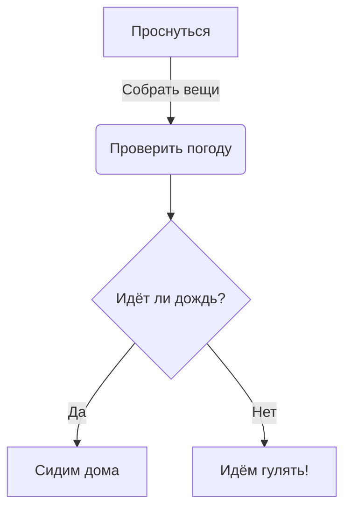
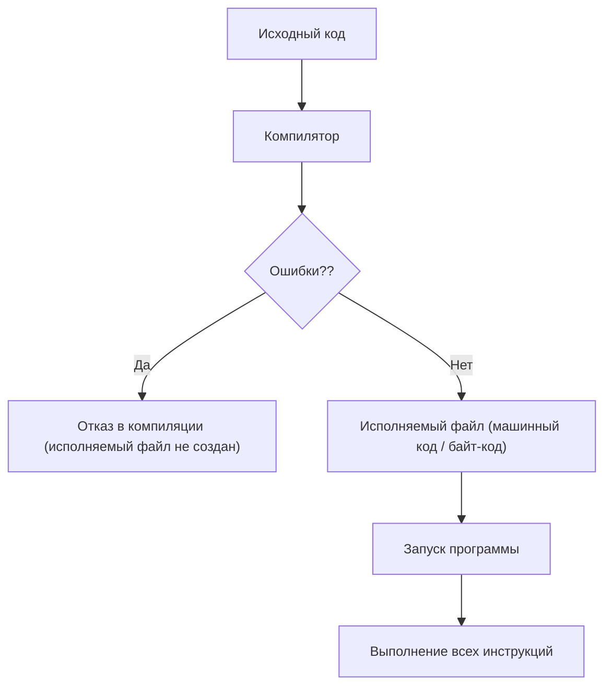
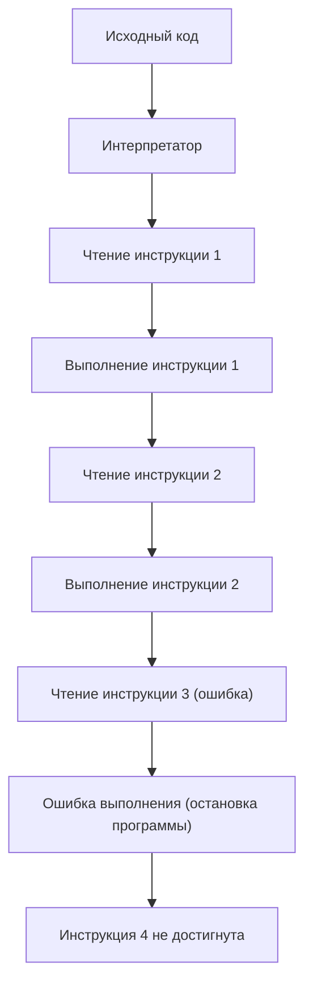
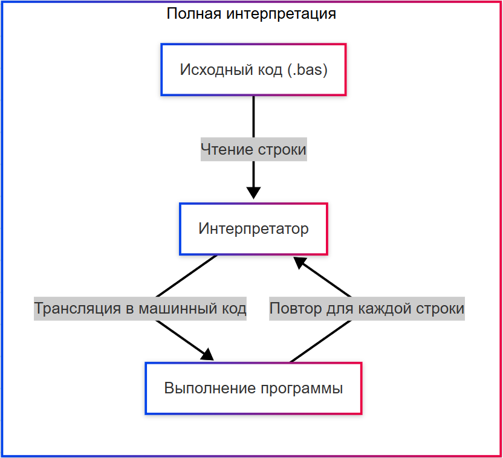
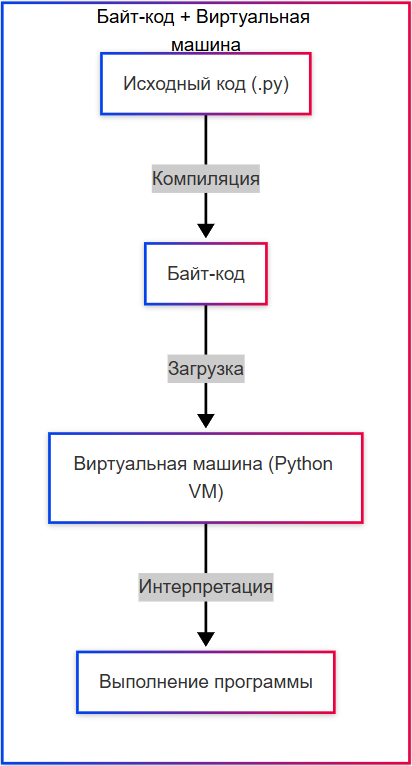
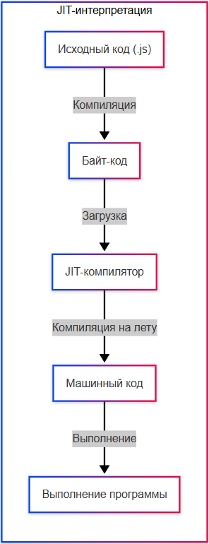
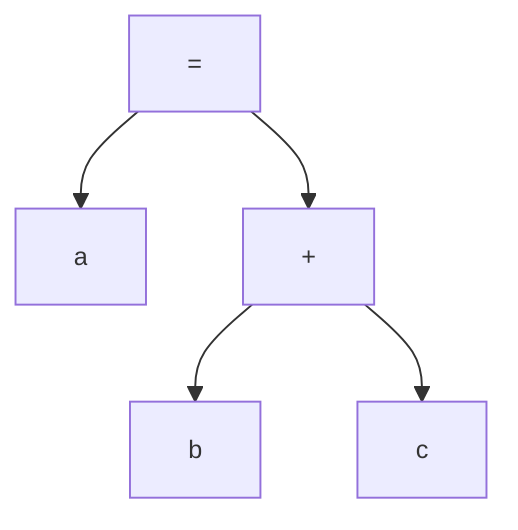
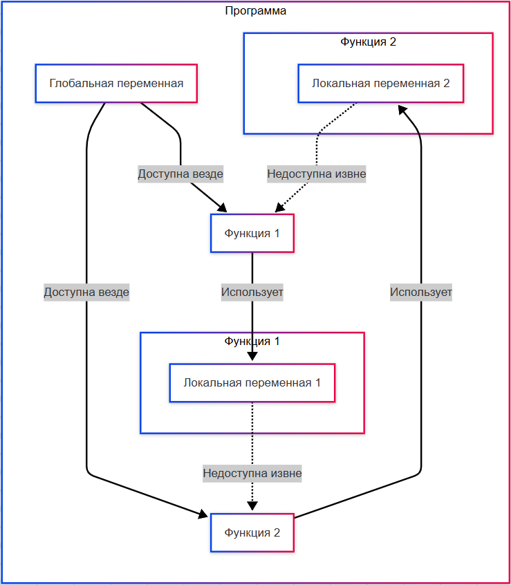

---
title: Что такое код и как он работает
---

import AlgoCodeVisualizer from '@site/src/components/AlgoCodeVisualizer.jsx';
import BlockBuilder from '@site/src/components/BlockBuilder.jsx';
import CompilerSimulator from '@site/src/components/CompilerSimulator.jsx';
import CodeTransformationDemo from '@site/src/components/CodeTransformationDemo.jsx';

# Что такое код и как он работает

<div class="article-tags">
  <span class="tag tag-required">ОБЯЗАТЕЛЬНО</span>
  <span class="tag tag-beginner">ДЛЯ НОВИЧКОВ</span>
  <span class="tag tag-advanced">НЕ ДЛЯ НОВИЧКОВ</span>
  <span class="tag tag-inprogress">В РАЗРАБОТКЕ</span>
</div>
<span class="complexity-badge">Разработчику</span>
<span class="complexity-badge">Аналитику</span>
<span class="complexity-badge">Тестировщику</span>  
<span class="complexity-badge">Архитектору</span>
<span class="complexity-badge">Инженеру</span>

## Что такое код и как он работает

### Понятие кода

Программирование — одна из самых точных и логически выверенных инженерных дисциплин, и её основой является **код**. Именно через код мы передаём инструкции вычислительным системам.

Прежде, чем перейдём к коду, давайте сразу подчеркнём важнейший момент.

Существует два подхода к логике работы программ - алгоритмический язык и собственно реальный язык кода или программирования.

В голове мы рисуем себе некий алгоритм, когда формируем и декомпозируем задачу. На бумаге (в коде) же мы отражаем уже готовый код, который мы пишем строго на условиях и правилах, принятых в соответствующем языке программирования. И да, программирование выполняется на английском языке, и большинство выражений в языках означают прямо то, что они подразумевают в прямом переводе (например, «if» - «если»). Поэтому знание английского языка будет не лишним в IT, и значительно поможет формулировать логику.

Алгоритмический язык же пишется в том порядке, как мы изучили алгоритмы - мы пишем всё так, как понимаем - определяем шаги, и пишем на языке понимания, к примеру `ЕСЛИ <условие> ТО <действие> ИНАЧЕ <другое действие>`. Потом мы превращаем это в код - `IF <условие> THEN <действие> ELSE <другое действие>` (с учётом правил соответствующего языка).

Алгоритмически:


Кодом:
```
ПРОСНУТЬСЯ()
СОБРАТЬ ВЕЩИ()
ПОГОДА()

ЕСЛИ ПОГОДА=="ДОЖДЬ"
ТО ОСТАТЬСЯ()
ИНАЧЕ ГУЛЯТЬ()
```

<AlgoCodeVisualizer />

★ **Код** – это набор инструкций, написанных на языке программирования, который преобразуется в действия компьютера.

Технически, это формальная система обозначений, построенная на строгих правилах синтаксиса и семантики, дополненная соглашениями сообщества, инструментарием разработки и парадигмами проектирования. 

Инструкций может быть очень много. Пишутся такие инструкции построчно:
```
ДЕЙСТВИЕ_1
ДЕЙСТВИЕ_2
ДЕЙСТВИЕ_3
```

Но такие строки рассчитаны для нас, программистов. Система же будет читать код именно так:
```
ДЕЙСТВИЕ_1ДЕЙСТВИЕ_2ДЕЙСТВИЕ_3
```
Поэтому, во многих языках используется разделение инструкций знаками препинания и табуляцией. Например:
```
ДЕЙСТВИЕ_1;
ДЕЙСТВИЕ_2;
ДЕЙСТВИЕ_3;
```

Инструкции группируют в блоки.

---

### Блок кода


★ **Блок кода** – логически связанная группа инструкций. Обычно выделяется отступами (Python) или фигурными скобками (Java/C#):

```Java
{ всё что между скобками – блок кода }
{ 
	а ещё
	можно
	писать
	вот так
}
```
```python
или так:
	это начало блока
	всё, что находится внутри - тело блока
	это конец блока
	
```

<div class="callout callout--tip">
  <div class="callout-title">Практическое задание</div>
Попробуйте составить блок кода. Не важно, что вы напишете внутри. Главное - запомнить, где у него начало, а где - конец.
</div>

<BlockBuilder />


Блок может быть частью условия, цикла, функции или любого другого контекста.

**Вложенность** (nesting) — это ситуация, когда один блок находится внутри другого - так можно выполнять одни, к примеру, условные действия, внутри других условий, для обработки данных внутри циклов, чтобы строить сложную логику «если А, то проверь Б, и если Б верно, сделай В».

```Java
{
    блок кода {
        ещё блок {
            ещё блок {
                ...и так сколько угодно;
            }
        }
    }
}
```

Разные языки используют разные способы указания начала и конца блока, к примеру, в большинстве языков блок выделяется символами `{` и `}`, а Python - отступами.

---

### Кодирование

★ **Кодирование** – процесс написания исходного кода по определённым правилам языка. Код может писаться в любом текстовом редакторе, либо сразу в специальных программах, которые обладают дополнительными возможностями для удобной работы с кодом.

Важно отличать кодирование/декодирование от кодирования в контексте программирования. Само по себе кодирование — это широкое понятие, включающее в себя простой процесс - превращения чего-то исходного в код. Декодирование - наоборот, превращение кода во что-то другое.

И в нашем случае, мы говорим о том, что кодирование — это написание исходного кода на конкретном языке программирование. Код пишется на языке, понятном программисту. Но как машина понимает этот код, она что, знает английский? Не совсем. Специальный инструмент, называемый компилятором, превращает этот код, понятный программисту, в код, понятный машине - машинный код.

Поэтому, если вы именно пишете код, то не говорите, что вы "кодируете". Вы занимаетесь именно написанием кода. Забавно, но в русском языке "кодировать" и "кодирование" по смыслу не подходит к написанию кода, но вот в английском слово "coding" как раз используется и для кодирования, и для написания кода.

---

## Компиляция и интерпретация

### Стратегия выполнения

При выполнении программной логики используется одна из двух фундаментальных стратегий: **компиляция** или **интерпретация**. Их принципиальное отличие — во *времени* и *порядке* проведения анализа кода относительно его исполнения.

В **компилируемой модели** перед запуском программы проводится полный статический анализ всего исходного кода. Только после успешного завершения этого этапа создаётся исполняемое представление (машинный код, байт-код и т. п.), и лишь тогда возможен запуск. Любая ошибка — синтаксическая, семантическая или типовая — приводит к отказу в генерации исполняемого артефакта: программа не запустится, пока все обнаруженные несоответствия не будут устранены.


В **интерпретируемой модели** анализ и исполнение происходят одновременно. Интерпретатор последовательно считывает конструкции программы и выполняет их по мере чтения. Это допускает частичное выполнение: если в программе присутствует ошибка в какой-либо её части, интерпретатор может успешно выполнить все предшествующие корректные фрагменты и остановиться только в момент встречи с некорректной конструкцией.

**Иллюстрация**  
Рассмотрим абстрактную последовательность команд:

```
Команда 1
Команда 2
Команда 3 (некорректна)
Команда 4
```

- В компилируемой модели: программа не будет запущена — ошибка в команде 3 обнаруживается на этапе анализа, до начала выполнения.
- В интерпретируемой модели: команды 1 и 2 будут выполнены, команда 3 вызовет ошибку, команда 4 — не будет достигнута.

Этот принцип позволяет легко продемонстрировать поведение интерпретатора на практике: достаточно ввести в интерактивной сессии последовательность инструкций, содержащую ошибку не в первой строке — эффект будет немедленно наблюдаем.

Давайте понаблюдаем за простым примером на псеводо-JavaScript синтаксисе, где для объявления переменной нужно указать ключевое слово `let`.

<CompilerSimulator />

---

### Компиляция

★ **Компиляция** – преобразование всего исходного кода в машинный код до запуска программы по принципу:
```
Исходный код → Компилятор → Исполняемый файл → Процессор
```

Это процесс полного статического анализа исходного кода **до его запуска** с целью создания автономного исполняемого артефакта. Можно выделить основные характеристики компиляции:
- анализ происходит **до** начала выполнения программы;
- весь код проверяется на корректность - синтаксис, семантика, типы, зависимости;
- результатом является исполняемый файл (машинный код, байт-код или промежуточное представление);
- программа либо запускается полностью, либо не запускается вовсе;
- ошибки обнаруживаются на этапе сборки, а не во время работы.



Виды и особенности компиляции:

	- AOT-компиляция (Ahead Of Time) – код компилируется перед запуском полностью (C, C++);
	- JIT-компиляция (Just In Time) – код компилируется во время выполнения (Java, C#);
	- Кросс-компиляция – компиляция кода для другой платформы, например, при компиляции кода для среды Android в Windows.

Таким образом, компилятор берёт исходные данные (код - исходный код) и выполняет свою собственную задачу - конвертацию (преобразование), превращение. Компилятор — это тоже программа.


---


---


---

### Интерпретация

★ **Интерпретация** – построчное выполнение кода без предварительной компиляции, когда интерпретатор читает и выполняет код строку за строкой. Это медленнее компиляции (из-за построчного выполнения и отсутствия оптимизации на этапе компиляции), но не требует отдельного этапа компиляции, работая по принципу:
```
Исходный код → Интерпретатор → Выполнение
```

Код выполняется немедленно, без предварительного преобразования в отдельный исполняемый артефакт.

Основные характеристики интерпретации:
- анализ и выполнение происходят **одновременно**;
- код читается последовательно, инструкция за инструкцией;
- выполнение может быть частичным, и корректные фрагменты до ошибки будут обработаны;
- ошибки проявляются **во время выполнения**, в момент достижения проблемной строки;
- не создаётся отдельный исполняемый файл, программа зависит от наличия интерпретатора.



Виды и особенности интерпретации:
	- Полная интерпретация – каждая строка переводится в машинный код при каждом запуске (на старых версиях BASIC);
	- Байт-код + Виртуальная машина – код сначала компилируется в байт-код, а затем выполняется виртуальной машиной (Python);
	- JIT-интерпретация (Just In Time) – байт-код компилируется в машинный код на лету (например, JavaScript в V8 – специальном движке в Google).



---



---



---

<div class="callout callout--tip">
<div class="callout-title">Полезно знать</div>
Некоторые современные системы используют гибридную модель. Например, Java и C# компилируются в байт-код, который затем интерпретируется или JIT-компилируется (Just-In-Time) в машинный код во время выполнения. Это сочетает преимущества обоих подходов: статический анализ на этапе компиляции и адаптивную оптимизацию во время выполнения.
</div>

Интерпретируемый язык выполняет свои операторы в порядке «строка за строкой». Такие языки, как Python, Javascript, R, PHP и Ruby, являются яркими примерами интерпретируемых языков. Программы, написанные на интерпретируемом языке, запускаются непосредственно из исходного кода, без промежуточного этапа компиляции.

---

### Трансляция

★ **Трансляция** – общее название для преобразования кода из одной формы в другую. Включает компиляцию в машинный код и транспиляцию (из языка в язык, например TypeScript → JavaScript).

Здесь важно отметить, что это понятие не нужно путать с компиляцией и интерпретацией. В ряде случев, может существовать некая «надстройка» над языком, которая проверяет сначала свои правила, а затем уже выполняет интерпретацию или компиляцию. Как раз TypeScript сам по себе не язык программирования, а надстройка над JavaScript, и имеет свои требования к синтаксису. TS сначала проверяет по своим правилам, а затем выполняется транспиляция в JavaScript, который уже выполняется как обычно.

Такие надстройки называют суперсет (superset), которые расширяют базовый язык, добавляя новые возможности, но оставаясь совместимым с ним, имея при этом свои собственные правила и синтаксис.

---

## Виды кода

### Машинный код

★ **Машинный код** – текст программы, понятный компьютеру. Фактически, там уже вовсе не текст, а набор сигналов. Программа понимает по принципу «есть сигнал» или «нет сигнала».

Каждая инструкция представлена в виде чисел (обычно в шестнадцатеричной или двоичной системе), соответствующих опкодам и операндам архитектуры процессора.

Пример машинного кода для архитектуры x86-64 (в шестнадцатеричном виде):

```
48 c7 c0 01 00 00 00   ; mov rax, 1
48 c7 c7 01 00 00 00   ; mov rdi, 1
48 c7 c2 0d 00 00 00   ; mov rdx, 13
48 8d 35 00 00 00 00   ; lea rsi, [rip + msg]
0f 05                  ; syscall (write)
48 c7 c0 60 00 00 00   ; mov rax, 96 (exit)
48 c7 c7 00 00 00 00   ; mov rdi, 0
0f 05                  ; syscall (exit)
```

Этот фрагмент представляет собой скомпилированную программу на ассемблере, которая выводит сообщение и завершает работу. Для человека он малопонятен, но процессор исполняет его напрямую.

---

### Байт-код

★ **Байт-код** – компактное представление программы, но читаемое не процессором, в отличие от машинного кода, а виртуальной машиной – интерпретатором. Длина каждого кода операции составляет один байт.

Он компактнее исходного кода и не зависит от конкретного железа, но требует интерпретатора или JIT-компилятора.

Пример байт-кода Java (вывод команды `javap -c` для метода `main`):

```java
public static void main(java.lang.String[]);
  Code:
     0: getstatic     #2                  // Field java/lang/System.out:Ljava/io/PrintStream;
     3: ldc           #3                  // String Hello, world!
     5: invokevirtual #4                  // Method java/io/PrintStream.println:(Ljava/lang/String;)V
     8: return
```

Каждая строка — это одна команда виртуальной машины Java (JVM). Например, `getstatic` загружает статическое поле, `ldc` помещает константу в стек, `invokevirtual` вызывает метод. Такой код не исполняется процессором напрямую, но JVM понимает его без проблем.

Нет, вам не придётся кодить на байт-коде. Программисты пишут исходным кодом.

---

### Исходный код

★ **Исходный код** – текст программы, написанный программистом, который затем преобразуется в исполняемый файл.

Он предназначен для чтения, редактирования и поддержки разработчиками.

Пример исходного кода на Python:

```python
def greet(name):
    message = f"Hello, {name}!"
    print(message)

greet("Тимур")
```

Этот код легко читается, содержит логику и структуру, понятные программисту. Перед выполнением он либо интерпретируется (как в случае с CPython), либо компилируется в байт-код (например, `.pyc` файлы в Python) или сразу в машинный код (в случае с Ahead-of-Time компиляторами).

---

### Сравнение видов кода

Если сравнить их, то будет такая картина:

| Код | Кому предназначен |
| :--- | :---: |
|Машинный код 💻	|Предназначен для устройства – процессора
|Байт-код 🔩	|Предназначен для движка, платформы или виртуальной машины
|Исходный код 📝	|Предназначен для чтения программистом

В каждом языке свой подход. Давайте поглядим:

<CodeTransformationDemo />

---

## Из чего состоит код

### Что такое синтаксическое дерево

Когда мы читаем любой текст, наш мозг принимает и обрабатывает большой объём данных, структурируя и анализируя его. К примеру, в выражении "`кошка = Барсик`" мы извлекаем целый массив:
```
к
о
ш
к
а

=

Б
а
р
с
и
к
```

Затем мы структурируем и собираем. Наш мозг через нейронные связи понимает, что из представленной информации имеется допустимая комбинация:
```
к + о + ш + к + а

=

Б + а + р + с + и + к
```

В дальнейшем уже происходит распознание выражений, с поиском смысла "`кошка`", "`=`" и "`Барсик`".

Мы об этом не задумываемся. Поэтому и программы не просто так читают наш код.

Исходный код требует предварительной обработки и структурирования, чтобы в дальнейшем система могла их анализировать.

**Синтаксическое дерево** — это древовидная структура данных, построенная парсером на основе исходного кода программы в соответствии с правилами грамматики языка программирования. Оно отражает иерархическую организацию конструкций кода: выражения, операторы, вызовы функций, объявления переменных и другие элементы.

Существуют два основных вида таких деревьев: **конкретное синтаксическое дерево (КСД)** и **абстрактное синтаксическое дерево (АСД)**. Они различаются степенью детализации и назначением в процессе компиляции или интерпретации.

---

### Конкретное синтаксическое дерево (КСД)

**Конкретное синтаксическое дерево (КСД)** — это точное отображение структуры исходного кода в соответствии с формальной грамматикой языка. Каждый токен исходной программы, включая пунктуацию и служебные символы, представлен узлом дерева.

Основные характеристики КСД:

- Сохраняет все синтаксические детали: скобки, точки с запятой, ключевые слова, пробелы (если они значимы).
- Строится непосредственно парсером на основе контекстно-свободной грамматики.
- Используется в основном на ранних этапах анализа, особенно при необходимости восстановить исходный текст (например, в инструментах рефакторинга или форматирования).
- Может быть избыточным для последующих этапов обработки, так как содержит информацию, не влияющую на семантику программы.

Пример фрагмента кода:

```python
a = (b + c);
```

КСД для этого выражения будет содержать узлы для:
- присваивания (`=`),
- идентификатора `a`,
- открывающей и закрывающей скобок,
- оператора сложения (`+`),
- идентификаторов `b` и `c`,
- точки с запятой.

Такое дерево точно отражает синтаксис, но для выполнения программы скобки и точка с запятой не несут смысловой нагрузки.

---

### Абстрактное синтаксическое дерево (АСД)

**Абстрактное синтаксическое дерево (АСД)** — это упрощённое представление структуры программы, в котором сохраняются только те элементы, которые влияют на её семантику.

Основные характеристики АСД:

- Убирает синтаксический «шум»: скобки, точки с запятой, ключевые слова, если они не влияют на логику.
- Группирует конструкции по смыслу: например, выражение `(b + c)` становится одним узлом типа «бинарная операция сложения».
- Является основной промежуточной структурой для последующих этапов компиляции: семантического анализа, оптимизации, генерации кода.
- Используется также в интерпретаторах, статических анализаторах, инструментах автодополнения и проверки типов.

Для того же выражения:

```python
a = (b + c);
```

АСД будет содержать только:
- узел присваивания,
- левый операнд — переменная `a`,
- правый операнд — узел бинарной операции `+` с операндами `b` и `c`.

Скобки и точка с запятой отсутствуют, потому что они не влияют на порядок вычислений или значение выражения.



Это дерево достаточно для выполнения семантических проверок (например, существуют ли переменные `a`, `b`, `c`) и для генерации машинного или байт-кода.

---

### Процесс преобразования КСД в АСД

После построения КСД компилятор или интерпретатор выполняет **абстрагирование** — проход по дереву с удалением избыточных узлов и переструктурированием оставшихся в более удобную форму.

Этот процесс может включать:

- Удаление узлов пунктуации и разделителей.
- Объединение последовательных узлов одного типа (например, цепочек вызовов).
- Преобразование синтаксических конструкций в унифицированные формы (например, `for`, `while`, `do-while` могут быть приведены к единому представлению цикла).
- Нормализацию выражений (например, устранение избыточных скобок).

Результат — компактное, семантически насыщенное дерево, готовое к дальнейшей обработке.

Рассмотрим более сложное выражение:

```csharp
if (x > 0) { y = x * 2; }
```

**КСД** будет включать:
- ключевое слово `if`,
- открывающую и закрывающую круглые скобки,
- оператор `>`,
- фигурные скобки блока,
- точку с запятой,
- оператор присваивания,
- оператор умножения,
- литерал `2`.

**АСД** будет содержать:
- узел условного оператора (`IfStatement`),
- условие — узел сравнения (`GreaterThan`) с операндами `x` и `0`,
- тело — узел присваивания (`Assignment`) с левой частью `y` и правой частью — узлом умножения (`Multiply`) с операндами `x` и `2`.

Все служебные символы исчезают, остаётся только логическая структура.

**КСД** полезен для задач, где важна точность воспроизведения исходного текста:  
  — форматирование кода,  
  — подсветка синтаксиса,  
  — генерация ошибок с указанием точного места в исходнике,  
  — инструменты рефакторинга, требующие сохранения стиля.

**АСД** используется везде, где важна **семантика**, а не форма записи:  
  — компиляция и интерпретация,  
  — оптимизация кода,  
  — статический анализ (проверка типов, обнаружение мёртвого кода),  
  — транспиляция (перевод с одного языка на другой).

Многие современные компиляторы (например, GCC, Clang, Roslyn) строят КСД внутренне, но сразу преобразуют его в АСД или ещё более высокоуровневое промежуточное представление (IR).

Для выражения `a + b * c`:

**КСД** (упрощённо, с учётом приоритета через скобки):

```
Expr
├── Term
│   └── Factor
│       └── a
├── +
└── Term
    ├── Factor
    │   └── b
    ├── *
    └── Factor
        └── c
```

**АСД**:

```
+
├── a
└── *
    ├── b
    └── c
```

АСД сразу отражает правильный порядок вычислений благодаря иерархии узлов, без необходимости хранить правила грамматики.

---

### Синтаксис

У каждого кода есть некий набор заранее подготовленных слов, которые являются синтаксическими конструкциями, иначе – синтаксисом – это правила, которые определяют, как писать код на определенном языке.

Синтаксис включает в себя ключевые слова, операторы, символы и структуры данных. Правила синтаксиса **очень важны**. 

---

### Ключевые слова

**Ключевые слова** — это зарезервированные слова, которые имеют специальное значение в языке. Например, `if` используется для условных выражений, а `for` для циклов. Эти слова нельзя использовать для других целей, таких как имена переменных или функций, так как они уже заняты самим языком. Если использовать неверное ключевое слово - будет ошибка.

---

### Символы

**Символы** — это важный элемент любого кода. Например, угловые скобки где-то могут означать сравнения (`<`, `>`), а где-то - начало и конец тега (`<это тег>`). Но самые важные символы в коде — это запятая (,) и точка с запятой (;). Если нарушить правила синтаксиса и забыть поставить точку с запятой в коде, программа не скомпилируется или завершится с ошибкой.

---

### Операторы, операнды и операции

Операторы — это специальные выражения, которые определяют поведение или условие. Соответственно, оператор с условием — это условный оператор. В различных языках используются условные операторы.

★ **Условный оператор** – контроль потока выполнения программы, позволяющий выбрать действие в зависимости от условия. Важно понимать, что такое оператор, операция и операнд.


★ **Операция** – действие, например, суммирование.


★ **Операнд** – данные, над которым выполняется операция (в `a+b`, `a` и `b` – операнды).


★ **Оператор** – символ или ключевое слово, выполняющее операцию (`if`, `for`, `=`, `+`).

Таким образом, в выражении «`a + b`»:
	- `a+b` это операция суммирования;
	- `a` и `b` это операнды;
	- `+` это оператор.

---

### Переменные

И между ключевыми словами, которые зарезервированы в языках, есть некие указатели данных - ведь в нашем примере `a` и `b` — это не сами данные, а лишь именованные элементы. Мы не суммируем буквы переменных, мы суммируем то, чему равняется `a` и `b`. Это - переменные.

★ **Переменные** – именованная область памяти, которая хранит данные. Её можно представить как коробку с названием, в которой лежит значение. Это основной инструмент для работы с данными в программировании. Например, мы можем создать переменную age и сохранить в неё возраст пользователя и использовать это значение в дальнейших вычислениях.

★ **Имя переменной (идентификатор)** – должно быть уникальным, часто регистрозависимым (например, name и Name – разные переменные). Имя может состоять из букв, цифр и символов подчёркивания, но не может начинаться с цифры.

**Значение** - это сами данные, которые хранятся в переменных.

Существуют переменные и константы. Как вы понимаете, слово "переменная" имеет корень **"мен"**, от слова "менять". На английском звучит как "variable".

Переменная может менять своё значение.
```python
x = 1 # изначально x был равен 1
x = 2 # значение изменилось на 2
x = 3 # и теперь x содержит последнее актуальное значение
```

Константы же были изобретены в программировании для случаев, когда надо запретит изменение значения. Можно назвать их как "постоянные", которые менять нельзя:
```javascript
const x = 1;
x = 2; // вызовет ошибку, так как x - константа
```

Переменные не создают. Их **объявляют**. Можно сказать, что у таких областей памяти есть несколько этапов жизненного цикла:
- объявление - когда мы в первый раз пишем в коде нашу `x`, в этот момент она "рождается";
- присвоение значения - когда мы в первый раз записываем данные в `x`, например, `x = 1`;
- использование - когда мы применяем эти данные, например, вычисляем `x + 5`;
- очистка - когда мы больше не нуждаемся в памяти для хранения данных, и `x` уничтожается.

Объявление и присвоение - два разных этапа, но из-за необходимости порой языки позволяют выполнять присвоение при объявлении.

Только объявление (на примере JavaScript):
```javascript
let x;
```

Объявление с присвоением:
```javascript
let x = 1;
```

Использование подразумевает, что мы применяем эти данные, обращаясь к переменной по имени:
```javascript
console.log(x) //система выводит значение, хранящееся в переменной x
```

Уничтожение в современных языках, как правило, выполняется автоматически через сборщики мусора. Благодаря этому система сама анализирует код и видит, что переменная больше нигде не используется, и удаляется. Но об этом мы поговорим в разделе о сборке мусора.

---

### Тип данных

Данные, которые мы записываем в переменные, неоднозначны. Для хранения логического да (истина) или нет (ложь) нам нет нужды выделять много памяти. А вот для записи целого предложения, или списка из 300 пользователей, памяти нужно сильно больше.

По этой причине в каждом языке программирования используется разделение на типы данных. Переменные могут хранить числа, строки, логические значения и другое. 

Их можно разделить на:
	- Числа - целые числа (`123`), числа с плавающей точкой (`3.14`), комплексные числа.
	- Строки - текстовые данные, заключённые в кавычки (`"Текст"`).
	- Логические значения - `true` или `false`, для проверки условий.
	- Списки, массивы, словари - структуры для хранения множества значений.
	- Объекты - более сложные структуры.

Поэтому, когда изучаете очередной язык программирования, в первую очередь начинайте с типов данных. Как объявляются переменные для каждого типа, как обозначаются, какие правила работы с типами, какие возможности есть в языке.

Каждый тип имеет свои, специфические возможности. Например, числа доступны для арифметических операций (`+`, `-`, `/`, `*`), а строки - нет. Порой можно преобразовать число `123` в текст, а строку `"пять"` в число превратить уже не получится.

Языки, как правило, имеют свои наборы функций, операторов и правил для различных типов данных.

---

### Область видимости

★ **Область видимости** – часть кода, где переменная доступна (например, внутри функции или внутри всей программы). Переменные могут называться одинаково, и чтобы не конфликтовать друг с другом, определяется их рамки «влияния» - видимости.

```
X = 1
-- X видна глобально

БЛОК КОДА {
	Y = 2
	ПОЛУЧИТЬ(X)
	-- Здесь конец видимости Y, она видна локально
}
	
ПОЛУЧИТЬ(Y)
-- Здесь конец видимости X
```

На примере выше мы объявляем переменную `X`, а внутри блока кода - объявляем переменную `Y`. Переменная `Y` доступна только локально, то есть в пределах этого блока.

Поэтому при попытке `ПОЛУЧИТЬ(Y)` мы получим ошибку, потому что `Y` неизвестна программе - ведь за пределами блока кода она не видна. Это называется **областью видимости**.

Область видимости может быть:
	- Глобальной - переменная доступна во всей программе, если объявляется вне всех функций;
	- Локальной - переменная доступна только внутри определённой функции (блока кода) - за пределами она будет недоступна, и при использовании извне будет ошибка.
	



```
Практическое задание
Попробуйте составить два блока кода.
В блоке 1 напишите x=1.
В блоке 2 напишите y=2.
x и y будут переменными, которые находятся в разных областях видимости.

```

---

### Хранение значений в переменных

На техническом уровне переменная — это ссылка на область памяти компьютера, где хранится её значение. Когда объявляется переменная, ОС выделяет для неё место в памяти (не при написании кода, а при выполнении), и размер этой области зависит от типа данных. Когда изменяется значение переменной, старое значение удаляется, а новое записывается в ту же область памяти. Именно поэтому многие языки используют строгую типизацию - когда обязательно нужно указывать тип данных соответствующей переменной.

Переменные можно использовать для различных целей:
	- фиксированное значение, когда значение не будет меняться;
	- счётчик, который увеличивается или уменьшается на 1 (к примеру, количество попыток или запросов);
	- флаг или признак, логическое значение (в основном с булевым значением);
	- хранение нужного значения (к примеру, получив данные, мы для удобства записываем их в переменную);
	- контейнер - структурированный набор данных (списки, массивы);
	- временная переменная, нужная лишь на короткое время.

*Прямое хранение значений* (обычные переменные) подразумевает выделение места в памяти для конкретного типа данных, где будет храниться значение. К примеру, указав тип переменной a с типом `int`, мы выделим 4 байта и сохраним в них число 10. Если мы изменим значение переменной, старое значение будет переписано новым (допустим, `a = 20`). Такой подход называется передачей по значению. Когда копируется переменная, создаётся её полная копия, и изменения в одной переменной не влияет на другую. Копирование выполняется приравниванием. Пример:
```JavaScript
int b = a; // Создаётся копия значения a (b = 10)
a = 30;    // Изменение a не влияет на b
// b всё ещё равно 10
```

Некоторые языки программирования (например, Python) работают через *механизм ссылок*, что означает, что переменная не хранит само значение, а указывает на объект в памяти. И изменение объекта через одну переменную автоматически отразится на другой, потому что они указывают на один и тот же объект в памяти. Это передача по ссылке.
```python
a = [1, 2, 3]
b = a  # b ссылается на тот же объект, что и a
b.append(4)
print(a)  # Выведет: [1, 2, 3, 4]
```

Механизм ссылок более эффективно использует память, и если элементов миллионы, копирование ссылки занимает гораздо меньше ресурсов, чем создание полной копии объекта данных. Но изменения через одну переменную могут повлиять на другую, и бывает сложно отследить, какие переменные ссылаются на один объект.

Некоторые языки программирования комбинируют подходы, к примеру, в Java примитивные типы данных передаются по значению, а объекты - по ссылке. Но это уже особенности объектно-ориентированного программирования, о котором мы поговорим позже. Сейчас давайте разберёмся, что такое языки программирования.

---

### Язык программирования

★ **Языки программирования** – это формальные языки для написания инструкций, которые выполняет компьютер. Они бывают следующих категорий:
	- Компилируемые – C, C++, Go – код преобразуется в машинный перед запуском;
	- Интерпретируемые – Python, JavaScript – код выполняется построчно без предварительной компиляции;
	- Универсальные – Java, C# - компилируются в промежуточный код, который выполняется виртуальной машиной.

В интерпретируемых языках код выполняется по строкам, по мере чтения, и поэтому ошибки находятся во время выполнения (runtime) — то есть только тогда, когда программа доходит до строки с проблемой, после начала работы программы.

Компилируемые языки отличаются в корне - перед запуском весь код сначала компилируется в машинный код или байт-код. Если есть синтаксическая ошибка, программа не скомпилируется, и запуск будет невозможен. Программа не запустится, пока вы не исправите ошибку.

---

### IDE

**IDE** (например, PyCharm, VS Code, IntelliJ IDEA, Visual Studio) объединяют лучшее из обоих миров - подсвечивают синтаксические ошибки ещё до запуска, предлагают автодополнение, показывают подсказки по типам и параметрам, автоматически форматируют код, проверяют стиль и качество кода. Если мы напишем код в простом текстовом редакторе и сохраним файл, потом запустим - можем получить ошибку в терминале. А IDE сразу покажет нам ошибку ещё до запуска. В отличие от компилируемых языков, где ошибки находятся заранее, ещё до запуска программы, интерпретируемые языки могут работать частично — и упасть только тогда, когда дойдут до строки с ошибкой. Но современные IDE делают эту границу размытой: они проверяют код на лету, предупреждают о возможных проблемах и помогают писать качественный код даже новичкам.

---

### Стили языков программирования

Также языки делят на *декларативный* и *императивный* стиль.

**Императивный** (от латинского imperare - приказывать) подразумевает, что программа говорит «как именно делать», включая последовательное описание шагов, работу с состоянием, переменными, циклами, условиями. Это C, Java, Python, JavaScript, к примеру. Мы явно указываем как и что делать.

**Декларативный** же (от латинского declarare - объявлять) подразумевает, что программа говорит «что должно быть сделано», без внимания к деталям реализации, а акцент будет на результате, не процессе. Примеры - SQL, HTML, CSS, XSLT, регулярные выражения. Мы говорим, что нам нужно, а программа сама решит, как это сделать — это не наша забота.

---

### Языки разметки и запросов

★ **Языки разметки** описывают структуру и оформление данных, но не выполняют вычислений, к примеру, HTML – разметка веб-страниц.

★ **Языки запросов** используются для работы с базами данных, к примеру, SQL и GraphQL.

---

### Комментарии

★ **Комментарий** – текст в коде, который не исполняется, а служит для пояснения. То, что внутри комментария – игнорируется. 

```python
this_will_work()
this_will_work_too()
# this_will_not()
```

На примере выше мы как раз видим три функции, где первые две исполнятся, а третья (`this_will_not()`) будет проигнорирована, потому что в начале этой строки поставили символ `#`, обозначающий начало комментария.

Комментарий может быть однострочным:
```JavaScript
x = 1;
// x = 2; Всё, что будет написано до конца строки, не выполнится.
x = 3;
```

И многострочным:
```javascript
x = 1;
/*
Всё, что написано от начала комментария...
x = 2;
x = 3;
x = 4
..до конца комментария, не выполнится.
*/
x = 5;
```

Синтаксис комментария в разных языках:

| Язык | Однострочный комментарий | Многострочный комментарий |
| :--- | :---: | ---: |
|C / C++ / Java / C# / JavaScript / Swift / Go / Rust	|`//`	|`/*…*/`|
|Python	|`#`	|`'''`или`"""`(для документации)
|PHP	|`//` или `#`	|`/*…*/`
|Ruby	|`#`	|`=begin ... =end`
|HTML	|`<!-- ... -->`	|`<!-- ... -->`
|XML	|`<!-- ... -->`	|`<!-- ... -->`
|JSX / React	|`{/* ... */}`	|`{/* ... */}`
|YAML	|`#`	|не поддерживается
|JSON	|не поддерживается	|не поддерживается
|CSS	|`/*…*/`	|`/*…*/`
|SQL	|`--`	|`/*…*/`
|Bash / Shell	|`#`	|не поддерживается
|Dockerfile	|`#`	|не поддерживается

Как можно заметить, многострочные комментарии есть не везде, поэтому в некоторых случаях придётся писать буквально символом перед каждой строкой:

```
# комментарий 1
# комментарий 2
# комментарий 3
```

Комментарии используются для:
- пояснений и подсказок;
- важных меток;
- скрытия фрагментов кода.

Например, мы временно не хотим, чтобы определённая часть кода исполнялась.

```python
x = 1
# print(x)
print(x+1)
```

Во фрагменте выше, мы скрыли от исполнения вызов функции `print(x)`, и код после выполнения первой строки, сразу перейдёт к третьей строке так, будто скрытого вызова никогда не существовало. Это помогает, к примеру, если у вас длинная функция, которую вы тестируете, и не хотите проходить все этапы, желая сосредоточиться только на последнем:

```python
def some_function(a):
	test = 1
	# print(test+a)
	# print(test+a+1)
	# print(test+a+2)
	# print(test+a+3)
	# print(test+a+4)
	# print(test+a+5)
	print(test+a+6)

some_function(100)
```

Пояснения, подсказки служат для того, чтобы их прочитал человек:
```python
# не удалять!
def testing(a):
	pass # позже допишу
```

Метки служат служебными стилями оформления кода. Например, это могут быть пояснения, оформленные в определённом формате:
```javascript
/*
 * {some_tag.other_tag}. Функция для вывода информации.
 */
function showInfo(info) {
	console.log(info)
}
```


---