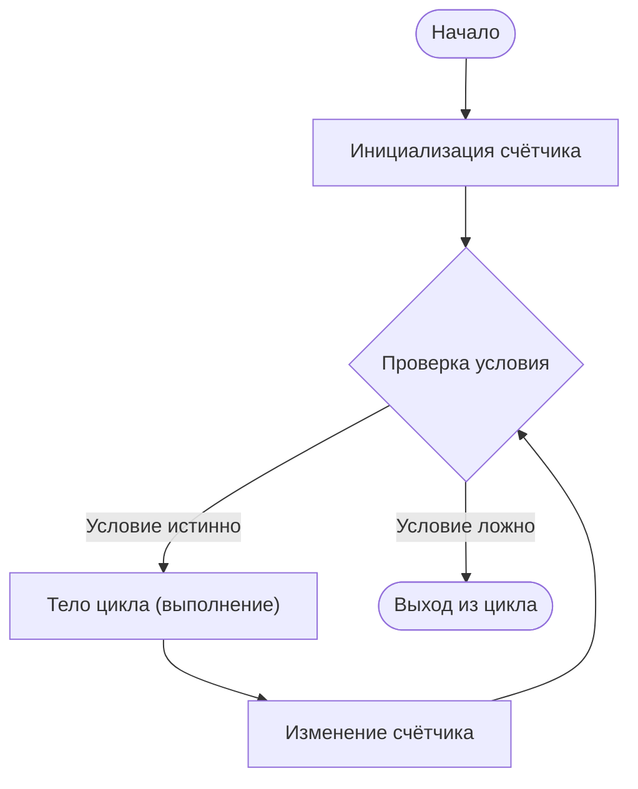
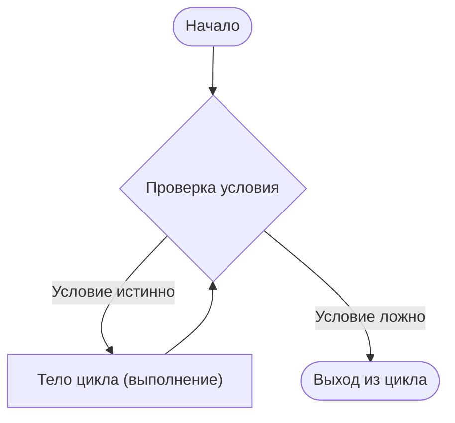
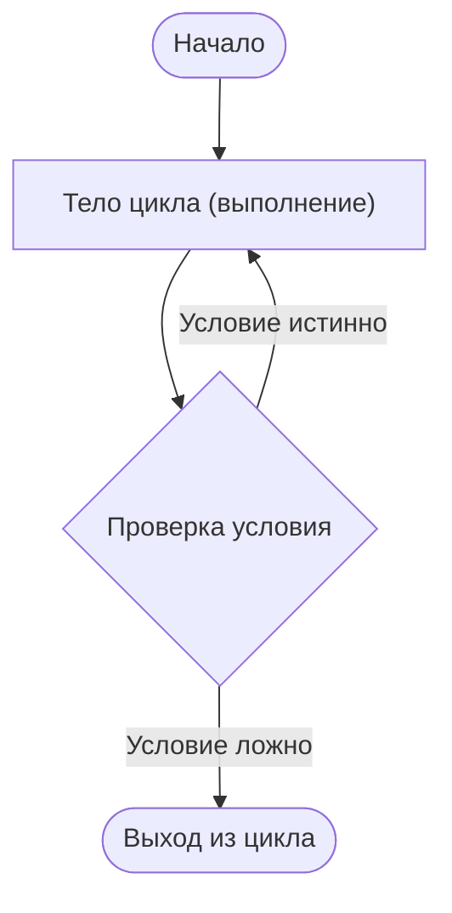
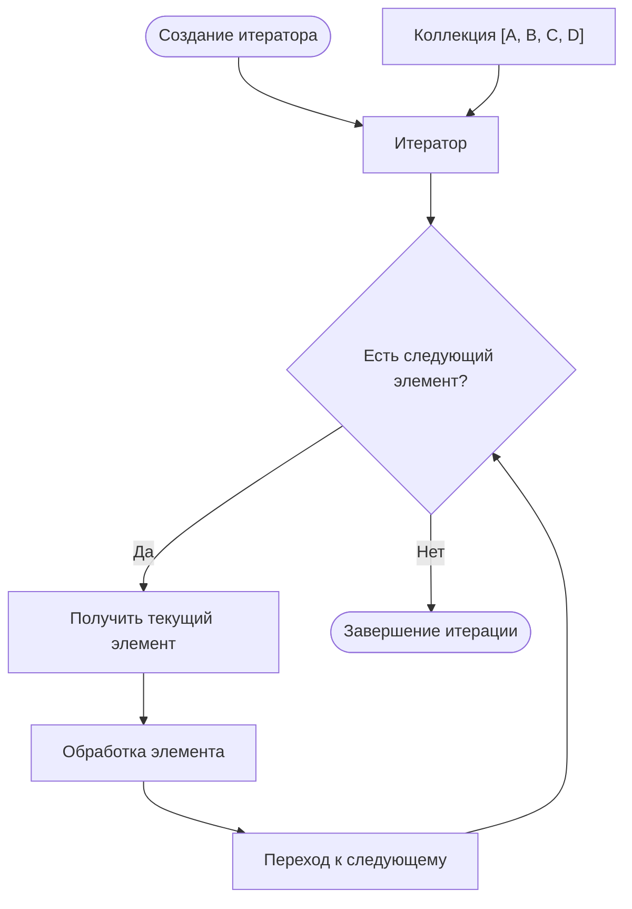

---
title: Циклы
tags: [beginner, advanced, required, all, analytic, engineer, developer, architector, tester, manager]
---

import LoopsSimulator from '@site/src/components/LoopsSimulator.jsx';

# Циклы

<div class="article-tags">
  <span class="tag tag-required">ОБЯЗАТЕЛЬНО</span>
  <span class="tag tag-beginner">ДЛЯ НОВИЧКОВ</span>
  <span class="tag tag-advanced">НЕ ДЛЯ НОВИЧКОВ</span>
  <span class="tag tag-inprogress">В РАЗРАБОТКЕ</span>
</div>
<span class="complexity-badge">Разработчику</span>
<span class="complexity-badge">Аналитику</span>
<span class="complexity-badge">Тестировщику</span>  
<span class="complexity-badge">Архитектору</span>
<span class="complexity-badge">Инженеру</span>

## Циклы

### Что такое цикл?

★ **Циклы** – повторяемый блок кода. Это не метод, и не функция, это конструкция, которая позволяет выполнять блок кода несколько раз подряд. 

Циклы полезны, когда нужно выполнить одну и ту же операцию для большого количества данных или повторять действие до тех пор, пока не будет выполнено определённое условие. Они помогают избежать ручного дублирования кода. Если нужно вывести на экран числа от 1 до 10, мы можем написать цикл, который автоматически переберёт эти числа и выполнит нужную операцию для каждого из них. Это делает программы компактнее и эффективнее.

Типы циклов:
	- Цикл с фиксированным числом повторений - выполняется заранее известное количество раз (к примеру, вывести числа от 1 до 10);
	- Цикл с условием - выполняется до тех пор, пока условие истинно (продолжать вывод данных, пока пользователь не введёт стоп);
	- Цикл для обработки коллекций - проходит по всем элементам списка, массива или другой структуры данных (например, найти сумму всех чисел в списке).

<LoopsSimulator />

	
Циклы могут быть и вложенными, то есть один цикл может содержать себя внутри другой.

Аналогично - методы  и функции. Функция может вызывать другие функции. Именно такой подход и упрощает написание кода, особенно когда логика становится большой и сложной.

---


### Устройство и классификация циклов

Циклические конструкции реализуют итеративный вычислительный процесс. Формально цикл определяется тройкой:  
1. **Инициализация** — установка начального состояния итератора;  
2. **Условие продолжения** — предикат, проверяемый перед (или после) каждой итерации;  
3. **Шаг итерации** — изменение состояния итератора.  

В зависимости от того, когда происходит проверка условия, различают:
- **Циклы с предусловием** (`while`, `for` в большинстве языков): проверка выполняется до тела цикла;  
- **Циклы с постусловием** (`do...while` в C-подобных языках): тело выполняется как минимум один раз, проверка — после.

Отдельно выделяются **итераторные циклы высокого уровня** (`for...of`, `foreach`, `for-in`, Java `for-each`, Python `for`), которые абстрагируют детали управления итератором и работают с интерфейсами перечисления (`IEnumerable`, `Iterable`, `Iterator`, `Symbol.iterator` и т.п.). Такие циклы неявно управляют состоянием итератора и корректно завершаются при исчерпании последовательности.

---

### Цикл for

Итераторный цикл с предусловием `for` в разных языках программирования выглядит следующим образом:



**Цикл `for`**:
- Объединяет инициализацию, проверку условия и изменение счётчика в одной конструкции
- Подходит для ситуаций с известным количеством итераций
- Тело цикла может не выполниться ни разу, если условие изначально ложно

#### for

```javascript
for (let i = 1; i <= 10; i++) {
    console.log(i);
}
// 1, 2, 3, ... 10
```

#### for с шагом

```javascript
// Чётные числа от 0 до 20
for (let i = 0; i <= 20; i += 2) {
    console.log(i);
}
```

#### Обратный отсчет

```javascript
for (let i = 10; i > 0; i--) {
    console.log(i);
}
console.log("Пуск!");
```

#### Обработка коллекций

```javascript
const numbers = [1, 2, 3, 4, 5];

for (const num of numbers) {
    console.log(num);
}
```

#### for...in (для объектов)

```javascript
const user = { name: "Alice", age: 25, city: "Moscow" };

for (const key in user) {
    console.log(`${key}: ${user[key]}`);
}
// name: Alice
// age: 25
// city: Moscow
```

---

### Цикл foreach

Цикл `foreach` подразумевает перебор элементов в наборе. Буквально, переводится как `для каждого` - `for each`. 

Самый классический - в PHP:
```php
$items = [1, 2, 3];

foreach ($items as $item) {
    echo $item . "\n";
}

// С индексом
foreach ($items as $index => $item) {
    echo "$index: $item\n";
}
```

Java работает с коллекциями (List, Set и т.д.):
```java
List<String> items = Arrays.asList("a", "b", "c");

items.forEach(item -> System.out.println(item));
// или с методом-референсом
items.forEach(System.out::println);
```

C# работает с коллекциями и LINQ:
```csharp
var items = new List<string> { "a", "b", "c" };

items.ForEach(item => Console.WriteLine(item));
```

В Python называется немного иначе, потому что `for` сам по себе итерирует:
```python
items = [1, 2, 3]

for item in items:
    print(item)

```

В JavaScript используется функция `forEach()`:
```javascript
const items = [1, 2, 3];

items.forEach((item, index, array) => {
    console.log(item, index);
});

// 1 0
// 2 1
// 3 2
```

Ruby использует метод `each` - аналог:
```ruby
items = [1, 2, 3]

items.each do |item|
    puts item
end

# или в одну строку
items.each { |item| puts item }
```

---

### Цикл while

Цикл с предусловием `while` в разных языках программирования можно изобразить так:



**Цикл `while`**:
- Проверяет условие перед каждой итерацией
- Подходит для ситуаций с неизвестным количеством итераций
- Тело цикла может не выполниться ни разу, если условие изначально ложно

```javascript
let input;

while (input !== 'стоп') {
    input = prompt("Введите что-то (стоп для выхода):");
    console.log(`Вы ввели: ${input}`);
}
```

Бесконечный цикл может подразумевать выполнение цикла снова и снова:
```python
while True:
    print("Ты знаешь, что такое безумие?")
```

Поэтому бесконечные циклы всегда должны иметь выходы, как рекурсивные функции. Обычно в языках для выхода из цикла используется ключевое слово `break`:

```javascript
while (true) {
    const answer = prompt("Продолжить? (да/нет)");
    if (answer === "нет") break;
}
```

---

### Цикл do-while

Цикл с постусловием `do...while` выглядит так:



**Цикл `do-while`**:
- Выполняет тело цикла как минимум один раз
- Проверяет условие после выполнения тела цикла
- Подходит для ситуаций, когда нужно гарантированно выполнить действие хотя бы один раз

```javascript
let password;

do {
    password = prompt("Введите пароль:");
} while (password !== "secret");

console.log("Добро пожаловать!");
```

---


### Итерация

**Итерация** — это однократное выполнение тела цикла или повторяющегося блока кода. Каждый проход цикла представляет собой отдельную итерацию. Итерация является базовой единицей повторяющегося вычислительного процесса.

Процесс итерации состоит из трёх последовательных этапов:
- Проверка условия продолжения выполнения
- Выполнение тела итерации
- Обновление состояния для следующей итерации

```python
# Python — три итерации цикла
for i in range(3):
    print(f"Итерация номер {i}")
```

```java
// Java — три итерации цикла
for (int i = 0; i < 3; i++) {
    System.out.println("Итерация номер " + i);
}
```

```csharp
// C# — три итерации цикла
for (int i = 0; i < 3; i++)
{
    Console.WriteLine($"Итерация номер {i}");
}
```

В приведённых примерах цикл выполняет ровно три итерации, или, если проще, код выполняется три раза. На каждой итерации переменная `i` принимает новое значение (0, 1, 2), и выполняется вывод сообщения. После третьей итерации условие `i < 3` становится ложным, и цикл завершается.

**Итератор** — это объект или механизм, который последовательно предоставляет доступ к элементам коллекции или последовательности. Итератор инкапсулирует логику перемещения по структуре данных и отслеживания текущей позиции.

Итератор реализует два основных действия:
- Получение текущего элемента
- Переход к следующему элементу

Не путайте с итерацией и циклами! Это другое!

Итератор выглядит так:



Итератор обеспечивает унифицированный интерфейс для обхода различных структур данных: массивов, списков, деревьев, графов. Это позволяет писать универсальный код, не зависящий от внутренней реализации коллекции.

**Итеративность** — это подход к решению задач через последовательное повторение операций с постепенным приближением к результату. Итеративный процесс характеризуется циклическим выполнением шагов, где каждый шаг использует результат предыдущего для продвижения к цели.

Итеративная разработка предполагает создание продукта через последовательные циклы улучшений. Каждая итерация добавляет новую функциональность или улучшает существующую на основе полученной обратной связи.

Этапы итеративной разработки:
- Планирование содержания итерации
- Реализация запланированных функций
- Тестирование и интеграция
- Получение обратной связи от пользователей
- Анализ результатов и планирование следующей итерации

---

### Перебор элементов коллекции

И как раз-таки итерация отлично подходит для перебора в циклах.

**Перебор элементов коллекции** — это последовательное обращение к каждому элементу структуры данных для выполнения над ним операций. Перебор является базовой операцией при работе с массивами, списками, множествами и другими коллекциями.

Перебор позволяет обрабатывать все элементы коллекции без необходимости обращаться к каждому элементу индивидуально по индексу или ключу. Это делает код более универсальным и компактным.

Перебор элементов коллекции решает следующие задачи:

- Применение одинаковой операции ко всем элементам
- Поиск элементов по определённым критериям
- Фильтрация и преобразование данных
- Агрегация данных (суммирование, подсчёт и т.д.)
- Вывод информации на экран или в файл

Последовательный перебор проходит по элементам коллекции в том порядке, в котором они хранятся.

```python
# Python — последовательный перебор списка
numbers = [1, 2, 3, 4, 5]
for number in numbers:
    print(f"Элемент: {number}")
```

```java
// Java — последовательный перебор массива
int[] numbers = {1, 2, 3, 4, 5};
for (int number : numbers) {
    System.out.println("Элемент: " + number);
}
```

```csharp
// C# — последовательный перебор списка
List<int> numbers = new List<int> {1, 2, 3, 4, 5};
foreach (int number in numbers)
{
    Console.WriteLine($"Элемент: {number}");
}
```

Перебор с индексами позволяет одновременно получать доступ к элементу и его позиции в коллекции.

```python
# Python — перебор с индексами
fruits = ["яблоко", "банан", "апельсин"]
for index, fruit in enumerate(fruits):
    print(f"Индекс {index}: {fruit}")
```

```java
// Java — перебор с индексами
String[] fruits = {"яблоко", "банан", "апельсин"};
for (int i = 0; i < fruits.length; i++) {
    System.out.println("Индекс " + i + ": " + fruits[i]);
}
```

```csharp
// C# — перебор с индексами
string[] fruits = {"яблоко", "банан", "апельсин"};
for (int i = 0; i < fruits.Length; i++)
{
    Console.WriteLine($"Индекс {i}: {fruits[i]}");
}
```

Современные языки программирования предоставляют функциональные методы для перебора коллекций.

#### Map (преобразование)

```python
# Python — преобразование всех элементов
numbers = [1, 2, 3, 4, 5]
squared = list(map(lambda x: x ** 2, numbers))
print(squared)  # [1, 4, 9, 16, 25]

# Или с использованием спискового включения
squared = [x ** 2 for x in numbers]
```

```javascript
// JavaScript — преобразование массива
const numbers = [1, 2, 3, 4, 5];
const squared = numbers.map(x => x ** 2);
console.log(squared);  // [1, 4, 9, 16, 25]
```

#### Filter (фильтрация)

```python
# Python — фильтрация элементов
numbers = [1, 2, 3, 4, 5, 6, 7, 8, 9, 10]
even_numbers = list(filter(lambda x: x % 2 == 0, numbers))
print(even_numbers)  # [2, 4, 6, 8, 10]
```

```javascript
// JavaScript — фильтрация массива
const numbers = [1, 2, 3, 4, 5, 6, 7, 8, 9, 10];
const evenNumbers = numbers.filter(x => x % 2 === 0);
console.log(evenNumbers);  // [2, 4, 6, 8, 10]
```

#### Reduce (свёртка)

```python
# Python — свёртка коллекции
from functools import reduce
numbers = [1, 2, 3, 4, 5]
total = reduce(lambda x, y: x + y, numbers)
print(total)  # 15
```

```javascript
// JavaScript — свёртка массива
const numbers = [1, 2, 3, 4, 5];
const total = numbers.reduce((acc, curr) => acc + curr, 0);
console.log(total);  // 15
```

---

### Инвариант цикла

Для анализа корректности важно определять **инвариант цикла** — утверждение, истинное перед входом в цикл, сохраняющееся после каждой итерации и обеспечивающее правильность результата по завершении. Инвариант применяется в доказательствах корректности (например, при сортировке, поиске, вычислении суммы/произведения).

Пример инварианта для суммы элементов массива `a[0..n-1]`:  
> После *k*-й итерации переменная `sum` содержит сумму `a[0] + a[1] + … + a[k-1]`.

---

### Ресурсные аспекты

- Временная сложность цикла определяется произведением числа итераций на сложность тела.  
- Пространственная сложность — обычно *O(1)*, если в теле не создаются структуры линейного размера.  
- При вложенных циклах сложность перемножается: два вложенных цикла по *n* итераций → *O(n²)*.

> **Важно**: в функциональных стилях (например, `map`, `reduce`, `filter`) итерация реализуется через рекурсию (хвостовую — в оптимизируемых случаях) или скрытые циклы в runtime. Это не устраняет циклическую природу вычислений, но переносит ответственность за управление итерацией в библиотеку.

---

### Безопасность и корректность

- **Выход за границы** — типичная ошибка при ручном управлении индексом (off-by-one). Итераторные циклы снижают риск.  
- **Бесконечный цикл** возникает, если условие никогда не становится ложным (например, при ошибке в шаге итерации или некорректном предусловии).  
- В многопоточных сценариях тело цикла, модифицирующее разделяемое состояние, требует синхронизации (мьютексы, атомарные операции, immutable-подход).

---
