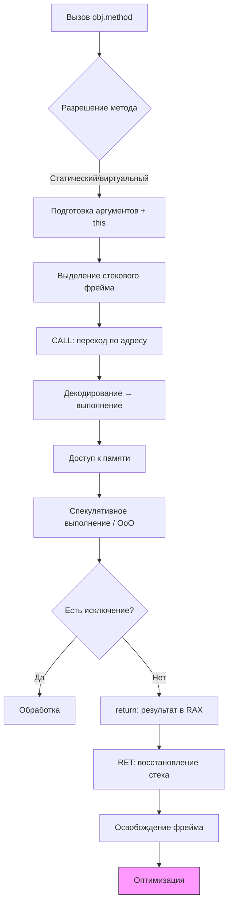

---
title: Процесс выполнения исходного кода
tags: [advanced, notrequired, engineer, developer, architector]
---

import MethodCallSimulator from '@site/src/components/MethodCallSimulator.jsx';

# Процесс выполнения исходного кода

  В РАЗРАБОТКЕ
  НЕ ДЛЯ НОВИЧКОВ
  НЕ ОБЯЗАТЕЛЬНО

Разработчику
Архитектору
Инженеру

## Процесс выполнения исходного кода

### Как выполняется код?

Что забавно, это лишь верхушка айсберга. И в этом списке был у нас такой шаг, когда выполняется вызов или обращение к другим элементам. Поэтому, можно погрузиться ещё глубже в то, как работает именно механика выполнения кода.

---

Представим, что мы вызываем метод (пункт 10 в прошлой таблице), обращаемся к объекту. Что происходит?

<MethodCallSimulator />

| № | Этап | Описание |
|---|------|--------|
| 1 | Вызов метода (синтаксис) | Программист пишет `obj.method(arg)`. На уровне языка это вызов метода на экземпляре. Компилятор или интерпретатор проверяет сигнатуру, типы аргументов, доступность метода (public/private). |
| 2 | Разрешение имени метода | На этапе компиляции или выполнения определяется, какой именно метод вызывается: статический, виртуальный, переопределённый. Для виртуальных методов используется таблица виртуальных функций (VTable) — массив указателей на реализации методов. |
| 3 | Подготовка аргументов | Аргументы (включая `this` — ссылку на объект) помещаются в стек или регистры в соответствии с соглашением о вызове (calling convention), например cdecl, fastcall, thiscall. Объекты передаются по ссылке, примитивы — по значению. |
| 4 | Выделение фрейма стека | Под вызов метода выделяется стековый фрейм (stack frame). В нём хранятся: параметры, локальные переменные, адрес возврата, сохранённые регистры. Указатель стека (RSP на x86-64) сдвигается вниз. |
| 5 | Сохранение контекста | Перед переходом сохраняются регистры, если они используются в вызывающем коде. Это обеспечивает корректность при возврате. В некоторых архитектурах используется регистровое окно (SPARC), в других — только стек. |
| 6 | Переход по адресу (jump/call) | Процессор выполняет команду CALL, которая: помещает адрес возврата в стек, загружает в счётчик команд (RIP) адрес начала метода. Управление передаётся новому участку кода. |
| 7 | Декодирование инструкций | CPU декодирует байт-код (в JVM) или машинный код (в нативных системах) в микрооперации (μops). Современные процессоры используют конвейер (pipeline): fetch → decode → execute → memory → writeback. |
| 8 | Выполнение операций (ALU / FPU) | Арифметико-логическое устройство (ALU) выполняет операции: сложение, сдвиг, сравнение. FPU — операции с плавающей точкой. Результаты временно хранятся в регистрах. |
| 9 | Работа с памятью (load/store) | При доступе к полям объекта процессор: вычисляет физический адрес как base + offset, читает/пишет данные через шину памяти, использует кэш (L1/L2/L3) для ускорения. Промах кэша (cache miss) может стоить сотен тактов. |
| 10 | Контроль зависимостей (data hazards) | Процессор анализирует зависимости между инструкциями. Если одна инструкция зависит от результата другой, может быть вставлена задержка (stall) или использовано переименование регистров и исполнение вне порядка (out-of-order execution). |
| 11 | Спекулятивное выполнение | Современные CPU предсказывают ветвления (например, `if (x > 0)`). Если предсказание верно — выигрыш времени. Если нет — результаты отбрасываются (pipeline flush), что связано с потерей производительности. |
| 12 | Обработка исключений | При ошибках (деление на ноль, NullPointerException) генерируется исключение. Управление передаётся обработчику (`try/catch`). На низком уровне — это прерывание (interrupt) или trap, переход к обработчику в ядре или среде выполнения. |
| 13 | Возврат из метода (return) | При `return value`: результат помещается в регистр (например, RAX), фрейм стека освобождается (указатель стека возвращается), выполняется RET — извлекается адрес возврата, и RIP на него указывает. |
| 14 | Восстановление контекста | Восстанавливаются регистры, если они были сохранены. Управление возвращается в вызывающий код. Локальные переменные фрейма становятся недоступными (но память пока не очищена). |
| 15 | Оптимизация выполнения (JIT / AOT) | В средах с JIT (Java, .NET): часто вызываемые методы компилируются в нативный код, применяется профиль-управляемая оптимизация (например, inlining виртуальных вызовов, если тип известен). |
| 16 | Escape Analysis | JIT-компилятор анализирует, «уходит ли» объект за пределы метода. Если нет — объект может быть выделен на стеке, а не в куче, что ускоряет работу и снижает нагрузку на GC. |
| 17 | Thread-local execution | Каждый поток имеет свой стек. Выполнение метода происходит в контексте потока. При многопоточности возможны гонки, требующие синхронизации (блокировки, атомарные операции). |
| 18 | Memory Barriers / Fences | При работе с общими данными между потоками используются барьеры памяти, чтобы гарантировать порядок чтения/записи и видимость изменений (иначе кэши CPU могут держать устаревшие значения). |
| 19 | Сигналы и прерывания | Выполнение может быть прервано внешними событиями: таймер, ввод-вывод, сигнал от ОС. Процессор приостанавливает выполнение, сохраняет состояние, переходит к обработчику прерывания. |
| 20 | Power Management & Throttling | Современные CPU динамически изменяют частоту (Turbo Boost, throttling). Это влияет на время выполнения кода — один и тот же метод может выполняться с разной скоростью в разные моменты. |

---

### Схема выполнения

Схематично:

---