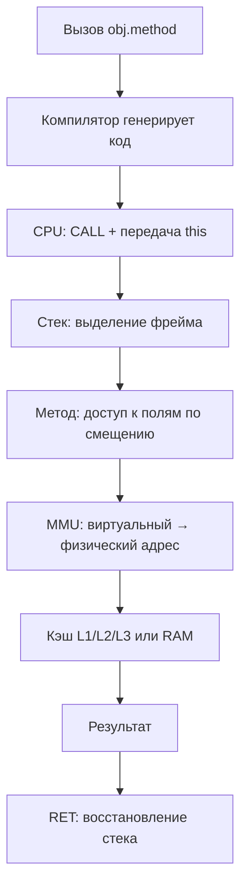
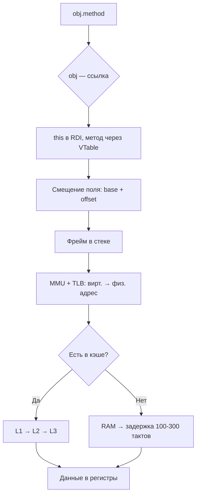
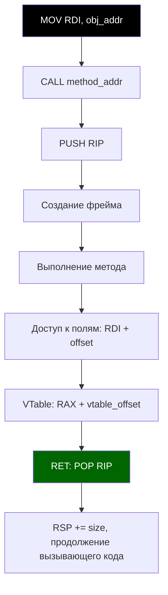

---
title: Архитектура современных процессоров
tags: [advanced, notrequired, engineer, developer, architector]
description: Сложное железо. Влияние железа на код.
---

# Архитектура современных процессоров

<div class="article-tags">
  <span class="tag tag-inprogress">В РАЗРАБОТКЕ</span>
  <span class="tag tag-advanced">НЕ ДЛЯ НОВИЧКОВ</span>
  <span class="tag tag-notrequired">НЕ ОБЯЗАТЕЛЬНО</span>
</div>
<span class="complexity-badge">Разработчику</span>
<span class="complexity-badge">Архитектору</span>
<span class="complexity-badge">Инженеру</span>

## Архитектура современных процессоров

### Память

Если вы подзабыли, что такое процессор, память, диск - перечитайте, ведь сейчас мы погрузимся ещё ниже. Что нужно знать ещё о железе?

К слову, это уже называется системное программирование. Собственно, за всю такую работу и отвечает операционная система, со всеми своими службами, утилитами, менеджерами и драйверами. Но тем не менее, это знать тоже нужно.

Начнём с памяти.

Память - иерархия, а не плоское пространство. Доступ к данным идёт по иерархии:

```
Регистры CPU → 
	L1 кэш (3-4 такта) → 
		L2 → 
			L3 → 
				RAM (100-300 тактов) → 
					SSD/HDD (миллионы тактов).
```

И эти такты как раз и образуют собой работу процессора, скорость которого измеряется частотой.

**Ссылки** - это указатели на адреса в памяти. Когда вы пишете obj.method(), на низком уровне obj - это указатель (тот самый адрес в куче), method() - вызов по смещению в VTable, а this - неявный первый аргумент (передается как this-указатель).

Выполнение, кстати, производится не только центральным процессором - также может выполнять код и GPU (графический процессор), TPU/NPU (для ИИ), DMA (прямой доступ к памяти без CPU). Но в это пока не погружаемся.

Каждый язык и архитектура имеют модель памяти, которая определяет, что значит «память видна» между потоками, можно ли переупорядочивать операции, как работает атомарность, волатильность, синхронизация. Если нарушить модель - будут гонки, глюки и неопределённое поведение. Поэтому и существует совместимость, и иногда что-то работает с другим языком или на другой архитектуре, но не так, как ожидается.

**Стек** - это сегмент памяти, работающий по принципу LIFO (Last In, First Out). Он используется для хранения локальных переменных, параметров функций, адресов возврата и сохранённых регистров.

В стеке выделяется фиксированный размер на поток, доступ к нему очень быстрый (через операции push - толкать, pop - выталкивать). В нём используется автоматическое управление (он освобождается при выходе из функции). Стек расположен в верхней части виртуального адресного пространства (растёт вниз).

**Куча** - область памяти для динамического выделения объектов (те самые new, maioc). Управление кучей уже выполняется либо вручную, либо через сборщик мусора.

Куча обладает менее предсказуемой производительностью (из-за фрагментации), может расти или сжиматься в процессе выполнения. Она располагается ниже стека в адресном пространстве и управляется через менеджер памяти.

Ссылка (Reference) - это абстракция указателя в высокоуровневых языках, хранящая адрес объекта в памяти. Она не позволяет прямых арифметических операций (в отличие от указателей в C++, именно поэтому ссылка это уже не указатель).

Память поделена на ячейки, ведь представляет собой линейную последовательность байтов, каждый из которых имеет уникальный адрес (номер). А адрес это как раз смещение от начала памяти.

При выделении памяти (в куче) выделяется блок нужного размера. Блоки управляются через списки свободных/занятых областей.

**Смещение** (Offset) - это разница между базовым адресом структуры (например, объекта) и адресом конкретного поля. К примеру, если объект начинается по адресу 0x1000, а поле value - восьмой байт, то смещение = 8. Доступ будет как-то так *(obj_addr + 8).

**Базовый адрес** - это начальный адрес области памяти (объекта, массива или сегмента). Все остальные адреса вычисляются относительно него.

**Физический адрес** же является реальным адресом в оперативной памяти, по которому данные хранятся на физической микросхеме.

**Виртуальный адрес** - это адрес, используемый программой. MMU преобразует его в физический.

**MMU** (Memory Management Unit) это аппаратный компонент CPU, который отвечает за преобразование виртуальных адресов в физические. Он использует таблицы страниц, поддерживает виртуальную память, защиту доступа, кэширование TLB и позволяет каждому процессу иметь изолированное адресное пространство.

**TLB** (Translation Lookaside Buffer) это кэш MMU, который хранит соответствия виртуальных и физических адресов.

**Стек вызовов** (Call Stack) это просто специализированное использование того самого стека в памяти, для отслеживания активных функций (методов). Тот же стек, просто используется для хранения контекста вызовов.

**Фрейм стека** (Stack Frame) это блок данных в стеке, выделенный для одного вызова функции. Он содержит параметры, локальные переменные, адрес возврата, сохранённые регистры, указатель на предыдущий фрейм. При выходе из функции фрейм удаляется - это и будет команда pop.

**Указатель стека** (Stack Pointer) критически важный инструмент управления стеком. При push он уменьшается, при pop - увеличивается (причем растёт вниз).

**ESP** (x86, 32-bit) указывает на верх стека (последний занесённый элемент.

**RSP** (x86-64) это 64-битная версия ESP.

**Указатель фрейма** (Frame Pointer, EBP/RBP) указывает на начало текущего фрейма, используется для доступа к параметрам и локальным переменным по фиксированному смещению.

То есть, обращение к стеку происходит через RSP/ESP, управляемое процессором.

А стек бывает **стеком вызовов** (основной, используется всеми функциями), и **стеком потока** (каждый поток имеет свой стек).

---

### Процессор

**Такт** (Clock Cycle) это один импульс тактового генератора, базовая единица времени для CPU - да, время у него измеряется иначе, и все операции синхронизированы тактом. Как сердцебиение - и поэтому процессор является сердцем - тем самым моторчиком.

**Частота** (Clock Frequency) определяет количество тактов в секунду (Гц), например, 3.5 GHz = 3.5 миллиарда тактов/сек. Да, у процессоров такая скорость. Это определяет максимальную скорость выполнения инструкций (но не всегда, из-за конвейера, простоя и т.д.).

**Регистры** же являются очень быстрой памятью внутри CPU, и используются для хранения данных, адресов, состояния. К примеру, RAX - аккумулятор (результаты операций), RIP - счётчик команд, RSP - указатель стека, RDI, RSI - аргументы функций. Это всё регистры.

**Регистровые окна** - это архитектурный приём (в SPARC), при вызове функции автоматически переключается набор регистров. Это для ускорения вызовов, избегая push/pop в стек. Современные CPU используют переименование регистров вместо этого.

**Счётчик команд** (Program Counter, RIP) это регистр, хранящий адрес следующей инструкции для выполнения. При каждом шаге он увеличивается, а при jmp/call изменяется.

**Инструкции** являются элементарными командами, понятными процессору (MOV, ADD, CALL, JMP). Они хранятся в памяти как машинный код, в байтах и декодируются процессором в микрооперации.

**Ассемблерные команды** - это самый низкий уровень управления процессором. Они напрямую соответствуют машинному коду, который выполняет процессор.

**MOV** - копирует данные из источника в приёмник. Это просто перемещение, одна из самых частых операций - загрузка значений, параметров, адресов.

**ADD** / **SUB** - сложение и вычитание, которые изменяют флаги (Zero Flag, Carry Flag), используются в арифметике, инкременте, адресации.

**CALL** - вызов функции или метода. Помещает адрес возврата (следующую инструкцию) в стек (PUSH RIP), затем загружает в счетчик команд (RIP) адрес функции, переходя к телу функции.

**RET** - возврат из функции. Извлекает адрес возврата из стека и загружает его в RIP, после чего продолжает выполнение с того места, откуда была вызвана функция. Это автоматический финал любого метода.

**JMP** - безусловный переход, мгновенно переходит на указанный адрес. Используется в циклах, GOTO, оптимизациях.

**JE** / **JNE** / **JL** / **JG** - условные переходы, работают после CMP или арифметики. Они реализуют if, while, for.

**PUSH** / **POP** - работа со стеком. PUSH кладёт значение на стек, RSP уменьшается, POP забирает значение со стека, RSP увеличивается. Используются при вызовах, сохранении регистров, локальных данных.

**CMP** - сравнение, вычитает два значения, обновляет флаги, но не сохраняет результат. Нужен перед условными переходами.

**TEST** - побитовое И (для флагов), используется для проверки на ноль.

**LEA** -Load Effective Address, вычисляет адрес, но не обращается к памяти. Используется для арифметики указателей, смещений.

**XOR** / **AND** / **OR** / **NOT** - побитовые операции, используются в манипуляциях с флагами, хэшах, оптимизациях.

**NOP** - No Operation, ничего не делает, 1 такт простоя. Используется для выравнивания, отладки задержек.

Важное уточнение - то, что работает на x86-64, не сработает на ARM (там другие инструкции - MOV, BL, LDR, STR и пр).

Компилятор автоматически генерирует эти команды из C++, Java, Rust, .NET. Оптимизатор может менять порядок, удалять, заменять команды.

---

```
Интересная задумка - можете поиграться с нейросетями в интерактиве - вы пишете в чат код на каком-либо языке, а нейросеть в ответ будет писать ассемблер. Так вы можете изучать низкий уровень работы команд.
```

---

**Микрооперации** (Micro-ops, μops) это внутренние команды, на которые CPU разбивает сложные инструкции. Они позволяют выполнять инструкции вне порядка (как раз out-of-order execution) и параллельно.

**Адрес возврата** (Return Address) это адрес в коде, куда нужно вернуться после завершения функции. Он сохраняется в стеке при выполнении CALL.

**VTable** (Virtual Method Table) это таблица указателей на реализации виртуальных методов для конкретного класса. Каждый объект с виртуальными методами содержит скрытое поле - указатель на VTable. При вызове виртуального метода происходит `obj->vtable[METHOD_INDEX]()` — динамическое разрешение.

**Виртуальный метод** - это метод, поведение которого может быть переопределено в наследнике. Вызов разрешается во время выполнения (dynamic dispatch) через VTable. К примеру, @Override в Java (ещё вернёмся).

**Инициализация**, кстати - это процесс установки начального состояния объекта или переменной. Она включает присвоение значений полям, вызов конструктора, выполнение статических инициализаторов, загрузку класса. На низком уровне происходит запись байтов в память по нужным смещениям.

**Контекст выполнения** (Execution Context) - это совокупность данных, необходимых для выполнения кода, как раз стек вызовов, регистры, локальные переменные, объект this. У каждого потока свой контекст.

**this** (или self) это неявный параметр метода, который указывает на текущий экземпляр объекта. На низком уровне это первый аргумент метода (в RDI на x86-64).

**Поток** (Thread) является потоком выполнения внутри процесса. Он имеет свой стек, свои регистры, счётчики команд, но (!) общую память (кучу) с другими потоками. Он позволяет выполнять несколько задач параллельно.

**Контекст потока** (Thread Context) представляет собой набор регистров, стека, состояния, сохранённых при переключении потоков. Сохраняется ядром ОС при переключении контекста (context switch).

У процессора есть кэши. Мы вкратце о них упоминали - это быстрая память внутри CPU, которая хранит копии часто используемых данных и инструкций.
	- L1: самый быстрый (~3 такта), разделён на data и instruction.
	- L2: медленнее (~10 тактов), общий для ядра.
	- L3: ещё медленнее (~40 тактов), общий для всех ядер.

Если будет промах кэша (cache miss), то потеряем такты.

---

### Схема выполнения

Можно построить некую обобщённую схему:


Текстом:
```
[Программа: obj.method()]
		↓
[Компилятор: генерирует вызов, использует VTable]
		↓
[CPU: RSP управляет стеком, RIP — счётчик команд]
		↓
[Вызов: push аргументов, CALL → RIP = адрес метода]
		↓
[Метод: фрейм в стеке, доступ к this, полям по смещению]
		↓
[Память: MMU преобразует виртуальный → физический адрес]
		↓
[Кэш: L1/L2/L3 ускоряют доступ к данным]
		↓
[Возврат: RET, RSP++, RIP = адрес возврата]

```

---


Схематично:



---

Но пример выше он скорее верхнеуровневый, показывает лишь сквозной путь от вызова до возврата, с акцентом на взаимодействие программного и аппаратного уровней. Если же хотим погрузиться чуть ниже, на более системный уровень, то получим уже такую схему:

---



---

Теперь уже видим иерархию памяти и механизмы адресации, с TLB, смещением, MMU. Можно ещё ниже:



---

Сложнее, наверное, уже не получится - технически, так и работает регистр, стек, вызов и возврат.

---