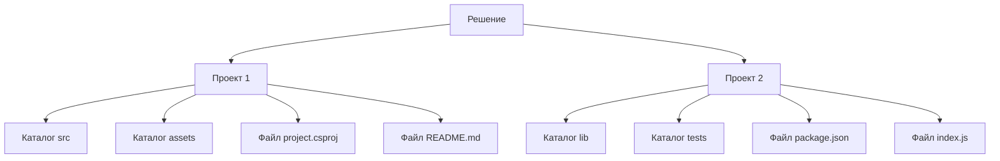

---
title: Проект программного обеспечения
---

# Проект программного обеспечения

  ОБЯЗАТЕЛЬНО
  ДЛЯ НОВИЧКОВ
  НЕ ДЛЯ НОВИЧКОВ
  В РАЗРАБОТКЕ

Разработчику
Аналитику
Тестировщику  
Архитектору
Инженеру

## Проект и его особенности

Программа редко ограничивается одним файлом кода. Даже простое приложение требует организации множества компонентов: исходных файлов, библиотек, конфигураций, ресурсов и инструкций для сборки. Чтобы управлять этой сложностью, разработчики используют понятие **проекта** — логической и технической единицы, объединяющей всё необходимое для создания работающей программы.

### Проект

★ **Проект (Project)** – один программный модуль с конкретной задачей. Например, веб-сервер или мобильное приложение. У проекта есть определённая структура, характерная для фреймворка и языка программирования, но в целом, можно назвать это набором файлов, содержащих исходный код до компиляции, и набор исполняемых файлов после компиляции.

Это структурированная среда, описанная в специальных файлах, понятных как человеку, так и инструментам автоматизации. Он определяет, откуда начинать выполнение программы, какие внешние компоненты подключить, под какие платформы собирать результат и как обрабатывать ресурсы. 

Примерами проектов могут служить веб-сервер, мобильное приложение, консольная утилита или библиотека компонентов. 

Проект, его структура и настройки сохраняются в единый файл проекта, описывающий, что должно быть собрано, какие зависимости есть, какие платформы поддерживаются и т.д. Формат зависит от языка и платформы - .csproj (C#), .xcodeproj (Swift), .iml (Java), .idea, setup.py и другие.

Файл проекта хранит информацию о:

	- входных точках программы;
	- зависимостях;
	- целевых платформах;
	- правилах сборки;
	- путях к ресурсам.

Эти файлы позволяют инструментам автоматически воссоздать окружение разработки и выполнить сборку без ручного вмешательства.

Структура проекта определяется используемым языком программирования и фреймворком. Несмотря на различия между экосистемами, большинство проектов включают:

	- исходные файлы с логикой программы;
	- файлы описания зависимостей;
	- конфигурационные файлы;
	- ресурсы (изображения, звуки, шаблоны);
	- скрипты сборки и развертывания.

---

### Решение

В сложных системах одна задача часто требует нескольких взаимосвязанных компонентов. Для управления такими системами используется понятие решения. 

Проектов может быть несколько, и они объединяются в решение.

На примере выше, как раз решение объединяет несколько независимых, но связанных проектов. Каждый проект состоит из каталогов (для исходного кода, ресурсов, тестов и т.п.) и файлов (конфигурации, метаданных, описания зависимостей и т.д.). Структура каталогов и состав файлов зависит от языка, фреймворка и инструментов сборки, но общий принцип остаётся неизменным: проект — это организованное хранилище всего необходимого для создания исполняемой программы или библиотеки.

★ **Решение (Solution)** – набор связанных проектов для масштабных систем, к примеру, решение «Интернет-магазин» будет включать в себя и мобильное приложение, и фронтенд, и бэкенд. В Visual Studio, например, решение объединяется в файл .sln, а в IntelliJ IDEA в одном workplace (рабочем месте). Можно сказать, что решение представляет собой контейнер, в котором могут находиться один или несколько проектов. Решение хранит ссылки на проекты и настройки сборки для всех этих проектов.

Решение не содержит исходного кода напрямую, но управляет проектами.

Например, решение «Система онлайн-обучения» может включать:

	- бэкенд-проект (API на C#);
	- фронтенд-проект (React-приложение);
	- мобильное приложение (Kotlin/Swift);
	- служебные утилиты (например, миграции базы данных).

---

### Самостоятельные файлы кода

Порой код может существовать в виде единого файла, без организации в виде проекта. Отличный пример - скрипты.

Отдельные файлы с расширениями .cs, .java, .py, .js представляют собой исходные файлы программы, написанные на конкретном языке программирования. Их тоже можно открыть в IDE, но они будут работать без контекста проекта, к примеру, если есть связь с другими файлами, то могут вывестись ошибки. Для отдельных файлов нет поддержки автосборки, отладки, поэтому открывать их без проекта можно разве что для быстрого просмотра или тестирования фрагментов кода.

Эти файлы имеют расширения, соответствующие языку программирования. Их можно открыть в любой интегрированной среде разработки (IDE) или текстовом редакторе. Однако без контекста проекта такие файлы лишены многих возможностей:
	- автоматической загрузки зависимостей;
	- настройки целевой платформы;
	- конфигурации отладчика;
	- контроля версий сборки.

Если файл ссылается на другие модули или ресурсы, отсутствие проекта может привести к ошибкам. Поэтому автономные файлы чаще всего используются для:
	- быстрого прототипирования;
	- демонстрации отдельных алгоритмов;
	- выполнения разовых задач (обработка данных, автоматизация);
	- обучения основам языка.

Некоторые языки, такие как Python или JavaScript, позволяют запускать такие файлы напрямую через интерпретатор, что делает их удобными для экспериментов и небольших задач.

---

### Папка без проекта

Некоторые языки допускают работу с простыми папками, где структура проекта не строго регламентирована. Такой подход характерен для языков с динамической типизацией или минимальными требованиями к сборке.

Папка с исходным кодом представляет собой обычный каталог, содержащий исходные файлы проекта, но без файла решения или проекта. Часто встречается в проектах на таких языках, где нет строгой структуры проекта (например, Python, Node.js, Go). Многие IDE (например, VS Code) умеют открывать папку как рабочую область и автоматически определять тип проекта по наличию файлов, например package.json - Node.js.

IDE при открытии папки анализируют:

	- наличие файлов зависимостей (requirements.txt, go.mod, package-lock.json);
	- структуру каталогов;
	- расширения файлов;
	- комментарии и метаданные в коде.

Папка без явного файла проекта остаётся полноценной рабочей областью. Разработчик может выполнять запуск, отладку, рефакторинг и тестирование, как если бы проект был описан формально. Такая гибкость упрощает начало работы и снижает порог входа для новичков.

Однако при масштабировании система без явного описания проекта может стать трудноуправляемой. Отсутствие централизованного описания зависимостей или правил сборки усложняет воспроизводимость и передачу проекта другим участникам. Поэтому даже в «свободных» экосистемах со временем появляются файлы вроде Dockerfile, Makefile или build.gradle, которые берут на себя роль описания проекта.

---