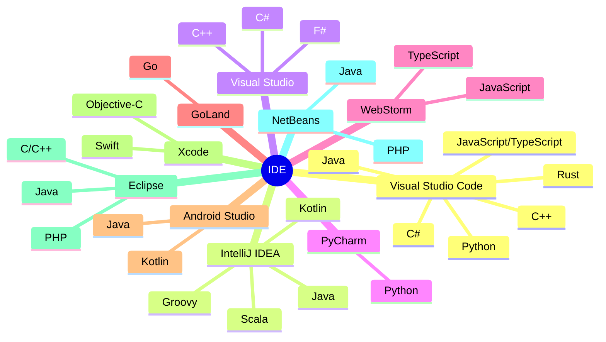
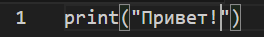
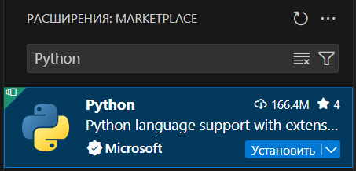
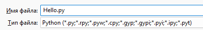
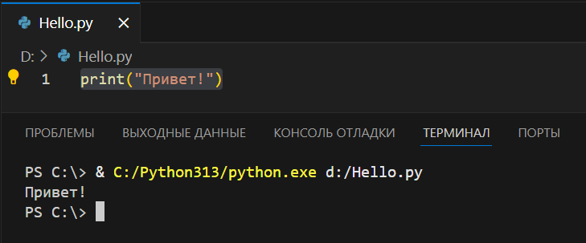
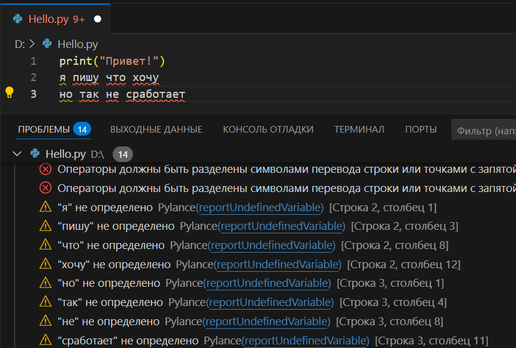
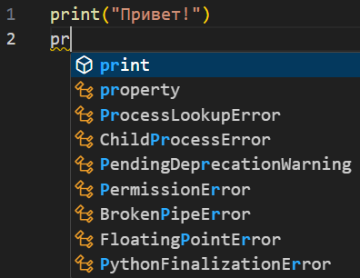
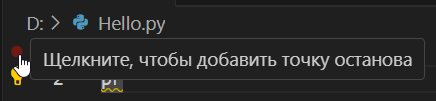

---
title: 4.04. Проект и фреймворки
---

# 4.04. Проект и фреймворки

<div class="article-tags">
  <span class="tag tag-required">ОБЯЗАТЕЛЬНО</span>
  <span class="tag tag-beginner">ДЛЯ НОВИЧКОВ</span>
  <span class="tag tag-advanced">НЕ ДЛЯ НОВИЧКОВ</span>
  <span class="tag tag-inprogress">В РАЗРАБОТКЕ</span>
</div>
<span class="complexity-badge">Разработчику</span>
<span class="complexity-badge">Аналитику</span>
<span class="complexity-badge">Тестировщику</span>  
<span class="complexity-badge">Архитектору</span>
<span class="complexity-badge">Инженеру</span>



---

## Фреймворк и IDE

Когда создают программы, их не пишут в простом текстовом редакторе - так можно создать лишь скрипт или что-то простое. Для серьёзного проекта используются надёжные и мощные инструменты, среди которых выделяются два основных - фреймворки и IDE. Фреймворки служат фундаментом, а IDE - мастерской.

★ **Фреймворк** – структурный каркас, предоставляющий базовые элементы и правила для создания системы или приложения. Это «скелет» программы, который задаёт правила, готовый набор правил и инструментов, чтобы не писать код с нуля. Как конструктор – нам не придётся лепить и создавать блоки, а мы будем собирать модель из готовых блоков, которые кто-то старательно для нас уже подготовил. И именно «комплект» таких блоков и есть фреймворк.

Примеры популярных фреймворков:
	- Веб-разработка: React (JavaScript), Django (Python), Ruby on Rails;
	- Мобильные приложения: Android Jetpack (Kotlin);
	- Игры: Unity (C#), Godot (GDScript).

Такие фреймворки часто включают в себя набор функций и инструментов – библиотек – готовых решений для типовых задач. Допустим, нужно поработать с XML – не обязательно с нуля писать логику обработки, достаточно подключить к своему проекту в IDE соответствующую библиотеку с готовым решением.

---

★ **Интегрированная среда разработки (IDE, Integrated Development Environment)** – программа, где пишут, тестируют и запускают код. Как для писателя Word продвинутый и эффективный, так же IDE для программиста – ошибки подсвечиваются, слова дополняются, а также в комплекте идёт отладчик ошибок. Словом, это удобный редактор кода, где программисты его и пишут. 

<div class="callout callout--tip">
  <div class="callout-title">Внимание</div>
Приготовьтесь!
Страшные слова	
Это важнейшая тема – IDE. Здесь мы научимся работать с редакторами кода, которые будут облегчать нам жизнь.
</div>


Любому новичку следует начать с VS Code – самая простая IDE, с первого взгляда неотличима по сложности от блокнота, да и к тому же автоматически определит язык, и не возьмёт ни копейки. При запуске можно сразу установить себе расширения для нужных языков – к примеру, HTML, CSS, JavaScript, Python, C#, Java.

<div class="callout callout--tip">
  <div class="callout-title">Практическое задание</div>
Выполните нижеследующее задание.
</div>

---

★ Давайте научимся основам.

Пример работы:

1. Запускаем VS Code и создаём новый файл (Файл – Создать файл, или Создать текстовый файл):


---

2. Пишем `print("Привет!")` и видим, что это просто текст:



---


3. Если установить расширение, которое подсвечивает и распознаёт синтаксис Python, к примеру одноимённое (к слову, устанавливаются они через Marketplace путём простого поиска в самом VS Code):



---

4. То мы увидим, как синтаксис подсветился, обозначив ключевые слова особым цветом:


---

5. А если сохранить файл, к примеру в нашем случае как «Hello.py»



---


И нажать на «Запуск и отладка» - то мы увидим в нижней части окна, что программа запустилась и вывела «Привет!» - мы выполнили команду «print», которая вывела текст в кавычках.



---

К слову, можете себе сохранить чит-лист VS Code:
https://cheatsheets.zip/vscode

Так и работает IDE. Человек пишет код и может сразу проверить, работает ли он. Этот принцип работает на всех языках и во всех IDE. Можно писать где-нибудь ещё, в блокноте, на каких-то веб-страницах или Notepad++, а потом вставить код в IDE и сразу увидеть подсветку ошибок.

Говоря об ошибках, если мы вдруг начали писать с ошибками синтаксиса, допустим написав «непонятные» программе слова, то сразу увидим список проблем в нижней части консоли – IDE заботливо подскажет, на какой строчке есть ошибка, и что именно ей «не нравится». Пока ошибки не будут устранены, код не запустится.



---

★ **Подсветка синтаксиса** – это цветовой «гид» по коду, который выполняет:

	- лексический анализ – разбивает код на «токены» - ключевые слова, переменные, строки;
	- парсинг – проверку структуры на наличие элементов (допустим, закрыты ли блоки кода или иные элементы);
	- выполняется «раскраска» в соответствии с темой (обычно есть светлая и тёмная тема);
	
★ **Автодополнение** – следующая функция IDE, которая определяет, внутри какого объекта вы находитесь (допустим, класс User), просматривает стандартные библиотеки, импортированные модули и ваши переменные, ранжирует их и отображает часто используемые варианты первыми. Допустим, мы лишь начнём печатать –«pr» и уже увидим предлагаемые варианты, нам не обязательно писать всё полностью, можем просто выбрать из списка:



★ **Отладчик** – своего рода «детектив» для ошибок, который помогает вам выяснить, почему код не работает, или почему работает не так, как хочется. Как это работает:

---

1. Точки останова (не остановки, а именно точка останова – breakpoint) – вы отмечаете нужную строку в крайней точке слева:



---

2. После выбора строки, точка будет отмечена, и выполнение остановится перед указанной строкой. К примеру, у вас в коде 100 строк, и вы знаете, что первые 30 работают как нужно, и ставите точку на 31-й строке, и таким образом, отслеживаете путь выполнение от 31-й до конца.

---

3. Отладка происходит путём выполнения программы «шаг за шагом» (Step By Step):
	- Step Over – переход к следующей строке;
	- Step Into – заход в функцию (внутрь);
	- Step Out – выход из функции (наружу).

---

4. Инспекция переменных – если вы объявляли переменные и как-то в логике задавали им значение, то программа это выведет в консоли отладки, показав текущие значения переменных, допустим, что x=5.

---

Также в IDE имеется встроенная интеграция с Git, которая обеспечивает контроль версий, отслеживая изменения, отмечая новые, измененные и удалённые файлы, показывая разницу между версиями и даже позволяя выполнять команды Git в интерфейсе, НО мы ещё не дошли до контроля версий – об этом мы поговорим позже.

Таким образом,
	- вы пишете код → подсветка помогает видеть структуру;
	- набираете user. → автодополнение предлагает user.name;
	- запускаете отладку → отладчик ловит ошибку в user.name;
	- фиксируете исправление в Git.

---

## Проект и его особенности

★ **Проект (Project)** – один программный модуль с конкретной задачей. Например, веб-сервер или мобильное приложение. У проекта есть определённая структура, характерная для фреймворка и языка программирования, но в целом, можно назвать это набором файлов, содержащих исходный код до компиляции, и набор исполняемых файлов после компиляции. Проект, его структура и настройки сохраняются в единый файл проекта, описывающий, что должно быть собрано, какие зависимости есть, какие платформы поддерживаются и т.д. Формат зависит от языка и платформы - .csproj (C#), .xcodeproj (Swift), .iml (Java), .idea, setup.py и другие.

---

★ **Решение (Solution)** – набор связанных проектов для масштабных систем, к примеру, решение «Интернет-магазин» будет включать в себя и мобильное приложение, и фронтенд, и бэкенд. В Visual Studio, например, решение объединяется в файл .sln, а в IntelliJ IDEA в одном workplace (рабочем месте). Можно сказать, что решение представляет собой контейнер, в котором могут находиться один или несколько проектов. Решение хранит ссылки на проекты и настройки сборки для всех этих проектов.

Отдельные файлы (.cs, .java, .py, .js и другие) представляют собой исходные файлы программы, написанные на конкретном языке программирования. Их тоже можно открыть в IDE, но они будут работать без контекста проекта, к примеру, если есть связь с другими файлами, то могут вывестись ошибки. Для отдельных файлов нет поддержки автосборки, отладки, поэтому открывать их без проекта можно разве что для быстрого просмотра или тестирования фрагментов кода.

Папка с исходным кодом представляет собой обычный каталог, содержащий исходные файлы проекта, но без файла решения или проекта. Часто встречается в проектах на таких языках, где нет строгой структуры проекта (например, Python, Node.js, Go). Многие IDE (например, VS Code) умеют открывать папку как рабочую область и автоматически определять тип проекта по наличию файлов, например package.json - Node.js.

---

★ **Библиотека** – готовый код для решения задач. Например, утилита для выполнения какой-то задачи, или набор функций, классов и методов, которые уже подготовлены, и в процессе написания кода мы просто будем вызывать их. Допустим, нам не придётся «объяснять» программе через код, что мы хотим сделать – автор библиотеки уже сделал это за нас, а мы просто скажем «открой библиотеку и сам разберись как это делать». Если команда в библиотеке, и библиотека подключена к проекту, то подсветка и автодополнение будут даже подсказывать при написании кода, использую имеющуюся информацию.

Инструментальная библиотека - как раз такой набор взаимосвязанных, повторно используемых классов, собранный и спроектированный с целью предоставления полезной функциональности общего назначения. Проект может включать в себя множество таких библиотек.

Но, чтобы такой набор заработал, библиотеки всегда нужно подключать к коду. Для этого нужно установить компоненты, встроить в проект, и в каждом файле с кодом, в самом начале говорить «import» или «using» в зависимости от языка. У каждого языка бывают встроенные возможности и инструменты – стандартные библиотеки. К примеру, это математические операции, ввод/вывод - их отдельно устанавливать не нужно.

Таким образом, мы получаем файлы с кодом, ресурсы, и библиотеки, которые собираются в проект (решение). Проект после сборки становится готовой программой.

И писать код с нуля – это словно изобретение бумаги, чернил, печатного станка для написания книги - гораздо эффективнее использовать готовые решения, то есть - библиотеки.

Стандартные библиотеки включены в язык, к примеру, math, os в Python, или Array, Date в JavaScript. Это базовые инструменты в мастерской по подготовке кода. Открывая IDE, мы сможем работать с ними без дополнительных загрузок.

Пользовательские библиотеки, или сторонние, это то, что написано другими разработчиками и выложено в открытый доступ. Построение приложения при помощи библиотек напоминает модульную сборку мебели в IKEA - каждый лепит своего франкенштейна. Допустим, мы хотим добавить обработку Excel-файлов? Ищем библиотеку, и подключаем к проекту.

---

**Как библиотеки попадают в проект?**

1. Установка пакетов (менеджеры зависимостей). Вместо ручного скачивания файлов, разработчики используют менеджеры пакетов, к примеру, NuGet в C#, npm в JavaScript. Эти инструменты автоматически скачивают библиотеку и все её зависимости (другие библиотеки, которые нужны для работы).

Геймеры могут сразу увидеть аналогию с модификациями - когда хотим установить, к примеру, модификации к видеоигре, мы устанавливаем менеджер модов, через который скачиваем и устанавливаем моды. Здесь так же, но игра - наш проект, а моды - библиотеки и пакеты.

2. CDN - загрузка прямо из сети. Особенно популярно в веб-разработке - вместо того, чтобы хранить библиотеку у себя (ведь, скачивая, мы храним у себя?), можно подключить её по ссылке:

```html
<script src="https://code.jquery.com/jquery-3.6.0.min.js"></script>
```

При таком решении, файлы кэшируются браузером, однако требуют соединения и работоспособности ссылки.

Таким образом,
	- разработчик создаёт каталог (папку) решения или проекта;
	- разработчик пишет код, подключает необходимые библиотеки;
	- сборщик (компилятор/интерпретатор) берёт все файлы и зависимости, проверяет их и создаёт исполняемый файл (или интерпретирует, как в JavaScript);
	- готово - программа работает.

---

## Сборка, публикация, компиляторы и интерпретаторы в IDE

★ **Компилятор** – программа, преобразующая исходный код в машинный код, понятный компьютеру. В IDE компилятор работает тогда, когда мы нажимаем на команду Сборка (Build) – в этот момент создаётся исполняемый файл, а IDE показывает ошибки, если они есть. Горячая клавиша, к примеру, Ctrl+Shift+B. Такой подход можно увидеть в языках C, C#, C++, Java, Go.

---

★ **Интерпретатор** – программа, выполняющая исходный код построчно и без предварительной компиляции. В IDE для этого выполняется команда Запуск (Run), где интерпретатор читает файл и сразу выполняет, а ошибки выводятся в консоли по мере возникновения. Горячая клавиша, к примеру, F5. Такой подход в языках Python, JavaScript, Ruby.

---

★ **Сборка** – процесс преобразования исходного кода в исполняемый файл или пакет. Сборки бывают двух типов:
	- Debug – с отладочной информацией – медленная, и нужна для разбора ошибок;
	- Release – оптимизированная версия, без отладочных данных.
	
Сборка проходит несколько этапов:
	- препроцессинг;
	- компиляция в файлы;
	- линковка (объединение в один исполняемый файл).
	
Именно так и рождается программа – тот самый «exe» в Windows, к примеру.

---

★ **Публикация** – процесс размещения программы на сервере или в магазине приложений. Публикация может быть нескольких вариантов:
	- Веб-публикация – Docker-контейнеры, статические файлы (актуально для HTML/JS);
	- Мобильное приложение – APK для Android, IPA для iOS;
	- Десктопное приложение – EXE для Windows, DMG для macOS, DEB/RPM для Linux.
	
Под магазинами подразумеваем Google Play, App Store, Steam.

---

### Что важно знать перед компиляцией и публикацией

	- *зависимости* – нужно убедиться, что все библиотеки установлены и проверить версии;
	- *конфигурация* – убедиться в корректности настроек баз данных, API, файлов с переменными окружения и прочих параметров;
	- *безопасность* – убрать все секретные и конфиденциальные данные – логины/пароли, ключи – из кода, при надобности можно использовать указание служебных файлов в .gitignore, чтобы не публиковать их в Git;
	- *тестирование* – нужно проверить и отладить работу программы, провести юнит-тесты и интеграционные тесты, в зависимости от проекта.

---

### Что важно знать при работе с IDE

	- *настройка окружения* – в PyCharm настроить интерпретаторы, в VS настроить компиляторы (по умолчанию они настроены, но лучше проверить), в Build/Run проверить конфигурации;
	- *интеграция с инструментами* – можно клонировать репозиторий прямо из IDE, и сравнивать изменения, а для работы с базами данных есть встроенные клиенты и генерация SQL-запросов;
	- *отладка и профилирование* – важно проводить корректную отладку, изучать ошибки и стараться не игнорировать предупреждения;
	- *использовать поиск по проекту* (Ctrl+Shift+F) для нахождения нужных частей кода;
	- *обращать внимание на подсказки и использовать переход к определению* (Ctrl+ЛКМ по элементу);
	- *в случае тормозов отключать лишние плагины*;
	- *стараться изначально настроить для себя комфортный интерфейс* – настройка рабочего места важнее, чем кажется.

---

## Виды и особенности IDE

1. **Visual Studio Code (VS Code)** – Python, JavaScript, TypeScript, C++, Go, Rust, Java и прочие языки – можно установить плагин из маркетплейса и работать с большинством языков. Молниеносный запуск, работа на слабых ПК, поддержка Git.

Официальный сайт - https://code.visualstudio.com/

Чит-лист - https://cheatsheets.zip/vscode

2. **IntelliJ IDEA (JetBrains)** – Java, Kotlin, Scala, Groovy. Мощная и серьёзная IDE, умный рефакторинг, навигация по коду, поддержка микросервисов и Spring.

Официальный сайт - https://www.jetbrains.com/idea/

Чит-лист - https://cheatsheets.zip/idea

3. **Visual Studio** (важно – не путать с Visual Studio Code) – мощнейшая IDE для .NET с отличным отладчиком, поддержкой Git, инструментами для разработки на множество вариаций и шаблонов для языков .NET – C#, C++. F#. 

Официальный сайт - https://visualstudio.microsoft.com/ru/


4. **NetBeans** – Java, PHP, C/C++. Полностью бесплатная, есть неплохой визуальный редактор, но считается устаревшей.

Официальный сайт - https://netbeans.apache.org/front/main/index.html

5. **PyCharm** – Python. Многие научные инструменты в платной версии, но есть автодополнение, подсказки, интеграция с Docker, неплохой визуальный отладчик.

Официальный сайт - https://www.jetbrains.com/pycharm/

6. **Eclipse** – Java, C/C++, PHP, и даже Fortran (!). Полная кастомизация, поддержка легаси-проектов, плагины для моделирования, но старый интерфейс.

Официальный сайт - https://eclipseide.org/

7. **Xcode** – IDE для macOS, для Swift, Objective-C, C++. Визуальный конструктор, профилировщик памяти, инструменты для дополненной реальности.

Официальный сайт - https://developer.apple.com/xcode/

8. **Android Studio** – эмулятор устройств с настройкой любых разрешений, поддержка Kotlin, Java, C++, но довольно ресурсопотребляющий.
Официальный сайт - https://developer.android.com/studio

Чит-лист - https://cheatsheets.zip/android-studio

9. **GoLand** – для Go. Автоимпорт пакетов при наборе кода, хороший отладчик, и нет бесплатной версии.

Официальный сайт - https://www.jetbrains.com/go/

10. **WebStorm** – JavaScript, TypeScript, CSS. Дорогая подписка, но интеллектуальное автодополнение для React/Vue, встроенный REST-клиент для тестирования API, анализ зависимостей.

Официальный сайт - https://www.jetbrains.com/webstorm/

Чит-лист - https://cheatsheets.zip/webstorm

Существует и много других IDE, и вышеуказанный список не является «топом» - дело привычки, вкуса – кому-то удобно работать в NetBeans, а кому-то в IDEA. Для начинающих лучше пробовать скрипты в VS Code, а потом пощупать NetBeans и Visual Studio, PyCharm, WebStorm или GoLand, зависит от языка, на котором фокусируется разработчик, по мере специализации.

Важно. Для комфортной разработки лучше запастись оперативной памятью и значительным местом на диске. Желательно использовать SSD и 32 ГБ ОЗУ. В противном случае, при мощных экспериментах можно сталкиваться с вылетами или зависаниями. А вылететь, не сохранив работу – всегда больно.

<div class="callout callout--tip">
  <div class="callout-title">Практическое задание</div>
Если вы планируете учиться всем языкам по этой книге, можете заранее установить все эти IDE
 (ну, кроме Xcode, если у вас нет под рукой macOS).
</div>


