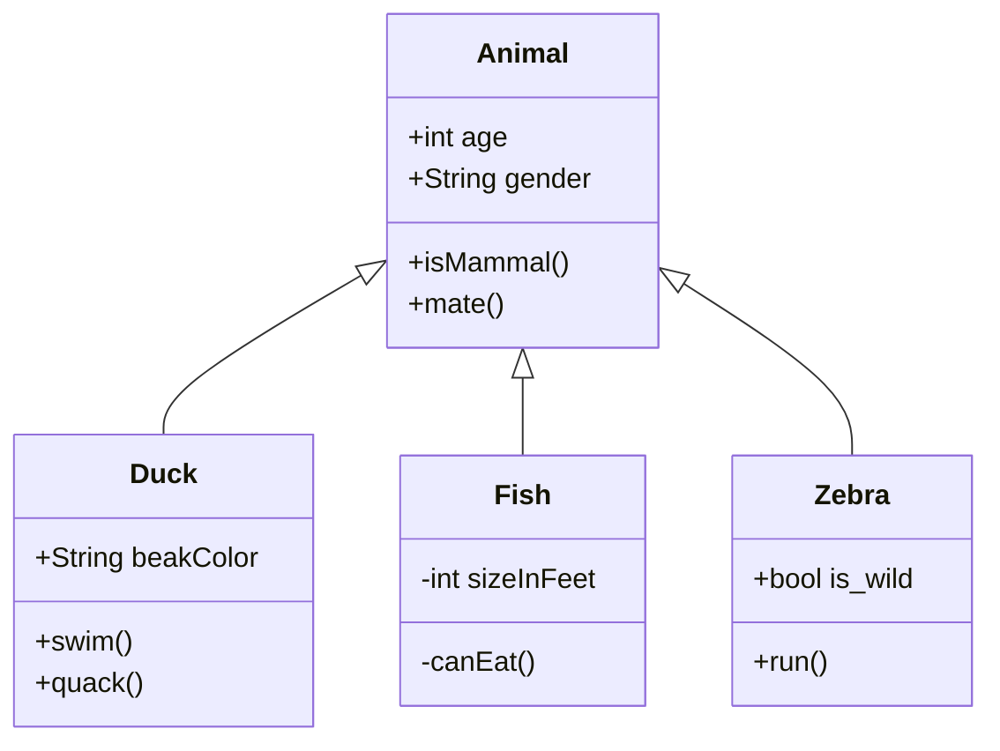
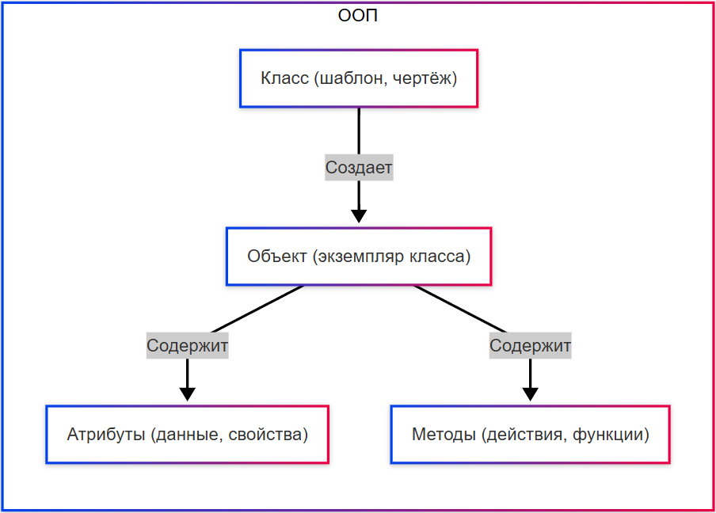
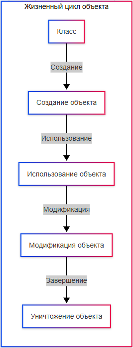

---
title: Объектно-ориентированное программирование
tags: [beginner, advanced, required, engineer, developer, architector]
---

# Объектно-ориентированное программирование

<div class="article-tags">
  <span class="tag tag-required">ОБЯЗАТЕЛЬНО</span>
  <span class="tag tag-beginner">ДЛЯ НОВИЧКОВ</span>
  <span class="tag tag-advanced">НЕ ДЛЯ НОВИЧКОВ</span>
  <span class="tag tag-inprogress">В РАЗРАБОТКЕ</span>
</div>
<span class="complexity-badge">Разработчику</span>
<span class="complexity-badge">Аналитику</span>
<span class="complexity-badge">Тестировщику</span>  
<span class="complexity-badge">Архитектору</span>
<span class="complexity-badge">Инженеру</span>

## Объектно-ориентированное программирование

### Схема

Давайте начнём с популярной схемы.



Что мы видим здесь?

Animal - животное. Duck - утка, Fish - рыба, Zebra - зебра. Что их всех объединяет? Они все являются животными, представителями какого-то единого царства. Принадлежность к "царству" определяется рядом свойств. Объектно-ориентированное программирование строится как раз на основе определения всего вокруг как объектов со своими свойствами.

<div class="callout callout--tip">
  <div class="callout-title">Интересный факт</div>
Первый объектно-ориентированный язык – Simula 67 – был создан для моделирования судов в порту, поэтому ООП началось с контейнеров, очередей и имитации движения кораблей.
</div>

---

### Как работает ООП?

Код в ООП - совокупность классов, содержащих в себе определённые элементы, и объектов, которые создаются на основе этих классов словно машины по чертежу, где класс — это кодовый шаблон, а объект — это данные по этому шаблону. Это позволяет делать большой, структурированный код, распределённый в определённой архитектуре проекта, где каждый класс может содержать определённую логику, и каждому объекту будет выделена отдельная часть памяти.



---

### Что такое класс?

Порой нам нужно создать не просто переменную, а какой-то набор данных, к примеру, пользователя.

У пользователя может быть имя, возраст, город. И каждый пользователь имеет свои данные. Вася родился в Уфе, Саша в Москве. Но при этом и тот и другой обладают общими чертами, и для создания базового шаблона используется класс.

**Класс** - некий блок кода, который выступает в качестве структуры для постройки объектов. Это чертёж, шаблон, который описывает, какими свойствами и действиями должен обладать объект. Класс определяет структуру данных (атрибуты) и поведение (методы), которые будут у всех объектов, созданных на его основе.

Пример на Python:

```python

class User:
	name = ""
	city = ""
	age = 0

```

Это просто пустой шаблон, с ячейками для данных. В дальнейшем можно создать экземпляры класса:

```python

vasya = User()
vasya.name = "Вася"
vasya.city = "Уфа"
vasya.age = 25

sasha = User()
sasha.name = "Саша"
sasha.city = "Москва"
sasha.age = 30

```

Фишка в том, что и `vasya` и `sasha` имеют свои индивидуальные области в памяти, со своими собственными характеристиками. Это и есть основной смысл классов.

То есть, внутри класса можно объявлять переменные (такие переменные будут называться атрибутами, свойствами и полями), а также определять функции (такие функции называются методами).

Класс — это описание возможностей и характеристик. Он существует в коде, но не занимает память под данные.
  
Объект — это конкретное воплощение этого описания в оперативной памяти. Каждый объект имеет:
- собственный набор значений атрибутов;
- доступ ко всем методам своего класса;
- уникальный адрес в памяти (даже если значения атрибутов совпадают с другим объектом).

Два объекта одного класса — это две независимые сущности, даже если они выглядят одинаково.


**★ Какими бывают классы?**

1. **Обычный класс** – базовая структура с полями и методами:
```java
class Car {
    String model;
    void drive() { ... }
}
```

---

2. **Абстрактный класс** – его экземпляр создать нельзя, только унаследовать (позже мы ещё поговорим об этом):
```java
abstract class Animal {
    abstract void makeSound();
}
```

---

3. **Статический класс** (в некоторых языках, например, C#) – нельзя создать экземпляр, все методы/поля статические:
```csharp
static class MathUtils {
    public static int Add(int a, int b) => a + b;
}
```

Статические члены используют ключевые слова static. Их можно вызывать с помощью имени класса.


---

4. **Интерфейс** – контракт, который класс обязуется выполнить (реализовать его методы), то есть в интерфейсе ещё не понятно, что делает метод, но в классе, который создаётся по интерфейсу, должна быть реализация метода:
```java
interface Flyable {
    void fly();
}

class Bird implements Flyable {
    public void fly() { System.out.println("Летит!"); }
}
```

Мы уже упомянули некие экземпляры класса - те самые `vasya` и `sasha`. Это - объекты.

---

### Что такое объект?

**Что же такое объект?** Это конкретный экземпляр класса. Если класс — это чертёж, то объект — это реальная вещь, созданная по этому чертежу. У каждого объекта есть свои уникальные значения данных.

---

★ **Объект** – единица, сочетающая в себе данные (атрибуты) и действия (методы), которые могут быть выполнены с этими данными. Объект - экземпляр класса, который:
	- хранит данные (атрибуты, свойства);
	- выполняет действия (методы).

В функциональных ООП-языках (например, Scala) объекты могут быть преимущественно данными, а поведение — внешними функциями. В JavaScript объекты — это просто коллекции свойств, и «методы» — это функции, присвоенные свойствам. Но это уже специфические особенности языков.

---

Часто новичку при объяснении приводят в пример кота. Да и ранее мы уже упоминали во введении. Представим себе кота, и разберём его как объект:
	- Атрибуты (данные): имя, возраст, цвет.
	- Методы (действия): мурлыкать(), царапать().

---

Если бы мы писали код, мы бы представили кота так:
```
класс Кот {
  атрибут имя;
  атрибут возраст;
  атрибут цвет;

  метод мяукать() {
    сказать("Мяу!");
  }
  метод царапать() {
    //логика царапания
  }
}
```

Но, как мы заметили, у этого кота есть просто атрибуты и методы, но нет конкретики – как его зовут, сколько ему лет, какой у него цвет. Это потому, что мы создали класс – шаблон для создания объекта. То есть, это некий «чертёж» кота. Сам по себе класс – просто код. Но когда мы создаём объект, мы:
	- выделяем блок памяти под его данные (атрибуты);
	- записываем тип объекта (чтобы программа понимала, какие методы можно вызывать).

---

**Объект** – экземпляр класса, реальный «кот», созданный по шаблону:
```
Кот мойКотяра = new Кот("Барсик", 3, "рыжий");
```

При этом мы создали нового рыжего трёхлетнего кота, назвав его «Барсик» - мы заполнили данными его атрибуты, благодаря чему в оперативной памяти выделился блок, в котором физически появился этот объект. Теперь объект зовут «мойКотяра», потому что, когда мы создавали объект, мы его так назвали. Конечно, мы его писали в стиле C#, но смысл похож во всех ООП-языках. В нашем случае:
	- new – выделяет память;
	- Кот – указывает тип (класс, словно шаблон);
	- мойКотяра – ссылка на объект в памяти.

---

А теперь давайте подумаем, а зачем мы это сделали? У нас имеется в распоряжении мойКотяра, трёхлетний рыжий кот Барсик, который умеет царапать и мяукать. Представим. что в дальнейшем, в коде, нам пригодилась помощь Барсика:
```
если (время = 5:00) {
  мойКотяра.мяукать();
}
```

Поскольку у нашего кота есть метод мяукать(), мы можем его попросить мяукнуть. В данном случае, кот-помощник послушно выполнит мяукать() если время будет равно 5 утра, и, поскольку метод мяукать() содержит действие сказать("Мяу!"), то он и скажет «Мяу». А «сказать()» - тоже метод, который определён в каком-то другом классе, стандартном.

---

Другой пример – класс:
```
public class Car {  
    String model;  // атрибут  
    int year;      // атрибут  

    void drive() {  // метод  
        System.out.println("Врум-врум!");  
    }  
}  
```
объект:
```
Car myCar = new Car();  
myCar.model = "Toyota";  
myCar.drive();  
```

---

Таким образом, благодаря объектам, имеется возможность группировки логики в классы. Классы могут быть любыми, это лишь инструмент, который позволяет красиво структурировать свой код.

```
КЛАСС: Car
│
├── ПОЛЯ (атрибуты, состояние):
│   - model: String
│   - year: int
│   - color: String
│
├── МЕТОДЫ (поведение):
│   + startEngine()
│   + stopEngine()
│   + accelerate(speed: double)
│
└── ОБЪЕКТЫ (экземпляры):
    - Car { model="Toyota", year=2020, color="Silver" }
    - Car { model="BMW", year=2025, color="Black" }
```


---

## Атрибуты


★ **Атрибуты (или поля)** — это переменные, которые хранят данные объекта. Они описывают состояние объекта. Для класса «Автомобиль» мы бы определили атрибуты «модель», «год», «цвет».

---

### Поля

★ **Поля** представляют собой «сырые» данные, которые могут быть доступны напрямую или через специальные механизмы. Они не содержат сами по себе никакой дополнительной логики для чтения или записи данных.


```
class Автомобиль {
    string model;  // Поле
    int year;      // Поле
}
```

Здесь model и year — это поля класса. К ним можно обращаться через точку «объект.поле»:

```
Автомобиль car = new Автомобиль();
car.model = "Toyota";  // Прямое изменение поля
car.year = 2020;       // Прямое изменение поля
```

---

### Свойства

★ **Свойства** — это механизм доступа к атрибутам объекта. Они позволяют контролировать, как данные читаются или изменяются. Свойства часто используются для защиты данных от некорректных значений.

Свойства предоставляют интерфейс для работы с полями, но сами поля остаются скрытыми. Внутри свойств можно добавить проверки, вычисления и другие действия при чтении или записи данных. Свойства помогают скрыть внутреннюю реализацию объекта и защитить данные от некорректного использования. Пример:
```csharp
class Автомобиль {
    private string _model;  // Приватное поле
    private int _year;      // Приватное поле

    public string Model {   // Свойство для поля _model
        get { return _model; }
        set {
            if (value == "") {
                throw new Exception("Модель не может быть пустой!");
            }
            _model = value;
        }
    }

    public int Year {       // Свойство для поля _year
        get { return _year; }
        set {
            if (value < 1900) {
                throw new Exception("Год выпуска не может быть меньше 1900!");
            }
            _year = value;
        }
    }
}
```

Здесь `_model` и `_year` — это приватные поля, которые хранят данные, а Model и Year — это свойства, которые управляют доступом к этим полям.

Использование аналогично, но свойство будет с проверкой:
```
Автомобиль car = new Автомобиль();
car.Model = "Toyota";  // Установка значения через свойство
car.Year = 2020;       // Установка значения через свойство

// Если попробовать установить некорректное значение:
car.Year = 1800;       // Выбросится исключение: "Год выпуска не может быть меньше 1900!"
```

Добавление символа подчёркивания (_) в начале имён полей — это соглашение об именовании, которое используется для различения приватных полей и свойств. Если бы имена полей и свойств совпадали, это могло бы вызвать путаницу, например:
```
private string model; // Поле
public string Model { get; set; } // Свойство
```
Здесь model и Model отличаются только регистром, что может быть непонятно или запутанно.

Чтобы избежать этой путаницы, к именам полей добавляют префикс _. Например:
```
private string _model; // Поле
public string Model { get; set; } // Свойство
```

---

Многие языки программирования (C#, Java) имеют соглашения об именовании, которые рекомендуют использовать префиксы для приватных полей. 

---


Различия между полями и свойствами:

| Характеристика | Поля | Свойства |
| :--- | :---: | ---: |
|Понятие	|Простые переменные	|Механизм управления доступом
|Доступ	|Прямой доступ к данным	|Косвенный доступ через методы get и set
|Логика	|Нет дополнительной логики	|Можно добавить проверки, вычисления и т.д.
|Инкапсуляция	|Не защищают данные	|Защищают данные, скрывая их от прямого доступа
|Использование	|Просто хранят данные	|Управляют доступом к данным
|Пример	|`int year;`	|`public int Year { get; set; }`

> 💡 **Важно**: термин «свойство» (property) имеет разный смысл в разных языках.
>
> - В **C#** — это встроенная языковая конструкция с `get`/`set`.
> - В **Python** — свойства создаются с помощью декоратора `@property`.
> - В **Java** — официального понятия «свойство» нет; вместо него используют пары методов `getAge()` / `setAge()`, что называют «геттерами и сеттерами».
>
> Концептуально все три подхода решают одну задачу — контролировать доступ к данным. Но синтаксис и механизмы различаются.

Пример для Python:

```Python
class Автомобиль:
    def __init__(self):
        self._model = ""
        self._year = 0

    @property
    def model(self):
        return self._model

    @model.setter
    def model(self, value):
        if not value:
            raise ValueError("Модель не может быть пустой!")
        self._model = value
```

О том, что такое инкапсуляция, мы поговорим отдельно. Сейчас важно понять, что в отличие от полей, свойства предоставляют гибкость и контроль над данными.

---

## Методы

### Что такое метод?

★ **Методы** — это функции, которые описывают действия, которые может выполнять объект. Они определяют поведение объекта. Для класса «Автомобиль» мы бы добавили методы «завестиДвигатель()», «начатьДвижение()», «остановиться()».

Так, если класс является шаблоном или чертежом, по которому создаются объекты, определяя, какие поля (состояние) будут у объекта, какие методы (поведение) он может выполнить, но сам по себе класс лишь описание, а объект - уже существующие данные, то нужно как-то провести инициализацию.

За инициализацию отвечает конструктор.

---

### Конструктор

★ **Конструктор** — это специальный метод, который вызывается автоматически при создании нового объекта. Конструктор — это особый тип функциональных членов класса, который имеет то же имя, что и класс. Он автоматически вызывается всякий раз, когда создается новый экземпляр объекта класса, и этот процесс также вызывает элементы данных класса. Это может включать передачу параметров в конструктор класса, если он параметризован. Конструктор для «Автомобиля» выглядел бы так:
```
Автомобиль myCar = new Автомобиль("Toyota", 2020, "синий");
```

И здесь «new Автомобиль» - конструктор. Он принимает три параметра - "Toyota", 2020, "синий", они и устанавливаются как начальные значения атрибутов объекта.

Конструктор инициализирует состояние объекта (данные класса), обеспечивает контроль над тем, как создаются экземпляры класса и может быть использован для установки начальных значений полей объекта через параметры.


Во многих ООП-языках принято соглашение о том, что конструктор называется так же, как и класс. Если класс Cat, то и конструктор будет Cat().
Помню, мой мозг взрывало по началу обучение ООП в стиле примеров:
```
Cat cat = new Cat()
```
Представьте, каково новичку без разжёвывания понимать, что это вообще такое и почему тут целых три повторения одного и того же слова Cat?

И почему есть Cat с большой буквы, cat с маленькой, и Cat со скобками?

Если же писать это в IDE, будет немного понятнее:
```java
Cat cat = new Cat();
```
	- Cat - название класса (как раз шаблон);
	- cat - название переменной (область памяти, куда мы «засунем» объект);
	- new - ключевое слово для инициализации конструктора;
	- Cat() - метод-конструктор, который имеется в классе Cat и позволяет создавать объекты по шаблону.

Такое вот соглашение. Называя так же, как класс, мы показываем, что это часть класса, что он связан с процессом создания объекта и это не просто обычный метод. Такой подход делает код более понятным и предсказуемым.

Конструктор нужен для выделения памяти под объект, инициализации полей и свойств, настройки начального состояния объекта, выполнения обязательной логики перед началом использования объекта. Без конструктора объект можно создать, но он будет иметь неопределённое или неполное состояние. Однако, если вы не напишете конструктор самостоятельно, то компилятор/интерпретатор может создать его автоматически (конструктор по умолчанию, без параметров). Если нужно установить начальные значения полей, то конструктор лучше добавить. Если же объект простой и не требует инициализации, можно обойтись без явного конструктора.

Конструктор принимает те же данные, которые нужны для инициализации полей. Если у класса есть поля name, age, то конструктор часто принимает эти же значения. Это не обязательно, можно принимать меньше или больше значений, а можно и вовсе ничего не принимать. Конструкторов может быть и несколько, это называется перегрузкой конструкторов:
	- constructor() → создает объект с дефолтными значениями
	- constructor(name) → задаёт имя
	- constructor(name, age) → задаёт имя и возраст

Это удобно, когда объект может быть создан разными способами.

Если же имеется наследование, то сначала вызывается конструктор родительского класса, затем дочернего. Это гарантирует, что объект будет правильно инициализирован «снизу вверх».

Конструктор, иными словами, это то, что превращает класс в объект. Он обеспечивает корректную инициализацию, позволяет задать начальное состояние и сделать объект готовым к использованию.

---

Конструкторы бывают некоторых видов.

1. **Конструктор по умолчанию (Default Constructor)** - без параметров, инициализирует объект со значениями по умолчанию. Используется, если программист не определил ни одного конструктора, многие языки (например, Java, C#) автоматически создают конструктор по умолчанию; а если же определён хотя бы один конструктор, автоматический конструктор по умолчанию не создаётся, и его нужно добавлять вручную, если он нужен. Это нужно, чтобы можно было создавать объекты без передачи параметров, особенно при работе с коллекциями, сериализацией или фреймворками.

---

2. **Параметризованный конструктор (Parameterized Constructor)**, принимающий один или несколько параметров для инициализации полей объекта конкретными значениями. Используется, когда важно создать объект в полностью инициализированном состоянии, с заданными данными. Это позволяет контролировать начальное состояние объекта и избегать «полуинициализированных» экземпляров. Если у объекта Person есть name и age, то при создании экземпляра нужно передавать name и age.

---

3. **Конструктор копирования (Copy Constructor)** создаёт новый объект как копию существующего объекта того же класса. Используется при необходимости создать независимую копию объекта, чтобы избежать ситуации, когда несколько переменных ссылаются на один и тот же объект (что может привести к нежелательным изменениям).

Важно понимать, что конструктор копирования — это соглашение, а не встроенная языковая функция во многих ООП-языках. Он представляет собой обычный конструктор, принимающий объект того же типа и инициализирующий новый объект на основе его данных.

Пример на Java (ручная реализация):

```java
public class Person {
    private String name;
    private int age;

    // Обычный конструктор
    public Person(String name, int age) {
        this.name = name;
        this.age = age;
    }

    // Конструктор копирования
    public Person(Person other) {
        this.name = other.name;
        this.age = other.age;
    }
}
```

В языках вроде C++ конструктор копирования имеет специальный синтаксис и вызывается автоматически в определённых ситуациях. В Java и C# его нужно вызывать явно.

Такой подход позволяет создавать независимые копии, особенно важные при работе с изменяемыми данными.


---

**Поверхностная копия** — копируются только значения полей. Если поля — ссылки на объекты, копируется ссылка, а не сам объект.

**Глубокая копия** — создаются копии всех вложенных объектов, чтобы копия была полностью независимой.

Это нужно для безопасного клонирования объектов, особенно в системах, где важна целостность данных. Не во всех языках есть встроенная поддержка конструктора копирования (например, в Java его нет «из коробки», но можно реализовать вручную).


---

4. **Конструктор с переменным числом аргументов (Varargs Constructor)**, принимающий переменное количество значений одного типа, которые внутри обрабатываются как массив. Когда количество входных данных заранее неизвестно, но они однотипны.
```csharp
new NumbersCollection(1, 2, 3, 4)
new NumbersCollection(10, 20)
```

Нужно для гибкой инициализации объектов, особенно коллекций, списков, настроек и т.п., поддерживается не во всех языках, но в тех, где есть (например, Java, C#), очень удобен.


---

5. **Статический конструктор** (C#) — специальный блок кода, который выполняется **один раз** при первом обращении к классу. Он предназначен для инициализации **статических полей** и не принимает параметров. Его нельзя вызвать вручную.

```csharp
class MathUtils {
    static MathUtils() {
        // Выполняется один раз при первом использовании класса
        Console.WriteLine("Инициализация математических констант");
    }
}
```

Вместо прямого вызова new, объект создаётся через статический метод, который может выбирать нужный подтип, кэшировать объекты, выполнять сложную логику инициализации. К примеру:
```csharp
Point origin = Point.createOrigin()
User admin = User.createAdmin("admin@example.com")
```

Нужно для улучшения читаемости кода, реализации паттернов проектирования (Фабрика, Одиночка), и когда конструкторы не могут возвращать разные типы или выполнять кэширование.

6. **Фабричный метод** — это **статический метод**, который создаёт и возвращает экземпляр класса. Он не является конструктором, но часто используется как альтернатива ему, когда нужна дополнительная логика создания объекта.

```csharp
public class Point {
    public double X { get; }
    public double Y { get; }

    private Point(double x, double y) {
        X = x; Y = y;
    }

    // Фабричный метод
    public static Point CreateOrigin() => new Point(0, 0);
    public static Point FromPolar(double radius, double angle) => 
        new Point(radius * Math.Cos(angle), radius * Math.Sin(angle));
}
```

Фабричные методы повышают читаемость и гибкость: имя метода (`CreateOrigin`) яснее передаёт намерение, чем `new Point(0, 0)`.


---

### Сигнатура метода

Мы упомянули, что метод может «принимать» какие-то значения. Давайте вернёмся к этому.

★ **Сигнатура** — это описание метода, которое включает его имя, типы параметров и возвращаемое значение. Она помогает программе понять, какой именно метод нужно вызвать.

★ **Аргументы** — это значения, которые передаются в метод или конструктор при его вызове. Они используются для выполнения действий или установки начальных значений.

К примеру, мы создаём метод drive(speed):
```java
void drive(int speed)
```
В этом случае, указывается сигнатура:
	- void - возвращаемый тип (ничего не возвращает);
	- drive - имя метода;
	- int speed - параметр метода с типом целое число.

При вызове метода drive(60) мы передадим аргумент «60», который укажет на скорость автомобиля (соответствующий int speed).

Тип метода зависит от того, что он возвращает. К примеру, если бы метод был не void, а int - значит тип возвращаемого значения был бы «int», целое число.

Однако, важно отметить, что во многих языках программирования в сигнатуру не входит возвращаемое число метода. В основном, сигнатурой принято считать имя метода, типы параметров (и их порядок), а также количество параметров.


Но о том, как это использовать, мы поговорим позже.

В большинстве языков (Java, C#, C++) **возвращаемый тип не входит в сигнатуру метода**. Это означает, что два метода с одинаковыми именами и параметрами, но разными возвращаемыми типами, **не могут существовать одновременно** в одном классе.

Пример недопустимого кода в Java:

```java
int getValue() { return 42; }
String getValue() { return "hello"; } // Ошибка компиляции!
```

Компилятор не сможет определить, какой метод вызывать, если написать `getValue()`, потому что сигнатуры совпадают. Именно поэтому перегрузка методов основана только на количестве, порядке и типах параметров.

---

Методы – какие-то действия. И функции – какие-то действия. Что такое методы и чем они отличаются от функций?

| Метод | Функция |
|-----|---------|
|Привязан к объекту/классу.	|Существует независимо.
|Вызывается через объект: obj.method()	|Вызывается напрямую: func()
|Может работать с данными объекта (self/this).	|Обычно принимает всё через аргументы.

Метод вызывается по шаблону «объект.метод», как ранее – мойКотяра.мяукнуть().

Ранее, мы уже затрагивали тему переменных. Как мы уже заметили здесь. переменная – это указатель на объект в памяти – «мойКотяра».


---

★ **Класс** – просто описание (чертёж автомобиля);

★ **Экземпляр класса** – конкретный объект в памяти (реальный автомобиль);

★ **Переменная** — это имя, которое указывает на объект в памяти. Она не содержит сам объект, а лишь хранит **ссылку** на него (адрес в памяти). Если переменная не указывает ни на какой объект, её значение — `null` (или `None` в Python). Как ярлык с надписью «мойКотяра», приклеенный к коробке. Сам кот сидит внутри коробки (это объект), а ярлык помогает найти нужную коробку среди множества других.

```java
Car tesla;  // tesla – переменная, хранящая объект Car в памяти
```

---

## ООП на практике

### Сравнение понятий

Давайте взглянем более сравнительно:

| Термин | Что это? | Аналог из жизни | Пример в коде |
|-----|---------|---------|---------|
|Класс	|Шаблон, описание объекта.	|Чертеж автомобиля.	|`class Car { ... }`
|Объект	|Конкретный экземпляр класса в памяти, «живая» сущность, созданная через new или вызов конструктора.	|Реальный автомобиль.	|`Car myCar = new Car();`
|Экземпляр	|То же, что и объект (обычно в Python/Java говорят "экземпляр"). Синоним.	|Конкретная машина.	|`my_car = Car()`
|Атрибут	|Данные объекта (переменные внутри класса).	|Характеристики машины.	|`myCar.model = "Tesla"`
|Свойство	|Атрибут + методы доступа (геттеры/сеттеры).	|Цвет с проверкой.	|`public string Model { get; set; }`
|Метод	|Функция внутри класса, работающая с объектом.	|Завести двигатель.	|`myCar.startEngine()`
|Переменная	|Имя, ссылающееся на объект (хранит адрес в памяти). Если не укажет на объект, будет пустая (null).	|Пульт от машины.	|`Car car = new Car();`

---

Так, мы разобрались с ключевыми элементами ООП. Теперь вернёмся к определению и уже станет понятнее: объектно-ориентированное программирование, или ООП – парадигма программирования, где программа строится из объектов.

---

### Взаимодействие в комплексе

Программа – мир объектов, которые хранят данные (атрибуты), выполняют действия (методы), общаются друг с другом через вызовы методов. 

Допустим, есть игра. Её объекты:
	- Игрок (атрибуты: имя, здоровье; методы: двигаться(), атаковать());
	- Оружие (атрибуты: урон, вес; методы: выстрелить());
	- Противник (атрибуты: тип, сложность).

Как они будут взаимодействовать, к примеру, в Python:
```python
player.attack(weapon)  # Игрок вызывает метод "атаковать", передавая оружие
weapon.shoot(enemy)    # Оружие стреляет во врага
```

---

### Объектная модель

★ **Объектная модель** – схема для проектирования системы.

Перед кодом нужно продумать:
1. Какие объекты есть в системе? (Кто участвует?);
2. Какие у них атрибуты? (Что они знают о себе?);
3. Какие у них методы? (Что они умеют делать?);
4. Как они связаны? (Кто кого использует?).

Пример: Интернет-магазин

| Объект | Атрибуты | Методы | Связи |
|-----|---------|---------|---------|
|Товар	|цена, название, количество	|снять_со_скидки()	|Связан с Заказом
|Корзина	|список_товаров, итого	|добавить_товар()	|Содержит Товары
|Пользователь	|логин, баланс	|сделать_заказ()	|Создаёт Заказы


---

### Жизненный цикл

★ **Жизненный цикл объекта в ООП** — это последовательность этапов, через которые проходит объект с момента его создания до уничтожения.

Мы рассмотрим его с точки зрения управляемых языков (Java, C#). В C++ добавляется более сложная механика управления памятью, а в Python и Swift - сборка мусора на основе подсчёта ссылок.

1. Создание объекта:
	- программа выделяет блок памяти для хранения данных объекта (его атрибутов);
	- вызывается конструктор объекта, который инициализирует атрибуты начальными значениями;
	- если конструктор принимает параметры, они передаются при создании объекта;
	- создаётся ссылка на объект, чтобы к нему можно было обращаться в программе.
```java
class Автомобиль {
    String модель;
    int год;

    // Конструктор
    public Автомобиль(String модель, int год) {
        this.модель = модель;
        this.год = год;
    }
}

// Создание объекта
Автомобиль car = new Автомобиль("Toyota", 2020);
```

Здесь `new` выделяет память, конструктор инициализирует атрибуты (модель и год), ссылка car указывает на созданный объект. `This` — это ссылка на текущий объект внутри его нестатического метода или конструктора.

---

2. Использование объекта:
	- обращение к атрибутам - чтение или изменение значений атрибутов объекта;
	- вызов методов - выполнение действий, определённых в методах объекта;
	- взаимодействие с другими объектами путем обмена данными или вызова их методов.

---

3. Модификация объекта:
	- изменение значений атрибутов;
	- вызов методов, которые меняют внутреннее состояние объекта.
```java
class Автомобиль {
    String модель;
    int год;
    boolean двигательЗаведён;

    public void завестиДвигатель() {
        двигательЗаведён = true;
    }

    public void заглушитьДвигатель() {
        двигательЗаведён = false;
    }
}

Автомобиль car = new Автомобиль("Toyota", 2020);
car.завестиДвигатель(); // Модификация состояния
```

Здесь метод `завестиДвигатель()` изменяет атрибут двигательЗаведён.


---


4. Уничтожение объекта:
	- автоматическая сборка мусора (уничтожение объекта путём освобождения памяти, когда на него нет ссылок);
	- явное удаление (вручную уничтожается объект, к примеру, в С++ через delete, и car = null в Java).

---

5. Прочие этапы:
	- передача объекта другим частям программы (как аргумент в метод, возвращаемое значение из метода или сохранение в коллекции);
	- клонирование объекта - создание копии;
	- сериализация - преобразование в поток данных для сохранения в файл или передачи по сети;
	- десериализация - восстановление объекта из потока данных.


---

Таким образом, если коротко, то проходят эти этапы так:
```
Класс - Создание объекта - Использование и модификация - Уничтожение.
```



Объекты могут:
	- Содержать другие объекты (композиция);
	- Использовать другие объекты (агрегация);
	- Наследовать («родитель-потомок»).
	- Скрывать свои детали от других объектов;
	- Быть разными, но работать одинаково.
	- Расширять свою функциональность.

Учитывая такие возможности объектов, существуют принципы ООП:
	- абстракция;
	- инкапсуляция;
	- наследование;
	- полиморфизм.

Давайте рассмотрим эти страшные слова.
