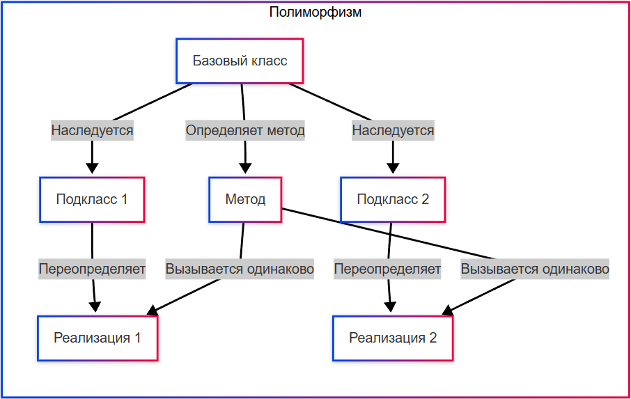

---
title: Полиморфизм - единый интерфейс для разных реализаций
---

# Полиморфизм - единый интерфейс для разных реализаций

<div class="article-tags">
  <span class="tag tag-required">ОБЯЗАТЕЛЬНО</span>
  <span class="tag tag-beginner">ДЛЯ НОВИЧКОВ</span>
  <span class="tag tag-advanced">НЕ ДЛЯ НОВИЧКОВ</span>
  <span class="tag tag-inprogress">В РАЗРАБОТКЕ</span>
</div>
<span class="complexity-badge">Разработчику</span>
<span class="complexity-badge">Аналитику</span>
<span class="complexity-badge">Тестировщику</span>  
<span class="complexity-badge">Архитектору</span>
<span class="complexity-badge">Инженеру</span>

## Полиморфизм: единый интерфейс для разных реализаций

### Что такое полиморфизм?

★ **Полиморфизм** – способность объекта принимать разные формы в зависимости от контекста, например, выполнение разных действий при вызове одного и того же метода. Позволяет объектам разных классов обрабатываться как объекты одного класса, но с разной реализацией методов. Это делает код гибким и расширяемым.

Полиморфизм происходит от греческого «много форм». 




Пример:
```java
класс Фигура {
    метод нарисовать() {
        вывод("Нарисована фигура.");
    }
}

класс Круг : Фигура {
    метод нарисовать() {
        вывод("Нарисован круг.");
    }
}

класс Прямоугольник : Фигура {
    метод нарисовать() {
        вывод("Нарисован прямоугольник.");
    }
}
```
Здесь метод нарисовать() имеет разные реализации в зависимости от типа объекта - Круг или Прямоугольник, однако вызывается через единый интерфейс.

---

### Переопределение

★ **Переопределение методов** — это механизм, при котором подкласс предоставляет свою собственную реализацию метода, унаследованного от родительского класса. Это ключевой аспект полиморфизма. Пример:
```java
класс Животное {
    метод издатьЗвук() {
        вывод("Животное издаёт звук.");
    }
}

класс Кот : Животное {
    метод издатьЗвук() {
        вывод("Мяу!");
    }
}

класс Собака : Животное {
    метод издатьЗвук() {
        вывод("Гав!");
    }
}
```
Здесь метод издатьЗвук() переопределяется в методах Кот и Собака. Оба класса наследуются от базового класса Животное, но при вызове метода через Животное будет реализация, соответствующая фактическому типу объекта.

К примеру, «Собака.издатьЗвук()» будет «Гав!», а «Кот.издатьЗвук()» будет «Мяу!».

Метод в базовом классе один и тот же, но его внутренности для каждого подкласса - разные.

---

### Перегрузка

★ **Перегрузка методов** — это создание нескольких методов с одинаковым именем, но разными параметрами (типами или количеством). Это не связано напрямую с наследованием, в отличие от переопределения, но также является частью полиморфизма.

Пример:
```java
класс Математика {
    метод сложить(целое a, целое b) {
        вывод(a + b);
    }

    метод сложить(строка a, строка b) {
        вывод(a + " " + b);
    }
}
```

Здесь в одном классе Математика есть две реализации одного и того же метода - «сложить» - одна для чисел, вторая для строк. Выбор реализации будет зависеть от переданных аргументов.

Когда мы вызовем «сложить(1, 2)» - тип данных определится как целое число (int) и соответственно будет вызвана реализация первая - для чисел. Если же мы напишем вместо целых чисел строки, то будет вывод путём конкатенации, а не суммирования.

Давайте подведём итоги по ООП.


---

Мы будем повторно изучать особенности ООП для каждого языка, но суть должны были понять корректно. Сведём всё в итог.

| Принцип | Определение | Цель | Механизмы |
|-----|---------|---------|---------|
|Абстракция	|Выделение важных характеристик объекта и игнорирование несущественных деталей.	|Упрощение моделирования сложных систем, фокус на "что" делает объект, а не "как".	|Абстрактные классы; Интерфейсы; Скрытие деталей реализации.
|Инкапсуляция	|Объединение данных (атрибутов) и методов работы с ними в единый объект.	|Защита данных, управление доступом, обеспечение целостности объекта.	|Модификаторы доступа; Геттеры и сеттеры; Автоматические свойства.
|Наследование	|Создание нового класса (подкласса) на основе существующего (родительского), перенимая его свойства и методы.	|Уменьшение дублирования кода, повторное использование, расширение функциональности.	|Базовые и производные классы; Абстрактные классы; Интерфейсы.
|Полиморфизм	|Способность объекта принимать разные формы в зависимости от контекста.	|Гибкость кода, единый интерфейс для работы с разными типами объектов.	|Переопределение методов; Перегрузка методов; Интерфейсы; Абстрактные классы.

Как можно заметить, особенно от всех выделяется именно инкапсуляция, тогда как абстракция, наследование и полиморфизм настолько тесно связаны, что их легко перепутать - они используют одни и те же механизмы интерфейсов, абстрактных классов. Поэтому ООП — это единая парадигма, в которой важны все эти четыре принципа.
