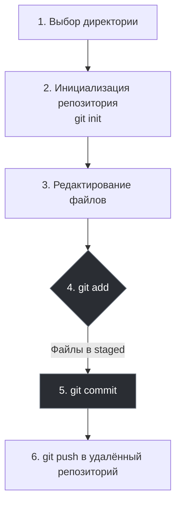
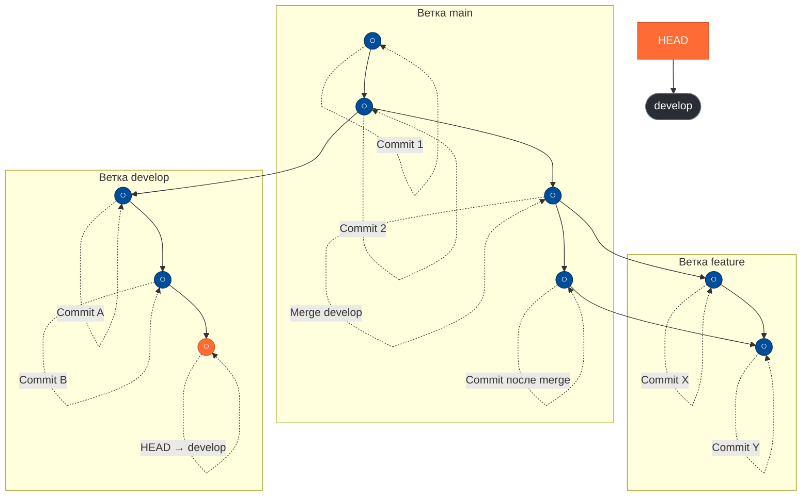
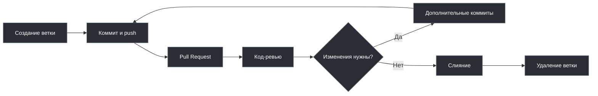
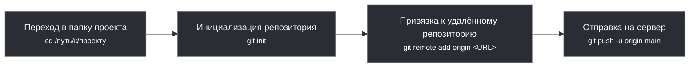
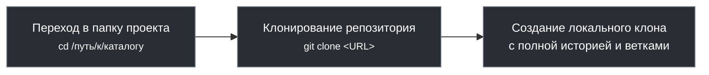
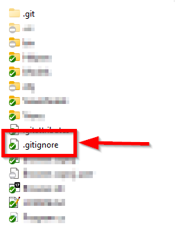
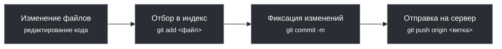

---
title: 4.13. Основы работы с Git
---

# 4.13. Основы работы с Git

<div class="article-tags">
  <span class="tag tag-required">ОБЯЗАТЕЛЬНО</span>
  <span class="tag tag-beginner">ДЛЯ НОВИЧКОВ</span>
  <span class="tag tag-advanced">НЕ ДЛЯ НОВИЧКОВ</span>
  <span class="tag tag-inprogress">В РАЗРАБОТКЕ</span>
</div>
<span class="complexity-badge">Разработчику</span>
<span class="complexity-badge">Архитектору</span>
<span class="complexity-badge">Инженеру</span>

## Что такое Git?

Так, мы изучили код, изучили то, как он работает на разных языках.

Представим себе такую ситуацию, когда мы пишем код для нового функционала, всё работает, и мы довольны собой. Затем решаем улучшить его, переписывая несколько функций, добавляя логику…и вдруг всё перестаёт работать. Мы хотим вернуться к тому рабочему варианту, но не помним, какие именно изменения были сделаны, что удалено. Попытки написать заново всё только ломают сильнее - что-то ещё забыли. Паника! Как откатиться назад? Как понять, что именно сломано?

Другая история - мы работаем над проектом уже несколько часов, всё идёт хорошо, мы в потоке, и тут - выключается электричество в здании. Компьютер гаснет. После перезагрузки запускаем свой редактор, а там - пусто. Сохранения не было, всё пропало.
Ещё один частный случай, когда мы вместе с коллегами работаем над одним проектом. Оба правим один и тот же файл, каждый в своём темпе. Потом мы сохраняем свои изменения, заливаем их на общий сервер в папку, и кто-то из нас затирает чужой код. Это не просто досадно — это настоящий кошмар, особенно если никто не следил за историей изменений.

Как бы мы спасались? Вели журнал учёта изменений с указанием файлов, строк? Резервными копиями перед каждой заменой? Но ведь тогда хранилище будет довольно объёмным. Но будущее скакнуло далеко вперёд.

**Git** - как раз такой инструмент, который создан для избежания и разрешения подобных проблем. Он позволяет отслеживать каждое изменение в коде, хранить историю изменений, возвращаться к рабочим версиям, совместно работать с другими разработчиками, не боясь потерять данные или затереть чужие правки. 

Когда говорят о Git, часто используют слово «репозиторий» — это просто способ сказать «место, где хранится проект». Репозиторий — это вся история изменений, которую Git отслеживает. Можно создать его локально, на своём компьютере, а можно разместить в облаке, например на GitHub, GitLab, Bitbucket. И в обоих случаях Git будет знать, что изменилось, когда изменилось и кем изменено. 
Удалённый (облачный) репозиторий можно «клонировать», загрузив себе копию на компьютер локально. При этом создаётся рабочий каталог - наше рабочее пространство, где мы пишем код, правим файлы и экспериментируем, собственная область непосредственной разработки. Однако Git умеет больше, чем просто хранить текущее состояние файлов, он знает, как они выглядели раньше, может сравнивать старые и новые версии, показывать разницу между ними, помочь восстановить удалённое или отменить ненужные изменения.

Давайте вернёмся к нашим трём ситуациям:
1. код работал, а потом сломался - с помощью Git можно сохранить (зафиксировать) состояние проекта до начала изменений. Такой момент называется «коммит». Если после изменений что-то пошло не так, всегда можно вернуться, откатиться к предыдущему коммиту - и проект будет снова работать.
2. выключили электричество и потерялся прогресс - именно для решения таких проблем используется удалённый репозиторий, и если делать «коммиты» регулярно, то даже при аварийном выключении всегда будет оставаться сохранённая история изменений, которую можно будет восстановить.
3. два разработчика правят один файл и затирают друг друга - Git позволяет объединять изменения. Когда два человека вносят правки в один файл, Git может показать конфликты и помочь решить, какие изменения оставить, а какие отменить. Это не идеально, но гораздо лучше, чем терять всё.

На практике с Git не всегда всё радужно, и это самое сложное, с чем столкнётся новичок. Бывает, что-то затирается, удаляется, ломается. Но всё же благодаря истории изменений, можно откатиться на шаг назад, даже если сейчас всё поломано, можно принять решение вернуться к времени, когда работало исправно.

Официальная документация Git - https://git-scm.com/

Какие возможности предоставляет Git?
	- *любой момент в истории проекта можно восстановить — как текущее состояние, так и любую предыдущую версию*;
	- *можно увидеть, какие файлы были изменены, добавлены или удалены между любыми двумя моментами времени*;
	- *каждое сохранение (коммит) содержит описание, позволяющее понять, почему было сделано то или иное изменение*;
	- *если был внесён неправильный код или удалено что-то важное, всегда можно вернуться к рабочему состоянию*;
	- *разные участники могут вносить изменения в разные части проекта, не мешая друг другу*;
	- *система позволяет аккуратно объединять изменения, даже если они затрагивают одни и те же файлы*;
	- *когда изменения затрагивают одни и те же строки кода, Git предоставляет механизм для ручного согласования*;
	- *можно обмениваться изменениями на разных уровнях — локально, в команде, или с внешним миром*;
	- *каждый элемент в Git имеет уникальный идентификатор, основанный на его содержимом. Это гарантирует целостность данных*;
	- *любые изменения в уже существующих коммитах приводят к изменению их хэша, что делает подделку очевидной*;
	- *удалённые коммиты можно восстановить, если они ещё не очищены системой*;
	- *новые функции, фичи или багфиксы можно разрабатывать в отдельных ветках, не влияя на стабильную версию*;
	- *можно автоматически запускать действия перед или после определённых событий (например, запуск тестов перед коммитом)*;
	- *все операции (просмотр истории, сравнение, коммиты) возможны без подключения к серверу*;
	- *поскольку каждый участник имеет свою копию, данные не зависят от одного центрального сервера*.
	

## История Git

Git представляет собой систему контроля версий. И самое это понятие является результатом долгого развития программирования как профессии и как науки.

В самом начале истории программирования никто особо не задумывался о том, чтобы сохранять историю изменений, ведь программит писал код по несколько часов, часами же и компилировал, а если что-то сломалось, то переделывал. Если нужно было вернуться к старому вариантов, то приходилось либо держать несколько копий файлов с разными названиями, либо помнить, что и где менялось. Такой подход работал, пока проекты были маленькими и над ними работал один человек. Но с ростом сложности ПО и числа разработчиков, работающих над одним проектом, стало ясно, что нужна система, которая будет отслеживать изменения, показывать, кто что изменил, когда это произошло и давать возможность вернуться к рабочей версии, если что-то пошло не так.

Первые попытки автоматизировать управление версиями появились в 1970-х годах, и одной из первых систем была **SCCS (Source Code Control System** - незамысловатый перевод как «система контроля исходного кода»), позволявшая хранить историю изменений файла, делая возможным возврат к более ранним версиям. Позже, в 1982 году, появилась **RCS (Revision Control System)**, которая упростила работу с отдельными файлами. Она стала популярной среди разработчиков Unix. Однако проекты становились ещё больше, команды ещё многочисленнее, а эти системы были рассчитаны на одного пользователя и работали с каждым файлом отдельно, требовались более мощные решения.

Так, в середине 90-х годов появилась **CVS (Concurrent Versions System)**, одна из первых систем, поддерживающих работу нескольких разработчиков над одним проектом. Теперь можно было работать с несколькими файлами одновременно, сливать изменения, синхронизироваться через общий сервер.
В 2000 году появился **Subversion (SVN)**, который был шагом вперёд, предлагая лучшую поддержку бинарных файлов, более точный контроль за перемещением файлов и директорий, благодаря чему выглядел куда современнее CVS.

Однако у этих систем был серьёзный недостаток: они были **централизованными**. Это значит, что все изменения хранились на одном сервере, а локально у разработчика была лишь текущая версия кода. Если сервер падал — работа останавливалась. Если связь с сервером пропадала — нельзя было ничего закоммитить. И самое главное — невозможно было работать автономно, делать экспериментальные ветки, тестировать изменения без влияния на основную базу кода.

С развитием интернета и увеличением числа открытых проектов, особенно таких масштабных, как ядро Linux, потребность в более гибком и мощном инструменте контроля версий росла, и тогда начали появляться **распределённые системы контроля версий (DVCS)**, такие как **Mercurial** и **Git**. В DVCS клиенты не просто скачивают снимок всех файлов (состояние файлов на определённый момент времени) — они полностью копируют репозиторий. В этом случае, если один из серверов, через который разработчики обменивались данными, умрёт, любой клиентский репозиторий может быть скопирован на другой сервер для продолжения работы. Каждая копия репозитория является полным бэкапом всех данных.

Большую часть времени разработки ядра Linux (1991–2002 гг.) изменения передавались между разработчиками в виде патчей и архивов. В 2002 году проект ядра Linux начал использовать проприетарную децентрализованную систему контроля версий BitKeeper, позволявшей делать локальные коммиты, работать с ветками, просматривать историю изменений и легко сливать правки между разными разработчиками. Для проекта такого масштаба, как ядро Linux, это было идеально. Однако в 2005 году отношения между компанией, разрабатывающей BitKeeper и сообществом open source испортились, потому что один из участников проекта попытался обратно спроектировать клиент, чтобы понять, как он работает, и компания отозвала бесплатное использование BitKeeper для разработчиков Linux.

И тогда, из-за отсутствия аналогов, Линус Торвальдс сказал «Хорошо, напишем свою». Через примерно десять дней, в 2005 году был написан первый прототип Git, с задачей решить конкретную проблему работы с ядром Linux быстро, безопасно и эффективно. Распределённая архитектура обеспечивала каждому разработчику свою копию репозитория со всей историей, скорость выполнения операций была очень высокой. Целостность данных обеспечивалась через хэширование (SHA-1) для гарантии отсутствия повреждения или изменения. Копии репозиториев, разделявшиеся на ветки, обеспечивали возможность слияния, что стало одном из самых сильным мест Git. А через несколько месяцев, Git начал развиваться как полноценный проект, сообщество взяло его «под крыло», стали появляться интерфейсы, документация, инструменты интеграции. Ещё через пару лет Git де-факто стал стандартом для open source проектов.


## Установка Git

Git является полноценной программой, которую нужно установить локально. Это отдельный инструмент, который изначально создавался консольным. Думаю, понятна связь - Linux, и всё что под него разрабатывается, использует подход лаконичности и консольности, поэтому сам по себе Git после установки будет доступен через терминал, вызовом ключевого слова «**git**». 

Git работает на уровне файловой системы и взаимодействует с проектами, которые находятся на компьютере. Для этого нужен интерфейс, через который можно давать команды: создать репозиторий, добавить файл, сохранить изменения, отправить их на сервер. Команды простые, однако новичку может быть сложно и неудобно.

На Windows установка выполняется с официального сайта, и мастер установки позволит выбрать, будет ли Git доступен только в самом *Git Bash*, в командной строке *Windows* или *PowerShell*. На macOS установка выполняется через *Homebrew* (`brew install git`), а на *Linux* (Debian / Ubuntu) через `apt` (`sudo apt install git`).

Чтобы убедиться, готов ли Git к работе, нужно проверить версию установленного Git, через команду:
```bash
git --version
```
После того, как убедились в корректности установки, нужно настроить Git. Первое — это указать, кем мы являемся, задав своё имя и email (даже для локальной работы):
```bash
git config --global user.name "Имя"
git config --global user.email "наш@email.com"
```


## Как работать с Git?

Работа с Git строится по определённому алгоритму:



### 1. Выбор директории

Выбираем *директорию* - папку, где находится проект.

### 2. Инициализация

Инициализируем *репозиторий* - говорим Git, что эта папка теперь будет под его контролем. Репозиторий на нашем компьютере будет **локальным**, а на сервере (в облаке) - **удалённым**.

### 3. Изменение и работа

Изменяем файлы (собственно, работаем).

Git умеет отслеживать состояние каждого файла в проекте, и файлы могут быть в одном из следующих состояний:
	- *Неотслеживаемый (untracked)*, когда файл существует, но Git не знает о нём. Это может быть новый созданный файл, не добавленный в индекс;
	- *Модифицированный (modified)*, это изменённый файл с момента последнего коммита, но ещё не добавленный в индекс. Git знает, что он изменился, но мы ещё не решили, включать ли его в следующий коммит;
	- *Индексированный (staged)*, когда файл изменён и мы явно сказали Git, что хотим включить изменения в следующий коммит. Для этого используется команда `git add`;
	- *Зафиксированный (commited)*, когда файл был добавлен в индекс и «закоммичен», изменения сохранены в истории проекта.

### 4. Индекс

Добавляем файлы в **индекс (Stage)** - выбираем, какие именно изменения мы хотим сохранить. Git не автоматически отслеживает все изменения. Нужно явно сказать ему: «Я хочу сохранить эти файлы» — сначала добавляя их в индекс (stage), а затем делая коммит. К примеру, если мы изменили три файла - test.html, test.js и test.css, но хотим отправить изменения только двух файлов - test.html, test.js. Тогда мы только их и добавляем в индекс, промежуточную зону, куда мы складываем те изменения, которые хотим зафиксировать в следующем коммите.

### 5. Коммит

Делаем **коммит** - фиксируем изменения с описанием того, что мы сделали. Коммит — это моментальная «фотография» состояния проекта в определённый момент времени. К этой «фотографии» мы добавляем подпись (сообщение), указав, к примеру «Исправил баг с кнопкой запуска». Это поможет нам через месяц, чтобы вспомнить, зачем сделан именно этот коммит.

### 6. PUSH и PULL

Пушим в удалённый репозиторий, отправляя наши изменения на сервер.

**Push** — отправка своего коммита на удалённый репозиторий. То есть, локальные коммиты будут доступны другим только после push.

**Pull** — «вытягивание», когда забираем изменения других разработчиков из удалённого репозитория к себе. Например, коллега добавил новый модуль — выполняем pull и изменения появятся у нас локально.

Можно запомнить так, что push - загрузка на сервер, pull - скачивание с сервера.


## Ветки и слияния

Git использует *систему веток*, позволяющую работать над разными частями проекта параллельно, не мешая основной работе. Представим, что у нас есть стабильная версия - «чистовик». Разумеется, лучше не рисковать и не экспериментировать в ней, поэтому создадим новую ветку, в которой можем править код, делать коммиты, не влияя на основную версию проекта. Когда новая функция будет готова, можно *объединить (merge)* ветку новой фичи с основной веткой. И таких «дополнительных веток» может быть сколько угодно.

**Ветки** позволяют работать над несколькими задачами одновременно, изолировать экспериментальные изменения, легко тестировать и проверять новые идеи без риска сломать рабочую версию.


Переключение на определённую ветку называется **checkout**. Ветка является просто последовательностью коммитов, поэтому переключаясь, мы сообщаем, что коммиты будут отправляться именно в эту ветку. На практике это работает так, что мы начинаем с какой-то определённой ветки, которую мы клонировали или создали. Потом мы можем создать ветку (клиенты позволяют выполнять checkout на новую ветку сразу после её создания), и переключиться на неё. После переключения на дополнительную ветку, все изменения будут учитываться для коммитов именно в неё, не трогая основную.

Git использует указатель на ветку - **HEAD**. 

Глянем визуально:



Здесь можно увидеть последовательность коммитов в ветках *main*, *develop*, *feature*. Можно запутаться, не так ли? А веток может быть несколько тысяч! На схеме выше указаны коммиты как синие кружки. Активный HEAD (где мы сейчас) обозначен оранжевым узлом. Как можно заметить, коммиты связаны - поэтому важен полный контроль над состоянием системы. Если вы случайно отправите тестовые изменения на основную ветку - приложение может поломаться.

Ветку можно создать локально, а при отправке коммита ветка будет создана автоматически и на сервере. Тогда, к примеру, на GitHub будет выглядеть так:


На сервере, через специальный интерфейс, можно найти свой репозиторий, скопировать ссылку на него, изучить его ветки и увидеть коммиты, перейдя к ним.

Ветки могут удаляться, упорядочиваться в папки, переименовываться и сливаться друг с другом.

В данном случае Default (ветка по умолчанию) является ветка с именем master.

Удалённый репозиторий определяется как origin (push origin как раз подразумевает отправку на сервер).


На любой репозиторий можно перейти по ссылке, и если он публичный, то авторизации не потребуется, однако приватный требует предоставления прав конкретным пользователям (в компании это выполняют администраторы).

Чтобы увидеть состояние файлов в репозитории, нужно выбрать ветку (сначала открывается Default), для этого можно использовать поиск по веткам.
Ветки могут получать свои теги, чтобы искать по ним, к примеру для багов один тег, для фич другой.


**Merge** - специальная команда для слияния веток, которая позволяет как раз объединить изменения дополнительной ветки с основной. Однако, если Git обнаружит, что некоторые изменения не получается автоматически однозначно «объединить», то возникнет **конфликт слияния**. Чтобы разрешить конфликт слияния, требуется вмешательство пользователя, который скажет, оставить новую версию или старую. Если всё оказалось сложнее, то придётся вернуться к правке файла и учесть ошибки.

И разумеется, если рядовые программисты в компании будут сливать всё в основную ветку без контроля, то будет хаос, ведь код может содержать орфографические, стилистические, логические ошибки, не учитывать чужих изменений, противоречить стандартам проекта или нужно обсудить некоторые моменты перед слиянием. 

Для порядка используется специальный механизм - **pull request (пул-реквест, запрос на слияние)**, когда рядовые пользователи отправляют запрос на слияние своей ветки с основной веткой. Администратор, DevOps или старший программист изучает изменения на наличие проблем и конфликтов, а также проверяет корректность написания кода (код-ревью, code review) и оставляет свои замечания. После исправления замечаний, он принимает запрос, и только после этого происходит слияние.

```
Создание ветки → Коммит и пуш → Pull Request → Код-ревью → Слияние
```



Порой компании даже используют механизм **CI** (из **CI/CD**), когда после утверждения пул-реквеста выполняется специальный автотест (система автоматически запускает скрипты для проверки), в случае провала которого потребуются дополнительные проверки.

**CI/CD** — это сокращение от **Continuous Integration / Continuous Delivery & Deployment** . Это система автоматизации, которая помогает проверять и доставлять код без участия человека.

CI — автоматическая проверка того, что твой код работает и не ломает существующий функционал. Например, запуск тестов, проверка стиля кода, сборка приложения.

CD — автоматическое развёртывание кода на сервер, если он прошёл все проверки.

**Пайплайн (pipeline)** — это цепочка таких шагов. К примеру, скачивание кода, запуск тестов, проверка на соответствие стандартам, и если всё хорошо, то пайплайн разрешает слить ветку. Если какой-то этап провален — например, тесты не прошли — то такой код нельзя слить, пока проблема не будет исправлена.

Представляете, да, насколько удобной может стать разработка для компании?

Разработчик выполняет работу без конфликтов с другими, изменения всегда быстро доставляются каждому из них, ошибки проверяют как вручную на код-ревью, так и автотестами через пайплайн, а в дальнейшем ещё и будет сам процесс полноценного тестирования. Это всё уже наработанный болью, увольнениями и миллионными потерями опыт.

## Важные моменты

Из важного:

### Создание

Чтобы создать свой новый репозиторий, нужно его инициализировать, запустим `git init` в папке - тогда будет создана папка `.git` со всеми служебными данными.

Создание репозитория (с нуля):
```
Переход в папку → Инициализация репозитория → Отправка на сервер
```


### Несколько репозиториев

Чтобы работать с удалённым репозиторием, нужно зарегистрироваться на площадке - для личной разработки лучше пользоваться GitHub, регистрация там простая, есть свой клиент с удобным графическим интерфейсом, а также интеграция с различными IDE.

### Аутентификация

Рабочие, корпоративные сервера устанавливают и настривают свои репозитории и хранилища, на базе GitLab, Azure и прочих инструментов. При устройстве на работу разработчикам, как правило, предоставляется доступ к такому репозиторию с правами на клонирование, создание своих веток и изменение в них.

Система аутентификации включает в себя логин/пароль, SSH-ключи (для общения без постоянного ввода логина и пароля) и токены (PAT - Personal Access Tokens).

### Клонирование

Чтобы приступить к работе с готовым репозиторием, его нужно клонировать себе, скопировав HTTPS или SSH ссылку и выполнив команду `git clone` `<ссылка>`. Если это рабочий репозиторий или приватный, Git потребует указать данные для входа, иначе будет ошибка авторизации. Если репозиторий открытый (публичный), то после выполнения команды просто начнутся копироваться файлы.

Клонирование готового репозитория:
```
Переход в папку → Клонирование репозитория → Создание локального клона
```


### .git

После инициализации или клонирования репозитория, создаётся скрытая папка .git, которая и будет содержать в себе всё, что нужно для работы программы. Это служебная папка, потому она и скрыта. Если вы хотите переместить или скопировать папку с репозиторием в другом месте (например, на другой диск) с сохранением всех свойств и связей Git, то важно не забыть скопировать и эту скрытую папку .git.


В проекте могут быть файлы, которые нежелательны для публикации, к примеру, содержащие пароли, ключи, токены или служебные лишние данные. Такие файлы и папки можно отдельно указать как игнорируемые, добавив их в список в файле .gitignore, который создаётся в корне рабочего каталога.



Чтобы начать работу в репозитории, можно открыть Git Bash или открыть командную строку в рабочем каталоге. Клиенты с графическим интерфейсом позволяют выбрать папку (открыть репозиторий). Любой клиент Git будет искать в текущей папке соответствующий подкаталог .git и читать всё, что там есть.

### PULL

Перед началом работы по внесению изменений всегда нужно выполнять pull, чтобы скачать последние изменения файлов в папке.
Получение свежих изменений (сделанных другими):
```
Переход в папку → Пул (pull) → Обновление файлов
```


### Локальность изменений

Когда изменения производятся в репозитории, они всегда сначала сохраняются в локальном репозитории и не передаются сразу в удалённый. То есть, можно работать с множеством изменений и коммитов локально, потом приводить всё в порядок и только потом отправлять в удалённый репозиторий.

Локальное сохранение изменений:
```
Изменение → Отбор в индекс → Коммит
```

Индекс является промежуточной зоной, которая используется для того, чтобы Git учёл изменения. Добавляя в индекс, мы как бы отмечаем, что «эти изменения важные, фиксирую». Если же изменения нас не устраивают (к примеру, ошибочные или генерированные), то мы можем отменять их, возвращая исходное состояние файлов. Это и есть процесса отбора изменений в индекс (staging).

После того, как мы убедились, что изменения достойны отправки в удалённый репозиторий, нужно выполнять команду push, чтобы коммит отправился на сервер. Только в таком случае другие пользователи увидят изменения.

Отправка изменений на сервер:
```
Изменение → Отбор в индекс → Коммит → Пуш (push)
```


### Удаление

Если файлы удаляются при подгрузке изменений, то они удаляются не в корзину. Восстановить их можно только через механизмы Git, к примеру, отменив коммит или вернув файл физически. Если вы удалили файл, который был в удалённом репозитории, и отправите свой «снимок» через push, то этот файл удалится для всех. Если так случилось, и произойдёт revert (отмена) или reset (сброс) до определённого состояния (до удаления), тогда файл будет восстановлен ровно в том же исходном виде. Удалённые файлы тоже нужно добавлять в индекс.
```
Удалённые данные традиционно красные, а добавленные - зелёные.
```

### Ветки

Чтобы не испортить всем разработку, используется подход с ветками. Имеется единая ветка main или master с готовым рабочим продуктом, ветка develop (или какая-то иная) для разработки, и для каждой правки, функции, задачи создаются дополнительные ветки, которые хранят свои соответствующие изменения. Потом все эти изменения из веток сливаются в единую ветку разработки (develop), которая тестируется и после успешных испытаний сливается в main, как готовый релизный продукт.

### Информация в коммите

Каждый коммит включает в себя следующую информацию:
	- снимок всех отслеживаемых файлов в репозитории на момент фиксации;
	- ссылка на родительский коммит;
	- сообщение, описывающее изменения в коммите.

### Графические клиенты

Хорошая новость для тех, кто боится консоли - работать с Git не обязательно через терминал, такой подход для многих уже устарел. Можно использовать графические клиенты:
	- VS Code / Visual Studio: оба имеют встроенную поддержку Git прямо в IDE;
	- GitHub Desktop: бесплатный клиент от GitHub;
	- TortoiseGit: интеграция Git в проводник Windows;
	- Fork и SourceTree - клиенты с визуальным деревом коммитов.

## Восстановление данных

Самая страшная ситуация для новичка — это всё когда его действиями всё испорчено. Что-то удалил, изменил, затёр изменения, или вызвал ошибку. Разумеется, тут как повезёт, может быть, коллеги просто поддержат и помогут решить проблему, а может быть, придётся выслушать много очень нехороших слов в свой адрес, а то и вовсе это рабочее место станет последним в IT. Страшно?

Представим себе ситуацию, когда мы усердствовали над кодом, сделали пару коммитов, отправили их на удалённый репозиторий, а потом поняли, что всё это было зря, ведь работа велась не в той ветке, отправили лишнее или вообще случайно удалили файл. Что делать?

Вот для таких ситуаций нужно помнить, что Git не просто система контроля, но и архив изменений, который позволяется откатываться назад, восстанавливать и исправлять ошибки, даже если они уже были отправлены.

### **Выбор нужной ветки и клонирование/вытягивание**.

Перед тем как восстанавливать данные, важно убедиться, что мы работаем с правильной веткой. Чтобы проверить, какие ветки есть локально и удалённо, нужно выполнить команду «git branch -a» или изучить внимательно интерфейс графического клиента. Если нужная ветка ещё не загружена, но существует на сервере, её можно привязать к удалённой ветке:
```
git checkout -b имя_ветки origin/имя_ветки
```
Не стесняйтесь в начале работы уточнять у коллег, в какой ветке работать, как вообще принято работать с Git в компании. Лучше сначала задать глупые вопросы, чем потом подвергать всех рискам.

Как только убедились в нужной ветке, нужно всегда сначала получить все последние изменения из основной ветки (куда все разработчики всё «сливают»), и слить основную ветку в свою. Не свою в основную, а именно в нашу, рабочую. 

Это работает так:

Вася и Петя получили задачи с утра и приступили. Вася в обед уже закончил, запушил и слил изменения с основной веткой. Петя приступил к работе с утра, но закончил вечером, однако, когда он запушил свои изменения, он не учёл изменения Васи и они были удалены.

Чтобы такого не было, Петя должен был предварительно сделать pull ветки с последними изменениями, а если не учёл, то нужно было внимательно изучить, что отправляется в коммит, ведь там в списке изменений было удаление файлов Васи. Поэтому, перед коммитом нужно проверить, нет ли каких-то левых файлов, которых мы не касались.

Поэтому в такой ситуации, именно свежий pull поможет получить все последние изменения, включая те, которые могут содержать удалённые данные.

### **Отмена коммита**.

Бывает, что когда мы делаем коммит и пушим его, потом понимаем «Ой, забыл добавить один файл» или «Упс, закоммитил что-то лишнее».
Если коммит ещё не был отправлен (локальный), то можно просто отредактировать коммит. В консоли это «git commit --amend», изменение последнего коммита.

Если коммит уже был отправлен, то можно сделать откат на один коммит - «git revert HEAD», это создаёт новый коммит, который отменяет изменения предыдущего. Это безопасный способ, потому что он не перезаписывает историю, и его можно использовать даже в общих ветках.

HEAD — это указатель на текущий коммит (обычно последний коммит текущей ветки), словно Git сообщает «Я сейчас здесь». Поэтому, при переключении между ветками, HEAD указывает на последний коммит другой ветки.

Detached HEAD - состояние, когда HEAD ни на что не указывает (детачмент). К примеру, если мы перепрыгнем через checkout на хэш конкретного коммита, а не имя ветки, после чего HEAD будет указывать на коммит, а не ветку, и изменения не будут принадлежать ветке, пока мы их явно не привяжем. Если выйти из такого состояния, то работа будет потеряна. Чтобы проверить, где сейчас находится HEAD, нужно выполнить «`cat .git /HEAD`». 

Команда `git switch -c temp-fix` позволит создать новую ветку от текущего состояния.

Команда `git reset --soft HEAD~1` перемещает HEAD на один коммит назад, но сохраняет изменения в индексе. 

Команда `git reset --hard HEAD` сбрасывает рабочую область до состояния, на которое указывает HEAD.

Команда `git checkout HEAD~2 file.txt` позволяет посмотреть, как выглядел файл два коммита назад.

Самый простой способ вернуть HEAD в нормальное состояние — это `git checkout <имя ветки или коммита>`.

### **Восстановление файла из конкретного коммита**.

Представим, что мы случайно удалили файл или внесли изменения, которые всё сломали, но мы знаем, что в каком-то старом коммите файл был рабочим.

Сначала нужно посмотреть историю коммитов (в консоли git log), найти хэш нужного коммита (например, abc1234), и восстановить файл из этого коммита:
```
git checkout abc1234 -- путь/к/файлу
```
Это скопирует файл из указанного коммита в рабочий каталог и мы сможем его просмотреть или закоммитить как исправление.

Если же вручную «вернуть» файл в директорию без использования инструментов Git, то это учтётся как новые изменения для текущей ветки, и потребуется новый коммит и пуш.

### **Восстановление удалённых коммитов**.

Иногда бывает, что коммиты удаляются, используя reset, или ветка удаляется вовсе. Но Git сразу не удаляет данные, он лишь делает их недоступными через обычные команды. Чтобы найти потерянные коммиты, нужно использовать git reflog. Это журнал всех действий, которые мы выполняли в Git. Можно так найти нужный коммит, и создать новую ветку, начиная с этого коммита через хэш, либо можно просто вернуть файл из коммита по способу выше.


## Практика


Хотите попрактиковаться?

Поскольку код мы уже изучили и вы наверняка что-то написали для себя, попробуйте установить себе Git, создать репозиторий на GitHub и залить свой проект, потом клонировать его, что-то изменить и закоммитить в новой ветке.

Кроме такой практики, есть возможность использовать классные тренажёры, например LearnGitBranching:

https://learngitbranching.js.org/?locale=ru_RU

Рекомендую попробовать, это своего рода песочница, где можно использовать команды, решать задачки и ознакомиться с возможностями Git.

Для удобства, даже сделаем шпаргалку:

| Команда | Описание |
|-----|---------|
|git init	|Инициализирует новый репозиторий Git в текущем каталоге.
|git push	|Отправляет локальные изменения в удалённый репозиторий.
|git branch	|Выводит список всех веток, создаёт новую ветку с указанным именем и подтверждает её создание.
|git merge	|Сливает указанную ветку в текущую ветку.
|git add	|Подготавливает изменения в текущем каталоге и подкаталогах.
|git pull	|Извлекает изменения из удалённого репозитория и объединяет их с локальным репозиторием.
|git fetch	|Извлекает последние данные из удалённого репозитория, но не интегрирует их в рабочие файлы.
|git status	|Отображает состояние репозитория, включая любые несохранённые изменения.
|git commit	|Сохраняет подготовленные изменения с сообщением о коммите.
|git remote	|Добавляет удалённый репозиторий, просматривает его и переименовывает.
|git checkout	|Переключается на указанную ветку.
|git reset	|Сбрасывает текущую ветку до указанного коммита.

На практике проще использовать чит-листы, к примеру такой:

https://cheatsheets.zip/git

Git принёс мне много боли, заставляя ошибаться вновь и вновь, поэтому я желаю вам успехов в изучении этой технологии!

