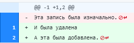
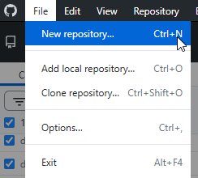
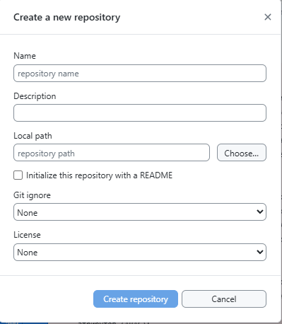
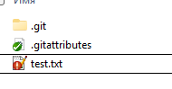
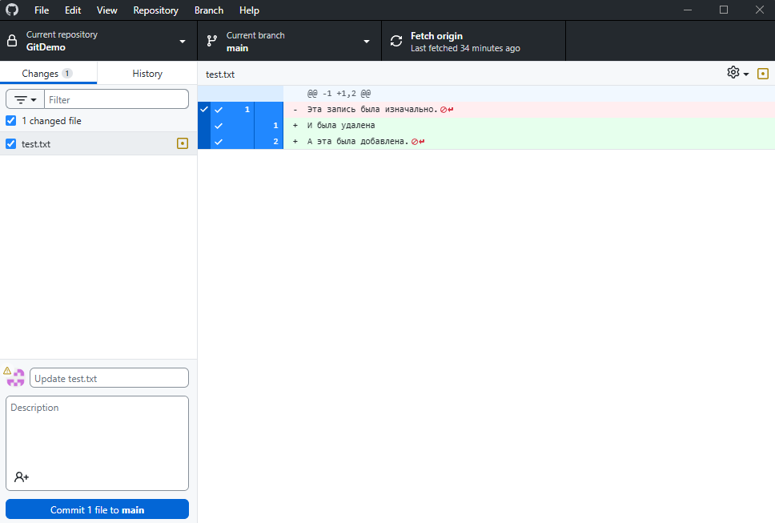
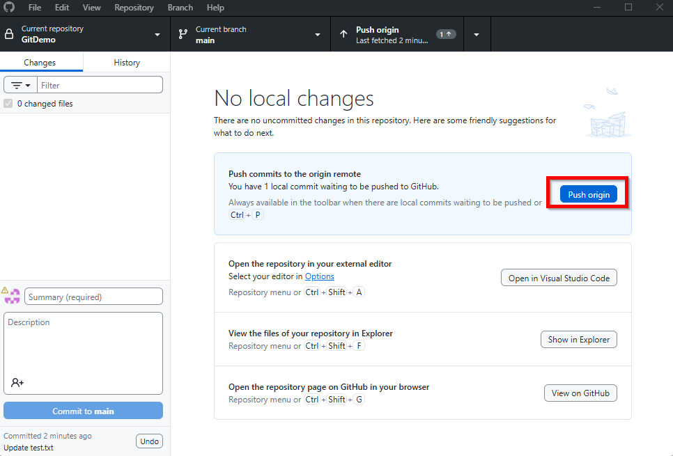
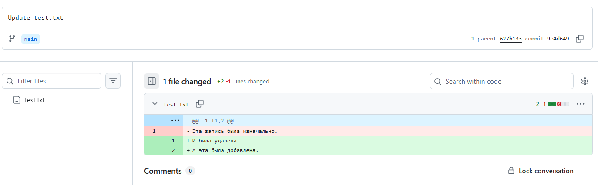

---
title: Система контроля версий Git
---

# Система контроля версий Git

  ОБЯЗАТЕЛЬНО
  ДЛЯ НОВИЧКОВ
  НЕ ДЛЯ НОВИЧКОВ
  В РАЗРАБОТКЕ

Разработчику
Архитектору
Инженеру

## Система контроля версий Git

### Что такое Git?

Так, мы изучили код, изучили то, как он работает на разных языках.

Представим себе такую ситуацию, когда мы пишем код для нового функционала, всё работает, и мы довольны собой. Затем решаем улучшить его, переписывая несколько функций, добавляя логику…и вдруг всё перестаёт работать. Мы хотим вернуться к тому рабочему варианту, но не помним, какие именно изменения были сделаны, что удалено. Попытки написать заново всё только ломают сильнее - что-то ещё забыли. Паника! Как откатиться назад? Как понять, что именно сломано?

Другая история - мы работаем над проектом уже несколько часов, всё идёт хорошо, мы в потоке, и тут - выключается электричество в здании. Компьютер гаснет. После перезагрузки запускаем свой редактор, а там - пусто. Сохранения не было, всё пропало.

Ещё один частный случай, когда мы вместе с коллегами работаем над одним проектом. Оба правим один и тот же файл, каждый в своём темпе. Потом мы сохраняем свои изменения, заливаем их на общий сервер в папку, и кто-то из нас затирает чужой код. Это не просто досадно — это настоящий кошмар, особенно если никто не следил за историей изменений.

Как бы мы спасались? Вели журнал учёта изменений с указанием файлов, строк? Резервными копиями перед каждой заменой? Но ведь тогда хранилище будет довольно объёмным. Но будущее скакнуло далеко вперёд.

**Git** - как раз такой инструмент, который создан для избежания и разрешения подобных проблем. Он позволяет отслеживать каждое изменение в коде, хранить историю изменений, возвращаться к рабочим версиям, совместно работать с другими разработчиками, не боясь потерять данные или затереть чужие правки. 

Это позволяет наглядно отслеживать все изменения:
- что удалили;
- что изменили;
- что добавили.

Пример:

Формально, изменения считают строками, так как традиционно разработка очень тесно связана с таким форматом написания инструкций - построчно.

Система контроля версий позволяет отслеживать изменения почти в любых файлах, будь то код, документация, конфигурация.

Когда говорят о Git, часто используют слово «репозиторий» — это просто способ сказать «место, где хранится проект». Сам проект представляет собой каталог (папку) со всей структурой проекта - вложенные каталоги и файлы.

**Репозиторий** — это вся история изменений, которую Git отслеживает. Можно создать его локально, на своём компьютере, а можно разместить в облаке, например на GitHub, GitLab, Bitbucket. И в обоих случаях Git будет знать, что изменилось, когда изменилось и кем изменено. 

Удалённый (облачный) репозиторий можно «клонировать», загрузив себе копию на компьютер локально. При этом создаётся рабочий каталог - наше рабочее пространство, где мы пишем код, правим файлы и экспериментируем, собственная область непосредственной разработки. Однако Git умеет больше, чем просто хранить текущее состояние файлов, он знает, как они выглядели раньше, может сравнивать старые и новые версии, показывать разницу между ними, помочь восстановить удалённое или отменить ненужные изменения.

Официальная документация Git - https://git-scm.com/

---

### Первый репозиторий

Предлагаю сразу научиться основам.

Новички всегда испытывают сложности с Git, поэтому нужно обязательно попробовать создать репозиторий, положить туда что-нибудь, и загрузить. Начнём с этой практики.

1. **Зарегистрируйтесь на GitHub**:
https://github.com/

2. **Скачайте** на компьютер **GitHub Desktop**:
https://desktop.github.com/download/

3. **Установите** GitHub Desktop.
4. **Запустите** программу, и выберите **"New repository..."**

5. В окне создания репозитория нужно указать:
	- Имя репозитория;
	- Путь к папке, где будут храниться файлы проекта;
	- Шаблон для инициализации файла Git ignore;
	- Шаблон для создания лицензии.

6. **Перейдите в папку проекта**, создайте тестовый файл `test.txt`, и добавьте туда любую информацию. Обратите внимание, что в папке проекта появилась скрытая папка `.git` и файл `.gitattributes`. Если настроили лицензию, Git ignore и README - то появятся и они.

7. **Перейдите в приложение** GitHub Desktop и увидите созданный файл, а также окно для создания коммита. Если файл лежал в папке ещё до создания репозитория, то он не отобразится, так как изменения уже есть на сервере. Тогда внесите изменения:

8. Напишите краткое описание коммита, и нажмите **"Commit"** - это отправит изменения в локальную систему Git.
9. Обратите внимание - ваши изменения всё ещё на вашем компьютере. Они сейчас разместились в папке `.git`.
10. Для отправки на удаленный репозиторий в облачном хранилище GitHub, вам нужно нажать **"Push origin"**:

11. **Готово**. Теперь вы можете перейти на сайт GitHub и увидите ваш файл с последними изменениями, с возможностью изучить историю изменений, 

12. Попробуйте вносить изменения в ваш файл, отправлять изменения, отменять их перед отправкой, и изучайте возможности GitHub.

---

### Возможности Git

Давайте вернёмся к нашим трём ситуациям:
1. **код работал, а потом сломался** - с помощью Git можно сохранить (зафиксировать) состояние проекта до начала изменений. Такой момент называется «коммит». Если после изменений что-то пошло не так, всегда можно вернуться, откатиться к предыдущему коммиту - и проект будет снова работать.
2. **выключили электричество и потерялся прогресс** - именно для решения таких проблем используется удалённый репозиторий, и если делать «коммиты» регулярно, то даже при аварийном выключении всегда будет оставаться сохранённая история изменений, которую можно будет восстановить.
3. **два разработчика правят один файл и затирают друг друга** - Git позволяет объединять изменения. Когда два человека вносят правки в один файл, Git может показать конфликты и помочь решить, какие изменения оставить, а какие отменить. Это не идеально, но гораздо лучше, чем терять всё.

На практике с Git не всегда всё радужно, и это самое сложное, с чем столкнётся новичок. Бывает, что-то затирается, удаляется, ломается. Но всё же благодаря истории изменений, можно откатиться на шаг назад, даже если сейчас всё поломано, можно принять решение вернуться к времени, когда работало исправно.

Какие **возможности** предоставляет Git?
	- *любой момент в истории проекта можно восстановить — как текущее состояние, так и любую предыдущую версию*;
	- *можно увидеть, какие файлы были изменены, добавлены или удалены между любыми двумя моментами времени*;
	- *каждое сохранение (коммит) содержит описание, позволяющее понять, почему было сделано то или иное изменение*;
	- *если был внесён неправильный код или удалено что-то важное, всегда можно вернуться к рабочему состоянию*;
	- *разные участники могут вносить изменения в разные части проекта, не мешая друг другу*;
	- *система позволяет аккуратно объединять изменения, даже если они затрагивают одни и те же файлы*;
	- *когда изменения затрагивают одни и те же строки кода, Git предоставляет механизм для ручного согласования*;
	- *можно обмениваться изменениями на разных уровнях — локально, в команде, или с внешним миром*;
	- *каждый элемент в Git имеет уникальный идентификатор, основанный на его содержимом. Это гарантирует целостность данных*;
	- *любые изменения в уже существующих коммитах приводят к изменению их хэша, что делает подделку очевидной*;
	- *удалённые коммиты можно восстановить, если они ещё не очищены системой*;
	- *новые функции, фичи или багфиксы можно разрабатывать в отдельных ветках, не влияя на стабильную версию*;
	- *можно автоматически запускать действия перед или после определённых событий (например, запуск тестов перед коммитом)*;
	- *все операции (просмотр истории, сравнение, коммиты) возможны без подключения к серверу*;
	- *поскольку каждый участник имеет свою копию, данные не зависят от одного центрального сервера*.
	
---

### История Git

Git представляет собой систему контроля версий. И самое это понятие является результатом долгого развития программирования как профессии и как науки.

В самом начале истории программирования никто особо не задумывался о том, чтобы сохранять историю изменений, ведь программит писал код по несколько часов, часами же и компилировал, а если что-то сломалось, то переделывал. Если нужно было вернуться к старому вариантов, то приходилось либо держать несколько копий файлов с разными названиями, либо помнить, что и где менялось. Такой подход работал, пока проекты были маленькими и над ними работал один человек. Но с ростом сложности ПО и числа разработчиков, работающих над одним проектом, стало ясно, что нужна система, которая будет отслеживать изменения, показывать, кто что изменил, когда это произошло и давать возможность вернуться к рабочей версии, если что-то пошло не так.

Первые попытки автоматизировать управление версиями появились в 1970-х годах, и одной из первых систем была **SCCS (Source Code Control System** - незамысловатый перевод как «система контроля исходного кода»), позволявшая хранить историю изменений файла, делая возможным возврат к более ранним версиям. Позже, в 1982 году, появилась **RCS (Revision Control System)**, которая упростила работу с отдельными файлами. Она стала популярной среди разработчиков Unix. Однако проекты становились ещё больше, команды ещё многочисленнее, а эти системы были рассчитаны на одного пользователя и работали с каждым файлом отдельно, требовались более мощные решения.

Так, в середине 90-х годов появилась **CVS (Concurrent Versions System)**, одна из первых систем, поддерживающих работу нескольких разработчиков над одним проектом. Теперь можно было работать с несколькими файлами одновременно, сливать изменения, синхронизироваться через общий сервер.
В 2000 году появился **Subversion (SVN)**, который был шагом вперёд, предлагая лучшую поддержку бинарных файлов, более точный контроль за перемещением файлов и директорий, благодаря чему выглядел куда современнее CVS.

Однако у этих систем был серьёзный недостаток: они были **централизованными**. Это значит, что все изменения хранились на одном сервере, а локально у разработчика была лишь текущая версия кода. Если сервер падал — работа останавливалась. Если связь с сервером пропадала — нельзя было ничего закоммитить. И самое главное — невозможно было работать автономно, делать экспериментальные ветки, тестировать изменения без влияния на основную базу кода.

С развитием интернета и увеличением числа открытых проектов, особенно таких масштабных, как ядро Linux, потребность в более гибком и мощном инструменте контроля версий росла, и тогда начали появляться **распределённые системы контроля версий (DVCS)**, такие как **Mercurial** и **Git**. В DVCS клиенты не просто скачивают снимок всех файлов (состояние файлов на определённый момент времени) — они полностью копируют репозиторий. В этом случае, если один из серверов, через который разработчики обменивались данными, умрёт, любой клиентский репозиторий может быть скопирован на другой сервер для продолжения работы. Каждая копия репозитория является полным бэкапом всех данных.

Большую часть времени разработки ядра Linux (1991–2002 гг.) изменения передавались между разработчиками в виде патчей и архивов. В 2002 году проект ядра Linux начал использовать проприетарную децентрализованную систему контроля версий BitKeeper, позволявшей делать локальные коммиты, работать с ветками, просматривать историю изменений и легко сливать правки между разными разработчиками. Для проекта такого масштаба, как ядро Linux, это было идеально. Однако в 2005 году отношения между компанией, разрабатывающей BitKeeper и сообществом open source испортились, потому что один из участников проекта попытался обратно спроектировать клиент, чтобы понять, как он работает, и компания отозвала бесплатное использование BitKeeper для разработчиков Linux.

И тогда, из-за отсутствия аналогов, Линус Торвальдс сказал «Хорошо, напишем свою». Через примерно десять дней, в 2005 году был написан первый прототип Git, с задачей решить конкретную проблему работы с ядром Linux быстро, безопасно и эффективно. Распределённая архитектура обеспечивала каждому разработчику свою копию репозитория со всей историей, скорость выполнения операций была очень высокой. Целостность данных обеспечивалась через хэширование (SHA-1) для гарантии отсутствия повреждения или изменения. Копии репозиториев, разделявшиеся на ветки, обеспечивали возможность слияния, что стало одном из самых сильным мест Git. А через несколько месяцев, Git начал развиваться как полноценный проект, сообщество взяло его «под крыло», стали появляться интерфейсы, документация, инструменты интеграции. Ещё через пару лет Git де-факто стал стандартом для open source проектов.

---