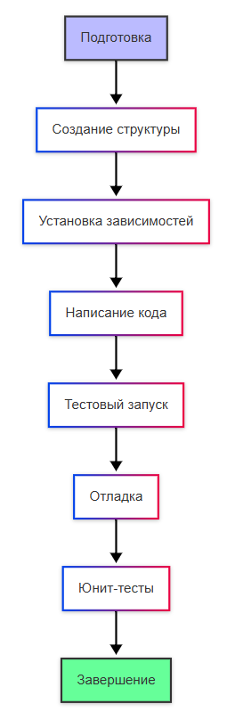

---
title: 4.14. Разработка и отладка
---

# 4.14. Разработка и отладка

<div class="article-tags">
  <span class="tag tag-required">ОБЯЗАТЕЛЬНО</span>
  <span class="tag tag-beginner">ДЛЯ НОВИЧКОВ</span>
  <span class="tag tag-advanced">НЕ ДЛЯ НОВИЧКОВ</span>
  <span class="tag tag-inprogress">В РАЗРАБОТКЕ</span>
</div>
<span class="complexity-badge">Разработчику</span>
<span class="complexity-badge">Архитектору</span>
<span class="complexity-badge">Инженеру</span>


## Разработка

```
Принципы и рекомендации разработки
читаемость, сопровождаемость, надежность и безопасность
Соблюдение культуры кода, принципов программирования (о них будем говорить позже)
Повторное использование и копирование, нет ничего плохого в том, чтобы использовать чужое решение, если оно проверенное, протестированное и оптимизированное - не нужно изобретать велосипед, лучше брать готовые библиотеки и решения
Обязательная проверка параметров в методах, чтобы обнаруживать ошибки
Обрабатывать исключения - зачем это нужно и почему важно и когда try-catch будут лишними, почему не нужно каждый блок прятать в обработку исключений
Культура работы с ошибками, как правильно использовать исключения для построения надежных систем, антипаттерны
Делать классы и члены класса как можно менее доступными - инкапсулировать
Объявлять локальные переменные как можно ближе к месту их первого использования и в максимально узкой области видимости
Мутабельность - предпочитать неизменяемые (immutable) объекты, так как они проще, безопаснее в многопоточной среде и их можно кэшировать.
Утечки памяти - непреднамеренное удержание ссылок на объекты, которые больше не нужны, обнуление ссылок

```

Процесс разработки начинается с получения задания. Но в каждой компании могут быть свои особенности и правила, а также проекты могут быть как простыми, так и сложными, поэтому схем можно выделить четыре:

Общий процесс



Первая схема представляет общий процесс разработки, начиная с подготовки проекта и заканчивая завершением. Он логичен, хотя новичку юнит-тесту могут быть не знакомы.

Акцент на тестирование


Вторая схема показывает процесс с фокусом на тестировании и отладке, что особенно важно для обеспечения качества кода. Здесь, помимо юнит-тестов, добавляется также интеграционное тестирование и отображён важный момент - тестирование не всегда идеально, ошибки найдутся и будут подлежать исправлению, а исправляет их разработчик.

Использование Git


Третья схема показывает процесс разработки с учётом использования системы контроля версий (Git), это стандартная практика в современной разработке. Важный момент здесь - коммиты, использование локального и удалённого репозитория и конечно код-ревью.

Использование CI/CD


Четвёртая схема учитывает современные практики CI/CD (непрерывная интеграция и доставка). Здесь тестирование и развёртывание автоматизированы. Это более сложная тема, особенности которой будем изучать позже.


### Что такое разработка?

**Разработка программного обеспечения** — это сложный и многогранный процесс, требующий не только технических навыков, но и грамотной организации, планирования и коммуникации. На практике может быть что угодно, абсолютно всевозможные комбинации подходов, принципов, паттернов, методологий и парадигм. Но всё же в большинстве организаций придерживаются какой-то определённой стратегии развития, особенно в сфере корпоративного ПО и финтеха.

Давайте рассмотрим основные этапы разработки.

#### Получение задания


Любая разработка начинается с задачи. Это может быть запрос от заказчика, идея собственного проекта или поручение внутри команды. Первый и один из самых важных шагов — правильно понять, что именно требуется сделать:
	- уточните требования - задавайте вопросы, нужно исключить двусмысленность;
	- определите цели - чего хочет заказчик? какова основная функция?
	- собрать контекст - узнайте, какие ограничения существуют.

Не стесняйтесь спрашивать у коллег (особенно аналитиков этой задачи), ведь иногда задание может быть расплывчатым или даже противоречивым. В таких случаях необходимо провести предварительный анализ и согласование условий до начала проектирования и реализации. И если аналитик уже анализировал, это не значит, что разработчику не нужен анализ!

К примеру, вам поручили изменить логику работы какого-то бизнес-процесса. На первый взгляд всё хорошо - документация с анализом, детально расписано в каких элементах потребуются изменения и даже какими они должны быть. Кажется, что можно даже сразу приступить к реализации, но вот в процессе разработки (скажем, через шесть часов), на одном из элементов стало заметно, что требуемая задача нереализуема, так как была допущена ошибка проектирования задачи. Да, решать это придётся через коллег - старшие разработчики, общение с аналитиком, отмена, продление или изменение задачи.

А если бы вы даже и не заметили ошибку, просто сделали бы как указано в документации, задача пошла в тестирование, и только на этом этапе обнаружили проблему - и вас будут дёргать на исправление «бага», и вы в процессе правки заметите, что задача изначально была некорректно поставлена.

Можно было сэкономить затраченную кучу времени, всего лишь перед разработкой уделив немного времени на то, чтобы пробежаться по всем сущностям и затрагиваемым элементам, и убедиться, что задача реализуема и учла все подводные камни.

#### Стратегия разработки и оценка затрат на разработку

После того как задача понята, наступает время стратегического планирования. Этот этап определяет дальнейший ход действий и помогает ответить на три ключевых вопроса:
	- Сколько времени потребуется на реализацию?
	- Какие ресурсы (люди, инструменты, технологии) будут задействованы?
	- Какой бюджет необходим?

И если вы рядовой разработчик, для которого вопросы бюджета явно вне компетенции, то остаются два вопроса - ресурсы и время.

Первичный анализ должен показать, какие технологии используются, чья компетенция затрагивается, какие могут быть риски и проблемы. Вот здесь может быть два варианта развития событий.

В первом варианте вас могут спросить о том, сколько времени потребуется, и есть ли вопросы. Это хороший вариант, и если есть возможность попросить немного времени (скажем, четыре часа) на анализ задачи, то замечательно - просите, берите, анализируйте, запишите себе все возникшие вопросы и задавайте их. Это подойдёт, когда на ежедневных совещаниях (скажем, на спринтах) или в хаотичной разработке есть прямой контакт с командой и возможность всё обсудить. И за эти четыре часа нужно понять, что и где вам придётся править, и сколько примерно вам потребуется времени. При оценке времени нужно брать резервное время - от часа до дня, чтобы не упираться в дедлайны, если что-то пойдёт не по плану.

Второй вариант более строгий, когда вам просто дают задачу, и время на неё уже определено. К примеру, техлид определил самостоятельно, получив ответы на все вопросы, проанализировал и назначил уже готовую задачу. Здесь будет документация, чёткая задача и выделенное время, поэтому важно не спешить бежать её исполнять, всё также нужно проанализировать, но в чуть более ускоренном темпе. В идеале, созвониться с постановщиком задачи и попросить объяснить задачу, если есть такая возможность.

Для ответа на вопросы обычно используют методы оценки трудозатрат (к примеру, деление задач на подзадачи и оценка каждой части), анализ рисков (выявление потенциальных проблем и их влияния на сроки и бюджет), и учитывается выбранная модель жизненного цикла разработки (водопад, Agile). 

Здесь главное — точная оценка на ранних этапах позволяет избежать недоразумений и перерасхода ресурсов позже.

#### Предварительное планирование

Организация процесса — залог успешной реализации любого проекта, как в циклах задач, так и в конкретных задачах. Даже самые талантливые и опытные разработчики могут потерпеть неудачу, если работа плохо спланирована или не контролируется. Конечно, здесь важно, чтобы роли и обязанности в команде были распределены, постановка задач выполнялась с помощью систем управления проектами, планирование этапов было корректным, проводились регулярные встречи для контроля процесса. И конечно гибкость, ведь план должен учитывать возможные изменения и адаптацию под новые условия.

Но не всё зависит от самого разработчика, ведь он лишь часть команды, а не управляющий, поэтому сначала нужно адаптироваться, изучить все регламенты и потом только приступать. Обычно к проектам допускают только после прохождения какого-то базового обучения и череды знакомств. Разработчику потребуются разве что хард-скиллы, технические навыки со знанием алгоритмов, структур данных, опыта работы, понимания протоколов, API, паттернов. Начинающему же будут давать более простые задачи, так что сложность задачи лежит на лидах.

После получения задачи, определения затрат, начинается «горячая фаза» разработки. Если перед разработкой вы проанализировали и записали себе свой план разработки, то работа пойдёт чуть быстрее. А если не записали - пора записать (кроме случаев, когда у вас уже есть идеальная документация, но это нереально). Аналитики и лиды не углубляются в тонкости реализации - какие функции вызывать, как называть переменные, как выполнять запросы в базу и тому подобное. Поэтому тут бремя лежит на разработчике.

Даже небольшое проектирование перед началом кодирования помогает избежать хаоса, повысить читаемость кода и облегчить дальнейшее сопровождение. Нужно определить данные, логику, интерфейс, способы обмена данными, поток движения информации внутри системы. 

Сначала напишите себе крупные этапы работы - допустим «Создать класс слушатель», «Создать класс для логики». Потом разбейте эти этапы на задачи, декомпозировав их - алгоритмическим языком распишите, что должны иметь классы, какие свойства/поля, методы, переменные. В таком «мини-проекте» определите им имена. Можете всё расписывать в обычном текстовом редакторе и создавать отдельные файлы для каждой задачи, которую вам поручают. В некоторых компаниях можно встретить даже требования для подготовки специальных документов с планом разработки (это полезно, когда сотрудник уволился или в отпуске, и при разборе проблем нужно понять, чем он руководствовался, что он делал и как планировал).
Кто-то предпочитает так не расписывать и сразу приступить, мыслить творчески в самом процессе, но я бы рекомендовал придерживаться чёткости и порядка хотя бы на первых порах. В дальнейшем мышление структурируется и только тогда будете готовы рваться сразу в бой. А документация поможет не забыть о том, что изменено (хотя Git и так сообщит изменения), какие были названия у сущностей и элементов, и позволит избежать проблем.

#### Процесс написания кода

Это центральный этап разработки. Тут всё просто — сделайте код:
	- Читаемым (чтобы другие разработчики могли понять вашу логику);
	- Поддерживаемым (чтобы добавление новых функций не ломало голову);
	- Тестируемым (код должен быть разделен на модули, готовые к проверке, если это применимо в вашем случае).

Соблюдение стандартов кодирования, написание комментариев и документирование функций значительно облегчает жизнь всем участникам проекта. В рамках принятых регламентов, конечно.

Собственно, прежде чем приступить к написанию кода, нужно проверять, готовы ли нужные инструменты и окружение - IDE, текстовый редактор, системы сборки и зависимости, доступ к серверам, базам данных, внешним API. Правильно настроенная рабочая среда экономит время и снижает количество «не работает у меня» ситуаций.

Важно понимать, что разработчик пишет код быстро, а большую часть времени выясняет, почему оно не работает, или правит ошибки. Ошибка — неизбежная часть разработки. Особенно часто они возникают на ранних этапах, поэтому бояться их не нужно, воспринимать как возможность научиться их исправлению. 

Читайте сообщения об ошибках, пользуйтесь отладкой и логированием для поиска проблем. Главное — сохранять терпение и систематически подходить к исправлению ошибок. Вы можете завершить работу, сдать её, но вам прилетит ошибка от тестировщиков и придётся вернуться к этому шагу, чтобы поправить баги.

Не забудьте про резервное копирование! Потерянный код или повреждённые данные могут свести на нет недели работы, регулярно делайте резервные копии, коммиты изменений в Git, чтобы спастись от потерь.

#### Сдача разработки

Когда план реализован и разработка завершена, то здесь важно учесть ещё один момент — время и ресурсы, выделенные на разработку, включают не только разработку. Сюда входит и предварительное тестирование силами самого разработчика (если это возможно), подготовка и проверка юнит-тестов, рефакторинг, отладка, исправление найденных ошибок.

Перепроверили? Перепроверьте ещё раз. Семь раз отмерь, один раз отрежь. Не торопясь, сначала прочитайте свой код, и убедитесь в его корректности, аккуратности и соответствии регламентам. Потом попробуйте проверить, работает ли он (ведь кому нужен нерабочий код?), протестируйте, а если у вас есть возможность работать со своей локальной копией репозитория, то это как раз возможность для теста.

И только когда вы убедились, что всё работает как надо, а также чисто и (по вашему мнению) готово, то заливайте изменения на сервер, делайте пулл-реквесты, словом, сдавайте задачу. Здесь можно столкнуться ещё с одной задачей - подготовкой документации, к примеру, описание разработчика или отчёт. Если вы документировали на этапе планирования, то отчеты пишутся легко, так как всё было по плану.


## Отладка

**Отладка** – что-то вроде мини-тестирования. Главная задача этого процесса - выявить и устранить ошибки в коде. Это делается сначала путём проверки кода на наличие опечаток (в том числе с применением анализаторов кода), профилировщиками производительности и через специальные отладчики.

**Отладчик** – инструмент который помогает программисту находить и исправлять ошибки в коде путём присоединения к работающему приложению и проверки кода.

Современные IDE предоставляют мощные инструменты для отладки программ, включая компиляцию и запуск приложения с отладкой, присоединение к уже запущенному процессу и пошаговое выполнение кода, точки останова, просмотры переменных и стека вызовов.

Точки останова - определение места, где нужно приостановить выполнение отладчика. Например, мы понимаем, что на каком-то этапе возникает ошибка, и чтобы выяснить, где именно она - на какой строке, в каком методе, мы можем поставить точку, где отладчик должен приостановить выполнение. А для сложных сценариев отладки может потребоваться целая группа точек останова.

Очень много интересного об отладке можно почитать на сайте Microsoft:

https://learn.microsoft.com/ru-ru/visualstudio/debugger/?view=vs-2022

### Запуск приложения с отладкой

Запуск приложения с отладкой (Build + Run with Debug). 

Здесь IDE компилирует проект с флагами, разрешающими отладку, запускает приложение под контролем отладчика, и при достижении точки останова (breakpoint) выполнение программы приостанавливается.
	- Отладчик позволяет:
	- Сделать шаг вперёд (Step Over)
	- Зайти внутрь метода (Step Into)
	- Выйти из метода (Step Out)
	- Посмотреть значения переменных
	- Выполнить выражение в Watch

Для этого нужно установить точку останова в редакторе кода (обычно клик рядом с номером строки), нажать кнопку Debug / Start Debugging, а IDE будет компилировать, запускать и останавливаться на точке останова.

Если отладчик может успешно установить точку останова в целевом процессе, она будет отображаться как закрашенный красный кружок. Полый круг (темно-серый или белый заполненный в зависимости от темы), если точка останова отключена или возникает предупреждение при попытке задать точку останова. После завершения отладки важно не забыть удалить все точки (снова кликнув на них).

Visual Studio (.NET/C#) поддерживает автоматическую сборку и запуск с отладкой, использует Visual Studio Debugger и MSBuild и хранит параметры в csproj, sln.

VS Code (Python/Node.js и прочие) хранит настройки в launch.json, и использует отладчик как свой встроенный, так и дополнительные (из расширений).

Intellij IDEA / Android Studio (Java/Kotlin) имеют свой интегрированный отладчик JVM.

### Присоединение к уже запущенному процессу

Это нужно тогда, когда приложение уже запустили (служба, демон, Docker или удалённый сервер), или когда хотим отладить критический участок кода, который выполняется после долгого запуска, а также  когда приложение запущено не через IDE. К примеру, вы работаете с библиотекой классов через открытие папки в IDE, а само приложение запущено отдельно от IDE, через dotnet.

В таком случае через IDE нужно выбрать PID (Process ID) нужного процесса, подключиться к нему и после этого ставить точки останова, исследовать состояние приложения и т.д.

Visual Studio (C# / .NET) позволяет подключиться через меню, указав тип отладки и процесс. Там конечно могут быть проблемы с PDB-файлами (символами отладки), из-за чего потребуется настройка проекта, но это частные ситуации.

VS Code позволяет в launch.json указать конфигурацию attach (присоединение к конкретной программе). Можно также подключаться и к удалённым процессам (например, через SSH).

IntelliJ IDEA позволяет подключиться к Java-процессу, который запущен с определенными параметрами, а Android Studio предоставляет Logcat для выбора процесса.

Все эти методы могут иметь различные специфические возможности. К примеру, отладка может быть удалённой, когда подключение требует настройки портов и специального режима запуска, но позволяет работать с серверами, виртуальными машинами и контейнерами. Точки останова могут быть условными (останавливают только при выполнении определённого условия).

Есть также такой инструмент как Data Breakpoints и Memory Watchpoints, которые останавливают выполнение при изменении определённой области памяти. Как можно понять, это уже более низкоуровневая отладка, связанная с ресурсами и производительностью.

**Дебаггинг (от англ. debugging )** — это процесс поиска и устранения ошибок в программном коде. Собственно, это и есть отладка (де-«баг», устранение багов). Это не просто механическая задача: дебаггинг требует логического мышления, внимательности и понимания того, как работает программа.

Анализируйте поведение программы, воспроизводите ошибки в контролируемой среде и используйте инструменты для отслеживания состояния приложения. Так вы постепенно сможете выявить источник проблемы. Когда устанавливаете точку останова, вы можете осмотреть значения переменных, отследить стек вызовов, проанализировать поток выполнения программы, проверить какие участки кода действительно выполняются.

### Анализ поведения

**Как анализировать поведение программы?**
	- Воспроизведите проблему - попробуйте повторить ситуацию, при которой возникает ошибка;
	- Изучите входные данные - убедитесь, что вы точно знаете, какие данные получает программа;
	- Проверьте выходной результат - сравните его с тем, что должно быть по логике;
	- Проверяйте, где происходит обработка данных;
	- Проверяйте, в какой момент поведение программы отклоняется от нормального;
	- Проверяйте зависимости от внешних факторов.

Как осмотреть значения переменных?
	- Логирование - добавляйте в код строки вроде console.log, чтбы выводить значение переменных в консоль;
	- Точки останова - используйте дебаггер, чтобы заморозить выполнение программы и проверить состояние всех переменных на конкретном участке;
	- Watch-переменные - некоторые IDE позволяют добавить переменные в специальный список наблюдения, чтобы следить за их изменениями в режиме реального времени.

Не ограничивайтесь только выводом значений — важно также понимать как эти значения влияют на дальнейшую логику программы.

**Стек вызовов (call stack)** — это список функций, которые были вызваны до текущего момента выполнения программы. Он показывает путь, по которому поток управления добрался до текущей строки кода. Следить за ним нужно, чтобы понимать, кто вызывал текущую функцию, увидеть, в каком порядке выполнялись функции и обнаружить возможные рекурсивные или бесконечные циклы вызовов.

**Как отследить стек вызовов?**
	- В IDE нажмите на вкладку Call Stack  во время остановки на точке останова;
	- В браузере при JS-ошибках можно увидеть стек вызовов в консоли разработчика;
	- Можно добавлять трассировку вручную с помощью команд вроде stack trace (Java), Error.stack (JavaScript), traceback (Python).

**Поток выполнения** — это последовательность инструкций, которые выполняются программой. Анализ этого потока помогает понять, по какому пути проходит выполнение, особенно если есть условия (if/else), циклы, исключения или асинхронный код.

Чтобы его проверить, нужно выполнять пошаговое выполнение (step-by-step):
	- Step Over — выполнить текущую строку, не заходя внутрь вызываемых функций.
	- Step Into — зайти внутрь вызова функции.
	- Step Out — выйти из текущей функции.

Если ваш код содержит множество условий, используйте логику покрытия, чтобы убедиться, что вы действительно проверили все возможные ветви. Бывает, что определённые блоки кода никогда не выполняются — например, из-за ошибочных условий или недостижимого кода. Чтобы убедиться, что всё работает так, как задумано, используют инструменты покрытия кода.

### Покрытие

**Логика покрытия (или покрытие кода, code coverage)** — это метрика, которая показывает, какой процент исходного кода программы был выполнен в процессе тестирования или запуска приложения. Цель этой метрики — помочь разработчикам понять, насколько хорошо протестировано их программное обеспечение. Покрытие следует понимать буквально - если у вас есть 100 строк кода, а во время тестов выполняется только 70 из них, то покрытие кода составляет 70%. Оставшиеся 30% не были затронуты тестами — возможно, там скрываются ошибки.

Code Coverage Tools:
	- Для Python — coverage.py
	- Для JavaScript — Istanbul / nyc
	- Для Java — JaCoCo
	- Для .NET — dotCover

Эти инструменты запускают тесты и показывают, какие части кода были выполнены, а какие нет. Блоки кода окрашиваются в цвета (зеленый выполнился, красный не выполнился, желтый частично выполнился).

Используется для оценки качества тестирования, обнаружения «мёртвого» кода (который никогда не выполняется), улучшения тестов и снижения рисков. 

Бывают даже разные типы покрытия:
	- Покрытие строк (Line coverage, сколько строк было выполнено, выполнилась ли конкретная строка);
	- Покрытие функций (Function coverage, сколько функций было вызвано, была ли хоть раз вызвана функция);
	- Покрытие ветвлений (Branch coverage, сколько ветвей условий (if/else) было пройдено, прошли ли обе ветви);
	- Покрытие инструкций (Statement coverage, сколько операторов было выполнено, были ли выполнены все выражения внутри функции);
	- Покрытие путей (Path coverage, все возможные пути через код, проверяются все комбинации вложенных if).

На практике чаще всего используют line coverage и branch coverage, так как они дают хороший баланс между полнотой анализа и сложностью.

Процесс работы системы покрытия кода обычно выглядит так:
	- Перед запуском тестов система модифицирует (или отслеживает) ваш код, чтобы знать, какие строки и ветки были выполнены.
	- Во время выполнения программа «сообщает» системе покрытия, какие части она задействовала.
	- После завершения создаётся отчёт в виде графиков, таблиц или цветовых подсветок в IDE, где видно, какие части кода были выполнены, а какие нет.

Когда вы сталкиваетесь с замедлением работы, неожиданными задержками, то как раз для таких случаев и применяют отладку и диагностику проблемы. Это может быть что угодно, как внутренняя нагрузка, так и внешняя. Под внутренней понимаем всё, что в коде и можно исправить, а внешней является железо, среда, ОС, сеть и всё что «вне» кода.

## Продвинутая разработка

```
Что такое профилирование
инструменты профилирования (dotTrace, PerfView, профилирование нативного кода и т.п.).
interop взаимодействия
модели памяти, синхронизация, lock-free, конкурентные коллекции.
zero-allocation код
умение выявлять и устранять аллокации, знание особенностей CLR/GC.
архитектуры высокой производительности
проектирования систем с минимальными задержками, распределённых и масштабируемых компонентов
оптимизации latency: профилирование, анализ «горячих» участков кода, устранение узких мест.
Кодовая база адепта "чистой архитектуры" содержит аккуратные папочки вроде scripts, events, handlers, services, use-cases, constant, entity, infrastructure, interface, shared, decorators, dtos, errors, event-dispatcher, filters, interceptors, services, types, utils, value-objects

```

## Как создать свою библиотеку

Библиотеки и пакеты, которые используются через import, using, require – это просто код других разработчиков, оформленный особым образом и загруженный в специальные хранилища. Любой может сделать такой же!

1. Сначала нужна задумка – «зачем нужна библиотека?». Библиотекка должна решать одну конкретную задачу, должна быть независимой от других частей проекта, и должна помочь другим легко подключить её и использовать. Пример – нужно написать функцию, которая из любого текста делает URL-дружелюбный «privet-mir».
2. Написать код – причём, не нужно писать всё сразу, главное – сосредоточиться на одной простой задаче, и такой код проще будет тестировать, развивать, делиться им.
3. Оформить код как библиотеку. Важно добавить описание, версию, автора и лицензию, а также подготовить хороший файл README (текстовый документ, который помогает другим понять, зачем нужен пакет).
	- C# - Class Library (.dll);
	- Java (Maven) – JAR-файл;
	- Python – модуль или пакет (папка+__init__.py);
	- JS (npm) – NPM-пакет (js-файл + package.json).
4. Упаковать библиотеку, подготовив один или несколько файлов, которые можно загрузить в репозиторий:
	- C# - dotnet pack;
	- Java (Maven) – mvn package;
	- Python – setuptools, wheel;
	- JS (npm) – npm pack.
5. Создать аккаунт в репозитории:
	- C# - NuGet.org;
	- Java (Maven) – Maven Central;
	- Python – PyPi;
	- JS (npm) – npmjs.com.

Как правило, регистрация бесплатна, и сделать это несложно, потребуется лишь почта, логин, пароль, а иногда – верификация.

6. Загрузить пакет, используя веб-интерфейс или CLI:
	- C# - dotnet nuget push MyLib.dll --source https://api.nuget.org/v3/index.json
	- Java - mvn deploy;
	- Python - twine upload dist/*;
	- JS – npm publish.

Можно задать версию (1.0.0) и потом выпускать обновления.

7. Написать документацию и рассказать миру, добавив ссылку в GitHub/GitLab, поделиться на форумах, в соцсетях, блогах. Самое главное в этом шаге – получение фидбеков и баг-репортов, а также идей.

Важно: лицензии определяют, что можно сделать с библиотекой:
	- MIT – свободное использование в любых целях;
	- Apache 2.0 – с условиями;
	- GPL – всё, что использует код, тоже должно быть открытым.

В проект нужно будет добавить файл LICENSE.


## Пет-проект

```
Что такое пет-проект?
Неформальный опыт
Пет-проекты
Сайд-проекты
Фриланс
Пет-проект (от англ. «pet project») — это личный проект, который разрабатывается не ради коммерческой выгоды или рабочих целей, а из интереса, желания научиться чему-то новому или реализовать собственную идею.
Как создать свой пет-проект?
	- Определить цель проекта (научиться технологии или повысить навыки);
	- Выбрать тематику (то, что вам интересно и соответствует уровню);
	- Составить план разработки;
	- Декомпозировать задачи на этапы;
	- Выбрать стек технологий;
	- Спроектировать решение и его архитектуру;
	- Настроить репозиторий и версионный контроль;
	- Подготовить рабочее окружение и инструменты;
	- Создать прототип (MVP);
	- Провести рефакторинг;
	- Написать тесты;
	- Документировать и комментировать;
	- Публиковать проект;
	- Развивать и поддерживать проект.
Это может быть небольшое приложение (например, калькулятор, список дел, блог), веб-сайт на основе фреймворка, утилита, которая решает конкретную задачу, игра, мобильное приложение, Telegram-бот.
У пет-проекта есть личный интерес, ведь вы хотите это сделать, вас никто не просил. Здесь нет жёстких сроков, работа ведётся в удобном для себя темпе.

```

## Список для развития

И именно это ваша практика. Раз уж вы познали целую кучу информации, почему бы не создать что-то своё, проверить и развить свои навыки, сформировав портфолио.

Внимание: я составил список не для выбора. Если вы хотите действительно украсить своё портфолио, оно нужно вам не для оригинальности или уникальности (плевать, Что такие проекты есть у многих), главное именно показать, что вы умеете с этим работать. А как научиться, если не поработать? А чтобы поработать, нужно создать, ведь на работу сразу без опыта никто не возьмёт!

Хотите список? Давайте сделаем, но только сформулируем задачу хаотично и с намёками, чтобы вам пришлось проанализировать, подумать, структурировать и спроектировать.

А попробуйте реализовать следующий список пет-проектов:

### Калькулятор на HTML/CSS/JS

Если вы выполняли практические задания в этих главах, то вы уже его реализовали - можете «причесать» и отправлять в свой репозиторий!
Описание: Простой калькулятор с кнопками и отображением результата.

Навыки: DOM-работа, события, интерфейсы.

Стек: HTML, CSS, JavaScript

### Список дел (To-Do List)

Самый популярный и лёгкий тип пет-проекта.

Описание: Приложение для добавления и удаления задач. Создайте список задач, логику добавления задач в список, удаления их из списка, возможность создавать элементы по кнопке и ввода текста. Список можно хранить в localStorage, а элементы группировать в список `<li>`.

Навыки: Работа с массивами, localStorage, обработка событий.

Стек: HTML, CSS, JavaScript

### Таймер обратного отсчёта

Описание: Таймер, который запускается по клику и считает секунды до нуля. К примеру, начальным временем будет 60 секунд, функция будет уменьшать таймер на 1, обновлять текст на экране, и если таймер == 0, то останавливать таймер, выводя «Время вышло!». Можно добавить кнопку «Запустить» для повторения логики.

Навыки: Работа с setInterval, обновление DOM.

Стек: HTML, CSS, JavaScript

### Программа «Загадай число» на Python


Описание: Компьютер загадывает число, пользователь угадывает. Здесь нужно использовать рандомизацию, установив переменную равной случайному числу от 1 до 100, и дать пользователю ввести число. Если число больше загаданного, то выводить «Меньше», аналогично «Больше» и если оно совпадёт, выводить «Победа!».

Навыки: Условия, циклы, ввод/вывод.

Стек: Python

### Конвертер валют (локальный)


Описание: Ввод суммы и вывод эквивалента в другой валюте (курс можно задать статически). Установить начальный курс, к примеру, 75,55, затем дать возможность ввести сумму (число с плавающей запятой), а при нажатии на кнопку «Конвертировать» перевода умножать эту сумму из поля ввода на курс доллара, а результат выводить на экран.

Важно либо добавить проверку поля ввода на число, либо перевод в число.

Навыки: Формы, вычисления, работа с числами.

Стек: HTML, CSS, JavaScript


### Интерактивная анкета


Описание: Форма с полями ввода и кнопкой «Отправить», которая выводит результат на странице. При нажатии на кнопку получаем значение всех полей формы, очищаем блок вывода и для каждого поля создаётся строка «Имя поля: значение». Можете поэкспериментировать с содержанием и реализацией.

Навыки: Работа с формами, обработка событий.

Стек: HTML, CSS, JavaScript

### Приложение «Генератор паролей»


Описание: Генерирует случайный пароль по длине и типам символов. Можно создать переменную цифры «`0123456789`», спецсимволы «`!@#$%^&*`» и буквы «`abcdefghijklmnopqrstuvwxyzABCDEFGHIJKLMNOPQRSTUVWXYZ`». При генерации выбрать случайные символы из выбранных наборов, перемешать их и вернуть как строку.

Навыки: Случайные числа, строки, условия.

Стек: Python / JS

### Базовый конвертер температур


Описание: Перевод градусов Цельсия в Фаренгейты и наоборот. При выборе направления перевода Цельсий в Фаренгейт, результат = (`температура * 9/5) + 32`, а если Фаренгейт в Цельсий, то `результат = (температура - 32) * 5/9`. Разумеется, результат выводить.

Навыки: Формы, вычисления, события.

Стек: HTML, CSS, JavaScript


### Угадай цвет (RGB)

Описание: Пользователь видит цвет и должен выбрать правильное его имя из нескольких вариантов. Создать цвета = `[{ hex: "#FF0000", name: "красный" }, { hex: "#00FF00", name: "зелёный" }, { hex: "#0000FF", name: "синий" }]`, выбирать один из списка, записывать в переменную, и при загрузке страницы устанавливать фон как эту переменную. Создайте кнопки, и если при клике на кнопку будет совпадение с «name» этой переменной, то вывести «Правильно!». Это аналогия угадывания числа, но здесь рандомизация будет касаться именно одного из трёх цветов, и взаимодействие будет не через ввод текста, а через кнопки.

Навыки: Работа с цветом, условия, события.

Стек: HTML, CSS, JavaScript


### Мини-игра: Камень-ножницы-бумага


Описание: Игрок выбирает вариант, компьютер случайно отвечает. Можно создать массив с вариантами «камень», «ножницы», «бумага», затем компьютер будет делать случайный выбор из вариантов, а игрок вводить (или нажимать на кнопку, как угодно), если результаты равны то вывод «Ничья!», если побеждает компьютер «Вы проиграли!», а если игрок «Вы победили!».

Навыки: Условия, случайность, логика.

Стек: Python / JS

### Веб-приложение «Погода» с API

Описание: Отображение погоды по городу через OpenWeatherMap API. При нажатии на кнопку «Показать погоду», нужно получить название города из поля ввода, отправить GET-запрос к API, дождаться ответа, распарсить JSON-ответ, извлечь температуру, описание погоды, значок и отобразить информацию на странице.

Навыки: Fetch, JSON, работа с API.

Стек: HTML, CSS, JS + Fetch API

### Форма регистрации с валидацией

Описание: Полноценная форма с проверкой email, пароля, подтверждением. При нажатии на кнопку «Зарегистрироваться» получить email, пароль, подтверждение пароля, и если email не содержит «@», то показать ошибку «Некорректный email!». Если пароль короче 6 символов, показать ошибку «Пароль слишком короткий!», если пароль не равен подтверждению, то показать ошибку «Пароли не совпадают!», иначе «Регистрация успешна.

Навыки: Валидация, события, сообщения об ошибках.

Стек: HTML, CSS, JavaScript


### REST API на Flask (Python)

Описание: Создание простого API для заметок (GET, POST, DELETE). Импортируйте Flask и jsonify, создайте список заметок, и для метода GET возвращайте список через jsonify, для POST получайте данные из запроса и добавляйте в список, затем возвращайте статус 201 Created, а для DELETE по `<id>`, удаляйте заметку.

Внимание - API мы рассматриваем подробно позднее, так что может быть, вам стоит вернуться к этой задаче позже.

Навыки: HTTP, маршруты, JSON.

Стек: Python + Flask

### Чат-бот на Python

Описание: Бот в консоли, реагирующий на команды. Можете сделать просто - если пользователь вводит «Привет» или «привет», то печатать «Бот: Привет!». Если напечатает «как дела?», то «Бот: Нормально, а у тебя?» и всё в таком стиле. Можно это всё упаковать в цикл пока true, иначе напечатать «Бот: Не понял» для обработки неизвестных выражений. Поэкспериментируйте.

Навыки: Обработка ввода, условия, функции.

Стек: Python

### Мобильное приложение (на C# .NET MAUI)

Описание: Простое приложение под Android/iOS, например, калькулятор. Создайте интерфейс с текстовым полем, кнопками 0-9, +, -, =. При нажатии на кнопку проверять, если цифра, то добавлять к текущему числу, если операция, то сохранять число и операцию, если равно то выполнять операцию и обновлять экран.

Можете конечно попробовать и реализовать это на Kotlin/Java.

Навыки: UI, события, кроссплатформенная разработка.

Стек: C#, .NET MAUI

### ASP.NET Core Web App

Описание: Базовое веб-приложение с несколькими страницами. Создайте HomeController, в котором добавьте действия  Index(), About(), Contact(). Для каждой страницы создайте файл в Views/Home/ и т.д.

В Startup.cs или Program.cs настроить маршруты, к примеру:
```csharp
"/" → HomeController.Index()
    "/about" → HomeController.About()
```
Поэкспериментируйте.

Навыки: MVC, Razor, маршруты.

Стек: C#, ASP.NET Core

### CRUD-приложение с SQLite


Описание: Добавление, редактирование, удаление записей в БД SQLite. Создайте таблицу, к примеру Tasks, с id, title и description. Сделайте функции create_task(title, description), read_tasks() для SELECT, update_task(id, new_title, new_description) для UPDATE и delete_task(id) для DELETE.

Навыки: SQL, ORM (например, SQLAlchemy), CRUD.

Стек: Python + SQLite

### REST API с авторизацией

Описание: API с JWT-токенами для входа и защищёнными маршрутами. Создайте страницу с вводом email и пароля, добавьте валидацию и проверку в базе данных на наличие таких данных. Если правильные, то создавать JWT-токен и возвращать его, иначе возвращать ошибку «Неверные данные».
Создайте также страницу с профилем, которая будет требовать токен из заголовка запроса, будет проверять его валидность, иначе возвращать ошибку 401 Unauthorized.

Навыки: Авторизация, токены, безопасность.

Стек: Python (FastAPI/Flask), Node.js, Java (Spring Boot)

### Форма с отправкой данных на сервер

Описание: HTML-форма, данные передаются на бэкенд и сохраняются в файл или БД. На клиенте нужно добавить форму с кнопкой отправки POST-запроса на сервер. На сервере же получить данные, сохранить в БД или файл, и вернуть ответ «Спасибо, ваша заявка принята!».

Навыки: POST-запросы, обработка данных, сохранение.

Стек: HTML, JS + PHP / Python / Java

### Веб-приложение «Заметки» с сохранением в localStorage

Описание: Сохраняет заметки в браузере. Если localStorage содержит заметки, то загрузить их, иначе создавать пустой список. При добавлении новой заметки, добавлять её в список и сохранять в localStorage. При удалении удалять из списка и перезаписывать localStorage, а при загрузке отображать все заметки.

Навыки: localStorage, формы, списки.

Стек: HTML, CSS, JS

### Погодное приложение с сохранением истории

Описание: История запросов сохраняется в localStorage или БД. При загрузке страницы, если есть история в localStorage, отображать её, иначе пустой список. При нажатии на кнопку «Показать погоду», получать город из поля ввода, отправлять запрос к API, получать температуру и описание, добавлять запись в историю и обновлять localStorage, отображая историю на странице.

Навыки: LocalStorage, API, шаблонизация.

Стек: JS + OpenWeatherMap

### REST API с MongoDB


Описание: Хранение данных в NoSQL (MongoDB), CRUD-операции. Здесь точно понадобятся знания API, поэтому можете сюда вернуться позже. Нужно сделать маршруты для методов GET, POST, PUT, DELETE. GET получает все элементы и возвращает JSON. POST получает данные из тела запроса, добавляет в коллекцию и возвращает 201. PUT ищет элемент по Id, как и DELETE. Усложняется всё тем, что добавляется MongoDB.
Можете реализовать её и на других языках, поэкспериментируйте, главное понять как работает MongoDB и «пощупать» её.

Навыки: MongoDB, Mongoose, Express.

Стек: Node.js + MongoDB / Python + PyMongo

### Парсер CSV/JSON/XML

Описание: Загрузка файла и отображение данных в таблице. При выборе файла пользователем, читать содержимое, определить тип файла (CSV, JSON, XML), распарсить его - CSV по строкам и запятым, JSON преобразуйте в объект, XML через парсер. Итоговые данные нужно отобразить в структурированной таблице.

Навыки: Чтение файлов, парсинг, отображение.

Стек: Python / JS / Java

### Блог на Flask/Django

Описание: Простой блог с возможностью добавления статей. Маршрут первый отображает список статей из БД, второй маршрут используется для добавления (POST для получения заголовка и текста статьи). Можно использовать шаблонизаторы.
Также хорошим вариантом будет реализовать блог на ASP.NET.

Навыки: Шаблоны, маршруты, БД.

Стек: Python + Flask / Django

### Локальная CRM система

Описание: Управление клиентами, поиск, фильтрация. Как можно понять, то на сервере нужна будет таблица с клиентами (id, name, email, phone), маршруты GET, POST, PUT, DELETE, а на клиенте отображаться таблица клиентов, возможность добавить через специальную форму. Можно добавить поиск с фильтрацией клиентов по имени или email.

Навыки: CRUD, таблицы, формы.

Стек: HTML, JS + Python (Flask) / PHP / Java (Spring)

### Консольный менеджер задач

Описание: Программа, которая позволяет добавлять, удалять и просматривать задачи. По сути, это аналог ToDoList, однако нужно будет реализовать возможность загрузки задач из файла, сохранение их в файл и меню с командами добавления, удаления, просмотра. Можно также сделать и на C#.
Навыки: ООП, файловая система, CLI.

Стек: Java / Python

### Веб-приложение «Книги» с поиском

Описание: Поиск книг по названию, автору, жанру. На сервере нужно создать список книг с полями (название, автор, жанр), создать маршрут `/search` с параметрами запроса, добавить фильтрацию книг по любому совпадению в полях. На клиенте при вводе запроса отправлять GET-запрос на `/search?query=...`, получать результаты и отображать их в виде списка.

Навыки: Формы, фильтрация, отображение.

Стек: JS + HTML/CSS / Python + Flask

### REST API с документацией (Swagger/OpenAPI)

Описание: API с автоматически генерируемой документацией. Определите модели данных (например, User, Product), добавьте маршруты GET (вернуть список пользователей) и POST (принять объект и добавить в базу). Документирование для GET должно возвращать массив User, для POST принимать User и возвращать созданного пользователя.

Здесь лучше использовать Swagger, настроить его интерфейс, указать описания, примеры, типы данных и сделать доступным по адресу `/docs`.
Навыки: Swagger, REST, документирование.

Стек: Python (FastAPI/Swagger), Spring Boot, ASP.NET

### Аутентификация с использованием OAuth (локально)

Описание: Реализация аутентификации через Google/Facebook (локально, через mock). Нужно будет имитировать редирект на Google, получить mock токен, проверить его подлинность, создать сессию пользователя и перенаправить на главную. На главной, если сессия активна, то показать приветствие, иначе показать кнопку «Войти через Google». Добавьте также маршрут для выхода, чтобы удалять сессию и перенаправляться на главную.

Навыки: OAuth, сессии, безопасность.

Стек: Python / Node.js / Java

### Веб-приложение «Фильмы» с поиском по базе

Описание: Поиск фильмов по базе данных (SQLite или PostgreSQL). На сервере создайте таблицу для фильмов (id, title, genre, year, rating), выполняйте поиск через SQL-запрос, возвращайте JSON-результат. На клиенте нужна форма с полями (название, жанр, год), и при отправке GET-запроса отображать результаты в виде карточек.

Навыки: SQL, ORM, поиск, фильтрация.

Стек: Python + Flask / Java + Spring Boot


