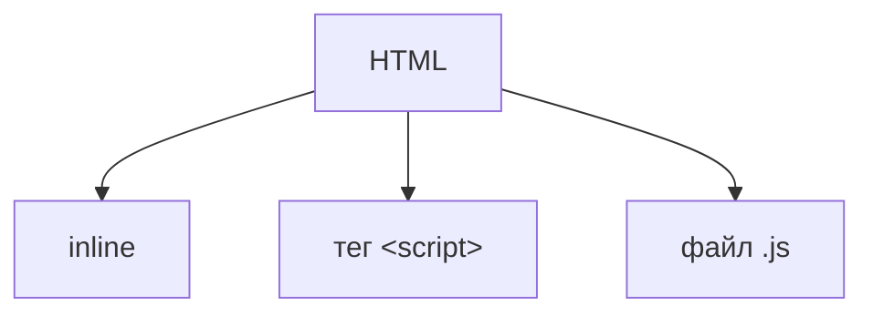

import ExternalCodeEmbed from '@site/src/components/ExternalCodeEmbed';


# Структура и подключение JavaScript-кода

<div class="article-tags">
  <span class="tag tag-required">ОБЯЗАТЕЛЬНО</span>
  <span class="tag tag-beginner">ДЛЯ НОВИЧКОВ</span>
</div>

<span class="complexity-badge">Разработчику</span>
<span class="complexity-badge">Архитектору</span>

---

## Подключение и структура кода

### Способы подключения скриптов



JavaScript можно добавить на страницу трёмя способами:
- как значение атрибута в теге (inline);
- как отдельный тег `<script>`;
- как отдельный файл в формате `.js`.

---

### Встроенный скрипт (inline)

> **Встроенный скрипт (Inline Script)** — это фрагмент кода, который выполняется непосредственно внутри документа или файла, в котором он находится, без необходимости выносить его в отдельный внешний файл и подключать через тег ссылки (например, `<script src="...">`).

Код находится внутри того же источника данных, где он используется. Скрипт загружается и интерпретируется/компилируется вместе с основным файлом. Браузер или интерпретатор встречает этот блок и выполняет его сразу при чтении потока данных.

**Встроенный скрипт (inline)** – прямо внутри HTML, путём указания функции сразу после события в теге (однако это загромождает HTML):

```html
<button onclick="alert('Привет!')">Нажми меня</button>
```
Встроенный скрипт работает благодаря интеграции всех возможностей в современных браузерах, позволяя не добавлять обширный скрипт для простых активностей. К примеру, если страница простая и не несёт в себе глубокой логики, работы с данными и задача лишь добавить немного "специй" к элементу – выполняется просто добавление выполнения функции в соответствующий тег.

Таким образом, мы получаем JavaScript возможность внутри HTML-тега.

Но использовать этот метод не рекомендуется, если задач много – допустим, если будет несколько десятков кнопок на странице, и у каждой будет расписан скрипт внутри атрибутов тегов кнопок – будет страшный и плохо читаемый код.

Вариант 1. Обработчик события как атрибут тега

```html
<тег событие="выражение_или_вызов_функции">
```
Примеры:
- `<button onclick="alert('Привет!')">Нажми</button>`
- `<input oninput="validate(this.value)">`
- `<div onmouseover="highlight()" onmouseout="unhighlight()">`

Этот шаблон описывает прямое связывание пользовательского действия (события) с выполнением JavaScript-выражения прямо в разметке.

Вариант 2. Вызов функции из глобальной области видимости  
```html
<тег событие="имяФункции(аргументы)">
```
Пример:
- `<button onclick="submitForm()">Отправить</button>`

Подразумевается, что `имяФункции` объявлена в глобальной области видимости — либо в теге `<script>`, либо во внешнем файле, подключённом до этого элемента.

Вариант 3. Использование стрелочной функции в inline-обработчике  
```html
<button onclick="(() => { alert('Сработало!'); })()">Жми</button>
```
Редкий, но возможный шаблон, позволяющий использовать современный синтаксис даже в inline-контексте. Не рекомендуется из-за снижения читаемости.

Вариант 4. Передача контекста элемента в обработчик  
```html
<button onclick="handleClick(this)">Кнопка</td>
```
```html
<script>
  function handleClick(element) {
    element.style.backgroundColor = "yellow";
  }
</script>
```
Шаблон позволяет передавать сам HTML-элемент в функцию, что удобно для динамического изменения его свойств.

---

### Код внутри тега `script`

> Тег `<script>` — это элемент HTML, предназначенный для встраивания или подключения исполняемого кода (скриптов) в документ. Служит мостом для загрузки внешнего ресурса, содержащего логику, по URL.

Тег является контейнером. Между открывающим `<script>` и закрывающим `</script>` помещается код, либо указывается ссылка на внешний файл через атрибут `src`.

**Внутри** `<script>` в HTML – код пишется в качестве содержимого тега:

```html
<script>
  console.log("Этот код выполнится сразу!");
</script>
```
Этот подход отличается от предыдущего тем, что скрипт – это содержимое тега `<script>` - все необходимые функции вписываются между открывающим и закрывающим тегом. Он подойдёт для случаев, когда на странице немного логики, и её можно упаковать в одном месте.

Тегов `<script>` на странице может быть много, но, если они разбросаны по всему коду страницы, расположены в разных местах – читать будет очень сложно. Если понадобится поменять что-то, что используется везде – можно упустить фрагмент, или где-то поломать логику.

Если строк кода в теге много (понятие растяжимое, но, к примеру, больше двадцати), то лучше выделить отдельным файлом.


```html
<script>
  // последовательность инструкций JavaScript
</script>
```
Пример:
```html
<script>
  function greet() {
    console.log("Привет!");
  }
  greet();
</script>
```
Этот шаблон используется для размещения логики непосредственно в теле HTML-документа. Код выполняется сразу при загрузке парсера до этого места.

Инициализация по событию `DOMContentLoaded`  
```html
<script>
  document.addEventListener("DOMContentLoaded", function() {
    // логика после построения DOM
  });
</script>
```
Этот шаблон гарантирует, что скрипт будет работать только после того, как вся HTML-разметка станет доступна.

Присвоение обработчика через свойство DOM-элемента  
```html
<script>
  document.getElementById("myButton").onclick = function() {
    // действие
  };
</script>
```
Альтернатива встроенным атрибутам: обработчик назначается программно, что улучшает разделение разметки и логики.

**Ключевые атрибуты `<script>`:**
- `src`: Указывает путь к внешнему файлу со скриптом. Если этот атрибут присутствует, содержимое тега - риется (внутренний код не выполняется).
- `type`: Определяет тип медиа-контента скрипта. Стандартное значение для JavaScript — `text/javascript`. В - емных стандартах HTML5 этот атрибут часто опускается, так как JavaScript является языком по умолчанию.
- `defer`: Указывает браузеру отложить выполнение скрипта до момента полной обработки HTML-документа - синга). Этпредотвращает блокировку рендеринга страницы.
- `async`: Загружает скрипт асинхронно (не дожидаясь окончания парсинга HTML) и выполняет его сразу после - уз, не гарантируя порядок выполнения нескольких скриптов с этим атрибутом.
- `integrity`: Используется для проверки целостности файла (SRI — Subresource Integrity) путем сравнения -  зауженного файла с указанным значением (защита от подмены кода).
- `crossorigin`: Определяет режим передачи CORS (Cross-Origin Resource Sharing) при загрузке внешнего - пта.
- `nonce` / `hash`: Используются для реализации политик безопасности контента (CSP), разрешающих выполнение только определенных скриптов.

---

### Подключение внешнего файла

**Подключение внешнего файла** – самый лучший вариант, когда JS-код пишется в отдельном файле с расширением .js, а в HTML указывается путь к этому файлу:

```javascript
<script src="script.js" defer></script>
```


> Использование атрибутов `defer` (для скриптов, зависящих от DOM) и `async` (для независимых скриптов, например, аналитики) позволяет оптимизировать время загрузки страницы.

Таким образом, к HTML-файлу добавляется ещё один файл, содержащий код. Он работает аналогично тегу `<script>`, но его содержимым будет являться ссылка на файл (в атрибуте "src". Если файл расположен в той же папке, что и HTML, можно просто указать, к примеру "script.js". Если же файл в другой папке, или размещён на каком-то сетевом ресурсе, то нужно указать путь к файлу (ссылку). Так, если страниц и скриптом много, они распределяются по папке согласно структуре, задуманной проектировщиком сайта. В самом JS-файле же, какие-либо открывающие/закрывающие теги не требуются. Просто код.

И только в самом начале разработки страницы "пустые", что может создать иллюзию безопасности в стиле "потом разберусь!". 

Нет! Любой продукт со временем наращивает функционал, расширяясь, улучшаясь. Поначалу это "Привет!", а потом понадобится менять значение текста, а затем и локализовать на другие языки, добавлять дополнительную логику – вот поэтому лучше выделить код отдельно. А на практике, задачи совсем сложнее, и язык ппредоставляет гораздо больше возможностей.

```html
<script src="app.js" defer></script>
```
или
```html
<script src="analytics.js" async></script>
```
Эти шаблоны определяют момент выполнения скрипта:
- `defer` — после полной загрузки DOM;
- `async` — сразу после загрузки файла, без блокировки парсинга.

---

### Выполнение кода

Скрипт выполняется в соответствии с кодом, указанным в файле/теге, и чтобы машина поняла человекочитаемый код, компиляция выполняется силами движка JS, который встроен в браузер.


JavaScript использует JIT-компиляцию.

**JIT-компиляция (Just-In-Time)** – компиляция "на лету", когда движок JS (например, V8) не компилирует весь код заранее, а делает это во время выполнения:
	- сначала код выполняется построчно (медленно) – это интерпретация;
	- потом движок находит "горячие" участки (часто выполняемый код) – это профилирование;
	- "горячие" участки компилируются в машинный код для ускорения – это оптимизированная компиляция;
	- если предположения движка оказались неверными, код возвращается к интерпретации – это деоптимизация.

---

### Правила хорошего JS-кода

Хороший JS-код должен быть:
	- читаемым (с отступами и комментариями);
	- модульным (разбит на логические блоки);
	- избегающим глобальных переменных (чтобы не было конфликтов).

**Читаемость** – понятие, конечно, субъективное, и если для новичка может быть что-то вполне читабельным, то для синьора – неприемлемо, либо наоборот. Здесь влияет и стиль написания, и стандарты в компании разработчика, и пожелания заказчика, и даже опыт программиста. Но принципа следует придерживаться следующего – дочерние элементы и строки лучше выделять отступом:

```javascript
уровень 1
уровень 1 {
    уровень 2 {
        уровень 3
    } //закрывающие символы уровня 2
} //закрывающие символы уровня 1
```


Модульность подразумевает разделение по функциям, без "свалки". Словом, если у нас есть три функции, монолитно (едино) написали бы мы так:

```javascript
функция {
    действие1;
    действие2;
    действие3;
}
```
Но если на практике это будет нечитабельно – это раз, и в случае разбора ошибок – вылетит вся функция, даже если ошибочно было лишь действие2. А если нам в другой части кода пригодится функционал действия3, то удобнее будет вызвать функцию, которая выполняет только действие3. Вот и весь смысл. Ведь намного удобнее разбираться в таком подходе:

```javascript
функция1 {
    действие1;
}

функция2 {
    действие2;
}

функция3 {
    действие3;
}
```

---

### Структура кода

Код состоит из следующих компонентов:
	- импорты, которые указывают, какие дополнительные модули используются (если они нужны);
	- константы и настройки – то, что будет использоваться в функциях;
	- основные функции, содержащие логику;
	- обработчики событий;
	- инициализаторы;
	- комментарии.

Все эти компоненты мы разберём позднее. Но для начала, нам нужно увидеть, как это выглядит на практике:


<ExternalCodeEmbed example="javascript/js-501-13-001" title="Структура кода" minHeight={552} />


#### 1. Импорт модулей

```javascript

import { <имя> } from '<путь_к_модулю>';

```
Пример:
```javascript

import { fetchData, validateInput } from './utils/api.js';

```

Этот шаблон описывает подключение внешних функций, классов или значений из других файлов. Он используется в начале файла и определяет зависимости текущего модуля.

В **браузере** без сборки ESM подключают через `type="module"` — [ES-модули в браузере](./40.md). В **Node.js** — CommonJS или ESM; подробности ниже в разделе [Модули в Node.js](#модули-в-nodejs).

#### 2. Объявление констант и настроек

```javascript
const <ИМЯ_КОНСТАНТЫ> = <значение>;
```
Пример:
```javascript
const API_BASE_URL = "https://api.example.com/v1";
const MAX_RETRY_COUNT = 3;
```

Константы группируются в начале файла и используются как неизменяемые значения, задающие поведение программы.

#### 3. Объявление функции

```javascript
function <имяФункции>(<параметры>) {
  // тело функции
}
```
Пример:
```javascript
function greetUser(name) {
  return `Привет, ${name}!`;
}
```

Функция инкапсулирует логически завершённую операцию и может быть вызвана из других частей программы.

#### 4. Стрелочная функция (часто для обработчиков)

```javascript
const <имя> = (<параметры>) => {
  // тело
};
```
Пример:
```javascript
const handleClick = (event) => {
  console.log("Кнопка нажата:", event.target);
};
```

Стрелочные функции удобны для кратких действий и сохранения контекста `this`.

#### 5. Присваивание переменной через деструктуризацию

```javascript
const { <свойство1>, <свойство2> } = <объект>;
```
Пример:
```javascript
const { id, name } = user;
```

Этот шаблон упрощает доступ к полям объекта и делает код более выразительным.


#### 6. Вызов метода объекта

```javascript
<объект>.<метод>(<аргументы>);
```
Пример:
```javascript
document.getElementById("submit").addEventListener("click", handleSubmit);
```

Отражает взаимодействие с DOM или другими объектами через их интерфейсы.

#### 7. Условный оператор

```javascript
if (<условие>) {
  // действие при истине
} else if (<условие>) {
  // другое действие
} else {
  // действие по умолчанию
}
```
Пример:
```javascript
if (user.isAuthenticated) {
  showDashboard();
} else {
  redirectToLogin();
}
```

Условные конструкции управляют потоком выполнения в зависимости от состояния данных.

#### 8. Обработчик события

```javascript
<элемент>.addEventListener("<событие>", <функцияОбработчик>);
```
Пример:
```javascript
button.addEventListener("click", () => alert("Нажато!"));
```

Этот шаблон связывает пользовательские действия с логикой приложения без загромождения HTML.

#### 9. Инициализация после загрузки DOM

```javascript
document.addEventListener("DOMContentLoaded", () => {
  // инициализация
});
```
Пример:
```javascript
document.addEventListener("DOMContentLoaded", initApp);
```

Гарантирует, что скрипт начнёт работу только после полной загрузки разметки.

---

## Модули в Node.js

Большую программу делят на **файлы-модули**. Идентификаторы внутри файла по умолчанию **локальны**; то, что нужно снаружи, **экспортируют** явно. Каталог с `package.json` — **npm-пакет**. Node.js поддерживает **CommonJS** (исторически) и **ECMAScript modules** (ESM, стандарт языка).

Первый запуск проекта — [Первая программа на Node.js](./3-ecosystem/1-runtime-node/262.md). Обзор на уровне платформы — [Node.js — серверный JavaScript](./3-ecosystem/1-runtime-node/26.md).

### CommonJS — `require` и `module.exports`

```javascript
// math.cjs (или math.js без "type": "module")
function add(a, b) {
  return a + b;
}
module.exports = { add };
```

```javascript
// app.cjs
const { add } = require('./math');
console.log(add(2, 3)); // 5
```

| Конструкция | Роль |
|-------------|------|
| `require('path')` | Загрузить модуль (синхронно) |
| `module.exports` | То, что вернёт `require` |
| `exports.x = …` | Сокращение для `module.exports.x = …` |
| `__filename`, `__dirname` | Путь к файлу и каталогу (только CJS) |

#### Ловушка `exports` против `module.exports`

`exports` — ссылка на **тот же объект**, что изначально лежит в `module.exports`. Но возвращает `require` именно **`module.exports`**, а не переменную `exports`.

```javascript
// Неверно — exports переназначили, module.exports не изменился
exports = { x: 1 };

// Верно
module.exports = { x: 1, y: 2 };
// или
exports.x = 1;
exports.y = 2;
```

### Кэш модулей

Первый `require('./config')` **выполняет** файл и кладёт результат в `require.cache`. Повторный `require` того же пути возвращает **тот же объект** без повторного запуска кода.

```javascript
const a = require('./singleton');
const b = require('./singleton');
console.log(a === b); // true
```

Принудительная перезагрузка (редко, в основном тесты):

```javascript
const path = require.resolve('./singleton');
delete require.cache[path];
const fresh = require('./singleton');
```

### Как Node.js ищет модуль

| Аргумент `require` | Порядок поиска |
|--------------------|----------------|
| `'fs'`, `'path'` | Встроенные модули Node |
| `'./file'`, `'../dir/file'` | Относительно текущего файла; расширения `.js`, `.json`, `.node` |
| `'lodash'` | `node_modules` в текущем каталоге → родитель → … до корня |
| `'./packages/ui'` | Каталог с `package.json` → поле **`main`**; иначе `index.js` |

Пути поиска npm-пакетов видны в `module.paths`. Дополнительные каталоги — через **`NODE_PATH`** (переменная окружения; в обычных проектах почти не нужна).

Глобально установленные пакеты (`npm install -g`) **не** подхватываются `require('имя')` — только локальный `node_modules`.

### ECMAScript modules (ESM)

В `package.json` укажите `"type": "module"` или используйте расширение `.mjs`:

```javascript
// math.js
export function add(a, b) {
  return a + b;
}
export default class Calculator {}
```

```javascript
// app.js

import Calculator, { add } from './math.js';

```

| CJS | ESM |
|-----|-----|
| `require()` | `import` / `export` |
| Синхронная загрузка | Статический анализ импортов |
| `module.exports` | `export` / `export default` |
| `__dirname` | `import.meta.url` + `fileURLToPath` |

**Динамический импорт** (и в CJS, и в ESM):

```javascript
const mod = await import('./heavy.js');
```

### `package.json` — точка входа и условные экспорты

| Поле | Назначение |
|------|------------|
| `"main"` | Файл по умолчанию при `require('имя-пакета')` |
| `"type": "module"` | `.js` трактуются как ESM |
| `"exports"` | Явные точки входа (Node 12+, рекомендуется библиотекам) |
| `"imports"` | Внутренние алиасы `#utils` → `./src/utils.js` |

Пример `"exports"` для библиотеки:

```json
{
  "name": "my-lib",
  "exports": {
    ".": "./dist/index.js",
    "./feature": "./dist/feature.js"
  }
}
```

Клиент: `import { x } from 'my-lib/feature'`.

### Смешение CJS и ESM

| Направление | Как |
|-------------|-----|
| ESM → CJS | `import pkg from 'legacy-pkg'` (default = `module.exports`) |
| CJS → ESM | `await import('./esm.mjs')` |
| ESM → ESM | `import` с расширением `.js` в пути |

Прямой `require()` внутри ESM-файла недоступен; прямой `import` в CJS-файле — тоже (только `import()`).

<div class="callout callout--tip">
  <div class="callout-title">Где углубиться</div>

  <div class="callout-body">
  <ul>
  <li>Браузер, <code>type="module"</code> — <a href="./40.md">ES-модули в браузере</a></li>
  <li>npm, <code>node_modules</code>, фреймворки — <a href="./3-ecosystem/1-runtime-node/26.md">26.md</a></li>
  <li>Практика <code>npm init</code> и скрипты — <a href="./3-ecosystem/1-runtime-node/262.md">262.md</a></li>
  <li>Справочник — <a href="./3-ecosystem/1-runtime-node/261.md">261.md</a></li>
  </ul>
  </div>
</div>

---
