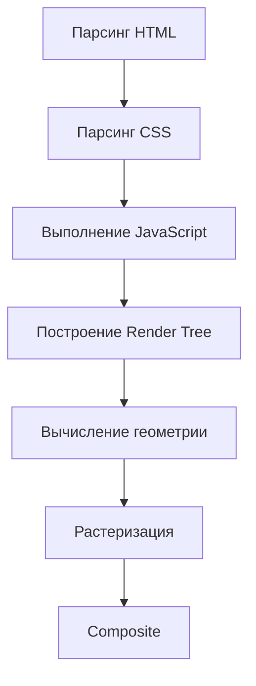

import JavaScriptRuntimePlay from '@site/src/components/JavaScriptRuntimePlay.jsx';

# Применение JavaScript в вебе и за его пределами

<div class="article-tags">
  <span class="tag tag-required">ОБЯЗАТЕЛЬНО</span>
  <span class="tag tag-beginner">ДЛЯ НОВИЧКОВ</span>
</div>

<span class="complexity-badge">Разработчику</span>
<span class="complexity-badge">Архитектору</span>

---

## Применение JavaScript в вебе и за его пределами

JavaScript — единственный язык программирования, изначально предназначенный для непосредственного выполнения в среде веб-браузера и впоследствии адаптированный для серверной среды. Его уникальность заключается в тесной интеграции с моделью документа (DOM), событийной системой, асинхронной моделью выполнения и ограниченной, но гибкой средой исполнения. Чтобы понять, как работает JavaScript, необходимо рассматривать его не изолированно, а как часть целостного механизма взаимодействия между пользователем, разметкой, стилями и логикой.

---

### Где применяется JavaScript?

JavaScript является одним из самых востребованных языков в мире IT.

| Область | Основной инструмент/технология | Характер применения |
| :--- | :--- | :--- |
| **Веб-фронтенд** | Ванильный JS, React, Vue, Angular | Интерфейс, логика взаимодействия, анимации. |
| **Веб-бэкенд** | Node.js, Express, NestJS | Серверная логика, API, работа с БД. |
| **Мобильные приложения** | React Native, Ionic | Кроссплатформенные мобильные интерфейсы. |
| **Десктоп** | Electron, Tauri | Программы для ПК на базе веб-технологий. |
| **Игры** | Phaser, Three.js, Babylon.js | Браузерные и легкие мобильные игры. |
| **IoT** | Johnny-Five, Espruino | Управляющие скрипты для "железа". |
| **Автоматизация** | Puppeteer, Selenium (JS API) | Тестирование, парсинг, боты. |

<JavaScriptRuntimePlay />

---

### Веб-приложение и стек браузера

**Веб-приложение** — программа, с которой пользователь работает через браузер: интерфейс описывают HTML и CSS, поведение и обмен данными — JavaScript. От простого **сайта** (преимущественно статичные страницы и переходы по ссылкам) веб-приложение отличают насыщенная интерактивность, состояние на клиенте и частые запросы к API без полной перезагрузки. Крупные примеры — почта, CRM, редакторы документов, соцсети. Общая архитектура веба — в разделе [Веб-сайты и веб-приложения](/encyclopedia/2-system-network/2-04-kak-rabotayut-sayty-i-veb-sayty/intro).

Типичная эволюция клиента:

1. Формы с полной перезагрузкой страницы.
2. **AJAX** — точечное обновление DOM после фонового HTTP-запроса ([асинхронность](./21.md)).
3. **SPA** — одна HTML-оболочка, маршруты и экраны рисует JavaScript ([история](./11.md)).
4. Push-модели (**Comet**, SSE, WebSocket) — сервер сам шлёт события ([поток с сервера](./37.md)).

**Chromium** — открытый проект браузера (движок Blink для разметки и **V8** для JavaScript). На его базе собраны Google Chrome, Microsoft Edge, Opera, Brave и другие. Открытый код ускорил унификацию веб-стандартов и производительности JS.

**V8** компилирует JavaScript в машинный код (JIT): сначала быстрый байткод в интерпретаторе Ignition, затем оптимизация «горячих» функций в TurboFan. Тот же V8 встроен в **Node.js**, поэтому один язык и схожая семантика на клиенте и сервере.

**Electron** объединяет **Chromium** (окно и отрисовка UI) и **Node.js** (файлы, процессы, нативные диалоги). Получается десктопное приложение на HTML/CSS/JS; подробнее — [десктоп на Electron](/encyclopedia/4-code-dev/4-11-desktopnye-prilozheniya/118).

**Букмарклет** (bookmarklet) — закладка браузера с URL вида `javascript:...`, которая выполняет короткий скрипт на открытой странице (подсветка ссылок, извлечение данных). До расширений Chrome/Firefox это был способ «расширить» любой сайт без установки; сегодня чаще используют DevTools, userscripts или официальные API расширений ([экосистема](./25.md)).

---

#### Frontend

Веб-разработка (Frontend) - основное и самое известное применение JavaScript. Любой современный браузер поддерживает этот язык, что позволяет ему управлять внешним видом и поведением веб-страниц.

**Задачи, решаемые JS во фронтенде:**
- **Интерактивность интерфейса:** Реакция на действия пользователя (клики, наведение курсора, прокрутка).
- **Динамическое изменение контента:** Обновление части страницы без перезагрузки всего документа (AJAX, Fetch API).
- **Валидация форм:** Проверка корректности введенных данных пользователем до отправки на сервер.
- **Анимации и эффекты:** Создание плавных переходов, слайдеров, модальных окон и визуальных эффектов.
- **Работа с DOM:** Изменение структуры HTML-документа и его стилей (CSS) программным путем.
- **Управление состоянием:** Хранение временных данных приложения в памяти браузера.

---

#### Backend

Серверная разработка (Backend) - второе направление. С появлением среды выполнения **Node.js** JavaScript вышел за пределы браузера и стал полноценным инструментом для создания серверной части приложений. Это позволяет использовать один язык программирования для всей системы (Fullstack).

**Области применения JS на сервере:**
- **Веб-серверы:** Создание API, обработка HTTP-запросов и ответом клиентам.
- **Микросервисная архитектура:** Построение легких и масштабируемых сервисов.
- **Работа с базами данных:** Подключение к SQL и NoSQL базам (MongoDB, PostgreSQL, Redis) через драйверы.
- **Очереди задач:** Обработка фоновых задач, таких как отправка писем или генерация отчетов.
- **Стриминг данных:** Работа с потоками данных в реальном времени (WebSockets).

---

#### Mobile

JavaScript используется для создания кроссплатформенных мобильных приложений, которые работают на iOS и Android с использованием единой кодовой базы.

**Основные технологии:**
- **React Native:** Фреймворк от Facebook, позволяющий создавать нативные приложения с использованием синтаксиса React и JavaScript.
- **Ionic / Capacitor:** Инструменты для создания гибридных приложений, работающих внутри WebView, но использующих доступ к нативным функциям устройства.
- **Expo:** Надстройка над React Native, упрощающая процесс разработки и тестирования мобильных приложений.

На **умных ТВ и встроенных устройствах** интерфейсы тоже часто пишут на веб-стеке. Платформа **webOS** (изначально Palm, затем LG) строила пользовательский опыт на HTML, CSS и JavaScript — тот же язык, что в браузере, но в иной хост-среде без привычного `window` для десктопа.

---

#### Десктопные приложения

С помощью специальных инструментов JavaScript позволяет создавать программы для установки на компьютеры (Windows, macOS, Linux).

**Инструменты:**
- **Electron:** Платформа, на которой работают такие популярные приложения, как Visual Studio Code, Slack, Discord, Telegram Desktop. Позволяет использовать веб-технологии для создания нативных окон.
- **NW.js (ранее node-webkit):** Альтернативный движок для создания десктопных приложений.
- **Tauri:** Современный фреймворк, создающий легкие приложения, использующие системные компоненты браузера, но с меньшим весом, чем Electron.

---

#### Разработка игр (Game Разработка)

JavaScript широко используется для создания браузерных игр и мобильных проектов благодаря своей легкости и доступности.

**Инструментарий:**
- **Движки:** Phaser, Pixi.js, Three.js (для 3D), Babylon.js.
- **Форматы:** HTML5 Canvas, WebGL для рендеринга графики.
- **Платформы:** Игры запускаются непосредственно в браузере без необходимости установки дополнительных плагинов.

---

#### IoT и встроенные системы (Internet of Things)

Благодаря проектам вроде **Johnny-Five** и **Espruino**, JavaScript может выполняться на микроконтроллерах и одноплатных компьютерах (Raspberry Pi, Arduino). На **micro:bit** в школах чаще MakeCode (тоже JavaScript во вкладке редактора) — [примеры с разбором](/lab/Примеры/1135#microbit). Базовые скетчи на **Arduino** на C++ — там же, раздел Arduino.

**Сценарии использования:**
- Управление датчиками температуры, влажности, движения.
- Контроль светодиодов, моторов и реле.
- Сбор данных с устройств и их отправка в облако.
- Создание умных домашних устройств (умный дом).

---

#### Автоматизация и скриптинг

JavaScript часто используется для написания скриптов автоматизации в различных средах.

**Примеры:**
- **Скрипты для браузера:** Расширения для Chrome/Firefox, автоматизирующие работу с сайтами.
- **Тестирование:** Инструменты вроде Puppeteer и Cypress для автоматического тестирования веб-приложений (написание сценариев действий пользователя).
- **DevOps:** Скрипты для сборки проектов, деплоя и настройки инфраструктуры (часто в связке с Node.js).

---

### Роль JavaScript в веб-архитектуре

В классической клиент-серверной модели веба HTML отвечает за структуру документа, CSS — за его визуальное оформление, а JavaScript — за динамику и поведение. Без JavaScript страница остаётся статичной: она может быть красивой, информативной, но не интерактивной. С внедрением JavaScript документ становится живым объектом, способным реагировать на действия пользователя, обновлять содержимое без перезагрузки, анимировать переходы, обмениваться данными с сервером и даже управлять устройствами (камера, геолокация, Bluetooth и др.).

С технической точки зрения, JavaScript — это *скриптовый язык*, выполняемый *интерпретатором*, встроенным в браузер. Этот интерпретатор называется **движком JavaScript**. Наиболее распространённые движки:

- **V8** — в Google Chrome и Chromium-производных (Edge, Brave, Opera); также лежит в основе Node.js.  
- **SpiderMonkey** — в Mozilla Firefox.  
- **JavaScriptCore (Nitro)** — в Safari (WebKit).  
- **Chakra** — использовался в старых версиях Microsoft Edge (до перехода на Chromium).

Связка **Chromium + V8** сегодня доминирует на десктопе; на iOS по политике Apple веб-движок — **WebKit** (JavaScriptCore). Node.js и Deno встраивают V8 (или иной движок) без DOM, зато с файловой системой и сетевыми сокетами.

Эти движки реализуют стандарт **ECMAScript** — спецификацию, утверждаемую комитетом TC39. Фактически, "JavaScript" — это реализация ECMAScript в браузере (с расширениями в виде Web API: DOM, Fetch, Canvas и др.). На сервере, например, в Node.js, JavaScript также выполняется движком V8, но без Web API — вместо них доступны системные API (файловая система, сеть, потоки процессора и т.п.).

> **Важно:** Сам по себе язык (ECMAScript) не содержит встроенных возможностей для работы с DOM, сетью или таймерами. Эти возможности предоставляются *хост-средой* — браузером или Node.js. Именно поэтому один и тот же синтаксис `fetch('/api/data')` работает в браузере, но не в "чистом" V8 без обёртки.

---

### Как браузер выполняет JavaScript

Браузер не "запускает" JavaScript как отдельную программу. Вместо этого он встраивает его в общий цикл обработки страницы. Каждый раз, когда браузер встречает тег `<script>` при парсинге HTML, он приостанавливает построение DOM и выполняет содержимое скрипта (если не указан атрибут `async` или `defer`). Этот процесс неизбежно связан с другими этапами отрисовки — и именно здесь возникают типичные проблемы производительности.

Рассмотрим **полную последовательность этапов обработки веб-страницы**, включая роль JavaScript:



1. **Парсинг HTML**  
   Браузер читает HTML-код с верху вниз и строит дерево узлов — **DOM (Document Object Model)**. DOM — это иерархическая структура, где каждый элемент (`<div>`, `<p>`, `<button>`) представлен как объект с атрибутами, дочерними элементами и поведением.

2. **Парсинг CSS и построение CSSOM**  
   Параллельно (или при обнаружении `<style>` и `<link rel="stylesheet">`) браузер обрабатывает стили и строит **CSSOM (CSS Object Model)** — дерево правил, применяемых к элементам DOM. CSSOM необходим для определения, *как именно* будет выглядеть каждый элемент.

3. **Выполнение JavaScript**  
   При встрече с `<script src="...">` или встроенным `<script>...</script>` браузер:
   - (если скрипт не асинхронный) **приостанавливает парсинг HTML**;  
   - загружает и выполняет JavaScript-код;  
   - в процессе выполнения код может:
     - читать и изменять DOM и CSSOM;
     - добавлять новые элементы (`document.createElement`);
     - удалять или перестраивать существующие;
     - запрашивать ресурсы (`fetch`, `XMLHttpRequest`);
     - регистрировать обработчики событий (`addEventListener`).

   Именно на этом этапе возникает **блокировка рендеринга**. Скрипт может изменить DOM, который уже частично построен — и тогда браузер вынужден перестраивать дерево с того места, где произошло изменение.

4. **Построение Render Tree**  
   После завершения парсинга HTML и CSS, а также выполнения всех синхронных скриптов, браузер объединяет DOM и CSSOM в **дерево отрисовки (Render Tree)**. В это дерево попадают только видимые элементы — например, элементы со стилем `display: none` или `<script>` исключаются.

5. **Layout (Reflow)**  
   Для каждого узла Render Tree вычисляются точные геометрические параметры: размеры, координаты, положение относительно родителей и окна. Этот процесс называется **layout** (в WebKit) или **reflow**. Он затратен: изменение геометрии одного элемента может повлечь перерасчёт всей подветки дерева.

6. **Paint (Rasterization)**  
   Браузер преобразует узлы Render Tree в пиксели — заполняет цвета, текстуры, тени, границы. Этот этап может происходить на GPU (в отдельных слоях) для ускорения.

7. **Composite**  
   Если элементы находятся на разных слоях (например, из-за `transform` или `will-change`), браузер собирает их в единое изображение — как художник накладывает прозрачные плёнки друг на друга.

JavaScript может влиять на **любой из этих этапов**:
- Изменение `element.style.width` → **reflow**;  
- Изменение `element.style.backgroundColor` → **repaint** (но не reflow);  
- Изменение `transform` → только **composite** (оптимально).

Это объясняет, почему "браузеры кушают память": каждый скрипт, особенно некорректно написанный (утечки памяти, бесконечные таймеры, замыкания с ссылками на DOM), увеличивает объём удерживаемых объектов. А поскольку DOM-узлы, обработчики событий и замыкания хранятся в куче JavaScript-движка, их накопление приводит к росту потребления памяти — вплоть до замедления или краха вкладки.

> **Стоит подчеркнуть:** Память "съедает" *некорректное использование* возможностей в связке с DOM. На сервере (Node.js), где DOM отсутствует, аналогичные утечки происходят реже — если только разработчик не создаёт глобальные коллекции, не отписывается от событий или не хранит ссылки на большие буферы.

---

### Архитектура выполнения

JavaScript — язык с *динамической типизацией*, *однопоточной* (на уровне события) и *асинхронной* моделью выполнения. Эти три свойства определяют, как движок обрабатывает код.

---

#### Лексический анализ и синтаксический парсинг

Перед выполнением движок проходит два этапа:

- **Лексический анализ (tokenization)** — разбиение исходного кода на "токены": ключевые слова (`if`, `function`), идентификаторы (`x`, `getData`), литералы (`42`, `"hello"`), операторы (`+`, `===`) и т.д.  
- **Синтаксический анализ (parsing)** — построение **абстрактного синтаксического дерева (AST)** из токенов. AST — это структурированное представление программы, по которой движок может строить план выполнения.

Например, код:  
```js
const a = 1 + 2;
```  
превращается в AST с узлами `VariableDeclaration`, `Identifier`, `BinaryExpression`, `Literal`.

Современные движки (особенно V8) используют **Just-In-Time (JIT) компиляцию**: сначала интерпретируют код (через *Ignition* — интерпретатор), затем по мере выполнения профилируют "горячие" функции и компилируют их в машинный код (*TurboFan* — оптимизирующий компилятор). Это позволяет сочетать гибкость интерпретации с производительностью компиляции.

---

#### Выполнение и вызовный стек

JavaScript использует **стек вызовов (Call Stack)** — LIFO-структуру, фиксирующую, какие функции в данный момент выполняются. Каждый вызов функции добавляет новый фрейм в стек; возврат из функции — удаляет его.

Пример:
```js
function greet(name) {
  return "Hello, " + name;
}
function main() {
  console.log(greet("Тимур"));
}
main();
```
Последовательность вызовов (стек растёт вниз):

```javascript
main();           // фрейм main
  greet('Тимур'); // фрейм greet поверх main
  // return → greet снят
  console.log(...);
// main завершён → стек пуст
```

Если функция вызывает себя рекурсивно без условия выхода — стек переполняется (**Stack Overflow**).

---

#### Модель событий и цикл событий (Event Loop)

Поскольку JavaScript однопоточен, он не может одновременно выполнять функцию и ждать ответа от сервера. Решение — **асинхронная модель с циклом событий**.

Когда движок встречает асинхронную операцию (таймер `setTimeout`, сетевой запрос `fetch`, ввод-вывод в Node.js), он *делегирует* её внешней среде (браузеру или системе), продолжая выполнять синхронный код. По завершении операции соответствующий **коллбэк** помещается в **очередь задач (task queue)**.

Цикл событий (Event Loop) — это бесконечный цикл, который:
- проверяет, пуст ли **Call Stack**;  
- если да — извлекает первую задачу из очереди и помещает её в стек.

Таким образом, `setTimeout(() => console.log(1), 0)` не выполняется *сразу* — только после того, как текущий синхронный код (включая все вложенные вызовы) завершится.

Это объясняет поведение:
```js
console.log("A");
setTimeout(() => console.log("B"), 0);
console.log("C");
// Вывод: A → C → B
```

Важно: очередь не одна. В спецификации различают:
- **Macrotasks** (основная очередь): `setTimeout`, `setInterval`, `requestAnimationFrame`, ввод-вывод, события DOM;  
- **Microtasks** (очередь более высокого приоритета): `Promise.then`, `queueMicrotask`, `MutationObserver`.

Цикл событий отрабатывает *все* microtasks после каждого macrotask’а, но *до* отрисовки. Это критично для согласованности DOM и Promise-цепочек.

---

#### Управление памятью

JavaScript использует автоматическое управление памятью через **сборку мусора (Garbage Collection)**. Основная стратегия — **достижимость (reachability)**: объект остаётся в памяти, пока на него есть ссылка из "корня" (глобальный объект `window`, текущий стек вызовов, активные замыкания, DOM-узлы, зарегистрированные обработчики).

Пример утечки:
```js
function setup() {
  const largeData = new Array(1e6).fill(0);
  document.getElementById("btn").addEventListener("click", () => {
    console.log(largeData.length); // замыкание захватывает largeData
  });
}
setup();
// largeData не будет удалён, даже после завершения setup()
```
Здесь `largeData` остаётся достижимым через замыкание, привязанное к обработчику события. Чтобы избежать утечки, нужно отписаться от события или явно обнулить ссылку.

Современные сборщики мусора работают инкрементально и консервативно, но всё равно вызывают паузы — особенно при больших объёмах данных. Хорошая практика — минимизировать время жизни временных объектов и избегать глобальных переменных.

---

## Лексическая структура JavaScript

Прежде чем писать работающий код, необходимо понимать, из каких "кирпичиков" он состоит. Лексическая структура (lexical structure) определяет, какие символы и последовательности считаются допустимыми в языке. Это не просто формальность — нарушение этих правил приводит к синтаксическим ошибкам ещё до начала выполнения.

---

### Чувствительность к регистру

JavaScript **чувствителен к регистру** (*case-sensitive*). Это означает, что идентификаторы `name`, `Name`, `NAME` — три разных переменных. То же касается ключевых слов: `function` допустимо, `Function` — нет (это встроенный конструктор, но не ключевое слово).

Практическое следствие:  
- `getElementById` — корректный метод;  
- `getelementbyid` — ошибка (метод не существует).  

Чувствительность к регистру повышает точность и выразительность, но требует дисциплины. Особенно важно при работе с API, где имена часто следуют соглашениям:  
- `camelCase` — стандарт для переменных и методов (`userProfile`, `calculateTotal`);  
- `PascalCase` — для конструкторов и классов (`HttpRequest`, `DatabaseConnection`);  
- `UPPER_SNAKE_CASE` — для констант (`MAX_RETRY_ATTEMPTS`).

Автоматическая проверка стиля (через ESLint, Prettier) помогает избежать случайных ошибок.

---

### Юникод и кодировка

JavaScript поддерживает **Юникод (Unicode)** как основную кодировку символов. Это позволяет использовать латинские символы, кириллицу, иероглифы, эмодзи и специальные математические символы в идентификаторах — *при соблюдении правил*.

Согласно спецификации ECMA-262, идентификатор может состоять из:
- буквы (включая Unicode-буквы, например, `α`, `я`, `漢`);
- цифры (но не в начале);
- символа подчёркивания `_`;
- символа доллара `$`;
- специальных Unicode-символов, разрешённых в категориях *ID_Start* и *ID_Continue*.

Примеры допустимых имён:
```js
let привет = "мир";
let ε = 0.001;
let _temp = 42;
let $elem = document.body;
let user_name = "Тимур"; // но по стилю лучше user_name → userName
```

Однако **не рекомендуется** использовать не-ASCII символы в production-коде:  
- снижается переносимость (проблемы с некоторыми инструментами сборки);  
- усложняется чтение в международных командах;  
- повышается риск ошибок при копировании (например, неразрывный пробел `U+00A0` выглядит как обычный, но вызывает ошибку).

Кодировка исходных файлов должна быть **UTF-8** (без BOM). Это стандарт де-факто для веба и Node.js. Сервер должен отправлять заголовок `Content-Type: text/javascript; charset=utf-8`, а HTML — содержать `<meta charset="utf-8">`, чтобы избежать искажений.

---

### Комментарии, пробелы и табуляция

Комментарии — единственный способ оставить пояснения для человека, игнорируемые движком. В JavaScript два типа:

- **Однострочные**: `// это комментарий до конца строки`  
- **Многострочные**: `/* ... */` — может охватывать несколько строк, но *не вкладывается*.

Пример:
```js
// Получаем список пользователей с сервера
// Кэшируем результат на 5 минут
function fetchUsers() {
  /* 
   * Временная заглушка: 
   * пока API не готово, возвращаем тестовые данные
   */
  return [
    { id: 1, name: "Тимур" }
  ];
}
```

> **Важно:** Комментарии не должны описывать *что делает код* — это видно из кода. Они объясняют *почему* принято решение, почему реализовано именно так. "Плохой" комментарий: `i++; // увеличиваем i на 1`. "Хороший": `i++; // пропускаем заголовок CSV (первая строка)`.

Пробелы, табуляции и переносы строк — так называемые *пробельные символы* (*whitespace*). Они игнорируются движком, за исключением случаев:
- внутри строковых литералов (`"пробел "` ≠ `"пробел"`);
- при разделении токенов (`letx = 1` — ошибка; `let x = 1` — корректно);
- в регулярных выражениях (флаг `x` позволяет игнорировать пробелы, но по умолчанию они значимы).

Табуляция (`\t`) и пробелы (` `) функционально равнозначны в плане синтаксиса — разница только в стиле. Однако единообразие критично для командной работы. В современных проектах почти повсеместно используется **2 или 4 пробела** вместо табуляции, чтобы избежать расхождений при отображении (разные редакторы показывают таб как 2, 4 или 8 пробелов).

Автоматические форматировщики (Prettier) решают эту проблему раз и навсегда.

---

### Ключевые слова и зарезервированные идентификаторы

**Ключевые слова** — это слова, имеющие специальное значение в синтаксисе JavaScript и *нельзя использовать* как имена переменных, функций или параметров. Их список фиксирован спецификацией и включает:

`break`, `case`, `catch`, `class`, `const`, `continue`, `debugger`, `default`, `delete`, `do`, `else`, `export`, `extends`, `finally`, `for`, `function`, `if`, `import`, `in`, `instanceof`, `new`, `return`, `super`, `switch`, `this`, `throw`, `try`, `typeof`, `var`, `void`, `while`, `with`, `yield`.

Пример ошибки:
```js
let const = 5; // SyntaxError: Unexpected token 'const'
```

**Зарезервированные слова** (reserved words) — это идентификаторы, не являющиеся ключевыми *сейчас*, но зарезервированные для будущего использования (в строгом режиме или в определённых контекстах). К ним относятся:

`enum`, `await`, `implements`, `interface`, `let`, `package`, `private`, `protected`, `public`, `static`.

Например, `let` сейчас — ключевое слово, но в ES3 оно было просто зарезервированным; `await` — ключевое только внутри `async`-функций.

Также существуют **строго зарезервированные слова** в строгом режиме (`"use strict"`): `implements`, `interface`, `package`, `private`, `protected`, `public`, `static`, `yield`. Использование их как имён в таком режиме вызовет ошибку.

Почему это важно? Потому что инструменты сборки (Babel, TypeScript) и минификаторы полагаются на точное знание этих списков. Неправильное использование может привести к неочевидным ошибкам после транспиляции.

---

## Как работать с JavaScript

Знание синтаксиса — лишь фундамент. Качественная разработка требует **системного подхода к проектированию**. Ниже — проверенный алгоритм, применимый как к маленьким скриптам, так и к сложным SPA.

---

### Анализ задачи

Первый шаг — чётко ответить: *что* должен делать скрипт, *для кого*, и *в каком контексте*? Примеры формулировок:

- "Пользователь должен мгновенно видеть результат фильтрации списка сотрудников по отделу, без перезагрузки страницы";  
- "После ввода номера телефона система проверяет его корректность и подсвечивает поле зелёным/красным";  
- "При наведении на карточку товара появляется увеличенное изображение в виде всплывающей подсказки".

На этом этапе **не пишем код**. Мы фиксируем:
- входные данные (откуда берутся?);
- ожидаемое поведение (как реагирует интерфейс?);
- граничные условия (что, если данных нет? если сеть недоступна?).

---

### Декомпозиция

Большая задача — источник ошибок и прокрастинации. Её нужно разбить на независимые, тестируемые шаги. Возьмём пример: *"реализовать форму обратной связи с валидацией, отправкой и отображением статуса"*.

Подзадачи:
1. Отобразить форму (HTML + CSS);  
2. Подключить обработчик отправки (`submit`);  
3. Валидация полей (имя — не пусто, email — корректный формат);  
4. Блокировка кнопки на время отправки;  
5. Отправка данных через `fetch` на `/api/contact`;  
6. Обработка ответа:  
   - 2xx → показать "Спасибо!";  
   - 4xx/5xx → показать ошибку;  
7. Очистка полей после успешной отправки.

Каждая подзадача — кандидат на отдельную функцию. Это обеспечивает **модульность**: можно тестировать валидацию независимо от отправки.

---

### Реализация

Функция в JavaScript — не просто "кусок кода". Это:
- единица инкапсуляции (скрывает детали реализации);  
- единица повторного использования;  
- единица тестирования.

Хорошая функция:
- имеет **одну ответственность** (Single Responsibility Principle);  
- получает входные данные через параметры (а не из глобальной области);  
- возвращает результат (а не меняет внешнее состояние без необходимости);  
- имеет понятное имя (глагол + объект: `validateEmail`, `renderUserList`).

Пример:
```js
function validateEmail(email) {
  const re = /^[^\s@]+@[^\s@]+\.[^\s@]+$/;
  return re.test(email);
}

function showValidationMessage(field, isValid) {
  const message = field.nextElementSibling;
  message.textContent = isValid ? "" : "Неверный email";
  field.classList.toggle("invalid", !isValid);
}
```

Обратите внимание:  
- `validateEmail` — *чистая функция*: одни и те же входные данные всегда дают один и тот же результат, нет побочных эффектов;  
- `showValidationMessage` — *императивная функция*: изменяет DOM, но делает это локально, не затрагивая другие части страницы.

---

### Тестирование в консоли

Консоль разработчика — не только для отладки ошибок. Это **интерактивная лаборатория**, где можно:
- вызывать функции с разными аргументами:  
```js
  validateEmail("test@example.com"); // true
  validateEmail("invalid");           // false
```
- проверять состояние DOM:  
```js
  document.querySelector("#email").value;
  document.querySelector(".error-message").textContent;
```
- эмулировать события:  
```js
  document.querySelector("form").dispatchEvent(new Event("submit"));
```

Это позволяет верифицировать каждую подзадачу *до* интеграции. Если `validateEmail` работает в консоли, но не в форме — проблема в привязке обработчика.

---

### Рефакторинг

Рефакторинг — не "когда будет время". Это **обязательный этап**, выполняемый сразу после подтверждения работоспособности. Его цель — повысить:
- читаемость (имена, структура);  
- сопровождаемость (разделение ответственностей);  
- тестируемость (чистые функции, слабая связность).

Типичные действия:
- Выделение повторяющейся логики в функцию:  
```js
  // Было:
  if (name.trim() === "") { showError(nameField); }
  if (email.trim() === "") { showError(emailField); }
  
  // Стало:
  function isEmpty(value) { return value.trim() === ""; }
  if (isEmpty(name)) { showError(nameField); }
  if (isEmpty(email)) { showError(emailField); }
```
- Замена "магических значений" на константы:  
```js
  const MIN_AGE = 18;
  if (user.age >= MIN_AGE) { ... }
```
- Упрощение условий:  
```js
  // Было:
  if (isValid === true) { ... }
  
  // Стало:
  if (isValid) { ... }
```

Пренебрежение рефакторингом приводит к "техническому долгу" — код, который работает, но который страшно трогать.

Кстати, выше приводятся примеры кода с блоком if в одну строку. На практике, так не делают.

```js
//в основном, код пишут так:
if (something) {
	console.log("Something")
}

//и будут ругаться, если писать так:
if (something) { console.log("Something") }

```

Но здесь вкусовщина и вопрос стиля. Аналогично пишутся любые блоки кода.

---

## Работа с DOM

Хотя JavaScript — язык общего назначения, его основное применение — манипуляция DOM. Здесь важно различать:

- **Императивный подход** — явное указание, *как* изменить DOM (создать узел, вставить, обновить атрибут);  
- **Декларативный подход** — описание *желаемого состояния* (например, в React: "вот данные — отрисуйте компонент").

Рассмотрим императивный стиль — основу понимания.

---

### Получение элементов

Современные методы (предпочтительны):
- `document.querySelector(selector)` — первый элемент по CSS-селектору;  
- `document.querySelectorAll(selector)` — NodeList всех совпадений;  
- `element.closest(selector)` — ближайший родитель, соответствующий селектору;  
- `element.matches(selector)` — проверяет, подходит ли элемент под селектор.

Устаревшие (избегайте):
- `getElementById`, `getElementsByClassName`, `getElementsByTagName` — менее гибкие, возвращают "живые" коллекции (могут вызывать reflow при итерации).

---

### Изменение содержимого

- `element.textContent = "Текст"` — безопасно, экранирует HTML;  
- `element.innerHTML = "<b>Жирный</b>"` — интерпретирует как HTML (**опасно при вставке пользовательских данных** — XSS-уязвимость);  
- `element.insertAdjacentHTML(position, html)` — более гибкая вставка без пересоздания всего содержимого.

---

### Создание и вставка элементов

Лучше не строить DOM через конкатенацию строк. Используйте:
```js
const li = document.createElement("li");
li.textContent = "Новый элемент";
li.className = "list-item";
li.dataset.id = "123";

list.appendChild(li);
```

Для массовой вставки — `DocumentFragment` или `append()`/`prepend()`:
```js
const fragment = document.createDocumentFragment();
items.forEach(item => {
  const li = document.createElement("li");
  li.textContent = item;
  fragment.appendChild(li);
});
list.appendChild(fragment); // одна операция вставки
```

Это минимизирует количество reflow/paint.

---

### Кэширование ссылок и делегирование

Частая ошибка — многократный вызов `querySelector`:
```js
// Плохо:
function handleClick() {
  const btn = document.querySelector("#submit-btn");
  btn.disabled = true;
  // ...логика
  btn.disabled = false;
}
```

Лучше: кэшировать один раз при инициализации:
```js
const submitBtn = document.querySelector("#submit-btn");

function handleClick() {
  submitBtn.disabled = true;
  // ...
  submitBtn.disabled = false;
}
```

А для динамических элементов — [делегирование событий](./23.md#всплытие-погружение-и-делегирование).

---

{/* http-basics-link  */}
<div class="callout callout--tip">
  <div class="callout-title">Основа по протоколу</div>

  <div class="callout-body">
  Базовый разбор HTTP и HTTPS находится в отдельной статье — [HTTP как основа веб-интеграций](/encyclopedia/2-system-network/2-09-osnovy-integratsionnogo-vzaimodeystviya/118).
</div>
  </div>


