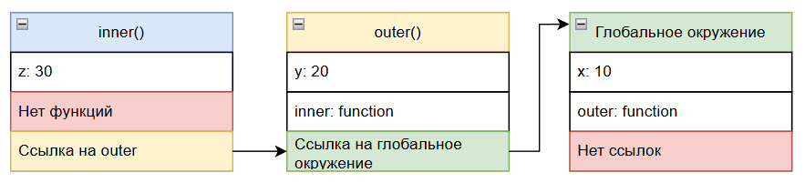

import ExternalCodeEmbed from '@site/src/components/ExternalCodeEmbed';


import ExternalPlayEmbed from '@site/src/components/ExternalPlayEmbed';


# Область видимости и замыкания в JavaScript

<div class="article-tags">
  <span class="tag tag-required">ОБЯЗАТЕЛЬНО</span>
  <span class="tag tag-beginner">ДЛЯ НОВИЧКОВ</span>
</div>

<span class="complexity-badge">Разработчику</span>
<span class="complexity-badge">Архитектору</span>

---

## Где "живут" переменные

### Лексическое окружение

В JavaScript область видимости и **замыкания** — частая причина "магических" багов: переменная не та, что ожидали, или цикл с `var` отдал последнее значение. Разобраться помогает модель **лексического окружения** — внутренней структуры движка, а не синтаксиса `let`/`const` сами по себе.

Код выполняется **построчно**, в одном потоке; при входе в блок `{}` или в функцию движок создаёт окружение для локальных имён. Отсюда цепочка поиска: сначала текущий блок, затем внешние — до глобальной области.

**Лексическое окружение (Lexical Environment)** - особый абстрактный объект в движке JavaScript, который создаётся автоматически при выполнении кода. В привычном смысле слова это не объект (вы не увидите его в консоли напрямую), но он реально существует и участвует в управлении переменными. Каждый блок кода `{}`, будь то функция, условие `if`, цикл `for`, или обычный блок `{}`, будет создавать своё лексическое окружение. 

Словом, указывая фигурные скобки, мы автоматически создаём некий контейнер, где будут храниться переменные и функции, доступные в данной области кода.

Каждое лексическое окружение состоит из двух компонентов:
1. **Environment Record** (запись окружения), которая хранит переменные, функции, параметры, объявленные внутри блока. Технически это словарь пар "имя - значение".
2. **Ссылка на внешнее лексическое окружение (Outer Lexical Environment)**, указывает на окружение, в котором был объявлен текущий блок (важно - не вызван, а объявлен!). Это и обеспечивает механизм поиска переменных по цепочке.

Давайте для примера возьмём такой код, с переменной x, внешней функцией (`outer`) и внутренней функцией (`inner`).


<ExternalCodeEmbed example="javascript/js-501-16-001" title="Лексическое окружение" minHeight={318} />


Разбор:
- Фрагмент показывает рабочий паттерн JavaScript и его структуру от объявления до итогового действия.
- Сначала интерпретатор обрабатывает объявления переменных, функций и выражений, формируя контекст выполнения.
- Затем код исполняется сверху вниз: каждое выражение использует уже вычисленные значения и обновляет текущее состояние.
- Ключевые операторы и методы в примере управляют логикой ветвления, преобразованием данных и вызовами функций.
- В примере акцент сделан на пошаговом выполнении кода.
- Порядок выполнения важен: сначала инициализация, потом основная обработка, затем получение и вывод результата.
- Итог работы блока — конкретный эффект: возвращаемое значение, изменение данных или вывод в консоль.
- Такой разбор помогает быстро перенести шаблон в реальный код и избежать ошибок в последовательности шагов.


<ExternalPlayEmbed example="languages/lexical-scope-visualizer" title="Лексическая область видимости" minHeight={480} />

Здесь получается, что сначала мы объявили переменную x и присвоили ей значение `10`. Это "куда-то записалось". Потом мы создали блок кода с функцией `outer`, а внутри объявили и присвоили значение переменной `y`, и создали ещё один вложенный блок кода с функцией `inner`, где тоже объявили и присвоили значение переменной `z`. И потом в самом нижнем блоке `inner` мы обратились к объекту `console` и вызвали его функцию `log`, передав ей аргументы `x`, `y`, `z`. И прикол в том, что нижний уровень знает, что означают `x` и `y`, хотя они объявлены во внешних блоках!

Функцию inner мы вызываем из блока outer, а функцию outer мы вызываем из глобального окружения.

Технически это выглядеть будет так:



| Глобальное окружение | Outer() | Inner() |
|-----|---------|---------|
|переменные: x: 10	|переменные: y: 20	|переменные: z: 30
|функции: outer: function	|функции: inner: function	|функции: -
|ссылки: -	|ссылки: outer ссылается на глобальное окружение.	|ссылки: inner ссылается на outer.

Словом, когда выполняется `inner()`:
	- сначала выполняется поиск z - и находит в своём окружении;
	- потом ищет y - не находит в своём и отправляется во внешнее (outer) и находит;
	- потом ищет x - не находит, идёт выше - не находит и идет ещё выше, на глобальный уровень - и там находит.

Это и есть цепочка поиска переменных по лексическому окружению.

Как можно заметить, всегда есть глобальное окружение - то есть, весь скрипт (всё что в теге `<script></script>` или в файле скрипта) является глобальным объектом, а каждый создаваемый блок будет записан в глобальном лексическом окружении.

---

### Область видимости

**Область видимости** (англ. *scope*) — часть программы, в которой идентификатор (имя переменной, функции, типа) остаётся связанным с одной сущностью и по нему можно обратиться к объекту. За пределами области то же имя может означать другую переменную или быть не определено. **Связывание** (*binding*) — выбор объекта, стоящего за именем в конкретной точке кода и в момент выполнения.

**Лексическое окружение** — реализация **лексической** (статической) области видимости в движке JavaScript: переменная «принадлежит» тексту блока или функции, где объявлена. Это отличает `let`/`const` от устаревшего `var` с областью уровня функции и от редкой **динамической** области в других языках, где видимость зависит от стека вызовов. Общая теория уровней (глобальная, модульная, классовая) — [жизненный цикл переменных](/encyclopedia/4-code-dev/4-03-vypolnenie-koda/115#область-видимости).

В JS бывают следующие типы областей видимости:
1. **Глобальная (Global Scope)** - переменные доступны везде, создаются в глобальном лексическом окружении.
2. **Функциональная (Function Scope)** - доступны только внутри функции, создаётся при вызове функции (но определяется при объявлении - лексически).
3. **Блочная (Block Scope)** — доступны только внутри `{}` блока, используется с `let` и `const`. `var` блочную область **не** создаёт, только функциональную. Сводная таблица отличий `var`, `let`, `const` — в [переменных в JavaScript](./17.md#сравнение-var-let-const).
```javascript
{
    var a = 1;
    let b = 2;
    const c = 3;
}

console.log(a); // 1 — var "просочился" наружу блока
console.log(b); // Ошибка! b не в глобальной области
```

Разбор:
- Фрагмент показывает рабочий паттерн JavaScript и его структуру от объявления до итогового действия.
- Сначала интерпретатор обрабатывает объявления переменных, функций и выражений, формируя контекст выполнения.
- Затем код исполняется сверху вниз: каждое выражение использует уже вычисленные значения и обновляет текущее состояние.
- Ключевые операторы и методы в примере управляют логикой ветвления, преобразованием данных и вызовами функций.
- В примере акцент сделан на пошаговом выполнении кода.
- Порядок выполнения важен: сначала инициализация, потом основная обработка, затем получение и вывод результата.
- Итог работы блока — конкретный эффект: возвращаемое значение, изменение данных или вывод в консоль.
- Такой разбор помогает быстро перенести шаблон в реальный код и избежать ошибок в последовательности шагов.


Глобальное окружение является корневым лексическим окружением, которое существует всегда и не имеет внешнего окружения. В браузере оно связано с объектом `window`, а в Node.js с объектом `global`. Все глобальные переменные и функции становятся свойствами этого объекта.

Глобальные значения вроде `undefined` (неопределенное), `NaN` (не число), `Infinity` (бесконечность) являются свойствами глобального объекта, то есть в браузере `window`. Технически, их можно даже переопределить (хотя так делать нельзя):
```javascript
window.undefined = "hacked";
console.log(undefined); // всё ещё undefined — в ES5+ это запечатано
```

Разбор:
- Фрагмент показывает рабочий паттерн JavaScript и его структуру от объявления до итогового действия.
- Сначала интерпретатор обрабатывает объявления переменных, функций и выражений, формируя контекст выполнения.
- Затем код исполняется сверху вниз: каждое выражение использует уже вычисленные значения и обновляет текущее состояние.
- Ключевые операторы и методы в примере управляют логикой ветвления, преобразованием данных и вызовами функций.
- В примере акцент сделан на пошаговом выполнении кода.
- Порядок выполнения важен: сначала инициализация, потом основная обработка, затем получение и вывод результата.
- Итог работы блока — конкретный эффект: возвращаемое значение, изменение данных или вывод в консоль.
- Такой разбор помогает быстро перенести шаблон в реальный код и избежать ошибок в последовательности шагов.


---

### Замыкание

**Замыкание (Closure)** - это комбинация функции и лексического окружения, в котором эта функция была объявлена. Функция "запоминает доступ к переменным из внешнего окружения даже после того, как внешняя функция завершила выполнение. 
```javascript
function createCounter() {
    let count = 0;

    return function() {
        count++;
        console.log(count);
    };
}

const counter = createCounter();
counter(); // 1
counter(); // 2
counter(); // 3
```

Разбор:
- Фрагмент показывает рабочий паттерн JavaScript и его структуру от объявления до итогового действия.
- Сначала интерпретатор обрабатывает объявления переменных, функций и выражений, формируя контекст выполнения.
- Затем код исполняется сверху вниз: каждое выражение использует уже вычисленные значения и обновляет текущее состояние.
- Ключевые операторы и методы в примере управляют логикой ветвления, преобразованием данных и вызовами функций.
- В примере акцент сделан на пошаговом выполнении кода.
- Порядок выполнения важен: сначала инициализация, потом основная обработка, затем получение и вывод результата.
- Итог работы блока — конкретный эффект: возвращаемое значение, изменение данных или вывод в консоль.
- Такой разбор помогает быстро перенести шаблон в реальный код и избежать ошибок в последовательности шагов.


В выше приведённом примере есть функция `createCounter()`, в которой объявляется переменная count и ей присваивается значение `0`. Затем используется ключевое слово `return` и указывается, что возвращается функция - которая использует переменную count, добавляя ей `+1` (оператор `++`, инкремент). Словом, увеличивается счётчик при каждом вызове функции. И обратите внимание - потом мы создали переменную (константу) counter которая равна `createCounter()`, и обращаемся через `counter()` снова и снова. И магия в том, что хоть функция в первый раз окончательно завершилась, логически вроде бы должно было всё начаться с нуля, и `count` будет равным снова `0`? Но всё же при каждом вызове счётчик увеличивается. Это благодаря замыканию.

`createCounter` создаёт переменную count, возвращает внутреннюю функцию, и как раз внутренняя функция захватывает count из внешнего окружения. Даже после завершения `createCounter`, переменная count не уничтожается, потому что на неё ссылается замыкание.

Чтобы не путаться, можем подчеркнуть, что замыкание работает всегда, а не только со счётчиками:
```javascript
function test() {
    let age = 30;

    let maxage = function() {
        return (age + 30);
    };

    return maxage;
}

const result = test();
console.log(result()); // 60
```

Разбор:
- Фрагмент показывает рабочий паттерн JavaScript и его структуру от объявления до итогового действия.
- Сначала интерпретатор обрабатывает объявления переменных, функций и выражений, формируя контекст выполнения.
- Затем код исполняется сверху вниз: каждое выражение использует уже вычисленные значения и обновляет текущее состояние.
- Ключевые операторы и методы в примере управляют логикой ветвления, преобразованием данных и вызовами функций.
- В примере акцент сделан на пошаговом выполнении кода.
- Порядок выполнения важен: сначала инициализация, потом основная обработка, затем получение и вывод результата.
- Итог работы блока — конкретный эффект: возвращаемое значение, изменение данных или вывод в консоль.
- Такой разбор помогает быстро перенести шаблон в реальный код и избежать ошибок в последовательности шагов.

Это классическое замыкание - внутренняя функция maxage объявлена внутри внешней функции `test`. Она использует переменную `age` из внешней области. Эта внутренняя функция возвращается и сохраняется вне `test` (в переменной `result)`, и при этом внешняя функция `test` уже завершила своё выполнение. Но переменная age всё ещё доступна при вызове `result()`. Суть замыкания как раз в этом - функция продолжает иметь доступ к переменным из внешнего лексического окружения, даже после того, как это окружение "ушло" из стека вызовов.

Почему age не уничтожается? Обычно да, когда функция завершается, её локальные переменные удаляются из памяти (выбрасываются из стека вызовов). Но если существует функция, которая захватила эти переменные, и эта функция всё ещё может быть вызвана, то движок не удаляет переменные, а сохраняет лексическое окружение, чтобы замыкание могло работать. 

Давайте разберем:

Когда вызывается `test()`:
1. создаётся окружение `test`: `{ age: 30, maxage: function }`;
2. возвращается функция `maxage`;
3. функция maxage "помнит" своё внешнее окружение (`test`);
4. даже после завершения test, окружение сохраняется - из-за замыкания.

Это не копия переменной age, а ссылка на неё. Если бы age изменилась, то maxage увидела бы новое значение. А как мы помним, в примере с `createCounter()` мы увеличивали значение `count` каждый раз через инкремент `++`, а значит значение count менялось снова и снова, а лексическое окружение предоставляет актуальное значение.

Замыкание не будет, если переменная не используется. То есть, оно создаётся только тогда, когда внутренняя функция действительно использует переменные из внешнего окружения.
```javascript
function test() {
    let age = 30;

    let greet = function() {
        console.log("Привет!");
        // Никаких ссылок на age
    };

    return greet;
}

const fn = test();
fn(); // "Привет!"
```

Разбор:
- Фрагмент показывает рабочий паттерн JavaScript и его структуру от объявления до итогового действия.
- Сначала интерпретатор обрабатывает объявления переменных, функций и выражений, формируя контекст выполнения.
- Затем код исполняется сверху вниз: каждое выражение использует уже вычисленные значения и обновляет текущее состояние.
- Ключевые операторы и методы в примере управляют логикой ветвления, преобразованием данных и вызовами функций.
- В примере акцент сделан на пошаговом выполнении кода.
- Порядок выполнения важен: сначала инициализация, потом основная обработка, затем получение и вывод результата.
- Итог работы блока — конкретный эффект: возвращаемое значение, изменение данных или вывод в консоль.
- Такой разбор помогает быстро перенести шаблон в реальный код и избежать ошибок в последовательности шагов.


Обратите внимание на код выше. Здесь нет замыкания на `age`, потому что `greet` не использует `age`. Даже если переменная объявлена, но не захвачена, она будет удалена при завершении `test`. Если вы пропишете такой код в IDE, к примеру, VS Code, переменная age даже будет подсвечена серым цветом, мол, дружище, ты объявил переменную но ни разу не использовал её.

Итого, замыкание будет, если внутренняя функция использует переменную извне (даже если переменная одна, значение примитивное и переменная позже изменится), и замыкания не будет, если внутренняя функция не ссылается на внешние переменные или если функция просто объявлена внутри, но не возвращается или не сохраняется.

И как всегда, бывает ньюанс.
```javascript
function test() {
    let secret = "shh";

    function reveal() {
        console.log(secret);
    }

    reveal(); // вызов внутри
}

test(); // "shh"
```

Разбор:
- Фрагмент показывает рабочий паттерн JavaScript и его структуру от объявления до итогового действия.
- Сначала интерпретатор обрабатывает объявления переменных, функций и выражений, формируя контекст выполнения.
- Затем код исполняется сверху вниз: каждое выражение использует уже вычисленные значения и обновляет текущее состояние.
- Ключевые операторы и методы в примере управляют логикой ветвления, преобразованием данных и вызовами функций.
- В примере акцент сделан на пошаговом выполнении кода.
- Порядок выполнения важен: сначала инициализация, потом основная обработка, затем получение и вывод результата.
- Итог работы блока — конкретный эффект: возвращаемое значение, изменение данных или вывод в консоль.
- Такой разбор помогает быстро перенести шаблон в реальный код и избежать ошибок в последовательности шагов.

Здесь есть захват переменной secret, но внутренняя функция не возвращается, а после завершения test - всё уничтожается. Это всё равно замыкание, механизм тот же, но эффект временный, так сказать, разовый. Просто мы не видим "долгосрочного удержания" переменной. Словом, `test` - отдельный независимый блок, а reveal видит secret внутри работы данного `test`. Да, технически результат примерно одинаковый, но есть вот такая необычная штука - это из-за внутреннего вызова.

Словом, механизм будет работать всегда, главное соблюдать правила работы с областями видимости и понимать логику работы лексического окружения.

Если хотите посмотреть на механизм ещё глубже - можете использовать любой из вышеперечисленных примеров с внутренней функцией, поставить debugger внутри внутренней функции, и в режиме отладки в инструментах разработчика посмотрите на вкладку `Scope` - увидите `Local` (свои переменные), `Closure` (захваченные переменные извне) и `Global`. Но можете вернуться к этому позже, ведь мы ещё не закончили.

Лексическое окружение есть и в других языках - C#, Python, Java, C++, Go. Со своими ньюансами и разной реализацией, но всё же есть. Но JavaScript — один из самых гибких языков в плане замыканий, потому что позволяет захватывать и изменять переменные из внешнего окружения без жёстких ограничений.

Для понимания, давайте рассмотрим некоторые алгоритмические шаблоны замыканий.

---

#### 1. Объявление внешней функции с локальной переменной  
```javascript
function <внешняяФункция>() {
  let <переменная> = <значение>;
```

Разбор:
- Фрагмент показывает рабочий паттерн JavaScript и его структуру от объявления до итогового действия.
- Сначала интерпретатор обрабатывает объявления переменных, функций и выражений, формируя контекст выполнения.
- Затем код исполняется сверху вниз: каждое выражение использует уже вычисленные значения и обновляет текущее состояние.
- Ключевые операторы и методы в примере управляют логикой ветвления, преобразованием данных и вызовами функций.
- В примере акцент сделан на пошаговом выполнении кода.
- Порядок выполнения важен: сначала инициализация, потом основная обработка, затем получение и вывод результата.
- Итог работы блока — конкретный эффект: возвращаемое значение, изменение данных или вывод в консоль.
- Такой разбор помогает быстро перенести шаблон в реальный код и избежать ошибок в последовательности шагов.

Пример:
```javascript
function createCounter() {
  let count = 0;
```

Разбор:
- Фрагмент показывает рабочий паттерн JavaScript и его структуру от объявления до итогового действия.
- Сначала интерпретатор обрабатывает объявления переменных, функций и выражений, формируя контекст выполнения.
- Затем код исполняется сверху вниз: каждое выражение использует уже вычисленные значения и обновляет текущее состояние.
- Ключевые операторы и методы в примере управляют логикой ветвления, преобразованием данных и вызовами функций.
- В примере акцент сделан на пошаговом выполнении кода.
- Порядок выполнения важен: сначала инициализация, потом основная обработка, затем получение и вывод результата.
- Итог работы блока — конкретный эффект: возвращаемое значение, изменение данных или вывод в консоль.
- Такой разбор помогает быстро перенести шаблон в реальный код и избежать ошибок в последовательности шагов.


Этот шаблон задаёт лексическое окружение, в котором будет создаваться замыкание.

---

#### 2. Возврат внутренней функции, использующей внешнюю переменную  
```javascript
  return function() {
    <тело с использованием переменной>;
  };
}
```

Разбор:
- Фрагмент показывает рабочий паттерн JavaScript и его структуру от объявления до итогового действия.
- Сначала интерпретатор обрабатывает объявления переменных, функций и выражений, формируя контекст выполнения.
- Затем код исполняется сверху вниз: каждое выражение использует уже вычисленные значения и обновляет текущее состояние.
- Ключевые операторы и методы в примере управляют логикой ветвления, преобразованием данных и вызовами функций.
- В примере акцент сделан на пошаговом выполнении кода.
- Порядок выполнения важен: сначала инициализация, потом основная обработка, затем получение и вывод результата.
- Итог работы блока — конкретный эффект: возвращаемое значение, изменение данных или вывод в консоль.
- Такой разбор помогает быстро перенести шаблон в реальный код и избежать ошибок в последовательности шагов.

Пример:
```javascript
  return function() {
    count++;
    console.log(count);
  };
}
```

Разбор:
- Фрагмент показывает рабочий паттерн JavaScript и его структуру от объявления до итогового действия.
- Сначала интерпретатор обрабатывает объявления переменных, функций и выражений, формируя контекст выполнения.
- Затем код исполняется сверху вниз: каждое выражение использует уже вычисленные значения и обновляет текущее состояние.
- Ключевые операторы и методы в примере управляют логикой ветвления, преобразованием данных и вызовами функций.
- В примере акцент сделан на пошаговом выполнении кода.
- Порядок выполнения важен: сначала инициализация, потом основная обработка, затем получение и вывод результата.
- Итог работы блока — конкретный эффект: возвращаемое значение, изменение данных или вывод в консоль.
- Такой разбор помогает быстро перенести шаблон в реальный код и избежать ошибок в последовательности шагов.


Внутренняя функция захватывает переменную из внешнего окружения — это и есть замыкание.

---

#### 3. Присваивание результата вызова внешней функции переменной  
```javascript
const <имя> = <внешняяФункция>();
```

Разбор:
- Фрагмент показывает рабочий паттерн JavaScript и его структуру от объявления до итогового действия.
- Сначала интерпретатор обрабатывает объявления переменных, функций и выражений, формируя контекст выполнения.
- Затем код исполняется сверху вниз: каждое выражение использует уже вычисленные значения и обновляет текущее состояние.
- Ключевые операторы и методы в примере управляют логикой ветвления, преобразованием данных и вызовами функций.
- В примере акцент сделан на пошаговом выполнении кода.
- Порядок выполнения важен: сначала инициализация, потом основная обработка, затем получение и вывод результата.
- Итог работы блока — конкретный эффект: возвращаемое значение, изменение данных или вывод в консоль.
- Такой разбор помогает быстро перенести шаблон в реальный код и избежать ошибок в последовательности шагов.

Пример:
```javascript
const counter = createCounter();
```

Разбор:
- Фрагмент показывает рабочий паттерн JavaScript и его структуру от объявления до итогового действия.
- Сначала интерпретатор обрабатывает объявления переменных, функций и выражений, формируя контекст выполнения.
- Затем код исполняется сверху вниз: каждое выражение использует уже вычисленные значения и обновляет текущее состояние.
- Ключевые операторы и методы в примере управляют логикой ветвления, преобразованием данных и вызовами функций.
- В примере акцент сделан на пошаговом выполнении кода.
- Порядок выполнения важен: сначала инициализация, потом основная обработка, затем получение и вывод результата.
- Итог работы блока — конкретный эффект: возвращаемое значение, изменение данных или вывод в консоль.
- Такой разбор помогает быстро перенести шаблон в реальный код и избежать ошибок в последовательности шагов.


Переменная `counter` теперь хранит ссылку на внутреннюю функцию, которая сохраняет доступ к своему лексическому окружению.

---

#### 4. Повторный вызов замыкания  
```javascript
<имя>();
```

Разбор:
- Фрагмент показывает рабочий паттерн JavaScript и его структуру от объявления до итогового действия.
- Сначала интерпретатор обрабатывает объявления переменных, функций и выражений, формируя контекст выполнения.
- Затем код исполняется сверху вниз: каждое выражение использует уже вычисленные значения и обновляет текущее состояние.
- Ключевые операторы и методы в примере управляют логикой ветвления, преобразованием данных и вызовами функций.
- В примере акцент сделан на пошаговом выполнении кода.
- Порядок выполнения важен: сначала инициализация, потом основная обработка, затем получение и вывод результата.
- Итог работы блока — конкретный эффект: возвращаемое значение, изменение данных или вывод в консоль.
- Такой разбор помогает быстро перенести шаблон в реальный код и избежать ошибок в последовательности шагов.

Пример:
```javascript
counter(); // 1
counter(); // 2
```

Разбор:
- Фрагмент показывает рабочий паттерн JavaScript и его структуру от объявления до итогового действия.
- Сначала интерпретатор обрабатывает объявления переменных, функций и выражений, формируя контекст выполнения.
- Затем код исполняется сверху вниз: каждое выражение использует уже вычисленные значения и обновляет текущее состояние.
- Ключевые операторы и методы в примере управляют логикой ветвления, преобразованием данных и вызовами функций.
- В примере акцент сделан на пошаговом выполнении кода.
- Порядок выполнения важен: сначала инициализация, потом основная обработка, затем получение и вывод результата.
- Итог работы блока — конкретный эффект: возвращаемое значение, изменение данных или вывод в консоль.
- Такой разбор помогает быстро перенести шаблон в реальный код и избежать ошибок в последовательности шагов.


Каждый вызов работает с одним и тем же захваченным состоянием, что демонстрирует "память" замыкания.

---

#### 5. Замыкание с параметрами во внешней функции  
```javascript
function <внешняяФункция>(<параметр>) {
  let <переменная> = <параметр>;

  return function() {
    // использование переменной
  };
}
```

Разбор:
- Фрагмент показывает рабочий паттерн JavaScript и его структуру от объявления до итогового действия.
- Сначала интерпретатор обрабатывает объявления переменных, функций и выражений, формируя контекст выполнения.
- Затем код исполняется сверху вниз: каждое выражение использует уже вычисленные значения и обновляет текущее состояние.
- Ключевые операторы и методы в примере управляют логикой ветвления, преобразованием данных и вызовами функций.
- В примере акцент сделан на пошаговом выполнении кода.
- Порядок выполнения важен: сначала инициализация, потом основная обработка, затем получение и вывод результата.
- Итог работы блока — конкретный эффект: возвращаемое значение, изменение данных или вывод в консоль.
- Такой разбор помогает быстро перенести шаблон в реальный код и избежать ошибок в последовательности шагов.

Пример:
```javascript
function makeMultiplier(factor) {
  return function(value) {
    return value * factor;
  };
}
```

Разбор:
- Фрагмент показывает рабочий паттерн JavaScript и его структуру от объявления до итогового действия.
- Сначала интерпретатор обрабатывает объявления переменных, функций и выражений, формируя контекст выполнения.
- Затем код исполняется сверху вниз: каждое выражение использует уже вычисленные значения и обновляет текущее состояние.
- Ключевые операторы и методы в примере управляют логикой ветвления, преобразованием данных и вызовами функций.
- В примере акцент сделан на пошаговом выполнении кода.
- Порядок выполнения важен: сначала инициализация, потом основная обработка, затем получение и вывод результата.
- Итог работы блока — конкретный эффект: возвращаемое значение, изменение данных или вывод в консоль.
- Такой разбор помогает быстро перенести шаблон в реальный код и избежать ошибок в последовательности шагов.


Позволяет создавать специализированные функции с предустановленным контекстом.

---

#### 6. Замыкание без возврата (локальный вызов)  
```javascript
function <внешняяФункция>() {
  let <переменная> = <значение>;

  function <внутренняяФункция>() {
    // использование переменной
  }

  <внутренняяФункция>(); // вызов внутри
}
```

Разбор:
- Фрагмент показывает рабочий паттерн JavaScript и его структуру от объявления до итогового действия.
- Сначала интерпретатор обрабатывает объявления переменных, функций и выражений, формируя контекст выполнения.
- Затем код исполняется сверху вниз: каждое выражение использует уже вычисленные значения и обновляет текущее состояние.
- Ключевые операторы и методы в примере управляют логикой ветвления, преобразованием данных и вызовами функций.
- В примере акцент сделан на пошаговом выполнении кода.
- Порядок выполнения важен: сначала инициализация, потом основная обработка, затем получение и вывод результата.
- Итог работы блока — конкретный эффект: возвращаемое значение, изменение данных или вывод в консоль.
- Такой разбор помогает быстро перенести шаблон в реальный код и избежать ошибок в последовательности шагов.

Пример:
```javascript
function test() {
  let secret = "shh";
  function reveal() {
    console.log(secret);
  }
  reveal();
}
```

Разбор:
- Фрагмент показывает рабочий паттерн JavaScript и его структуру от объявления до итогового действия.
- Сначала интерпретатор обрабатывает объявления переменных, функций и выражений, формируя контекст выполнения.
- Затем код исполняется сверху вниз: каждое выражение использует уже вычисленные значения и обновляет текущее состояние.
- Ключевые операторы и методы в примере управляют логикой ветвления, преобразованием данных и вызовами функций.
- В примере акцент сделан на пошаговом выполнении кода.
- Порядок выполнения важен: сначала инициализация, потом основная обработка, затем получение и вывод результата.
- Итог работы блока — конкретный эффект: возвращаемое значение, изменение данных или вывод в консоль.
- Такой разбор помогает быстро перенести шаблон в реальный код и избежать ошибок в последовательности шагов.


Замыкание существует, но не сохраняется после завершения внешней функции.

---

#### 7. Отсутствие замыкания при отсутствии ссылки на внешнюю переменную  
```javascript
function <внешняяФункция>() {
  let <переменная> = <значение>; // не используется

  return function() {
    // тело без обращения к переменной
  };
}
```

Разбор:
- Фрагмент показывает рабочий паттерн JavaScript и его структуру от объявления до итогового действия.
- Сначала интерпретатор обрабатывает объявления переменных, функций и выражений, формируя контекст выполнения.
- Затем код исполняется сверху вниз: каждое выражение использует уже вычисленные значения и обновляет текущее состояние.
- Ключевые операторы и методы в примере управляют логикой ветвления, преобразованием данных и вызовами функций.
- В примере акцент сделан на пошаговом выполнении кода.
- Порядок выполнения важен: сначала инициализация, потом основная обработка, затем получение и вывод результата.
- Итог работы блока — конкретный эффект: возвращаемое значение, изменение данных или вывод в консоль.
- Такой разбор помогает быстро перенести шаблон в реальный код и избежать ошибок в последовательности шагов.

Пример:
```javascript
function test() {
  let age = 30;
  return function() {
    console.log("Привет!");
  };
}
```

Разбор:
- Фрагмент показывает рабочий паттерн JavaScript и его структуру от объявления до итогового действия.
- Сначала интерпретатор обрабатывает объявления переменных, функций и выражений, формируя контекст выполнения.
- Затем код исполняется сверху вниз: каждое выражение использует уже вычисленные значения и обновляет текущее состояние.
- Ключевые операторы и методы в примере управляют логикой ветвления, преобразованием данных и вызовами функций.
- В примере акцент сделан на пошаговом выполнении кода.
- Порядок выполнения важен: сначала инициализация, потом основная обработка, затем получение и вывод результата.
- Итог работы блока — конкретный эффект: возвращаемое значение, изменение данных или вывод в консоль.
- Такой разбор помогает быстро перенести шаблон в реальный код и избежать ошибок в последовательности шагов.


Переменная `age` не захватывается, поэтому замыкание на неё не создаётся.

---

#### 8. Замыкание с изменением захваченной переменной  
```javascript
function <внешняяФункция>() {
  let <переменная> = <начальное значение>;

  return function() {
    <переменная><оператор присваивания><выражение>;
    // например: count++
  };
}
```

Разбор:
- Фрагмент показывает рабочий паттерн JavaScript и его структуру от объявления до итогового действия.
- Сначала интерпретатор обрабатывает объявления переменных, функций и выражений, формируя контекст выполнения.
- Затем код исполняется сверху вниз: каждое выражение использует уже вычисленные значения и обновляет текущее состояние.
- Ключевые операторы и методы в примере управляют логикой ветвления, преобразованием данных и вызовами функций.
- В примере акцент сделан на пошаговом выполнении кода.
- Порядок выполнения важен: сначала инициализация, потом основная обработка, затем получение и вывод результата.
- Итог работы блока — конкретный эффект: возвращаемое значение, изменение данных или вывод в консоль.
- Такой разбор помогает быстро перенести шаблон в реальный код и избежать ошибок в последовательности шагов.

Пример:
```javascript
function createCounter() {
  let count = 0;
  return function() {
    count++;
    return count;
  };
}
```

Разбор:
- Фрагмент показывает рабочий паттерн JavaScript и его структуру от объявления до итогового действия.
- Сначала интерпретатор обрабатывает объявления переменных, функций и выражений, формируя контекст выполнения.
- Затем код исполняется сверху вниз: каждое выражение использует уже вычисленные значения и обновляет текущее состояние.
- Ключевые операторы и методы в примере управляют логикой ветвления, преобразованием данных и вызовами функций.
- В примере акцент сделан на пошаговом выполнении кода.
- Порядок выполнения важен: сначала инициализация, потом основная обработка, затем получение и вывод результата.
- Итог работы блока — конкретный эффект: возвращаемое значение, изменение данных или вывод в консоль.
- Такой разбор помогает быстро перенести шаблон в реальный код и избежать ошибок в последовательности шагов.


Захваченная переменная может изменяться, и замыкание всегда видит актуальное значение.

---

#### 9. Немедленный вызов функции с замыканием (IIFE + closure)  
```javascript
const <имя> = (function() {
  let <переменная> = <значение>;
  return function() {
    // использование переменной
  };
})();
```

Разбор:
- Фрагмент показывает рабочий паттерн JavaScript и его структуру от объявления до итогового действия.
- Сначала интерпретатор обрабатывает объявления переменных, функций и выражений, формируя контекст выполнения.
- Затем код исполняется сверху вниз: каждое выражение использует уже вычисленные значения и обновляет текущее состояние.
- Ключевые операторы и методы в примере управляют логикой ветвления, преобразованием данных и вызовами функций.
- В примере акцент сделан на пошаговом выполнении кода.
- Порядок выполнения важен: сначала инициализация, потом основная обработка, затем получение и вывод результата.
- Итог работы блока — конкретный эффект: возвращаемое значение, изменение данных или вывод в консоль.
- Такой разбор помогает быстро перенести шаблон в реальный код и избежать ошибок в последовательности шагов.

Пример:
```javascript
const uniqueId = (function() {
  let id = 0;
  return function() {
    return ++id;
  };
})();
```

Разбор:
- Фрагмент показывает рабочий паттерн JavaScript и его структуру от объявления до итогового действия.
- Сначала интерпретатор обрабатывает объявления переменных, функций и выражений, формируя контекст выполнения.
- Затем код исполняется сверху вниз: каждое выражение использует уже вычисленные значения и обновляет текущее состояние.
- Ключевые операторы и методы в примере управляют логикой ветвления, преобразованием данных и вызовами функций.
- В примере акцент сделан на пошаговом выполнении кода.
- Порядок выполнения важен: сначала инициализация, потом основная обработка, затем получение и вывод результата.
- Итог работы блока — конкретный эффект: возвращаемое значение, изменение данных или вывод в консоль.
- Такой разбор помогает быстро перенести шаблон в реальный код и избежать ошибок в последовательности шагов.


Создаёт изолированное замыкание без глобального загрязнения.

---

#### 10. Замыкание в цикле (с защитой от захвата по ссылке)  
```javascript
for (let i = 0; i < n; i++) {
  setTimeout(function() {
    console.log(i); // корректное значение благодаря let
  }, 100);
}
```

Разбор:
- Фрагмент показывает рабочий паттерн JavaScript и его структуру от объявления до итогового действия.
- Сначала интерпретатор обрабатывает объявления переменных, функций и выражений, формируя контекст выполнения.
- Затем код исполняется сверху вниз: каждое выражение использует уже вычисленные значения и обновляет текущее состояние.
- Ключевые операторы и методы в примере управляют логикой ветвления, преобразованием данных и вызовами функций.
- В примере акцент сделан на работе с циклами и итерациями.
- Порядок выполнения важен: сначала инициализация, потом основная обработка, затем получение и вывод результата.
- Итог работы блока — конкретный эффект: возвращаемое значение, изменение данных или вывод в консоль.
- Такой разбор помогает быстро перенести шаблон в реальный код и избежать ошибок в последовательности шагов.

Или с IIFE при использовании `var`:
```javascript
for (var i = 0; i < n; i++) {
  (function(index) {
    setTimeout(function() {
      console.log(index);
    }, 100);
  })(i);
}
```

Разбор:
- Фрагмент показывает рабочий паттерн JavaScript и его структуру от объявления до итогового действия.
- Сначала интерпретатор обрабатывает объявления переменных, функций и выражений, формируя контекст выполнения.
- Затем код исполняется сверху вниз: каждое выражение использует уже вычисленные значения и обновляет текущее состояние.
- Ключевые операторы и методы в примере управляют логикой ветвления, преобразованием данных и вызовами функций.
- В примере акцент сделан на работе с циклами и итерациями.
- Порядок выполнения важен: сначала инициализация, потом основная обработка, затем получение и вывод результата.
- Итог работы блока — конкретный эффект: возвращаемое значение, изменение данных или вывод в консоль.
- Такой разбор помогает быстро перенести шаблон в реальный код и избежать ошибок в последовательности шагов.


Показывает, как избежать классической ошибки с общим захватом переменной в цикле.

---

### this

**Контекст вызова** и **this** - ещё важные понятия, которые не нужно путать с областью видимости. И снова мы что-то отделяем от области видимости 😊 - scope определяет доступ к переменным, а контекст вызова (`this`) определяет "кто" вызвал функцию, и на что указывает `this` внутри неё. Словом, `this` это не часть лексического окружения - `this` динамический и зависит от способа вызова, а не от места объявления.

Чтобы разобраться, где и какой `this`, надо запомнить правила определения `this`:

| Способ вызова | Значение | this |
|-----|---------|---------|
|Обычный вызов func()	|undefined в strict mode; window в non-strict.
|Вызов метода объекта obj.method()	|obj
|Вызов через call, apply, bind	|указанное значение
|Конструктор через new	|новый объект
|Стрелочная функция	|наследует this от внешней функции (лексически).

```javascript
const user = {
    name: "Timur",
    greet: function() {
        console.log(this.name); // this = user
    },
    arrowGreet: () => {
        console.log(this.name); // this = window (в браузере)
    }
};

user.greet();      // "Timur"
user.arrowGreet(); // undefined (или window.name)
```

Разбор:
- Фрагмент показывает рабочий паттерн JavaScript и его структуру от объявления до итогового действия.
- Сначала интерпретатор обрабатывает объявления переменных, функций и выражений, формируя контекст выполнения.
- Затем код исполняется сверху вниз: каждое выражение использует уже вычисленные значения и обновляет текущее состояние.
- Ключевые операторы и методы в примере управляют логикой ветвления, преобразованием данных и вызовами функций.
- В примере акцент сделан на пошаговом выполнении кода.
- Порядок выполнения важен: сначала инициализация, потом основная обработка, затем получение и вывод результата.
- Итог работы блока — конкретный эффект: возвращаемое значение, изменение данных или вывод в консоль.
- Такой разбор помогает быстро перенести шаблон в реальный код и избежать ошибок в последовательности шагов.

Внимательно прочитайте код выше. Мы создаём объект user и записываем его в константу. У этого объекта есть `name`, `greet` и `arrowGreet`. И в `greet` мы вызываем `this.name`, что означает "возьми `name` отсюда", и `this` равен `user` - текущему объекту. Но если мы возьмём `arrowGreet` и в ней укажем `this.name`, то `this` будет пытаться искать в объекте глобальном - `window`, то есть `window.name` - а такого мы не определили, и следовательно получаем "неопределенное значение" - `undefined`. Собственно, отсюда можно сделать вывод, что стрелочные функции не имеют своего `this` — они берут его из внешнего лексического окружения.

Для закрепления, и здесь посмотрим на алгоритмические шаблоны:

---

#### 1. Обычный вызов функции  
```javascript
функция();
```

Разбор:
- Фрагмент показывает рабочий паттерн JavaScript и его структуру от объявления до итогового действия.
- Сначала интерпретатор обрабатывает объявления переменных, функций и выражений, формируя контекст выполнения.
- Затем код исполняется сверху вниз: каждое выражение использует уже вычисленные значения и обновляет текущее состояние.
- Ключевые операторы и методы в примере управляют логикой ветвления, преобразованием данных и вызовами функций.
- В примере акцент сделан на пошаговом выполнении кода.
- Порядок выполнения важен: сначала инициализация, потом основная обработка, затем получение и вывод результата.
- Итог работы блока — конкретный эффект: возвращаемое значение, изменение данных или вывод в консоль.
- Такой разбор помогает быстро перенести шаблон в реальный код и избежать ошибок в последовательности шагов.

Значение `this`:
- в strict mode → `undefined`
- в non-strict mode → глобальный объект (`window` в браузере)

Пример:
```javascript
function sayHello() {
  console.log(this); // undefined (в strict mode)
}
sayHello();
```

Разбор:
- Фрагмент показывает рабочий паттерн JavaScript и его структуру от объявления до итогового действия.
- Сначала интерпретатор обрабатывает объявления переменных, функций и выражений, формируя контекст выполнения.
- Затем код исполняется сверху вниз: каждое выражение использует уже вычисленные значения и обновляет текущее состояние.
- Ключевые операторы и методы в примере управляют логикой ветвления, преобразованием данных и вызовами функций.
- В примере акцент сделан на пошаговом выполнении кода.
- Порядок выполнения важен: сначала инициализация, потом основная обработка, затем получение и вывод результата.
- Итог работы блока — конкретный эффект: возвращаемое значение, изменение данных или вывод в консоль.
- Такой разбор помогает быстро перенести шаблон в реальный код и избежать ошибок в последовательности шагов.


---

#### 2. Вызов метода объекта  
```javascript
<объект>.<метод>();
```

Разбор:
- Фрагмент показывает рабочий паттерн JavaScript и его структуру от объявления до итогового действия.
- Сначала интерпретатор обрабатывает объявления переменных, функций и выражений, формируя контекст выполнения.
- Затем код исполняется сверху вниз: каждое выражение использует уже вычисленные значения и обновляет текущее состояние.
- Ключевые операторы и методы в примере управляют логикой ветвления, преобразованием данных и вызовами функций.
- В примере акцент сделан на пошаговом выполнении кода.
- Порядок выполнения важен: сначала инициализация, потом основная обработка, затем получение и вывод результата.
- Итог работы блока — конкретный эффект: возвращаемое значение, изменение данных или вывод в консоль.
- Такой разбор помогает быстро перенести шаблон в реальный код и избежать ошибок в последовательности шагов.

Значение `this` → `<объект>`

Пример:
```javascript
const person = {
  name: "Анна",
  introduce() {
    console.log(this.name);
  }
};
person.introduce(); // "Анна"
```

Разбор:
- Фрагмент показывает рабочий паттерн JavaScript и его структуру от объявления до итогового действия.
- Сначала интерпретатор обрабатывает объявления переменных, функций и выражений, формируя контекст выполнения.
- Затем код исполняется сверху вниз: каждое выражение использует уже вычисленные значения и обновляет текущее состояние.
- Ключевые операторы и методы в примере управляют логикой ветвления, преобразованием данных и вызовами функций.
- В примере акцент сделан на пошаговом выполнении кода.
- Порядок выполнения важен: сначала инициализация, потом основная обработка, затем получение и вывод результата.
- Итог работы блока — конкретный эффект: возвращаемое значение, изменение данных или вывод в консоль.
- Такой разбор помогает быстро перенести шаблон в реальный код и избежать ошибок в последовательности шагов.


---

#### 3. Явная привязка через `call`  
```javascript
<функция>.call(<контекст>, <аргументы>);
```

Разбор:
- Фрагмент показывает рабочий паттерн JavaScript и его структуру от объявления до итогового действия.
- Сначала интерпретатор обрабатывает объявления переменных, функций и выражений, формируя контекст выполнения.
- Затем код исполняется сверху вниз: каждое выражение использует уже вычисленные значения и обновляет текущее состояние.
- Ключевые операторы и методы в примере управляют логикой ветвления, преобразованием данных и вызовами функций.
- В примере акцент сделан на пошаговом выполнении кода.
- Порядок выполнения важен: сначала инициализация, потом основная обработка, затем получение и вывод результата.
- Итог работы блока — конкретный эффект: возвращаемое значение, изменение данных или вывод в консоль.
- Такой разбор помогает быстро перенести шаблон в реальный код и избежать ошибок в последовательности шагов.

Значение `this` → `<контекст>`

Пример:
```javascript
function greet() {
  console.log(`Привет, ${this.name}`);
}
const user = { name: "Иван" };
greet.call(user); // "Привет, Иван"
```

Разбор:
- Фрагмент показывает рабочий паттерн JavaScript и его структуру от объявления до итогового действия.
- Сначала интерпретатор обрабатывает объявления переменных, функций и выражений, формируя контекст выполнения.
- Затем код исполняется сверху вниз: каждое выражение использует уже вычисленные значения и обновляет текущее состояние.
- Ключевые операторы и методы в примере управляют логикой ветвления, преобразованием данных и вызовами функций.
- В примере акцент сделан на пошаговом выполнении кода.
- Порядок выполнения важен: сначала инициализация, потом основная обработка, затем получение и вывод результата.
- Итог работы блока — конкретный эффект: возвращаемое значение, изменение данных или вывод в консоль.
- Такой разбор помогает быстро перенести шаблон в реальный код и избежать ошибок в последовательности шагов.


---

#### 4. Явная привязка через `apply`  
```javascript
<функция>.apply(<контекст>, [<аргументы>]);
```

Разбор:
- Фрагмент показывает рабочий паттерн JavaScript и его структуру от объявления до итогового действия.
- Сначала интерпретатор обрабатывает объявления переменных, функций и выражений, формируя контекст выполнения.
- Затем код исполняется сверху вниз: каждое выражение использует уже вычисленные значения и обновляет текущее состояние.
- Ключевые операторы и методы в примере управляют логикой ветвления, преобразованием данных и вызовами функций.
- В примере акцент сделан на пошаговом выполнении кода.
- Порядок выполнения важен: сначала инициализация, потом основная обработка, затем получение и вывод результата.
- Итог работы блока — конкретный эффект: возвращаемое значение, изменение данных или вывод в консоль.
- Такой разбор помогает быстро перенести шаблон в реальный код и избежать ошибок в последовательности шагов.

Значение `this` → `<контекст>`

Пример:
```javascript
function sum(a, b) {
  return this.base + a + b;
}
const obj = { base: 10 };
console.log(sum.apply(obj, [2, 3])); // 15
```

Разбор:
- Фрагмент показывает рабочий паттерн JavaScript и его структуру от объявления до итогового действия.
- Сначала интерпретатор обрабатывает объявления переменных, функций и выражений, формируя контекст выполнения.
- Затем код исполняется сверху вниз: каждое выражение использует уже вычисленные значения и обновляет текущее состояние.
- Ключевые операторы и методы в примере управляют логикой ветвления, преобразованием данных и вызовами функций.
- В примере акцент сделан на пошаговом выполнении кода.
- Порядок выполнения важен: сначала инициализация, потом основная обработка, затем получение и вывод результата.
- Итог работы блока — конкретный эффект: возвращаемое значение, изменение данных или вывод в консоль.
- Такой разбор помогает быстро перенести шаблон в реальный код и избежать ошибок в последовательности шагов.


---

#### 5. Привязка через `bind`  
```javascript
const <новаяФункция> = <функция>.bind(<контекст>, <аргументы>);
```

Разбор:
- Фрагмент показывает рабочий паттерн JavaScript и его структуру от объявления до итогового действия.
- Сначала интерпретатор обрабатывает объявления переменных, функций и выражений, формируя контекст выполнения.
- Затем код исполняется сверху вниз: каждое выражение использует уже вычисленные значения и обновляет текущее состояние.
- Ключевые операторы и методы в примере управляют логикой ветвления, преобразованием данных и вызовами функций.
- В примере акцент сделан на пошаговом выполнении кода.
- Порядок выполнения важен: сначала инициализация, потом основная обработка, затем получение и вывод результата.
- Итог работы блока — конкретный эффект: возвращаемое значение, изменение данных или вывод в консоль.
- Такой разбор помогает быстро перенести шаблон в реальный код и избежать ошибок в последовательности шагов.

Значение `this` внутри `<новаяФункция>` → `<контекст>`

Пример:
```javascript
function logName() {
  console.log(this.name);
}
const boundLog = logName.bind({ name: "Мария" });
boundLog(); // "Мария"
```

Разбор:
- Фрагмент показывает рабочий паттерн JavaScript и его структуру от объявления до итогового действия.
- Сначала интерпретатор обрабатывает объявления переменных, функций и выражений, формируя контекст выполнения.
- Затем код исполняется сверху вниз: каждое выражение использует уже вычисленные значения и обновляет текущее состояние.
- Ключевые операторы и методы в примере управляют логикой ветвления, преобразованием данных и вызовами функций.
- В примере акцент сделан на пошаговом выполнении кода.
- Порядок выполнения важен: сначала инициализация, потом основная обработка, затем получение и вывод результата.
- Итог работы блока — конкретный эффект: возвращаемое значение, изменение данных или вывод в консоль.
- Такой разбор помогает быстро перенести шаблон в реальный код и избежать ошибок в последовательности шагов.


---

#### 6. Вызов как конструктор через `new`  
```javascript
const <экземпляр> = new <Конструктор>(<аргументы>);
```

Разбор:
- Фрагмент показывает рабочий паттерн JavaScript и его структуру от объявления до итогового действия.
- Сначала интерпретатор обрабатывает объявления переменных, функций и выражений, формируя контекст выполнения.
- Затем код исполняется сверху вниз: каждое выражение использует уже вычисленные значения и обновляет текущее состояние.
- Ключевые операторы и методы в примере управляют логикой ветвления, преобразованием данных и вызовами функций.
- В примере акцент сделан на работе с созданием объектов.
- Порядок выполнения важен: сначала инициализация, потом основная обработка, затем получение и вывод результата.
- Итог работы блока — конкретный эффект: возвращаемое значение, изменение данных или вывод в консоль.
- Такой разбор помогает быстро перенести шаблон в реальный код и избежать ошибок в последовательности шагов.

Значение `this` внутри конструктора → новый создаваемый объект

Пример:
```javascript
function User(name) {
  this.name = name;
}
const user = new User("Сергей");
console.log(user.name); // "Сергей"
```

Разбор:
- Фрагмент показывает рабочий паттерн JavaScript и его структуру от объявления до итогового действия.
- Сначала интерпретатор обрабатывает объявления переменных, функций и выражений, формируя контекст выполнения.
- Затем код исполняется сверху вниз: каждое выражение использует уже вычисленные значения и обновляет текущее состояние.
- Ключевые операторы и методы в примере управляют логикой ветвления, преобразованием данных и вызовами функций.
- В примере акцент сделан на работе с созданием объектов.
- Порядок выполнения важен: сначала инициализация, потом основная обработка, затем получение и вывод результата.
- Итог работы блока — конкретный эффект: возвращаемое значение, изменение данных или вывод в консоль.
- Такой разбор помогает быстро перенести шаблон в реальный код и избежать ошибок в последовательности шагов.


---

#### 7. Стрелочная функция  
```javascript
const <имя> = (<параметры>) => {
  // тело
};
```

Разбор:
- Фрагмент показывает рабочий паттерн JavaScript и его структуру от объявления до итогового действия.
- Сначала интерпретатор обрабатывает объявления переменных, функций и выражений, формируя контекст выполнения.
- Затем код исполняется сверху вниз: каждое выражение использует уже вычисленные значения и обновляет текущее состояние.
- Ключевые операторы и методы в примере управляют логикой ветвления, преобразованием данных и вызовами функций.
- В примере акцент сделан на пошаговом выполнении кода.
- Порядок выполнения важен: сначала инициализация, потом основная обработка, затем получение и вывод результата.
- Итог работы блока — конкретный эффект: возвращаемое значение, изменение данных или вывод в консоль.
- Такой разбор помогает быстро перенести шаблон в реальный код и избежать ошибок в последовательности шагов.

Значение `this` → захватывается из лексического окружения (не создаёт собственный `this`)

Пример:
```javascript
const obj = {
  name: "Ольга",
  regular() {
    const arrow = () => console.log(this.name);
    arrow(); // "Ольга", потому что this взят из regular
  }
};
obj.regular();
```

Разбор:
- Фрагмент показывает рабочий паттерн JavaScript и его структуру от объявления до итогового действия.
- Сначала интерпретатор обрабатывает объявления переменных, функций и выражений, формируя контекст выполнения.
- Затем код исполняется сверху вниз: каждое выражение использует уже вычисленные значения и обновляет текущее состояние.
- Ключевые операторы и методы в примере управляют логикой ветвления, преобразованием данных и вызовами функций.
- В примере акцент сделан на пошаговом выполнении кода.
- Порядок выполнения важен: сначала инициализация, потом основная обработка, затем получение и вывод результата.
- Итог работы блока — конкретный эффект: возвращаемое значение, изменение данных или вывод в консоль.
- Такой разбор помогает быстро перенести шаблон в реальный код и избежать ошибок в последовательности шагов.


---

#### 8. Метод объекта, переданный как колбэк  
```javascript
<объект>.addEventListener("событие", <объект>.<метод>);
```

Разбор:
- Фрагмент показывает рабочий паттерн JavaScript и его структуру от объявления до итогового действия.
- Сначала интерпретатор обрабатывает объявления переменных, функций и выражений, формируя контекст выполнения.
- Затем код исполняется сверху вниз: каждое выражение использует уже вычисленные значения и обновляет текущее состояние.
- Ключевые операторы и методы в примере управляют логикой ветвления, преобразованием данных и вызовами функций.
- В примере акцент сделан на пошаговом выполнении кода.
- Порядок выполнения важен: сначала инициализация, потом основная обработка, затем получение и вывод результата.
- Итог работы блока — конкретный эффект: возвращаемое значение, изменение данных или вывод в консоль.
- Такой разбор помогает быстро перенести шаблон в реальный код и избежать ошибок в последовательности шагов.

⚠️ Без дополнительной привязки `this` теряется — становится `undefined` или `window`.

Решение:
```javascript
<объект>.addEventListener("событие", <объект>.<метод>.bind(<объект>));
```

Разбор:
- Фрагмент показывает рабочий паттерн JavaScript и его структуру от объявления до итогового действия.
- Сначала интерпретатор обрабатывает объявления переменных, функций и выражений, формируя контекст выполнения.
- Затем код исполняется сверху вниз: каждое выражение использует уже вычисленные значения и обновляет текущее состояние.
- Ключевые операторы и методы в примере управляют логикой ветвления, преобразованием данных и вызовами функций.
- В примере акцент сделан на пошаговом выполнении кода.
- Порядок выполнения важен: сначала инициализация, потом основная обработка, затем получение и вывод результата.
- Итог работы блока — конкретный эффект: возвращаемое значение, изменение данных или вывод в консоль.
- Такой разбор помогает быстро перенести шаблон в реальный код и избежать ошибок в последовательности шагов.

или использование стрелочной функции-обёртки:
```javascript
<объект>.addEventListener("событие", () => <объект>.<метод>());
```

Разбор:
- Фрагмент показывает рабочий паттерн JavaScript и его структуру от объявления до итогового действия.
- Сначала интерпретатор обрабатывает объявления переменных, функций и выражений, формируя контекст выполнения.
- Затем код исполняется сверху вниз: каждое выражение использует уже вычисленные значения и обновляет текущее состояние.
- Ключевые операторы и методы в примере управляют логикой ветвления, преобразованием данных и вызовами функций.
- В примере акцент сделан на пошаговом выполнении кода.
- Порядок выполнения важен: сначала инициализация, потом основная обработка, затем получение и вывод результата.
- Итог работы блока — конкретный эффект: возвращаемое значение, изменение данных или вывод в консоль.
- Такой разбор помогает быстро перенести шаблон в реальный код и избежать ошибок в последовательности шагов.


---

#### 9. Вложенный вызов метода  
```javascript
<объект>.<метод1>.<метод2>();
```

Разбор:
- Фрагмент показывает рабочий паттерн JavaScript и его структуру от объявления до итогового действия.
- Сначала интерпретатор обрабатывает объявления переменных, функций и выражений, формируя контекст выполнения.
- Затем код исполняется сверху вниз: каждое выражение использует уже вычисленные значения и обновляет текущее состояние.
- Ключевые операторы и методы в примере управляют логикой ветвления, преобразованием данных и вызовами функций.
- В примере акцент сделан на пошаговом выполнении кода.
- Порядок выполнения важен: сначала инициализация, потом основная обработка, затем получение и вывод результата.
- Итог работы блока — конкретный эффект: возвращаемое значение, изменение данных или вывод в консоль.
- Такой разбор помогает быстро перенести шаблон в реальный код и избежать ошибок в последовательности шагов.

Значение `this` в `<метод2>` → результат выполнения `<метод1>`, если он возвращает объект

Пример:
```javascript
const chain = {
  step1() {
    console.log(this === chain); // true
    return this;
  },
  step2() {
    console.log(this === chain); // true
  }
};
chain.step1().step2();
```

Разбор:
- Фрагмент показывает рабочий паттерн JavaScript и его структуру от объявления до итогового действия.
- Сначала интерпретатор обрабатывает объявления переменных, функций и выражений, формируя контекст выполнения.
- Затем код исполняется сверху вниз: каждое выражение использует уже вычисленные значения и обновляет текущее состояние.
- Ключевые операторы и методы в примере управляют логикой ветвления, преобразованием данных и вызовами функций.
- В примере акцент сделан на пошаговом выполнении кода.
- Порядок выполнения важен: сначала инициализация, потом основная обработка, затем получение и вывод результата.
- Итог работы блока — конкретный эффект: возвращаемое значение, изменение данных или вывод в консоль.
- Такой разбор помогает быстро перенести шаблон в реальный код и избежать ошибок в последовательности шагов.


---

#### 10. Потеря контекста при присваивании метода переменной  
```javascript
const <переменная> = <объект>.<метод>;
<переменная>(); // this не равен <объект>
```

Разбор:
- Фрагмент показывает рабочий паттерн JavaScript и его структуру от объявления до итогового действия.
- Сначала интерпретатор обрабатывает объявления переменных, функций и выражений, формируя контекст выполнения.
- Затем код исполняется сверху вниз: каждое выражение использует уже вычисленные значения и обновляет текущее состояние.
- Ключевые операторы и методы в примере управляют логикой ветвления, преобразованием данных и вызовами функций.
- В примере акцент сделан на пошаговом выполнении кода.
- Порядок выполнения важен: сначала инициализация, потом основная обработка, затем получение и вывод результата.
- Итог работы блока — конкретный эффект: возвращаемое значение, изменение данных или вывод в консоль.
- Такой разбор помогает быстро перенести шаблон в реальный код и избежать ошибок в последовательности шагов.

Значение `this` → глобальный объект или `undefined`

Пример:
```javascript
const user = {
  name: "Дмитрий",
  getName() { return this.name; }
};
const fn = user.getName;
console.log(fn()); // undefined
```

Разбор:
- Фрагмент показывает рабочий паттерн JavaScript и его структуру от объявления до итогового действия.
- Сначала интерпретатор обрабатывает объявления переменных, функций и выражений, формируя контекст выполнения.
- Затем код исполняется сверху вниз: каждое выражение использует уже вычисленные значения и обновляет текущее состояние.
- Ключевые операторы и методы в примере управляют логикой ветвления, преобразованием данных и вызовами функций.
- В примере акцент сделан на пошаговом выполнении кода.
- Порядок выполнения важен: сначала инициализация, потом основная обработка, затем получение и вывод результата.
- Итог работы блока — конкретный эффект: возвращаемое значение, изменение данных или вывод в консоль.
- Такой разбор помогает быстро перенести шаблон в реальный код и избежать ошибок в последовательности шагов.


---

## Способы объявления функций

Учитывая, что способ объявления функции влияет на this, важно сразу выделить три способа объявления функций:
- Function Declaration
- Function Expression
- Arrow Function

---

### Function Declaration

**Function Declaration** - именованная функция. Это обычное объявление функции через ключевое слово `function имяФункции() {}`. Пример:
`function greet() { ... }`

В FD имеется свой собственный `this`, который зависит от способа вызова.

```javascript
function <имяФункции>(<параметры>) {
  // тело функции
}
```

Разбор:
- Фрагмент показывает рабочий паттерн JavaScript и его структуру от объявления до итогового действия.
- Сначала интерпретатор обрабатывает объявления переменных, функций и выражений, формируя контекст выполнения.
- Затем код исполняется сверху вниз: каждое выражение использует уже вычисленные значения и обновляет текущее состояние.
- Ключевые операторы и методы в примере управляют логикой ветвления, преобразованием данных и вызовами функций.
- В примере акцент сделан на пошаговом выполнении кода.
- Порядок выполнения важен: сначала инициализация, потом основная обработка, затем получение и вывод результата.
- Итог работы блока — конкретный эффект: возвращаемое значение, изменение данных или вывод в консоль.
- Такой разбор помогает быстро перенести шаблон в реальный код и избежать ошибок в последовательности шагов.

Пример:
```javascript
function greet(name) {
  console.log("Привет, " + name);
}
```

Разбор:
- Фрагмент показывает рабочий паттерн JavaScript и его структуру от объявления до итогового действия.
- Сначала интерпретатор обрабатывает объявления переменных, функций и выражений, формируя контекст выполнения.
- Затем код исполняется сверху вниз: каждое выражение использует уже вычисленные значения и обновляет текущее состояние.
- Ключевые операторы и методы в примере управляют логикой ветвления, преобразованием данных и вызовами функций.
- В примере акцент сделан на пошаговом выполнении кода.
- Порядок выполнения важен: сначала инициализация, потом основная обработка, затем получение и вывод результата.
- Итог работы блока — конкретный эффект: возвращаемое значение, изменение данных или вывод в консоль.
- Такой разбор помогает быстро перенести шаблон в реальный код и избежать ошибок в последовательности шагов.

Особенность: создаётся до выполнения кода (hoisting), имеет собственный динамический `this`.

Вызов функции, объявленной как Function Declaration:  
```javascript
<имяФункции>(<аргументы>);
```

Разбор:
- Фрагмент показывает рабочий паттерн JavaScript и его структуру от объявления до итогового действия.
- Сначала интерпретатор обрабатывает объявления переменных, функций и выражений, формируя контекст выполнения.
- Затем код исполняется сверху вниз: каждое выражение использует уже вычисленные значения и обновляет текущее состояние.
- Ключевые операторы и методы в примере управляют логикой ветвления, преобразованием данных и вызовами функций.
- В примере акцент сделан на пошаговом выполнении кода.
- Порядок выполнения важен: сначала инициализация, потом основная обработка, затем получение и вывод результата.
- Итог работы блока — конкретный эффект: возвращаемое значение, изменение данных или вывод в консоль.
- Такой разбор помогает быстро перенести шаблон в реальный код и избежать ошибок в последовательности шагов.

Пример:
```javascript
greet("Анна");
```

Разбор:
- Фрагмент показывает рабочий паттерн JavaScript и его структуру от объявления до итогового действия.
- Сначала интерпретатор обрабатывает объявления переменных, функций и выражений, формируя контекст выполнения.
- Затем код исполняется сверху вниз: каждое выражение использует уже вычисленные значения и обновляет текущее состояние.
- Ключевые операторы и методы в примере управляют логикой ветвления, преобразованием данных и вызовами функций.
- В примере акцент сделан на пошаговом выполнении кода.
- Порядок выполнения важен: сначала инициализация, потом основная обработка, затем получение и вывод результата.
- Итог работы блока — конкретный эффект: возвращаемое значение, изменение данных или вывод в консоль.
- Такой разбор помогает быстро перенести шаблон в реальный код и избежать ошибок в последовательности шагов.

Значение `this` внутри функции определяется способом вызова.

---

### Function Expression

**Function Expression (анонимная или именованная функция в переменной)**. То же самое, что и первый способ, но только имя функции можно не задавать - имя будет указано в переменной. Синтаксис построения здесь подразумевает объявление переменной, и присвоение ей безымянной (анонимной) функции в качестве значения:

```javascript
const greet = function() { ... };
```

Разбор:
- Фрагмент показывает рабочий паттерн JavaScript и его структуру от объявления до итогового действия.
- Сначала интерпретатор обрабатывает объявления переменных, функций и выражений, формируя контекст выполнения.
- Затем код исполняется сверху вниз: каждое выражение использует уже вычисленные значения и обновляет текущее состояние.
- Ключевые операторы и методы в примере управляют логикой ветвления, преобразованием данных и вызовами функций.
- В примере акцент сделан на пошаговом выполнении кода.
- Порядок выполнения важен: сначала инициализация, потом основная обработка, затем получение и вывод результата.
- Итог работы блока — конкретный эффект: возвращаемое значение, изменение данных или вывод в консоль.
- Такой разбор помогает быстро перенести шаблон в реальный код и избежать ошибок в последовательности шагов.

В FE this будет динамическим.


```javascript
const <имя> = function(<параметры>) {
  // тело функции
};
```

Разбор:
- Фрагмент показывает рабочий паттерн JavaScript и его структуру от объявления до итогового действия.
- Сначала интерпретатор обрабатывает объявления переменных, функций и выражений, формируя контекст выполнения.
- Затем код исполняется сверху вниз: каждое выражение использует уже вычисленные значения и обновляет текущее состояние.
- Ключевые операторы и методы в примере управляют логикой ветвления, преобразованием данных и вызовами функций.
- В примере акцент сделан на пошаговом выполнении кода.
- Порядок выполнения важен: сначала инициализация, потом основная обработка, затем получение и вывод результата.
- Итог работы блока — конкретный эффект: возвращаемое значение, изменение данных или вывод в консоль.
- Такой разбор помогает быстро перенести шаблон в реальный код и избежать ошибок в последовательности шагов.

Пример:
```javascript
const sayHello = function(user) {
  return `Здравствуй, ${user}!`;
};
```

Разбор:
- Фрагмент показывает рабочий паттерн JavaScript и его структуру от объявления до итогового действия.
- Сначала интерпретатор обрабатывает объявления переменных, функций и выражений, формируя контекст выполнения.
- Затем код исполняется сверху вниз: каждое выражение использует уже вычисленные значения и обновляет текущее состояние.
- Ключевые операторы и методы в примере управляют логикой ветвления, преобразованием данных и вызовами функций.
- В примере акцент сделан на пошаговом выполнении кода.
- Порядок выполнения важен: сначала инициализация, потом основная обработка, затем получение и вывод результата.
- Итог работы блока — конкретный эффект: возвращаемое значение, изменение данных или вывод в консоль.
- Такой разбор помогает быстро перенести шаблон в реальный код и избежать ошибок в последовательности шагов.

Особенность: не поднимается (no hoisting), имеет собственный динамический `this`.

Вызов функции, заданной через Function Expression:  
```javascript
<имя>(<аргументы>);
```

Разбор:
- Фрагмент показывает рабочий паттерн JavaScript и его структуру от объявления до итогового действия.
- Сначала интерпретатор обрабатывает объявления переменных, функций и выражений, формируя контекст выполнения.
- Затем код исполняется сверху вниз: каждое выражение использует уже вычисленные значения и обновляет текущее состояние.
- Ключевые операторы и методы в примере управляют логикой ветвления, преобразованием данных и вызовами функций.
- В примере акцент сделан на пошаговом выполнении кода.
- Порядок выполнения важен: сначала инициализация, потом основная обработка, затем получение и вывод результата.
- Итог работы блока — конкретный эффект: возвращаемое значение, изменение данных или вывод в консоль.
- Такой разбор помогает быстро перенести шаблон в реальный код и избежать ошибок в последовательности шагов.

Пример:
```javascript
console.log(sayHello("Иван"));
```

Разбор:
- Фрагмент показывает рабочий паттерн JavaScript и его структуру от объявления до итогового действия.
- Сначала интерпретатор обрабатывает объявления переменных, функций и выражений, формируя контекст выполнения.
- Затем код исполняется сверху вниз: каждое выражение использует уже вычисленные значения и обновляет текущее состояние.
- Ключевые операторы и методы в примере управляют логикой ветвления, преобразованием данных и вызовами функций.
- В примере акцент сделан на пошаговом выполнении кода.
- Порядок выполнения важен: сначала инициализация, потом основная обработка, затем получение и вывод результата.
- Итог работы блока — конкретный эффект: возвращаемое значение, изменение данных или вывод в консоль.
- Такой разбор помогает быстро перенести шаблон в реальный код и избежать ошибок в последовательности шагов.

Значение `this` — динамическое, зависит от контекста вызова.


---

### Arrow Function

**Arrow Function (стрелочная функция)**, напоминающая FE, но работающая по синтаксису (аргументы) `=>` тело.
```javascript
const greet = () => { ... };
```

Разбор:
- Фрагмент показывает рабочий паттерн JavaScript и его структуру от объявления до итогового действия.
- Сначала интерпретатор обрабатывает объявления переменных, функций и выражений, формируя контекст выполнения.
- Затем код исполняется сверху вниз: каждое выражение использует уже вычисленные значения и обновляет текущее состояние.
- Ключевые операторы и методы в примере управляют логикой ветвления, преобразованием данных и вызовами функций.
- В примере акцент сделан на пошаговом выполнении кода.
- Порядок выполнения важен: сначала инициализация, потом основная обработка, затем получение и вывод результата.
- Итог работы блока — конкретный эффект: возвращаемое значение, изменение данных или вывод в консоль.
- Такой разбор помогает быстро перенести шаблон в реальный код и избежать ошибок в последовательности шагов.

В AF нет своего `this`, он, как мы отметили ранее, наследуется от внешнего окружения.

Мы упомянули, что `this` может быть динамическим.

У обычных функций `this` - динамический (определяется в момент вызова). Момент вызова - это когда мы обращаемся к функции, допустим пишем `greet()`.

У стрелочных функций `this` - лексический (определяется местом объявления). Место объявления - это когда мы впервые описываем функцию, создаем блок кода (тело функции).

И поскольку стрелочная функция сохраняет текущий контекст и не будет меняться, то её можно использовать в случаях, когда контекст нужно сохранить.


<ExternalCodeEmbed example="javascript/js-501-16-002" title="Arrow Function" minHeight={336} />


Разбор:
- Фрагмент показывает рабочий паттерн JavaScript и его структуру от объявления до итогового действия.
- Сначала интерпретатор обрабатывает объявления переменных, функций и выражений, формируя контекст выполнения.
- Затем код исполняется сверху вниз: каждое выражение использует уже вычисленные значения и обновляет текущее состояние.
- Ключевые операторы и методы в примере управляют логикой ветвления, преобразованием данных и вызовами функций.
- В примере акцент сделан на пошаговом выполнении кода.
- Порядок выполнения важен: сначала инициализация, потом основная обработка, затем получение и вывод результата.
- Итог работы блока — конкретный эффект: возвращаемое значение, изменение данных или вывод в консоль.
- Такой разбор помогает быстро перенести шаблон в реальный код и избежать ошибок в последовательности шагов.

Давайте разберём. Мы создаём объект `obj`, записываем в константу, создаём ему `name`, `regular`, `arrow`. Сначала `regular`, опять же, `this.name` увидит как `obj.name`, то есть "Bob". И если мы вызовем `this.name` внутри новой функции `setTimeout`, то блок кода, как и контекст, изменится и мы при попытке обращения к `this.name` не увидим ничего, так как в месте вызова `console.log` нет `name` - контекст иной - поэтому получим `undefined`.

А в arrow, стрелочной функции, мы увидим один и тот же `name` - потому что стрелочная функция унаследовала `this`, ибо контекст здесь будет моментом объявления, то есть - объектом `obj`, и `this.name` всегда будет эквивалентен `obj.name`. Почему `obj` - потому что name на одном уровне с `arrow`, и место объявления - всегда тот же уровень. 

```javascript
const <имя> = (<параметры>) => {
  // тело функции
};
```

Разбор:
- Фрагмент показывает рабочий паттерн JavaScript и его структуру от объявления до итогового действия.
- Сначала интерпретатор обрабатывает объявления переменных, функций и выражений, формируя контекст выполнения.
- Затем код исполняется сверху вниз: каждое выражение использует уже вычисленные значения и обновляет текущее состояние.
- Ключевые операторы и методы в примере управляют логикой ветвления, преобразованием данных и вызовами функций.
- В примере акцент сделан на пошаговом выполнении кода.
- Порядок выполнения важен: сначала инициализация, потом основная обработка, затем получение и вывод результата.
- Итог работы блока — конкретный эффект: возвращаемое значение, изменение данных или вывод в консоль.
- Такой разбор помогает быстро перенести шаблон в реальный код и избежать ошибок в последовательности шагов.

Пример:
```javascript
const add = (a, b) => a + b;
```

Разбор:
- Фрагмент показывает рабочий паттерн JavaScript и его структуру от объявления до итогового действия.
- Сначала интерпретатор обрабатывает объявления переменных, функций и выражений, формируя контекст выполнения.
- Затем код исполняется сверху вниз: каждое выражение использует уже вычисленные значения и обновляет текущее состояние.
- Ключевые операторы и методы в примере управляют логикой ветвления, преобразованием данных и вызовами функций.
- В примере акцент сделан на пошаговом выполнении кода.
- Порядок выполнения важен: сначала инициализация, потом основная обработка, затем получение и вывод результата.
- Итог работы блока — конкретный эффект: возвращаемое значение, изменение данных или вывод в консоль.
- Такой разбор помогает быстро перенести шаблон в реальный код и избежать ошибок в последовательности шагов.

Особенность: не имеет собственного `this`, наследует его из лексического окружения.

Стрелочная функция с одним параметром (сокращённый синтаксис):  
```javascript
const <имя> = <параметр> => <выражение>;
```

Разбор:
- Фрагмент показывает рабочий паттерн JavaScript и его структуру от объявления до итогового действия.
- Сначала интерпретатор обрабатывает объявления переменных, функций и выражений, формируя контекст выполнения.
- Затем код исполняется сверху вниз: каждое выражение использует уже вычисленные значения и обновляет текущее состояние.
- Ключевые операторы и методы в примере управляют логикой ветвления, преобразованием данных и вызовами функций.
- В примере акцент сделан на пошаговом выполнении кода.
- Порядок выполнения важен: сначала инициализация, потом основная обработка, затем получение и вывод результата.
- Итог работы блока — конкретный эффект: возвращаемое значение, изменение данных или вывод в консоль.
- Такой разбор помогает быстро перенести шаблон в реальный код и избежать ошибок в последовательности шагов.

Пример:
```javascript
const square = x => x * x;
```

Разбор:
- Фрагмент показывает рабочий паттерн JavaScript и его структуру от объявления до итогового действия.
- Сначала интерпретатор обрабатывает объявления переменных, функций и выражений, формируя контекст выполнения.
- Затем код исполняется сверху вниз: каждое выражение использует уже вычисленные значения и обновляет текущее состояние.
- Ключевые операторы и методы в примере управляют логикой ветвления, преобразованием данных и вызовами функций.
- В примере акцент сделан на пошаговом выполнении кода.
- Порядок выполнения важен: сначала инициализация, потом основная обработка, затем получение и вывод результата.
- Итог работы блока — конкретный эффект: возвращаемое значение, изменение данных или вывод в консоль.
- Такой разбор помогает быстро перенести шаблон в реальный код и избежать ошибок в последовательности шагов.


Стрелочная функция без параметров:  
```javascript
const <имя> = () => {
  // тело функции
};
```

Разбор:
- Фрагмент показывает рабочий паттерн JavaScript и его структуру от объявления до итогового действия.
- Сначала интерпретатор обрабатывает объявления переменных, функций и выражений, формируя контекст выполнения.
- Затем код исполняется сверху вниз: каждое выражение использует уже вычисленные значения и обновляет текущее состояние.
- Ключевые операторы и методы в примере управляют логикой ветвления, преобразованием данных и вызовами функций.
- В примере акцент сделан на пошаговом выполнении кода.
- Порядок выполнения важен: сначала инициализация, потом основная обработка, затем получение и вывод результата.
- Итог работы блока — конкретный эффект: возвращаемое значение, изменение данных или вывод в консоль.
- Такой разбор помогает быстро перенести шаблон в реальный код и избежать ошибок в последовательности шагов.

Пример:
```javascript
const logTime = () => console.log(new Date());
```

Разбор:
- Фрагмент показывает рабочий паттерн JavaScript и его структуру от объявления до итогового действия.
- Сначала интерпретатор обрабатывает объявления переменных, функций и выражений, формируя контекст выполнения.
- Затем код исполняется сверху вниз: каждое выражение использует уже вычисленные значения и обновляет текущее состояние.
- Ключевые операторы и методы в примере управляют логикой ветвления, преобразованием данных и вызовами функций.
- В примере акцент сделан на работе с созданием объектов.
- Порядок выполнения важен: сначала инициализация, потом основная обработка, затем получение и вывод результата.
- Итог работы блока — конкретный эффект: возвращаемое значение, изменение данных или вывод в консоль.
- Такой разбор помогает быстро перенести шаблон в реальный код и избежать ошибок в последовательности шагов.


Использование стрелочной функции как обработчика с сохранением контекста:  
```javascript
<объект>.addEventListener("<событие>", () => {
  // this берётся из внешнего окружения
});
```

Разбор:
- Фрагмент показывает рабочий паттерн JavaScript и его структуру от объявления до итогового действия.
- Сначала интерпретатор обрабатывает объявления переменных, функций и выражений, формируя контекст выполнения.
- Затем код исполняется сверху вниз: каждое выражение использует уже вычисленные значения и обновляет текущее состояние.
- Ключевые операторы и методы в примере управляют логикой ветвления, преобразованием данных и вызовами функций.
- В примере акцент сделан на пошаговом выполнении кода.
- Порядок выполнения важен: сначала инициализация, потом основная обработка, затем получение и вывод результата.
- Итог работы блока — конкретный эффект: возвращаемое значение, изменение данных или вывод в консоль.
- Такой разбор помогает быстро перенести шаблон в реальный код и избежать ошибок в последовательности шагов.

Пример:
```javascript
const button = {
  label: "Кликни",
  attach() {
    document.getElementById("btn").addEventListener("click", () => {
      console.log(this.label); // корректно: "Кликни"
    });
  }
};
```

Разбор:
- Фрагмент показывает рабочий паттерн JavaScript и его структуру от объявления до итогового действия.
- Сначала интерпретатор обрабатывает объявления переменных, функций и выражений, формируя контекст выполнения.
- Затем код исполняется сверху вниз: каждое выражение использует уже вычисленные значения и обновляет текущее состояние.
- Ключевые операторы и методы в примере управляют логикой ветвления, преобразованием данных и вызовами функций.
- В примере акцент сделан на пошаговом выполнении кода.
- Порядок выполнения важен: сначала инициализация, потом основная обработка, затем получение и вывод результата.
- Итог работы блока — конкретный эффект: возвращаемое значение, изменение данных или вывод в консоль.
- Такой разбор помогает быстро перенести шаблон в реальный код и избежать ошибок в последовательности шагов.


Вызов метода объекта, содержащего обычную функцию:  
```javascript
<объект>.<метод>();
```

Разбор:
- Фрагмент показывает рабочий паттерн JavaScript и его структуру от объявления до итогового действия.
- Сначала интерпретатор обрабатывает объявления переменных, функций и выражений, формируя контекст выполнения.
- Затем код исполняется сверху вниз: каждое выражение использует уже вычисленные значения и обновляет текущее состояние.
- Ключевые операторы и методы в примере управляют логикой ветвления, преобразованием данных и вызовами функций.
- В примере акцент сделан на пошаговом выполнении кода.
- Порядок выполнения важен: сначала инициализация, потом основная обработка, затем получение и вывод результата.
- Итог работы блока — конкретный эффект: возвращаемое значение, изменение данных или вывод в консоль.
- Такой разбор помогает быстро перенести шаблон в реальный код и избежать ошибок в последовательности шагов.

Пример:
```javascript
const user = {
  name: "Мария",
  greet() {
    console.log(this.name);
  }
};
user.greet(); // "Мария"
```

Разбор:
- Фрагмент показывает рабочий паттерн JavaScript и его структуру от объявления до итогового действия.
- Сначала интерпретатор обрабатывает объявления переменных, функций и выражений, формируя контекст выполнения.
- Затем код исполняется сверху вниз: каждое выражение использует уже вычисленные значения и обновляет текущее состояние.
- Ключевые операторы и методы в примере управляют логикой ветвления, преобразованием данных и вызовами функций.
- В примере акцент сделан на пошаговом выполнении кода.
- Порядок выполнения важен: сначала инициализация, потом основная обработка, затем получение и вывод результата.
- Итог работы блока — конкретный эффект: возвращаемое значение, изменение данных или вывод в консоль.
- Такой разбор помогает быстро перенести шаблон в реальный код и избежать ошибок в последовательности шагов.

`this` указывает на `user`.

Вызов метода объекта, содержащего стрелочную функцию:  
```javascript
<объект>.<метод>();
```

Разбор:
- Фрагмент показывает рабочий паттерн JavaScript и его структуру от объявления до итогового действия.
- Сначала интерпретатор обрабатывает объявления переменных, функций и выражений, формируя контекст выполнения.
- Затем код исполняется сверху вниз: каждое выражение использует уже вычисленные значения и обновляет текущее состояние.
- Ключевые операторы и методы в примере управляют логикой ветвления, преобразованием данных и вызовами функций.
- В примере акцент сделан на пошаговом выполнении кода.
- Порядок выполнения важен: сначала инициализация, потом основная обработка, затем получение и вывод результата.
- Итог работы блока — конкретный эффект: возвращаемое значение, изменение данных или вывод в консоль.
- Такой разбор помогает быстро перенести шаблон в реальный код и избежать ошибок в последовательности шагов.

Пример:
```javascript
const user = {
  name: "Мария",
  greet: () => {
    console.log(this.name); // this — не user, а внешнее окружение
  }
};
user.greet(); // undefined (в браузере)
```

Разбор:
- Фрагмент показывает рабочий паттерн JavaScript и его структуру от объявления до итогового действия.
- Сначала интерпретатор обрабатывает объявления переменных, функций и выражений, формируя контекст выполнения.
- Затем код исполняется сверху вниз: каждое выражение использует уже вычисленные значения и обновляет текущее состояние.
- Ключевые операторы и методы в примере управляют логикой ветвления, преобразованием данных и вызовами функций.
- В примере акцент сделан на пошаговом выполнении кода.
- Порядок выполнения важен: сначала инициализация, потом основная обработка, затем получение и вывод результата.
- Итог работы блока — конкретный эффект: возвращаемое значение, изменение данных или вывод в консоль.
- Такой разбор помогает быстро перенести шаблон в реальный код и избежать ошибок в последовательности шагов.

`this` не привязан к объекту, а унаследован из замыкания.

Передача обычной функции как колбэка (потеря контекста):  
```javascript
setTimeout(function() {
  console.log(this.name); // this = window или undefined
}, 100);
```

Разбор:
- Фрагмент показывает рабочий паттерн JavaScript и его структуру от объявления до итогового действия.
- Сначала интерпретатор обрабатывает объявления переменных, функций и выражений, формируя контекст выполнения.
- Затем код исполняется сверху вниз: каждое выражение использует уже вычисленные значения и обновляет текущее состояние.
- Ключевые операторы и методы в примере управляют логикой ветвления, преобразованием данных и вызовами функций.
- В примере акцент сделан на пошаговом выполнении кода.
- Порядок выполнения важен: сначала инициализация, потом основная обработка, затем получение и вывод результата.
- Итог работы блока — конкретный эффект: возвращаемое значение, изменение данных или вывод в консоль.
- Такой разбор помогает быстро перенести шаблон в реальный код и избежать ошибок в последовательности шагов.

Контекст теряется, так как функция вызывается вне исходного объекта.

Передача стрелочной функции как колбэка (сохранение контекста):  
```javascript
setTimeout(() => {
  console.log(this.name); // this унаследован от внешней функции
}, 100);
```

Разбор:
- Фрагмент показывает рабочий паттерн JavaScript и его структуру от объявления до итогового действия.
- Сначала интерпретатор обрабатывает объявления переменных, функций и выражений, формируя контекст выполнения.
- Затем код исполняется сверху вниз: каждое выражение использует уже вычисленные значения и обновляет текущее состояние.
- Ключевые операторы и методы в примере управляют логикой ветвления, преобразованием данных и вызовами функций.
- В примере акцент сделан на пошаговом выполнении кода.
- Порядок выполнения важен: сначала инициализация, потом основная обработка, затем получение и вывод результата.
- Итог работы блока — конкретный эффект: возвращаемое значение, изменение данных или вывод в консоль.
- Такой разбор помогает быстро перенести шаблон в реальный код и избежать ошибок в последовательности шагов.

Контекст сохраняется благодаря лексическому захвату `this`.


---
