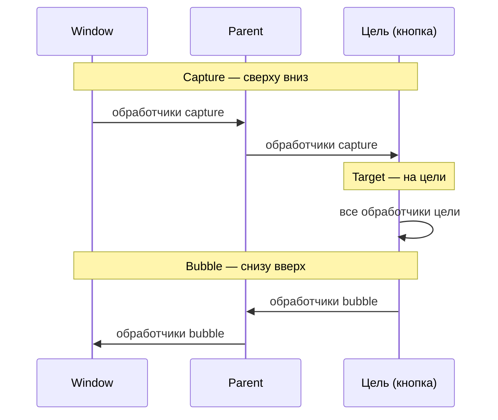

# События и обработка событий в браузере

<div class="article-tags">
  <span class="tag tag-required">ОБЯЗАТЕЛЬНО</span>
  <span class="tag tag-beginner">ДЛЯ НОВИЧКОВ</span>
</div>

<span class="complexity-badge">Разработчику</span>
<span class="complexity-badge">Архитектору</span>

---

## События

### Что такое событие?

**Событие** — это сигнал о том, что что-то произошло. Например: пользователь кликнул по кнопке, загрузилась страница, или вы сами отправили событие программно, чтобы уведомить другие части приложения.

В браузере событие связано с **DOM** и передаётся через объект **`Event`** (для клика — **`MouseEvent`**): тип, цель, фаза распространения, координаты и другие поля. Обработчик клика попадает в [очередь макрозадач](./21.md) Event Loop — тяжёлую работу внутри слушателя лучше выносить в `async` или откладывать.

Событие **не ограничивается одним элементом**: при клике по кнопке внутри блока браузер проходит цепочку предков и потомков. Порядок вызова обработчиков задаёт [распространение событий](#распространение-событий--всплытие-перехват-и-делегирование) (capture → target → bubble).

<div class="callout callout--tip">
  <div class="callout-title">См. также</div>

  <div class="callout-body">
  События форм — <a href="./36.md">валидация</a>; окно и URL — <a href="./41.md">BOM</a>; перетаскивание файлов — <a href="./42.md">чтение файлов</a>; клик и системное «Поделиться» — <a href="./44.md">Web Share API</a>.
</div>
  </div>


---

### Встроенные события

Существует множество встроенных событий, которые можно использовать:
1. События мыши:
	- click — клик мышью
	- mouseover / mouseout — наведение/уход курсора
	- mousedown / mouseup — нажатие/отпускание кнопки мыши
2. Клавиатурные события:
	- keydown — нажата клавиша
	- keyup — клавиша отпущена
3. Формы:
	- submit — отправка формы
	- focus / blur — фокус на элементе / потеря фокуса
	- change — изменение значения элемента формы
4. UI-события:
	- resize — изменение размера окна
	- scroll — прокрутка страницы

Вот более полный список основных событий:


| Имя события | Значение события | Применяется к элементам |
| :--- | :--- | :--- |
| `click` | Щелчок мышью или нажатие клавиши Enter при фокусе | Кнопки, ссылки, изображения, любые интерактивные элементы |
| `dblclick` | Двойной щелчок мышью | Кнопки, ссылки, текстовые области, изображения |
| `mousedown` | Нажатие любой кнопки мыши | Любые DOM-элементы |
| `mouseup` | Отпускание кнопки мыши | Любые DOM-элементы |
| `mouseover` | Перемещение курсора над элементом | Любые DOM-элементы |
| `mouseout` | Перемещение курсора за пределы элемента | Любые DOM-элементы |
| `mousemove` | Перемещение курсора внутри элемента | Любые DOM-элементы |
| `mouseenter` | Перемещение курсора внутрь элемента (не всплывает) | Любые DOM-элементы |
| `mouseleave` | Перемещение курсора из элемента (не всплывает) | Любые DOM-элементы |
| `keydown` | Нажатие клавиши на клавиатуре | Элементы с фокусом, окно документа |
| `keyup` | Отпускание клавиши на клавиатуре | Элементы с фокусом, окно документа |
| `keypress` | Нажатие клавиши для ввода символа (устаревшее) | Элементы с фокусом, окна ввода текста |
| `focus` | Получение фокуса элементом | Поля ввода, кнопки, ссылки |
| `blur` | Потеря фокуса элементом | Поля ввода, кнопки, ссылки |
| `focusin` | Фокус переходит внутрь элемента (всплывает) | Поля ввода, кнопки, ссылки |
| `focusout` | Фокус покидает элемент (всплывает) | Поля ввода, кнопки, ссылки |
| `change` | Изменение значения элемента формы | Поля ввода, выпадающие списки, чекбоксы |
| `input` | Мгновенное изменение значения поля ввода | Текстовые поля, поля поиска, `contenteditable` |
| `submit` | Отправка формы | Тег `<form>` |
| `reset` | Сброс формы | Тег `<form>` |
| `resize` | Изменение размера окна браузера | Окно браузера (`window`) |
| `scroll` | Прокрутка содержимого элемента или окна | Окно браузера, прокручиваемые блоки (`div`, `body`) |
| `load` | Загрузка ресурса (страницы, изображения) | Окно, изображения, скрипты, фреймы |
| `unload` | Закрытие страницы или переход на другую | Окно браузера |
| `error` | Ошибка загрузки ресурса | Окно, изображения, скрипты, фреймы |
| `abort` | Прерывание загрузки (например, отмена) | Элементы, поддерживающие AJAX или загрузку файлов |
| `contextmenu` | Открытие контекстного меню (правая кнопка мыши) | Любые DOM-элементы |
| `wheel` | Прокрутка колесиком мыши | Любые DOM-элементы |
| `copy` | Копирование выделенного текста | Любой активный элемент |
| `cut` | Вырезание выделенного текста | Любой активный элемент |
| `paste` | Вставка скопированного текста | Любой активный элемент |

---

### Пользовательские события

JavaScript позволяет создавать пользовательские события с помощью конструктора CustomEvent:
```javascript
const myEvent = new CustomEvent('myCustomEvent', {
  detail: {
    message: 'Привет! Это событие!',
    userId: 1001
  }
});
```

---

### Работа с событиями

Чтобы работать с событиями, нужно понять их жизненный цикл:
	- Создание события — создаётся объект события.
	- Инициация события — событие отправляется (dispatch).
	- Прослушивание события — другой код ожидает его и реагирует.

Отправка события:
```javascript
window.dispatchEvent(myEvent);
```
window используется здесь как глобальный объект, но события можно отправлять и на конкретные DOM-элементы.

Чтобы реагировать на событие, нужно добавить обработчик события с помощью метода addEventListener().

```javascript
window.addEventListener('myCustomEvent', (event) => {
  console.log("Получено событие:", event.type);
  const { message, userId } = event.detail;
  console.log(`Сообщение: ${message}, Пользователь ID: ${userId}`);
});
```

Важно: убедитесь, что обработчик добавлен до отправки события. Иначе он может его "не поймать".

Вы можете привязывать обработчики не только к window, но и к любым DOM-элементам:
```javascript
const button = document.getElementById('myButton');

button.addEventListener('click', () => {
  console.log('Кнопка нажата!');
});
```
Также можно отправлять кастомные события именно на элементы:
```javascript
const customClick = new CustomEvent('customClick', {
  detail: { info: 'Это наш собственный клик' }
});

button.dispatchEvent(customClick);
```
Методы:
	- addEventListener(type, handler) — добавляет обработчик
	- removeEventListener(type, handler) — удаляет обработчик
	- dispatchEvent(event) — отправляет событие

Свойства объекта event:
	- type — тип события
	- target — элемент, на котором произошло событие
	- currentTarget — элемент, на котором сработал обработчик
	- detail — данные, переданные в кастомном событии

Подробнее про фазы и делегирование — в разделе [ниже](#распространение-событий--всплытие-перехват-и-делегирование).


---

## Алгоритмические шаблоны

### Регистрация обработчика события
```javascript
<элемент>.addEventListener("<тип_события>", <обработчик>);
```

---

### Удаление обработчика события
```javascript
<элемент>.removeEventListener("<тип_события>", <обработчик>);
```

---

### Создание пользовательского события
```javascript
const <имя_события> = new CustomEvent("<тип_события>", {
  detail: <данные>
});
```

---

### Отправка события
```javascript
<элемент>.dispatchEvent(<имя_события>);
```

---

### Обработчик события с доступом к данным
```javascript
<элемент>.addEventListener("<тип_события>", (event) => {
  const данные = event.detail;
  // работа с данными
});
```

---

### Доступ к свойствам события внутри обработчика
```javascript
event.type        // строка с типом события
event.target      // элемент, на котором произошло событие
event.currentTarget // элемент, на котором установлен обработчик
event.detail      // данные, переданные через CustomEvent
```

---

### Привязка обработчика к конкретному DOM-элементу
```javascript
const элемент = document.querySelector("<селектор>");
элемент.addEventListener("<тип_события>", <обработчик>);
```

---

### Использование анонимной функции как обработчика
```javascript
<элемент>.addEventListener("<тип_события>", (event) => {
  // реакция на событие
});
```

---

### Использование именованной функции как обработчика
```javascript
function <имя_функции>(event) {
  // реакция на событие
}

<элемент>.addEventListener("<тип_события>", <имя_функции>);
```

---

### Отмена действия по умолчанию
```javascript
<элемент>.addEventListener("<тип_события>", (event) => {
  event.preventDefault();
});
```

---

## Распространение событий — всплытие, перехват и делегирование \{#распространение-событий--всплытие-перехват-и-делегирование\}

**Распространение (event propagation)** — прохождение события по DOM-дереву. Если на пути висят несколько обработчиков одного типа, браузер вызывает их в строгом порядке. Это основа **делегирования** и контроля вложенных интерфейсов (меню, модалки, списки).

---

### Три фазы

| Фаза | Направление | Когда срабатывают обработчики |
|------|-------------|-------------------------------|
| **Capture (перехват)** | сверху вниз: `window` → … → родитель цели | только если слушатель зарегистрирован с `{ capture: true }` |
| **Target (цель)** | на элементе, где произошло действие | все слушатели на этом узле |
| **Bubble (всплытие)** | снизу вверх: цель → … → `window` | слушатели **без** `capture: true` (режим по умолчанию) |



По умолчанию `addEventListener` подписывает обработчик на **всплытие**. Для перехвата на пути вниз:

```javascript
element.addEventListener('click', handler, { capture: true });
// эквивалент устаревшей записи: addEventListener('click', handler, true)
```

| Свойство | Смысл |
|----------|--------|
| `event.target` | узел, на котором **возникло** событие (часто самый глубокий элемент под курсором) |
| `event.currentTarget` | узел, **на котором выполняется** текущий обработчик |
| `event.eventPhase` | `1` — capture, `2` — target, `3` — bubble |

---

### Всплытие — порядок по умолчанию

Разметка:

```html
<div id="parent">
  <button id="child" type="button">Нажми</button>
</div>
```

Оба слушателя на фазе bubble:

```javascript
const parent = document.getElementById('parent');
const child = document.getElementById('child');

parent.addEventListener('click', () => console.log('parent'));
child.addEventListener('click', () => console.log('child'));
```

Клик по кнопке в консоли:

1. `child`
2. `parent`

Сначала цель, затем предки — так устроено **всплытие**.

---

### Перехват (capturing)

Тот же HTML; родитель слушает capture, кнопка — bubble:

```javascript
parent.addEventListener('click', () => console.log('parent (capture)'), { capture: true });
child.addEventListener('click', () => console.log('child'));
```

Клик по кнопке:

1. `parent (capture)`
2. `child`

Перехват удобен, когда нужно обработать событие **до** дочерних узлов: глобальные горячие клавиши, закрытие выпадающего меню по клику «снаружи», логирование на уровне контейнера.

---

### Остановка распространения

**`event.stopPropagation()`** обрывает дальнейший проход по дереву (и вверх, и вниз — в зависимости от текущей фазы). Обработчики на других узлах той же фазы не вызовутся.

```javascript
child.addEventListener('click', (event) => {
  event.stopPropagation();
  console.log('только child');
});

parent.addEventListener('click', () => console.log('parent не сработает'));
```

Типичные случаи:

- клик по кнопке внутри карточки — карточка не должна открываться целиком;
- клик по содержимому модального окна — фон (оверлей) не получает `click`;
- вложенный интерактивный виджет внутри большого `click`-обработчика.

**`event.stopImmediatePropagation()`** дополнительно отменяет **остальные** обработчики **на том же элементе** для этого типа события. Используйте редко — мешает композиции нескольких библиотек на одном узле.

<div class="callout callout--tip">
  <div class="callout-title">Когда останавливать всплытие</div>

  <div class="callout-body">
  Для списков и таблиц обычно хватает <strong>делегирования</strong> на родителе. <code>stopPropagation</code> уместен точечно — там, где родитель и ребёнок реагируют на одно действие по-разному.
</div>
  </div>


---

### События без всплытия

Делегирование через родителя работает только если событие **всплывает** (`bubbles: true`).

| Событие | Всплывает? | Альтернатива для делегирования |
|---------|------------|--------------------------------|
| `click`, `input`, `change`, `keydown` | да | родитель + `target` / `closest` |
| `focus`, `blur` | нет | `focusin`, `focusout` (всплывают) |
| `mouseenter`, `mouseleave` | нет | `mouseover`, `mouseout` или обработчик на общем контейнере |
| `load` на `` | нет | слушатель на элементе или `event.target` в фазе target |

---

### Опции `addEventListener`

Третий аргумент — объект (рекомендуемый стиль):

| Опция | Эффект |
|-------|--------|
| `capture: true` | слушать фазу перехвата |
| `once: true` | снять обработчик после первого срабатывания |
| `passive: true` | обработчик не вызовет `preventDefault()` — браузер может сразу прокручивать (см. `scroll` в [BOM](./41.md)) |

```javascript
button.addEventListener('click', handleOnce, { once: true });
```

---

### Делегирование событий

**Делегирование** — один обработчик на **родителе** вместо сотен обработчиков на динамических дочерних узлах. Событие всплывает; в обработчике проверяют, подходит ли `event.target`:

```javascript
const list = document.getElementById('todo-list');

list.addEventListener('click', (event) => {
  const item = event.target.closest('[data-id]');
  if (!item || !list.contains(item)) return;

  if (event.target.matches('[data-action="delete"]')) {
    item.remove();
  }
});
```

Когда делегирование уместно:

- список, таблица, меню — элементы добавляются и удаляются без перепривязки слушателей;
- много однотипных кнопок (чекбоксы, "удалить", звёзды рейтинга).

Когда лучше вешать обработчик на сам элемент:

- редкие уникальные виджеты с тяжёлой логикой;
- события **без всплытия** (`focus`, `blur`, `mouseenter`, `mouseleave`) — делегирование через родителя не сработает, нужен другой контейнер или `focusin` / `focusout`.

`Element.closest(selector)` поднимается от `target` к родителям и находит подходящий узел — удобно, если клик пришёлся на вложенный `<span>` внутри кнопки.

Полный сценарий — динамический список задач:

```html
<ul id="todo-list">
  <li data-id="1">
    Задача 1
    <button type="button" data-action="delete">×</button>
  </li>
</ul>
<button type="button" id="add">Добавить</button>
```

```javascript
const list = document.getElementById('todo-list');
let nextId = 2;

document.getElementById('add').addEventListener('click', () => {
  const li = document.createElement('li');
  li.dataset.id = String(nextId++);
  li.innerHTML = `Задача ${li.dataset.id} <button type="button" data-action="delete">×</button>`;
  list.appendChild(li);
});

list.addEventListener('click', (event) => {
  const deleteBtn = event.target.closest('[data-action="delete"]');
  if (!deleteBtn || !list.contains(deleteBtn)) return;
  deleteBtn.closest('li')?.remove();
});
```

Новые `<li>` появляются без `addEventListener` на каждой строке — один слушатель на `#todo-list`.

<div class="callout callout--tip">
  <div class="callout-title">Производительность</div>

  <div class="callout-body">
  В <a href="./14.md">применении JavaScript в вебе</a> делегирование сочетают с кэшированием ссылок на DOM: не вызывайте <code>querySelector</code> на весь документ в каждом клике, держите один слушатель на стабильном контейнере.
</div>
  </div>


---

## Методы объектов событий

Методы используются для управления поведением события, его распространением и выполнением действий по умолчанию.

---

### Основные методы объекта Event

| Метод | Описание |
| :--- | :--- |
| `event.preventDefault()` | Отменяет стандартное действие браузера для события. Например, предотвращает переход по ссылке при клике или отправку формы. |
| `event.stopPropagation()` | Прерывает дальнейшее распространение по DOM (см. [остановку распространения](#остановка-распространения)). |
| `event.stopImmediatePropagation()` | То же плюс отмена остальных обработчиков на текущем элементе для этого типа. |
| `event.initEvent(type, bubbles, cancelable)` | Инициализирует событие программно (устаревший метод, используется редко). |
| `event.isTrusted` | Возвращает `true`, если событие вызвано пользователем (клик, ввод), и `false`, если создано скриптом. |

---

### Методы работы с обработчиками (на объектах DOM)

Эти методы вызываются непосредственно на элементах DOM или глобальных объектах.

| Метод | Описание |
| :--- | :--- |
| `element.addEventListener(type, handler, options)` | Добавляет новый обработчик события. Принимает тип события, функцию-обработчик и опциональные параметры (флаг `capture`, `once`). |
| `element.removeEventListener(type, handler, options)` | Удаляет ранее добавленный обработчик события. Требуется указать ту же функцию-ссылку, что и при добавлении. |
| `element.dispatchEvent(event)` | Создает и запускает событие на конкретном элементе. Используется для ручного инициирования событий (в том числе пользовательских). |
| `element.click()` | Синтетический метод, вызывающий событие `click` как если бы пользователь нажал кнопку. |
| `element.focus()` | Устанавливает фокус на элемент, вызывая события `focus` и `focusin`. |
| `element.blur()` | Снимает фокус с элемента, вызывая события `blur` и `focusout`. |

---

## Свойства объекта события

Свойства предоставляют информацию о событии, контексте его возникновения и данных, переданных вместе с ним.

---

### Базовые свойства

| Свойство | Тип данных | Описание |
| :--- | :--- | :--- |
| `type` | Строка | Название типа события (например, "click", "keydown"). |
| `target` | Объект DOM | Исходный элемент, на котором произошло событие. |
| `currentTarget` | Объект DOM | Элемент, на котором в данный момент установлен обработчик события. |
| `eventPhase` | Число | Фаза: `1` — capture, `2` — target (на целевом элементе), `3` — bubble. |
| `bubbles` | Булево | Указывает, всплывает ли событие вверх по DOM-дереву. |
| `cancelable` | Булево | Указывает, можно ли отменить действие события с помощью `preventDefault()`. |
| `defaultPrevented` | Булево | `true`, если было вызвано `preventDefault()`. |
| `isTrusted` | Булево | `true`, если событие сгенерировано браузером напрямую пользователем; `false` — если создано скриптом. |
| `timeStamp` | Число | Время возникновения события в миллисекундах с момента загрузки страницы. |

---

### Специфические свойства для типов событий

#### Свойства событий мыши
| Свойство | Описание |
| :--- | :--- |
| `clientX`, `clientY` | Координаты курсора относительно видимой области окна браузера. |
| `screenX`, `screenY` | Координаты курсора относительно всего экрана монитора. |
| `pageX`, `pageY` | Координаты курсора относительно всей страницы (учитывает прокрутку). |
| `button` | Номер нажатой кнопки мыши (0 — левая, 1 — средняя, 2 — правая). |
| `buttons` | Битовая маска состояния всех нажатых кнопок мыши во время движения. |
| `movementX`, `movementY` | Смещение курсора относительно предыдущего события движения. |

---

#### Свойства событий клавиатуры
| Свойство | Описание |
| :--- | :--- |
| `key` | Значение нажатой клавиши (строка, например, "a", "Enter", "Shift"). |
| `code` | Физическое расположение клавиши на клавиатуре (например, "KeyA", "Space"). |
| `ctrlKey`, `shiftKey`, `altKey`, `metaKey` | Статус соответствующих модификаторов (нажата ли клавиша Ctrl, Shift и т.д.). |
| `repeat` | `true`, если событие генерируется при удержании клавиши. |
| `location` | Расположение клавиши на клавиатуре (0 — основная зона, 1 — Numpad, 2 — Meta/AltGr). |

---

#### Свойства событий формы
| Свойство | Описание |
| :--- | :--- |
| `inputType` | Тип ввода (для событий `input`), описывающий источник изменения (например, "insertText", "deleteContentBackward"). |
| `dataTransfer` | Объект для передачи данных при перетаскивании (drag and drop). |

---

#### Свойства пользовательских событий (CustomEvent)
| Свойство | Описание |
| :--- | :--- |
| `detail` | Произвольный объект или данные, переданные при создании события через конструктор `new CustomEvent()`. |

---

## Drag-and-drop (перетаскивание)

API **Drag and Drop** переносит данные между элементами или из ОС в страницу (файлы). Цепочка событий на **источнике** и **приёмнике**:

| Событие | Где | Назначение |
|---------|-----|------------|
| `dragstart` | источник | начало перетаскивания; заполнить `dataTransfer` |
| `dragover` | приёмник | элемент под курсором — **обязательно** `preventDefault()`, иначе drop не сработает |
| `dragleave` | приёмник | курсор ушёл с зоны |
| `drop` | приёмник | отпускание; читать `dataTransfer` |
| `dragend` | источник | завершение (успех или отмена) |

Источник должен быть **`draggable="true"`** (для файлов с диска — зона drop без draggable).

```html
<ul id="list">
  <li draggable="true" data-id="1">Задача 1</li>
  <li draggable="true" data-id="2">Задача 2</li>
</ul>
<div id="done-zone">Выполнено</div>
```

```javascript
const list = document.getElementById('list');
const doneZone = document.getElementById('done-zone');

list.addEventListener('dragstart', (event) => {
  if (!event.target.matches('li[draggable]')) return;
  event.dataTransfer.setData('text/plain', event.target.dataset.id);
  event.dataTransfer.effectAllowed = 'move';
});

doneZone.addEventListener('dragover', (event) => {
  event.preventDefault();
  event.dataTransfer.dropEffect = 'move';
});

doneZone.addEventListener('drop', (event) => {
  event.preventDefault();
  const id = event.dataTransfer.getData('text/plain');
  const item = list.querySelector(`[data-id="${id}"]`);
  if (item) doneZone.appendChild(item);
});
```

**`dataTransfer`** хранит строки по MIME-ключу (`text/plain`, `text/html`). Для файлов с рабочего стола:

```javascript
dropZone.addEventListener('drop', (event) => {
  event.preventDefault();
  const file = event.dataTransfer.files[0];
  if (file) handleFile(file); // см. чтение файлов
});
```

Связь: [чтение файлов в браузере](./42.md), [FormData](./36.md).

На тач-устройствах Drag and Drop работает не везде одинаково — для мобильных часто делают отдельный UI (кнопки, long-press с полифилом).

---

## Дополнительные примеры использования свойств

### Пример доступа к координатам мыши
```javascript
document.addEventListener('mousemove', (event) => {
  console.log(`Позиция X: ${event.clientX}, Y: ${event.clientY}`);
  console.log(`Координаты на странице: ${event.pageX}, ${event.pageY}`);
});
```

---

### Пример проверки модификаторов клавиш
```javascript
document.addEventListener('keydown', (event) => {
  if (event.ctrlKey && event.key === 's') {
    event.preventDefault(); // Отменяем стандартное сохранение браузера
    console.log('Выполняется кастомное сохранение...');
    // Логика сохранения
  }
});
```

---

### Пример работы с данными в пользовательском событии
```javascript
// Создание события с данными
const loginEvent = new CustomEvent('userLogin', {
  detail: {
    username: 'admin',
    timestamp: Date.now(),
    role: 'superuser'
  }
});

// Обработка события
document.addEventListener('userLogin', (event) => {
  const { username, role } = event.detail;
  console.log(`Пользователь ${username} вошел в систему с ролью ${role}`);
  
  // Доступ к другим свойствам
  console.log(`Время события: ${event.timeStamp}`);
  console.log(`Доверено событие: ${event.isTrusted}`);
});

// Отправка события
document.dispatchEvent(loginEvent);
```

---

### Пример разницы между target и currentTarget
```html
<div id="parent">
  <button id="child">Нажми меня</button>
</div>

<script>
const parent = document.getElementById('parent');

parent.addEventListener('click', (event) => {
  console.log('Целевой элемент (target):', event.target.id); // child
  console.log('Элемент обработчика (currentTarget):', event.currentTarget.id); // parent
});
</script>
```

При клике на кнопку `id="child"`:

- `event.target` — кнопка (источник клика);
- `event.currentTarget` — `parent`, потому что обработчик зарегистрирован на нём.

Та же пара свойств лежит в основе [делегирования](#делегирование-событий): `currentTarget` — контейнер со слушателем, `target` — конкретный кликнутый узел.

---

## Краткий итог

**Событие** в браузере идёт по DOM в фазах **capture → target → bubble**. По умолчанию слушают **всплытие**; **`{ capture: true }`** — перехват сверху вниз. **`stopPropagation()`** обрывает цепочку; **`target`** и **`currentTarget`** различают источник клика и элемент с обработчиком. **Делегирование** — один слушатель на родителе для динамических списков и сложных UI. Для форм, файлов и окна см. [валидацию](./36.md), [чтение файлов](./42.md) и [BOM](./41.md).

---

## Практический шаблон работы с событиями

Чтобы интерфейс не деградировал с ростом функциональности, полезно держать единый подход к обработке событий.

Базовые правила:

- использовать делегирование на стабильном контейнере;
- не выполнять тяжелые вычисления прямо в `click`-обработчике;
- аккуратно применять `stopPropagation`, только когда действительно нужно;
- обязательно снимать слушатели при уничтожении виджета.

```javascript
const list = document.getElementById("users");

function onListClick(event) {
  const actionNode = event.target.closest("[data-action]");
  if (!actionNode || !list.contains(actionNode)) {
    return;
  }

  if (actionNode.dataset.action === "remove") {
    actionNode.closest("li")?.remove();
  }
}

list.addEventListener("click", onListClick);
```

Смежные материалы:

- [Асинхронное программирование в JavaScript](./21.md)
- [Работа с DOM в JavaScript](./24.md)
- [Валидация форм в JavaScript](./36.md)
