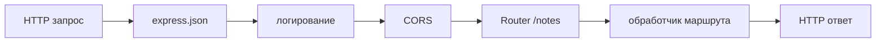

# Express — middleware, маршруты и ошибки

<div class="article-tags">
  <span class="tag tag-required">ОБЯЗАТЕЛЬНО</span>
  <span class="tag tag-beginner">ДЛЯ НОВИЧКОВ</span>
</div>

<span class="complexity-badge">Разработчику</span>

---

## Express — middleware, маршруты и ошибки

### Для кого эта статья

Вы уже подняли API из [Первая программа на Node.js](./262.md): видели `app.get`, `app.post`, `req.body`. Когда эндпоинтов становится больше пяти, один файл `server.js` превращается в "простыню". Здесь — как **разложить** сервер по папкам, **пропустить** запрос через общие проверки (middleware), **разрешить** браузерному фронту ходить на API (CORS) и **одинаково** отвечать на ошибки.

Склейка с React/Vue/Next: [Fullstack 264](./264.md).

Express — самый распространённый учебный фреймворк для Node; идеи цепочки middleware и роутеров переносятся на Fastify, Hono и другие.

---

## Как Express обрабатывает один запрос

HTTP-запрос проходит **цепочку функций**. Каждая может:

- что-то сделать с `req` / `res` (прочитать тело, поставить заголовок);
- вызвать `next()` — "передай дальше";
- завершить ответ (`res.json`, `res.status`) — дальше цепочка для этого запроса обычно не идёт.



Обработчик `app.get('/notes', …)` — тоже middleware, только последний в своей ветке: он отправляет ответ клиенту.

| Объект | Что внутри (упрощённо) |
|--------|-------------------------|
| `req` | method, url, headers, `body`, `params` (`:id`), `query` (`?page=1`) |
| `res` | `status()`, `json()`, `send()` — формирование ответа |
| `next` | Переход к следующему middleware; `next(err)` — прыжок в обработчик ошибок |

---

## Структура папок (учебный проект)

```
notes-api/
  server.js          # создание app, listen
  routes/
    notes.js         # Router для /notes
    health.js        # GET /health
  middleware/
    errorHandler.js
    notFound.js
  store/
    memoryStore.js   # логика данных (потом — БД)
```

`server.js` остаётся **тонким**: только `app.use(...)`, подключение роутеров, глобальные middleware. Бизнес-логика заметок — в `store/` или сервисах.

---

## Router и префиксы

`express.Router()` — мини-приложение со своими маршрутами. Его монтируют с префиксом:

```javascript
// routes/health.js
import { Router } from 'express';

const router = Router();
router.get('/', (_req, res) => {
  res.json({ status: 'ok', uptime: process.uptime() });
});
export default router;
```

```javascript
// server.js
import healthRouter from './routes/health.js';
app.use('/health', healthRouter); // итоговый путь: GET /health
```

Путь в роутере `'/'` + префикс `'/health'` = **`GET /health`**. Для заметок: `app.use('/notes', notesRouter)` и внутри роутера `router.get('/')` → `GET /notes`.

Плюсы: проще читать, тестировать supertest-ом по модулю, вынести группу в отдельный микросервис позже.

---

## CORS — когда фронт в браузере

**Origin** — схема + хост + порт. Для браузера `http://localhost:5173` и `http://localhost:3000` — **разные** origin, даже на одной машине.

Браузер по правилам безопасности **блокирует** ответ API, если сервер не вернул заголовки CORS (`Access-Control-Allow-Origin` и др.). **curl** и Postman CORS не проверяют — отсюда типичная путаница: "в Postman работает, в React — нет".

```bash
npm install cors
```

```javascript
import cors from 'cors';

app.use(cors({
  origin: ['http://localhost:5173', 'http://127.0.0.1:5173'],
  methods: ['GET', 'POST', 'DELETE'],
}));
```

| Параметр | Смысл |
|----------|--------|
| `origin` | Список адресов фронта, которым разрешён доступ |
| `methods` | Какие HTTP-методы разрешены в preflight |

В production укажите реальный домен фронта. Для cookie с `credentials: true` нельзя ставить `origin: '*'` — нужен конкретный домен.

**Прокси в Vite** — альтернатива: браузер ходит на `localhost:5173/api/...`, dev-сервер пересылает на `:3000`. Тогда CORS в API в dev можно не открывать — см. [264.md](./264.md).

---

## Обработка ошибок

### Проблема с `async`

В `async (req, res) => { … }` необработанный `reject` Promise может **не попасть** в ваш `errorHandler`. Обёртка передаёт ошибку в `next(err)`:

```javascript
export const asyncHandler = (fn) => (req, res, next) => {
  Promise.resolve(fn(req, res, next)).catch(next);
};

router.get('/:id', asyncHandler(async (req, res) => {
  const note = await store.find(req.params.id);
  if (!note) return res.status(404).json({ error: 'not found' });
  res.json(note);
}));
```

Разбор: `Promise.resolve(fn(...))` запускает async-функцию; `.catch(next)` при любой ошибке вызывает `next(err)`.

---

### Центральный error middleware

Подключается **после** всех маршрутов. Сигнатура **ровно четыре** аргумента — Express по этому понимает, что это обработчик ошибок:

```javascript
// middleware/errorHandler.js
export function errorHandler(err, req, res, _next) {
  console.error(err);
  const status = err.status ?? 500;
  res.status(status).json({
    error: err.message ?? 'Internal Server Error',
  });
}
```

```javascript
import { notFound } from './middleware/notFound.js';
import { errorHandler } from './middleware/errorHandler.js';

app.use(notFound);      // 404 для неизвестных путей
app.use(errorHandler);  // всё, что пришло через next(err)
```

`middleware/notFound.js`:

```javascript
export function notFound(req, res, next) {
  res.status(404).json({ error: `Route ${req.method} ${req.url} not found` });
}
```

В бизнес-коде можно бросать осмысленную ошибку:

```javascript
const err = new Error('text is required');
err.status = 400;
throw err;
```

`??` — "если слева `null` или `undefined`, возьми справа"; удобно для кода по умолчанию.

---

## Валидация тела запроса

Ручная проверка из [262.md](./262.md) (`if (!text)`) достаточна для старта. При росте API удобна схема **Zod**:

```bash
npm install zod
```

```javascript
import { z } from 'zod';

const createNoteSchema = z.object({
  text: z.string().trim().min(1).max(2000),
});

router.post('/', (req, res, next) => {
  const parsed = createNoteSchema.safeParse(req.body);
  if (!parsed.success) {
    return res.status(400).json({ error: parsed.error.flatten() });
  }
  const { text } = parsed.data; // уже обрезанная и проверенная строка
  // store.add(text) ...
});
```

`safeParse` возвращает `{ success: true, data }` или `{ success: false, error }` без выброса исключения — проще отдать 400 клиенту.

---

### Частые ошибки

| Симптом | Причина | Решение |
|---------|---------|---------|
| CORS только в Postman | Браузерная политика | `cors` или прокси Vite |
| `Cannot set headers after they are sent` | Дважды `res.json` или нет `return` после ошибки | После `res.status(400).json(...)` — `return` |
| 404 на всех путях | Router без префикса или лишний префикс | Сверить `app.use('/notes', router)` и пути внутри |
| Stack trace у клиента | В production в JSON только `error`, детали — в лог |

---

### Что попробовать

1. Пакет `helmet` — базовые заголовки безопасности одной строкой `app.use(helmet())`.
2. Разные ответы при `NODE_ENV=development` и `production`.
3. Тесты supertest на `GET /health` и `POST /notes` — [33.md](./33.md).

---

## Связанные материалы

- [Первая программа на Node.js](./262.md)
- [Fullstack — API и фронт](./264.md)
- [Node.js — серверный JavaScript](./26.md)
- [React](./272.md)
- [Тестирование Vitest](./33.md)

---
---

{/* http-basics-link  */}
:::tip Основа по протоколу
Базовый разбор HTTP и HTTPS находится в отдельной статье — [HTTP как основа веб-интеграций](/encyclopedia/2-system-network/2-09-osnovy-integratsionnogo-vzaimodeystviya/118).
:::

