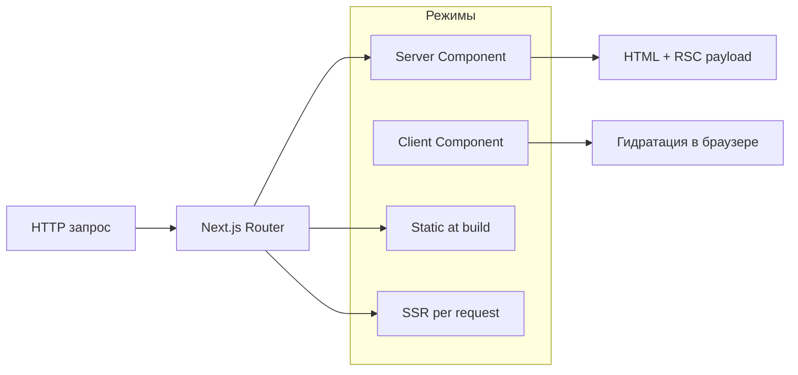

# Next.js

<div class="article-tags">
  <span class="tag tag-required">ОБЯЗАТЕЛЬНО</span>
  <span class="tag tag-beginner">ДЛЯ НОВИЧКОВ</span>
</div>

<span class="complexity-badge">Разработчику</span>
<span class="complexity-badge">Архитектору</span>

## Next.js

**Next.js** — фреймворк поверх [React](./27.md): файловая маршрутизация, серверный рендеринг (SSR), статическая генерация (SSG), API Routes и (в App Router) **React Server Components**.

Пошаговый старт: [Первая программа на Next.js](./2731.md). Сервер на Node: [Node.js](./26.md), [Первая программа на Node.js](./262.md).

---

## Зачем Next.js, если есть React

| Задача | «Голый» React + Vite | Next.js |
|--------|----------------------|---------|
| Маршруты `/about`, `/blog/[id]` | react-router, настройка | `app/` или `pages/` из коробки |
| SEO и первый HTML | CSR — пустая страница до JS | SSR/SSG отдают готовый HTML |
| API рядом с UI | Отдельный Express | Route Handlers / API routes |
| Деплой | Статика + отдельный BFF | Vercel, Node, Docker |

Next.js не заменяет изучение React: компоненты, хуки и состояние те же.

---

## App Router vs Pages Router

| | **App Router** (`app/`) | **Pages Router** (`pages/`) |
|---|-------------------------|-----------------------------|
| Статус | Рекомендуемый для новых проектов | Legacy, но поддерживается |
| Файлы | `page.tsx`, `layout.tsx`, `loading.tsx` | `pages/index.tsx` |
| Серверные компоненты | Да, по умолчанию | Нет (клиентский React) |
| Data fetching | `async` Server Components, `fetch` с кэшем | `getServerSideProps`, `getStaticProps` |

Новые материалы энциклопедии ориентируются на **App Router** (Next.js 13+).

---

## Рендеринг



- **Server Component** — выполняется на сервере, не попадает в бандл клиента (нет `useState` / `useEffect`).
- **Client Component** — директива `'use client'` в начале файла.
- **SSG** — `export const dynamic = 'force-static'` или генерация на build.
- **SSR** — динамические страницы при каждом запросе.

---

## Структура проекта (App Router)

```
my-app/
  app/
    layout.tsx      # общий каркас
    page.tsx        # /
    about/
      page.tsx      # /about
    api/
      hello/
        route.ts    # GET /api/hello
  public/           # статика
  next.config.ts
  package.json
```

---

## Route Handlers (API)

```typescript
// app/api/notes/route.ts
import { NextResponse } from 'next/server';

export async function GET() {
  return NextResponse.json([{ id: 1, text: 'demo' }]);
}

export async function POST(request: Request) {
  const body = await request.json();
  return NextResponse.json(body, { status: 201 });
}
```

---

## Экосистема

| Инструмент | Роль |
|------------|------|
| **Turbopack** | Быстрый dev-сборщик (альтернатива Webpack в dev) |
| **next/image** | Оптимизация изображений |
| **next/font** | Локальные шрифты без layout shift |
| **Middleware** | `middleware.ts` — auth, редиректы, i18n |

---

## Когда не нужен Next.js

- Виджет внутри чужого сайта (достаточно React + Vite).
- Чистое SPA за API без SEO.
- Мобильное приложение — [React Native](/encyclopedia/4-code-dev/4-12-mobilnye-prilozheniya/1131).

---

## Связанные материалы

- [Первая программа на Next.js](./2731.md)
- [Первая программа на React](./272.md)
- [TypeScript](./30.md)

---
