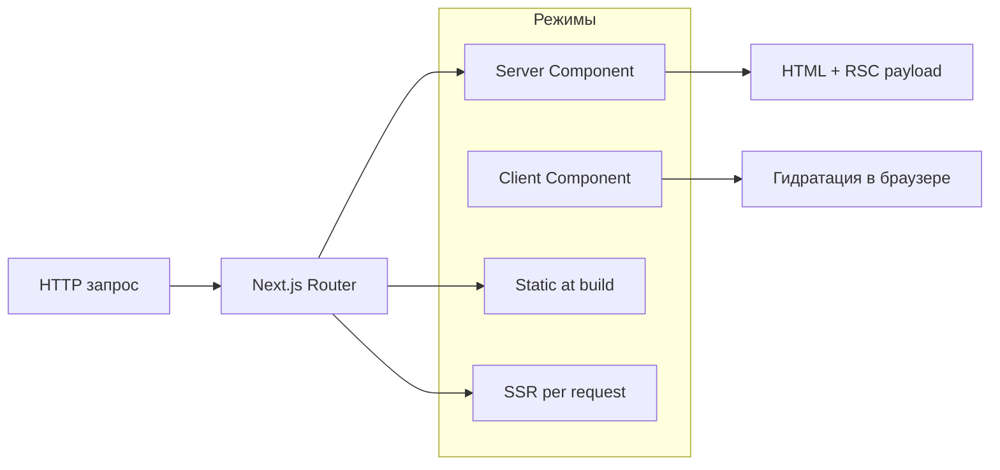

# Next.js

<div class="article-tags">
  <span class="tag tag-required">ОБЯЗАТЕЛЬНО</span>
  <span class="tag tag-beginner">ДЛЯ НОВИЧКОВ</span>
</div>

<span class="complexity-badge">Разработчику</span>
<span class="complexity-badge">Архитектору</span>

---

## Next.js

**Next.js** — фреймворк поверх [React](./27.md). React отвечает за компоненты и состояние; Next добавляет **маршруты по файлам**, **рендеринг на сервере**, встроенные **API-маршруты** и удобный **деплой**.

Пошаговый старт с кодом: [Первая программа на Next.js](./2731.md). Сервер на Node: [262](./262.md). Склейка фронта и API: [264](./264.md).

---

### Как изучать материал

1. Сначала пройдите [2731.md](./2731.md) и запустите проект.
2. Затем вернитесь сюда к разделам про режимы рендеринга и App Router.
3. После этого закрепите на мини-задаче с `route.ts` и одной client-страницей.

Так теория сразу связывается с рабочим кодом.

---

### Мини-демо композиции домашней страницы

В Next.js тот же подход можно держать в `app/page.tsx`: страница остаётся короткой, а секции переиспользуются.

```tsx

import { MainHeader } from '@/components/layout/MainHeader';
import { MainFooter } from '@/components/layout/MainFooter';
import { HeroBlock } from '@/components/sections/HeroBlock';
import { AdvantageBlock } from '@/components/sections/AdvantageBlock';
import { ProcessBlock } from '@/components/sections/ProcessBlock';
import { ProofBlock } from '@/components/sections/ProofBlock';
import { CostBlock } from '@/components/sections/CostBlock';
import { HelpBlock } from '@/components/sections/HelpBlock';
import { StartBlock } from '@/components/sections/StartBlock';

export default function HomePage() {
  return (
    <>
      <MainHeader />
      <main>
        <HeroBlock />
        <AdvantageBlock />
        <ProcessBlock />
        <ProofBlock />
        <CostBlock />
        <HelpBlock />
        <StartBlock />
      </main>
      <MainFooter />
    </>
  );
}
```

Разбор:
- Импорты из `@/components/...` собирают страницу из переиспользуемых блоков.
- `HomePage` возвращает JSX-композицию с разделением на header, main и footer.
- Фрагмент `<>...</>` объединяет несколько корневых элементов без лишней обёртки.
- Такой подход сохраняет `page.tsx` компактным и масштабируемым.

Такой формат удобно масштабировать: команды могут работать над секциями параллельно, не перегружая `page.tsx`.

---

### React и Next — кто за что отвечает

| Задача | "Голый" React + Vite | Next.js |
|--------|----------------------|---------|
| Страница `/about`, `/blog/42` | Подключить react-router, настроить | Папка `app/about/page.tsx` → URL готов |
| Первый HTML для поисковиков | Пустая страница, пока не загрузится JS (CSR) | Сервер отдаёт HTML с текстом (SSR/SSG) |
| API рядом с UI | Отдельный Express на другом порту | `app/api/.../route.ts` |
| Деплой | Статика + отдельный бэкенд | Vercel, Node, Docker из коробки |

Next **дополняет** React: хуки `useState`, компоненты, props — те же. Сначала имеет смысл пройти [Первая программа на React](./272.md), затем переносить компоненты в `app/`.

---

## App Router и Pages Router

| | **App Router** (`app/`) | **Pages Router** (`pages/`) |
|---|-------------------------|-----------------------------|
| Статус | Рекомендуемый для новых проектов (Next 13+) | Поддерживается, много legacy-кода |
| Файлы страниц | `page.tsx`, оболочка `layout.tsx` | `pages/index.tsx`, `pages/about.tsx` |
| Серверные компоненты | По умолчанию сервер | Всё клиентское React |
| Загрузка данных | `async` Server Component + `fetch` | `getServerSideProps`, `getStaticProps` |

Материалы энциклопедии ориентируются на **App Router**.

---

## Режимы рендеринга — простыми словами

| Режим | Когда HTML готов | Типичный случай |
|-------|------------------|-----------------|
| **CSR** (Client) | В браузере, после загрузки JS | Счётчик, форма с `'use client'` |
| **SSR** (Server) | На сервере при **каждом** запросе | Лента с актуальными данными |
| **SSG** (Static) | При **сборке** (`npm run build`) | Блог, документация, лендинг |
| **RSC** (Server Component) | На сервере; JS компонента в браузер часто не попадает | Список без интерактива |



Разбор:
- Диаграмма показывает, как запрос проходит через роутер Next и попадает в нужный режим рендеринга.
- Ветви `RSC`, `SSR` и `SSG` формируют HTML на серверной стороне.
- После получения HTML браузер выполняет гидратацию клиентских частей.
- Схема помогает понимать, где именно выполняется код: на сервере или в браузере.

- **Server Component** — файл **без** `'use client'`. Можно `await fetch(...)` в теле компонента. Нельзя `useState`, `onClick`.
- **Client Component** — первая строка `'use client'`. Как обычный React.
- **Гидратация** — браузер "оживляет" HTML: вешает обработчики на кнопки.

---

## Структура проекта (App Router)

```
my-app/
  app/
    layout.tsx      # общий каркас
    page.tsx        # /
    about/
      page.tsx      # /about
    api/
      hello/
        route.ts    # GET /api/hello
  public/           # статика
  next.config.ts
  package.json
```

Разбор:
- `app/` содержит маршруты, страницы и API-обработчики App Router.
- `layout.tsx` задаёт общий каркас, который переиспользуется между страницами.
- `api/.../route.ts` описывает серверные HTTP-endpoint'ы рядом с UI.
- `public/` хранит статические файлы, а `next.config.ts` отвечает за проектные настройки.

| Файл | Роль |
|------|------|
| `layout.tsx` | Общая рамка; при переходах между страницами **остаётся** |
| `page.tsx` | Уникальное содержимое маршрута |
| `route.ts` | HTTP API, не React-страница |

---

## Route Handlers — API внутри Next

```typescript
// app/api/notes/route.ts

import { NextResponse } from 'next/server';

export async function GET() {
  return NextResponse.json([{ id: 1, text: 'demo' }]);
}

export async function POST(request: Request) {
  const body = await request.json();
  return NextResponse.json(body, { status: 201 });
}
```

Разбор:
- Экспорт `GET` и `POST` создаёт два обработчика одного и того же URL.
- `NextResponse.json(...)` сериализует данные в JSON и выставляет корректные заголовки ответа.
- `await request.json()` читает тело POST-запроса как объект.
- `status: 201` явно сообщает клиенту, что ресурс успешно создан.

Отдельный [Express 262](./262.md) нужен, когда API — отдельный сервис, своя БД, другая команда. Route Handler удобен для BFF: проксировать на внутренний API, спрятать ключи.

---

## Экосистема

| Инструмент | Роль |
|------------|------|
| **Turbopack** | Быстрая пересборка в dev |
| **next/image** | Оптимизация изображений |
| **next/font** | Шрифты без скачка вёрстки |
| **Middleware** | `middleware.ts` — auth, редиректы, i18n до рендера |

---

## Когда достаточно React без Next

- Виджет внутри чужого сайта (один bundle).
- Внутреннее SPA за VPN, SEO не важен.
- Мобильное приложение — [React Native](/encyclopedia/4-code-dev/4-12-mobilnye-prilozheniya/1131).

Когда нужны SEO, много страниц и один репозиторий — Next типичный выбор.

---

### Частые вопросы

| Вопрос | Ответ |
|--------|--------|
| Next заменяет Node? | Next **использует** Node для сервера; Express можно держать отдельно |
| Обязателен TypeScript? | Нет, но в новых проектах его выбирают в мастере |
| Порт 3000 занят API | Сдвиньте API на 3001 — см. [264](./264.md) |

---

## Связанные материалы

- [Первая программа на Next.js](./2731.md)
- [Первая программа на React](./272.md)
- [Fullstack — API и фронт](./264.md)
- [TypeScript](./30.md)
- [Тестирование — Vitest](./33.md)

---

{/* http-basics-link  */}
<div class="callout callout--tip">
  <div class="callout-title">Основа по протоколу</div>

  <div class="callout-body">
  Базовый разбор HTTP и HTTPS находится в отдельной статье — [HTTP как основа веб-интеграций](/encyclopedia/2-system-network/2-09-osnovy-integratsionnogo-vzaimodeystviya/118).
</div>
  </div>


