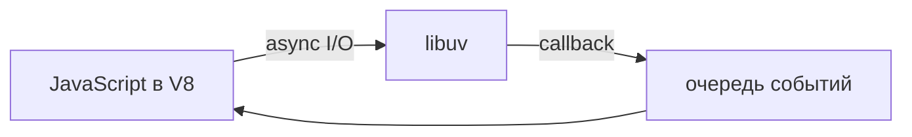

import ExternalPlayEmbed from '@site/src/components/ExternalPlayEmbed';


# Node.js - серверный JavaScript

<div class="article-tags">
  <span class="tag tag-required">ОБЯЗАТЕЛЬНО</span>
  <span class="tag tag-beginner">ДЛЯ НОВИЧКОВ</span>
</div>

<span class="complexity-badge">Разработчику</span>
<span class="complexity-badge">Архитектору</span>

---

## Node.js

JavaScript в браузере ограничен песочницей. **Node.js** — программа, которая выполняет JS на сервере или в CLI: сеть, файлы, процессы, криптография. Один язык на фронте (React) и в API (Express) ускоряет обучение и работу команды.

<div class="callout callout--info">
  <div class="callout-title">Практическая связка</div>

  <div class="callout-body">
  Рекомендуемый порядок: <a href="./262.md">первая программа</a> → эта статья (устройство runtime) → <a href="./265.md">npm</a> и <a href="./266.md">структура проекта</a> → <a href="./268.md">встроенные модули</a> → <a href="./263.md">Express</a> → <a href="./264.md">Fullstack</a>.
</div>
</div>

---

## Маршрут по разделу Node.js

| № | Тема | Статья |
|---|------|--------|
| 1 | Первая программа, Express API | [Первая программа на Node.js](./262.md) |
| 2 | **Runtime, event loop, модули** | **вы здесь** |
| 3 | npm: install, scripts, audit | [npm — команды, зависимости и lock-файлы](./265.md) |
| 4 | Папки, package.json, env | [Структура Node-проекта и правила разработки](./266.md) |
| 5 | fs, http, потоки | [Встроенные модули Node.js — fs, потоки и http](./268.md) |
| 6 | Express: middleware, CORS | [Express — middleware, маршруты и ошибки](./263.md) |
| 7 | CLI, Docker, production | [CLI Node.js — запуск, отладка и деплой](./267.md) |
| 8 | API + фронт | [Fullstack на JavaScript — API и фронтенд](./264.md) |
| — | Шпаргалка API | [Справочник по Node](./261.md) |

---

### Что такое Node.js

Node.js — **среда выполнения** JavaScript вне браузера: движок **V8** (как в Chrome) плюс привязки к ОС через **libuv**. Сильная сторона платформы — **I/O-bound** нагрузка: много одновременных соединений при умеренном расходе RAM. Долгие вычисления в одном потоке лучше выносить в `worker_threads` или отдельный сервис.

Проверка установки:

```bash
node -v
npm -v
```

Минимальный сервер на встроенном `http` (разбор построчно — [Встроенные модули Node.js — fs, потоки и http](./268.md)):

```javascript
const { createServer } = require('node:http');
const hostname = '127.0.0.1';
const port = 3000;

const server = createServer((req, res) => {
  res.statusCode = 200;
  res.setHeader('Content-Type', 'text/plain');
  res.end('Hello World');
});

server.listen(port, hostname, () => {
  console.log(`Server running at http://${hostname}:${port}/`);
});
```

```bash
node server.js
```

Скачать LTS: [nodejs.org](https://nodejs.org/). Несколько версий на одной машине — **nvm** (см. ниже).

---

### История

**Райан Даль** выпустил Node.js в 2009 году, предложив event loop и неблокирующий I/O вместо модели «поток на каждый запрос». С появлением **npm** (2010) выросла крупнейшая экосистема пакетов для одного языка. С 2015 года идут параллельные линии **LTS** (долгая поддержка, обычно 30+ месяцев) и **Current** (свежие возможности). Для production берите LTS.

---

### Архитектура — event loop

Сердце Node — **цикл событий** на **libuv**:

1. JS вызывает, например, `fs.readFile()` — задача уходит в пул потоков libuv.
2. Основной поток **не ждёт** — выполняет следующий JS.
3. По завершении I/O колбэк попадает в очередь; event loop вызывает его в V8.

Так достигается высокая пропускная способность при сетевых и файловых операциях. **Синхронные** API (`readFileSync`) и долгий CPU-код в одном потоке **блокируют** весь сервер — для вычислений используйте `worker_threads` или вынос в отдельный сервис.



Подробнее про `fs`, потоки и `http` — [Встроенные модули Node.js — fs, потоки и http](./268.md).

---

### Принципы платформы

Ядро намеренно небольшое: сеть, файлы и процессы есть в стандартной библиотеке, а фреймворки и ORM живут в npm. Пакеты обычно делают одну задачу, I/O по умолчанию асинхронный (`*Sync` — исключение для скриптов и редких случаев). Один язык на фронте и в API упрощает общие типы, особенно с TypeScript.

Встроенные модули, с которыми вы столкнётесь чаще всего: `fs`, `http`/`https`, `stream`, `child_process`, `crypto`, `os`, `path`, `worker_threads`.

---

### Установка

**Официальный установщик** (Windows `.msi`, macOS `.pkg`, Linux через [NodeSource](https://github.com/nodesource/distributions)) — `node` и `npm` в PATH.

**nvm** (macOS/Linux) — несколько версий Node:

```bash
curl -o- https://raw.githubusercontent.com/nvm-sh/nvm/v0.39.7/install.sh | bash
nvm install --lts
nvm use --lts
```

В корне проекта файл `.nvmrc` с версией (`20`) — `nvm use` без аргументов. На Windows — [nvm-windows](https://github.com/coreybutler/nvm-windows).

---

### Глобальные объекты

| Объект | Назначение |
|--------|------------|
| `global` | Корень глобального контекста (аналог `window`) |
| `process` | argv, `env`, `cwd()`, сигналы, `exit()` |
| `console` | log / error / time — stderr vs stdout важен для логов |
| `Buffer` | Бинарные данные |
| `__dirname`, `__filename` | Путь модуля (только CommonJS) |
| `setTimeout`, `setInterval`, `setImmediate` | Таймеры в фазах event loop |

Пример `process`:

```javascript
console.log(process.env.NODE_ENV);
console.log(process.argv.slice(2));
```

---

### Модули — CommonJS и ESM

**CommonJS** (исторически по умолчанию):

```javascript
// math.cjs
const add = (a, b) => a + b;
module.exports = { add };
```

```javascript
const { add } = require('./math.cjs');
```

**ES Modules** — стандарт JS: `import` / `export`. Включение: `"type": "module"` в `package.json` или расширение `.mjs`.

```javascript
export const add = (a, b) => a + b;
```

```javascript
import { add } from './math.js';
```

| | CommonJS | ESM |
|---|----------|-----|
| Загрузка | Синхронная | Статический анализ |
| В Node по умолчанию | без `"type": "module"` | с `"type": "module"` |
| Смешивание | `import()` из CJS | default-обёртка при импорте CJS |

Зависимости и `node_modules` — [npm — команды, зависимости и lock-файлы](./265.md). Структура проекта — [Структура Node-проекта и правила разработки](./266.md).

---

### Фреймворки поверх http

| | Express | Fastify | NestJS |
|---|---------|---------|--------|
| Стиль | Гибкий, middleware | Скорость, JSON Schema | Модули, DI, TypeScript |
| Когда | MVP, обучение, legacy | High-load API | Крупные команды |

Учебный путь начинается с **Express** — [Первая программа на Node.js](./262.md), [Express — middleware, маршруты и ошибки](./263.md). Сравнение и production-паттерны — [CLI Node.js — запуск, отладка и деплой](./267.md).

---

## Node.js и база данных

Серверный JS почти всегда связан с хранилищем: **HTTP → Express → service → pool (`pg`) → PostgreSQL**. Запросы к БД асинхронные — event loop продолжает принимать соединения.

Практики: один **Pool** на процесс, секреты в `process.env`, **graceful shutdown** (`server.close()` → `pool.end()`), параметризованные запросы `$1`, `$2`.

Интерактив ниже — REST, CRUD, пул соединений и связь с event loop.

<ExternalPlayEmbed example="languages/node-database-play" title="Node.js и базы данных" minHeight={480} />

Пошаговый код REST + PostgreSQL в учебнике — блоки в [Первая программа на Node.js](./262.md) и раздел «Практикум» в исторической версии материала; слои `routes` / `models` — [Структура Node-проекта и правила разработки](./266.md).

---

## Как мыслить о Node в production

Чеклист перед production (подробнее — [CLI Node.js — запуск, отладка и деплой](./267.md)):

- единая версия Node (`.nvmrc`, `engines`);
- `npm ci` в CI, lock в Git;
- структурированные логи и единый формат ошибок API;
- `GET /health`, graceful shutdown;
- секреты только в переменных окружения.

---

## Практика и ссылки

- [Первая программа на Node.js](./262.md)
- [npm](./265.md) · [Структура проекта](./266.md) · [Встроенные модули](./268.md)
- [Express](./263.md) · [Fullstack](./264.md)
- [Next.js](../3-meta-frameworks/273.md)
- [Electron](/encyclopedia/4-code-dev/4-11-desktopnye-prilozheniya/114)

---

{/* http-basics-link  */}
<div class="callout callout--tip">
  <div class="callout-title">Основа по протоколу</div>

  <div class="callout-body">
  Базовый разбор HTTP и HTTPS — <a href="/encyclopedia/2-system-network/2-09-osnovy-integratsionnogo-vzaimodeystviya/118">HTTP как основа веб-интеграций</a>.
</div>
</div>
