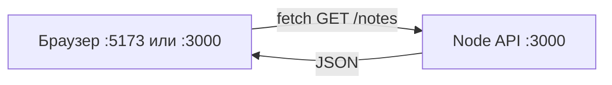

# Fullstack на JavaScript — API и фронтенд

<div class="article-tags">
  <span class="tag tag-required">ОБЯЗАТЕЛЬНО</span>
  <span class="tag tag-beginner">ДЛЯ НОВИЧКОВ</span>
</div>

<span class="complexity-badge">Разработчику</span>

---

## Fullstack на JavaScript — API и фронтенд

### Что такое fullstack в этой статье

**Fullstack** здесь — два приложения на JavaScript, которые работают вместе:

1. **Бэкенд (API)** — Node + Express, порт `3000`, отдаёт JSON ([262](./262.md), [263](./263.md)).
2. **Фронтенд (UI)** — React, Vue или Next в браузере, рисует кнопки и списки ([272](../../272.md), [282](../../282.md), [2731](../3-meta-frameworks/2731.md)).

Вы уже умеете поднимать каждую часть отдельно. На практике их запускают **одновременно** в двух терминалах — и сталкиваются с **CORS** и **портами**. Эта статья — карта склейки без магии.

### Короткий roadmap по fullstack-связке

1. Проверить API отдельно через `curl` (чтобы исключить ошибки фронтенда).
2. Поднять UI и подключить `fetch` к реальному endpoint.
3. Выбрать стратегию dev-интеграции: CORS или локальный прокси.
4. Закрепить путь запроса в DevTools и убрать типовые ошибки портов.

---

### Схема — кто с кем говорит



| Часть | Порт (пример) | Роль |
|-------|---------------|------|
| **API** | `3000` | Данные, правила, позже БД |
| **Vite (React/Vue)** | `5173` | SPA: один HTML, дальше JS |
| **Next.js** | `3000` по умолчанию | Конфликт с API — сдвиньте API на `3001` или Next на `3001` |

Браузер выполняет JS фронта. JS вызывает `fetch('http://127.0.0.1:3000/notes')` — это **отдельный** HTTP-запрос с страницы на другой порт.

---

## Шаг 1 — API должен отвечать без фронта

В каталоге API:

```bash
cd notes-api
npm run dev
```

Разбор:
- `cd notes-api` переводит терминал в каталог backend-проекта.
- `npm run dev` запускает API в режиме разработки с авто-перезапуском.
- На этом шаге важно убедиться, что сервер действительно слушает ожидаемый порт до запуска фронта.

Проверка во **втором** терминале (или в том же, если сервер в фоне):

```bash
curl http://127.0.0.1:3000/health
curl http://127.0.0.1:3000/notes
```

Разбор:
- `curl` отправляет HTTP-запрос напрямую к API без браузерных ограничений.
- `/health` проверяет, что приложение живо и роутинг работает.
- `/notes` проверяет бизнес-эндпоинт, который потом будет вызываться из UI.
- Если здесь всё хорошо, проблемы на фронте чаще связаны с CORS, URL или прокси. Проверка в терминале — [curl / fetch — API-запросы](/lab/Примеры/1133); типовые `fetch` и axios с разбором POST, токена и CORS — [Fetch / axios — типовые запросы](/lab/Примеры/1145).

Ожидаемо: JSON и код 200. Если `Connection refused` — сервер не слушает порт; фронт это не исправит. Вернитесь к [262](./262.md).

---

## Шаг 2 — origin и CORS

**Origin** = протокол + хост + порт, например `http://localhost:5173`.

Страница с origin `5173` запрашивает API на `3000` — для браузера это **кросс-доменный** запрос. Сервер должен явно разрешить его заголовками CORS.

В API:

```bash
npm install cors
```

Разбор:
- Установка `cors` добавляет middleware для корректных ответов браузеру.
- Пакет нужен именно API-приложению, а не React/Vue-проекту.
- После установки конфиг применяется через `app.use(cors(...))`.

```javascript

import cors from 'cors';

app.use(
  cors({
    origin: ['http://127.0.0.1:5173', 'http://localhost:5173'],
    methods: ['GET', 'POST', 'DELETE', 'OPTIONS'],
  }),
);
```

Разбор:
- `origin` перечисляет разрешённые адреса фронтенда в dev-среде.
- `methods` определяет методы, доступные при preflight-проверке.
- `app.use(...)` распространяет политику на маршруты, подключённые после этой строки.
- Корректная CORS-настройка решает кейс "curl работает, браузер блокирует".

Подробнее про цепочку middleware: [263.md](./263.md). В production в `origin` — домен вашего сайта, не `*`, если нужны cookie.

Postman и curl CORS не проверяют. Ошибка "в консоли браузера CORS" при рабочем curl — нормальная ситуация для новичка и частый этап в первых fullstack-проектах.

---

## Шаг 3 — `fetch` на клиенте

`fetch` — встроенный в браузер способ сделать HTTP-запрос. Возвращает **Promise**; ответ нужно проверить и распарсить:

```javascript
const API = 'http://127.0.0.1:3000';

async function loadNotes() {
  const res = await fetch(`${API}/notes`);
  if (!res.ok) throw new Error(`HTTP ${res.status}`);
  const notes = await res.json();
  return notes;
}
```

Разбор:
- `API` хранит базовый адрес сервера, чтобы не дублировать строку в каждом запросе.
- `fetch` со шаблонной строкой (база `API` + путь `/notes`) отправляет GET на endpoint списка заметок.
- Проверка `!res.ok` обрабатывает HTTP-ошибки до попытки парсить тело.
- `await res.json()` превращает JSON-ответ в объект/массив JavaScript.
- Возврат `notes` делает функцию переиспользуемой в разных компонентах UI.

| Часть выражения | Смысл |
|-----------------|--------|
| шаблонная строка `API` + `/notes` | Склеить базовый URL и путь |
| `await fetch(...)` | Дождаться ответа сервера |
| `res.ok` | `true`, если статус 200–299 |
| `res.json()` | Тело ответа как объект JavaScript |

В примере API слушает порт **3000** (`http://127.0.0.1:3000`), а страница в dev часто открыта на **5173** (Vite) — поэтому нужен CORS или прокси. В продакшене браузер ходит на **443** (HTTPS) к одному домену, а бэкенд может стоять за reverse proxy и слушать другой порт внутри сети — [пример nginx proxy_pass](/lab/Примеры/11112); упаковка Node API и SPA в контейнеры — [Dockerfile — 10 типовых образов](/lab/Примеры/11113). Справочник типовых служб и портов (DNS **53**, HTTPS **443**, PostgreSQL **5432**) — [Сетевые сервисы по ролям](/encyclopedia/2-system-network/2-03-set-i-internet/618#setevye-servisy-po-rolyam).

| Фреймворк | Где вызывать |
|------------|--------------|
| React | `useEffect` при монтировании — [272](../../272.md); готовые блоки UI — [1146](/lab/Примеры/1146) |
| Vue | `onMounted` — [282](../../282.md) |
| Next (client) | `'use client'` + `useEffect` — [2731](../3-meta-frameworks/2731.md) |
| Next (server) | `async` Server Component: запрос идёт **с сервера Next**, CORS в браузере не участвует; API должен быть доступен с машины, где крутится Next |

---

## Шаг 4 — прокси в dev (альтернатива CORS)

Идея: браузер ходит на **тот же** origin, что и страница (`5173`), а dev-сервер **тихо пересылает** запрос на API.

**Vite** (`vite.config.js`):

```javascript
export default {
  server: {
    proxy: {
      '/api': {
        target: 'http://127.0.0.1:3000',
        changeOrigin: true,
        rewrite: (path) => path.replace(/^\/api/, ''),
      },
    },
  },
};
```

Разбор:
- `server.proxy` в Vite перенаправляет локальные запросы без участия браузерного CORS.
- Ключ `'/api'` означает, что фронт вызывает относительные URL вида `/api/...`.
- `target` указывает реальный backend-адрес.
- `rewrite` удаляет префикс `/api`, чтобы backend получил свой нативный путь `/notes`.
- `changeOrigin` помогает совместимости с серверами, зависящими от заголовка `Host`.

| Настройка | Зачем |
|-----------|--------|
| `target` | Куда слать запрос на самом деле |
| `rewrite` | `/api/notes` → `/notes` на бэкенде |
| `changeOrigin` | Подменить заголовок Host для некоторых серверов |

Во фронте:

```javascript
const res = await fetch('/api/notes'); // origin остаётся :5173
```

Разбор:
- Запрос идёт на тот же origin, что и страница, поэтому браузер не применяет CORS-проверку.
- Dev-сервер прозрачно проксирует его на API по `target`.
- Такой стиль уменьшает количество "жёстко зашитых" URL в клиентском коде.

**Next.js** (`next.config.ts`):

```typescript
const nextConfig = {
  async rewrites() {
    return [
      {
        source: '/api/:path*',
        destination: 'http://127.0.0.1:3000/:path*',
      },
    ];
  },
};
export default nextConfig;
```

Разбор:
- `rewrites()` задаёт правило внутреннего проксирования в Next dev/prod-среде.
- `source: '/api/:path*'` перехватывает все пути с префиксом `/api`.
- `destination` перенаправляет запрос на внешний API, сохраняя остаток пути.
- Это удобный BFF-подход: фронт работает с единым относительным API-префиксом.

Прокси удобен в разработке; в production часто отдельный домен API + CORS или один домен за Nginx.

---

## Два терминала — рабочий ритуал

```text
Терминал 1:  cd notes-api && npm run dev     → слушает :3000
Терминал 2:  cd notes-ui && npm run dev      → открыть :5173 в браузере
```

Разбор:
- Разделение по терминалам даёт независимый lifecycle для API и UI.
- Если один процесс падает, второй продолжает работать, что упрощает диагностику.
- Явная фиксация портов помогает быстрее находить конфликты и ошибки URL.

В Chrome: **F12 → Network** → обновить страницу → кликнуть запрос `notes` → вкладка **Preview**: массив JSON, статус **200**.

Если статус `(failed)` или CORS — API, `cors` или прокси; если **404** — неверный путь или `rewrite`.

---

## POST и DELETE с фронта

Создание заметки:

```javascript
await fetch(`${API}/notes`, {
  method: 'POST',
  headers: { 'Content-Type': 'application/json' },
  body: JSON.stringify({ text: 'новая заметка' }),
});
```

Разбор:
- `method: 'POST'` переключает запрос на создание ресурса.
- `Content-Type: application/json` сообщает серверу формат тела.
- `JSON.stringify(...)` сериализует JS-объект в строку для HTTP-передачи.
- Шаблон «база `API` + `/notes`» сохраняет единый источник правды для базового URL.

| Поле | Зачем |
|------|--------|
| `method: 'POST'` | HTTP-метод "создать" |
| `Content-Type` | Сервер знает, что тело — JSON (`express.json()` на бэке) |
| `body: JSON.stringify(...)` | Объект JS → строка для провода |

Удаление:

```javascript
await fetch(`${API}/notes/1`, { method: 'DELETE' });
```

Разбор:
- DELETE-запрос обращается к конкретному ресурсу по идентификатору в URL.
- Тело не требуется: серверу достаточно метода и пути.
- После успешного ответа UI должен синхронизировать локальное состояние списка.

После POST обновите список в state: снова вызовите `loadNotes()` или добавьте заметку в массив вручную — иначе UI останется со старыми данными.

---

### Частые ошибки

| Симптом | Причина | Решение |
|---------|---------|---------|
| `Failed to fetch` | API выключен или неверный URL | `curl /health`, проверить терминал 1 |
| CORS в консоли | Нет `cors` или другой `origin` | [263](./263.md) или прокси Vite |
| `ECONNREFUSED` | Порт/хост не тот | Везде `127.0.0.1` или везде `localhost` |
| Next и API оба на 3000 | Конфликт портов | API → `PORT=3001` |
| Пустой массив, 200 | In-memory store сбросился при перезапуске API | Ожидаемо для [262](./262.md) |
| 404 на `/api/notes` | Прокси без `rewrite` | Путь на бэке — `/notes`, не `/api/notes` |

---

### Что попробовать

1. Один API — два UI (React и Vue) с одного `origin` в `cors`.
2. Route Handler в Next, который проксирует на Node: секреты API остаются на сервере.
3. Тот же сценарий "Заметки" на Python: [Flask 3411](/encyclopedia/5-languages/5-02-python/3411).

---

### Связанные материалы

| Тема | Материал |
|------|----------|
| Express углубление | [263.md](./263.md) |
| React / Vue / Next | [272](../../272.md) · [282](../../282.md) · [2731](../3-meta-frameworks/2731.md) · [галерея React-компонентов](/lab/Примеры/1146) |
| Тесты API | [33.md](../../33.md) |
| Чек-лист | [999.md](../../999.md) |

---

## Fullstack-поток запроса — от кнопки до ответа API

Чтобы быстрее диагностировать ошибки, полезно держать в голове полный путь одного действия пользователя.

---

### Жизненный цикл одного действия

1. Пользователь нажимает кнопку в интерфейсе.
2. Фронтенд отправляет `fetch` с JSON-телом.
3. API валидирует данные и выполняет логику.
4. API возвращает статус и JSON-ответ.
5. Фронтенд обновляет state и перерисовывает UI.

---

### Где обычно ломается связка

| Симптом | Что проверить первым |
|---|---|
| В браузере ошибка, а `curl` успешен | CORS / origin |
| `404` только во фронте | Прокси и `rewrite` |
| POST успешен, но UI старый | Локальный state не обновляется |
| `ECONNREFUSED` | Неверный хост или порт |

---

{/* http-basics-link  */}
<div class="callout callout--tip">
  <div class="callout-title">Основа по протоколу</div>

  <div class="callout-body">
  Базовый разбор HTTP и HTTPS находится в отдельной статье — [HTTP как основа веб-интеграций](/encyclopedia/2-system-network/2-09-osnovy-integratsionnogo-vzaimodeystviya/118).
</div>
  </div>


