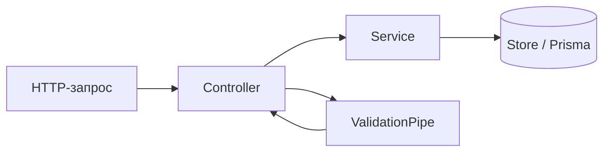
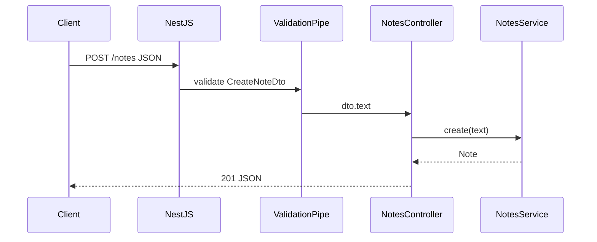
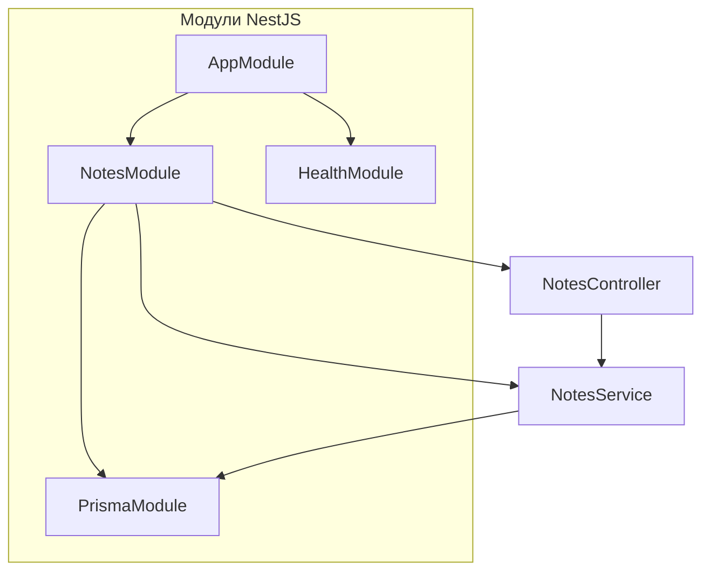

# Первая программа на NestJS

<div class="article-tags">
  <span class="tag tag-required">ОБЯЗАТЕЛЬНО</span>
  <span class="tag tag-beginner">ДЛЯ НОВИЧКОВ</span>
</div>

<span class="complexity-badge">Разработчику</span>
<span class="complexity-badge">Архитектору</span>

---

## Первая программа на NestJS

**NestJS** — фреймворк для серверного [TypeScript](/encyclopedia/5-languages/5-10-typescript/4) на [Node.js](./262.md). Он добавляет:

- **модули** — логические блоки приложения;
- **dependency injection (DI)** — внедрение зависимостей через конструктор;
- **декораторы** `@Controller`, `@Get` — описание HTTP-маршрутов.

Структура похожа на Angular и Spring. Под капотом по умолчанию работает **Express** (или [Fastify](https://fastify.dev/) при переключении адаптера).

Если вы уже прошли [Первая программа на Node.js](./262.md) и [Express — middleware, маршруты и ошибки](./263.md), NestJS — следующий шаг для типизированного backend с предсказуемой архитектурой.

| Шаг | Тема | Результат |
|-----|------|-----------|
| 1 | `@nestjs/cli`, `nest new` | Каркас проекта |
| 2 | `AppModule`, `AppController` | Точка входа и маршрут |
| 3 | `NotesService` + DI | Бизнес-логика отдельно от HTTP |
| 4 | DTO и `ValidationPipe` | Валидация тела запроса |
| 5 | CRUD `/notes` | Учебное [REST API](/encyclopedia/2-system-network/2-03-set-i-internet/21) |
| 6 | Guards и фильтры ошибок | Единый формат ответов |
| 7 | Сборка и деплой | Production-ready сервис |

| Материал | Зачем |
|----------|-------|
| [Первая программа на Node.js](./262.md) | npm, Express, REST "Заметки" |
| [Express — middleware](./263.md) | Router, CORS, errorHandler |
| [npm — команды и lock-файлы](./265.md) | install, scripts, audit |
| [TypeScript — первая программа](/encyclopedia/5-languages/5-10-typescript/4) | типы, интерфейсы, strict |
| [Prisma ORM — первая программа](./2691.md) | замена in-memory store |
| [Fullstack на JavaScript](./264.md) | CORS, прокси, два порта |

### Навигация по блоку Node.js

- Предыдущий шаг: [Первая программа на Node.js](./262.md) → [Express — middleware, маршруты и ошибки](./263.md)
- Вы здесь: [Первая программа на NestJS](./269.md)
- База данных: [Prisma ORM — первая программа](./2691.md), [Drizzle ORM — первая программа](./2692.md)
- npm и структура: [npm — команды, зависимости и lock-файлы](./265.md)

<div class="callout callout--tip">
  <div class="callout-title">Редактор и терминал</div>

  <div class="callout-body">
  Команды удобно выполнять во вкладке <strong>Терминал</strong> VS Code (<code>Ctrl+`</code>). TypeScript-подсветка и отладка — <a href="/encyclopedia/4-code-dev/4-14-razrabotka-i-otladka/111">статья "Отладка"</a>.
</div>
</div>

---

## Что такое NestJS и зачем он нужен

В [Express](./263.md) маршруты, валидация и бизнес-логика часто оказываются в одном файле. На маленьком API это терпимо. Когда эндпоинтов десятки, нужны правила:

- контроллер **только** принимает HTTP и вызывает сервис;
- сервис **не знает** про `req` и `res`;
- зависимости (БД, кэш) **подставляются** через конструктор, а не создаются через `new` в каждом месте.

NestJS задаёт эту структуру **из коробки** через модули, провайдеры и DI-контейнер.



| Слой | Ответственность |
|------|-----------------|
| Controller | Маршрут, HTTP-код, DTO |
| Service | Бизнес-логика, правила |
| Module | Регистрация классов в DI |
| Pipe | Валидация и преобразование |
| Guard | Авторизация (позже) |

---

## Шаг 1 — подготовка окружения

Нужны **Node.js LTS** (20 или 22) и [npm](./265.md):

```bash
node -v
npm -v
```

Установка CLI глобально (или через `npx` без глобальной установки):

```bash
npm i -g @nestjs/cli
nest --version
```

Альтернатива без `-g`:

```bash
npx @nestjs/cli new notes-nest --strict
```

Создание проекта:

```bash
nest new notes-nest --strict
cd notes-nest
npm run start:dev
```

Разбор:

- `nest new` генерирует TypeScript-проект с `src/main.ts`, `app.module.ts`, тестами Jest.
- Флаг `--strict` включает строгие правила TypeScript — рекомендуется для новых проектов. Подробнее о strict — в [разделе TypeScript](/encyclopedia/5-languages/5-10-typescript/intro).
- `start:dev` — watch-режим: сохранили файл — сервер перезапустился.
- По умолчанию сервер слушает **http://localhost:3000**.

Откройте `http://localhost:3000` — ответ `Hello World!` из `AppController`.

<div class="callout callout--info">
  <div class="callout-title">TypeScript обязателен</div>

  <div class="callout-body">
  NestJS пишут на TypeScript. Если синтаксис <code>interface</code>, <code>!</code> и декораторов незнаком — сначала пройдите <a href="/encyclopedia/5-languages/5-10-typescript/4">Первая программа на TypeScript</a>.
</div>
</div>

---

## Шаг 2 — структура проекта

После `nest new` в каталоге появляется:

```text
notes-nest/
  src/
    main.ts              ← bootstrap, глобальные pipes
    app.module.ts        ← корневой модуль
    app.controller.ts    ← HTTP-маршруты (шаблон)
    app.service.ts       ← логика (шаблон)
    app.controller.spec.ts
  test/
  nest-cli.json
  tsconfig.json
  package.json
```

| Файл | Роль |
|------|------|
| `main.ts` | Создаёт приложение, слушает порт |
| `app.module.ts` | Корневой `@Module` — точка сборки |
| `*.controller.ts` | HTTP-слой |
| `*.service.ts` | Бизнес-логика, `@Injectable` |
| `nest-cli.json` | Настройки CLI (генерация, webpack) |

Три ключевых понятия:

- **Модуль** (`@Module`) собирает контроллеры и провайдеры.
- **Контроллер** принимает HTTP-запросы.
- **Сервис** (`@Injectable`) — переиспользуемая логика; Nest сам подставляет зависимости в конструктор (DI).

### Точка входа `main.ts`

```typescript
import { NestFactory } from '@nestjs/core';
import { AppModule } from './app.module';

async function bootstrap() {
  const app = await NestFactory.create(AppModule);
  await app.listen(process.env.PORT ?? 3000);
}
bootstrap();
```

Разбор:

- `NestFactory.create(AppModule)` поднимает HTTP-сервер поверх Express.
- `process.env.PORT ?? 3000` — порт из окружения для хостинга (как в [262](./262.md)).
- `bootstrap()` — асинхронная функция; Nest ждёт готовности приложения.

---

## Шаг 3 — модуль заметок с нуля

Создайте feature-модуль через CLI:

```bash
nest generate module notes
nest generate service notes
nest generate controller notes
```

Или вручную — три файла в `src/notes/`.

### NotesService — данные в памяти

`src/notes/notes.service.ts`:

```typescript
import { Injectable, NotFoundException } from '@nestjs/common';

export interface Note {
  id: number;
  text: string;
}

@Injectable()
export class NotesService {
  private notes: Note[] = [
    { id: 1, text: 'Купить молоко' },
    { id: 2, text: 'Изучить NestJS' },
  ];
  private nextId = 3;

  findAll(): Note[] {
    return [...this.notes];
  }

  findOne(id: number): Note {
    const note = this.notes.find((n) => n.id === id);
    if (!note) throw new NotFoundException(`Note ${id} not found`);
    return note;
  }

  create(text: string): Note {
    const note = { id: this.nextId++, text };
    this.notes.push(note);
    return note;
  }

  remove(id: number): void {
    const index = this.notes.findIndex((n) => n.id === id);
    if (index === -1) throw new NotFoundException(`Note ${id} not found`);
    this.notes.splice(index, 1);
  }
}
```

Разбор:

- `@Injectable()` регистрирует класс в DI-контейнере Nest.
- `NotFoundException` — встроенное исключение; Nest вернёт **404** с JSON-телом.
- `[...this.notes]` — копия массива, чтобы снаружи нельзя было мутировать внутреннее хранилище.

### NotesController — HTTP-слой

`src/notes/notes.controller.ts`:

```typescript
import {
  Body,
  Controller,
  Delete,
  Get,
  Param,
  ParseIntPipe,
  Post,
  HttpCode,
} from '@nestjs/common';
import { NotesService } from './notes.service';

@Controller('notes')
export class NotesController {
  constructor(private readonly notes: NotesService) {}

  @Get()
  findAll() {
    return this.notes.findAll();
  }

  @Get(':id')
  findOne(@Param('id', ParseIntPipe) id: number) {
    return this.notes.findOne(id);
  }

  @Post()
  create(@Body('text') text: string) {
    return this.notes.create(text);
  }

  @Delete(':id')
  @HttpCode(204)
  remove(@Param('id', ParseIntPipe) id: number) {
    this.notes.remove(id);
  }
}
```

Разбор:

- `@Controller('notes')` — префикс URL: все маршруты начинаются с `/notes`.
- `constructor(private readonly notes: NotesService)` — DI: Nest создаёт сервис и передаёт сюда.
- `ParseIntPipe` превращает строку `:id` из URL в число; при ошибке — **400**.
- `@HttpCode(204)` — успешный DELETE без тела (как в [262](./262.md)).

### NotesModule — регистрация

`src/notes/notes.module.ts`:

```typescript
import { Module } from '@nestjs/common';
import { NotesController } from './notes.controller';
import { NotesService } from './notes.service';

@Module({
  controllers: [NotesController],
  providers: [NotesService],
})
export class NotesModule {}
```

Подключите модуль в `app.module.ts`:

```typescript
import { Module } from '@nestjs/common';
import { NotesModule } from './notes/notes.module';

@Module({
  imports: [NotesModule],
})
export class AppModule {}
```

Можно удалить шаблонные `AppController` и `AppService` из `AppModule`, если они больше не нужны.

---

## Шаг 4 — проверка REST API

Запуск:

```bash
npm run start:dev
```

Проверка через curl (тот же сценарий, что в [262](./262.md)):

```bash
curl http://localhost:3000/notes
curl http://localhost:3000/notes/1
curl -X POST http://localhost:3000/notes \
  -H "Content-Type: application/json" \
  -d '{"text":"Новая заметка"}'
curl -X DELETE http://localhost:3000/notes/1
curl http://localhost:3000/notes
```

| Метод | Путь | Ожидание |
|-------|------|----------|
| GET | `/notes` | `200`, массив |
| GET | `/notes/1` | `200`, объект |
| POST | `/notes` | `201`, созданная заметка |
| DELETE | `/notes/1` | `204`, пустое тело |
| GET | `/notes/999` | `404`, JSON с сообщением |

<div class="callout callout--warning">
  <div class="callout-title">Данные в памяти</div>

  <div class="callout-body">
  После перезапуска <code>npm run start:dev</code> список снова из шаблона. Для постоянного хранения подключите <a href="./2691.md">Prisma</a> или <a href="./2692.md">Drizzle</a>.
</div>
</div>

---

## Шаг 5 — DTO и ValidationPipe

**DTO (Data Transfer Object)** — класс, описывающий форму тела запроса. Вместо ручных `if (!text)` Nest проверяет поля автоматически.

Установите пакеты:

```bash
npm i class-validator class-transformer
```

`src/notes/dto/create-note.dto.ts`:

```typescript
import { IsString, MinLength, MaxLength } from 'class-validator';

export class CreateNoteDto {
  @IsString()
  @MinLength(1)
  @MaxLength(500)
  text!: string;
}
```

В `main.ts` включите глобальный pipe:

```typescript
import { ValidationPipe } from '@nestjs/common';
import { NestFactory } from '@nestjs/core';
import { AppModule } from './app.module';

async function bootstrap() {
  const app = await NestFactory.create(AppModule);
  app.useGlobalPipes(
    new ValidationPipe({
      whitelist: true,
      forbidNonWhitelisted: true,
      transform: true,
    }),
  );
  await app.listen(process.env.PORT ?? 3000);
}
bootstrap();
```

| Опция | Смысл |
|-------|-------|
| `whitelist: true` | Убирает лишние поля из body |
| `forbidNonWhitelisted: true` | Ошибка при неизвестных полях |
| `transform: true` | Преобразует типы (строка → число для `@Param`) |

В контроллере:

```typescript
import { CreateNoteDto } from './dto/create-note.dto';

@Post()
create(@Body() dto: CreateNoteDto) {
  return this.notes.create(dto.text);
}
```

Проверка невалидного запроса:

```bash
curl -X POST http://localhost:3000/notes \
  -H "Content-Type: application/json" \
  -d '{"text":""}'
```

Ответ **400** с массивом `message` — без ручных проверок в контроллере.

---

## Шаг 6 — health-check и CORS

### Эндпоинт `/health`

`src/health/health.controller.ts`:

```typescript
import { Controller, Get } from '@nestjs/common';

@Controller('health')
export class HealthController {
  @Get()
  check() {
    return { status: 'ok', ts: new Date().toISOString() };
  }
}
```

Зарегистрируйте в отдельном `HealthModule` или добавьте контроллер в `AppModule`.

### CORS для фронтенда

Если Svelte или React на порту **5173** обращается к API на **3000**, включите CORS в `main.ts`:

```typescript
const app = await NestFactory.create(AppModule);
app.enableCors({ origin: 'http://localhost:5173' });
```

Подробнее про cross-origin — [Fullstack на JavaScript — API и фронтенд](./264.md) и [Express — middleware](./263.md).

---

## Шаг 7 — единый формат ошибок

Nest по умолчанию возвращает JSON при исключениях. Для учебного API можно добавить фильтр:

`src/common/http-exception.filter.ts`:

```typescript
import {
  ExceptionFilter,
  Catch,
  ArgumentsHost,
  HttpException,
} from '@nestjs/common';

@Catch(HttpException)
export class HttpExceptionFilter implements ExceptionFilter {
  catch(exception: HttpException, host: ArgumentsHost) {
    const ctx = host.switchToHttp();
    const res = ctx.getResponse();
    const status = exception.getStatus();
    const body = exception.getResponse();

    res.status(status).json({
      statusCode: status,
      error: typeof body === 'string' ? body : (body as { message?: unknown }).message,
      timestamp: new Date().toISOString(),
    });
  }
}
```

Подключение в `main.ts`:

```typescript
app.useGlobalFilters(new HttpExceptionFilter());
```

---

## Полный walkthrough — от Express к NestJS

Если вы делали API "Заметки" на Express ([262](./262.md)), вот соответствие слоёв:

| Express | NestJS |
|---------|--------|
| `app.get('/notes', ...)` | `@Get()` в `NotesController` |
| `express.json()` | Встроено; DTO + `ValidationPipe` |
| Массив `notes` в `server.js` | `NotesService` с приватным массивом |
| `app.use(errorHandler)` | `@Catch()` фильтры |
| `Router` в отдельном файле | `@Module` + `@Controller` |



---

## NestJS и Express — когда что выбирать

| Сценарий | NestJS | Express вручную |
|----------|--------|-----------------|
| Команда знает Angular или Spring | привычные паттерны | проще старт, без DI |
| Крупный REST или GraphQL backend | модули, guards, pipes | нужна дисциплина в структуре |
| Микроскрипт на 3 маршрута | избыточен | подходит |
| Строгая TypeScript-архитектура | из коробки | возможна, но вручную |
| Нужен Fastify вместо Express | `NestFactory.create(..., { adapter })` | отдельная настройка |

NestJS **не заменяет** понимание HTTP и Express — он **организует** код поверх них. Middleware из [263](./263.md) работает и в Nest через `app.use()`.

---

## Упражнения

1. Добавьте `PATCH /notes/:id` для редактирования текста. Создайте `UpdateNoteDto` с `@IsOptional()` и `@MinLength(1)`.
2. Вынесите `NotesService` в отдельный `NotesRepository` (интерфейс + in-memory реализация) — подготовка к Prisma.
3. Напишите e2e-тест `test/notes.e2e-spec.ts` через `@nestjs/testing` и `supertest`.
4. Подключите [Prisma ORM — первая программа](./2691.md) вместо массива в `NotesService`.
5. Добавьте глобальный префикс `app.setGlobalPrefix('api')` — все маршруты станут `/api/notes`.

---

## Частые ошибки и troubleshooting

| Симптом | Причина | Что сделать |
|---------|---------|-------------|
| `Nest can't resolve dependencies of NotesController` | Сервис не в `providers` модуля | Добавьте `NotesService` в `@Module({ providers: [...] })` |
| 404 на `/notes` | Модуль не импортирован в `AppModule` | `imports: [NotesModule]` |
| Validation не срабатывает | Нет `ValidationPipe` в `main.ts` | `app.useGlobalPipes(new ValidationPipe(...))` |
| `Cannot find module '@nestjs/common'` | Нет `npm install` | `npm install` в корне проекта |
| Порт занят | Другой процесс на 3000 | `PORT=3001 npm run start:dev` или завершите старый процесс |
| TypeScript ругается на декораторы | Нет `experimentalDecorators` | В Nest-шаблоне уже включено в `tsconfig.json` |
| POST возвращает пустой `text` | `@Body('text')` вместо DTO | Используйте `@Body() dto: CreateNoteDto` |
| CORS в браузере | Фронт на другом порту | `app.enableCors()` — [264](./264.md) |

---

## FAQ

**Нужен ли NestJS для первого backend-проекта?**

Нет. Начните с [262](./262.md) и Express. NestJS имеет смысл, когда проект растёт и нужна структура.

**Можно ли писать на чистом JavaScript?**

Технически да, но экосистема и документация ориентированы на TypeScript. Для NestJS лучше освоить [TypeScript](/encyclopedia/5-languages/5-10-typescript/4).

**Express или Fastify под капотом?**

По умолчанию Express. Fastify быстрее на бенчмарках; переключение — через `@nestjs/platform-fastify`.

**Как NestJS связан с Angular?**

Общие идеи: модули, DI, декораторы. Синтаксис похож, но NestJS — только сервер.

**Где хранить секреты?**

В переменных окружения (`process.env`), не в коде. Для локальной разработки — файл `.env` (добавьте в `.gitignore`).

---

## Production и деплой

### Сборка

```bash
npm run build
npm run start:prod
```

`build` компилирует TypeScript в `dist/`. `start:prod` запускает `node dist/main.js`.

### Process manager

На сервере процесс держат через **PM2** или **systemd**:

```bash
npm i -g pm2
pm2 start dist/main.js --name notes-api
pm2 save
```

### Переменные окружения

| Переменная | Пример | Назначение |
|------------|--------|------------|
| `PORT` | `8080` | Порт HTTP |
| `NODE_ENV` | `production` | Режим runtime |
| `DATABASE_URL` | см. [2691](./2691.md) | Строка подключения к БД |

### HTTPS и reverse proxy

NestJS слушает HTTP локально; снаружи ставят **Nginx** или **Caddy** с TLS. Пример `proxy_pass` — [Nginx — конфиги под задачу](/lab/Примеры/11112).

<div class="callout callout--warning">
  <div class="callout-title">Production</div>

  <div class="callout-body">
  Для боевого сервера — process manager, секреты в переменных окружения, HTTPS за reverse proxy, логирование и мониторинг. Данные в памяти теряются при перезапуске — нужна БД и бэкапы.
</div>
</div>

---

## Шаг 8 — конфигурация через @nestjs/config

Секреты и настройки не хранят в коде. Пакет `@nestjs/config` читает `.env`:

```bash
npm i @nestjs/config
```

`.env`:

```env
PORT=3000
NODE_ENV=development
```

`app.module.ts`:

```typescript
import { Module } from '@nestjs/common';
import { ConfigModule } from '@nestjs/config';
import { NotesModule } from './notes/notes.module';

@Module({
  imports: [
    ConfigModule.forRoot({ isGlobal: true }),
    NotesModule,
  ],
})
export class AppModule {}
```

В `main.ts`:

```typescript
import { ConfigService } from '@nestjs/config';

async function bootstrap() {
  const app = await NestFactory.create(AppModule);
  const config = app.get(ConfigService);
  const port = config.get<number>('PORT', 3000);
  await app.listen(port);
}
```

| Переменная | Где используется |
|------------|------------------|
| `PORT` | `main.ts` — порт HTTP |
| `DATABASE_URL` | [Prisma](./2691.md) — строка БД |
| `NODE_ENV` | логирование, режим ошибок |

Файл `.env` добавьте в `.gitignore`. На production переменные задаёт хостинг.

---

## Шаг 9 — e2e-тесты supertest

Nest генерирует каркас тестов. Файл `test/notes.e2e-spec.ts`:

```typescript
import { Test, TestingModule } from '@nestjs/testing';
import { INestApplication, ValidationPipe } from '@nestjs/common';
import request from 'supertest';
import { AppModule } from '../src/app.module';

describe('Notes (e2e)', () => {
  let app: INestApplication;

  beforeAll(async () => {
    const moduleFixture: TestingModule = await Test.createTestingModule({
      imports: [AppModule],
    }).compile();

    app = moduleFixture.createNestApplication();
    app.useGlobalPipes(new ValidationPipe({ whitelist: true }));
    await app.init();
  });

  afterAll(async () => {
    await app.close();
  });

  it('GET /notes returns array', () => {
    return request(app.getHttpServer())
      .get('/notes')
      .expect(200)
      .expect((res) => {
        expect(Array.isArray(res.body)).toBe(true);
      });
  });

  it('POST /notes creates note', () => {
    return request(app.getHttpServer())
      .post('/notes')
      .send({ text: 'Test note' })
      .expect(201)
      .expect((res) => {
        expect(res.body.text).toBe('Test note');
        expect(res.body.id).toBeDefined();
      });
  });

  it('POST /notes rejects empty text', () => {
    return request(app.getHttpServer())
      .post('/notes')
      .send({ text: '' })
      .expect(400);
  });
});
```

Запуск:

```bash
npm run test:e2e
```

Разбор:

- `Test.createTestingModule` поднимает приложение **без** реального HTTP-порта.
- `supertest` шлёт запросы во in-memory сервер.
- Тесты фиксируют контракт API — полезно перед рефакторингом на [Prisma](./2691.md).

---

## Шаг 10 — Swagger (OpenAPI)

Документация API из декораторов:

```bash
npm i @nestjs/swagger
```

`main.ts`:

```typescript
import { DocumentBuilder, SwaggerModule } from '@nestjs/swagger';

async function bootstrap() {
  const app = await NestFactory.create(AppModule);
  // ... pipes, cors ...

  const config = new DocumentBuilder()
    .setTitle('Notes API')
    .setDescription('Учебное REST API')
    .setVersion('1.0')
    .build();
  const document = SwaggerModule.createDocument(app, config);
  SwaggerModule.setup('docs', app, document);

  await app.listen(3000);
}
```

В DTO:

```typescript
import { ApiProperty } from '@nestjs/swagger';

export class CreateNoteDto {
  @ApiProperty({ example: 'Купить хлеб', minLength: 1 })
  @IsString()
  @MinLength(1)
  text!: string;
}
```

Откройте **http://localhost:3000/docs** — интерактивная документация и пробные запросы.

---

## Шаг 11 — логирование запросов (Interceptor)

`src/common/logging.interceptor.ts`:

```typescript
import {
  Injectable,
  NestInterceptor,
  ExecutionContext,
  CallHandler,
  Logger,
} from '@nestjs/common';
import { Observable, tap } from 'rxjs';

@Injectable()
export class LoggingInterceptor implements NestInterceptor {
  private readonly logger = new Logger('HTTP');

  intercept(context: ExecutionContext, next: CallHandler): Observable<unknown> {
    const req = context.switchToHttp().getRequest();
    const { method, url } = req;
    const started = Date.now();

    return next.handle().pipe(
      tap(() => {
        const ms = Date.now() - started;
        this.logger.log(`${method} ${url} ${ms}ms`);
      }),
    );
  }
}
```

Подключение в `main.ts`:

```typescript
app.useGlobalInterceptors(new LoggingInterceptor());
```

Аналог middleware-логирования из [Express — middleware](./263.md), но в стиле Nest.

---

## Шаг 12 — глобальный префикс и версионирование

```typescript
app.setGlobalPrefix('api');
```

Маршруты станут `/api/notes`, `/api/health`. Удобно за reverse proxy, когда статика и API на одном домене.

Версионирование URI:

```typescript
app.enableVersioning({
  type: VersioningType.URI,
  defaultVersion: '1',
});
```

```typescript
@Controller({ path: 'notes', version: '1' })
export class NotesController {}
```

URL: `/api/v1/notes`.

---

## Docker — контейнер для production

`Dockerfile`:

```dockerfile
FROM node:22-alpine AS builder
WORKDIR /app
COPY package*.json ./
RUN npm ci
COPY . .
RUN npm run build

FROM node:22-alpine
WORKDIR /app
COPY package*.json ./
RUN npm ci --omit=dev
COPY --from=builder /app/dist ./dist
ENV NODE_ENV=production
EXPOSE 3000
CMD ["node", "dist/main.js"]
```

`.dockerignore`:

```text
node_modules
dist
.env
.git
```

Сборка и запуск:

```bash
docker build -t notes-nest .
docker run -p 3000:3000 -e PORT=3000 notes-nest
```

С [Prisma](./2691.md) добавьте шаг `npx prisma migrate deploy` в entrypoint перед `node dist/main.js`.

---

## Полная структура учебного проекта

```text
notes-nest/
  src/
    main.ts
    app.module.ts
    notes/
      notes.module.ts
      notes.controller.ts
      notes.service.ts
      dto/
        create-note.dto.ts
    health/
      health.controller.ts
      health.module.ts
    common/
      http-exception.filter.ts
      logging.interceptor.ts
    prisma/                    ← после шага Prisma
      prisma.service.ts
  test/
    notes.e2e-spec.ts
  .env
  Dockerfile
  package.json
```



---

## Сравнение слоёв Express и NestJS (детально)

| Задача | Express ([263](./263.md)) | NestJS |
|--------|---------------------------|--------|
| Маршрут GET | `app.get('/notes', handler)` | `@Get()` + `@Controller('notes')` |
| Валидация body | ручные `if` или Joi | DTO + `ValidationPipe` |
| Разделение логики | `routes/notes.js` | `NotesService` + DI |
| 404 для id | `if (!note) return res.status(404)` | `throw new NotFoundException()` |
| Глобальные middleware | `app.use(fn)` | Guards, Pipes, Interceptors, Filters |
| Тесты HTTP | supertest вручную | `@nestjs/testing` + supertest |
| OpenAPI | swagger-jsdoc вручную | `@nestjs/swagger` |

NestJS **организует** код; HTTP по-прежнему тот же протокол — см. [HTTP как основа веб-интеграций](/encyclopedia/2-system-network/2-09-osnovy-integratsionnogo-vzaimodeystviya/118).

---

## Углублённый troubleshooting

| Симптом | Детали | Решение |
|---------|--------|---------|
| `EADDRINUSE :::3000` | Порт занят | `npx kill-port 3000` или смените PORT |
| Декораторы не работают | tsconfig | `experimentalDecorators: true`, `emitDecoratorMetadata: true` |
| `undefined` в `@Body()` | Content-Type | Клиент шлёт `application/json` |
| Двойная регистрация сервиса | Два модуля с одним provider | Один модуль экспортирует, другой импортирует |
| Swagger пустой | DTO без `@ApiProperty` | Добавьте декораторы или `@ApiBody` |
| e2e падает на ValidationPipe | Pipe не подключён в тесте | `app.useGlobalPipes(...)` в `beforeAll` |
| Hot reload не подхватывает `.env` | Кэш env | Перезапустите `start:dev` |
| Prisma в Nest — connection leak | Нет `$disconnect` | `OnModuleDestroy` в PrismaService |

---

## Дополнительные упражнения

6. Подключите `@nestjs/throttler` — лимит 10 запросов в минуту на IP.
7. Добавьте `@Delete(':id')` с `@HttpCode(204)` и e2e-тест на 404.
8. Сделайте `NotesModule` **глобальным экспортом** `NotesService` для использования в другом модуле.
9. Напишите unit-тест `NotesService` с mock-хранилищем без HTTP.
10. Свяжите фронт [Svelte](../2-frontend-frameworks/286.md) через CORS или прокси [Vite](../2-frontend-frameworks/288.md).

---

## Расширенный FAQ

**Можно ли смешивать Express middleware и Nest?**

Да. `app.use(cors())` или сторонние middleware подключаются в `main.ts` до listen.

**GraphQL в NestJS?**

Отдельный модуль `@nestjs/graphql` — следующий уровень после REST.

**Микросервисы?**

Nest поддерживает TCP, Redis, NATS транспорты — для учебного API достаточно монолита.

**Как отлаживать в VS Code?**

Конфиг `launch.json` с `"runtimeArgs": ["run", "start:debug"]` и `"console": "integratedTerminal"`.

**NestJS без CLI?**

Можно собрать вручную, но `nest generate` экономит время — см. [npm](./265.md) scripts.

---

## Production checklist

| Пункт | Проверка |
|-------|----------|
| Process manager | PM2 или systemd |
| HTTPS | Nginx/Caddy перед Node |
| Env secrets | Не в git, только хостинг |
| БД | [Prisma migrate deploy](./2691.md) |
| Логи | stdout + сборщик (Loki, CloudWatch) |
| Health | `GET /health` для load balancer |
| Graceful shutdown | `app.enableShutdownHooks()` |
| Rate limit | throttler или nginx |
| Мониторинг | uptime, latency, 5xx |

```typescript
// graceful shutdown в main.ts
app.enableShutdownHooks();
```

При SIGTERM Nest завершит активные запросы перед выходом.

---

## Практикум — ConfigModule и переменные окружения

Production-приложение не хранит секреты в коде. Пакет `@nestjs/config` читает `.env` и валидирует значения при старте.

```bash
npm i @nestjs/config
```

```typescript
import { ConfigModule } from '@nestjs/config';

@Module({
  imports: [
    ConfigModule.forRoot({ isGlobal: true, envFilePath: ['.env.local', '.env'] }),
    NotesModule,
  ],
})
export class AppModule {}
```

```typescript
@Injectable()
export class NotesService {
  constructor(private readonly config: ConfigService) {
    this.maxNotes = this.config.get<number>('MAX_NOTES', 1000);
  }
}
```

| Переменная | Dev | Production |
|------------|-----|------------|
| `PORT` | 3000 | из PaaS |
| `NODE_ENV` | development | production |
| `DATABASE_URL` | SQLite file | PostgreSQL URL |
| `API_KEY` | dev-secret | из vault |

Файл `.env` — в `.gitignore`. Коммитьте `.env.example` без секретов.

---

## Практикум — Guards и API-ключ

```typescript
@Injectable()
export class ApiKeyGuard implements CanActivate {
  constructor(private readonly config: ConfigService) {}

  canActivate(context: ExecutionContext): boolean {
    const req = context.switchToHttp().getRequest();
    const key = req.headers['x-api-key'];
    if (key !== this.config.get('API_KEY')) {
      throw new UnauthorizedException('Invalid API key');
    }
    return true;
  }
}
```

```typescript
@Controller('notes')
@UseGuards(ApiKeyGuard)
export class NotesController {}
```

```bash
curl -H "x-api-key: dev-secret" http://localhost:3000/notes
```

---

## Практикум — Interceptors и логирование

```typescript
@Injectable()
export class LoggingInterceptor implements NestInterceptor {
  intercept(context: ExecutionContext, next: CallHandler) {
    const req = context.switchToHttp().getRequest();
    const started = Date.now();
    return next.handle().pipe(
      tap(() => console.log(`${req.method} ${req.url} ${Date.now() - started}ms`)),
    );
  }
}
```

В `main.ts`: `app.useGlobalInterceptors(new LoggingInterceptor());`

---

## Практикум — Swagger (OpenAPI)

```bash
npm i @nestjs/swagger
```

```typescript
const config = new DocumentBuilder()
  .setTitle('Notes API')
  .setVersion('1.0')
  .addApiKey({ type: 'apiKey', name: 'x-api-key', in: 'header' }, 'api-key')
  .build();
SwaggerModule.setup('docs', app, SwaggerModule.createDocument(app, config));
```

Откройте `http://localhost:3000/docs`.

---

## Практикум — e2e-тесты

`test/notes.e2e-spec.ts`:

```typescript
describe('Notes (e2e)', () => {
  let app: INestApplication;

  beforeAll(async () => {
    const module = await Test.createTestingModule({ imports: [AppModule] }).compile();
    app = module.createNestApplication();
    app.useGlobalPipes(new ValidationPipe({ whitelist: true }));
    await app.init();
  });

  it('POST /notes creates note', () =>
    request(app.getHttpServer())
      .post('/notes')
      .send({ text: 'E2E' })
      .expect(201));
});
```

```bash
npm run test:e2e
```

---

## Практикум — PATCH и UpdateNoteDto

```typescript
export class UpdateNoteDto {
  @IsOptional()
  @IsString()
  @MinLength(1)
  text?: string;
}

@Patch(':id')
update(@Param('id', ParseIntPipe) id: number, @Body() dto: UpdateNoteDto) {
  return this.notes.update(id, dto.text!);
}
```

---

## Практикум — Repository pattern

```typescript
export interface NotesRepository {
  findAll(): Promise<Note[]>;
  create(text: string): Promise<Note>;
}

@Module({
  providers: [
    NotesService,
    { provide: 'NotesRepository', useClass: InMemoryNotesRepository },
  ],
})
export class NotesModule {}
```

Позже замените на Prisma — [2691](./2691.md).

---

## Практикум — глобальный префикс

```typescript
app.setGlobalPrefix('api');
```

URL: `GET /api/notes`.

---

## Практикум — Fastify adapter

```bash
npm i @nestjs/platform-fastify
```

```typescript
const app = await NestFactory.create(AppModule, new FastifyAdapter());
```

---

## Расширенные упражнения

6. `@nestjs/throttler` — 10 req/min на IP.
7. Unit-тест `NotesService` с mock repository.
8. `helmet` для security headers.
9. `@nestjs/terminus` health check.
10. Pagination `GET /notes?page=1&limit=10`.
11. Экспорт `openapi.json` при build.
12. Graceful shutdown через `enableShutdownHooks()`.

---

## Расширенный FAQ

**Monorepo Nest + React?**

Nx или Turborepo: `apps/api`, `apps/web`, `packages/shared`.

**GraphQL?**

`@nestjs/graphql` — после освоения REST.

**Graceful shutdown?**

```typescript
app.enableShutdownHooks();
```

**JSON-логи?**

`nestjs-pino` или Winston.

**Microservices?**

`@nestjs/microservices` — TCP, Redis, Kafka. Начните с monolith.

**Nested DTO?**

`@ValidateNested()` + `@Type(() => ChildDto)`.

**Как дебажить в VS Code?**

Launch config с `ts-node/register`, breakpoint в controller.

**OpenAPI типы для фронта?**

`openapi-typescript` из `/docs-json`.

**Rate limit на nginx?**

`limit_req_zone` — дублирует throttler на edge.

**Session auth?**

`@nestjs/passport` + express-session или JWT.

---

## Production — расширенный чек-лист

| Область | Действие |
|---------|----------|
| Secrets | Vault, не `.env` в Docker-образе |
| HTTPS | TLS на reverse proxy |
| Health | `/health` + `/health/ready` для k8s |
| Metrics | Prometheus или APM |
| Logging | JSON + correlation id |
| Docker | Multi-stage, non-root user |
| CI | lint, unit, e2e, audit |

### Dockerfile

```dockerfile
FROM node:22-alpine AS build
WORKDIR /app
COPY package*.json ./
RUN npm ci && COPY . . && npm run build

FROM node:22-alpine
WORKDIR /app
ENV NODE_ENV=production
COPY --from=build /app/dist ./dist
COPY --from=build /app/node_modules ./node_modules
EXPOSE 3000
CMD ["node", "dist/main.js"]
```

### docker-compose

```yaml
services:
  api:
    build: .
    ports: ["3000:3000"]
    environment:
      DATABASE_URL: postgresql://postgres:postgres@db:5432/notes
  db:
    image: postgres:16
    environment:
      POSTGRES_PASSWORD: postgres
```

---

## Сценарий полного дня

| Время | Задача |
|-------|--------|
| 09:00 | `nest new`, NotesModule |
| 10:00 | DTO + ValidationPipe |
| 11:00 | Prisma — [2691](./2691.md) |
| 13:00 | Swagger + e2e |
| 14:00 | Guard + ConfigModule |
| 15:00 | Docker build |
| 16:00 | Deploy на PaaS |

---

## Отладка в VS Code

```json
{
  "configurations": [{
    "type": "node",
    "request": "launch",
    "name": "NestJS",
    "runtimeArgs": ["-r", "ts-node/register"],
    "args": ["src/main.ts"]
  }]
}
```

---

## Связь с Fullstack

1. CORS или proxy Vite — [288](../2-frontend-frameworks/288.md).
2. Типы из OpenAPI для [Svelte](../2-frontend-frameworks/286.md).
3. См. [Fullstack](./264.md).

---

## Дополнительный практикум — Pipes и Transform

```typescript
@Injectable()
export class TrimPipe implements PipeTransform {
  transform(value: string) {
    return typeof value === 'string' ? value.trim() : value;
  }
}

@Post()
create(@Body('text', TrimPipe) text: string) {
  return this.notes.create(text);
}
```

---

## Дополнительный практикум — Exception filters

```typescript
@Catch()
export class AllExceptionsFilter implements ExceptionFilter {
  catch(exception: unknown, host: ArgumentsHost) {
    const ctx = host.switchToHttp();
    const res = ctx.getResponse();
    const status = exception instanceof HttpException ? exception.getStatus() : 500;
    res.status(status).json({
      statusCode: status,
      timestamp: new Date().toISOString(),
    });
  }
}
```

---

## Дополнительный практикум — Custom decorators

```typescript
export const User = createParamDecorator(
  (_data, ctx: ExecutionContext) => ctx.switchToHttp().getRequest().user,
);
```

---

## Таблица HTTP-кодов для Notes API

| Код | Когда |
|-----|-------|
| 200 | GET успех |
| 201 | POST создан |
| 204 | DELETE без тела |
| 400 | ValidationPipe |
| 401 | Guard |
| 404 | NotFoundException |
| 500 | Необработанная ошибка |

---

## Чек-лист перед деплоем

- [ ] `npm run build` без ошибок
- [ ] e2e зелёные
- [ ] `.env` не в git
- [ ] `DATABASE_URL` на хостинге
- [ ] Health endpoint отвечает
- [ ] Swagger отключён или за auth в prod
- [ ] PM2 или k8s restart policy

---


---

## Второй проход — расширенный практикум (NestJS)

### Серия мини-туториалов

#### Туториал 1 — ConfigModule

Команда или API: `npm i @nestjs/config`.

Детали: `ConfigModule.forRoot({ isGlobal: true })`.

```typescript
// пример шага
console.log('ok');
```

| Шаг | Проверка |
|-----|----------|
| 1 | Выполнить ConfigModule |
| 2 | Перезапустить dev-сервер |
| 3 | Убедиться в отсутствии ошибок в консоли |

#### Туториал 2 — Throttler

Команда или API: `npm i @nestjs/throttler`.

Детали: `ThrottlerModule.forRoot([{ ttl: 60000, limit: 10 }])`.

```typescript
// пример шага
console.log('ok');
```

| Шаг | Проверка |
|-----|----------|
| 1 | Выполнить Throttler |
| 2 | Перезапустить dev-сервер |
| 3 | Убедиться в отсутствии ошибок в консоли |

#### Туториал 3 — Terminus health

Команда или API: `npm i @nestjs/terminus`.

Детали: HealthCheckService.check([() => db.pingCheck('db')]).

```typescript
// пример шага
console.log('ok');
```

| Шаг | Проверка |
|-----|----------|
| 1 | Выполнить Terminus health |
| 2 | Перезапустить dev-сервер |
| 3 | Убедиться в отсутствии ошибок в консоли |

#### Туториал 4 — Class serializer

Команда или API: `ClassSerializerInterceptor`.

Детали: excludeExtraneousValues в DTO.

```typescript
// пример шага
console.log('ok');
```

| Шаг | Проверка |
|-----|----------|
| 1 | Выполнить Class serializer |
| 2 | Перезапустить dev-сервер |
| 3 | Убедиться в отсутствии ошибок в консоли |

#### Туториал 5 — Event emitter

Команда или API: `@nestjs/event-emitter`.

Детали: emit('note.created', note) в сервисе.

```typescript
// пример шага
console.log('ok');
```

| Шаг | Проверка |
|-----|----------|
| 1 | Выполнить Event emitter |
| 2 | Перезапустить dev-сервер |
| 3 | Убедиться в отсутствии ошибок в консоли |

#### Туториал 6 — Schedule cron

Команда или API: `@nestjs/schedule`.

Детали: @Cron('0 0 * * *') очистка старых notes.

```typescript
// пример шага
console.log('ok');
```

| Шаг | Проверка |
|-----|----------|
| 1 | Выполнить Schedule cron |
| 2 | Перезапустить dev-сервер |
| 3 | Убедиться в отсутствии ошибок в консоли |

#### Туториал 7 — Caching

Команда или API: `@nestjs/cache-manager`.

Детали: CACHE_MANAGER inject в серvice.

```typescript
// пример шага
console.log('ok');
```

| Шаг | Проверка |
|-----|----------|
| 1 | Выполнить Caching |
| 2 | Перезапустить dev-сервер |
| 3 | Убедиться в отсутствии ошибок в консоли |

#### Туториал 8 — Serve static

Команда или API: `@nestjs/serve-static`.

Детали: раздача upload из /public.

```typescript
// пример шага
console.log('ok');
```

| Шаг | Проверка |
|-----|----------|
| 1 | Выполнить Serve static |
| 2 | Перезапустить dev-сервер |
| 3 | Убедиться в отсутствии ошибок в консоли |

#### Туториал 9 — Multer upload

Команда или API: `@nestjs/platform-express`.

Детали: FileInterceptor('file') на POST.

```typescript
// пример шага
console.log('ok');
```

| Шаг | Проверка |
|-----|----------|
| 1 | Выполнить Multer upload |
| 2 | Перезапустить dev-сервер |
| 3 | Убедиться в отсутствии ошибок в консоли |

#### Туториал 10 — WebSockets

Команда или API: `@nestjs/websockets`.

Детали: Gateway для realtime notes.

```typescript
// пример шага
console.log('ok');
```

| Шаг | Проверка |
|-----|----------|
| 1 | Выполнить WebSockets |
| 2 | Перезапустить dev-сервер |
| 3 | Убедиться в отсутствии ошибок в консоли |

---

## Расширенные упражнения (второй проход)

13. Добавьте soft delete через поле deletedAt в DTO filter.

> **Подсказка к упражнению 13:** Начните с минимального изменения, затем добавьте тест. Тема: Добавьте.

14. Реализуйте поиск GET /notes?q=текст через Query decorator.

> **Подсказка к упражнению 14:** Начните с минимального изменения, затем добавьте тест. Тема: Реализуйте.

15. Напишите cron job удаления notes старше 30 дней.

> **Подсказка к упражнению 15:** Начните с минимального изменения, затем добавьте тест. Тема: Напишите.

16. Подключите Redis cache для findAll.

> **Подсказка к упражнению 16:** Начните с минимального изменения, затем добавьте тест. Тема: Подключите.

17. Сделайте WebSocket broadcast при create note.

> **Подсказка к упражнению 17:** Начните с минимального изменения, затем добавьте тест. Тема: Сделайте.

18. Добавьте multipart upload avatar к note (учебный файл).

> **Подсказка к упражнению 18:** Начните с минимального изменения, затем добавьте тест. Тема: Добавьте.

19. Versioning URI v1 и v2 параллельно.

> **Подсказка к упражнению 19:** Начните с минимального изменения, затем добавьте тест. Тема: Versioning.

20. Custom decorator @CurrentUser() с mock user.

> **Подсказка к упражнению 20:** Начните с минимального изменения, затем добавьте тест. Тема: Custom.

21. Integration test с Testcontainers PostgreSQL.

> **Подсказка к упражнению 21:** Начните с минимального изменения, затем добавьте тест. Тема: Integration.

22. Helmet + compression middleware в main.ts.

> **Подсказка к упражнению 22:** Начните с минимального изменения, затем добавьте тест. Тема: Helmet.

---

## Расширенный FAQ (второй проход)

**Нужен ли CQRS?**

Для учебного API нет. @nestjs/cqrs при сложных доменах.

**Как структурировать monorepo?**

apps/api, libs/shared-types, Nx boundaries.

**Testing module imports?**

`Test.createTestingModule({ imports: [NotesModule] })`.

**Mock Prisma в unit test?**

jest.mock или provider useValue с fake client.

**Production logging?**

Pino JSON, correlation id middleware.

**Kubernetes probes?**

GET /health/live и /health/ready через Terminus.

**OpenAPI client gen?**

openapi-generator для TypeScript fetch client.

**Validation groups?**

groups: ['create'] в ValidationPipe options.

**File env per stage?**

envFilePath: [`.env.${process.env.STAGE}`].

**Disable Swagger prod?**

if (process.env.NODE_ENV !== 'production') setup docs.

---

## Production — дополнительные рекомендации

| # | Практика | Зачем |
|---|----------|-------|
| 1 | Multi-stage | Multi-stage Docker, non-root USER node |
| 2 | Secrets | Secrets через platform env, не bake в image |
| 3 | Horizontal | Horizontal scale: stateless API + PostgreSQL |
| 4 | Rate | Rate limit nginx + Throttler defense in depth |
| 5 | Backup | Backup DATABASE_URL provider snapshots |
| 6 | Blue-green | Blue-green deploy через два PM2 процесса |
| 7 | Sentry | Sentry для 5xx stack traces |
| 8 | Dependabot | Dependabot npm audit weekly |

---

## Troubleshooting — расширенная таблица

| Симптом | Вероятная причина | Действие |
|---------|-------------------|----------|
| Сборка падает без текста | Кэш или версия Node | Очистить node_modules, lock-файл, переустановить |
| Тесты flaky | Порядок или timing | Изолировать example, убрать sleep, добавить wait matchers |
| Production 502 | Process не слушает PORT | Проверить env PORT и health endpoint |
| Данные пропали после deploy | In-memory store или migrate | Подключить БД, migrate deploy |
| CORS в браузере | Прямой URL API | Proxy dev или enableCors origin |
| Медленный первый запрос | Cold start DB pool | Warmup health check после deploy |
| Ошибка подписи iOS | Certificate expired | Renew в Developer portal, download profiles |
| Turbo frame blank | Id mismatch | Сверить turbo-frame id в request и response |
| Prisma client outdated | Schema changed | npx prisma generate после migrate |
| Vite blank prod | Неверный base path | Проверить base и URL деплоя |

---

## Пошаговый walkthrough — контрольный список

### День 1

1. Шаг 1 дня 1: закрепить часть стека NestJS. Запишите результат в README проекта.

```bash
# checkpoint
npm test || bundle exec rspec || echo manual check
```

2. Шаг 2 дня 1: закрепить часть стека NestJS. Запишите результат в README проекта.

```bash
# checkpoint
npm test || bundle exec rspec || echo manual check
```

3. Шаг 3 дня 1: закрепить часть стека NestJS. Запишите результат в README проекта.

```bash
# checkpoint
npm test || bundle exec rspec || echo manual check
```

4. Шаг 4 дня 1: закрепить часть стека NestJS. Запишите результат в README проекта.

```bash
# checkpoint
npm test || bundle exec rspec || echo manual check
```

5. Шаг 5 дня 1: закрепить часть стека NestJS. Запишите результат в README проекта.

```bash
# checkpoint
npm test || bundle exec rspec || echo manual check
```

### День 2

1. Шаг 1 дня 2: закрепить часть стека NestJS. Запишите результат в README проекта.

```bash
# checkpoint
npm test || bundle exec rspec || echo manual check
```

2. Шаг 2 дня 2: закрепить часть стека NestJS. Запишите результат в README проекта.

```bash
# checkpoint
npm test || bundle exec rspec || echo manual check
```

3. Шаг 3 дня 2: закрепить часть стека NestJS. Запишите результат в README проекта.

```bash
# checkpoint
npm test || bundle exec rspec || echo manual check
```

4. Шаг 4 дня 2: закрепить часть стека NestJS. Запишите результат в README проекта.

```bash
# checkpoint
npm test || bundle exec rspec || echo manual check
```

5. Шаг 5 дня 2: закрепить часть стека NestJS. Запишите результат в README проекта.

```bash
# checkpoint
npm test || bundle exec rspec || echo manual check
```

### День 3

1. Шаг 1 дня 3: закрепить часть стека NestJS. Запишите результат в README проекта.

```bash
# checkpoint
npm test || bundle exec rspec || echo manual check
```

2. Шаг 2 дня 3: закрепить часть стека NestJS. Запишите результат в README проекта.

```bash
# checkpoint
npm test || bundle exec rspec || echo manual check
```

3. Шаг 3 дня 3: закрепить часть стека NestJS. Запишите результат в README проекта.

```bash
# checkpoint
npm test || bundle exec rspec || echo manual check
```

4. Шаг 4 дня 3: закрепить часть стека NestJS. Запишите результат в README проекта.

```bash
# checkpoint
npm test || bundle exec rspec || echo manual check
```

5. Шаг 5 дня 3: закрепить часть стека NestJS. Запишите результат в README проекта.

```bash
# checkpoint
npm test || bundle exec rspec || echo manual check
```

### День 4

1. Шаг 1 дня 4: закрепить часть стека NestJS. Запишите результат в README проекта.

```bash
# checkpoint
npm test || bundle exec rspec || echo manual check
```

2. Шаг 2 дня 4: закрепить часть стека NestJS. Запишите результат в README проекта.

```bash
# checkpoint
npm test || bundle exec rspec || echo manual check
```

3. Шаг 3 дня 4: закрепить часть стека NestJS. Запишите результат в README проекта.

```bash
# checkpoint
npm test || bundle exec rspec || echo manual check
```

4. Шаг 4 дня 4: закрепить часть стека NestJS. Запишите результат в README проекта.

```bash
# checkpoint
npm test || bundle exec rspec || echo manual check
```

5. Шаг 5 дня 4: закрепить часть стека NestJS. Запишите результат в README проекта.

```bash
# checkpoint
npm test || bundle exec rspec || echo manual check
```

### День 5

1. Шаг 1 дня 5: закрепить часть стека NestJS. Запишите результат в README проекта.

```bash
# checkpoint
npm test || bundle exec rspec || echo manual check
```

2. Шаг 2 дня 5: закрепить часть стека NestJS. Запишите результат в README проекта.

```bash
# checkpoint
npm test || bundle exec rspec || echo manual check
```

3. Шаг 3 дня 5: закрепить часть стека NestJS. Запишите результат в README проекта.

```bash
# checkpoint
npm test || bundle exec rspec || echo manual check
```

4. Шаг 4 дня 5: закрепить часть стека NestJS. Запишите результат в README проекта.

```bash
# checkpoint
npm test || bundle exec rspec || echo manual check
```

5. Шаг 5 дня 5: закрепить часть стека NestJS. Запишите результат в README проекта.

```bash
# checkpoint
npm test || bundle exec rspec || echo manual check
```

### День 6

1. Шаг 1 дня 6: закрепить часть стека NestJS. Запишите результат в README проекта.

```bash
# checkpoint
npm test || bundle exec rspec || echo manual check
```

2. Шаг 2 дня 6: закрепить часть стека NestJS. Запишите результат в README проекта.

```bash
# checkpoint
npm test || bundle exec rspec || echo manual check
```

3. Шаг 3 дня 6: закрепить часть стека NestJS. Запишите результат в README проекта.

```bash
# checkpoint
npm test || bundle exec rspec || echo manual check
```

4. Шаг 4 дня 6: закрепить часть стека NestJS. Запишите результат в README проекта.

```bash
# checkpoint
npm test || bundle exec rspec || echo manual check
```

5. Шаг 5 дня 6: закрепить часть стека NestJS. Запишите результат в README проекта.

```bash
# checkpoint
npm test || bundle exec rspec || echo manual check
```

### День 7

1. Шаг 1 дня 7: закрепить часть стека NestJS. Запишите результат в README проекта.

```bash
# checkpoint
npm test || bundle exec rspec || echo manual check
```

2. Шаг 2 дня 7: закрепить часть стека NestJS. Запишите результат в README проекта.

```bash
# checkpoint
npm test || bundle exec rspec || echo manual check
```

3. Шаг 3 дня 7: закрепить часть стека NestJS. Запишите результат в README проекта.

```bash
# checkpoint
npm test || bundle exec rspec || echo manual check
```

4. Шаг 4 дня 7: закрепить часть стека NestJS. Запишите результат в README проекта.

```bash
# checkpoint
npm test || bundle exec rspec || echo manual check
```

5. Шаг 5 дня 7: закрепить часть стека NestJS. Запишите результат в README проекта.

```bash
# checkpoint
npm test || bundle exec rspec || echo manual check
```

---

## Чек-лист самопроверки перед сдачей практикума

- [ ] Проект создаётся с нуля по статье без пропусков шагов

- [ ] CRUD или эквивалентный сценарий работает end-to-end

- [ ] Есть обработка ошибок валидации или 404

- [ ] Данные переживают перезапуск там, где это требуется темой

- [ ] Написан минимум один автоматический тест или system check

- [ ] Production-секция прочитана и применена к деплою или Docker

- [ ] FAQ просмотрен — типичные ошибки воспроизведены и исправлены

- [ ] Связанные материалы открыты для следующего шага обучения


## Связанные материалы

| Тема | Материал |
|------|----------|
| Node без фреймворка | [Первая программа на Node.js](./262.md) |
| Express | [Express — middleware, маршруты и ошибки](./263.md) |
| npm | [npm — команды, зависимости и lock-файлы](./265.md) |
| Fullstack | [Fullstack на JavaScript — API и фронтенд](./264.md) |
| TypeScript | [Первая программа на TypeScript](/encyclopedia/5-languages/5-10-typescript/4) |
| Prisma | [Prisma ORM — первая программа](./2691.md) |
| Drizzle | [Drizzle ORM — первая программа](./2692.md) |

<div class="callout callout--tip">
  <div class="callout-title">Основа по протоколу</div>

  <div class="callout-body">
  Базовый разбор HTTP и HTTPS — <a href="/encyclopedia/2-system-network/2-09-osnovy-integratsionnogo-vzaimodeystviya/118">HTTP как основа веб-интеграций</a>.
</div>
</div>

---
