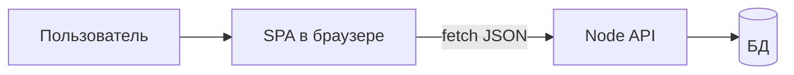

# SPA и выбор frontend-фреймворка

---

## Обзор SPA и frontend-стека

Раздел [Frontend Frameworks](./intro.md) разбит по технологиям. Здесь — **общая терминология** (SPA, компонент, state, bundler) и **критерии выбора** фреймворка перед углублением в [React](./1-react/intro.md), [Vue](./2-vue/intro.md) или [Angular](./3-angular/intro.md).

Связка с сервером — [Fullstack](../1-runtime-node/264.md). Meta-фреймворки (SSR) — [Next.js](../3-meta-frameworks/273.md).

---

## SPA — одностраничное приложение

После первой загрузки HTML/JS **навигация не перезагружает всю страницу**: JavaScript меняет DOM и подгружает данные с API. URL меняется через History API (`/notes`, `/settings`).

| Часть | Роль | Пример |
|-------|------|--------|
| Браузер | UI, логика отображения | React на `:5173` |
| API | Данные, правила | Express на `:3000` |
| Сборщик | JSX → JS, dev-сервер | Vite |

---

## Общие идеи у React, Vue и Angular

| Идея | Смысл |
|------|--------|
| Компонент | Кусок UI + логика, переиспользуется |
| Состояние | Данные, от которых зависит экран |
| Реактивность | При смене данных UI обновляется |
| Маршрутизация | URL → экран (React Router, Vue Router, Angular Router) |
| Сборка | `npm run dev` / `npm run build` |

Различаются синтаксисом и тем, насколько фреймворк задаёт архитектуру за вас.

---

## Как выбрать

| Критерий | React | Vue | Angular |
|----------|-------|-----|---------|
| Порог входа | Средний | Ниже | Выше |
| Экосистема | Огромная | Большая | Корпоративная |
| TypeScript | Опционально | Опционально | По умолчанию |
| Готовые решения из коробки | Мало (библиотека) | Средне | Много (платформа) |
| Типичный работодатель | Стартапы, продукт | Смешанно | Enterprise, банки |

**Ext JS** — отдельная ниша: готовые enterprise-виджеты, legacy-системы — [4-ext-js](./4-ext-js/intro.md).

Не застревайте на выборе месяцами: пройдите [первую программу](./1-react/272.md) на одном стеке, затем сравните по ощущениям.

---

## Маршруты по фреймворкам

| Фреймворк | Старт | Обзор | Справочник |
|-----------|-------|-------|------------|
| React | [Первая программа на React](./1-react/272.md) | [React - библиотека для пользовательских интерфейсов](./1-react/27.md) | [Справочник по React](./1-react/271.md) |
| Vue | [Первая программа на Vue.js](./2-vue/282.md) | [Vue.js](./2-vue/28.md) | [Справочник по Vue.js](./2-vue/281.md) |
| Angular | [Первая программа на Angular](./3-angular/292.md) | [Angular](./3-angular/29.md) | [Справочник по Angular](./3-angular/291.md) |
| Ext JS | [Первая программа на Ext JS](./4-ext-js/312.md) | [31](./4-ext-js/31.md) | [Справочник по Ext JS](./4-ext-js/311.md) |

---

## Связанные материалы

- [JavaScript — основы](../../25.md)
- [Node.js и API](../1-runtime-node/intro.md)
- [TypeScript](../../30.md)
