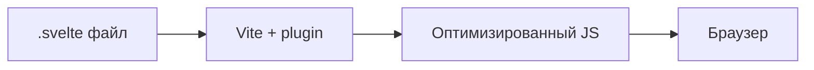
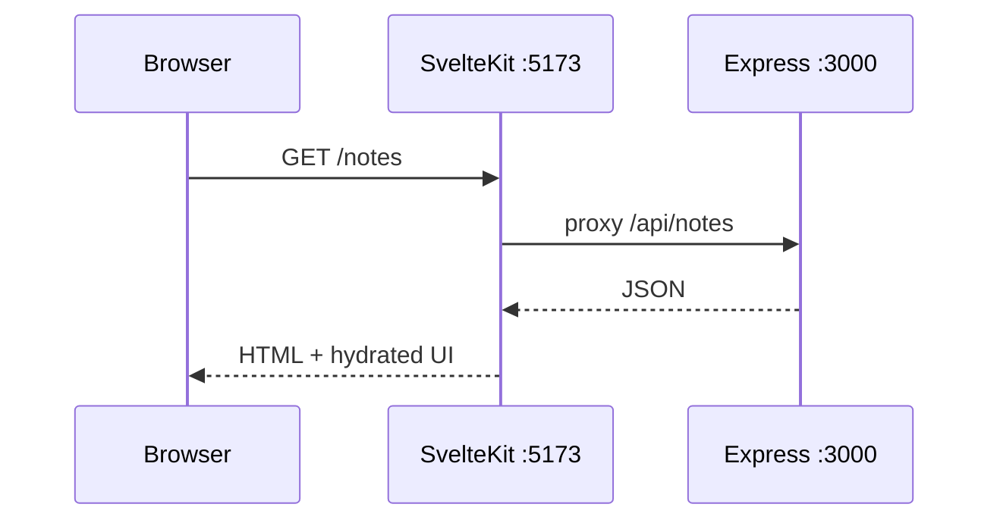

# Первая программа на Svelte

<div class="article-tags">
  <span class="tag tag-required">ОБЯЗАТЕЛЬНО</span>
  <span class="tag tag-beginner">ДЛЯ НОВИЧКОВ</span>
</div>

<span class="complexity-badge">Разработчику</span>
<span class="complexity-badge">Архитектору</span>

---

## Первая программа на Svelte

**Svelte** — фреймворк, который **компилирует** компоненты в эффективный JavaScript на этапе сборки. В runtime нет [виртуального DOM](/encyclopedia/3-data-markup/3-09-html/998), как в [React](./1-react/272.md) — бандл меньше, ментальная модель проще для небольших UI.

Сборка и dev-server идут через [Vite — сборка и dev-server](./288.md). Сравнение синтаксиса с Vue — [Первая программа на Vue.js](./2-vue/282.md).

| Шаг | Результат |
|-----|-----------|
| 1 | `npm create svelte@latest` — каркас проекта |
| 2 | `+page.svelte` — счётчик и форма |
| 3 | `$state`, `$derived` — реактивность Svelte 5 |
| 4 | Список с API — fetch к [Node backend](../1-runtime-node/262.md) |
| 5 | Дочерние компоненты — props и callbacks |
| 6 | `npm run build` — production-сборка |

| Материал | Зачем |
|----------|-------|
| [Vite — сборка и dev-server](./288.md) | HMR, proxy, env |
| [Первая программа на Node.js](../1-runtime-node/262.md) | REST API на порту 3000 |
| [Fullstack](../1-runtime-node/264.md) | CORS, два порта |
| [npm](../1-runtime-node/265.md) | scripts, install |
| [HTML — о разделе](/encyclopedia/3-data-markup/3-09-html/intro) | разметка в `.svelte` |
| [TypeScript](/encyclopedia/5-languages/5-10-typescript/4) | опция в мастере create-svelte |

### Навигация по фронтенду

- Сборка: [Vite — сборка и dev-server](./288.md)
- React: [Первая программа на React](./1-react/272.md)
- Vue: [Первая программа на Vue.js](./2-vue/282.md)
- Вы здесь: [Первая программа на Svelte](./286.md)
- Статические сайты: [Первая программа на Astro](./287.md)

<div class="callout callout--tip">
  <div class="callout-title">Svelte 5 runes</div>

  <div class="callout-body">
  В этой статье используется синтаксис <strong>Svelte 5</strong> (<code>$state</code>, <code>$derived</code>, <code>$props</code>). Старые проекты могут ещё использовать <code>let count = 0</code> без runes — проверьте версию в <code>package.json</code>.
</div>
</div>

---

## Как работает Svelte



| Этап | Что происходит |
|------|----------------|
| Разработка | Vite отдаёт модули, HMR обновляет компонент |
| Сборка | Компилятор Svelte генерирует прямой DOM-код |
| Runtime | Минимальная библиотека реактивности |

В React компонент описывает **что** нарисовать, reconciler сравнивает деревья. В Svelte компилятор **заранее** генерирует код обновления DOM при изменении `$state`.

---

## Шаг 1 — создание проекта

```bash
node -v
npm create svelte@latest my-svelte-app
cd my-svelte-app
npm install
npm run dev
```

В мастере на первый раз:

| Вопрос | Рекомендация |
|--------|--------------|
| SvelteKit или Svelte | **SvelteKit** (роутинг из коробки) |
| TypeScript | по желанию (ниже — JavaScript) |
| ESLint / Prettier | Yes |
| Tailwind | по желанию |

Откройте адрес из терминала (обычно **http://localhost:5173**).

Структура SvelteKit:

```text
my-svelte-app/
  src/
    routes/
      +page.svelte      ← главная страница
      +layout.svelte    ← общая обёртка
    lib/                ← переиспользуемые компоненты
  vite.config.js
  svelte.config.js
  package.json
```

Разбор:

- Файлы `+page.svelte` — маршруты (аналог pages в Next.js).
- `src/lib` — импорт через `$lib/...` (алиас SvelteKit).
- [Vite](./288.md) под капотом — `npm run dev` запускает dev-server.

---

## Шаг 2 — первый компонент

`src/routes/+page.svelte`:

```svelte
<script>
  let name = $state('Гость');
  let count = $state(0);

  const greeting = $derived(`Привет, ${name}!`);

  function increment() {
    count += 1;
  }
</script>

<main>
  <h1>{greeting}</h1>
  <p>Счётчик: {count}</p>
  <button type="button" onclick={increment}>+1</button>

  <label>
    Имя:
    <input bind:value={name} />
  </label>
</main>

<style>
  main {
    font-family: system-ui, sans-serif;
    max-width: 32rem;
    margin: 2rem auto;
    padding: 0 1rem;
  }
  button {
    margin-right: 0.5rem;
    padding: 0.4rem 0.8rem;
  }
</style>
```

Разбор:

- `$state(0)` — реактивная переменная (Svelte 5 runes).
- `$derived(...)` — вычисляемое значение, пересчитывается при смене `name`.
- `{greeting}` — интерполяция в HTML (как `{{ }}` во Vue).
- `bind:value={name}` — двусторонняя связь с input, аналог `v-model` во Vue.
- `onclick={increment}` — обработчик без `@` (можно и `on:click` в старом стиле).
- `<style>` scoped по умолчанию — стили только для этого компонента.

Сохраните файл — страница обновится без полной перезагрузки (HMR).

---

## Шаг 3 — условия и циклы

```svelte
<script>
  let items = $state(['Яблоко', 'Банан', 'Груша']);
  let filter = $state('');

  const visible = $derived(
    items.filter((item) => item.toLowerCase().includes(filter.toLowerCase()))
  );
</script>

<input placeholder="Фильтр" bind:value={filter} />

<ul>
  {#each visible as item (item)}
    <li>{item}</li>
  {/each}
</ul>

{#if visible.length === 0}
  <p>Ничего не найдено</p>
{/if}
```

Разбор:

- `{#each visible as item (item)}` — цикл; `(item)` — key для стабильного DOM.
- `{#if}` / `{:else if}` / `{/if}` — условный рендер.
- `$derived` пересчитывает `visible` при изменении `items` или `filter`.

---

## Шаг 4 — список заметок с API

Если запущен [Node API на порту 3000](../1-runtime-node/262.md):

`src/routes/notes/+page.svelte`:

```svelte
<script>
  let notes = $state([]);
  let loading = $state(true);
  let error = $state('');
  let newText = $state('');

  async function loadNotes() {
    loading = true;
    error = '';
    try {
      const res = await fetch('/api/notes');
      if (!res.ok) throw new Error(`HTTP ${res.status}`);
      notes = await res.json();
    } catch (e) {
      error = e.message;
    } finally {
      loading = false;
    }
  }

  async function addNote() {
    const text = newText.trim();
    if (!text) return;
    const res = await fetch('/api/notes', {
      method: 'POST',
      headers: { 'Content-Type': 'application/json' },
      body: JSON.stringify({ text }),
    });
    if (!res.ok) return;
    newText = '';
    await loadNotes();
  }

  $effect(() => {
    loadNotes();
  });
</script>

<h1>Заметки</h1>

{#if loading}
  <p>Загрузка…</p>
{:else if error}
  <p class="err">Ошибка: {error}</p>
{:else}
  <ul>
    {#each notes as note (note.id)}
      <li>{note.text}</li>
    {/each}
  </ul>
{/if}

<form onsubmit={(e) => { e.preventDefault(); addNote(); }}>
  <input bind:value={newText} placeholder="Новая заметка" />
  <button type="submit">Добавить</button>
</form>

<style>
  .err { color: #c00; }
</style>
```

### Прокси к API

В `vite.config.js` ([288](./288.md)):

```javascript
import { sveltekit } from '@sveltejs/kit/vite';
import { defineConfig } from 'vite';

export default defineConfig({
  plugins: [sveltekit()],
  server: {
    proxy: {
      '/api': {
        target: 'http://127.0.0.1:3000',
        changeOrigin: true,
        rewrite: (path) => path.replace(/^\/api/, ''),
      },
    },
  },
});
```

Запрос `fetch('/api/notes')` идёт через Vite на Node — CORS не мешает. Подробнее — [Fullstack на JavaScript](../1-runtime-node/264.md).

---

## Шаг 5 — дочерний компонент

`src/lib/Counter.svelte`:

```svelte
<script>
  let { value = 0, onchange } = $props();

  function inc() {
    onchange?.(value + 1);
  }
</script>

<button type="button" onclick={inc}>Счётчик: {value}</button>
```

Родитель `src/routes/+page.svelte`:

```svelte
<script>
  import Counter from '$lib/Counter.svelte';
  let count = $state(0);
</script>

<Counter value={count} onchange={(v) => (count = v)} />
<p>Значение в родителе: {count}</p>
```

Разбор:

- `$props()` — входные props (Svelte 5).
- `onchange?.(...)` — optional callback вверх по дереву.
- Props вниз, callback вверх — та же идея, что во Vue и React.

---

## Шаг 6 — формы и локальное состояние

`src/lib/NoteForm.svelte`:

```svelte
<script>
  let { onsubmit } = $props();
  let text = $state('');

  function handleSubmit(e) {
    e.preventDefault();
    const trimmed = text.trim();
    if (!trimmed) return;
    onsubmit?.(trimmed);
    text = '';
  }
</script>

<form onsubmit={handleSubmit}>
  <textarea bind:value={text} rows="3" placeholder="Текст заметки"></textarea>
  <button type="submit">Сохранить</button>
</form>
```

Компонент **не знает** про API — только вызывает `onsubmit`. Родитель решает, куда отправить данные.

---

## Svelte, React и Vue — обзор

| | Svelte | React | Vue |
|---|--------|-------|-----|
| Runtime | минимальный | React + reconciler | Vue reactivity |
| Синтаксис | `.svelte` файл | JSX | `<template>` |
| Обучение | быстрый старт | hooks, ecosystem | директивы `v-*` |
| Экосystem | меньше вакансий | максимум | широкий |
| Сборка | Vite / SvelteKit | Vite / CRA | Vite / Vue CLI |

Svelte хорош для лендингов, дашбордов среднего размера и встраиваемых виджетов. Крупные команды чаще на React — но SvelteKit закрывает routing, SSR и адаптеры деплоя.

---

## Production-сборка

```bash
npm run build
npm run preview
```

| Команда | Результат |
|---------|-----------|
| `build` | Оптимизированные файлы в `.svelte-kit` / `build` |
| `preview` | Локальный просмотр production |

Для SvelteKit выберите **adapter**:

- `@sveltejs/adapter-static` — статический хостинг;
- `@sveltejs/adapter-node` — Node-сервер;
- `@sveltejs/adapter-vercel` — Vercel.

<div class="callout callout--warning">
  <div class="callout-title">Production</div>

  <div class="callout-body">
  На статическом хостинге API должен быть на отдельном домене с CORS или через reverse proxy. Секреты не кладите в клиентский код — только <code>VITE_*</code> для публичных URL ([288](./288.md)).
</div>
</div>

---

## Упражнения

1. Добавьте кнопку удаления заметки — `DELETE /api/notes/:id`.
2. Сделайте компонент `LoadingSpinner.svelte` и используйте его в `{#if loading}`.
3. Переведите проект на TypeScript — включите в мастере и типизируйте `Note`.
4. Добавьте страницу `/about` через `src/routes/about/+page.svelte`.
5. Сравните тот же UI на [Vue](./2-vue/282.md) — отметьте синтаксические отличия.

---

## Частые ошибки и troubleshooting

| Симптом | Причина | Решение |
|---------|---------|---------|
| Счётчик не обновляется | Забыли `$state` в Svelte 5 | Оберните значение в `$state(...)` |
| CORS при fetch | Прямой URL `:3000` из `:5173` | Прокси в `vite.config.js` — [288](./288.md) |
| `{#each}` без key | Нестабильный DOM | Добавьте `(note.id)` |
| `$effect` в бесконечном цикле | Мутируете state внутри effect | Разделите load и render |
| `Cannot find $lib/...` | Файл вне `src/lib` | Переместите или исправьте путь |
| HMR не срабатывает | Ошибка синтаксиса | Смотрите overlay в браузере |
| Пустой build | Неверный adapter | Проверьте `svelte.config.js` |

---

## FAQ

**Svelte или SvelteKit?**

Svelte — язык компонентов. SvelteKit — meta-framework (роутинг, SSR, adapters). Для новых проектов берите SvelteKit.

**Нужен ли TypeScript?**

Не обязателен, но рекомендуется для средних проектов — [TypeScript](/encyclopedia/5-languages/5-10-typescript/4).

**Как подключить UI-библиотеку?**

Skeleton, shadcn-svelte, Flowbite-Svelte — через npm. Стили scoped в компонентах совместимы с Tailwind.

**Svelte 4 и Svelte 5 в одном проекте?**

Миграция через runes — см. официальный guide. Новые статьи ориентированы на Svelte 5.

---

## Шаг 7 — SvelteKit routing и layout

`src/routes/+layout.svelte` — общая обёртка:

```svelte
<script>
  let { children } = $props();
</script>

<header>
  <nav>
    <a href="/">Главная</a>
    <a href="/notes">Заметки</a>
  </nav>
</header>

{@render children()}

<style>
  nav a { margin-right: 1rem; }
  header { padding: 1rem; border-bottom: 1px solid #ddd; }
</style>
```

`src/routes/notes/+page.svelte` — страница списка (код из шага 4).

| Файл | URL |
|------|-----|
| `+page.svelte` | `/` |
| `notes/+page.svelte` | `/notes` |
| `notes/[id]/+page.svelte` | `/notes/42` |

Динамический маршрут `src/routes/notes/[id]/+page.svelte`:

```svelte
<script>
  let { data } = $props();
</script>

<h1>Заметка #{data.id}</h1>
<p>{data.text}</p>
```

`+page.server.js` (load data на сервере SvelteKit):

```javascript
export async function load({ params, fetch }) {
  const res = await fetch(`/api/notes/${params.id}`);
  if (!res.ok) throw new Error('Not found');
  return res.json();
}
```

---

## Шаг 8 — stores (глобальное состояние)

Для простых случаев — runes в `$lib`. Для shared state — `svelte/store`:

`src/lib/theme.svelte.js`:

```javascript
import { writable } from 'svelte/store';

export const theme = writable('light');
```

Использование (Svelte 4 style) или обёртка через `$state` в Svelte 5.

Для крупных приложений — см. официальный `svelte/store` и паттерн context.

---

## Шаг 9 — TypeScript в Svelte

При создании проекта выберите TypeScript. Типизация props:

```svelte
<script lang="ts">
  interface Note {
    id: number;
    text: string;
  }

  let { notes = [] }: { notes: Note[] } = $props();
</script>
```

Подробнее о типах — [TypeScript](/encyclopedia/5-languages/5-10-typescript/4).

---

## Шаг 10 — тестирование компонентов

```bash
npm i -D vitest @testing-library/svelte
```

`vite.config.js`:

```javascript
test: {
  environment: 'jsdom',
  include: ['src/**/*.test.js'],
},
```

`src/lib/Counter.svelte.test.js`:

```javascript
import { render, fireEvent } from '@testing-library/svelte';
import Counter from './Counter.svelte';

test('increments on click', async () => {
  let value = 0;
  const { getByRole } = render(Counter, {
    props: { value, onchange: (v) => (value = v) },
  });
  await fireEvent.click(getByRole('button'));
  expect(value).toBe(1);
});
```

```bash
npx vitest
```

Vitest использует тот же [Vite](./288.md) config — быстрый запуск.

---

## Шаг 11 — SSR и adapter

SvelteKit рендерит HTML на сервере при первом запросе. `svelte.config.js`:

```javascript
import adapter from '@sveltejs/adapter-node';

export default {
  kit: {
    adapter: adapter(),
  },
};
```

| Adapter | Деплой |
|---------|--------|
| `adapter-static` | Netlify, GitHub Pages |
| `adapter-node` | VPS, Docker |
| `adapter-vercel` | Vercel |

```bash
npm run build
node build/index.js
```

---

## Fullstack dev workflow



Терминал 1: `cd notes-api && npm run dev` ([262](../1-runtime-node/262.md)).

Терминал 2: `cd my-svelte-app && npm run dev`.

---

## Расширенный troubleshooting

| Симптом | Детали |
|---------|--------|
| 500 на `+page.server.js` | API недоступен — проверьте proxy |
| `$props()` undefined | Svelte 5 — обновите родителя |
| FOUC стилей | `+layout.svelte` import CSS |
| SEO пустой | SSR включён в SvelteKit по умолчанию |
| Build size большой | code-split через dynamic import |

---

## Дополнительные упражнения

6. Страница `/notes/[id]` с удалением через DELETE.
7. Компонент `ErrorBanner.svelte` для `error` state.
8. Dark theme через CSS variables и `$state`.
9. Vitest-тест формы `NoteForm`.
10. Deploy на Vercel через `adapter-vercel`.

---

## Production checklist

| Пункт | Действие |
|-------|----------|
| `adapter-*` | Выбран под хостинг |
| Env API URL | Публичный URL backend |
| CORS или same-origin | Настроен proxy/nginx |
| Cache headers | Статика на CDN |
| Analytics | Отложенная загрузка |

---

## Справочник runes Svelte 5

| Rune | Назначение | Пример |
|------|------------|--------|
| `$state` | Реактивная переменная | `let n = $state(0)` |
| `$derived` | Вычисляемое значение | `$derived(n * 2)` |
| `$effect` | Побочный эффект | fetch при mount |
| `$props` | Входные props | `let { x } = $props()` |
| `$bindable` | Двусторонний prop | редко, для forms |

Старый синтаксис Svelte 4 (`$: doubled = n * 2`) заменён на `$derived` — при миграции смотрите официальный guide.

---

## Анимации и transitions

```svelte
<script>
  import { fade, fly } from 'svelte/transition';
  let visible = $state(true);
</script>

{#if visible}
  <p transition:fade>Исчезну с fade</p>
{/if}

<button onclick={() => (visible = !visible)}>Toggle</button>
```

Svelte анимирует enter/leave DOM без сторонних библиотек.

---

## Работа с формами и actions

```svelte
<form method="POST" action="?/create">
  <input name="text" required />
  <button>Отправить</button>
</form>
```

SvelteKit **form actions** обрабатывают POST на сервере без отдельного API — progressive enhancement. Подробнее в документации SvelteKit; для учебного API остаётся [fetch + Node](../1-runtime-node/262.md).

---

## Доступность (a11y)

- Используйте `<button type="button">` для кликов, не `<div onclick>`.
- `<label>` связан с `<input>` — клик по label фокусирует поле.
- Сообщения об ошибках — `aria-live="polite"` для screen readers.

---

## Сравнение fetch-паттернов

| Подход | Плюсы | Минусы |
|--------|-------|--------|
| `$effect` + fetch | Просто для учёбы | Нет cancel при unmount |
| `onMount` (Svelte 4) | Явный lifecycle | Устаревает в Svelte 5 |
| SvelteKit `load` | SSR, SEO | Нужен server route |
| TanStack Query | Cache, retry | Доп. зависимость |

Для production SPA часто добавляют TanStack Query; для первого проекта хватит `$effect`.

---

## Конфигурация vite.config.js (SvelteKit)

```javascript
import { sveltekit } from '@sveltejs/kit/vite';
import { defineConfig } from 'vite';

export default defineConfig({
  plugins: [sveltekit()],
  server: {
    port: 5173,
    proxy: {
      '/api': {
        target: 'http://127.0.0.1:3000',
        changeOrigin: true,
        rewrite: (p) => p.replace(/^\/api/, ''),
      },
    },
  },
});
```

См. полный разбор proxy — [Vite — сборка и dev-server](./288.md).

---

## Environment variables в SvelteKit

Публичные переменные — префикс по правилам SvelteKit (`PUBLIC_` в .env):

```env
PUBLIC_API_URL=http://127.0.0.1:3000
```

```javascript
import { PUBLIC_API_URL } from '$env/static/public';
```

Секреты — только в `+page.server.js`, не в клиентском коде.

---


---

## Второй проход — расширенный практикум (Svelte)

### Серия мини-туториалов

#### Туториал 1 — Stores writable

Команда или API: `import { writable } from 'svelte/store'`.

Детали: shared state между routes.

```typescript
// пример шага
console.log('ok');
```

| Шаг | Проверка |
|-----|----------|
| 1 | Выполнить Stores writable |
| 2 | Перезапустить dev-сервер |
| 3 | Убедиться в отсутствии ошибок в консоли |

#### Туториал 2 — Derived store

Команда или API: `derived(count, $c => $c * 2)`.

Детали: реактивные вычисления.

```typescript
// пример шага
console.log('ok');
```

| Шаг | Проверка |
|-----|----------|
| 1 | Выполнить Derived store |
| 2 | Перезапустить dev-сервер |
| 3 | Убедиться в отсутствии ошибок в консоли |

#### Туториал 3 — Snippets Svelte 5

Команда или API: `{#snippet row(item)}`.

Детали: переиспользование markup.

```typescript
// пример шага
console.log('ok');
```

| Шаг | Проверка |
|-----|----------|
| 1 | Выполнить Snippets Svelte 5 |
| 2 | Перезапустить dev-сервер |
| 3 | Убедиться в отсутствии ошибок в консоли |

#### Туториал 4 — Actions use:

Команда или API: `function clickOutside(node)`.

Детали: DOM behavior без компонента.

```typescript
// пример шага
console.log('ok');
```

| Шаг | Проверка |
|-----|----------|
| 1 | Выполнить Actions use: |
| 2 | Перезапустить dev-сервер |
| 3 | Убедиться в отсутствии ошибок в консоли |

#### Туториал 5 — Transitions

Команда или API: `transition:fade`.

Детали: анимация списка notes.

```typescript
// пример шага
console.log('ok');
```

| Шаг | Проверка |
|-----|----------|
| 1 | Выполнить Transitions |
| 2 | Перезапустить dev-сервер |
| 3 | Убедиться в отсутствии ошибок в консоли |

#### Туториал 6 — load function

Команда или API: `+page.js export load`.

Детали: SSR data в SvelteKit.

```typescript
// пример шага
console.log('ok');
```

| Шаг | Проверка |
|-----|----------|
| 1 | Выполнить load function |
| 2 | Перезапустить dev-сервер |
| 3 | Убедиться в отсутствии ошибок в консоли |

#### Туториал 7 — form actions

Команда или API: `+page.server.js actions`.

Детали: POST без client fetch.

```typescript
// пример шага
console.log('ok');
```

| Шаг | Проверка |
|-----|----------|
| 1 | Выполнить form actions |
| 2 | Перезапустить dev-сервер |
| 3 | Убедиться в отсутствии ошибок в консоли |

#### Туториал 8 — hooks handle

Команда или API: `hooks.server.js`.

Детали: auth check все routes.

```typescript
// пример шага
console.log('ok');
```

| Шаг | Проверка |
|-----|----------|
| 1 | Выполнить hooks handle |
| 2 | Перезапустить dev-сервер |
| 3 | Убедиться в отсутствии ошибок в консоли |

#### Туториал 9 — adapter-node

Команда или API: `npm i -D @sveltejs/adapter-node`.

Детали: deploy Node server.

```typescript
// пример шага
console.log('ok');
```

| Шаг | Проверка |
|-----|----------|
| 1 | Выполнить adapter-node |
| 2 | Перезапустить dev-сервер |
| 3 | Убедиться в отсутствии ошибок в консоли |

#### Туториал 10 — i18n

Команда или API: `svelte-i18n`.

Детали: локализация строк UI.

```typescript
// пример шага
console.log('ok');
```

| Шаг | Проверка |
|-----|----------|
| 1 | Выполнить i18n |
| 2 | Перезапустить dev-сервер |
| 3 | Убедиться в отсутствии ошибок в консоли |

---

## Расширенные упражнения (второй проход)

13. DELETE note кнопка с confirm dialog.

> **Подсказка к упражнению 13:** Начните с минимального изменения, затем добавьте тест. Тема: DELETE.

14. LoadingSpinner component в `{#if loading}`.

> **Подсказка к упражнению 14:** Начните с минимального изменения, затем добавьте тест. Тема: LoadingSpinner.

15. TypeScript Note interface в +page.svelte.

> **Подсказка к упражнению 15:** Начните с минимального изменения, затем добавьте тест. Тема: TypeScript.

16. Страница /about с layout наследованием.

> **Подсказка к упражнению 16:** Начните с минимального изменения, затем добавьте тест. Тема: Страница.

17. Сравните синтаксис с Vue doc.

> **Подсказка к упражнению 17:** Начните с минимального изменения, затем добавьте тест. Тема: Сравните.

18. Optimistic UI add note до ответа server.

> **Подсказка к упражнению 18:** Начните с минимального изменения, затем добавьте тест. Тема: Optimistic.

19. Error boundary `{#await}` блок.

> **Подсказка к упражнению 19:** Начните с минимального изменения, затем добавьте тест. Тема: Error.

20. Keyboard shortcut Ctrl+N новая note.

> **Подсказка к упражнению 20:** Начните с минимального изменения, затем добавьте тест. Тема: Keyboard.

21. Persist filter в sessionStorage.

> **Подсказка к упражнению 21:** Начните с минимального изменения, затем добавьте тест. Тема: Persist.

22. Unit test logic extract в notes.ts.

> **Подсказка к упражнению 22:** Начните с минимального изменения, затем добавьте тест. Тема: Unit.

---

## Расширенный FAQ (второй проход)

**Svelte 4 migration?**

Runes opt-in постепенно, см. migration guide.

**SSR hydration mismatch?**

Проверьте browser-only API в onMount.

**SEO SvelteKit?**

ssr true, meta tags в svelte:head.

**PWA?**

vite-plugin-pwa в SvelteKit config.

**CSS framework?**

Tailwind через skeleton или unstyled components.

**Auth?**

hooks.server.js session cookie + load redirect.

**WebSocket notes?**

onMount subscribe, onDestroy cleanup.

**Bundle size?**

analyze через rollup-plugin-visualizer.

**Test components?**

Vitest + @testing-library/svelte.

**Deploy static?**

adapter-static prerender all pages.

---

## Production — дополнительные рекомендации

| # | Практика | Зачем |
|---|----------|-------|
| 1 | adapter-node | adapter-node за reverse proxy TLS |
| 2 | Cache-Control | Cache-Control static assets CDN |
| 3 | Env | Env PUBLIC_ prefix только public vars |
| 4 | Error | Error tracking Sentry browser SDK |
| 5 | Lazy | Lazy load heavy components import() |
| 6 | A11y | A11y audit axe in CI |
| 7 | Rate | Rate limit API отдельно от static |
| 8 | Preview | Preview deploy per PR Vercel |

---

## Troubleshooting — расширенная таблица

| Симптом | Вероятная причина | Действие |
|---------|-------------------|----------|
| Сборка падает без текста | Кэш или версия Node | Очистить node_modules, lock-файл, переустановить |
| Тесты flaky | Порядок или timing | Изолировать example, убрать sleep, добавить wait matchers |
| Production 502 | Process не слушает PORT | Проверить env PORT и health endpoint |
| Данные пропали после deploy | In-memory store или migrate | Подключить БД, migrate deploy |
| CORS в браузере | Прямой URL API | Proxy dev или enableCors origin |
| Медленный первый запрос | Cold start DB pool | Warmup health check после deploy |
| Ошибка подписи iOS | Certificate expired | Renew в Developer portal, download profiles |
| Turbo frame blank | Id mismatch | Сверить turbo-frame id в request и response |
| Prisma client outdated | Schema changed | npx prisma generate после migrate |
| Vite blank prod | Неверный base path | Проверить base и URL деплоя |

---

## Пошаговый walkthrough — контрольный список

### День 1

1. Шаг 1 дня 1: закрепить часть стека Svelte. Запишите результат в README проекта.

```bash
# checkpoint
npm test || bundle exec rspec || echo manual check
```

2. Шаг 2 дня 1: закрепить часть стека Svelte. Запишите результат в README проекта.

```bash
# checkpoint
npm test || bundle exec rspec || echo manual check
```

3. Шаг 3 дня 1: закрепить часть стека Svelte. Запишите результат в README проекта.

```bash
# checkpoint
npm test || bundle exec rspec || echo manual check
```

4. Шаг 4 дня 1: закрепить часть стека Svelte. Запишите результат в README проекта.

```bash
# checkpoint
npm test || bundle exec rspec || echo manual check
```

5. Шаг 5 дня 1: закрепить часть стека Svelte. Запишите результат в README проекта.

```bash
# checkpoint
npm test || bundle exec rspec || echo manual check
```

### День 2

1. Шаг 1 дня 2: закрепить часть стека Svelte. Запишите результат в README проекта.

```bash
# checkpoint
npm test || bundle exec rspec || echo manual check
```

2. Шаг 2 дня 2: закрепить часть стека Svelte. Запишите результат в README проекта.

```bash
# checkpoint
npm test || bundle exec rspec || echo manual check
```

3. Шаг 3 дня 2: закрепить часть стека Svelte. Запишите результат в README проекта.

```bash
# checkpoint
npm test || bundle exec rspec || echo manual check
```

4. Шаг 4 дня 2: закрепить часть стека Svelte. Запишите результат в README проекта.

```bash
# checkpoint
npm test || bundle exec rspec || echo manual check
```

5. Шаг 5 дня 2: закрепить часть стека Svelte. Запишите результат в README проекта.

```bash
# checkpoint
npm test || bundle exec rspec || echo manual check
```

### День 3

1. Шаг 1 дня 3: закрепить часть стека Svelte. Запишите результат в README проекта.

```bash
# checkpoint
npm test || bundle exec rspec || echo manual check
```

2. Шаг 2 дня 3: закрепить часть стека Svelte. Запишите результат в README проекта.

```bash
# checkpoint
npm test || bundle exec rspec || echo manual check
```

3. Шаг 3 дня 3: закрепить часть стека Svelte. Запишите результат в README проекта.

```bash
# checkpoint
npm test || bundle exec rspec || echo manual check
```

4. Шаг 4 дня 3: закрепить часть стека Svelte. Запишите результат в README проекта.

```bash
# checkpoint
npm test || bundle exec rspec || echo manual check
```

5. Шаг 5 дня 3: закрепить часть стека Svelte. Запишите результат в README проекта.

```bash
# checkpoint
npm test || bundle exec rspec || echo manual check
```

### День 4

1. Шаг 1 дня 4: закрепить часть стека Svelte. Запишите результат в README проекта.

```bash
# checkpoint
npm test || bundle exec rspec || echo manual check
```

2. Шаг 2 дня 4: закрепить часть стека Svelte. Запишите результат в README проекта.

```bash
# checkpoint
npm test || bundle exec rspec || echo manual check
```

3. Шаг 3 дня 4: закрепить часть стека Svelte. Запишите результат в README проекта.

```bash
# checkpoint
npm test || bundle exec rspec || echo manual check
```

4. Шаг 4 дня 4: закрепить часть стека Svelte. Запишите результат в README проекта.

```bash
# checkpoint
npm test || bundle exec rspec || echo manual check
```

5. Шаг 5 дня 4: закрепить часть стека Svelte. Запишите результат в README проекта.

```bash
# checkpoint
npm test || bundle exec rspec || echo manual check
```

### День 5

1. Шаг 1 дня 5: закрепить часть стека Svelte. Запишите результат в README проекта.

```bash
# checkpoint
npm test || bundle exec rspec || echo manual check
```

2. Шаг 2 дня 5: закрепить часть стека Svelte. Запишите результат в README проекта.

```bash
# checkpoint
npm test || bundle exec rspec || echo manual check
```

3. Шаг 3 дня 5: закрепить часть стека Svelte. Запишите результат в README проекта.

```bash
# checkpoint
npm test || bundle exec rspec || echo manual check
```

4. Шаг 4 дня 5: закрепить часть стека Svelte. Запишите результат в README проекта.

```bash
# checkpoint
npm test || bundle exec rspec || echo manual check
```

5. Шаг 5 дня 5: закрепить часть стека Svelte. Запишите результат в README проекта.

```bash
# checkpoint
npm test || bundle exec rspec || echo manual check
```

### День 6

1. Шаг 1 дня 6: закрепить часть стека Svelte. Запишите результат в README проекта.

```bash
# checkpoint
npm test || bundle exec rspec || echo manual check
```

2. Шаг 2 дня 6: закрепить часть стека Svelte. Запишите результат в README проекта.

```bash
# checkpoint
npm test || bundle exec rspec || echo manual check
```

3. Шаг 3 дня 6: закрепить часть стека Svelte. Запишите результат в README проекта.

```bash
# checkpoint
npm test || bundle exec rspec || echo manual check
```

4. Шаг 4 дня 6: закрепить часть стека Svelte. Запишите результат в README проекта.

```bash
# checkpoint
npm test || bundle exec rspec || echo manual check
```

5. Шаг 5 дня 6: закрепить часть стека Svelte. Запишите результат в README проекта.

```bash
# checkpoint
npm test || bundle exec rspec || echo manual check
```

### День 7

1. Шаг 1 дня 7: закрепить часть стека Svelte. Запишите результат в README проекта.

```bash
# checkpoint
npm test || bundle exec rspec || echo manual check
```

2. Шаг 2 дня 7: закрепить часть стека Svelte. Запишите результат в README проекта.

```bash
# checkpoint
npm test || bundle exec rspec || echo manual check
```

3. Шаг 3 дня 7: закрепить часть стека Svelte. Запишите результат в README проекта.

```bash
# checkpoint
npm test || bundle exec rspec || echo manual check
```

4. Шаг 4 дня 7: закрепить часть стека Svelte. Запишите результат в README проекта.

```bash
# checkpoint
npm test || bundle exec rspec || echo manual check
```

5. Шаг 5 дня 7: закрепить часть стека Svelte. Запишите результат в README проекта.

```bash
# checkpoint
npm test || bundle exec rspec || echo manual check
```

---

## Чек-лист самопроверки перед сдачей практикума

- [ ] Проект создаётся с нуля по статье без пропусков шагов

- [ ] CRUD или эквивалентный сценарий работает end-to-end

- [ ] Есть обработка ошибок валидации или 404

- [ ] Данные переживают перезапуск там, где это требуется темой

- [ ] Написан минимум один автоматический тест или system check

- [ ] Production-секция прочитана и применена к деплою или Docker

- [ ] FAQ просмотрен — типичные ошибки воспроизведены и исправлены

- [ ] Связанные материалы открыты для следующего шага обучения


## Связанные материалы

| Тема | Материал |
|------|----------|
| Vite | [Vite — сборка и dev-server](./288.md) |
| Vue | [Первая программа на Vue.js](./2-vue/282.md) |
| React | [Первая программа на React](./1-react/272.md) |
| Node API | [Первая программа на Node.js](../1-runtime-node/262.md) |
| Express CORS | [Express — middleware](../1-runtime-node/263.md) |
| npm | [npm — команды и lock-файлы](../1-runtime-node/265.md) |
| HTML | [HTML — о разделе](/encyclopedia/3-data-markup/3-09-html/intro) |
| Галерея | [Vue и Svelte — лаборатория](/lab/Примеры/1147) |

---
