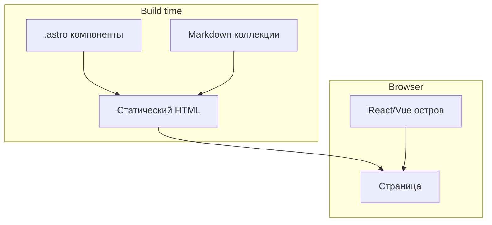
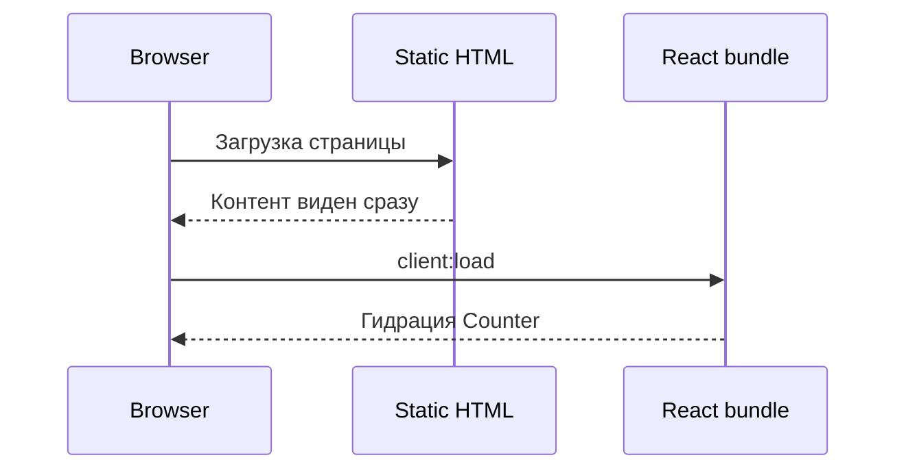
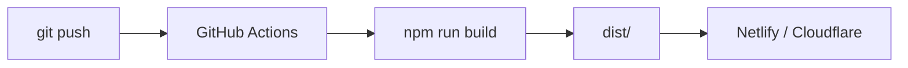

# Первая программа на Astro

<div class="article-tags">
  <span class="tag tag-required">ОБЯЗАТЕЛЬНО</span>
  <span class="tag tag-beginner">ДЛЯ НОВИЧКОВ</span>
</div>

<span class="complexity-badge">Разработчику</span>
<span class="complexity-badge">Архитектору</span>

---

## Первая программа на Astro

**Astro** — фреймворк для **контентных сайтов**:

- блоги;
- документация;
- лендинги.

По умолчанию на сервер уходит **ноль** JavaScript — [HTML](/encyclopedia/3-data-markup/3-09-html/intro) собирается на этапе build. Интерактивные блоки подключаются как **острова** (React, Vue, Svelte) только там, где нужны.

Под капотом — [Vite — сборка и dev-server](./288.md). Для полноценного SPA чаще берут [React](./1-react/272.md) или [Next.js](../3-meta-frameworks/273.md). Astro — когда важны SEO и скорость первой отрисовки.

| Шаг | Результат |
|-----|-----------|
| 1 | `npm create astro@latest` — каркас |
| 2 | `index.astro` — статическая страница |
| 3 | Layout и slot — переиспользование |
| 4 | Остров React — интерактив |
| 5 | Content Collections — блог из Markdown |
| 6 | `build` и деплой — статический хостинг |

| Материал | Зачем |
|----------|-------|
| [Vite](./288.md) | dev-server, HMR |
| [HTML — о разделе](/encyclopedia/3-data-markup/3-09-html/intro) | разметка страниц |
| [CSS — о разделе](/encyclopedia/3-data-markup/3-10-css/intro) | scoped styles |
| [React](./1-react/272.md) | острова `client:*` |
| [npm](../1-runtime-node/265.md) | scripts |

### Навигация по фронтенду

- Сборка: [Vite — сборка и dev-server](./288.md)
- SPA: [React](./1-react/272.md), [Svelte](./286.md)
- Вы здесь: [Первая программа на Astro](./287.md)
- SSR meta: [Next.js](../3-meta-frameworks/273.md)

<div class="callout callout--tip">
  <div class="callout-title">Островная архитектура</div>

  <div class="callout-body">
  Большая часть страницы — чистый HTML. JavaScript загружается только для интерактивных блоков (счётчик, форма, корзина). Это ускоряет First Contentful Paint.
</div>
</div>

---

## Как устроен Astro



| Режим | JavaScript в браузере |
|-------|----------------------|
| Статический `.astro` | 0 KB (только HTML/CSS) |
| `<Counter client:load />` | JS только для Counter |
| SSR (`output: 'server'`) | HTML на сервере + острова |

---

## Шаг 1 — создание проекта

```bash
node -v
npm create astro@latest my-astro-site
cd my-astro-site
npm install
npm run dev
```

В мастере:

| Опция | На первый раз |
|-------|---------------|
| Template | Empty или Blog |
| TypeScript | Strict (рекомендуется) |
| Integrations | React или Vue — по желанию |

Dev-server: **http://localhost:4321** (порт Astro по умолчанию).

Структура:

```text
my-astro-site/
  src/
    pages/           ← маршруты (файловая)
    layouts/
    components/
    content/         ← коллекции Markdown
  public/            ← статика as-is
  astro.config.mjs
  package.json
```

---

## Шаг 2 — страница `.astro`

`src/pages/index.astro`:

```astro
---
const title = 'Мой первый Astro-сайт';
const items = ['Документация', 'Блог', 'Контакты'];
const year = new Date().getFullYear();
---

<html lang="ru">
  <head>
    <meta charset="utf-8" />
    <meta name="viewport" content="width=device-width" />
    <title>{title}</title>
  </head>
  <body>
    <main>
      <h1>{title}</h1>
      <p>Статический HTML без клиентского JS.</p>
      <ul>
        {items.map((item) => <li>{item}</li>)}
      </ul>
      <footer>© {year}</footer>
    </main>
  </body>
</html>

<style>
  main {
    max-width: 40rem;
    margin: 2rem auto;
    font-family: system-ui, sans-serif;
    padding: 0 1rem;
  }
  footer {
    margin-top: 2rem;
    color: #666;
  }
</style>
```

Разбор:

- Блок `---` сверху — **frontmatter** на сервере: переменные, `fetch`, импорты.
- Ниже — HTML-шаблон; `{items.map(...)}` выполняется при сборке или SSR.
- `<style>` по умолчанию **scoped** к компоненту — классы не конфликтуют глобально.
- В браузере **нет** Svelte/React runtime для этой страницы.

---

## Шаг 3 — Layout и slot

`src/layouts/BaseLayout.astro`:

```astro
---
const { title = 'Astro', description = '' } = Astro.props;
---
<html lang="ru">
  <head>
    <meta charset="utf-8" />
    <meta name="viewport" content="width=device-width" />
    <meta name="description" content={description} />
    <title>{title}</title>
  </head>
  <body>
    <header>
      <nav>
        <a href="/">Главная</a>
        <a href="/about">О проекте</a>
        <a href="/blog">Блог</a>
      </nav>
    </header>
    <slot />
    <footer>© {new Date().getFullYear()} IT Universe</footer>
  </body>
</html>

<style>
  nav a { margin-right: 1rem; }
  footer { margin-top: 3rem; font-size: 0.875rem; color: #666; }
</style>
```

`src/pages/about.astro`:

```astro
---
import BaseLayout from '../layouts/BaseLayout.astro';
---
<BaseLayout title="О проекте" description="Кратко о нашем сайте">
  <h1>О нас</h1>
  <p>Контент страницы попадает в <code>&lt;slot /&gt;</code> layout.</p>
</BaseLayout>
```

Файловая маршрутизация:

| Файл | URL |
|------|-----|
| `src/pages/index.astro` | `/` |
| `src/pages/about.astro` | `/about` |
| `src/pages/blog/index.astro` | `/blog` |

---

## Шаг 4 — данные на этапе сборки

`src/pages/team.astro`:

```astro
---
import BaseLayout from '../layouts/BaseLayout.astro';

const members = [
  { name: 'Анна', role: 'Автор' },
  { name: 'Борис', role: 'Редактор' },
];

// Можно fetch к API на build time:
// const res = await fetch('https://api.example.com/team');
// const members = await res.json();
---

<BaseLayout title="Команда">
  <h1>Команда</h1>
  <ul>
    {members.map((m) => (
      <li><strong>{m.name}</strong> — {m.role}</li>
    ))}
  </ul>
</BaseLayout>
```

`fetch` в frontmatter выполняется **при сборке** (SSG) или на сервере (SSR) — не в браузере пользователя.

---

## Шаг 5 — остров React

Установка интеграции:

```bash
npx astro add react
```

`src/components/Counter.jsx`:

```jsx
import { useState } from 'react';

export default function Counter() {
  const [n, setN] = useState(0);
  return (
    <button type="button" onClick={() => setN(n + 1)}>
      Кликов: {n}
    </button>
  );
}
```

На странице:

```astro
---
import BaseLayout from '../layouts/BaseLayout.astro';
import Counter from '../components/Counter.jsx';
---
<BaseLayout title="Главная">
  <h1>Главная</h1>
  <p>Ниже — интерактивный остров:</p>
  <Counter client:load />
</BaseLayout>
```

Директивы клиента:

| Директива | Когда гидрировать |
|-----------|-------------------|
| `client:load` | Сразу при загрузке |
| `client:visible` | Когда элемент в viewport |
| `client:idle` | Когда браузер простаивает |
| `client:media="(max-width: 768px)"` | При совпадении media query |

Без `client:*` компонент остаётся **статическим HTML** — кнопка не кликается.



Тот же паттерн работает с [Svelte](./286.md) и Vue — через `astro add svelte` / `vue`.

---

## Шаг 6 — Content Collections (блог)

`src/content/config.ts`:

```typescript
import { defineCollection, z } from 'astro:content';

const blog = defineCollection({
  type: 'content',
  schema: z.object({
    title: z.string(),
    date: z.date(),
    draft: z.boolean().optional(),
  }),
});

export const collections = { blog };
```

`src/content/blog/hello-world.md`:

```markdown
---
title: "Первый пост"
date: 2026-06-15
---

Текст поста в **Markdown**.
```

`src/pages/blog/[...slug].astro`:

```astro
---
import { getCollection } from 'astro:content';
import BaseLayout from '../../layouts/BaseLayout.astro';

export async function getStaticPaths() {
  const posts = await getCollection('blog');
  return posts.map((post) => ({
    params: { slug: post.slug },
    props: { post },
  }));
}

const { post } = Astro.props;
const { Content } = await post.render();
---

<BaseLayout title={post.data.title}>
  <article>
    <h1>{post.data.title}</h1>
    <time>{post.data.date.toLocaleDateString('ru-RU')}</time>
    <Content />
  </article>
</BaseLayout>
```

Astro валидирует frontmatter через Zod и генерирует типы для IDE.

---

## Шаг 7 — сборка и preview

```bash
npm run build
npm run preview
```

| Команда | Результат |
|---------|-----------|
| `build` | Статические HTML/CSS в `dist/` |
| `preview` | Локальный сервер для проверки production |

Конфиг `astro.config.mjs`:

```javascript
import { defineConfig } from 'astro/config';

export default defineConfig({
  site: 'https://example.com',
  output: 'static',
});
```

`site` нужен для абсолютных URL в RSS и sitemap.

---

## Astro и Next.js — обзор задач

| Задача | Astro | Next.js |
|--------|-------|---------|
| Документация, блог | ✓ islands, мало JS | возможен, тяжелее |
| Dashboard SPA | слабо | ✓ |
| Минимум JS на странице | ✓ islands | code splitting |
| API routes | ✓ server endpoints | ✓ |
| Единый React SPA | не цель | ✓ |

Astro **дополняет** React — не заменяет его для сложных клиентских приложений.

---

## Упражнения

1. Добавьте страницу `/contacts` с формой (остров `client:visible`).
2. Создайте коллекцию `docs` с тремя Markdown-файлами.
3. Подключите `@astrojs/sitemap` и сгенерируйте sitemap.xml.
4. Сравните размер бандла с и без `client:load` на Counter (DevTools → Network).
5. Перенесите Counter на [Svelte](./286.md) через `astro add svelte`.

---

## Частые ошибки и troubleshooting

| Симптом | Причина | Решение |
|---------|---------|---------|
| Кнопка React не кликается | Нет `client:load` | Добавьте директиву client |
| 404 на маршрут | Файл вне `src/pages/` | Проверьте путь и имя |
| Стили "утекают" | Глобальный CSS | Scoped или CSS modules |
| `getCollection` пустой | Нет файлов в `content/` | Добавьте `.md` с frontmatter |
| Ошибка schema Zod | Неверный frontmatter | Смотрите сообщение CLI |
| Build падает на fetch | API недоступен при build | Mock или `fallback` |
| Порт 4321 занят | Другой Astro dev | `npm run dev -- --port 4322` |

---

## FAQ

**Astro — это статический генератор?**

По умолчанию да (`output: 'static'`). Можно включить SSR и server endpoints.

**Можно ли без React?**

Да. Чистые `.astro` + `<script>` в компоненте для простой интерактивности.

**Astro для документации как Docusaurus?**

Да, многие docs-сайты на Astro + Starlight (официальная тема).

**Как подключить API [Node](../1-runtime-node/262.md)?**

Server endpoints в `src/pages/api/` или fetch на build time / client islands.

---

## Production и деплой

### Статический хостинг

После `npm run build` загрузите `dist/` на:

- Netlify, Vercel, Cloudflare Pages;
- GitHub Pages (с `site` в config);
- любой nginx/static bucket.

### SSR и Node

```bash
npx astro add node
```

`output: 'server'` — HTML на каждый запрос. Деплой через Docker или Node-хостинг.

### Переменные окружения

Секреты — через `import.meta.env` **только** на сервере (frontmatter, endpoints). Не экспортируйте секреты в client islands.

<div class="callout callout--warning">
  <div class="callout-title">Production</div>

  <div class="callout-body">
  Проверяйте <code>npm run preview</code> перед деплоем. Для SEO — meta description, Open Graph, sitemap. CDN и gzip/brotli — на стороне хостинга.
</div>
</div>

---

## Шаг 8 — server endpoints (API routes)

`src/pages/api/notes.ts`:

```typescript
import type { APIRoute } from 'astro';

const notes = [{ id: 1, text: 'Пример' }];

export const GET: APIRoute = () => {
  return new Response(JSON.stringify(notes), {
    headers: { 'Content-Type': 'application/json' },
  });
};

export const POST: APIRoute = async ({ request }) => {
  const body = await request.json();
  const note = { id: Date.now(), text: body.text ?? '' };
  notes.push(note);
  return new Response(JSON.stringify(note), { status: 201 });
};
```

URL: `/api/notes`. Работает в dev и при `output: 'server'`.

Для статического `output: 'static'` API routes требуют adapter с server capability.

---

## Шаг 9 — fetch к внешнему API на build time

`src/pages/status.astro`:

```astro
---
const res = await fetch('https://api.github.com/repos/withastro/astro');
const data = await res.json();
---
<p>Stars: {data.stargazers_count}</p>
```

Запрос выполняется **при сборке** — страница статическая. Для актуальных данных — SSR или client island с `client:load`.

---

## Шаг 10 — Markdown с компонентами MDX

```bash
npx astro add mdx
```

`src/content/blog/post.mdx`:

```mdx
---
title: "MDX пост"
date: 2026-06-15
---

import Counter from '../../components/Counter.jsx';

# Заголовок

<Counter client:load />
```

MDX смешивает Markdown и JSX — удобно для документации.

---

## Шаг 11 — SEO и meta-теги

`BaseLayout.astro`:

```astro
---
const { title, description, image = '/og.png' } = Astro.props;
const canonical = new URL(Astro.url.pathname, Astro.site);
---
<head>
  <title>{title}</title>
  <meta name="description" content={description} />
  <link rel="canonical" href={canonical} />
  <meta property="og:title" content={title} />
  <meta property="og:description" content={description} />
  <meta property="og:image" content={image} />
</head>
```

`astro.config.mjs`:

```javascript
export default defineConfig({
  site: 'https://example.com',
});
```

---

## Шаг 12 — RSS и sitemap

```bash
npx astro add sitemap
```

```javascript
import sitemap from '@astrojs/sitemap';

export default defineConfig({
  site: 'https://example.com',
  integrations: [sitemap()],
});
```

После `build` — `sitemap-index.xml` в `dist/`.

---

## Деплой на статический хостинг



Пример GitHub Actions:

```yaml
jobs:
  deploy:
    runs-on: ubuntu-latest
    steps:
      - uses: actions/checkout@v4
      - uses: actions/setup-node@v4
        with:
          node-version: 22
      - run: npm ci
      - run: npm run build
      - uses: actions/upload-pages-artifact@v3
        with:
          path: dist
```

---

## Интеграция с Node API

| Подход | Когда |
|--------|-------|
| Build-time fetch | Данные редко меняются |
| Server endpoint Astro | Лёгкий BFF |
| Client island + fetch | Динамика в браузере |
| Отдельный [Node API](../1-runtime-node/262.md) | Полноценный backend |

---

## Расширенный troubleshooting

| Симптом | Детали |
|---------|--------|
| Hydration mismatch | Разный HTML server/client |
| Island не грузится | Путь import, `client:*` |
| Images не оптимизированы | `@astrojs/image` |
| MDX frontmatter error | Zod schema в config |
| Slow build | Много страниц — incremental |

---

## Дополнительные упражнения

6. RSS feed для коллекции blog.
7. Страница поиска по заголовкам постов.
8. React form с `client:visible` и POST на `/api/notes`.
9. Lighthouse audit до и после islands.
10. Starlight theme для docs-подраздела.

---

## Production checklist

| Пункт | Действие |
|-------|----------|
| `site` в config | Canonical, OG URLs |
| Compression | Brotli на CDN |
| Security headers | CSP, HSTS на CDN |
| Preview deploy | PR previews на Netlify |
| Monitor | Uptime на `/` |

---

## View Transitions API

```astro
---
import { ViewTransitions } from 'astro:transitions';
---
<head>
  <ViewTransitions />
</head>
```

Плавные переходы между страницами без тяжёлого SPA — встроено в Astro 3+.

---

## Partial hydration — когда какой client:*

| Директива | JS budget | UX |
|-----------|-----------|-----|
| без client | 0 | Статика |
| `client:visible` | Низкий | Lazy widgets |
| `client:idle` | Средний | Некритичный UI |
| `client:load` | Высокий | Сразу интерактив |

Стратегия: 90% страницы статика, острова только для форм и виджетов.

---

## Astro + Tailwind

```bash
npx astro add tailwind
```

```astro
<h1 class="text-3xl font-bold text-blue-600">Заголовок</h1>
```

Tailwind генерирует utility-классы — быстрый прототип лендингов. CSS-основы — [CSS — о разделе](/encyclopedia/3-data-markup/3-10-css/intro).

---

## i18n (многоязычность) — обзор

Структура:

```text
src/pages/
  ru/index.astro
  en/index.astro
```

Или библиотека `astro-i18n`. Для документации часто дублируют `content/` по локалям.

---

## Performance checklist

| Метрика | Инструмент | Цель |
|---------|------------|------|
| LCP | Lighthouse | &lt; 2.5s |
| JS size | Coverage tab | Минимум islands |
| Images | `@astrojs/image` | WebP, lazy |
| Fonts | `font-display: swap` | Без FOIT |

---

## Astro hybrid rendering

`astro.config.mjs`:

```javascript
export default defineConfig({
  output: 'hybrid',
});
```

Отдельные страницы помечают `export const prerender = false` для SSR — гибрид SSG и server.

---


---

## Второй проход — расширенный практикум (Astro)

### Серия мини-туториалов

#### Туториал 1 — Starlight docs

Команда или API: `npm create starlight`.

Детали: documentation theme.

```typescript
// пример шага
console.log('ok');
```

| Шаг | Проверка |
|-----|----------|
| 1 | Выполнить Starlight docs |
| 2 | Перезапустить dev-сервер |
| 3 | Убедиться в отсутствии ошибок в консоли |

#### Туториал 2 — MDX pages

Команда или API: `.mdx in content`.

Детали: React in Markdown.

```typescript
// пример шага
console.log('ok');
```

| Шаг | Проверка |
|-----|----------|
| 1 | Выполнить MDX pages |
| 2 | Перезапустить dev-сервер |
| 3 | Убедиться в отсутствии ошибок в консоли |

#### Туториал 3 — View Transitions

Команда или API: `ClientRouter`.

Детали: SPA-like nav static site.

```typescript
// пример шага
console.log('ok');
```

| Шаг | Проверка |
|-----|----------|
| 1 | Выполнить View Transitions |
| 2 | Перезапустить dev-сервер |
| 3 | Убедиться в отсутствии ошибок в консоли |

#### Туториал 4 — Image component

Команда или API: `<Image />`.

Детали: optimized responsive images.

```typescript
// пример шага
console.log('ok');
```

| Шаг | Проверка |
|-----|----------|
| 1 | Выполнить Image component |
| 2 | Перезапустить dev-сервер |
| 3 | Убедиться в отсутствии ошибок в консоли |

#### Туториал 5 — RSS feed

Команда или API: `@astrojs/rss`.

Детали: blog.xml autogen.

```typescript
// пример шага
console.log('ok');
```

| Шаг | Проверка |
|-----|----------|
| 1 | Выполнить RSS feed |
| 2 | Перезапустить dev-сервер |
| 3 | Убедиться в отсутствии ошибок в консоли |

#### Туториал 6 — Sitemap

Команда или API: `@astrojs/sitemap`.

Детали: SEO sitemap.xml.

```typescript
// пример шага
console.log('ok');
```

| Шаг | Проверка |
|-----|----------|
| 1 | Выполнить Sitemap |
| 2 | Перезапустить dev-сервер |
| 3 | Убедиться в отсутствии ошибок в консоли |

#### Туториал 7 — Server endpoints

Команда или API: `src/pages/api/data.ts`.

Детали: GET handler Response json.

```typescript
// пример шага
console.log('ok');
```

| Шаг | Проверка |
|-----|----------|
| 1 | Выполнить Server endpoints |
| 2 | Перезапустить dev-сервер |
| 3 | Убедиться в отсутствии ошибок в консоли |

#### Туториал 8 — Middleware

Команда или API: `src/middleware.ts`.

Детали: auth gate routes.

```typescript
// пример шага
console.log('ok');
```

| Шаг | Проверка |
|-----|----------|
| 1 | Выполнить Middleware |
| 2 | Перезапустить dev-сервер |
| 3 | Убедиться в отсутствии ошибок в консоли |

#### Туториал 9 — Hybrid output

Команда или API: `output hybrid`.

Детали: static + server routes mix.

```typescript
// пример шага
console.log('ok');
```

| Шаг | Проверка |
|-----|----------|
| 1 | Выполнить Hybrid output |
| 2 | Перезапустить dev-сервер |
| 3 | Убедиться в отсутствии ошибок в консоли |

#### Туториал 10 — Markdoc

Команда или API: `@astrojs/markdoc`.

Детали: custom content components.

```typescript
// пример шага
console.log('ok');
```

| Шаг | Проверка |
|-----|----------|
| 1 | Выполнить Markdoc |
| 2 | Перезапустить dev-сервер |
| 3 | Убедиться в отсутствии ошибок в консоли |

---

## Расширенные упражнения (второй проход)

13. Contacts page form client:visible.

> **Подсказка к упражнению 13:** Начните с минимального изменения, затем добавьте тест. Тема: Contacts.

14. Collection docs три markdown файла.

> **Подсказка к упражнению 14:** Начните с минимального изменения, затем добавьте тест. Тема: Collection.

15. sitemap.xml через integration.

> **Подсказка к упражнению 15:** Начните с минимального изменения, затем добавьте тест. Тема: sitemap.xml.

16. Compare bundle with without client:load.

> **Подсказка к упражнению 16:** Начните с минимального изменения, затем добавьте тест. Тема: Compare.

17. Counter on Svelte island astro add svelte.

> **Подсказка к упражнению 17:** Начните с минимального изменения, затем добавьте тест. Тема: Counter.

18. RSS для blog collection.

> **Подсказка к упражнению 18:** Начните с минимального изменения, затем добавьте тест. Тема: RSS.

19. View Transitions между pages.

> **Подсказка к упражнению 19:** Начните с минимального изменения, затем добавьте тест. Тема: View.

20. Server endpoint proxy external API.

> **Подсказка к упражнению 20:** Начните с минимального изменения, затем добавьте тест. Тема: Server.

21. Draft posts filter getCollection.

> **Подсказка к упражнению 21:** Начните с минимального изменения, затем добавьте тест. Тема: Draft.

22. Dark mode toggle minimal script.

> **Подсказка к упражнению 22:** Начните с минимального изменения, затем добавьте тест. Тема: Dark.

---

## Расширенный FAQ (второй проход)

**Astro или Next для блога?**

Astro меньше JS по умолчанию для content.

**React only island?**

Да, partial hydration client directives.

**CMS headless?**

Content collections или Sanity loader.

**i18n routes?**

[lang]/blog structure folders.

**Env secrets server?**

import.meta.env server only in .astro frontmatter.

**Build fetch fail?**

Fallback mock data if API down at build.

**Tailwind?**

npx astro add tailwind.

**Deploy Netlify?**

adapter netlify auto.

**Partial prerender?**

`export const prerender = true` per route.

**Markdown components?**

`import Callout from '../components'`.

---

## Production — дополнительные рекомендации

| # | Практика | Зачем |
|---|----------|-------|
| 1 | npm | npm run preview before deploy |
| 2 | CDN | CDN cache HTML short TTL if SSR |
| 3 | Image | Image optimization widths configured |
| 4 | Security | Security headers platform or middleware |
| 5 | Monitor | Monitor Core Web Vitals field data |
| 6 | Separate | Separate analytics island client:idle |
| 7 | 404 | 404 custom page src/pages/404.astro |
| 8 | Robots.txt | Robots.txt in public/ |

---

## Troubleshooting — расширенная таблица

| Симптом | Вероятная причина | Действие |
|---------|-------------------|----------|
| Сборка падает без текста | Кэш или версия Node | Очистить node_modules, lock-файл, переустановить |
| Тесты flaky | Порядок или timing | Изолировать example, убрать sleep, добавить wait matchers |
| Production 502 | Process не слушает PORT | Проверить env PORT и health endpoint |
| Данные пропали после deploy | In-memory store или migrate | Подключить БД, migrate deploy |
| CORS в браузере | Прямой URL API | Proxy dev или enableCors origin |
| Медленный первый запрос | Cold start DB pool | Warmup health check после deploy |
| Ошибка подписи iOS | Certificate expired | Renew в Developer portal, download profiles |
| Turbo frame blank | Id mismatch | Сверить turbo-frame id в request и response |
| Prisma client outdated | Schema changed | npx prisma generate после migrate |
| Vite blank prod | Неверный base path | Проверить base и URL деплоя |

---

## Пошаговый walkthrough — контрольный список

### День 1

1. Шаг 1 дня 1: закрепить часть стека Astro. Запишите результат в README проекта.

```bash
# checkpoint
npm test || bundle exec rspec || echo manual check
```

2. Шаг 2 дня 1: закрепить часть стека Astro. Запишите результат в README проекта.

```bash
# checkpoint
npm test || bundle exec rspec || echo manual check
```

3. Шаг 3 дня 1: закрепить часть стека Astro. Запишите результат в README проекта.

```bash
# checkpoint
npm test || bundle exec rspec || echo manual check
```

4. Шаг 4 дня 1: закрепить часть стека Astro. Запишите результат в README проекта.

```bash
# checkpoint
npm test || bundle exec rspec || echo manual check
```

5. Шаг 5 дня 1: закрепить часть стека Astro. Запишите результат в README проекта.

```bash
# checkpoint
npm test || bundle exec rspec || echo manual check
```

### День 2

1. Шаг 1 дня 2: закрепить часть стека Astro. Запишите результат в README проекта.

```bash
# checkpoint
npm test || bundle exec rspec || echo manual check
```

2. Шаг 2 дня 2: закрепить часть стека Astro. Запишите результат в README проекта.

```bash
# checkpoint
npm test || bundle exec rspec || echo manual check
```

3. Шаг 3 дня 2: закрепить часть стека Astro. Запишите результат в README проекта.

```bash
# checkpoint
npm test || bundle exec rspec || echo manual check
```

4. Шаг 4 дня 2: закрепить часть стека Astro. Запишите результат в README проекта.

```bash
# checkpoint
npm test || bundle exec rspec || echo manual check
```

5. Шаг 5 дня 2: закрепить часть стека Astro. Запишите результат в README проекта.

```bash
# checkpoint
npm test || bundle exec rspec || echo manual check
```

### День 3

1. Шаг 1 дня 3: закрепить часть стека Astro. Запишите результат в README проекта.

```bash
# checkpoint
npm test || bundle exec rspec || echo manual check
```

2. Шаг 2 дня 3: закрепить часть стека Astro. Запишите результат в README проекта.

```bash
# checkpoint
npm test || bundle exec rspec || echo manual check
```

3. Шаг 3 дня 3: закрепить часть стека Astro. Запишите результат в README проекта.

```bash
# checkpoint
npm test || bundle exec rspec || echo manual check
```

4. Шаг 4 дня 3: закрепить часть стека Astro. Запишите результат в README проекта.

```bash
# checkpoint
npm test || bundle exec rspec || echo manual check
```

5. Шаг 5 дня 3: закрепить часть стека Astro. Запишите результат в README проекта.

```bash
# checkpoint
npm test || bundle exec rspec || echo manual check
```

### День 4

1. Шаг 1 дня 4: закрепить часть стека Astro. Запишите результат в README проекта.

```bash
# checkpoint
npm test || bundle exec rspec || echo manual check
```

2. Шаг 2 дня 4: закрепить часть стека Astro. Запишите результат в README проекта.

```bash
# checkpoint
npm test || bundle exec rspec || echo manual check
```

3. Шаг 3 дня 4: закрепить часть стека Astro. Запишите результат в README проекта.

```bash
# checkpoint
npm test || bundle exec rspec || echo manual check
```

4. Шаг 4 дня 4: закрепить часть стека Astro. Запишите результат в README проекта.

```bash
# checkpoint
npm test || bundle exec rspec || echo manual check
```

5. Шаг 5 дня 4: закрепить часть стека Astro. Запишите результат в README проекта.

```bash
# checkpoint
npm test || bundle exec rspec || echo manual check
```

### День 5

1. Шаг 1 дня 5: закрепить часть стека Astro. Запишите результат в README проекта.

```bash
# checkpoint
npm test || bundle exec rspec || echo manual check
```

2. Шаг 2 дня 5: закрепить часть стека Astro. Запишите результат в README проекта.

```bash
# checkpoint
npm test || bundle exec rspec || echo manual check
```

3. Шаг 3 дня 5: закрепить часть стека Astro. Запишите результат в README проекта.

```bash
# checkpoint
npm test || bundle exec rspec || echo manual check
```

4. Шаг 4 дня 5: закрепить часть стека Astro. Запишите результат в README проекта.

```bash
# checkpoint
npm test || bundle exec rspec || echo manual check
```

5. Шаг 5 дня 5: закрепить часть стека Astro. Запишите результат в README проекта.

```bash
# checkpoint
npm test || bundle exec rspec || echo manual check
```

### День 6

1. Шаг 1 дня 6: закрепить часть стека Astro. Запишите результат в README проекта.

```bash
# checkpoint
npm test || bundle exec rspec || echo manual check
```

2. Шаг 2 дня 6: закрепить часть стека Astro. Запишите результат в README проекта.

```bash
# checkpoint
npm test || bundle exec rspec || echo manual check
```

3. Шаг 3 дня 6: закрепить часть стека Astro. Запишите результат в README проекта.

```bash
# checkpoint
npm test || bundle exec rspec || echo manual check
```

4. Шаг 4 дня 6: закрепить часть стека Astro. Запишите результат в README проекта.

```bash
# checkpoint
npm test || bundle exec rspec || echo manual check
```

5. Шаг 5 дня 6: закрепить часть стека Astro. Запишите результат в README проекта.

```bash
# checkpoint
npm test || bundle exec rspec || echo manual check
```

### День 7

1. Шаг 1 дня 7: закрепить часть стека Astro. Запишите результат в README проекта.

```bash
# checkpoint
npm test || bundle exec rspec || echo manual check
```

2. Шаг 2 дня 7: закрепить часть стека Astro. Запишите результат в README проекта.

```bash
# checkpoint
npm test || bundle exec rspec || echo manual check
```

3. Шаг 3 дня 7: закрепить часть стека Astro. Запишите результат в README проекта.

```bash
# checkpoint
npm test || bundle exec rspec || echo manual check
```

4. Шаг 4 дня 7: закрепить часть стека Astro. Запишите результат в README проекта.

```bash
# checkpoint
npm test || bundle exec rspec || echo manual check
```

5. Шаг 5 дня 7: закрепить часть стека Astro. Запишите результат в README проекта.

```bash
# checkpoint
npm test || bundle exec rspec || echo manual check
```

---

## Чек-лист самопроверки перед сдачей практикума

- [ ] Проект создаётся с нуля по статье без пропусков шагов

- [ ] CRUD или эквивалентный сценарий работает end-to-end

- [ ] Есть обработка ошибок валидации или 404

- [ ] Данные переживают перезапуск там, где это требуется темой

- [ ] Написан минимум один автоматический тест или system check

- [ ] Production-секция прочитана и применена к деплою или Docker

- [ ] FAQ просмотрен — типичные ошибки воспроизведены и исправлены

- [ ] Связанные материалы открыты для следующего шага обучения


---

## Дополнение второго прохода — финальные пункты

| # | Тема | Действие |
|---|------|----------|
| 1 | Content Collections | Проверить Zod schema на всех постах |
| 2 | Islands | Сравнить размер бандла с client:idle |
| 3 | Deploy | npm run preview перед загрузкой dist |

---

## Связанные материалы

| Тема | Материал |
|------|----------|
| Vite | [Vite — сборка и dev-server](./288.md) |
| Svelte | [Первая программа на Svelte](./286.md) |
| React | [Первая программа на React](./1-react/272.md) |
| SSR meta | [Next.js](../3-meta-frameworks/273.md) |
| Node API | [Первая программа на Node.js](../1-runtime-node/262.md) |
| npm | [npm — команды и lock-файлы](../1-runtime-node/265.md) |
| HTML основа | [HTML — о разделе](/encyclopedia/3-data-markup/3-09-html/intro) |
| CSS | [CSS — о разделе](/encyclopedia/3-data-markup/3-10-css/intro) |

---

## Итоговый чек-лист Astro

- [ ] `client:*` директива на интерактивных островах
- [ ] `npm run build` и `preview` перед деплоем
- [ ] Content collections со schema
- [ ] Sitemap и meta для SEO

---
