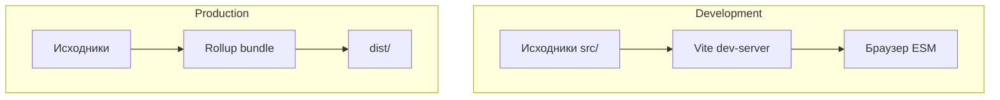
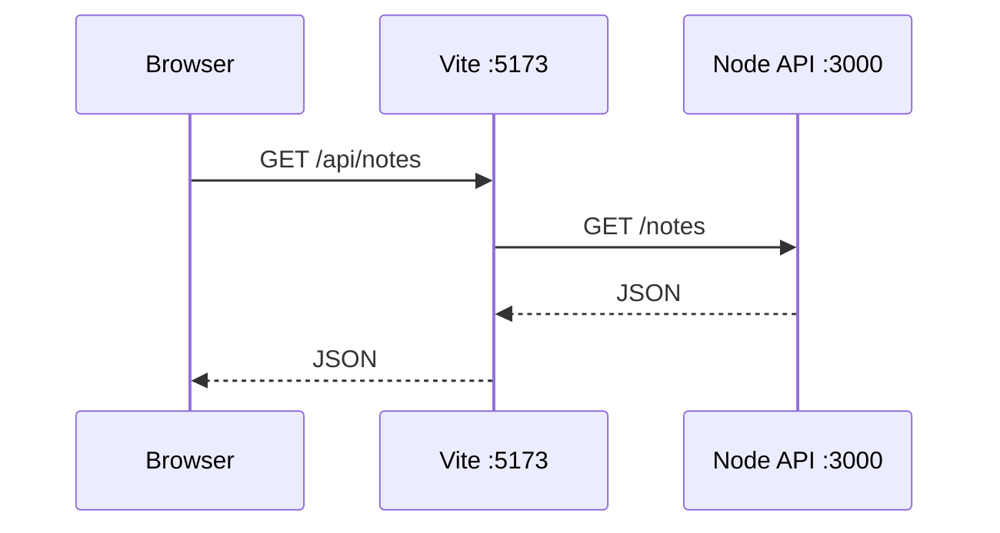
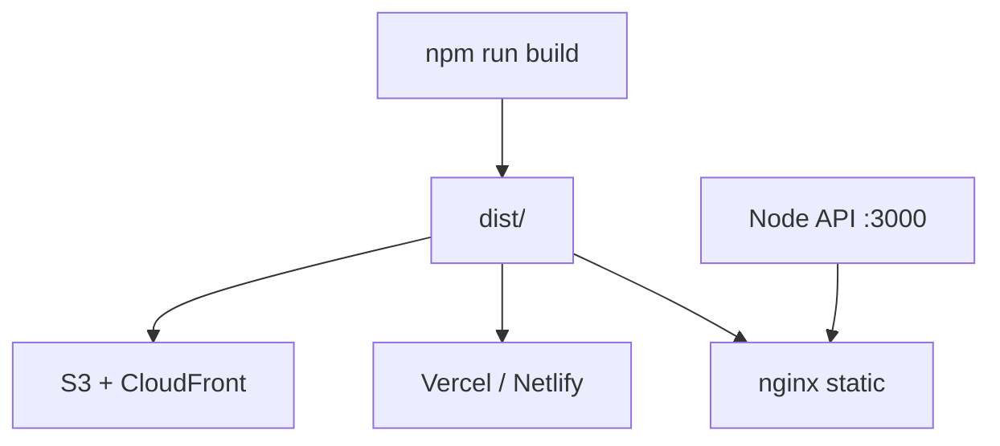

# Vite — сборка и dev-server

<div class="article-tags">
  <span class="tag tag-required">ОБЯЗАТЕЛЬНО</span>
  <span class="tag tag-beginner">ДЛЯ НОВИЧКОВ</span>
</div>

<span class="complexity-badge">Разработчику</span>
<span class="complexity-badge">Архитектору</span>

---

## Vite — сборка и dev-server

**Vite** — инструмент сборки и dev-server для современного фронтенда. В разработке отдаёт модули браузеру через **native ESM** (нативные ES-модули); в production собирает бандл через **Rollup**. Используется в [Vue](./2-vue/282.md), [React](./1-react/272.md), [Svelte](./286.md), [Astro](./287.md) из коробки.

Заменяет медленный старт Webpack на проектах с сотнями модулей: первый запуск и **HMR** (hot module replacement — горячая замена модулей без полной перезагрузки) обычно заметно быстрее.

| Шаг | Результат |
|-----|-----------|
| 1 | `npm create vite` — React или Vue |
| 2 | Структура `index.html` + `src/` |
| 3 | `vite.config.js` — proxy, alias |
| 4 | `.env` и `VITE_*` переменные |
| 5 | `build` + `preview` — production |
| 6 | TypeScript и CI | Проверка типов |

| Материал | Зачем |
|----------|-------|
| [npm — команды и lock-файлы](../1-runtime-node/265.md) | install, scripts |
| [Первая программа на Node.js](../1-runtime-node/262.md) | backend API :3000 |
| [Fullstack](../1-runtime-node/264.md) | CORS, два порта |
| [Express — middleware](../1-runtime-node/263.md) | CORS на API |
| [TypeScript](/encyclopedia/5-languages/5-10-typescript/4) | шаблоны `react-ts` |

### Навигация по фронтенду

- React: [Первая программа на React](./1-react/272.md)
- Vue: [Первая программа на Vue.js](./2-vue/282.md)
- Svelte: [Первая программа на Svelte](./286.md)
- Astro: [Первая программа на Astro](./287.md)
- Вы здесь: [Vite — сборка и dev-server](./288.md)

<div class="callout callout--tip">
  <div class="callout-title">Два режима Vite</div>

  <div class="callout-body">
  <strong>Dev</strong> — ESM и esbuild, почти мгновенный старт. <strong>Build</strong> — Rollup, минификация и code splitting для production.
</div>
</div>

---

## Как работает Vite



| Режим | Инструмент | Особенность |
|-------|------------|-------------|
| `npm run dev` | esbuild + native import | HMR, без полного бандла |
| `npm run build` | Rollup | Tree-shaking, chunks |

Vite отвечает только за **сборку клиентского** кода. Серверную часть запускает [Node.js](../1-runtime-node/262.md).

---

## Когда использовать Vite

| Сценарий | Vite | Альтернатива |
|----------|------|--------------|
| SPA на React/Vue/Svelte | ✓ | Webpack вручную |
| Библиотека UI | ✓ `vite build --lib` | tsup, Rollup |
| Legacy IE11 | осторожно | Webpack + polyfills |
| Монорепо | ✓ + pnpm workspaces | Turborepo, Nx |
| Node backend | не цель Vite | `tsc`, `tsx`, esbuild |

---

## Шаг 1 — быстрый старт React

```bash
node -v
npm create vite@latest my-react-app -- --template react
cd my-react-app
npm install
npm run dev
```

Структура:

```text
my-react-app/
  index.html          ← точка входа (не public/index.html как в CRA)
  vite.config.js
  src/
    main.jsx
    App.jsx
    index.css
  package.json
```

`index.html`:

```html
<!doctype html>
<html lang="ru">
  <head>
    <meta charset="UTF-8" />
    <meta name="viewport" content="width=device-width, initial-scale=1.0" />
    <title>My React App</title>
  </head>
  <body>
    <div id="root"></div>
    <script type="module" src="/src/main.jsx"></script>
  </body>
</html>
```

Разбор:

- Vite читает `index.html` как entry point.
- `type="module"` — native ESM в браузере.
- `npm run dev` → **http://localhost:5173**.

Production:

```bash
npm run build    # каталог dist/
npm run preview  # локальный просмотр dist
```

---

## Шаг 2 — быстрый старт Vue

```bash
npm create vite@latest my-vue-app -- --template vue
cd my-vue-app
npm install
npm run dev
```

`src/App.vue` — тот же цикл, что в [Первая программа на Vue.js](./2-vue/282.md), только без `create vue` (без Router/Pinia из коробки).

Шаблоны Vite:

- `react`, `react-ts`
- `vue`, `vue-ts`
- `svelte`, `svelte-ts`
- `vanilla`, `vanilla-ts`

Флаг `--template` выбирает шаблон. Список: `npm create vite@latest -- --help`.

---

## Шаг 3 — vite.config.js

Базовый конфиг для React:

```javascript
import { defineConfig } from 'vite';
import react from '@vitejs/plugin-react';

export default defineConfig({
  plugins: [react()],
  server: {
    port: 5173,
    open: true,
  },
  build: {
    outDir: 'dist',
    sourcemap: true,
  },
});
```

| Опция | Смысл |
|-------|-------|
| `plugins` | React, Vue, Svelte — через официальные плагины |
| `server.port` | Порт dev-server |
| `build.outDir` | Куда класть production |
| `build.sourcemap` | Карты для отладки prod |

---

## Шаг 4 — прокси к API

При разработке фронт на **5173**, API на **3000** — браузер блокирует cross-origin без CORS. Прокси в Vite:

```javascript
import { defineConfig } from 'vite';
import react from '@vitejs/plugin-react';

export default defineConfig({
  plugins: [react()],
  server: {
    port: 5173,
    proxy: {
      '/api': {
        target: 'http://127.0.0.1:3000',
        changeOrigin: true,
        rewrite: (path) => path.replace(/^\/api/, ''),
      },
    },
  },
});
```

В коде:

```javascript
const res = await fetch('/api/notes');
const notes = await res.json();
```



Запрос уходит на dev-server Vite, тот проксирует на Node — CORS не мешает. Подробнее — [Fullstack на JavaScript — API и фронтенд](../1-runtime-node/264.md). Альтернатива — CORS в [Express](../1-runtime-node/263.md).

---

## Шаг 5 — переменные окружения

Файлы `.env`, `.env.local`, `.env.production`:

```env
VITE_API_URL=http://127.0.0.1:3000
VITE_APP_TITLE=Notes App
```

В коде только с префиксом **`VITE_`**:

```javascript
const base = import.meta.env.VITE_API_URL;
const title = import.meta.env.VITE_APP_TITLE;
```

| Файл | Когда загружается |
|------|-------------------|
| `.env` | Всегда |
| `.env.local` | Локально, в gitignore |
| `.env.production` | При `vite build` |

<div class="callout callout--warning">
  <div class="callout-title">Секреты</div>

  <div class="callout-body">
  Не кладите API-ключи в <code>VITE_*</code> — они попадают в клиентский бандл. Секреты только на сервере ([262](../1-runtime-node/262.md), [269](../1-runtime-node/269.md)).
</div>
</div>

---

## Шаг 6 — алиасы путей

```javascript
import { defineConfig } from 'vite';
import path from 'node:path';

export default defineConfig({
  resolve: {
    alias: {
      '@': path.resolve(__dirname, 'src'),
    },
  },
});
```

```javascript
import Button from '@/components/Button.jsx';
```

Для TypeScript добавьте в `tsconfig.json`:

```json
{
  "compilerOptions": {
    "paths": {
      "@/*": ["src/*"]
    }
  }
}
```

---

## Шаг 7 — TypeScript

Шаблон `react-ts`:

```bash
npm create vite@latest my-app -- --template react-ts
```

Скрипты в `package.json`:

```json
{
  "scripts": {
    "dev": "vite",
    "build": "tsc -b && vite build",
    "preview": "vite preview"
  }
}
```

Vite **не** проверяет типы при сборке — только транспиляция через esbuild. CI добавляет `tsc --noEmit`. Подробнее — [TypeScript](/encyclopedia/5-languages/5-10-typescript/4).

---

## Шаг 8 — статика и public

Файлы в `public/` копируются as-is:

```text
public/
  favicon.ico
  robots.txt
```

В HTML: `` — путь от корня dev-server.

Импорт из `src/assets/` — с hash в имени после build:

```javascript
import logo from './assets/logo.svg';
```

---

## Vite и Webpack — сравнение

| | Vite dev | Webpack dev |
|---|----------|-------------|
| Старт | ESM + esbuild pre-bundle | полный граф зависимостей |
| HMR | точечная замена модулей | пересборка чанков |
| Конфиг | обычно короче | гибче, сложнее |
| Экосистема | рост с 2020 | legacy-проекты |

Новые учебные проекты в JS-экосистеме — почти всегда Vite ([SvelteKit](./286.md), [Astro](./287.md), `create vite`).

---

## Полный walkthrough — fullstack dev

Терминал 1 — API ([262](../1-runtime-node/262.md)):

```bash
cd notes-api
npm run dev
# слушает :3000
```

Терминал 2 — фронт:

```bash
cd my-react-app
npm run dev
# слушает :5173, proxy /api → :3000
```

Проверка в браузере: `http://localhost:5173` — список заметок без CORS-ошибок.

---

## Упражнения

1. Добавьте второй proxy `/health` → `http://127.0.0.1:3000/health`.
2. Настройте `base: '/app/'` и проверьте deploy в подкаталог.
3. Подключите `vite-plugin-pwa` для offline (по документации плагина).
4. Сравните время `npm run dev` Vite и старого CRA на том же железе.
5. Добавьте ESLint через `npm create vite` опции или вручную.

---

## Частые ошибки и troubleshooting

| Симптом | Причина | Решение |
|---------|---------|---------|
| `Failed to resolve import` | Неверный путь или alias | Проверьте `resolve.alias` |
| Пустая страница после build | `base` не совпадает с URL | `base: '/repo-name/'` для GitHub Pages |
| `import.meta.env.X` undefined | Нет префикса `VITE_` | Переименуйте переменную |
| CORS в dev | Fetch на `:3000` напрямую | Proxy в `server.proxy` |
| HMR не работает | Синтаксическая ошибка | Overlay в браузере |
| `port 5173 is in use` | Занят порт | `server.port: 5174` |
| Типы не проверяются | Только vite build | Добавьте `tsc --noEmit` в CI |
| Старый кэш | Service worker / браузер | Hard reload, incognito |

---

## FAQ

**Vite заменяет Node.js?**

Нет. Vite — только фронтенд. Backend — [Node](../1-runtime-node/262.md), [NestJS](../1-runtime-node/269.md).

**Create React App ещё актуален?**

CRA в maintenance mode. Новые проекты — Vite или Next.js.

**Можно ли Vite для библиотеки?**

Да: `build.lib` в config — entry, форматы ESM/UMD.

**SvelteKit / Astro нужен отдельный Vite config?**

Обычно нет — meta-framework генерирует конфиг; расширяют через `vite.config` merge.

---

## Production и деплой

### Сборка

```bash
npm run build
```

Артефакт — `dist/` со статикой. Загрузите на Netlify, Vercel, S3+CloudFront, nginx.

### `base` для подкаталога

```javascript
export default defineConfig({
  base: '/my-app/',
});
```

Ссылки и assets получат префикс — важно для GitHub Pages.

### Preview перед деплоем

```bash
npm run preview
```

Локально проверяет `dist/` на порту 4173.

### nginx для SPA

```nginx
location / {
  try_files $uri $uri/ /index.html;
}
```

Нужно для client-side routing React Router.

<div class="callout callout--warning">
  <div class="callout-title">Production</div>

  <div class="callout-body">
  Включите gzip/brotli на CDN. Cache-busting через hash в именах файлов — Vite делает автоматически. API URL для prod — через <code>VITE_API_URL</code> на этапе build CI.
</div>
</div>

---

## Шаг 9 — CSS и PostCSS

Vite поддерживает CSS modules из коробки:

```javascript
// Button.module.css
.primary { background: #646cff; }
```

```javascript
import styles from './Button.module.css';
// <button class={styles.primary}>
```

PostCSS (Tailwind):

```bash
npm i -D tailwindcss postcss autoprefixer
npx tailwindcss init -p
```

`vite.config.js` подхватывает `postcss.config.js` автоматически.

---

## Шаг 10 — code splitting и lazy routes

React lazy:

```javascript
import { lazy, Suspense } from 'react';

const NotesPage = lazy(() => import('./pages/Notes.jsx'));

function App() {
  return (
    <Suspense fallback={<p>Загрузка…</p>}>
      <NotesPage />
    </Suspense>
  );
}
```

Vite создаёт отдельный chunk — загружается по demand. Rollup анализирует dynamic import при `build`.

---

## Шаг 11 — Vitest в том же проекте

```bash
npm i -D vitest jsdom @testing-library/react
```

`vite.config.js`:

```javascript
/// <reference types="vitest" />
export default defineConfig({
  plugins: [react()],
  test: {
    globals: true,
    environment: 'jsdom',
  },
});
```

`package.json`:

```json
"scripts": {
  "test": "vitest",
  "test:run": "vitest run"
}
```

Один конфиг для dev, build и test — преимущество Vite-экосистемы.

---

## Шаг 12 — сборка библиотеки

`vite.config.js`:

```javascript
export default defineConfig({
  build: {
    lib: {
      entry: 'src/index.js',
      name: 'MyLib',
      fileName: 'my-lib',
    },
    rollupOptions: {
      external: ['react', 'react-dom'],
    },
  },
});
```

```bash
npm run build
# dist/my-lib.js, dist/my-lib.umd.cjs
```

Публикация в npm — см. [npm — команды и lock-файлы](../1-runtime-node/265.md).

---

## Шаг 13 — monorepo (кратко)

```text
packages/
  ui/          ← vite build --lib
  app/         ← vite SPA, depends on ui
```

Корневой `pnpm-workspace.yaml`. Vite в каждом пакете свой; общие зависимости hoisted через pnpm.

---

## Оптимизация production build

| Опция | Эффект |
|-------|--------|
| `build.minify: 'esbuild'` | Быстрая минификация (default) |
| `build.rollupOptions.output.manualChunks` | Разделение vendor |
| `build.chunkSizeWarningLimit` | Порог предупреждения |
| `@rollup/plugin-visualizer` | Карта размера бандла |

```javascript
import { visualizer } from 'rollup-plugin-visualizer';

plugins: [
  react(),
  visualizer({ open: true }),
],
```

---

## GitHub Actions CI

```yaml
name: ci
on: [push]
jobs:
  build:
    runs-on: ubuntu-latest
    steps:
      - uses: actions/checkout@v4
      - uses: actions/setup-node@v4
        with:
          node-version: 22
          cache: npm
      - run: npm ci
      - run: npx tsc --noEmit
      - run: npm run test:run
      - run: npm run build
```

TypeScript check + tests + build — стандартный pipeline для Vite SPA.

---

## Деплой сценарии



| Хостинг | Настройка |
|---------|-----------|
| Netlify | `publish: dist`, build command |
| Vercel | auto-detect Vite |
| GitHub Pages | `base: '/repo/'` |
| nginx | `root /var/www/dist; try_files` |

API остаётся на [Node](../1-runtime-node/262.md) или [NestJS](../1-runtime-node/269.md) — отдельный сервис.

---

## Расширенный troubleshooting

| Симптом | Детали |
|---------|--------|
| Dynamic import failed | Неверный путь, typo |
| SCSS не работает | `npm i -D sass` |
| Worker не бандлится | `?worker` suffix import |
| SSR needed | Vite SSR mode — advanced |
| Duplicate React | dedupe в resolve |

---

## Дополнительные упражнения

6. Настройте `manualChunks` для `react` vendor bundle.
7. Добавьте `@/` alias и path в tsconfig.
8. Lighthouse CI на `npm run preview`.
9. PWA manifest через `vite-plugin-pwa`.
10. Подключите [Svelte](./286.md) template и сравните config.

---

## Production checklist

| Пункт | Действие |
|-------|----------|
| `VITE_*` в CI | Build-time env |
| Cache busting | Hash в filenames (default) |
| CSP | Ограничить script-src |
| API URL prod | Отдельный домен или path |
| Error tracking | Sentry browser SDK |

---

## Pre-bundling dependencies (dev)

Vite сканирует imports и pre-bundle через esbuild в `node_modules/.vite`. Если пакет ломает ESM:

```javascript
export default defineConfig({
  optimizeDeps: {
    include: ['some-cjs-package'],
  },
});
```

При странных ошибках dev — удалите `node_modules/.vite` и перезапустите.

---

## Legacy browsers

```bash
npm i -D @vitejs/plugin-legacy
```

```javascript
import legacy from '@vitejs/plugin-legacy';

plugins: [
  react(),
  legacy({ targets: ['defaults', 'not IE 11'] }),
],
```

Добавляет polyfills и отдельный legacy bundle — редко нужно для внутренних admin-панелей.

---

## SSR mode (продвинутое)

Vite поддерживает SSR entry:

```javascript
// server.js
import { createServer } from 'vite';

const vite = await createServer({ server: { middlewareMode: true } });
```

Используется meta-frameworks (SvelteKit, Astro server). Для plain SPA достаточно static `dist/`.

---

## Сравнение dev-server портов

| Инструмент | Порт по умолчанию |
|------------|-------------------|
| Vite | 5173 |
| Astro | 4321 |
| Express ([262](../1-runtime-node/262.md)) | 3000 |
| Prisma Studio | 5555 |

При одновременном запуске конфликтов нет — порты разные.

---

## npm scripts — типовой набор

```json
{
  "scripts": {
    "dev": "vite",
    "build": "tsc -b && vite build",
    "preview": "vite preview",
    "lint": "eslint src",
    "test": "vitest run"
  }
}
```

См. [npm — команды и lock-файлы](../1-runtime-node/265.md) про `npm run` и lockfile.

---


---

## Второй проход — расширенный практикум (Vite)

### Серия мини-туториалов

#### Туториал 1 — React plugin

Команда или API: `@vitejs/plugin-react`.

Детали: Fast Refresh.

```typescript
// пример шага
console.log('ok');
```

| Шаг | Проверка |
|-----|----------|
| 1 | Выполнить React plugin |
| 2 | Перезапустить dev-сервер |
| 3 | Убедиться в отсутствии ошибок в консоли |

#### Туториал 2 — Vue plugin

Команда или API: `@vitejs/plugin-vue`.

Детали: SFC support.

```typescript
// пример шага
console.log('ok');
```

| Шаг | Проверка |
|-----|----------|
| 1 | Выполнить Vue plugin |
| 2 | Перезапустить dev-сервер |
| 3 | Убедиться в отсутствии ошибок в консоли |

#### Туториал 3 — CSS modules

Команда или API: `import styles from './x.module.css'`.

Детали: scoped class names.

```typescript
// пример шага
console.log('ok');
```

| Шаг | Проверка |
|-----|----------|
| 1 | Выполнить CSS modules |
| 2 | Перезапустить dev-сервер |
| 3 | Убедиться в отсутствии ошибок в консоли |

#### Туториал 4 — PostCSS

Команда или API: `postcss.config.js`.

Детали: autoprefixer pipeline.

```typescript
// пример шага
console.log('ok');
```

| Шаг | Проверка |
|-----|----------|
| 1 | Выполнить PostCSS |
| 2 | Перезапустить dev-сервер |
| 3 | Убедиться в отсутствии ошибок в консоли |

#### Туториал 5 — SVGR

Команда или API: `vite-plugin-svgr`.

Детали: `import Logo as ReactComponent`.

```typescript
// пример шага
console.log('ok');
```

| Шаг | Проверка |
|-----|----------|
| 1 | Выполнить SVGR |
| 2 | Перезапустить dev-сервер |
| 3 | Убедиться в отсутствии ошибок в консоли |

#### Туториал 6 — Legacy browser

Команда или API: `@vitejs/plugin-legacy`.

Детали: polyfills IE edge case.

```typescript
// пример шага
console.log('ok');
```

| Шаг | Проверка |
|-----|----------|
| 1 | Выполнить Legacy browser |
| 2 | Перезапустить dev-сервер |
| 3 | Убедиться в отсутствии ошибок в консоли |

#### Туториал 7 — Library mode

Команда или API: `build.lib entry`.

Детали: publish npm component lib.

```typescript
// пример шага
console.log('ok');
```

| Шаг | Проверка |
|-----|----------|
| 1 | Выполнить Library mode |
| 2 | Перезапустить dev-сервер |
| 3 | Убедиться в отсутствии ошибок в консоли |

#### Туториал 8 — SSR Vite

Команда или API: `vite build --ssr`.

Детали: server entry manual.

```typescript
// пример шага
console.log('ok');
```

| Шаг | Проверка |
|-----|----------|
| 1 | Выполнить SSR Vite |
| 2 | Перезапустить dev-сервер |
| 3 | Убедиться в отсутствии ошибок в консоли |

#### Туториал 9 — Vitest

Команда или API: `vitest.config merge vite`.

Детали: unit tests same config.

```typescript
// пример шага
console.log('ok');
```

| Шаг | Проверка |
|-----|----------|
| 1 | Выполнить Vitest |
| 2 | Перезапустить dev-сервер |
| 3 | Убедиться в отсутствии ошибок в консоли |

#### Туториал 10 — Inspect plugin

Команда или API: `vite-plugin-inspect`.

Детали: debug transform pipeline.

```typescript
// пример шага
console.log('ok');
```

| Шаг | Проверка |
|-----|----------|
| 1 | Выполнить Inspect plugin |
| 2 | Перезапустить dev-сервер |
| 3 | Убедиться в отсутствии ошибок в консоли |

---

## Расширенные упражнения (второй проход)

13. Second proxy /health to backend.

> **Подсказка к упражнению 13:** Начните с минимального изменения, затем добавьте тест. Тема: Second.

14. base /app/ GitHub Pages deploy test.

> **Подсказка к упражнению 14:** Начните с минимального изменения, затем добавьте тест. Тема: base.

15. vite-plugin-pwa offline shell.

> **Подсказка к упражнению 15:** Начните с минимального изменения, затем добавьте тест. Тема: vite-plugin-pwa.

16. Compare dev start CRA vs Vite timer.

> **Подсказка к упражнению 16:** Начните с минимального изменения, затем добавьте тест. Тема: Compare.

17. ESLint flat config integration.

> **Подсказка к упражнению 17:** Начните с минимального изменения, затем добавьте тест. Тема: ESLint.

18. Manual chunks vendor split react.

> **Подсказка к упражнению 18:** Начните с минимального изменения, затем добавьте тест. Тема: Manual.

19. env.production.local override.

> **Подсказка к упражнению 19:** Начните с минимального изменения, затем добавьте тест. Тема: env.production.local.

20. Dynamic import lazy route.

> **Подсказка к упражнению 20:** Начните с минимального изменения, затем добавьте тест. Тема: Dynamic.

21. HTTPS dev server mkcert.

> **Подсказка к упражнению 21:** Начните с минимального изменения, затем добавьте тест. Тема: HTTPS.

22. Analyze bundle rollup visualizer.

> **Подсказка к упражнению 22:** Начните с минимального изменения, затем добавьте тест. Тема: Analyze.

---

## Расширенный FAQ (второй проход)

**Vite 6 changes?**

Следите changelog ecosystem plugins.

**Monorepo alias?**

resolve alias to workspace packages.

**require in deps?**

Prefer ESM; vite-plugin-commonjs fallback.

**Jest или Vitest?**

Vitest native Vite config reuse.

**SCSS global?**

additionalData in css preprocessorOptions.

**Public dir cache?**

public copied as-is no hash.

**Preview CORS?**

preview server same origin dist.

**WSL file watch?**

server.watch usePolling true Windows.

**Tree shaking lodash?**

`import … from 'lodash/es/…'`.

**Build target browserslist?**

build.target es2020 adjust.

---

## Production — дополнительные рекомендации

| # | Практика | Зачем |
|---|----------|-------|
| 1 | CI | CI npm run build artifact dist |
| 2 | Source | Source maps hidden production Sentry upload |
| 3 | CDN | CDN immutable cache hashed assets |
| 4 | VITE_ | VITE_ vars at build time CI inject |
| 5 | nginx | nginx try_files SPA fallback |
| 6 | Brotli | Brotli gzip double compress avoid |
| 7 | Bundle | Bundle budget CI fail if > 500kb |
| 8 | Preview | Preview job GitHub Actions artifact |

---

## Troubleshooting — расширенная таблица

| Симптом | Вероятная причина | Действие |
|---------|-------------------|----------|
| Сборка падает без текста | Кэш или версия Node | Очистить node_modules, lock-файл, переустановить |
| Тесты flaky | Порядок или timing | Изолировать example, убрать sleep, добавить wait matchers |
| Production 502 | Process не слушает PORT | Проверить env PORT и health endpoint |
| Данные пропали после deploy | In-memory store или migrate | Подключить БД, migrate deploy |
| CORS в браузере | Прямой URL API | Proxy dev или enableCors origin |
| Медленный первый запрос | Cold start DB pool | Warmup health check после deploy |
| Ошибка подписи iOS | Certificate expired | Renew в Developer portal, download profiles |
| Turbo frame blank | Id mismatch | Сверить turbo-frame id в request и response |
| Prisma client outdated | Schema changed | npx prisma generate после migrate |
| Vite blank prod | Неверный base path | Проверить base и URL деплоя |

---

## Пошаговый walkthrough — контрольный список

### День 1

1. Шаг 1 дня 1: закрепить часть стека Vite. Запишите результат в README проекта.

```bash
# checkpoint
npm test || bundle exec rspec || echo manual check
```

2. Шаг 2 дня 1: закрепить часть стека Vite. Запишите результат в README проекта.

```bash
# checkpoint
npm test || bundle exec rspec || echo manual check
```

3. Шаг 3 дня 1: закрепить часть стека Vite. Запишите результат в README проекта.

```bash
# checkpoint
npm test || bundle exec rspec || echo manual check
```

4. Шаг 4 дня 1: закрепить часть стека Vite. Запишите результат в README проекта.

```bash
# checkpoint
npm test || bundle exec rspec || echo manual check
```

5. Шаг 5 дня 1: закрепить часть стека Vite. Запишите результат в README проекта.

```bash
# checkpoint
npm test || bundle exec rspec || echo manual check
```

### День 2

1. Шаг 1 дня 2: закрепить часть стека Vite. Запишите результат в README проекта.

```bash
# checkpoint
npm test || bundle exec rspec || echo manual check
```

2. Шаг 2 дня 2: закрепить часть стека Vite. Запишите результат в README проекта.

```bash
# checkpoint
npm test || bundle exec rspec || echo manual check
```

3. Шаг 3 дня 2: закрепить часть стека Vite. Запишите результат в README проекта.

```bash
# checkpoint
npm test || bundle exec rspec || echo manual check
```

4. Шаг 4 дня 2: закрепить часть стека Vite. Запишите результат в README проекта.

```bash
# checkpoint
npm test || bundle exec rspec || echo manual check
```

5. Шаг 5 дня 2: закрепить часть стека Vite. Запишите результат в README проекта.

```bash
# checkpoint
npm test || bundle exec rspec || echo manual check
```

### День 3

1. Шаг 1 дня 3: закрепить часть стека Vite. Запишите результат в README проекта.

```bash
# checkpoint
npm test || bundle exec rspec || echo manual check
```

2. Шаг 2 дня 3: закрепить часть стека Vite. Запишите результат в README проекта.

```bash
# checkpoint
npm test || bundle exec rspec || echo manual check
```

3. Шаг 3 дня 3: закрепить часть стека Vite. Запишите результат в README проекта.

```bash
# checkpoint
npm test || bundle exec rspec || echo manual check
```

4. Шаг 4 дня 3: закрепить часть стека Vite. Запишите результат в README проекта.

```bash
# checkpoint
npm test || bundle exec rspec || echo manual check
```

5. Шаг 5 дня 3: закрепить часть стека Vite. Запишите результат в README проекта.

```bash
# checkpoint
npm test || bundle exec rspec || echo manual check
```

### День 4

1. Шаг 1 дня 4: закрепить часть стека Vite. Запишите результат в README проекта.

```bash
# checkpoint
npm test || bundle exec rspec || echo manual check
```

2. Шаг 2 дня 4: закрепить часть стека Vite. Запишите результат в README проекта.

```bash
# checkpoint
npm test || bundle exec rspec || echo manual check
```

3. Шаг 3 дня 4: закрепить часть стека Vite. Запишите результат в README проекта.

```bash
# checkpoint
npm test || bundle exec rspec || echo manual check
```

4. Шаг 4 дня 4: закрепить часть стека Vite. Запишите результат в README проекта.

```bash
# checkpoint
npm test || bundle exec rspec || echo manual check
```

5. Шаг 5 дня 4: закрепить часть стека Vite. Запишите результат в README проекта.

```bash
# checkpoint
npm test || bundle exec rspec || echo manual check
```

### День 5

1. Шаг 1 дня 5: закрепить часть стека Vite. Запишите результат в README проекта.

```bash
# checkpoint
npm test || bundle exec rspec || echo manual check
```

2. Шаг 2 дня 5: закрепить часть стека Vite. Запишите результат в README проекта.

```bash
# checkpoint
npm test || bundle exec rspec || echo manual check
```

3. Шаг 3 дня 5: закрепить часть стека Vite. Запишите результат в README проекта.

```bash
# checkpoint
npm test || bundle exec rspec || echo manual check
```

4. Шаг 4 дня 5: закрепить часть стека Vite. Запишите результат в README проекта.

```bash
# checkpoint
npm test || bundle exec rspec || echo manual check
```

5. Шаг 5 дня 5: закрепить часть стека Vite. Запишите результат в README проекта.

```bash
# checkpoint
npm test || bundle exec rspec || echo manual check
```

### День 6

1. Шаг 1 дня 6: закрепить часть стека Vite. Запишите результат в README проекта.

```bash
# checkpoint
npm test || bundle exec rspec || echo manual check
```

2. Шаг 2 дня 6: закрепить часть стека Vite. Запишите результат в README проекта.

```bash
# checkpoint
npm test || bundle exec rspec || echo manual check
```

3. Шаг 3 дня 6: закрепить часть стека Vite. Запишите результат в README проекта.

```bash
# checkpoint
npm test || bundle exec rspec || echo manual check
```

4. Шаг 4 дня 6: закрепить часть стека Vite. Запишите результат в README проекта.

```bash
# checkpoint
npm test || bundle exec rspec || echo manual check
```

5. Шаг 5 дня 6: закрепить часть стека Vite. Запишите результат в README проекта.

```bash
# checkpoint
npm test || bundle exec rspec || echo manual check
```

### День 7

1. Шаг 1 дня 7: закрепить часть стека Vite. Запишите результат в README проекта.

```bash
# checkpoint
npm test || bundle exec rspec || echo manual check
```

2. Шаг 2 дня 7: закрепить часть стека Vite. Запишите результат в README проекта.

```bash
# checkpoint
npm test || bundle exec rspec || echo manual check
```

3. Шаг 3 дня 7: закрепить часть стека Vite. Запишите результат в README проекта.

```bash
# checkpoint
npm test || bundle exec rspec || echo manual check
```

4. Шаг 4 дня 7: закрепить часть стека Vite. Запишите результат в README проекта.

```bash
# checkpoint
npm test || bundle exec rspec || echo manual check
```

5. Шаг 5 дня 7: закрепить часть стека Vite. Запишите результат в README проекта.

```bash
# checkpoint
npm test || bundle exec rspec || echo manual check
```

---

## Чек-лист самопроверки перед сдачей практикума

- [ ] Проект создаётся с нуля по статье без пропусков шагов

- [ ] CRUD или эквивалентный сценарий работает end-to-end

- [ ] Есть обработка ошибок валидации или 404

- [ ] Данные переживают перезапуск там, где это требуется темой

- [ ] Написан минимум один автоматический тест или system check

- [ ] Production-секция прочитана и применена к деплою или Docker

- [ ] FAQ просмотрен — типичные ошибки воспроизведены и исправлены

- [ ] Связанные материалы открыты для следующего шага обучения


## Связанные материалы

| Тема | Материал |
|------|----------|
| npm | [npm — команды, зависимости и lock-файлы](../1-runtime-node/265.md) |
| Node API | [Первая программа на Node.js](../1-runtime-node/262.md) |
| Express CORS | [Express — middleware, маршруты и ошибки](../1-runtime-node/263.md) |
| Fullstack | [Fullstack на JavaScript — API и фронтенд](../1-runtime-node/264.md) |
| React | [Первая программа на React](./1-react/272.md) |
| Vue | [Vue — Router, Pinia и Vite](./2-vue/284.md) |
| Svelte | [Первая программа на Svelte](./286.md) |
| Astro | [Первая программа на Astro](./287.md) |
| TypeScript | [Первая программа на TypeScript](/encyclopedia/5-languages/5-10-typescript/4) |
| CLI экосистемы | [Справочник CLI](../4-cli-tools/1.md) |

---
