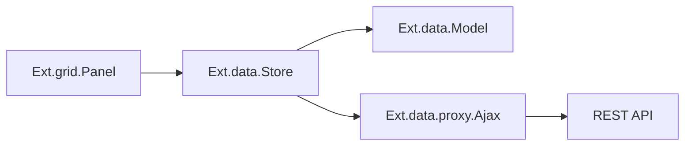

# Ext JS — Model, Store и proxy

---

## Идея

UI-компонент (грид, форма) **не хранит** данные внутри — он привязан к **Store**, который управляет коллекцией **Model**.



---

## Model

Описание полей и валидации:

```javascript
Ext.define('App.model.Task', {
  extend: 'Ext.data.Model',
  fields: [
    { name: 'id', type: 'int' },
    { name: 'title', type: 'string' },
    { name: 'status', type: 'string', defaultValue: 'todo' },
  ],
});
```

---

## Store

```javascript
Ext.create('Ext.data.Store', {
  model: 'App.model.Task',
  autoLoad: true,
  proxy: {
    type: 'ajax',
    url: '/api/tasks',
    reader: { type: 'json', rootProperty: 'data' },
    writer: { type: 'json', writeAllFields: true },
  },
});
```

| Метод | Действие |
|-------|----------|
| `load()` | загрузка с сервера |
| `sync()` | отправить изменения |
| `rejectChanges()` | откат правок |

Записи отслеживают состояние: новая, изменённая, удалённая.

---

## Proxy

| Тип | Назначение |
|-----|------------|
| `ajax` | HTTP JSON |
| `rest` | REST по соглашению |
| `memory` | тесты, прототипы |
| `localstorage` | офлайн-кэш |

Reader/Writer преобразуют ответ сервера в записи Model.

---

## Привязка к гриду

```javascript
Ext.create('Ext.grid.Panel', {
  store: taskStore,
  columns: [
    { text: 'ID', dataIndex: 'id' },
    { text: 'Заголовок', dataIndex: 'title', flex: 1 },
  ],
});
```

Изменение в store автоматически обновляет таблицу (MVVM).

---

## Практика с Node API

Тот же REST "Заметки", что в [262](../../1-runtime-node/262.md): настройте `url`, `rootProperty` и поля модели под ваш JSON.

---

## Связанные материалы

- [312.md](./312.md) — первый проект
- [31.md](./31.md) — архитектура MVC/MVVM
- [311.md](./311.md)
