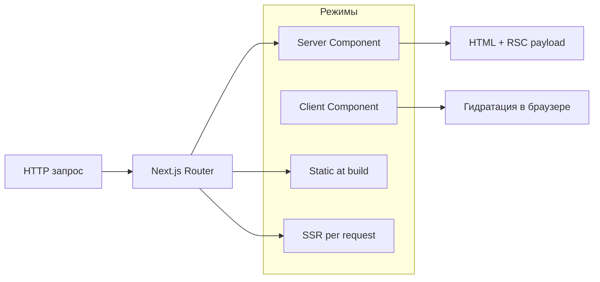

import ExternalCodeEmbed from '@site/src/components/ExternalCodeEmbed';


# Next.js

<div class="article-tags">
  <span class="tag tag-required">ОБЯЗАТЕЛЬНО</span>
  <span class="tag tag-beginner">ДЛЯ НОВИЧКОВ</span>
</div>

<span class="complexity-badge">Разработчику</span>
<span class="complexity-badge">Архитектору</span>

---

## Обзор платформы Next.js

Next.js — это самый популярный fullstack-метафреймворк, построенный поверх библиотеки React. Его создала и развивает компания Vercel. Если React предоставляет только «кирпичики» для создания интерфейса в браузере, то Next.js превращает его в полноценный инструмент для создания готовых к продакшену веб-сайтов, оптимизируя скорость загрузки, SEO и серверную логику.

Главные особенности:
- Серверный рендеринг (SSR / App Router). Next.js умеет генерировать HTML-страницы прямо на сервере в момент запроса. Это делает сайты молниеносными для пользователей и идеально понятными для поисковых роботов (SEO).
- Статическая генерация (SSG). Страницы (например, статьи в блоге) можно собрать один раз на этапе сборки проекта. Сервер будет отдавать их мгновенно, как обычные статичные файлы.
- Файловый роутинг (File-based Routing). Структура страниц сайта повторяет структуру папок в проекте. Папка `app/about/page.js` автоматически превратится в страницу `://yoursite.com`.
- Автоматическая оптимизация. Фреймворк сам сжимает изображения под размеры экранов, оптимизирует сторонние шрифты и скрипты, а также разделяет код на мелкие части (Code Splitting), чтобы браузер не скачивал лишнего.
- Серверные компоненты (React Server Components). Позволяют выполнять тяжелую логику и запросы к базе данных прямо на сервере, не отправляя этот код в браузер пользователя.
- API Routes. Прямо внутри Next.js можно писать серверный код (бэкенд) и создавать полноценные API-эндпоинты.

Обычный React (SPA) создает приложение, которое полностью собирается в браузере клиента. Для интернет-магазинов, СМИ, блогов или лендингов это критично: они будут медленно открываться на слабых телефонах и плохо индексироваться Яндексом и Google. Next.js решает эту проблему. Сегодня он является стандартом де-факто для коммерческой разработки на React. На нем работают такие гиганты, как TikTok, Twitch, Notion, Target и сам Vercel.

**Next.js** — фреймворк поверх [React](../2-frontend-frameworks/1-react/27.md). React отвечает за компоненты и состояние; Next добавляет **маршруты по файлам**, **рендеринг на сервере**, встроенные **API-маршруты** и удобный **деплой**.

Пошаговый старт с кодом: [Первая программа на Next.js](./2731.md). Сервер на Node: [Первая программа на Node.js](../1-runtime-node/262.md). Склейка фронта и API: [Fullstack на JavaScript — API и фронтенд](../1-runtime-node/264.md).

---

### Рекомендуемый порядок изучения

1. Пройти [первую программу на Next.js](./2731.md) и запустить проект.
2. Вернуться к разделам про режимы рендеринга и App Router на этой странице.
3. Закрепить мини-задачей с `route.ts` и одной client-страницей.
4. Связать фронт с внешним API по [fullstack-схеме](../1-runtime-node/264.md).
5. При необходимости уточнить React по [обзору](../2-frontend-frameworks/1-react/27.md).

---

### Мини-демо композиции домашней страницы

В Next.js тот же подход можно держать в `app/page.tsx`: страница остаётся короткой, а секции переиспользуются.


<ExternalCodeEmbed example="typescript/js-501-3-ecosystem-3-meta-frameworks-273-001" title="Мини-демо композиции домашней страницы" minHeight={570} />


Разбор:
- Импорты из `@/components/...` собирают страницу из переиспользуемых блоков.
- `HomePage` возвращает JSX-композицию с разделением на header, main и footer.
- Фрагмент `<>...</>` объединяет несколько корневых элементов без лишней обёртки.
- Такой подход сохраняет `page.tsx` компактным и масштабируемым.

Такой формат удобно масштабировать: команды могут работать над секциями параллельно, не перегружая `page.tsx`.

---

### React и Next — кто за что отвечает

| Задача | "Голый" React + Vite | Next.js |
|--------|----------------------|---------|
| Страница `/about`, `/blog/42` | Подключить react-router, настроить | Папка `app/about/page.tsx` → URL готов |
| Первый HTML для поисковиков | Пустая страница, пока не загрузится JS (CSR) | Сервер отдаёт HTML с текстом (SSR/SSG) |
| API рядом с UI | Отдельный Express на другом порту | `app/api/.../route.ts` |
| Деплой | Статика + отдельный бэкенд | Vercel, Node, Docker из коробки |

Next **дополняет** React — хуки `useState`, компоненты, props — те же. Сначала имеет смысл пройти [Первая программа на React](../2-frontend-frameworks/1-react/272.md), затем переносить компоненты в `app/`.

Файл `route.ts` в Next.js (начиная с версии 13+ в архитектуре App Router) используется для создания обработчиков маршрутов (Route Handlers), которые позволяют развернуть собственный полноценный API-эндпоинт прямо внутри вашего фронтенд-приложения. Они работают исключительно на стороне сервера и заменяют собой старую концепцию `api/` из Pages Router. С их помощью можно обрабатывать вебхуки, проксировать запросы к внешним бэкендам и скрывать секретные ключи.

Вы создаете файл route.ts (или route.js) внутри папки app. Путь к папке определяет URL-адрес эндпоинта:
```
app/
└── api/
    └── users/
        └── route.ts  --> доступен по адресу /api/users
```

Внутри файла вы экспортируете асинхронные функции, названия которых строго соответствуют HTTP-методам: `GET`, `POST`, `PUT`, `PATCH`, `DELETE`, `HEAD` или `OPTIONS`.

В качестве аргумента функции принимают стандартный веб-объект NextRequest, а возвращают NextResponse (надстройки над нативными Web API Request и Response):

```javascript
import { NextRequest, NextResponse } from 'next/server';

// Обработка GET-запроса (например, получение списка)
export async function GET(request: NextRequest) {
  const data = { message: "Привет из API Next.js!" };
  return NextResponse.json(data, { status: 200 });
}

// Обработка POST-запроса (например, создание записи)
export async function POST(request: NextRequest) {
  try {
    const body = await request.json(); // Чтение входящего JSON
    
    if (!body.name) {
      return NextResponse.json({ error: "Имя обязательно" }, { status: 400 });
    }

    return NextResponse.json({ success: true, user: body }, { status: 201 });
  } catch (error) {
    return NextResponse.json({ error: "Невалидный JSON" }, { status: 500 });
  }
}
```

Если вам нужно передавать параметры в URL (например, ID пользователя: /api/users/42), папка именуется в квадратных скобках: app/api/users/[id]/route.ts. Параметры считываются через второй аргумент функции:

```javascript
export async function GET(
  request: NextRequest,
  { params }: { params: Promise<{ id: string }> } // В свежих версиях Next.js params возвращает Promise
) {
  const { id } = await params;
  return NextResponse.json({ userId: id });
}
```

> Нельзя создавать `route.ts` и `page.tsx` в одной и той же папке (на одном уровне вложенности). Фреймворк не поймет, что нужно вернуть — веб-страницу или JSON-данные, и выдаст ошибку при сборке.

Запросы `GET` по умолчанию могут агрессивно кешироваться сервером Next.js, если внутри функции не используются динамические функции (чтение `cookies()`, заголовков `headers()` или параметров строки запроса `searchParams`). Чтобы принудительно отключить кеш, можно добавить строку конфигурации:

```javascript
export const dynamic = 'force-dynamic';
```

---

## App Router и Pages Router

В Next.js существует две параллельные архитектуры маршрутизации: Pages Router (старая, проверенная временем) и App Router (современная, используемая по умолчанию с версии 13). Главное отличие между ними — App Router построен на базе React Server Components (RSC), что кардинально меняет подход к производительности, загрузке данных и структуре проекта.

| | **App Router** (`app/`) | **Pages Router** (`pages/`) |
|---|-------------------------|-----------------------------|
| Статус | Рекомендуемый для новых проектов (Next 13+) | Поддерживается, много legacy-кода |
| Файлы страниц | `page.tsx`, оболочка `layout.tsx` | `pages/index.tsx`, `pages/about.tsx` |
| Серверные компоненты | По умолчанию сервер | Всё клиентское React |
| Загрузка данных | `async` Server Component + `fetch` | `getServerSideProps`, `getStaticProps` |

Материалы энциклопедии ориентируются на **App Router**.

Как это выглядит в Pages Router? Имя файла напрямую определяет URL-адрес. Компоненты интерфейса и логику приходится хранить отдельно, чтобы они не превратились в маршруты. 

```
pages/
├── index.tsx          --> Главная (/)
├── about.tsx          --> Страница (/about)
└── api/
    └── users.ts       --> API (/api/users)

```

Как это выглядит в App Router? Маршрут определяет папка, а внутри нее находятся файлы со строго зарезервированными именами (page.tsx, layout.tsx, loading.tsx). Это позволяет хранить стили, тесты и внутренние компоненты прямо в папке маршрута.

```
app/
├── layout.tsx         --> Глобальный лейаут (HTML, Body)
├── page.tsx           --> Главная (/)
├── about/
│   ├── page.tsx       --> Страница (/about)
│   └── button.tsx     --> Локальный компонент (не станет маршрутом!)
└── api/
    └── users/
        └── route.ts   --> API (/api/users)
```

В Pages Router громоздко - вам приходилось экспортировать специальные функции Next.js, которые выполнялись на сервере и передавали пропсы в клиентский компонент.

```javascript
// pages/products.tsx
export async function getServerSideProps() {
  const res = await fetch('https://example.com');
  const products = await res.json();
  return { props: { products } }; // Передача в компонент
}

export default function ProductsPage({ products }) {
  return <ul>{products.map(p => <li key={p.id}>{p.name}</li>)}</ul>;
}
```

В App Router просто и нативно, поскольку компоненты по умолчанию являются серверными, вы можете делать `fetch` прямо внутри функции компонента, сделав её асинхронной.

```typescript
// app/products/page.tsx
export default async function ProductsPage() {
  const res = await fetch('https://example.com');
  const products = await res.json(); // Выполняется прямо на сервере

  return <ul>{products.map(p => <li key={p.id}>{p.name}</li>)}</ul>;
}
```

В новых проектах однозначно выбирайте App Router. Это будущее Next.js. Он эффективнее утилизирует серверные ресурсы, уменьшает размер JS-бандла для пользователя и предлагает более гибкую архитектуру. Переводить огромные проекты на App Router сразу не нужно. Оба роутера могут сосуществовать в одном приложении одновременно. Вы можете постепенно создавать новые фичи в папке `app`, оставляя старые в pages.

---

## Режимы рендеринга в Next.js

| Режим | Когда HTML готов | Типичный случай |
|-------|------------------|-----------------|
| **CSR** (Client) | В браузере, после загрузки JS | Счётчик, форма с `'use client'` |
| **SSR** (Server) | На сервере при **каждом** запросе | Лента с актуальными данными |
| **SSG** (Static) | При **сборке** (`npm run build`) | Блог, документация, лендинг |
| **RSC** (Server Component) | На сервере; JS компонента в браузер часто не попадает | Список без интерактива |



Разбор:
- Диаграмма показывает, как запрос проходит через роутер Next и попадает в нужный режим рендеринга.
- Ветви `RSC`, `SSR` и `SSG` формируют HTML на серверной стороне.
- После получения HTML браузер выполняет гидратацию клиентских частей.
- Схема помогает понимать, где именно выполняется код: на сервере или в браузере.

- **Server Component** — файл **без** `'use client'`. Можно `await fetch(...)` в теле компонента. Нельзя `useState`, `onClick`.
- **Client Component** — первая строка `'use client'`. Как обычный React.
- **Гидратация** — браузер "оживляет" HTML: вешает обработчики на кнопки.

1. CSR (Client-Side Rendering) — Рендеринг на клиенте. Браузер скачивает пустой HTML-файл (обычно содержащий только <div id="root"></div>) и огромный JavaScript-бандл. JS запускается в браузере, запрашивает данные из API и сам строит интерфейс. HTML собирается на устройстве пользователя. Плюсы: Плавные переходы между страницами без перезагрузки (ощущение нативного приложения). Легко деплоить (просто статические JS/HTML файлы). Минусы: Долгая первая загрузка («белый экран»), пока качается JS. Плохо для SEO, так как поисковые роботы могут увидеть пустую страницу.
2. SSR (Server-Side Rendering) — Рендеринг на сервере. При каждом клике пользователя сервер принимает запрос, запрашивает данные из базы, собирает готовый HTML-файл и отправляет его обратно в браузер. Затем запускается процесс гидратации (hydration) — JS «оживляет» готовую страницу, делая кнопки кликабельными. HTML генерируется на сервере «на лету» при каждом посещении. Плюсы: Отличное SEO (робот сразу видит текст). Быстрое отображение контента для пользователя на слабом устройстве. Минусы: Нагрузка на сервер (ему нужно рендерить страницы для каждого юзера). Каждая смена страницы может требовать времени на ответ сервера.
3. SSG (Static Site Generation) — Генерация статического сайта. Все страницы вашего сайта генерируются в виде готовых HTML/CSS файлов один раз — в момент запуска команды сборки приложения (`npm run build`). Серверу остается только раздавать эти файлы. HTML создается заранее и раздается через CDN. Плюсы: Невероятная скорость загрузки. Серверу не нужно производить вычисления, страницы отдаются мгновенно. Стойкость к высоким нагрузкам. Минусы: Если данные изменились (например, опечатка в блоге), сайт нужно пересобирать целиком. Не подходит для динамического контента.
4. RSC (React Server Components) — Серверные компоненты React. Это новая парадигма (основа App Router в Next.js). Архитектура разделяет компоненты на Серверные (RSC) и Клиентские (Client Components).Серверные компоненты выполняются строго на сервере. Они не отправляют свой JavaScript в браузер вообще — они передают только готовый результат в специальном JSON-подобном формате данных, который React на клиенте встраивает в интерфейс без потери состояния. Часть компонентов рендерится на сервере (без отправки кода в браузер), часть — на клиенте. Плюсы: Размер JavaScript-бандла для пользователя драматически снижается. Прямой доступ к базам данных и секретным ключам прямо из компонента. Минусы: Требует изменения мышления при разработке. В RSC нельзя использовать привычные хуки (`useState`, `useEffect`) или события (`onClick`) — для этого их нужно явно помечать директивой `use client`.

Современный Next.js (App Router) позволяет вам использовать все режимы одновременно в рамках одного приложения:
- Шапка и подвал сайта могут быть SSG (статичными)
- Основной контент страницы (например, статья) рендерится как RSC на сервере
- Блок комментариев под статьей помечен как 'use client' и работает по принципу CSR/SSR, обновляясь динамически.

---

## Структура проекта (App Router)

```
my-app/
  app/
    layout.tsx      # общий каркас
    page.tsx        # /
    about/
      page.tsx      # /about
    api/
      hello/
        route.ts    # GET /api/hello
  public/           # статика
  next.config.ts
  package.json
```

Разбор:
- `app/` содержит маршруты, страницы и API-обработчики App Router.
- `layout.tsx` задаёт общий каркас, который переиспользуется между страницами.
- `api/.../route.ts` описывает серверные HTTP-endpoint'ы рядом с UI.
- `public/` хранит статические файлы, а `next.config.ts` отвечает за проектные настройки.

| Файл | Роль |
|------|------|
| `layout.tsx` | Общая рамка; при переходах между страницами **остаётся** |
| `page.tsx` | Уникальное содержимое маршрута |
| `route.ts` | HTTP API, не React-страница |

---

## Route Handlers — API внутри Next

```typescript
// app/api/notes/route.ts

import { NextResponse } from 'next/server';

export async function GET() {
  return NextResponse.json([{ id: 1, text: 'demo' }]);
}

export async function POST(request: Request) {
  const body = await request.json();
  return NextResponse.json(body, { status: 201 });
}
```

Разбор:
- Экспорт `GET` и `POST` создаёт два обработчика одного и того же URL.
- `NextResponse.json(...)` сериализует данные в JSON и выставляет корректные заголовки ответа.
- `await request.json()` читает тело POST-запроса как объект.
- `status: 201` явно сообщает клиенту, что ресурс успешно создан.

Отдельный [Express 262](../1-runtime-node/262.md) нужен, когда API — отдельный сервис, своя БД, другая команда. Route Handler удобен для BFF: проксировать на внутренний API, спрятать ключи.

---

## Экосистема

| Инструмент | Роль |
|------------|------|
| **Turbopack** | Быстрая пересборка в dev |
| **next/image** | Оптимизация изображений |
| **next/font** | Шрифты без скачка вёрстки |
| **Middleware** | `middleware.ts` — auth, редиректы, i18n до рендера |

---

## Когда достаточно React без Next

- Виджет внутри чужого сайта (один bundle).
- Внутреннее SPA за VPN, SEO не важен.
- Мобильное приложение — [React Native](/encyclopedia/4-code-dev/4-12-mobilnye-prilozheniya/1131).

Когда нужны SEO, много страниц и один репозиторий — Next типичный выбор.

---

### Частые вопросы

| Вопрос | Ответ |
|--------|--------|
| Next заменяет Node? | Next **использует** Node для сервера; Express можно держать отдельно |
| Обязателен TypeScript? | Нет, но в новых проектах его выбирают в мастере |
| Порт 3000 занят API | Сдвиньте API на 3001 — см. [Fullstack на JavaScript — API и фронтенд](../1-runtime-node/264.md) |

---

## Связанные материалы

- [Первая программа на Next.js](./2731.md)
- [Первая программа на React](../2-frontend-frameworks/1-react/272.md)
- [Fullstack — API и фронт](../1-runtime-node/264.md)
- [TypeScript](../../30.md)
- [Тестирование — Vitest](../../33.md)

---

{/* http-basics-link  */}
<div class="callout callout--tip">
  <div class="callout-title">Основа по протоколу</div>

  <div class="callout-body">
  Базовый разбор HTTP и HTTPS находится в отдельной статье — [HTTP как основа веб-интеграций](/encyclopedia/2-system-network/2-09-osnovy-integratsionnogo-vzaimodeystviya/118).
</div>
  </div>


