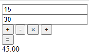

# Практика

<div class="article-tags">
  <span class="tag tag-required">ОБЯЗАТЕЛЬНО</span>
  <span class="tag tag-beginner">ДЛЯ НОВИЧКОВ</span>
</div>

<span class="complexity-badge">Разработчику</span>
<span class="complexity-badge">Архитектору</span>

---

## Практика

### Продолжаем работу с калькулятором

<div class="callout callout--tip">
  <div class="callout-title">Практическое задание</div>
Выполните нижеуказанное задание.
</div>


Настало время небольшой практики. Вернёмся к нашему проекту - калькулятор на HTML, и в файле script.js реализуем логику калькулятора:
	- создайте новый файл script.js;
	- получите элементы из DOM-дерева и определите их как переменные (или константы);
	- добавьте обработку кнопок через цикл - сделайте проверку на текст кнопки;
	- добавьте переменные (или константы) a и b для чисел-операндов;
	- не забудьте добавить проверку деления на 0.

Добавьте в HTML связь со скриптом:

```HTML
<script src="script.js"></script>
```

Вот пример простейшего скрипта для нас:
```javascript
const num1 = document.getElementById('num1');
const num2 = document.getElementById('num2');
const result = document.getElementById('result');
const error = document.getElementById('error');
const buttons = document.querySelectorAll('.buttons button');
const equals = document.querySelector('.equals');

let operation = null;

buttons.forEach(button => {
  button.addEventListener('click', () => {
    operation = button.textContent;
  });
});

equals.addEventListener('click', () => {
  const a = Number(num1.value);
  const b = Number(num2.value);
  
  if (!operation) {
    error.textContent = 'Выберите операцию';
    return;
  }

  let res;
  switch(operation) {
    case '+': res = a + b; break;
    case '-': res = a - b; break;
    case '×': res = a * b; break;
    case '÷': res = b !== 0 ? a / b : 'Ошибка';
  }

  result.textContent = res === 'Ошибка' ? res : res.toFixed(2);
  error.textContent = res === 'Ошибка' ? 'Деление на ноль' : '';
});

```


Итоговая логика будет такая:
1) указывается первое и второе число (операнды);
2) выбирается операция;
3) запрашивается результат;
4) выполняется вычисление и результат выводится:




Можете разбавить проект своей дополнительной логикой и вычислениями.

---

## Полезные JavaScript-сниппеты для повседневной практики

Ниже приведена подборка универсальных и часто используемых фрагментов кода на JavaScript. Эти сниппеты подходят как для начинающих, так и для опытных разработчиков. 

---

### Получение параметров из URL

```javascript
const urlParams = new URLSearchParams(window.location.search);
const userId = urlParams.get('user_id');
const theme = urlParams.get('theme') || 'light';
```

Этот код извлекает значения GET-параметров из адресной строки. Если параметр отсутствует, можно задать значение по умолчанию.

---

### Проверка типа данных

```javascript
function isString(value) {
  return typeof value === 'string';
}

function isArray(value) {
  return Array.isArray(value);
}

function isObject(value) {
  return value !== null && typeof value === 'object' && !Array.isArray(value);
}

function isFunction(value) {
  return typeof value === 'function';
}
```

Такие функции помогают безопасно определять тип переменной перед выполнением операций.

---

### Проверка на `null` и `undefined`

```javascript
function isNullish(value) {
  return value === null || value === undefined;
}

// Или с использованием оператора нулевого слияния (для значений по умолчанию)
const name = inputName ?? 'Гость';
```

Полезно при валидации входных данных или конфигураций.

---

### Генерация уникального ID

```javascript
function generateId() {
  return Date.now().toString(36) + Math.random().toString(36).substring(2);
}
```

Простой способ создать уникальную строку без использования сторонних библиотек. Подходит для временных идентификаторов.

---

### Создание DOM-элемента

```javascript
function createElement(tag, attributes = {}, children = []) {
  const element = document.createElement(tag);
  Object.entries(attributes).forEach(([key, value]) => {
    element.setAttribute(key, value);
  });
  children.forEach(child => {
    if (typeof child === 'string') {
      element.appendChild(document.createTextNode(child));
    } else {
      element.appendChild(child);
    }
  });
  return element;
}

// Пример использования:
const button = createElement('button', { class: 'btn primary' }, ['Нажми меня']);
document.body.appendChild(button);
```

Упрощает динамическое создание интерфейсов без шаблонных строк.

---

### Копирование текста в буфер обмена

```javascript
async function copyToClipboard(text) {
  try {
    await navigator.clipboard.writeText(text);
    console.log('Скопировано в буфер обмена');
  } catch (err) {
    console.error('Не удалось скопировать:', err);
  }
}
```

Современный способ копирования, работающий в большинстве браузеров. Требует HTTPS или локального хоста.

На мобильных для сценария «отправить ссылку другу» удобнее [Web Share API](./44.md) — системное окно «Поделиться» вместо ручной вставки из буфера.

---

### Ожидание (задержка)

```javascript
function wait(ms) {
  return new Promise(resolve => setTimeout(resolve, ms));
}

// Пример использования:
await wait(1000); // Пауза на 1 секунду
```

Полезно при имитации загрузки, анимациях или тестировании асинхронных операций. В React между шагами `yield` на кнопке — [45.md](./45.md).

---

### Форматирование даты

```javascript
function formatDate(date, locale = 'ru-RU') {
  return new Intl.DateTimeFormat(locale, {
    year: 'numeric',
    month: 'long',
    day: 'numeric',
    hour: '2-digit',
    minute: '2-digit'
  }).format(date);
}

// Пример:
console.log(formatDate(new Date())); // "18 марта 2026 г., 14:30"
```

Использует встроенный API `Intl` для локализованного формата без внешних зависимостей.

---

### Работа с массивами — создание списков

```javascript
// Создание списка чисел от start до end
function range(start, end) {
  return Array.from({ length: end - start + 1 }, (_, i) => start + i);
}

// Пример:
console.log(range(1, 5)); // [1, 2, 3, 4, 5]
```

Удобно для генерации тестовых данных или заполнения выпадающих списков.

---

### Создание объекта из пар ключ-значение

```javascript
function createObject(keys, values) {
  const obj = {};
  keys.forEach((key, index) => {
    obj[key] = values[index];
  });
  return obj;
}

// Или через Object.fromEntries:
const obj = Object.fromEntries([
  ['name', 'Алиса'],
  ['age', 30]
]);
```

Полезно при преобразовании данных из форм или API-ответов.

---

### Работа с промисами — выполнение всех или любого

```javascript
// Все промисы должны завершиться успешно
Promise.all([fetch('/api/user'), fetch('/api/profile')])
  .then(responses => Promise.all(responses.map(r => r.json())))
  .then(data => console.log(data));

// Достаточно одного успешного
Promise.any([fetch('/mirror1/data'), fetch('/mirror2/data')])
  .then(response => response.json())
  .then(data => console.log('Получено:', data));
```

`Promise.all` — для строгой последовательности, `Promise.any` — для отказоустойчивых запросов.

---

### Подключение внешнего API и SDK

Когда базовых возможностей страницы мало, проект расширяют двумя путями:

- подключают внешний HTTP API через `fetch` или `axios`;
- подключают SDK/библиотеку через `npm` (карты, auth, аналитика, платежи).

Базовый каркас API-клиента:

```javascript
const API_BASE_URL = 'https://api.example.com';

async function apiRequest(path, options = {}) {
  const response = await fetch(`${API_BASE_URL}${path}`, {
    method: options.method ?? 'GET',
    headers: {
      'Content-Type': 'application/json',
      ...(options.headers ?? {}),
    },
    body: options.body ? JSON.stringify(options.body) : undefined,
  });

  if (!response.ok) {
    throw new Error(`HTTP ${response.status} for ${path}`);
  }

  return response.json();
}

async function loadProfile() {
  return apiRequest('/profile');
}
```

Почему такой подход удобен:

- единая точка обработки ошибок;
- единый формат заголовков и сериализации JSON;
- проще добавить токен, retry, таймаут и логирование.

Подключение SDK через npm:

```bash
npm install axios
```

```javascript
import axios from 'axios';

async function loadUsers() {
  const { data } = await axios.get('https://api.example.com/users');
  return data;
}
```

Практические правила интеграции API:

- ключи доступа держите на backend или в защищённых переменных окружения сборки;
- в клиенте сохраняйте только публичные идентификаторы;
- добавляйте `try/catch` и показывайте пользователю понятный fallback-текст;
- выносите все запросы в модуль `api/*`, а не размазывайте `fetch` по компонентам.

Минимальный пример слоя API по файлам:

```text
src/
  api/
    http.js
    users.js
    posts.js
```

Это упрощает тестирование и ускоряет рефакторинг, когда меняется хост, auth или формат ответов.

---

### Циклы — итерация по объекту

```javascript
const user = { name: 'Борис', age: 28, city: 'Казань' };

// Только собственные перечисляемые свойства
for (const key in user) {
  if (Object.hasOwn(user, key)) {
    console.log(`${key}: ${user[key]}`);
  }
}

// Или через Object.entries:
Object.entries(user).forEach(([key, value]) => {
  console.log(`${key}: ${value}`);
});
```

Безопасный способ обхода объектов без наследуемых свойств.

---

### Тестирование — простая функция assert

```javascript
function assert(condition, message = 'Assertion failed') {
  if (!condition) {
    throw new Error(message);
  }
}

// Пример:
assert(typeof calculate(2, 3) === 'number', 'calculate должен возвращать число');
```

Минималистичная замена полноценным тестовым фреймворкам для быстрой проверки логики.

---

### Обработка ошибок в асинхронных функциях

```javascript
async function safeFetch(url) {
  try {
    const response = await fetch(url);
    if (!response.ok) throw new Error(`HTTP ${response.status}`);
    return await response.json();
  } catch (error) {
    console.error('Ошибка запроса:', error.message);
    return null;
  }
}
```

Обеспечивает устойчивость к сетевым сбоям и некорректным ответам сервера.

---

### Полезные методы `console` для отладки

```javascript
function Person(firstName, lastName, age) {
  this.firstName = firstName;
  this.lastName = lastName;
  this.age = age;
}

const users = [
  new Person('John', 'Smith', 28),
  new Person('Jane', 'Doe', 31),
  new Person('Marko', 'Denic', 26)
];

console.log('Обычный лог');
console.info('Информационное сообщение');
console.warn('Предупреждение: поле age скоро станет обязательным');
console.error('Ошибка: не удалось загрузить профиль');

console.table(users);
console.table(users, ['firstName', 'age']); // только нужные колонки

console.group('Проверка пользователя');
console.log('id:', 42);
console.log('role:', 'admin');
console.groupEnd();

console.time('fetchUsers');
// ... тут любой код / await fetch(...)
console.timeEnd('fetchUsers'); // fetchUsers: 12.37ms

const isEmailValid = false;
console.assert(isEmailValid, 'Email должен быть валидным');
```

Что удобно использовать чаще всего:
- `console.log()` — базовый вывод любых данных.
- `console.info()` — информационные сообщения.
- `console.warn()` — предупреждения (обычно подсвечиваются жёлтым).
- `console.error()` — ошибки (обычно подсвечиваются красным, со стеком).
- `console.table()` — массивы объектов в табличном виде.
- `console.group()` / `console.groupEnd()` — группировка логов по шагам.
- `console.time()` / `console.timeEnd()` — замер времени участка кода.
- `console.assert()` — вывод ошибки только если условие ложно.

Пример вывода в консоли:

```text
Обычный лог
Информационное сообщение
Предупреждение: поле age скоро станет обязательным
Ошибка: не удалось загрузить профиль

console.table(users)
┌─────────┬───────────┬──────────┬─────┐
│ (index) │ firstName │ lastName │ age │
├─────────┼───────────┼──────────┼─────┤
│    0    │  John     │ Smith    │ 28  │
│    1    │  Jane     │ Doe      │ 31  │
│    2    │  Marko    │ Denic    │ 26  │
└─────────┴───────────┴──────────┴─────┘

Проверка пользователя
  id: 42
  role: admin
fetchUsers: 12.37ms
Assertion failed: Email должен быть валидным
```

---
---

<!-- http-basics-link -->
:::tip Основа по протоколу
Базовый разбор HTTP и HTTPS находится в отдельной статье — [HTTP как основа веб-интеграций](/encyclopedia/2-system-network/2-09-osnovy-integratsionnogo-vzaimodeystviya/118).
:::

