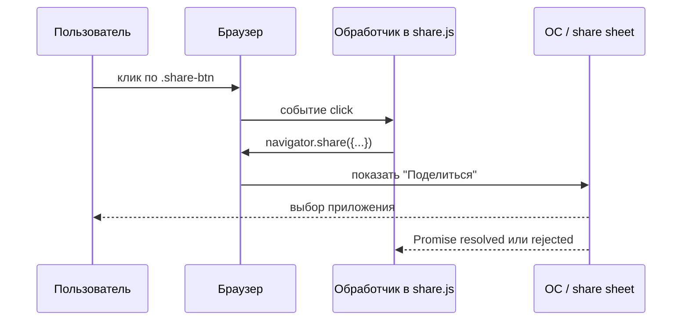

# Кнопка "Поделиться" — DOM, события и Web Share API

<div class="article-tags">
  <span class="tag tag-required">ОБЯЗАТЕЛЬНО</span>
  <span class="tag tag-beginner">ДЛЯ НОВИЧКОВ</span>
</div>

<span class="complexity-badge">Разработчику</span>

**См. также:** [События](./23.md) · [Асинхронность](./21.md) · [Работа с HTML (DOM)](./102.md) · [BOM и `navigator`](./41.md) · [Копирование в буфер](./32.md#копирование-текста-в-буфер-обмена)

---

## Задача

На странице есть кнопка "Поделиться". По клику пользователь должен отправить ссылку на текущую статью в мессенджер, почту или заметки — **через привычное системное меню**, как в мобильном браузере или в нативном приложении.

Для этого в современных браузерах есть **Web Share API**: метод `navigator.share()`. Скрипт не рисует своё окно со списком приложений — он передаёт данные операционной системе, а ОС показывает **лист "Поделиться"** (share sheet).

Ниже разберём учебный файл `share.js` построчно: от поиска кнопки в DOM до вызова API.

---

## Плавный старт — почему пользователи любят этот сценарий

Кнопка "Поделиться" сокращает путь до действия в один клик. Пользователь остаётся в привычной системе: выбирает мессенджер, почту или заметки в нативном окне платформы.

Для разработчика это компактная интеграция: один обработчик `click`, один вызов `navigator.share`, плюс fallback для окружений без поддержки API.

---

## Мини-кейс "до/после"

| Подход | Что видит пользователь |
|--------|------------------------|
| До | нужно копировать URL вручную и переключаться между приложениями |
| После | ссылка уходит через системный share-sheet за несколько секунд |

---

## Разметка страницы

Сначала в HTML должна быть кнопка с классом, по которому скрипт её найдёт:

```html
<button type="button" class="share-btn">Поделиться</button>
<script src="share.js"></script>
```

Скрипт подключают **после** кнопки (или с атрибутом `defer` у `<script src="share.js">`), чтобы к моменту выполнения `share.js` элемент уже существовал в DOM. Подробнее о порядке загрузки — в [работе с HTML](./102.md).

| Часть | Роль |
|-------|------|
| `type="button"` | кнопка не отправляет форму случайно |
| `class="share-btn"` | метка для CSS и для `querySelector` |
| `share.js` | логика клика и вызов `navigator.share` |

---

## `document.querySelector` — найти элемент на странице

**DOM** (Document Object Model) — дерево узлов HTML: теги, текст, атрибуты. JavaScript читает и меняет это дерево через объект `document`.

**`document.querySelector('.share-btn')`** ищет **первый** элемент, подходящий под CSS-селектор:

| Селектор в примере | Что ищет |
|--------------------|----------|
| `.share-btn` | любой элемент с классом `share-btn` |
| `#id` | элемент с заданным `id` |
| `button.share-btn` | именно `<button class="share-btn">` |

Результат сохраняют в константу:

```javascript
const btn = document.querySelector('.share-btn');
```

- Если элемент найден — в `btn` лежит ссылка на узел DOM (можно вешать обработчики, менять текст).
- Если нет — `btn === null`. Вызов `btn.addEventListener` тогда упадёт с ошибкой; в продакшене добавляют проверку `if (!btn) return;`.

**`querySelectorAll`** возвращает список всех совпадений — когда кнопок несколько. Для одной кнопки "Поделиться" достаточно `querySelector`.

Сравнение с `getElementById` и практика кэширования ссылок — в [справочнике по DOM](./102.md) и [работе с HTML](./102.md#метод-queryselector).

---

## Система событий в браузере

**Событие** — сигнал о том, что что-то произошло: пользователь **кликнул**, нажал клавишу, прокрутил страницу, сеть вернула ответ. Браузер создаёт объект **`Event`** (для клика — **`MouseEvent`**) и запускает цепочку обработчиков.

Упрощённая схема для клика по кнопке:



Три идеи, которые пригодятся дальше:

1. **Источник события** — обычно конкретный DOM-элемент (`btn`), а не весь `document`.
2. **Обработчик** — функция, которую браузер вызывает, когда событие дошло до элемента.
3. **Очередь задач** — обработчик клика попадает в [очередь макрозадач](./21.md); тяжёлая работа внутри него без `await` может подвиснуть интерфейс. `navigator.share()` асинхронный — его как раз ждут через `await`.

Полный список типов событий, фазы capture/bubble, `stopPropagation` и делегирование — в статье [События](./23.md#распространение-событий--всплытие-перехват-и-делегирование).

---

## `addEventListener` — подписаться на клик

Чтобы выполнить код **после** клика, регистрируют **слушатель** (обработчик):

```javascript
btn.addEventListener('click', async () => {
  // тело обработчика
});
```

| Аргумент | Значение |
|----------|----------|
| `'click'` | тип события (щелчок основной кнопкой мыши или активация с клавиатуры) |
| `async () => { ... }` | функция, которую вызовут при клике |

**`addEventListener`** лучше старого атрибута `onclick="..."` в HTML:

- можно повесить **несколько** обработчиков на одну кнопку;
- проще отписаться через `removeEventListener`;
- разметка остаётся без встроенного JS (удобнее CSP и тестам).

Обработчик можно записать и именованной функцией:

```javascript
async function onShareClick() {
  await navigator.share({ /* ... */ });
}
btn.addEventListener('click', onShareClick);
```

Для учебного примера достаточно стрелочной функции прямо в вызове.

---

## Зачем `async` и `await`

**`navigator.share()`** возвращает **Promise** — "обещание" завершить операцию позже:

- пользователь выбрал приложение и отправил ссылку → Promise **выполнен** (fulfilled);
- пользователь закрыл окно без отправки → Promise **отклонён** (rejected, часто `AbortError`);
- API недоступен → rejected с другой ошибкой.

Пока Promise в ожидании, **главный поток** JavaScript свободен: страница продолжает реагировать на прокрутку и другие клики. Подробнее про Event Loop — в [асинхронности](./21.md).

**`async`** перед функцией разрешает **`await`** внутри:

```javascript
btn.addEventListener('click', async () => {
  await navigator.share({ title: '...', url: '...' });
  console.log('Пользователь закончил диалог "Поделиться"');
});
```

| Ключевое слово | Роль |
|----------------|------|
| `async` | функция всегда возвращает Promise; внутри можно `await` |
| `await` | приостановить **эту** async-функцию, пока Promise не завершится |

Без `await` код пошёл бы дальше **сразу**, не дожидаясь закрытия системного окна:

```javascript
// так делать не нужно для share
navigator.share({ url: location.href });
console.log('эта строка выполнится до выбора приложения');
```

Для `share` почти всегда пишут `await` и оборачивают вызов в `try/catch`, чтобы обработать отмену пользователем.

---

## Что такое "шаринг" и Web Share API

**Шаринг** (от англ. *share* — "поделиться") — передача **заголовка, текста и URL** из веб-страницы во внешнее приложение: Telegram, WhatsApp, почта, "Заметки" и т.д.

**Web Share API** — часть [объекта `navigator`](./41.md):

```javascript
await navigator.share({
  title: document.title,
  text: 'Посмотри эту статью',
  url: location.href,
});
```

| Поле | Откуда в примере | Что попадёт в системное окно |
|------|------------------|------------------------------|
| `title` | `document.title` | заголовок вкладки (`<title>` в HTML) |
| `text` | строка в коде | короткое сообщение рядом со ссылкой |
| `url` | `location.href` | полный адрес страницы (схема, хост, путь, query) |

Браузер **не гарантирует**, что все три поля покажет каждое приложение в списке: мессенджер может взять только `url`, почта — `title` + `text`. Передавать имеет смысл всё, что помогает пользователю.

**Системное окно "Поделиться"** (share sheet) рисует **ОС или оболочка браузера**, не ваш CSS. На Android и iOS это привычная сетка иконок приложений; на десктопе в Chrome/Edge — компактное меню "Поделиться" или интеграция с установленными PWA.

Скрипт **не знает**, какое приложение выберут — только ждёт результат Promise.

---

## Полный пример `share.js` с пояснениями

```javascript
// 1. Найти кнопку в DOM (один раз при загрузке скрипта)
const btn = document.querySelector('.share-btn');

// 2. На клик — асинхронно открыть системный диалог "Поделиться"
btn.addEventListener('click', async () => {
  try {
    await navigator.share({
      title: document.title,
      text: 'Check this out',
      url: location.href,
    });
  } catch (err) {
    // Пользователь закрыл окно — не ошибка разработки
    if (err.name !== 'AbortError') {
      console.error('Share failed:', err);
    }
  }
});
```

Пошагово:

1. **`const btn`** — ссылка на кнопку сохраняется при загрузке; при каждом клике заново искать элемент не нужно.
2. **`addEventListener('click', ...)`** — браузер вызовет функцию только после действия пользователя (важно для политики безопасности: `share` из произвольного таймера без жеста часто запрещён).
3. **`async () => { ... }`** — обработчик может `await` Promise от `share`.
4. **`navigator.share({ ... })`** — передача данных в нативный UI.
5. **`document.title`** и **`location.href`** — встроенные свойства [BOM](./41.md): документ и текущий URL без ручной склейки строк.
6. **`try/catch`** — отмена диалога даёт `AbortError`; её обычно игнорируют, остальные ошибки логируют.

Тот же сценарий с проверкой поддержки API и запасным вариантом (копирование ссылки):

```javascript
const btn = document.querySelector('.share-btn');
if (!btn) return;

btn.addEventListener('click', async () => {
  const payload = {
    title: document.title,
    text: 'Посмотри эту статью',
    url: location.href,
  };

  if (navigator.share) {
    try {
      await navigator.share(payload);
    } catch (err) {
      if (err.name !== 'AbortError') console.error(err);
    }
    return;
  }

  // Запасной путь: десктоп без Web Share — копируем URL
  try {
    await navigator.clipboard.writeText(payload.url);
    alert('Ссылка скопирована в буфер обмена');
  } catch {
    prompt('Скопируйте ссылку:', payload.url);
  }
});
```

См. также сниппет [копирования в буфер](./32.md#копирование-текста-в-буфер-обмена).

---

## Условия и ограничения

| Условие | Почему важно |
|---------|----------------|
| **HTTPS** (или `localhost`) | `navigator.share` и `clipboard` — [защищённые контексты](https://developer.mozilla.org/en-US/docs/Web/Security/Secure_Contexts) |
| **Поддержка браузера** | проверка `'share' in navigator` |
| **Жест пользователя** | вызов из обработчика `click` / `touch` |
| **Десктоп** | Web Share есть в Chromium; в Firefox на Windows/macOS может не быть — нужен fallback |
| **Файлы** | `navigator.share({ files: [file] })` — отдельное расширение API; в учебном примере только текст и URL |

**`navigator.canShare?.(data)`** (если есть) позволяет заранее проверить, примет ли система конкретный набор полей, и не показывать неработающую кнопку.

---

## Web Share и буфер обмена

| Задача | API | Кто выбирает приложение |
|--------|-----|-------------------------|
| Скопировать ссылку в буфер | `navigator.clipboard.writeText` | пользователь сам вставляет (Ctrl+V) |
| Открыть меню "Поделиться" | `navigator.share` | пользователь в системном списке |

Оба метода живут у **`navigator`**, асинхронны и удобны с `async/await`. Share лучше подходит для мобильных сценариев "отправить другу"; clipboard — универсальный запасной путь на десктопе.

---

## Связь с другими темами раздела

| Тема | Где углубиться |
|------|----------------|
| Поиск элементов, изменение DOM | [102.md](./102.md), [34.md](./34.md) |
| События, делегирование | [23.md](./23.md) |
| Promise, Event Loop, `async/await` | [21.md](./21.md) |
| `LoadingButton`, `isLoading` в React | [45.md](./45.md) |
| `window`, `location`, `navigator` | [41.md](./41.md) |
| ES-модули (`type="module"`) | [40.md](./40.md) |

---

## Практика UX для кнопки "Поделиться"

- Показ кнопки стоит привязывать к проверке `navigator.share`, чтобы интерфейс сразу отражал возможности платформы.
- Для десктопа полезен fallback "Скопировать ссылку".
- Для статей и карточек контента эффективнее передавать короткий `text`, понятный без контекста.
- В аналитике фиксируют только факт открытия сценария share и итог (успех/отмена), без персональных данных.

Небольшие UX-детали делают кнопку реально полезной, а не декоративной.

---

## Готовый чек-лист перед релизом

| Проверка | Почему важно |
|----------|--------------|
| Кнопка работает на HTTPS | API доступен только в безопасном контексте |
| Есть обработка `AbortError` | отмена пользователем выглядит штатно |
| Есть fallback на clipboard | сценарий покрыт для браузеров без Web Share |
| Текст и заголовок не пустые | ссылки отправляются с понятным контекстом |
| Поведение протестировано на мобильном браузере | основной сценарий share проходит через телефон |

---

## Краткий итог

1. **`querySelector('.share-btn')`** находит кнопку в DOM.
2. **`addEventListener('click', ...)`** запускает код по действию пользователя.
3. **`async` / `await`** дожидаются завершения **`navigator.share()`** без блокировки страницы.
4. **Web Share API** передаёт `title`, `text` и `url` в **системное окно "Поделиться"**; выбор приложения остаётся за пользователем и ОС.
5. Проверяйте поддержку API, обрабатывайте `AbortError` и держите запасной вариант (буфер обмена или `prompt` с URL).

---
---

{/* http-basics-link  */}
<div class="callout callout--tip">
  <div class="callout-title">Основа по протоколу</div>
  Базовый разбор HTTP и HTTPS находится в отдельной статье — [HTTP как основа веб-интеграций](/encyclopedia/2-system-network/2-09-osnovy-integratsionnogo-vzaimodeystviya/118).
</div>

