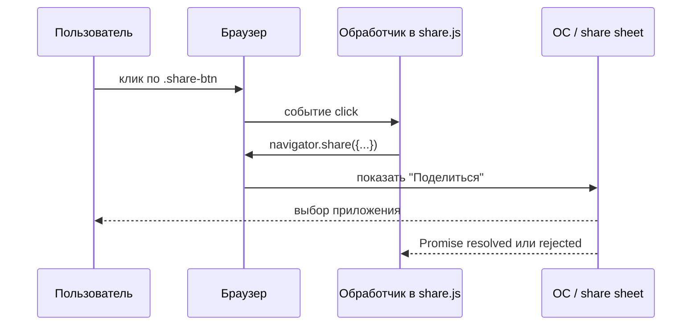

import ExternalCodeEmbed from '@site/src/components/ExternalCodeEmbed';


# Кнопка "Поделиться" — DOM, события и Web Share API

<div class="article-tags">
  <span class="tag tag-required">ОБЯЗАТЕЛЬНО</span>
  <span class="tag tag-beginner">ДЛЯ НОВИЧКОВ</span>
</div>

<span class="complexity-badge">Разработчику</span>

Кнопка "Поделиться" — это стандартный пользовательский интерфейсный элемент, который часто встречается на веб-страницах, в мобильных приложениях и десктопных программах, и который при нажатии открывает диалоговое окно или меню, позволяющее пользователю отправить ссылку, текст, изображение или другой контент через различные каналы связи, включая социальные сети, мессенджеры, электронную почту, SMS или другие установленные на устройстве приложения. Эта кнопка стала неотъемлемой частью современного интернета, поскольку она облегчает распространение контента и повышает вовлеченность пользователей, позволяя им мгновенно делиться интересными статьями, видео, продуктами или любыми другими данными со своей социальной сетью, друзьями или коллегами. В веб-разработке кнопка "Поделиться" может быть реализована двумя основными способами: через встроенный нативный диалог операционной системы или браузера с использованием Web Share API, либо через кастомные реализации, которые открывают попап-окна с предварительно заполненными URL-адресами социальных сетей, такими как Facebook, Twitter, LinkedIn или VKontakte. Нативные кнопки "Поделиться" предпочтительны для мобильных устройств, где они интегрируются с системными приложениями и предоставляют пользователю знакомый интерфейс с его любимыми способами обмена, в то время как кастомные кнопки дают разработчику больше контроля над внешним видом и поведением, но требуют ручного управления для каждой социальной сети. Вне зависимости от реализации, эффективная кнопка "Поделиться" должна быть заметной, интуитивно понятной и предоставлять обратную связь пользователю, сообщая об успешном завершении операции или о возникшей ошибке, что повышает удобство использования и доверие к приложению. В современной практике часто используются комбинированные подходы, когда на десктопе отображаются иконки популярных социальных сетей, а на мобильных устройствах используется нативное меню "Поделиться", что обеспечивает оптимальный пользовательский опыт на всех платформах.

**См. также:** [События](./23.md) · [Асинхронность](./21.md) · [Работа с HTML (DOM)](./102.md) · [BOM и `navigator`](./41.md) · [Копирование в буфер](./32.md#копирование-текста-в-буфер-обмена) · [Canvas 2D](./47.md) · [Web API в браузере](/encyclopedia/2-system-network/2-04-kak-rabotayut-sayty-i-veb-sayty/120) · [Web API на практике - примеры кода](/encyclopedia/2-system-network/2-04-kak-rabotayut-sayty-i-veb-sayty/121)

---

## Задача

На странице есть кнопка "Поделиться". По клику пользователь должен отправить ссылку на текущую статью в мессенджер, почту или заметки — **через привычное системное меню**, как в мобильном браузере или в нативном приложении.

Для этого в современных браузерах есть **Web Share API**: метод `navigator.share()`. Скрипт не рисует своё окно со списком приложений — он передаёт данные операционной системе, а ОС показывает **лист "Поделиться"** (share sheet).

Ниже разберём учебный файл `share.js` построчно: от поиска кнопки в DOM до вызова API.

---

## Интеграция Web Share API

Web Share API — это современный веб-стандарт и программный интерфейс, предоставляемый браузерами, который позволяет веб-приложениям вызывать нативный диалог "Поделиться" операционной системы, тем самым давая пользователю возможность отправлять текст, ссылки, файлы и другие данные через любые приложения, установленные на его устройстве, включая социальные сети, мессенджеры, почтовые клиенты и системы хранения. Основным преимуществом Web Share API является то, что разработчику не нужно вручную интегрироваться с каждой отдельной социальной сетью или приложением, поскольку браузер делегирует эту задачу операционной системе, которая уже знает обо всех установленных приложениях, поддерживающих функцию обмена, что значительно упрощает код и расширяет охват аудитории. Web Share API состоит из двух основных компонентов: метода navigator.share, который принимает объект с данными для обмена, такими как заголовок, текст и URL-адрес, и вызывает нативный диалог, а также свойства navigator.canShare, которое позволяет проверить, может ли браузер поделиться конкретными данными, прежде чем вызывать основной метод, что помогает избежать ошибок и обеспечить плавный пользовательский опыт. Этот API доступен только в безопасном контексте, то есть на страницах, загруженных по HTTPS, и только при инициации действия пользователя, например, клика по кнопке, что соответствует строгим политикам безопасности браузеров и предотвращает злоупотребления и спам. Web Share API особенно популярен в мобильной веб-разработке, поскольку на мобильных устройствах количество различных приложений для обмена контентом велико, и предоставление пользователю возможности выбрать любое из них через единый системный интерфейс значительно повышает удобство использования, в то время как на десктопе поддержка API может быть ограничена, но постепенно расширяется. С развитием Web Share API разработчики также получили возможность обмениваться файлами, используя Web Share Target API, который позволяет веб-приложению выступать в качестве получателя общих данных, что открывает новые возможности для интеграции и взаимодействия между веб-приложениями и нативными приложениями на устройстве.

Для пользователя — один клик и системный лист "Поделиться" (мессенджер, почта, заметки). Для разработчика — обработчик `click`, вызов `navigator.share({ title, text, url })` и **fallback** (копирование URL), если API недоступен.

---

## Разметка страницы

Сначала в HTML должна быть кнопка с классом, по которому скрипт её найдёт:

```html
<button type="button" class="share-btn">Поделиться</button>
<script src="share.js"></script>
```

Разбор:
- В этом фрагменте используется конструкция `<button type="button" class="share-btn">Поделиться</button>` как точка входа сценария.
- Разметка задаёт опорные элементы интерфейса, к которым затем подключается JavaScript-логика.
- Ключевые вызовы и свойства опираются на стандартные API JavaScript/браузера, поэтому шаблон легко перенести в реальный проект.
- Такой пример удобно расширять обработкой ошибок, логированием и дополнительной валидацией входных данных.


Скрипт подключают **после** кнопки (или с атрибутом `defer` у `<script src="share.js">`), чтобы к моменту выполнения `share.js` элемент уже существовал в DOM. Подробнее о порядке загрузки — в [работе с HTML](./102.md).

| Часть | Роль |
|-------|------|
| `type="button"` | кнопка не отправляет форму случайно |
| `class="share-btn"` | метка для CSS и для `querySelector` |
| `share.js` | логика клика и вызов `navigator.share` |

---

## `document.querySelector` — найти элемент на странице

querySelector — это мощный метод, встроенный в объект document и другие элементы DOM, который позволяет выбирать первый элемент, соответствующий заданному CSS-селектору, предоставляя разработчикам удобный и гибкий способ доступа к элементам веб-страницы для дальнейшей манипуляции их свойствами, стилями, содержимым или обработки событий. Этот метод является частью DOM Selection API и принимает строку с CSS-селектором любого уровня сложности, включая селекторы по идентификатору, классу, типу тега, атрибуту, псевдоклассу, а также комбинированные и иерархические селекторы, что делает его невероятно универсальным инструментом для навигации по DOM-дереву. В дополнение к querySelector, существует метод querySelectorAll, который возвращает не первый, а все элементы, соответствующие селектору, в виде статической коллекции NodeList, что позволяет обрабатывать группы элементов, например, все элементы с определенным классом или все дочерние элементы конкретного контейнера. Основное преимущество querySelector перед более старыми методами, такими как getElementById или getElementsByClassName, заключается в его единообразном синтаксисе, который соответствует правилам CSS, что делает его более знакомым и интуитивно понятным для веб-разработчиков, особенно для тех, кто уже имеет опыт работы с CSS и созданием стилей. querySelector также может вызываться не только на document, но и на любом DOM-элементе, что позволяет выполнять поиск в пределах определенного поддерева, сужая область поиска и повышая производительность, особенно на страницах с большим количеством элементов. Благодаря своей простоте, гибкости и широкой поддержке во всех современных браузерах, querySelector стал стандартом де-факто для поиска элементов в DOM и активно используется в повседневной разработке для создания интерактивных веб-приложений, динамического обновления контента и управления пользовательским интерфейсом.

**DOM** (Document Object Model) — дерево узлов HTML — теги, текст, атрибуты. JavaScript читает и меняет это дерево через объект `document`.

**`document.querySelector('.share-btn')`** ищет **первый** элемент, подходящий под CSS-селектор:

| Селектор в примере | Что ищет |
|--------------------|----------|
| `.share-btn` | любой элемент с классом `share-btn` |
| `#id` | элемент с заданным `id` |
| `button.share-btn` | именно `<button class="share-btn">` |

Результат сохраняют в константу:

```javascript
const btn = document.querySelector('.share-btn');
```

Разбор:
- В этом фрагменте используется конструкция `const btn = document.querySelector('.share-btn');` как точка входа сценария.
- Код показывает последовательность действий: получение данных, проверка условий и выполнение целевого действия.
- Поиск элементов через `querySelector` явно привязывает сценарий к нужным узлам DOM.
- Ключевые вызовы и свойства опираются на стандартные API JavaScript/браузера, поэтому шаблон легко перенести в реальный проект.
- Такой пример удобно расширять обработкой ошибок, логированием и дополнительной валидацией входных данных.


- Если элемент найден — в `btn` лежит ссылка на узел DOM (можно вешать обработчики, менять текст).
- Если нет — `btn === null`. Вызов `btn.addEventListener` тогда упадёт с ошибкой; в продакшене добавляют проверку `if (!btn) return;`.

**`querySelectorAll`** возвращает список всех совпадений — когда кнопок несколько. Для одной кнопки "Поделиться" достаточно `querySelector`.

Сравнение с `getElementById` и практика кэширования ссылок — в [справочнике по DOM](./102.md) и [работе с HTML](./102.md#метод-queryselector).

---

## Система событий в браузере

Система событий в браузере — это фундаментальная архитектурная модель, лежащая в основе интерактивности веб-страниц, которая позволяет браузеру отслеживать различные действия пользователя, такие как клики мыши, нажатия клавиш, движения курсора, касания на сенсорных экранах, загрузку ресурсов, изменения размера окна и другие, и уведомлять об этих действиях зарегистрированные обработчики, которые реагируют на них выполнением определенного кода на JavaScript. Эта система работает на основе модели событий, где каждое действие генерирует событие, которое проходит через несколько фаз, включая фазу захвата, фазу цели и фазу всплытия, что позволяет обрабатывать события как на самом элементе, на котором оно произошло, так и на его родителях, обеспечивая гибкость и возможность делегирования событий для эффективной обработки множества однотипных элементов. Браузерная система событий предоставляет разработчикам мощные методы для регистрации обработчиков, такие как addEventListener и removeEventListener, которые позволяют добавлять и удалять обработчики для конкретного типа события на определенном элементе, причем можно зарегистрировать несколько обработчиков для одного события, что делает систему событий гибкой и расширяемой. Объект события, который передается в обработчик в качестве параметра, содержит всю необходимую информацию о произошедшем действии, включая координаты курсора, нажатую кнопку мыши, нажатую клавишу, ссылку на элемент, на котором произошло событие, а также методы для управления распространением события, такие как preventDefault для предотвращения стандартного поведения браузера и stopPropagation для остановки всплытия события. Важной особенностью системы событий в браузере является концепция асинхронности, поскольку обработчики событий выполняются не мгновенно, а добавляются в очередь событий и обрабатываются главным потоком по мере его освобождения, что требует понимания event loop для создания отзывчивых и производительных приложений. Система событий является краеугольным камнем веб-разработки, поскольку без нее невозможно создать динамические и интерактивные пользовательские интерфейсы, где каждый клик, свайп или нажатие клавиши должны вызывать определенные изменения в состоянии приложения и его визуальном представлении.

**Событие** — сигнал о том, что что-то произошло — пользователь **кликнул**, нажал клавишу, прокрутил страницу, сеть вернула ответ. Браузер создаёт объект **`Event`** (для клика — **`MouseEvent`**) и запускает цепочку обработчиков.

Упрощённая схема для клика по кнопке:



Разбор:
- Диаграмма визуализирует последовательность шагов и роли участников в сценарии.
- По стрелкам видно, где запускается действие, где идёт ожидание и где возвращается результат.
- Такой формат удобно использовать для сверки бизнес-логики с фактической реализацией в коде.
- После чтения схемы проще определить точки для логирования, обработки ошибок и улучшения UX.


Три идеи, которые пригодятся дальше:

1. **Источник события** — обычно конкретный DOM-элемент (`btn`), а не весь `document`.
2. **Обработчик** — функция, которую браузер вызывает, когда событие дошло до элемента.
3. **Очередь задач** — обработчик клика попадает в [очередь макрозадач](./21.md); тяжёлая работа внутри него без `await` может подвиснуть интерфейс. `navigator.share()` асинхронный — его как раз ждут через `await`.

Полный список типов событий, фазы capture/bubble, `stopPropagation` и делегирование — в статье [События](./23.md#распространение-событий--всплытие-перехват-и-делегирование).

---

## `addEventListener` — подписаться на клик

Чтобы выполнить код **после** клика, регистрируют **слушатель** (обработчик):

```javascript
btn.addEventListener('click', async () => {
  // тело обработчика
});
```

Разбор:
- В этом фрагменте используется конструкция `btn.addEventListener('click', async () => {` как точка входа сценария.
- Код показывает последовательность действий: получение данных, проверка условий и выполнение целевого действия.
- Подписка через `addEventListener` связывает поведение с действием пользователя и отделяет логику от HTML-разметки.
- Используется асинхронное выполнение (`async/await`), поэтому интерфейс остаётся отзывчивым, пока операция не завершится.
- Ключевые вызовы и свойства опираются на стандартные API JavaScript/браузера, поэтому шаблон легко перенести в реальный проект.
- Такой пример удобно расширять обработкой ошибок, логированием и дополнительной валидацией входных данных.


| Аргумент | Значение |
|----------|----------|
| `'click'` | тип события (щелчок основной кнопкой мыши или активация с клавиатуры) |
| `async () => { ... }` | функция, которую вызовут при клике |

**`addEventListener`** лучше старого атрибута `onclick="..."` в HTML:

- можно повесить **несколько** обработчиков на одну кнопку;
- проще отписаться через `removeEventListener`;
- разметка остаётся без встроенного JS (удобнее CSP и тестам).

Обработчик можно записать и именованной функцией:

```javascript
async function onShareClick() {
  await navigator.share({ /* ... */ });
}
btn.addEventListener('click', onShareClick);
```

Разбор:
- В этом фрагменте используется конструкция `async function onShareClick() {` как точка входа сценария.
- Код показывает последовательность действий: получение данных, проверка условий и выполнение целевого действия.
- Подписка через `addEventListener` связывает поведение с действием пользователя и отделяет логику от HTML-разметки.
- Используется асинхронное выполнение (`async/await`), поэтому интерфейс остаётся отзывчивым, пока операция не завершится.
- Ключевые вызовы и свойства опираются на стандартные API JavaScript/браузера, поэтому шаблон легко перенести в реальный проект.
- Такой пример удобно расширять обработкой ошибок, логированием и дополнительной валидацией входных данных.


Для учебного примера достаточно стрелочной функции прямо в вызове.

---

## Зачем `async` и `await`

async и await — это синтаксическая конструкция в JavaScript, которая значительно упрощает работу с асинхронным кодом, основанным на промисах, делая его более читаемым, похожим на синхронный, и избавляя разработчика от необходимости использовать сложные цепочки вызовов then и обработчики ошибок catch. Ключевое слово async используется перед объявлением функции и автоматически превращает ее в асинхронную, которая всегда возвращает промис, причем любое значение, возвращаемое из такой функции, автоматически оборачивается в разрешенный промис, а выброшенная ошибка — в отклоненный промис, что стандартизирует поведение асинхронных функций. Внутри асинхронной функции можно использовать ключевое слово await перед вызовом функции, которая возвращает промис, и это заставляет выполнение функции приостанавливаться до тех пор, пока промис не будет разрешен или отклонен, после чего выполнение продолжается с полученным значением, при этом вся конструкция выглядит как обычный последовательный код, но на самом деле не блокирует основной поток, а лишь скрывает асинхронную природу. Использование async и await позволяет обрабатывать ошибки в асинхронном коде с помощью обычных конструкций try-catch, что делает обработку исключений более естественной и централизованной, устраняя необходимость в отдельных обработчиках ошибок для каждого промиса и значительно упрощая отладку. Одним из ключевых преимуществ async и await является возможность писать асинхронный код в императивном стиле, используя условные операторы, циклы, сложные вычисления и обработку данных без необходимости разбивать логику на множество колбэков или цепочек промисов, что особенно полезно при выполнении последовательных асинхронных операций, таких как получение данных из API, обработка их и сохранение в базу данных. Важно помнить, что await может использоваться только внутри функций, объявленных с async, что накладывает определенные ограничения на структуру кода, но при этом способствует лучшей организации и ясности, а также позволяет разработчикам писать высокопроизводительные асинхронные приложения с минимальным количеством ошибок, связанных с управлением асинхронностью.

**`navigator.share()`** возвращает **Promise** — "обещание" завершить операцию позже:

- пользователь выбрал приложение и отправил ссылку → Promise **выполнен** (fulfilled);
- пользователь закрыл окно без отправки → Promise **отклонён** (rejected, часто `AbortError`);
- API недоступен → rejected с другой ошибкой.

Пока Promise в ожидании, **главный поток** JavaScript свободен: страница продолжает реагировать на прокрутку и другие клики. Подробнее про Event Loop — в [асинхронности](./21.md).

**`async`** перед функцией разрешает **`await`** внутри:

```javascript
btn.addEventListener('click', async () => {
  await navigator.share({ title: '...', url: '...' });
  console.log('Пользователь закончил диалог "Поделиться"');
});
```

Разбор:
- В этом фрагменте используется конструкция `btn.addEventListener('click', async () => {` как точка входа сценария.
- Код показывает последовательность действий: получение данных, проверка условий и выполнение целевого действия.
- Подписка через `addEventListener` связывает поведение с действием пользователя и отделяет логику от HTML-разметки.
- Используется асинхронное выполнение (`async/await`), поэтому интерфейс остаётся отзывчивым, пока операция не завершится.
- Ключевые вызовы и свойства опираются на стандартные API JavaScript/браузера, поэтому шаблон легко перенести в реальный проект.
- Такой пример удобно расширять обработкой ошибок, логированием и дополнительной валидацией входных данных.


| Ключевое слово | Роль |
|----------------|------|
| `async` | функция всегда возвращает Promise; внутри можно `await` |
| `await` | приостановить **эту** async-функцию, пока Promise не завершится |

Без `await` код пошёл бы дальше **сразу**, не дожидаясь закрытия системного окна:

```javascript
// так делать не нужно для share
navigator.share({ url: location.href });
console.log('эта строка выполнится до выбора приложения');
```

Разбор:
- В этом фрагменте используется конструкция `// так делать не нужно для share` как точка входа сценария.
- Код показывает последовательность действий: получение данных, проверка условий и выполнение целевого действия.
- Ключевые вызовы и свойства опираются на стандартные API JavaScript/браузера, поэтому шаблон легко перенести в реальный проект.
- Такой пример удобно расширять обработкой ошибок, логированием и дополнительной валидацией входных данных.


Для `share` почти всегда пишут `await` и оборачивают вызов в `try/catch`, чтобы обработать отмену пользователем.

---

## Что такое "шаринг" и Web Share API

Шаринг — это термин, используемый в веб-разработке для обозначения процесса обмена контентом, таким как URL-адреса, текст, изображения, видео или файлы, между веб-приложением и другими приложениями на устройстве пользователя или между разными пользователями через социальные сети и мессенджеры, и этот процесс стал неотъемлемой частью современного интернет-опыта. В контексте веб-технологий шаринг обычно реализуется через Web Share API, который позволяет вызывать нативный диалог обмена операционной системы, или через кастомные кнопки, ведущие на предварительно заполненные страницы обмена в популярных социальных сетях, таких как Facebook, X, LinkedIn, VKontakte, Telegram, WhatsApp и многих других. Шаринг может включать в себя не только ссылку на текущую страницу, но и заголовок, описание, изображение, цитируемый текст или даже целые файлы, что делает его универсальным инструментом для распространения контента и повышения видимости веб-сайтов и приложений. Процесс шаринга в веб-приложениях обычно начинается с нажатия пользователем на кнопку или иконку обмена, после чего вызывается соответствующий метод, который либо открывает системный диалог, либо создает новое окно или вкладку с URL-адресом социальной сети, содержащим необходимые параметры для предварительного заполнения поста. Важным аспектом шаринга является его адаптивность к различным платформам и устройствам, поскольку на мобильных устройствах обычно предпочтительнее использовать нативные диалоги обмена, тогда как на десктопе чаще используются кнопки социальных сетей, что требует от разработчика гибкого подхода и, часто, использования обеих стратегий в зависимости от возможностей браузера и пользовательского агента. С развитием веба шаринг становится все более интегрированным и мощным инструментом, позволяющим не только обмениваться ссылками, но и полноценно взаимодействовать с другими приложениями через Web Share Target API, где веб-приложение само может выступать в роли получателя общих данных.

**Шаринг** (от англ. *share* — "поделиться") — передача **заголовка, текста и URL** из веб-страницы во внешнее приложение — Telegram, WhatsApp, почта, "Заметки" и т.д.

**Web Share API** — часть [объекта `navigator`](./41.md):

```javascript
await navigator.share({
  title: document.title,
  text: 'Посмотри эту статью',
  url: location.href,
});
```

Разбор:
- В этом фрагменте используется конструкция `await navigator.share({` как точка входа сценария.
- Код показывает последовательность действий: получение данных, проверка условий и выполнение целевого действия.
- Используется асинхронное выполнение (`async/await`), поэтому интерфейс остаётся отзывчивым, пока операция не завершится.
- Ключевые вызовы и свойства опираются на стандартные API JavaScript/браузера, поэтому шаблон легко перенести в реальный проект.
- Такой пример удобно расширять обработкой ошибок, логированием и дополнительной валидацией входных данных.


| Поле | Откуда в примере | Что попадёт в системное окно |
|------|------------------|------------------------------|
| `title` | `document.title` | заголовок вкладки (`<title>` в HTML) |
| `text` | строка в коде | короткое сообщение рядом со ссылкой |
| `url` | `location.href` | полный адрес страницы (схема, хост, путь, query) |

Браузер **не гарантирует**, что все три поля покажет каждое приложение в списке: мессенджер может взять только `url`, почта — `title` + `text`. Передавать имеет смысл всё, что помогает пользователю.

**Системное окно "Поделиться"** (share sheet) рисует **ОС или оболочка браузера**, не ваш CSS. На Android и iOS это привычная сетка иконок приложений; на десктопе в Chrome/Edge — компактное меню "Поделиться" или интеграция с установленными PWA.

Скрипт **не знает**, какое приложение выберут — только ждёт результат Promise.

---

## Полный пример `share.js` с пояснениями

share.js — это популярная JavaScript-библиотека с открытым исходным кодом, которая предоставляет разработчикам готовое, простое в использовании решение для добавления функций шаринга в веб-приложения, инкапсулируя сложность реализации различных методов обмена контентом и предоставляя единый, унифицированный интерфейс для работы как с нативным Web Share API, так и с кастомными ссылками на социальные сети. Эта библиотека обычно предлагает разработчику возможность вызвать метод share с минимальным набором параметров, таких как заголовок, описание, URL-адрес и, возможно, изображение, после чего она автоматически определяет наилучший способ шаринга в зависимости от окружения пользователя, используя нативный диалог на мобильных устройствах и открывая попап-окна или отдельные вкладки для социальных сетей на десктопе. share.js также часто включает в себя стилизованные виджеты кнопок для популярных социальных сетей, которые можно легко разместить на странице, настроить их внешний вид и поведение, а также обрабатывать события успешного завершения шаринга или ошибки, предоставляя разработчику полный контроль над пользовательским опытом. Дополнительными преимуществами библиотеки share.js являются ее небольшой размер, отсутствие внешних зависимостей и поддержка различных конфигураций, позволяющих, например, настроить кастомные сообщения для разных социальных сетей, добавить отслеживание аналитики или интегрироваться с системами управления контентом. Использование share.js значительно сокращает время разработки, поскольку избавляет от необходимости вручную создавать множество ссылок для каждой социальной сети, поддерживать их актуальность и обрабатывать кроссбраузерные особенности, и делает добавление функции шаринга практически тривиальной задачей, доступной даже начинающим разработчикам. Несмотря на появление нативных браузерных API, библиотека share.js остается востребованной благодаря своей простоте, надежности и дополнительным возможностям, которые она предоставляет поверх стандартных веб-технологий.


<ExternalCodeEmbed example="javascript/js-501-44-001" title="Полный пример `share.js` с пояснениями" minHeight={390} />


Разбор:
- В этом фрагменте используется конструкция `// 1. Найти кнопку в DOM (один раз при загрузке скрипта)` как точка входа сценария.
- Код показывает последовательность действий: получение данных, проверка условий и выполнение целевого действия.
- Поиск элементов через `querySelector` явно привязывает сценарий к нужным узлам DOM.
- Подписка через `addEventListener` связывает поведение с действием пользователя и отделяет логику от HTML-разметки.
- Используется асинхронное выполнение (`async/await`), поэтому интерфейс остаётся отзывчивым, пока операция не завершится.
- Ключевые вызовы и свойства опираются на стандартные API JavaScript/браузера, поэтому шаблон легко перенести в реальный проект.
- Такой пример удобно расширять обработкой ошибок, логированием и дополнительной валидацией входных данных.


Пошагово:

1. **`const btn`** — ссылка на кнопку сохраняется при загрузке; при каждом клике заново искать элемент не нужно.
2. **`addEventListener('click', ...)`** — браузер вызовет функцию только после действия пользователя (важно для политики безопасности: `share` из произвольного таймера без жеста часто запрещён).
3. **`async () => { ... }`** — обработчик может `await` Promise от `share`.
4. **`navigator.share({ ... })`** — передача данных в нативный UI.
5. **`document.title`** и **`location.href`** — встроенные свойства [BOM](./41.md): документ и текущий URL без ручной склейки строк.
6. **`try/catch`** — отмена диалога даёт `AbortError`; её обычно игнорируют, остальные ошибки логируют.

Тот же сценарий с проверкой поддержки API и запасным вариантом (копирование ссылки):


<ExternalCodeEmbed example="javascript/js-501-44-002" title="Полный пример `share.js` с пояснениями" minHeight={552} />


Разбор:
- В этом фрагменте используется конструкция `const btn = document.querySelector('.share-btn');` как точка входа сценария.
- Код показывает последовательность действий: получение данных, проверка условий и выполнение целевого действия.
- Поиск элементов через `querySelector` явно привязывает сценарий к нужным узлам DOM.
- Подписка через `addEventListener` связывает поведение с действием пользователя и отделяет логику от HTML-разметки.
- Используется асинхронное выполнение (`async/await`), поэтому интерфейс остаётся отзывчивым, пока операция не завершится.
- Ключевые вызовы и свойства опираются на стандартные API JavaScript/браузера, поэтому шаблон легко перенести в реальный проект.
- Такой пример удобно расширять обработкой ошибок, логированием и дополнительной валидацией входных данных.


См. также сниппет [копирования в буфер](./32.md#копирование-текста-в-буфер-обмена).

---

## Условия и ограничения

| Условие | Почему важно |
|---------|----------------|
| **HTTPS** (или `localhost`) | `navigator.share` и `clipboard` — [защищённые контексты](https://developer.mozilla.org/en-US/docs/Web/Security/Secure_Contexts) |
| **Поддержка браузера** | проверка `'share' in navigator` |
| **Жест пользователя** | вызов из обработчика `click` / `touch` |
| **Десктоп** | Web Share есть в Chromium; в Firefox на Windows/macOS может не быть — нужен fallback |
| **Файлы** | `navigator.share({ files: [file] })` — отдельное расширение API; в учебном примере только текст и URL |

**`navigator.canShare?.(data)`** (если есть) позволяет заранее проверить, примет ли система конкретный набор полей, и не показывать неработающую кнопку.

---

## Web Share и буфер обмена

Буфер обмена — это системная область временного хранения данных, доступная во всех операционных системах, которая позволяет пользователям копировать, вырезать и вставлять текст, изображения, файлы и другие данные между различными приложениями и внутри одного приложения, и которая играет ключевую роль в повседневной работе с компьютером. В веб-разработке доступ к буферу обмена предоставляется через Clipboard API, который позволяет веб-приложениям программно читать данные из буфера обмена и записывать в него данные, что открывает возможности для создания более удобных и мощных пользовательских интерфейсов, например, кнопок копирования ссылок, автоматической вставки кода из буфера или интеграции с внешними текстовыми редакторами. Clipboard API работает асинхронно и предоставляет методы writeText и readText для работы с текстовыми данными, а также методы write и read для работы с более сложными типами данных, включая изображения, HTML-разметку и произвольные файлы, причем все операции с буфером обмена требуют явного разрешения пользователя и должны быть инициированы действием пользователя, например, кликом по кнопке, что соответствует строгим политикам безопасности браузеров. Чтение данных из буфера обмена обычно требует дополнительного запроса разрешения, поскольку это может быть использовано для кражи конфиденциальной информации, тогда как запись в буфер обычно доступна без явного дополнительного разрешения, но только в безопасном контексте, то есть на HTTPS-страницах. Важными сценариями использования буфера обмена в вебе являются копирование ссылок на статьи или продукты, вставка скопированного изображения в поле загрузки, импорт данных из электронных таблиц, а также функция "скопировать код", которая часто встречается в документации и обучающих материалах. Несмотря на кажущуюся простоту, работа с буфером обмена требует внимательного подхода к обработке ошибок, поскольку браузеры могут ограничивать доступ к буферу в зависимости от контекста, и разработчик должен предусматривать альтернативные решения для случаев, когда доступ запрещен или недоступен.

| Задача | API | Кто выбирает приложение |
|--------|-----|-------------------------|
| Скопировать ссылку в буфер | `navigator.clipboard.writeText` | пользователь сам вставляет (Ctrl+V) |
| Открыть меню "Поделиться" | `navigator.share` | пользователь в системном списке |

Оба метода живут у **`navigator`**, асинхронны и удобны с `async/await`. Share лучше подходит для мобильных сценариев "отправить другу"; clipboard — универсальный запасной путь на десктопе.

---

## Связь с другими темами раздела

| Тема | Где углубиться |
|------|----------------|
| Поиск элементов, изменение DOM | [Работа с HTML в JavaScript](./102.md), [Виджеты интерфейса на ванильном JavaScript](./34.md) |
| События, делегирование | [События и обработка событий в браузере](./23.md) |
| Promise, Event Loop, `async/await` | [Асинхронное программирование в JavaScript](./21.md) |
| `LoadingButton`, `isLoading` в React | [Кнопка с загрузкой — React, Promise и поток обновлений](./3-ecosystem/2-frontend-frameworks/1-react/45.md) |
| `window`, `location`, `navigator` | [Объектная модель браузера (BOM)](./41.md) |
| ES-модули (`type="module"`) | [ES-модули в браузере и обзор Temporal API](./40.md) |

---

## Практика UX для кнопки "Поделиться"

- Показ кнопки стоит привязывать к проверке `navigator.share`, чтобы интерфейс сразу отражал возможности платформы.
- Для десктопа полезен fallback "Скопировать ссылку".
- Для статей и карточек контента эффективнее передавать короткий `text`, понятный без контекста.
- В аналитике фиксируют только факт открытия сценария share и итог (успех/отмена), без персональных данных.

Небольшие UX-детали делают кнопку реально полезной, а не декоративной.

---

## Готовый чек-лист перед релизом

| Проверка | Почему важно |
|----------|--------------|
| Кнопка работает на HTTPS | API доступен только в безопасном контексте |
| Есть обработка `AbortError` | отмена пользователем выглядит штатно |
| Есть fallback на clipboard | сценарий покрыт для браузеров без Web Share |
| Текст и заголовок не пустые | ссылки отправляются с понятным контекстом |
| Поведение протестировано на мобильном браузере | основной сценарий share проходит через телефон |

---

## Краткий итог

1. **`querySelector('.share-btn')`** находит кнопку в DOM.
2. **`addEventListener('click', ...)`** запускает код по действию пользователя.
3. **`async` / `await`** дожидаются завершения **`navigator.share()`** без блокировки страницы.
4. **Web Share API** передаёт `title`, `text` и `url` в **системное окно "Поделиться"**; выбор приложения остаётся за пользователем и ОС.
5. Проверяйте поддержку API, обрабатывайте `AbortError` и держите запасной вариант (буфер обмена или `prompt` с URL).

---

{/* http-basics-link  */}
<div class="callout callout--tip">
  <div class="callout-title">Основа по протоколу</div>

  <div class="callout-body">
  Базовый разбор HTTP и HTTPS находится в отдельной статье — [HTTP как основа веб-интеграций](/encyclopedia/2-system-network/2-09-osnovy-integratsionnogo-vzaimodeystviya/118).
</div>
  </div>


